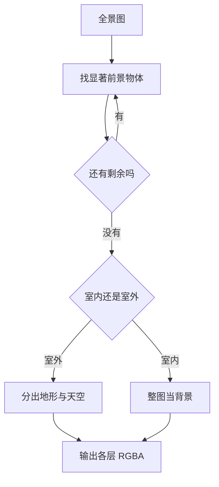

# HunyuanWorld 1.0：先生成一张 360° 的代理，再把世界一层层剥出来

<!-- release-date: 2025-07-26 -->

> 本文依据腾讯混元团队的 **HunyuanWorld 1.0 技术报告**，即 arXiv:2507.21809v2（2025-08-13 修订，22 页）。动笔前核对过 arXiv 提交历史与官方仓库：v2 是目前最新版本，官方仓库只链向同一篇 arXiv，本地件与官方 v2 的前 4 MiB 逐字节一致（受下载上限所限只能比到这里，其余以页数、arXiv 版本水印和 arXiv GenPDF 元数据交叉印证），未做替换。
>
> 全文页码指 PDF 自身页码，本报告的 PDF 页码与印刷页码一致。文中始终区分三件事：**报告写了什么**、**我们如何解释**、**哪些是外部补充**。凡是本文自己算出来的数、自己从图里读出来的东西，都会明说。
>
> 边界说明：报告在前景重建里把 Hunyuan3D 当作可选组件调用，物体级 3D 资产生成本身请看 Hunyuan3D-2.0 的解读；2D 图像生成基座的架构请看 HunyuanImage-3.0 的解读。本文只讲**场景级、世界级**的那一层。

## 读之前：这一篇会用到的十来个词

这是本模块第一篇「从文字或图片生成可探索 3D 世界」方向的解读。它横跨生成模型和计算机图形学两边，两边各有一套词汇。下面只解释读懂本篇所必需的部分，够用即止。

**全景图（panorama）与 ERP**：一张覆盖上下左右全部方向的图。最常见的存法叫**等距柱状投影**（Equirectangular Projection，ERP）：把一个球面摊平成一张 2:1 的长方形图，横轴是经度（左右转一圈 360°），纵轴是纬度（从头顶到脚下 180°）。ERP 有两个必须记住的性质，它们直接决定了报告里的两个设计：

- 图的**最左列和最右列在球面上其实是紧挨着的同一条经线**。在图像里它们相距最远，网络默认没有任何理由让它们接得上，于是生成出来常有一条竖直的接缝。
- **两极被严重拉伸**。球面上头顶的一个点，在 ERP 图里被摊成一整行像素。所以全景图天生带着一种「畸变」，而它不是错误，是投影的必然结果。

**视差（parallax）与 3DoF / 6DoF**：把头**转一转**看四周，叫三自由度（3 Degrees of Freedom，3DoF），只有旋转。把身子**挪一挪**再看，叫六自由度（6DoF），旋转加平移。两者的差别是视差：一旦你平移，近处的东西比远处移动得快，原本被前景挡住的背景就会露出来。**一张全景图只能给你 3DoF**，因为被挡住的那部分内容根本不存在。这句话是整篇报告后半段的起点。

**网格（mesh）**：3D 图形学最主流的表示。一堆顶点连成三角面，面上贴一张图片当颜色，这张图片叫**纹理（texture）**，顶点到纹理坐标的对应关系叫 **UV**。Unity、Unreal、Blender、物理引擎全都原生吃网格，这是报告反复强调「可导出」的原因。

**点云（point cloud）**：只有一堆带坐标的点，没有面。好处是随时可以往里加点，坏处是没有表面，不能直接渲染或做碰撞。报告在世界缓存里用它。

**3DGS（3D Gaussian Splatting，3D 高斯泼溅）**：另一种 3D 表示，用一大堆带位置、朝向、颜色和透明度的椭球去拟合场景。渲染快、画质好，但它是为「看」优化的，不是网格，导进游戏引擎做碰撞和物理并不顺手。报告只把它列为一个备选输出。

**深度图（depth map）与单目深度估计**：一张和原图同尺寸的图，每个像素存的是「这个方向上最近的物体离相机多远」。**单目深度估计**是只看一张图就猜深度的模型。它有一个关键限制：这类模型给出的常常是**相对深度**，整体乘一个系数、加一个常数，看起来一样合理。这叫尺度与偏移的歧义，是后面「跨层深度对齐」那一节的全部理由。

**扩散模型（diffusion model）与 DiT**：一类生成模型。从纯噪声出发反复去噪几十次，每次把图像往真实数据的方向推一点，每一次叫一个**步（step）**。当去噪网络用 Transformer 实现时，叫 **DiT（Diffusion Transformer，扩散 Transformer）**。报告的全景生成模型叫 Panorama-DiT，明确说它基于 DiT 框架（PDF p. 4）。

**VAE 与潜空间**：直接在像素上做扩散太贵，主流做法是先用一个自编码器（Variational Auto-Encoder，VAE）把图压成一个小得多的张量，扩散在这个压缩空间（**潜空间**）里进行，最后解码回像素。报告在图生全景那一路用到它（PDF p. 4）。

**CFG（Classifier-Free Guidance，无分类器引导）**：推理时的常规技巧，同一步里跑两次网络，一次带提示词、一次不带，再把两个结果按系数外推，让输出更贴合提示。代价是每步计算量翻倍。报告在推理优化一节用到它（PDF p. 8）。

**修补（inpainting）与外扩（outpainting）**：给定一张图和一块挖空的区域，让模型把空缺补成合理内容，叫修补；把图往画布外补，叫外扩。报告的「层补全」是修补，「从一张普通照片补成 360° 全景」是外扩。

**HDRI（High Dynamic Range Image，高动态范围环境贴图）**：图形学里表示天空和环境光的标准做法，本质是一张记录了各方向来光强度的全景图，可以直接给引擎当环境光源用。报告把天空层单独导出成 HDRI（PDF p. 7）。

**VLM（Vision-Language Model，视觉语言模型）**：能同时读图和读文字、并用自然语言回答的模型。报告拿它当场景理解和分层的决策者。

## 一句话先说清

世界级 3D 生成卡在一个很硬的地方：**你想生成的那种东西，没有足够的训练数据**。

报告的原话是：物体级的 3D 生成进展很快，而世界级的 3D 生成**仍然严重欠开发**，首要原因就是高质量 3D 场景数据相比图像和视频「少得不成比例」（PDF p. 3）。而世界比物体难得多——室内室外、各种风格、从一个房间到一整座城市的尺度跨度，样样都要覆盖，数据却难以规模化采集（PDF p. 4）。这条路上任何「直接训一个 3D 场景生成模型」的方案，第一步就撞墙。

HunyuanWorld 1.0 的答案不是去补数据，而是换一个东西来生成：

> **找一个数据充足、能直接生成、并且到目标表示之间只隔一步确定性变换的中间物，先生成它。**

这个中间物就是**全景图**。它是 2D 图像，数据可以买、可以下、可以用 Unreal Engine 渲（PDF p. 5）；它天然覆盖 360°，正好对上「沉浸式」这个需求；而只要再有一张深度图，把它抬成 3D 网格是一步**不需要学习**的几何操作。

报告把它叫作**世界代理（world proxy）**（PDF p. 3、p. 4）。

但代理只解决一半问题。全景图给的是 3DoF，只能转头不能走动，因为被前景挡住的内容不存在。于是有了第二个设计：**语义分层的 3D 网格表示**。把场景按人类美术的习惯拆成天空、背景地形、若干物体层，每剥掉一层就把它遮住的地方修补出来。补完之后，那些原本不存在的遮挡内容就有了，视差成立，3DoF 变成有限范围的 6DoF；顺带地，物体被单独拆出来了，于是可以单独平移、旋转、缩放（PDF p. 16）。

所以整篇报告可以压成两句话：

1. **不能生成 3D，就生成一张能代理 3D 的 2D 图。**
2. **一张图只能转头，那就把它剥成好几张，每张都补全。**

而这两句话的共同结果是一件很值得注意的事——本文的判断：**在必经的主流程里，没有任何一个模块是在 3D 场景数据上训练的。** 生成、理解、分割、补全全部发生在 2D；深度估计用的是现成模型；从深度到网格的那一步是闭式几何。这才是这条路线能绕开数据短缺的真正原因。

## 报告地图：22 页里各写了什么

先把篇幅摊开，后面就知道哪些地方能深挖、哪些地方只能到此为止。

| 报告章节 | PDF 页 | 讲了什么 | 密度 |
|---|---|---|---|
| 标题、摘要 | p. 1 | 三个卖点：360°、可导出网格、物体可分离 | 中 |
| Figure 1 | p. 2 | 四个应用方向的整版示意 | 低 |
| §1 引言 | p. 3 | 视频路线与 3D 路线各自的死胡同 | 高 |
| §2 开头 + §2.1 全景生成 | p. 4 | 世界代理、文/图两路输入、两个全景专属对策 | 高 |
| Figure 2 + §2.2 数据 | p. 5 | 全文唯一的架构总图；数据来源与打标 | 高 |
| Figure 3 + §2.3 分层 | p. 6 | 数据流水线图；实例识别与层分解 | 高 |
| §2.3 续 + §2.4 重建 | p. 7 | 层补全；跨层深度对齐；sheet warping | 高 |
| §2.5 远距扩展 + §2.6 工程 | p. 8 | Voyager 一段；存储与推理优化 | 中 |
| Figure 4 + Table 1 + §3.1 | p. 9 | 图生全景样例与指标；评测协议 | 中 |
| Figure 5 + Table 2 + §3.2 | p. 10 | 文生全景样例与指标；渲染设置 | 中 |
| Figure 6–9 | p. 11–13 | 全景生成的定性对比，四整版 | 低 |
| Figure 10–11 | p. 14 | 文生世界、图生世界的样例 | 低 |
| Figure 12–13 | p. 15 | 3D 世界生成的定性对比，两整版 | 低 |
| Table 3/4 + §3.3 + §3.4 | p. 16 | 世界生成的两张指标表；四个应用 | 高 |
| §4 相关工作 | p. 17 | 三条线的综述，含与 LayerPano3D 的划界 | 中 |
| §5 结论 + 贡献者 | p. 18 | 无新信息 | 低 |
| 参考文献 | p. 19–22 | 72 条引用 | — |

四件事必须先知道，否则读完会以为自己漏看了：

- **技术描述只有 p. 3 到 p. 8 这六页。** 其余十六页是图、表、相关工作和名单。p. 11 到 p. 15 整整五页全是定性对比图，一个数字都没有。
- **全文没有一个公式。** 训练目标、深度对齐的目标函数、NMS 的判据，一律只有文字描述。本文用脚本查过：全文连 `loss`、`objective` 这两个词都没有出现过一次。
- **全文没有一个消融实验。** 分层、跨层对齐、循环去噪、俯仰增强、自适应深度压缩、按面积的 NMS、场景感知负向提示——七处设计，零处单独验证。
- **技术章节里只有两个数字。** 本文用脚本核对过 p. 3 到 p. 8 的全部数值：除去章节号、引用编号和「360°」，真正的量化事实只有网格压缩的 **80%** 与 **90%**（PDF p. 8）。**参数量、全景图分辨率、训练数据量、去噪步数、生成耗时、显存占用，一个都没有。** 就连俯仰增强的两个超参也只写成符号 $p$ 和 $r$，没有取值（PDF p. 4）。

顺带一提，报告的文字校对相当粗糙，正文里能直接看到 `vairous`（p. 3）、`stataed`（p. 6）、`pretrianed`、`reconstruciton`（p. 4）、`lager`（p. 7）这类拼写错误。这不影响技术判断，但可以作为一条提示：**这是一份赶在开源发布时间点上放出来的说明文档，不是一份为审稿准备的论文。** 它的重心是讲清系统怎么搭，不是证明每个部件必要。

因此本文的重心不放在复现，而放在两件事：**这条流水线为什么能成立**，以及**它给出的证据能撑到什么程度**。

阅读路线：接下来先讲报告自己开篇讲的那对矛盾，再按流水线顺序走四个核心设计（全景代理 → 分层 → 重建 → 远距扩展），中间插一节数据，然后是工程落地、评测拆解，最后是缺口、启发与判断。**如果你只有十分钟，读「先讲矛盾」「核心一」「核心二」和「评测」四节就够了**，那是这份报告全部的信息密度所在。

## 先讲矛盾：两条旧路各自死在哪

报告的引言（PDF p. 3）把已有工作分成两类，并各给三条批评。这一段值得逐条展开，因为 HunyuanWorld 的每个设计几乎都能对回这里的某一条。

### 视频路线：好看，但它给你的不是世界

视频扩散模型见过海量真实世界的录像，天然懂得物体该怎么遮挡、光该怎么打、镜头动起来画面该怎么变。所以让它生成一段「在场景里走动」的视频，观感非常好，而且题材几乎不受限。有些工作还进一步加上相机轨迹或显式的 3D 点云做空间约束（PDF p. 3）。

报告的三条批评是：

1. **没有真正的 3D 一致性。** 底层表示是一帧一帧的 2D 画面，模型并不真的持有一个场景。生成长序列时误差会累积，导致内容漂移和前后不一致——你转一圈回来，那栋楼可能已经不是原来那栋。
2. **渲染成本高得离谱。** 每一帧都要跑一次生成。你想换个角度看，就得重新生成，而不是重新渲染一次已有的几何。
3. **格式根本接不进图形管线。** 一堆像素帧塞不进游戏引擎，做不了碰撞、做不了物理、做不了交互。

第二条报告只给了结论，机制值得补一句（**这是本文的解释**）：一旦你手上有的是网格，换个角度看只需要一次**光栅化**——GPU 把顶点变换一下、把三角面填上颜色，这是显卡的本职工作，一秒钟能做几百次。而视频模型换个角度看，得把去噪网络从头跑几十步。两者的差距不是百分之几，是**几个数量级**。更关键的是成本结构不同：**网格是一次性投入、边际渲染成本近乎为零；视频是每一帧都要付全价。** 交互式应用（VR 里转个头、游戏里走两步）的画面是按秒几十帧产生的，这个成本结构的差别直接决定了能不能做实时。

第三条最致命，因为它不是质量问题，是**类型不匹配**。你可以等模型变好来解决第一、二条，但第三条无论模型多好都不会自己消失。

### 3D 路线：接得进管线，但生不出来

反过来，直接建模几何结构的方法天生 3D 一致、天生能实时渲染、天生兼容图形管线。物体级的 3D 生成这几年进展很快。但报告指出，**世界级的 3D 生成仍然严重欠开发**（PDF p. 3），原因有三：

1. **数据稀缺。** 高质量 3D 场景数据比图像和视频少得不成比例。
2. **表示不合适。** 现有的生成用 3D 表示，对大规模场景来说要么**无结构**（比如一团没有语义组织的高斯或点），要么**内存效率低**（比如密集体素）。
3. **生成的是铁板一块。** 以往方法输出的是整体的 3D 场景，物体没有被分开，你没法单独抓起一把椅子挪个位置。

### 报告的组合拳

把两张批评单并排看，答案几乎是被逼出来的：

| 需求 | 视频路线 | 3D 路线 | HunyuanWorld 的取法 |
|---|---|---|---|
| 数据够不够 | 够 | 不够 | 在 2D 全景上训练，蹭 2D 的数据 |
| 360° 覆盖 | 要生成很多帧 | 天然可以 | 全景图一张搞定 |
| 3D 一致性 | 弱 | 强 | 输出真正的网格 |
| 接图形管线 | 不行 | 行 | 输出真正的网格 |
| 物体可分离 | 不行 | 通常不行 | 语义分层，每个物体一层 |
| 走远距离 | 强 | 弱 | 再请视频模型回来，但拴上 3D 缓存 |

最后一行是这份报告里一处不太被注意的自洽性问题：引言花了整段批评视频方法缺乏 3D 一致性，到了 §2.5 又把一个视频扩散模型请了回来（PDF p. 8）。区别在于这次它被一个显式的 3D 点云缓存拴住了——后面会专门讲。

## 核心一：为什么代理是全景图，而不是别的

### 代理表示要满足什么

报告没有把「代理」这个概念抽象出来讲，只是用了这个词。下面这三条是**本文的归纳**，用来解释为什么全景图是个好选择，而不是随便挑的：

1. **数据必须充足。** 否则换了代理还是训不出来。全景图可以商业采购、可以下载开源数据集、还可以用 Unreal Engine 直接渲染出无限多张（PDF p. 5）。最后这一条尤其关键：它意味着数据量在原则上不封顶。
2. **信息必须近似等价。** 对「站在一个位置看四周」这件事来说，一张 360° 全景图携带的信息几乎是完整的——它就是你在那个点上能看到的全部。缺的只有被遮挡的部分，而那正是分层要补的。
3. **到目标表示之间必须只隔一步便宜的变换。** 全景图加深度图，用一步确定性的几何操作就能变成网格。不需要再训一个模型，不需要逐场景优化。

第三条是全景图相对其他候选的决定性优势。比如「多视角图片集合」也满足前两条，但从多视角图到 3D 需要做重建或逐场景优化，那一步既慢又容易失败。

### 两种输入，一个出口

报告支持文字和图片两种条件，但都收敛到同一张全景图上（PDF p. 4）。

**文生全景**的第一个坑不在模型，在提示词。用户随口写的一句话，和训练时用的图注在风格与详略程度上差得很远。报告的做法是先用一个大语言模型把中文提示翻成英文并扩写细节，让它对齐训练数据的分布（PDF p. 4）。这一步很朴素，但值得单独说：**它承认了模型的条件分布是被训练数据的图注风格定死的**，与其指望模型泛化到用户的说话方式，不如在入口处把用户的话改写成模型熟悉的话。

**图生全景**的做法分两步（PDF p. 4）：

1. 先用一个预训练的 3D 重建模型（报告举了 MOGE 与 UniK3D 两个例子）估计输入照片的**相机内参**——也就是这张照片的视场角有多大；
2. 有了内参，就能知道照片上每个像素对应球面上哪个方向，于是把它反投影到全景空间的正确位置上，其余部分留空。

之后就是一次外扩：把留空的部分补成完整的 360°，同时保住原图内容。在 DiT 里的接法是先用 VAE 把条件图编码成潜变量，再和噪声潜变量拼接送进模型（PDF p. 4）。

**图生全景还额外挂了一路文本条件**，来自 §2.2 的场景感知提示词生成——这个设计很有意思，放在数据那一节讲。

### 全景专属的两个毛病，两个对策

这是报告在生成模型层面唯一给出的两处具体设计（PDF p. 4）。它们都直接对应本文开头讲的 ERP 两个性质。

**毛病一是接缝。** ERP 图的左右两边在球面上相邻，在图像上却相距最远。普通的生成模型没有任何机制让它们对齐，结果就是转到那个方向时看到一条竖线。

**对策是循环去噪（circular denoising）**：推理时对潜变量做**循环填充**（把右边一段接到左边、左边一段接到右边），并在去噪过程中做渐进式融合，让边界两侧的结构和语义连续（PDF p. 4，做法引自 Diffusion360）。

机制讲清楚就是：循环填充**在张量层面把「最远」变成「最近」**。卷积或注意力原本看不到的跨边界邻居，现在真的成了邻居，模型于是有机会把它们接上。这是一个纯推理期的改动，不用重训。

**毛病二是俯仰。** 全景图通常是相机水平时拍的，地平线固定落在图像中间那一行。如果模型只见过水平的地平线，一旦用户给的照片是仰拍或俯拍，它就不知道该怎么办。

**对策是俯仰感知增强（elevation-aware augmentation）**：训练时以概率 $p$、位移比例 $r$ 把真值全景图**竖直平移**一段，逼模型对视点变化更鲁棒（PDF p. 4）。

这里有一点需要说明，**是本文的判断而不是报告的说法**：严格地讲，相机俯仰旋转在 ERP 图上不是一个平移，而是一个非线性形变——真实的俯仰会把地平线弯成一条曲线，而不是整体上下挪。所以竖直平移只是俯仰变化的一个**廉价近似**。另外，平移之后上下溢出的部分怎么处理（裁掉、补黑、还是环绕），报告没写。这个增强大概率是有效的（它至少打破了「地平线永远在中间」这个虚假先验），但它不等价于真实的视点变化。

### 因果链收尾

| 环节 | 内容 |
|---|---|
| 旧问题 | 3D 场景数据不够，直接训世界生成模型走不通 |
| 新设计 | 用 360° 全景图当世界代理，在 2D 上训练 |
| 工作机制 | 文字走提示词改写；图片走内参估计加反投影再外扩；两路都由 Panorama-DiT 出图 |
| 收益 | 蹭到 2D 的数据规模；一张图就覆盖 360°；下游抬升是闭式操作 |
| 代价 | 只有 3DoF；ERP 的接缝与两极畸变要专门处理；报告没给任何规模与耗时 |

**可迁移的启发**：当目标模态的数据不够时，先问一句——**有没有一个数据充足的近邻模态，能通过一步确定性变换到达目标**。如果有，就把所有学习都放在那个模态里，把跨模态那一步做成不含参数的几何或规则变换。这个套路的适用面比 3D 生成宽得多：把结构化输出问题转成文本生成再解析、把图结构预测转成序列预测再还原，形状都一样。它的代价也一致——**代理丢掉的信息，后面任何环节都补不回来**，所以第 2 条（信息近似等价）必须真的成立，不能自欺。

## 数据：全景图从哪来，以及一处很聪明的负向提示

### 采集与过滤

Figure 3（PDF p. 6）画了完整流水线，报告正文在 p. 5。

**来源有三类**：商业采购、开源数据下载、以及用 Unreal Engine 自己渲染（PDF p. 5）。第三类值得停一下——引擎渲染意味着他们可以按需生产任意风格、任意场景类型的全景图，而且**渲染时天然知道每个像素属于哪个物体、深度是多少**。报告没有说他们是否用了这些副产品，我们也不替它补。

**过滤分两级**：

- **自动**（PDF p. 5、Figure 3）：预处理（去重、缩放、循环位移）、有害内容检测（低俗、暴力等）、质量检测（美学分、水印、清晰度、分辨率、畸变）、人像检测（人体区域、人数）。不达标的直接丢。
- **人工**（PDF p. 5、Figure 3）：请专业标注员挑出三类毛病——几何伪影（明显畸变、可见接缝）、场景不合规（过窄、不具代表性）、内容不一致（物体异常重复、人体或物体异常）。Figure 3 还额外列了「遮挡的极区」和「物体错位」两项。

注意自动过滤里那一条**循环位移（circular shifting）**：把全景图沿水平方向随机转一个角度。这在 ERP 上是**严格等价于相机绕竖直轴旋转**的操作，所以它是一个零代价、零失真的数据增强。对照前面那条竖直平移的近似——**水平方向的增强是精确的，竖直方向的只是近似**，这个不对称正好来自 ERP 投影本身。这一段对比是本文加的。

### 打标：三段式

现成的 VLM 给全景图写图注会翻车，因为全景图信息量远大于普通照片：要么写得太笼统，抓不住细节；要么开始重复和幻觉（PDF p. 5）。报告的三段式做法是：

1. 先用**重新打标（re-captioning）** 的技术生成规整、细节丰富的描述（做法引自 HunyuanDiT）；
2. 再用大语言模型把长描述**蒸馏成一组长短不一的图注**，从高层场景概述到细粒度物体标注都有；
3. 最后请专业标注员核验，消除图文不匹配，压幻觉（PDF p. 5–6）。

第 2 步是个容易被略过但很实用的技巧：**同一张图配多个粒度的图注**，训练时随机取用。这样模型既能应付用户只写五个字的情况，也能应付用户写一整段的情况。前面「文生全景要先扩写提示词」那个设计，和这里是一对——一个从数据侧加宽分布，一个从推理侧把用户拉回分布。

### 场景感知提示词：用负向提示防止「复制雕像」

这是整篇报告里最巧的一处小设计（PDF p. 6）。

**旧问题**：图生全景时，除了图还想加一路文字条件。最直接的做法是让 VLM 给输入图写个图注当提示词。但用户的照片里常有一个显眼主体，比如一座雕像。如果提示词写着「一座雕像」，模型在补全其余 360° 时就会**再画几座雕像出来**——因为提示词是全局作用的，模型不知道那座雕像已经在原图里了。

**新设计**分三步：

1. 先让 VLM 找出输入图里的显著物体，把它们**当作负向提示**，压住模型重复生成；
2. 再让 VLM **想象一个超出输入图范围的完整 360° 场景**；
3. 最后让 VLM 产出一段**分层次**的完整提示词：从前景到背景，从艺术风格到环境氛围。

**为什么有效**：条件生成里，条件是全局施加的，而「已经存在的内容」是局部的。直接把局部内容写进全局条件，等于在要求模型「到处都要有雕像」。把它挪到负向提示，等于在说「除了这里，别处不要有雕像」——**用负向提示表达「这个东西的配额已经用完了」**。

**代价与边界**：这套完全依赖 VLM 判断谁是「显著物体」。如果场景本来就该有一排一模一样的路灯，把路灯打成负向提示反而会破坏内容。报告没有讨论这个失效模式，也没有做消融。

**可迁移的启发**：**当条件的作用范围（全局）和事实的作用范围（局部）不匹配时，用负向条件去表达「已满足」，而不是用正向条件去表达「存在」。** 检索里的去重、推荐里的已曝光过滤、代码生成里的「不要重复已有实现」，都是同一个结构。

## 核心二：分层——把「只能转头」变成「能走动」

### 旧问题说清楚

一张全景图加一张深度图，能拼出一个以相机为球心的曲面。站在球心往四周看，完美；**往前走一步，就穿帮**——原本被前景树干挡住的那块背景，图上根本没有像素，抬升出来的曲面在那里是一个空洞或者一片被拉长的三角面。

这就是 3DoF 与 6DoF 的分界。要支持平移，就必须**凭空造出被遮挡的内容**。

报告的思路来自美术流程（PDF p. 6）：美术做一个 3D 场景时，本来就是分开做的——天空是个天空盒或天空穹顶，地形是一张网格，物体是一件件资产。于是报告把场景分解成**一个天空层（室外才有）、一个背景层、若干物体层**。

分层同时解决了两件事，这是它比「加大模型」更划算的地方：

- **补全遮挡**：剥掉一层就把它遮住的地方补出来，视差就有了内容可露；
- **物体分离**：物体本来就在自己那一层，天然可以单独操作，报告在应用里演示的平移、旋转、缩放（PDF p. 16）不需要任何额外机制。

### 三步走：识别、分解、补全

报告把这套叫**智能体式世界分解（agentic world decomposition）**（PDF p. 6）。Figure 2 中栏（PDF p. 5）里印着完整的提示词，那是全文最具体的实现细节，转述如下：

这张图按 Figure 2 中栏印出的四步提示词（PDF p. 5）重画，只表示决策流程，不含任何时间或性能信息。提示词明确要求的输出是：**一到两张前景图、一张背景图、一张天空图**，全部以 RGBA 格式返回（PDF p. 5）。

所以典型场景是 **3 到 4 层**。这是全文关于「分几层」的唯一量化线索。Figure 2 里那个示例的回答第二步写着「跳过，找不到剩余前景物体了」，说明它只分出了一个前景层。

**第一步：实例识别。** 哪些物体值得单独建模？这需要语义理解和空间关系推理，而生成的场景横跨室内室外、自然景观和游戏风格，所以报告用 VLM 来做，图的就是它的世界知识（PDF p. 6）。识别完还会**按语义和空间关系进一步分成多个子层**——报告举的例子是城市场景里把近处的车和远处的楼分到不同层（PDF p. 6）。

这一句透露了分层的真实判据：**不只按「是不是物体」分，还按「离得远不远」分**。这是对的，因为分层的目的就是制造视差，而视差的大小取决于深度差。深度差不大的东西分到一层里也无所谓。

**第二步：层分解。** 有了语义标签，还得找到物体的确切位置。这里撞上 ERP 的老问题：**一个物体可能被图像的左右边界切成两半**，常规的视觉定位模型会把它当成两个残缺物体（PDF p. 6）。

对策是一串工具链（PDF p. 7）：

1. 先对全景图做**循环填充**，再送进目标检测器（举的例子是 Grounding DINO）。这样跨边界的物体成了连续实体；
2. 检测完把框的坐标**从填充空间映射回原全景图**；
3. 把框交给分割模型（举的例子是 ZIM）生成像素级掩码；
4. 对重叠或破碎的检测结果做 **NMS（非极大值抑制）**，判据是**物体面积大小**（PDF p. 7）。

第 4 步值得多说一句。常规的 NMS 按置信度排序保留框。这里改成按面积，**本文的读法是**：循环填充之后，同一个跨界物体会同时产生「完整的大框」和「两个残缺的小框」，按面积保留就等于保留那个完整的大框，把碎片合并掉。报告的原话也支持这个读法——它说这样能保证「被全景图边界分开的部件级物体被合并」（PDF p. 7）。

**第三步：层补全。** 分割完之后，通过一个**自回归过程**把全景图分解成背景层和天空层：反复地移除已识别的物体，并把被遮挡的区域**修补**出来（PDF p. 7）。

「自回归」在这里的意思不是语言模型那个自回归，而是**这一轮的输出是下一轮的输入**：剥掉第一层前景 → 补全 → 在补全后的图上找第二层前景 → 剥掉 → 补全 → ……直到只剩背景，室外场景再把地形也剥掉，剩下纯天空。

补全模型是怎么来的（PDF p. 7）：

- **物体去除模型**：他们收集了一个全景物体移除数据集，每条是一个**三元组**——物体掩码、含该物体的原全景图、移除该物体后的目标全景图。用它微调 Panorama-DiT。
- **天空补全模型**：在一批天空 HDRI 数据上单独微调一个专用模型。

这里有一个**明显的缺口**：这种三元组极难自然采集——你不可能把现实里的树搬走再拍一张。报告完全没有说这个数据集怎么构造。数据来源里唯一有能力批量生成这种配对的是 Unreal Engine 渲染（同一场景开关某个物体各渲一次），但报告没有把两处联系起来，这只是本文的推测，不是报告内容。

### 一处图文之间的张力

Figure 2 里印的那段提示词，读起来像是 VLM 一个人做完全部四步：它被要求「返回语义标签**与可视化结果**」「返回一张移除了检测物体的图像」「返回各层 RGBA 图」（PDF p. 5）。但 §2.3 的正文说得很清楚：检测由 Grounding DINO 做、分割由 ZIM 做、移除由微调过的 Panorama-DiT 做（PDF p. 7）。

也就是说，VLM 实际扮演的是**编排者**：它决定找什么、分几层、循环几次、室内还是室外，具体像素由后面的工具链产出。「agentic」这个词的分量正在于此。但**报告没有说明 Figure 2 的提示词与 §2.3 的工具链如何对应**——是 VLM 真的在调用这些工具，还是提示词只是流程的示意写法，读者无从判断。我们只标出这处张力，不替报告改写。

### 因果链收尾

| 环节 | 内容 |
|---|---|
| 旧问题 | 单张全景图没有遮挡内容，只能 3DoF，走一步就穿帮 |
| 新设计 | 按美术习惯做语义分层：天空、背景、若干物体层 |
| 工作机制 | VLM 编排；循环填充加检测加分割定位；自回归地剥离与修补 |
| 收益 | 造出遮挡内容，视差成立；物体天然可单独操作 |
| 代价 | 层数由 VLM 判断，典型只有 3 到 4 层；补全内容是编造的，没有真值；层补全的训练数据来源未公开 |

**可迁移的启发有两条。** 第一，**沿着已有的人类工作流去切问题，通常比按模型方便去切更好用**。分层不是为了模型好训，是因为美术本来就那么建场景，所以输出天然对得上下游工具。第二，**同一个分解如果能同时服务两个目标，它的性价比就翻倍**：这里的分层既造出了视差内容，又白送了物体级可交互性，一次投入两份收益。设计分解方式时值得多问一句：这个切法还能顺手解决别的什么问题？

## 核心三：重建——难点全在深度对齐上

有了分层图像，接下来是把它们变成 3D。报告分两步：层对齐深度估计，和逐层 3D 生成（PDF p. 7）。

### 为什么深度必须跨层对齐

先说清楚问题。单目深度估计模型给出的往往是**相对深度**：把整张图的深度乘 2，看起来同样合理。这叫尺度歧义，很多模型还带偏移歧义。

现在你手上有好几张图：原始全景图、剥掉第一层前景之后的图、再剥一层之后的图、最后的背景图。**如果各估各的，它们的深度会落在互不相干的几套刻度上。** 结果可能是：背景层的山被估得比前景层的树还近。抬升成网格之后，山会穿到树前面去——层与层的遮挡关系整个反了。

报告的解法（PDF p. 7）：

1. 先在**原始全景图**上跑深度估计（用 MOGE 或 UniK3D 这类模型），得到一张**基准深度图**；
2. 第一层前景的深度，直接从基准深度图里按掩码抠出来——它本来就在原图上可见，刻度天然一致；
3. 后续各层（第二层及以后的前景层、以及移除前景后的背景层）**各自单独估深度**，然后用深度匹配的方法**与基准深度图对齐**，目标是最小化各层在**重叠区域**上的距离；
4. **天空层**不估深度，直接设成一个常数，取值比所有已有层的最大深度**略大一点**，保证天空永远在最远处。

第 3 步的关键词是「重叠区域」。**本文的读法是**：把前景剥掉再补全之后，这张背景图上除了被补出来的那一小块，其余像素和原全景图是同一批内容。这批共有像素就是重叠区域，在这上面把两套深度对齐（拟合出一个缩放和偏移），补出来的那一小块也就跟着落到正确刻度上了。**报告没有说明它拟合的是什么形式的变换、用的什么损失**，所以以上只是机制的合理复原，不是报告原文。

第 4 步那个「略大一点」也值得说一句，**这是本文的解释**：为什么不直接设成无穷远？因为要导出成有限的网格，无穷远没法表示；而且如果把天空放得极远，整个场景的包围盒会被撑得很大，深度缓冲的精度会被浪费在没有内容的空区间上。取一个「刚好比最远的东西再远一点」的值，既保证遮挡顺序正确，又让整个世界待在一个紧凑的盒子里。

### 抬升：一步不需要学习的几何

重建用的是 **sheet warping（薄片变形）**，网格表示沿用 WorldSheet 的做法（PDF p. 7）。

机制其实非常简单，说清楚就不神秘了：准备一张规则的网格「薄片」（Figure 2 右下角标着 `Grid sheet`，PDF p. 5），薄片上每个顶点对应全景图上的一个位置，因此也就对应球面上的一个确定方向；然后**把每个顶点沿着它自己那个方向推出去，推的距离就是那个位置的深度值**。网格的连接关系一点不变，只有顶点位置在变。层的图像直接当纹理贴上去。（这张薄片的网格分辨率有多细，报告没有给——它直接决定输出网格的面数和细节保真度。）

这一步的性质决定了整条流水线的可行性：**它没有参数，不需要训练，不需要逐场景优化，一次算完。** 前面所有的学习都发生在 2D，这里只是一次几何计算。

各层的具体处理（PDF p. 7）：

| 层 | 做法 | 报告给的理由 |
|---|---|---|
| 前景（方案一） | 按深度和语义掩码直接薄片变形；额外做极区平滑与网格边界抗锯齿 | 保证从带掩码的全景图变形出来的网格质量 |
| 前景（方案二） | 按实例掩码抠出物体，交给图生 3D 模型生成完整物体，再用一套自动摆放算法放回场景 | 得到高质量的完整 3D 物体资产 |
| 背景 | 先做**自适应深度压缩**，再薄片变形 | 处理深度离群值，保证深度分布合理 |
| 天空 | 用常数深度薄片变形；也支持导成 HDRI 环境贴图 | HDRI 在 VR 里渲染更真实 |

三处需要展开。

**前景的两条路，差别是本质性的。** 方案一得到的是一片「贴着物体正面的曲面」——从正面看没问题，绕到侧面就会发现它是空心的、没有背面。方案二得到的是一个真正闭合的 3D 物体。报告举的图生 3D 模型是 Hunyuan3D 系列（PDF p. 7）。**这里就是本篇的边界**：Hunyuan3D 在流水线里的角色只是「把一张物体图变成一个完整网格」，它接在前景层之后、摆放算法之前；它内部怎么做几何与纹理生成，属于物体级 3D 资产生成方向，请看 Hunyuan3D-2.0 的解读，本文不展开。报告也没有说这个可选分支的开销、成功率，或者什么情况下该选它。

**背景的自适应深度压缩**只有一句话，没有算法。**本文的解释**是：室外背景的深度动态范围极大，近处的草地几米，远处的山几公里。单目深度在远距离本来就不准，而把这么大的深度范围直接变形成网格，会产生大量被拉得极长的三角面，既难看又浪费。把深度分布压一压，牺牲远处的几何精度换网格质量——**这个牺牲在视觉上几乎不亏，因为远处的东西在平移时本来就几乎不动**。报告没有这样解释，也没有给压缩函数。

**极区平滑与边界抗锯齿**同样只有名字。极区是 ERP 拉伸最狠的地方，一个点摊成一整行，薄片变形出来会是一圈退化的三角面；掩码边界则会产生锯齿状的网格边缘。报告点了这两个问题的名，但没写做法。

### 两个附加选项

- **3DGS 作为备选表示**：报告说也支持基于深度优化一个分层的 3DGS 表示，作为网格的替代（PDF p. 8）。只有一句话，没有细节，没有对比。
- **重建期的循环填充**：为了处理 ERP 的跨边界一致性，重建过程中也用循环填充，保证全景图边界处的过渡无缝（PDF p. 8）。注意这是**第三次**出现循环填充了——生成时（循环去噪）、检测时（跨界物体）、重建时（网格接缝）。**同一个几何事实在三个完全不同的模块里各要打一次补丁**，这本身就是一条很有说服力的观察：**投影方式的选择会在流水线的每一层留下税**。

### 因果链收尾

| 环节 | 内容 |
|---|---|
| 旧问题 | 各层单独估深度会落在互不相干的刻度上，遮挡关系会错乱 |
| 新设计 | 先在原图上估一张基准深度，后续层在重叠区域上向它对齐；天空取常数 |
| 工作机制 | 薄片变形：规则网格的每个顶点沿自身方向按深度推出去，无参数 |
| 收益 | 3D 化这一步完全确定性，不需要 3D 训练数据，也不需要逐场景优化 |
| 代价 | 每层仍是一张薄片，走远了会看见它没有厚度；对齐的具体形式未公开；极区与边界的处理未公开 |

**可迁移的启发**：**把系统里「必须学」和「可以算」的部分划清楚，尽量把跨模态那一步留在「可以算」的一侧。** 学习的部分越集中在数据充足的模态里，整个系统的数据需求就越低。另外，**当多个模块各自输出同一物理量的估计时，一定要指定一个基准，让其余的向它对齐**，而不是让它们各自独立——多目标估计里刻度不一致导致的错误，往往比单个估计本身的误差大得多。

## 核心四：真正走远，还是得请视频模型回来

分层解决的是「在原视点附近能走动」。但要走到远处、走进全景图完全没拍到的区域，层数再多也不够——那里的内容根本不在这张全景图的信息里。

报告的答案是引入 **Voyager**，一个基于视频的视角补全模型（PDF p. 8）。Voyager 是另一篇独立论文（arXiv:2506.04225），作者与本报告高度重叠但也含外部合作者；本报告只用一段话描述它，我们也只讲这一段。

**世界一致的视频扩散**（PDF p. 8）：Voyager 用一个**可扩展的世界缓存（world cache）** 来维持空间一致性、防止视觉幻觉。流程是：

1. 用已生成的 3D 场景构建一个初始的 **3D 点云缓存**；
2. 把这个缓存**投影到目标相机视角**，得到一张不完整的画面，当作扩散模型的**部分引导**；
3. 生成出来的新帧**反过来更新并扩展**这个缓存。

这就成了一个闭环：缓存约束生成，生成扩充缓存。报告说它因此支持任意相机轨迹，同时保持几何连贯。

**长距离探索**（PDF p. 8）：一次性生成长视频不现实，所以做**自回归的场景扩展**——世界缓存累积所有已生成帧的点云，配一个**点剔除（point culling）** 方法去掉冗余点来控制内存；再用一套平滑采样策略，让相邻片段之间的过渡无缝。

**这一节需要讲清楚的判断有三条。**

第一，**这是对引言里第一条批评的一次正面回应**。视频模型的问题是没有持久的 3D 状态，于是错误会漂移。世界缓存就是把那个缺失的状态**显式补上**：模型每一步的输入里都带着「这个位置以前长什么样」，所以它不能随便改主意。这个模式在别处也很常见——**给一个只会向前看的生成器外挂一份可写的、结构化的记忆**，本质和检索增强、和 agent 的外部状态是一回事。

第二，**点剔除揭示了这套机制的真实成本**。缓存是单调增长的，走得越远点越多，投影和存储的开销跟着涨。报告承认需要剔除来控制内存，但**没有给任何数字**：缓存上限多少、剔除策略是什么、走多远之后质量开始掉，一概没有。

第三，也是最重要的一条：**§3 的评测里完全没有远距离扩展。** 四张表全部是全景生成和全景附近的世界生成。标题里的「可探索（explorable）」在定量证据上只被验证到「在原视点附近渲染若干视角」这个程度。Voyager 这一段在本报告里没有任何实验支撑——如果你关心它，应该去读 Voyager 自己那篇论文，不要把本报告的结论套上去。

## 代理必然丢掉的东西

代理表示的第二个条件是「信息近似等价」。前面说过，全景图对「站在一个点上看四周」这件事几乎是完整的。但「几乎」两个字里藏着五样东西，**报告一样都没有讨论**，以下全部是本文的分析。

**一、被遮挡的内容。** 这是唯一被正面解决的一项，办法是分层加修补。但要注意两条边界：典型只分三到四层（PDF p. 5），所以能制造的视差深度有限；而且补出来的像素是**模型编造的**，没有真值，也没有任何指标去衡量它编得对不对。

**二、球外的世界。** 隔壁房间、山那一头、街道拐角之后，全景图里根本没有。分层再多也变不出来，只能靠 §2.5 的 Voyager 往外生成。这就是为什么「可探索」这个卖点必须挂在一个额外的视频模型上，而那个模型在本报告里没有任何实验。

**三、视角相关的光学效果。** 全景图是从一个固定点拍/生成的，水面的高光、金属的反射、玻璃的折射，全都是**那个视点上**的观感，被烤进了纹理里。你走到旁边，高光不会跟着移动，镜子里的像不会变。所有「图像抬升成网格」的路线都有这个通病，它不是实现缺陷，是表示本身的信息缺失。

**四、光照与材质没有分离。** 输出的是带纹理的网格，而纹理里已经含了拍摄/生成时的光照和阴影。导进引擎之后你换一盏灯，地面的阴影不会跟着变。天空导成 HDRI 确实提供了环境光（PDF p. 7），但那只是给**新加进去的物体**打光用的，原有地形纹理上的阴影是死的。这对游戏和影视流程是一个很实际的限制。

**五、这个世界是静止的。** 生成结果没有时间维度：树不摇，水不流，光不变。所谓「可交互」，指的是**用户手动**对物体做平移、旋转、缩放（PDF p. 16），不是场景自己会动。报告唯一一次把自己的输出和「动」联系起来，是说导出的网格可以进物理引擎做碰撞检测、刚体动力学和流体仿真（PDF p. 16）——那是**引擎让静态网格动起来**，不是模型生成了动态。这一点必须说清楚，因为「世界模型」这个词在语言模型和自动驾驶的语境里通常暗示对未来的动态预测，而这里不是。

把这五条放在一起，对这份报告最准确的定位是：**它生成的是一个可以走进去看、可以摆弄物体、可以接进引擎的静态布景，不是一个会自己运转的世界。** 这不降低它的价值——静态布景正是游戏和 VR 里工作量最大的那部分——但它划出了这条技术路线今天的边界。

## 落地：存储和推理上的四处工程

§2.6（PDF p. 8）是报告里最实的一节，因为它给出了全篇仅有的两个量化数字。

### 网格太大，两套压缩

一个 3D 场景的网格加载和存储都很沉。报告按**离线**和**在线**两种场景给了两套策略：

| 场景 | 做法 | 体积缩减 | 报告给的取舍 |
|---|---|---|---|
| 离线高质量内容准备 | 网格简化 → 纹理烘焙 → UV 展开（用 XAtlas 方案） | **80%**（PDF p. 8） | 质量好，但处理时间长 |
| 在线网页部署 | Draco 压缩 | **90%**（PDF p. 8） | 渲染质量与未压缩相当，原生支持 WebAssembly，浏览器兼容性好 |

这里有个细节值得点出来：报告特意说明选 XAtlas 做 UV 展开的理由是它**在保持 UV 质量的同时消除了渲染接缝**，比朴素的展开方法好（PDF p. 8）。UV 展开就是把 3D 网格「剪开摊平」到一张二维纹理上，剪缝的位置和摊平的方式直接决定渲染时会不会看到裂纹。这是很典型的图形工程活，和生成模型无关，但它决定了输出能不能真的用。

### 推理加速：三件事

报告的推理优化基于 **TensorRT**（PDF p. 8），把扩散 Transformer 转成优化后的推理引擎，另外做了三件事：

1. **缓存与非缓存两种模式共享显存分配**，减少 GPU 开销；
2. **选择性缓存**：对**不关键的去噪步**走缓存推理，对**显著影响生成质量的关键步**走完整计算；
3. **CFG 的多卡并行**：正向提示和负向提示两路条件**同时在不同设备上算**，用多线程执行，最后同步聚合结果。

第 3 点值得展开，**因为它的性质和前两点完全不同**。CFG 每一步要跑两次网络，这两次**互不依赖**，所以可以放到两张卡上同时算。这是一个**只降延迟、不降总算力**的优化：总浮点运算量一点没变，墙钟时间大约减半，代价是 GPU 数量翻倍。报告没有把这一点说破，但对做部署的人来说，这个区分是关键的——**它优化的是单请求延迟，不是吞吐**。如果你的服务是高并发批量场景，把两张卡各跑一个完整请求，吞吐反而更高。

第 2 点的**选择性缓存**属于扩散推理里一个成熟的方法家族（复用相邻去噪步之间变化不大的中间特征）。但报告**既没有说用的是哪个方法，也没有给判定「关键步」的准则**，更没有给加速比。

**可迁移的启发**：这一节其实示范了三种性质不同的优化，值得分清楚——**改变数据大小的**（网格压缩，80% 与 90%）、**跳过重复计算的**（选择性缓存，有精度风险）、**把串行摊成并行的**（CFG 双卡，无精度风险但要多花硬件）。做性能工作时先给每一项优化归类，能避免把「省了钱」和「花了更多钱换时间」混为一谈。

## 评测：四张表证明了什么，又没证明什么

### 先看指标是什么

报告说因为没有真值可比，所以从两个角度评（PDF p. 9）：**输入输出的对齐程度**，以及**视觉质量**。

| 指标 | 方向 | 它到底在测什么 |
|---|---|---|
| CLIP-I | 越高越好 | 生成结果与输入**图片**在 CLIP 嵌入空间里的相似度 |
| CLIP-T | 越高越好 | 生成结果与输入**文字**在 CLIP 嵌入空间里的相似度 |
| BRISQUE | 越低越好 | 无参考画质评估：从图像统计特征回归出一个「像不像被损伤过的自然照片」的分数 |
| NIQE | 越低越好 | 同样是无参考画质，但完全不看人工标注，只算这张图离「原生自然照片」的统计模型有多远 |
| Q-Align | 越高越好 | 用一个多模态大模型按离散的文字档位（差／较差／一般／好／优秀）给画质打分 |

**这里必须补一条外部背景**（报告没写）：BRISQUE（IEEE TIP，2012）与 NIQE（IEEE SPL，2013）都是十多年前的方法，它们的设计假设是**自然照片加上常见损伤**（压缩、模糊、噪声）。而这份报告展示的内容大量是水墨、吉卜力、卡通、红外热成像这类高度风格化的画面（PDF p. 10、p. 14）。这类图像在自然图像统计模型下本来就「不自然」，所以这两个分数在风格化内容上的含义是打折扣的。它们仍然可以做横向对比（所有方法都吃同样的偏差），但**不适合当成绝对画质的度量**。Q-Align 是这五个里唯一为生成内容与人类判断对齐而设计的。

报告也没有说明 Q-Align 分数的量纲。观察到的取值在 1.8 到 4.4 之间（PDF p. 9、p. 10、p. 16），**本文推测**它对应五个文字档位折算出来的 1 到 5 分制，但报告没写，不能当结论。

### 全景生成：两张表

**图生全景**（Table 1，PDF p. 9）：

| 方法 | BRISQUE ↓ | NIQE ↓ | Q-Align ↑ | CLIP-I ↑ |
|---|---:|---:|---:|---:|
| Diffusion360 | 71.4 | 7.8 | 1.9 | 73.9 |
| MVDiffusion | 47.7 | 7.0 | 2.7 | 80.8 |
| HunyuanWorld 1.0 | **45.2** | **5.8** | **4.3** | **85.1** |

**文生全景**（Table 2，PDF p. 10）：

| 方法 | BRISQUE ↓ | NIQE ↓ | Q-Align ↑ | CLIP-T ↑ |
|---|---:|---:|---:|---:|
| Diffusion360 | 69.5 | 7.5 | 1.8 | 20.9 |
| MVDiffusion | 47.9 | 7.1 | 2.4 | 21.5 |
| PanFusion | 56.6 | 7.6 | 2.2 | 21.0 |
| LayerPano3D | 49.6 | 6.5 | 3.7 | 21.5 |
| HunyuanWorld 1.0 | **40.8** | **5.8** | **4.4** | **24.3** |

两张表都是全线领先。最值得注意的一栏是 **Q-Align**：4.3 与 4.4，比第二名（2.7 与 3.7）高出一大截。如果 Q-Align 确实更贴近人类判断，那么这两栏的说服力大于 BRISQUE 与 NIQE。

评测设置（PDF p. 9、p. 10）：图片测试集来自 World Labs 的博客、Tanks and Temples 数据集，以及真实用户投稿；文字测试集是众包来的提示词集，覆盖不同场景类型、风格和长度。渲染方式是从生成的全景图渲**六个 90° 视场角的透视视角**，每个 **960 × 960**，位置经过安排以完整覆盖 360°。

顺手算一笔（**本文的算术**）：六个视角、每个水平 90°，加起来是 540° 的水平覆盖，摊在 360° 的一圈上，平均每个方向被 1.5 个视角覆盖，所以视角之间是有重叠的，不是恰好拼满。

### 3D 世界生成：两张表

**图生世界**（Table 3，PDF p. 16）：

| 方法 | BRISQUE ↓ | NIQE ↓ | Q-Align ↑ | CLIP-I ↑ |
|---|---:|---:|---:|---:|
| WonderJourney | 51.8 | 7.3 | 3.2 | 81.5 |
| DimensionX | 45.2 | 6.3 | 3.5 | 83.3 |
| HunyuanWorld 1.0 | **36.2** | **4.6** | **3.9** | **84.5** |

**文生世界**（Table 4，PDF p. 16）：

| 方法 | BRISQUE ↓ | NIQE ↓ | Q-Align ↑ | CLIP-T ↑ |
|---|---:|---:|---:|---:|
| Director3D | 49.8 | 7.5 | 2.7 | 23.5 |
| LayerPano3D | 35.3 | 4.8 | 3.9 | 22.0 |
| HunyuanWorld 1.0 | **34.6** | **4.3** | **4.2** | **24.0** |

Table 4 是全篇最诚实的一张表：**在文生世界上，和 LayerPano3D 的画质几乎打平**（BRISQUE 35.3 对 34.6，NIQE 4.8 对 4.3，Q-Align 3.9 对 4.2），真正拉开距离的是文本对齐（CLIP-T 22.0 对 24.0）。

把 Table 2 和 Table 4 并排看会发现更有意思的事。LayerPano3D 在全景表上是 49.6，在世界表上是 35.3；本文方法从 40.8 掉到 34.6。同一个方法在两张表上的 BRISQUE 差这么多，**本文的推断**是：Table 1 与 Table 2 的画质分算在 **ERP 全景图本身**上，而 Table 3 与 Table 4 算在**渲染出来的透视视角**上——ERP 图的两极拉伸会被无参考画质指标当成「不自然」而扣分，透视图没有这个问题。报告的措辞其实也暗示了这一点：p. 10 说的是「衡量生成全景图的视觉质量」，p. 16 说的是「所有新视角都渲染在 960 × 960」。**结论是：这两组表之间不能直接比较。** 报告没有提醒这一点。

### 一处必须指出的协议不对称

两组世界生成的评测，**相机轨迹完全不同**（PDF p. 16）：

| 对比 | HunyuanWorld 的渲染 | 对手的渲染 |
|---|---|---|
| 图生世界 | 七个视角，方位角 {0°, 15°, 30°, 45°, 60°, 75°, 90°} | DimensionX 用它自己的轨道 LoRA 与预定义的 90° 环绕轨迹；WonderJourney 用向右转 90° 的轨迹 |
| 文生世界 | 六个视角，方位角 {0°, 60°, 120°, 180°, 240°, 300°} | LayerPano3D 用同一套协议；Director3D 用它自己模型预测的轨迹 |

报告对每处差异都给了理由（比如 Director3D 的表现高度依赖它自己预测的轨迹），这是诚实的。但有一个结论必须自己算出来（**本文的观察**）：**图生世界的评测只扫了 90° 的方位角。** 七个视角的中心从 0° 排到 90°，每个视场 90°，所以水平覆盖是 -45° 到 135°，合计 180°——**正好是一圈的一半，另外半圈一次都没看过**。而 360° 全覆盖是这篇报告的头号卖点。换句话说，**Table 3 的数字完全没有考验模型转身之后的表现**，它只在与对手能力对齐的那个弧段上比。文生世界的 Table 4 才是真正扫了一圈的。

这不是造假——两个图生世界的基线本来就只能做 90°，要公平就只能这么比。但读者要知道**这两张表的严苛程度不一样**。

### 这套评测最大的缺口

把五个指标再看一遍：CLIP-I、CLIP-T 测「像不像输入」，BRISQUE、NIQE、Q-Align 测「这张图好不好看」。

**没有一个指标测 3D。**

具体说，下面这些东西一个都没有被量化：

- **几何是否正确**：深度估得准不准，物体的相对位置对不对；
- **多视角是否一致**：从不同角度看同一个东西是不是同一个东西；
- **层间遮挡是否正确**：这正是跨层深度对齐要解决的问题，而它没有任何验证；
- **导出的网格是否可用**：面数多少、是否封闭、能不能过物理引擎；
- **物体是否真的可独立操作**：分割干不干净，挪走之后留下的洞补得如何；
- **能走多远**：远距离扩展的一致性完全没测。

而 immersive（沉浸）、explorable（可探索）、interactive（可交互）正是标题里的三个词。**报告用「从生成的世界里渲染出的图片更好看、更贴合输入」来支撑这三个主张，这中间隔了一层。**

再加上**全文没有任何消融、也没有任何人工评测**——对照同厂后来的 HunyuanVideo 1.5 报告（本站另有解读）整套结论都建立在人工评测上，这份报告一次人工打分都没做。所以准确的表述是：

> **这四张表证明的是「HunyuanWorld 生成的画面质量与条件对齐都优于所列基线」。它没有证明、也没有试图证明「HunyuanWorld 的 3D 结构更正确」。**

至于基线的选择：七个对手（Diffusion360、MVDiffusion、PanFusion、LayerPano3D、WonderJourney、DimensionX、Director3D）全部是 2023 到 2024 年的学术工作。引言与相关工作里点名的 Cosmos、Genie 2 这类视频世界模型一个都没有进对比表，连自家用作远距扩展组件的 Voyager 也没有；World Labs 只作为测试图片的来源出现（PDF p. 9），不作为对比方法。

## 应用与定位

### 四个应用方向

§3.4（PDF p. 16）与 Figure 1（PDF p. 2）给了四个方向，全部是定性描述，没有任何测量：

| 方向 | 靠哪个特性 | 报告写的具体内容 |
|---|---|---|
| 虚拟现实 | 360° 全景代理 | 可直接部署到 Apple Vision Pro、Meta Quest 等平台；完整空间覆盖消除了视觉伪影和边界不连续 |
| 物理仿真 | 可导出网格 | 网格直接进物理引擎，做碰撞检测、刚体动力学、流体仿真 |
| 游戏开发 | 可导出网格 + 风格多样 | 导出标准网格格式，接 Unity 与 Unreal；覆盖外星地貌、中世纪废墟、历史古迹、未来都市等 |
| 物体交互 | 解耦的物体表示 | 对单个物体做平移、旋转、缩放，不影响周围环境 |

值得注意的是这四条**全部落在「可导出」和「可分离」上，没有一条依赖模型本身有多强**。这与前面的判断一致：这条路线的价值主要来自表示的选择，不是来自某个网络设计。

### 相关工作把这个领域切成了三块

§4（PDF p. 17）值得看一眼，因为它交代了这份报告认为自己站在哪。

| 分支 | 报告点名的代表工作 | 报告给的判断 |
|---|---|---|
| 沉浸式场景图像生成 | MVDiffusion、PanoDiff、DiffPano 把扩散模型适配到全景；后续工作往里加球面一致性、深度这类空间先验；CubeDiff 从一个立方体贴图面出发合成其余五面 | 本文的定位是一个**可规模化**的全景生成模型，文本和图像条件都支持，并配了专门的数据流水线 |
| 视频式世界生成 | HunyuanVideo、CogVideo-X、Wan-2.1 打底；CameraControl 与 Cosmos 把相机位姿编成 Plücker 坐标（一种把每个像素对应的光线写成六维向量的表示，让网络直接看得见「这个像素来自哪条射线」）；Streetscapes 用多帧布局条件加自回归；Voyager 与 Wu 等人用显式 3D 点；游戏方向有 Genie 2 和 Matrix 做键盘可控的交互式视频；自动驾驶方向从文本、鸟瞰图、检测框、驾驶动作生成视频 | 缺 3D 表示，因此渲染成本高、长距离不一致 |
| 3D 世界生成 | **程序化**：规则式（可追到 1989 年的分形地形侵蚀）、优化式、以及 LayoutGPT 和 SceneX 这类 LLM 驱动的布局生成；**学习式**：用 3D 一致数据微调扩散模型生成密集多视角，再逐场景做 3D/4D 高斯优化；DimensionX 用 LoRA 解耦时空；另一批用渐进式修补加深度引导；再一批先补全全景的遮挡区域，再抬成 3DGS | 本文属于学习式，但输出的是**分层网格资产** |

这张表里有一条容易被忽略的信息：**学习式 3D 世界生成里，主流做法的最后一步都是「逐场景优化」**——生成多视角图，然后针对这一个场景跑一遍 3DGS 或 NeRF 的优化。那一步慢且不稳定。HunyuanWorld 用深度加薄片变形把它换成了一次闭式计算，这是它在推理开销上的真实优势来源，报告没有把这一点单独强调。

### 与 LayerPano3D 的划界

相关工作（PDF p. 17）里有一句最能说明定位的话：LayerPano3D 已经提出过「用**深度聚类**把全景图里的不同成分解耦，再做 3DGS 重建」，报告承认它「凸显了分层表示的有效性」；而本文的目标是「生成能直接插进现有计算机图形工作流的**分层网格资产**」。

把这句话拆开，差异有两条：

1. **怎么分层**：LayerPano3D 按深度聚类，也就是按几何远近分；HunyuanWorld 按 VLM 的语义理解分，还会进一步按空间关系分子层。**语义分层的好处是分出来的层就是「一个物体」，可以单独操作**；深度分层分出来的可能是「所有距离在 5 到 8 米之间的东西」，那是一片，不是一件。
2. **输出什么**：一边是 3DGS，一边是网格。3DGS 渲染效果好，但不是图形管线的原生公民。

而 Table 2 与 Table 4 里，LayerPano3D 恰恰是最强的基线。所以这两个方法的关系是：**同一个大思路（分层全景）的两种实现，主要分歧在「按什么分」和「输出成什么」。** HunyuanWorld 在文生全景阶段领先明显，到了文生世界阶段画质已经接近，优势主要留在文本对齐上。

## 报告没有写的部分

一份技术描述只有六页的报告，缺口相当多。把它们按类别列清楚，免得把「没写」误当成「不重要」。

**规模与成本，整体缺席**

- Panorama-DiT 的参数量、层数、维度，一个数都没有。它从哪个预训练图像模型初始化也没写（2D 图像生成基座的架构见 HunyuanImage-3.0 的解读）。
- 全景图的生成分辨率没有给。ERP 图的宽高直接决定网格顶点数和最终画质，这是缺得最可惜的一个数。
- 训练数据量（多少张全景图）、训练算力、GPU 数量、训练时长，一律没有。
- 去噪步数、单次生成耗时、显存占用，一律没有。§2.6 讲了怎么加速，但没给加速前后的任何数字。
- 层补全模型、天空补全模型的训练数据规模没有给。

**方法细节缺失**

- 俯仰增强的概率 $p$ 与位移比 $r$ 只有符号，没有取值；平移后的溢出区域怎么处理也没写。
- 跨层深度对齐拟合的是什么形式的变换（只有缩放？缩放加偏移？）、用的什么损失，没写。
- 背景的「自适应深度压缩」只有名字，没有函数。
- 极区平滑与网格边界抗锯齿只有名字，没有做法。
- 前景物体的「自动摆放算法」只有名字，没有描述。
- 天空常数深度里那个「略大一点」到底大多少，没写。
- 选择性缓存判定「关键步」的准则没写，也没给加速比。
- 3DGS 那条备选路径只有一句话。

**数据来源缺失**

- 层补全所需的三元组（掩码、含物体的原图、移除后的目标图）怎么构造，完全没写。这是全篇最难获取的数据，却一个字都没有。
- 各来源（采购、开源、UE 渲染）的配比没有给。
- 自动质检各项的阈值没有给。

**验证缺失**

- **零消融。** 分层、跨层对齐、循环去噪、俯仰增强、循环填充检测、按面积 NMS、场景感知负向提示，七处设计没有一处被单独验证。
- **零 3D 指标。** 几何精度、多视角一致性、网格可用性、物体分离质量，全都没测。
- **零人工评测。**
- **远距离扩展零评测。** §2.5 的 Voyager 在本报告里没有任何实验。
- 提示词集与图片集没有公开，评测的样本量没有给。
- 失败案例一个都没有展示。

**自身边界未讨论**

- 前面「代理必然丢掉的东西」那五条，报告一条都没有提：遮挡内容是编造的、球外世界必须外挂视频模型、视角相关的光学效果被烤进纹理、光照与材质没有分离、输出是完全静态的。
- 失效模式一个都没有分析：VLM 认错物体会怎样、分割不干净会怎样、深度估错会怎样、场景感知负向提示压掉了本该重复的元素会怎样。
- 与视频路线的正面对比没有做。引言用整段论证视频方法不行，实验里带视频扩散血统的对照却只有 DimensionX 一个，引言点名的那类专门的视频世界模型一个都没上。

**图文之间的两处张力**

- Figure 2 的提示词读起来像 VLM 独立完成四步，而 §2.3 说检测、分割、移除各有专用模型；两者如何对应没有说明。
- 引言批评视频方法缺乏 3D 一致性，§2.5 又引入一个视频扩散模型；报告没有正面讨论这个转折。

## 可以带回自己项目的几条

**一、当目标模态没有数据时，找一个数据充足的代理模态。** 判据有三条：数据够、信息近似等价、到目标之间只隔一步确定性变换。第三条最容易被忽略却最关键——如果从代理到目标还需要再训一个模型或者逐样本优化，你只是把问题挪了个地方。全景图之所以是好代理，就是因为「加上深度，一步几何算完」。

**二、把「必须学」和「可以算」划清楚，尽量让学习集中在一侧。** 这条流水线的主路径上没有一个模块在 3D 场景数据上训练过：生成、理解、分割、补全全在 2D，深度用现成模型，抬升是闭式几何。系统的数据需求因此塌缩到「2D 全景图」这一项上。设计任何跨模态系统时，都值得先画一张表，把每个模块标上「学」还是「算」，再看能不能把某个「学」改造成「算」。

**三、一个分解如果能同时服务两个目标，性价比翻倍。** 语义分层既造出了视差所需的遮挡内容，又白送了物体级可交互性。选择分解方式时多问一句：这个切法还能顺手解决什么？

**四、沿人类已有的工作流去切问题。** 天空、地形、物体这个分法不是为了模型方便，是美术本来就这么建场景。好处是输出天然对得上下游工具链——这比事后写转换器可靠得多。

**五、多个模块估计同一个物理量时，指定基准再对齐，别让它们各自独立。** 跨层深度对齐的教训很普适：三个单目深度估计各自都可能很准，合在一起却完全错乱，因为它们的刻度不一致。凡是「分别估计、合并使用」的地方，都要先问刻度对不对齐。

**六、条件的作用范围和事实的作用范围不匹配时，用负向条件表达「已满足」。** 场景感知提示词里，把输入图中已有的显著物体打成负向提示，比在正向提示里描述它们有效得多。这个模式在检索去重、推荐过滤、代码生成里都能用。

**七、表示的选择会在流水线每一层收税。** 循环填充在这份报告里出现了三次：生成时防接缝、检测时防物体被切断、重建时防网格裂缝。ERP 投影只是一个存储格式的决定，却让三个互不相关的模块各打了一次补丁。**选表示的时候要把下游所有环节的适配成本一起算进去**，不能只看这一步方不方便。

**八、性能优化要按性质分类。** 改数据大小的（网格压缩）、跳重复计算的（特征缓存，有精度风险）、把串行摊成并行的（CFG 双卡，无精度风险但多花硬件）——三类的账完全不同。CFG 双卡并行降的是延迟不是成本，把它当成「省钱」会算错。

**九、给只会向前看的生成器外挂一份可写的结构化记忆。** Voyager 的世界缓存是这个模式的一个干净例子：显式的 3D 点云被投影进每一步的条件里，模型因此不能自我矛盾。同样的形状也出现在检索增强和 agent 的外部状态里。代价一致——记忆单调增长，必须配一套剔除或压缩策略。

## 关键词回看

- **世界代理（world proxy）**：用一张 360° 全景图代表整个 3D 世界的初始状态。本报告的核心概念。
- **ERP（等距柱状投影）**：把球面摊成 2:1 长方形图的方式。带来两个后果——左右边界其实相邻，两极被严重拉伸。
- **循环填充 / 循环去噪**：把 ERP 图的左右两端接起来处理，让模型看得见跨边界的邻居。报告在生成、检测、重建三处都用了它。
- **俯仰感知增强**：训练时竖直平移全景图，提升对视点变化的鲁棒性。是俯仰旋转的近似，不是等价操作。
- **3DoF / 6DoF**：只能转头，与能转头也能走动。单张全景图给的是 3DoF，分层之后才有有限范围的 6DoF。
- **语义分层 3D 网格表示**：把世界拆成天空层、背景层、若干物体层，各自抬升成网格。报告的第二个核心概念。
- **智能体式世界分解**：用 VLM 编排「识别 → 分解 → 补全」的循环，决定分几层、分什么。
- **层补全**：剥掉一层之后把被它遮住的区域修补出来，这是视差得以成立的前提。
- **跨层深度对齐**：先在原图上估一张基准深度，后续层在重叠区域上向它对齐，避免各层刻度不一致导致遮挡错乱。
- **薄片变形（sheet warping）**：把规则网格的每个顶点沿自身方向按深度推出去。无参数、不需训练，是整条流水线里唯一的 3D 化步骤。
- **HDRI**：把天空层导成环境贴图，直接给引擎当环境光源。
- **世界缓存（world cache）**：Voyager 用来维持长距离一致性的可扩展 3D 点云，配点剔除控制内存。
- **BRISQUE / NIQE**：两个十多年前的无参考画质指标，设计假设是自然照片加常见损伤，用在风格化生成内容上要打折扣。
- **Q-Align**：用多模态大模型按离散文字档位打画质分，五个指标里唯一为生成内容设计的。
- **选择性缓存**：扩散推理时对非关键去噪步复用中间特征。报告用了但没说是哪个方法。

## 最后的判断

这份报告没有发明新的网络结构，也没有提出新的训练目标。它的 DiT、VAE、扩散、VLM、检测、分割、单目深度，全部是现成的。

它真正值得读的地方是**一次彻底的问题重写**：把「生成一个 3D 世界」重写成「生成一张 2D 全景图，把它剥成几层，每层补全，然后用一步闭式几何抬起来」。重写之后，训练数据的需求从稀缺的 3D 场景塌缩到充裕的 2D 全景，而输出仍然是图形管线原生的网格。这个思路的价值大于报告里任何一个具体技巧。

**哪些结论有实验支持**：生成的全景图与从中渲染出的视角，在画质与条件对齐两方面都优于所列的七个学术基线，四张表口径一致、方向一致。其中 Q-Align 那两栏的领先幅度最显著。

**哪些只是设计主张，没有实验**：分层带来的 6DoF 有多大范围、跨层深度对齐是否真的修正了遮挡错乱、导出的网格在引擎里是否好用、物体分离得干不干净、远距离扩展能走多远——这五件事全部只有定性展示和应用描述，没有一个数字。

**哪些实现细节没有公开**：模型规模、分辨率、数据量、算力、耗时全部缺席；层补全的训练数据怎么来是最大的一个洞；七处关键设计一个消融都没有。

需要特别提醒两句。

第一是**评测与主张之间的落差**。标题里的三个词是沉浸、可探索、可交互，而四张表测的是「画面好不好看」和「像不像输入」。这不是说那些主张不成立，而是说**支撑它们的目前是演示和应用清单，不是测量**。读这份报告时，把「已被证明的」和「被展示过的」分开放，比记住任何一个分数都重要。

第二是**这个「世界模型」到底指什么**。它指的是一个可以走进去看、可以摆弄物体、可以接进游戏引擎的**静态布景**，不是一个会自己运转、能预测未来的动态系统。光照被烤进了纹理，反射不随视角变，时间维度根本不存在。这不减损它的价值——静态布景恰好是游戏与 VR 里最费人力的那部分——但和语言模型或自动驾驶语境里的「世界模型」不是同一件事，不要混着理解。

如果只记一句话：

> **数据不够的时候，与其硬训目标表示，不如换一个数据充裕的代理去生成，再用一步不需要学习的变换抬到目标上；代价是，代理没带上的信息，后面所有环节都得自己编。**

## 资料与阅读边界

**原件与版本核验**

- 原始依据：本地 `papers/Tencent/HunyuanWorld-1.0.pdf`，即 [arXiv:2507.21809v2](https://arxiv.org/abs/2507.21809)，2025-08-13 修订，22 页。
- 版本核对：arXiv 官方提交历史只有两版——v1（2025-07-29 13:43 UTC）与 v2（2025-08-13 09:21 UTC）。arXiv 官方 API 返回的最新条目 id 为 `http://arxiv.org/abs/2507.21809v2`，`updated` 为 `2025-08-13T09:21:11Z`，**v2 即当前最新版，未做替换**。
- 完整性核对：本地件 22 页，第 1 页左侧水印为 `arXiv:2507.21809v2 [cs.CV] 13 Aug 2025`，PDF 元数据 Creator 为 `arXiv GenPDF (tex2pdf:)`。从官方规范 URL 重新下载 v2 与本地件逐字节比对，前 4 MiB 完全一致（MD5 `b26b67109122db87a60598b29b51f0bc`）；下载在 4 MiB 处被环境的传输上限截断，因此无法比对全文件，剩余部分以页数、版本水印与 arXiv 生成器元数据交叉印证。
- 官方仓库 [Tencent-Hunyuan/HunyuanWorld-1.0](https://github.com/Tencent-Hunyuan/HunyuanWorld-1.0) 未另行托管技术报告 PDF，只链向同一篇 arXiv。

**首发日证据**

`release-date` 取 **2025-07-26**，依据是官方 GitHub 仓库 README 的发布日志，其中两条同日：

- 「July 26, 2025: We release the first open-source, simulation-capable, immersive 3D world generation model, HunyuanWorld-1.0!」
- 「July 26, 2025: We present the technical report of HunyuanWorld-1.0…」

旁证与排除项：

- Hugging Face 权重仓库 [tencent/HunyuanWorld-1](https://huggingface.co/tencent/HunyuanWorld-1) 的权重文件提交时间是 2025-07-21，GitHub 仓库经 API 返回的 `created_at` 是 2025-07-18，首次提交是 2025-07-24。这三者都**早于**官方宣布的发布日，属于典型的发布前预建，按本模块规则不作为首发日。
- 该 GitHub 仓库合并的第一个社区外部 PR 在 2025-07-27，证明仓库最迟在 7 月 27 日已公开，与 7 月 26 日的官方日志自洽。
- 论文首次上传 arXiv 是 2025-07-29，**晚于**权重与代码开放三天，因此不是首发事件。

**证据强度说明**：首发日只有官方发布日志这**一条**直接官方来源，官方项目页是前端渲染页面，抓不到静态日期。但它与「7 月 27 日已有外部贡献者提交」「7 月 29 日才上传论文」两条独立时间戳完全自洽，也没有任何官方渠道给出更早的公开日期，因此按「最早的官方公开事件」取 2025-07-26。

**报告引用到的外部项目**（这些是报告的引用，不是本文的补充结论）

- [Worldsheet](https://openaccess.thecvf.com/content/ICCV2021/html/Hu_Worldsheet_Wrapping_the_World_in_a_3D_Sheet_for_View_ICCV_2021_paper.html)：薄片变形的网格表示来源（PDF p. 7）。
- [MoGe](https://arxiv.org/abs/2410.19115) 与 [UniK3D](https://arxiv.org/abs/2503.16591)：报告举例的单目深度／3D 重建模型，用于内参估计与基准深度（PDF p. 4、p. 7）。
- [Grounding DINO](https://arxiv.org/abs/2303.05499) 与 [ZIM](https://arxiv.org/abs/2411.00626)：报告举例的开集检测与分割模型（PDF p. 7）。
- [Diffusion360](https://arxiv.org/abs/2311.13141)：循环去噪的来源，同时也是两张表里的基线（PDF p. 4、p. 9、p. 10）。
- [Hunyuan-DiT](https://arxiv.org/abs/2405.08748)：重新打标技术的来源（PDF p. 5）。
- [DiT](https://arxiv.org/abs/2212.09748)：Panorama-DiT 的架构基础（PDF p. 4）。
- [Voyager](https://arxiv.org/abs/2506.04225)：远距离世界扩展所用的 RGB-D 视频扩散模型，作者与本报告高度重叠的另一篇独立论文（PDF p. 8）。本报告只用一段话描述它，没有任何实验；细节请读该论文。
- Hunyuan3D [1.0](https://arxiv.org/abs/2411.02293) / [2.0](https://arxiv.org/abs/2501.12202) / [2.5](https://arxiv.org/abs/2506.16504)：前景层可选的图生 3D 组件（PDF p. 7）。**物体级 3D 资产生成方向见 Hunyuan3D-2.0 的解读**，本文只说它接在流水线哪里。
- [XAtlas](https://github.com/jpcy/xatlas) 与 [Draco](https://github.com/google/draco)：离线 UV 展开与在线网格压缩（PDF p. 8）。
- [LayerPano3D](https://arxiv.org/abs/2408.13252)：最接近的同类工作，也是最强基线（PDF p. 10、p. 16、p. 17）。
- 评测指标：[BRISQUE](https://doi.org/10.1109/TIP.2012.2214050)、[NIQE](https://doi.org/10.1109/LSP.2012.2227726)、[Q-Align](https://arxiv.org/abs/2312.17090)、[CLIPScore](https://arxiv.org/abs/2104.08718)（PDF p. 9）。注意报告写「CLIP score [15]」，而 [15] 指的是 CLIPScore 这篇评测方法论文，不是 CLIP 本身。
- 一处引用与正文的小出入：正文写「Genie [34]」，但参考文献 [34] 是 **Genie 2: A large-scale foundation world model**（2024），不是最初的 Genie（PDF p. 17、p. 20）。本站另有一篇 Genie 的解读，指的是最初那篇，不要混。

**本文中属于外部背景补充的部分**（报告未写）

- 「读之前」一节里 ERP、网格、UV、点云、3DGS、深度图、单目深度的尺度歧义、扩散、DiT、VAE、CFG、修补、HDRI、3DoF / 6DoF 的基础定义。
- BRISQUE 与 NIQE 的提出年份与设计假设，以及它们在风格化内容上的适用性折扣。
- 选择性缓存属于扩散推理里已有的特征复用方法家族这一背景。

**本文中属于自行推理或自行计算的部分**（报告未给出）

- 「主路径上没有一个模块在 3D 场景数据上训练」这一归纳。
- 代理表示要满足的三个条件。
- 竖直平移只是俯仰旋转的廉价近似、而水平循环位移是精确等价操作这组对比。
- 跨层深度对齐里「重叠区域」指的是补全前后共有的那批像素、以及它为什么能把补出来的区域也带到正确刻度上。
- 天空取「略大一点」的常数深度而不是无穷远的两个理由。
- 背景自适应深度压缩的动机（远距离深度不准、三角面被拉长、远处视差本来就小）。
- 按面积做 NMS 是为了保留跨界合并后的大框、淘汰碎片。
- CFG 双卡并行只降延迟、不降总算力，因此优化的是单请求延迟而非吞吐。
- 六视角 90° 视场合计 540° 水平覆盖、平均每方向被 1.5 个视角覆盖。
- 图生世界的评测七个视角中心只从 0° 排到 90°，水平覆盖合计 180°，正好是一圈的一半。
- Table 1/2 与 Table 3/4 的画质分算在不同对象上（ERP 图对透视渲染图），因此不可跨表比较；依据是同一方法在两组表上的 BRISQUE 系统性差异。
- Q-Align 分数疑似 1 到 5 分制（报告未说明量纲）。
- 技术章节 p. 3 到 p. 8 的全部数值经脚本核对后，仅剩 80% 与 90% 两个量化事实。
- 网格渲染与视频生成在成本结构上的差别（一次性投入加近乎零的边际渲染成本，对每帧全价）。
- 「代理必然丢掉的东西」整节的五条：遮挡内容只能靠三到四层编造、球外世界必须外挂视频模型、视角相关光学效果被烤进纹理、光照与材质未分离、输出是静态的。这五条报告一条都没有讨论。
- 学习式 3D 世界生成的主流做法最后一步是逐场景优化，而本文用闭式抬升替掉了它——这是推理开销优势的真实来源，报告未强调。
