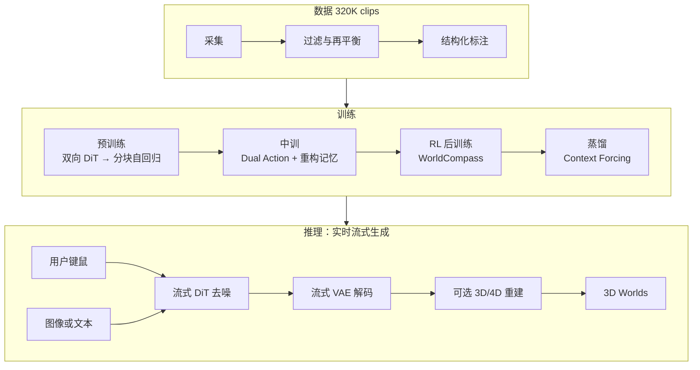
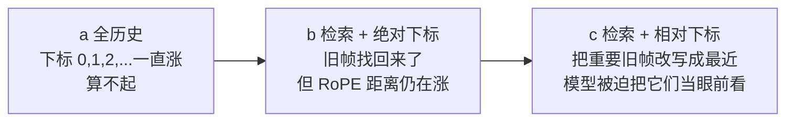
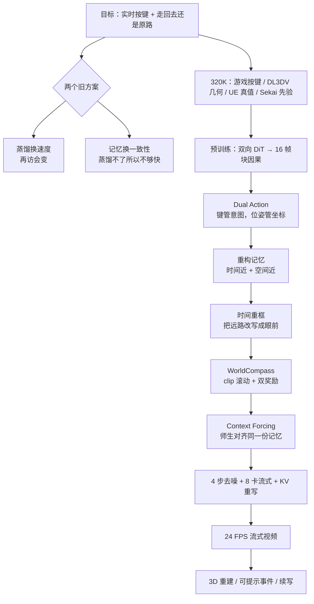

# HunyuanWorld 1.5：1.0 给了能走的世界，实时按键还得边画边记路

<!-- release-date: 2025-12-17 -->

> 本文依据腾讯混元团队的 **HY-World 1.5: A Systematic Framework for Interactive World Modeling with Real-Time Latency and Geometric Consistency**。封面署名 Tencent Hunyuan，项目页 [sceneTo3D](https://3d.hunyuan.tencent.com/sceneTo3D)，代码仓库 [HY-WorldPlay](https://github.com/Tencent-Hunyuan/HY-WorldPlay)。本地原件 20 页，PDF 无 Title 元数据，标题以封面为准；CreationDate 为 2025-12-14。页码一律指这份本地 PDF 自身的页码。
>
> 动笔前核过官方渠道：官方托管的技术报告 PDF（[HYWorld_1.5_Tech_Report.pdf](https://3d-models.hunyuan.tencent.com/world/world1_5/HYWorld_1.5_Tech_Report.pdf)）与本地件同为 38,606,835 字节，未发现更新修订，因此未换件。同系列另有一篇研究论文 [WorldPlay (arXiv:2512.14614)](https://arxiv.org/abs/2512.14614)，标题不同、贡献切分也不同，v2 修订于 2026-06-09；那是另一份原件，本文不以它替换本地技术报告，也不把它的附录数字写进下面的结论。
>
> 文中始终区分三层：**报告写了什么**、**我们如何解释**、**哪些是外部资料补充**。凡是本文自己从图表里读出来的数，都会标明读自哪张图。
>
> 边界说明：本篇讲的是 **HY-World 1.5 / WorldPlay 这条流式视频交互线**。[HunyuanWorld 1.0](/reports/Tencent/HunyuanWorld-1.0) 是离线生成可走的 3D 网格世界；1.5 并不重做那条全景分层管线，而是用流式视频扩散把「实时按键」补上。HY-World 2.0 是另一条 3D 重建 / 生成 / 模拟框架，不混进本文。

## 读之前：这一篇会用到的词

这是一篇「可交互世界模拟」方向的解读，和站内的 [Genie](/reports/Google/Genie)、[LingBot-World](/reports/AntGroup/LingBot-World) 同属一类问题：画面能不能在中途被按键打断。下面只解释读懂本篇所必需的部分。

- **世界模型（World Model）**：给定已经看到的画面和这一步的动作，预测接下来世界长什么样。它和普通视频生成模型的差别只有一条：中途能不能接控制。
- **自回归（autoregressive）**：一次生成一小段，把结果接回输入，再生成下一段。交互世界必须这样跑，因为用户的按键是边走边给的。
- **双向注意力与块因果注意力**：双向是整段视频里每个位置都能看见前后，适合一次把短片画完；因果是当前位置只能看已经生成的过去。本篇把整段双向改成「按块因果」：块内可以互相看，块与块之间只能看过去。
- **扩散 Transformer（Diffusion Transformer，DiT）**：先把画面加噪声，再让 Transformer 一步步去噪。每去一次噪叫一个**步（step）**。步数越多越慢，实时交互必须把步数压下去。
- **流匹配（flow matching）**：一种训练去噪网络的目标，让网络直接预测「从噪声走到数据」的速度场，而不是逐步预测噪声本身。
- **VAE 与潜空间**：直接在像素上做扩散太贵。先用三维变分自编码器（3D Variational Auto-Encoder，3D VAE）把视频压成更小的张量，扩散在这个压缩空间里进行，最后再解码回像素。
- **分块（chunk）**：本篇把视频切成固定长度的小段来生成。一个 chunk 是 4 个潜空间帧，对应 16 帧画面（PDF p. 7）。
- **RoPE（Rotary Position Embedding，旋转位置编码）**：给 Transformer 里的每个位置加一个「远近感」。两个位置的下标差得越大，注意力通常越弱。这个性质后面会变成记忆模块的主要敌人。
- **蒸馏（distillation）**：让一个又快、步数很少的学生模型去贴一个又慢、质量更高的教师模型。本篇的 Context Forcing 是专门给「带记忆的学生」做的蒸馏。
- **曝光偏差（exposure bias）**：训练时模型吃的是标准答案历史，推理时吃的是自己刚生成的、带错的历史。错会顺着时间往下传。

本篇自己反复使用、需要先对齐的五个名字是：

- **WorldPlay**：HY-World 1.5 里那个流式视频扩散模型，负责「按了键之后下一小段画面长什么样」。
- **Dual Action Representation（双重动作表示）**：同时吃离散键鼠和连续相机位姿。
- **Reconstituted Context Memory（重构上下文记忆）**：不为了省事把全部历史塞进去，而是每生成新的一块，都按空间和时间把该看的旧帧重新拼出来。
- **WorldCompass**：给长程自回归视频模型做的强化学习后训练。
- **Context Forcing（上下文强制）**：蒸馏时把教师和学生对齐到同一份记忆上下文上，免得学生为了变快把长期记忆丢掉。

## 一句话先说清

[HunyuanWorld 1.0](/reports/Tencent/HunyuanWorld-1.0) 已经能从文字或图片生成可走的 3D 世界：先画一张 360° 全景当代理，再分层补全、抬成网格。网格接得进引擎，转头、挪步、单独搬物体都成立。但它有一个硬缺口——报告自己写明：这套流程是**漫长的离线生成**，**没有实时交互**（PDF p. 1、p. 3）。

你可以把 1.0 想成「先把一座城市建好，再让你走进去」。建的时候你不能按 `W`；建完之后，画面来自已经存在的几何，不再经过生成模型。

HY-World 1.5 补的是另一件事：用户每按一下键，模型就要立刻画出接下来的一小段视频，而且还得保证你走远再走回来，那栋楼还是原来那栋。报告把它写成一个 **next chunk 预测** 问题：每次生成 16 帧，条件是用户动作（PDF p. 3）。

真正卡住前人的不是「画面好不好看」，而是一张表里同时打不齐的两列（PDF p. 4，Table 1）：

> **低延迟（快）和长期几何一致性（记得住）很难同时拿到。**

一类方法用蒸馏换速度，但几乎不记路，你再访同一地点，场景已经换了；另一类方法用显式或隐式记忆保住一致性，可复杂记忆让蒸馏变得极难，于是实时做不到（PDF p. 3）。

1.5 的答案不是再把视频画得更像，而是把四件事按因果顺序接上：

1. 用 **Dual Action** 让键鼠既好按、又能给出精确位置；
2. 用 **Reconstituted Context Memory** 把几何上重要、但时间上已经很远的帧「拉回眼前」，减轻记忆衰减；
3. 用 **WorldCompass** 在长程自回归上做强化学习，显式校正复杂组合动作和画质；
4. 用 **Context Forcing** 把带记忆的教师和学生对齐后再蒸馏，4 步去噪换实时，同时挡住误差漂移。

拼起来的产品主张是：24 FPS 的长程流式视频，支持第一人称和第三人称，写实和风格化都能跑，应用包括 3D 重建、可提示事件和无限世界延伸（PDF p. 1）。

所以最值得记住的不是四个名词，而是这条工程判断：

> **实时世界模型缺的不是更强的画布，而是一条不互相拆台的控制—记忆—后训练—蒸馏链。任何一环只优化自己，另一环就会塌。**

## 和站内已有的世界模型解读怎么分工

| | [Genie](/reports/Google/Genie)（初代） | [LingBot-World](/reports/AntGroup/LingBot-World) | [HunyuanWorld 1.0](/reports/Tencent/HunyuanWorld-1.0) | 本篇 1.5 |
|---|---|---|---|---|
| 想解决的缺口 | 动作标注太贵 | 开源模拟器又慢、又短、动态又弱 | 世界级 3D 数据不够，直接训场景生成会撞墙 | 离线 3D 世界不能实时按；视频世界模型快和记得住不可兼得 |
| 交付形态 | 方法论文，未发权重 | 开源模拟器，Base 与 Fast 两档 | 离线可导出网格 | 流式视频交互，权重和 demo 开放 |
| 控制信号 | 从无标签视频里**学**出 8 个潜动作 | 游戏和虚幻引擎里**录**到的按键与相机 | 生成阶段几乎没有帧级按键 | 离散键鼠 + 连续相机位姿 |
| 这篇怎么提它们 | 本篇 Table 1 没有初代 Genie；引言里点了 Genie 2 | 本篇没有点名 LingBot | 本篇开篇把 1.0 写成「能生成但不能实时交互」的前作 | — |

对照时有一件事必须先说清：**1.0 和 1.5 不是同一条流水线的两个版本号。** 1.0 输出的是网格世界，交互发生在已经生成好的几何上；1.5 输出的是边走边画的视频，几何一致性靠记忆和蒸馏来维持，而不是靠一张已经存在的网格。报告后半段确实把生成视频再送给重建模型出点云（PDF p. 15，Fig. 12），那是 1.5 的一个应用，不是把 1.0 的分层网格管线重跑一遍。

LingBot-World 的 Table 1 后来把 HY-World 1.5 列为开源对照之一。那是 LingBot 报告自己的归类，不是本篇这份技术报告里的表。两边的栏目和打分口径不同，不要混着读。

## 报告地图：20 页里各写了什么

先把篇幅摊开。这份技术报告的信息密度和 1.0 很像：前半讲系统怎么搭，后半是图，消融几乎全部外推到另外两篇论文。

| 报告章节 | PDF 页 | 讲了什么 | 密度 |
|---|---|---|---|
| 标题、摘要 | p. 1 | 相对 1.0 的缺口；四个设计；24 FPS | 高 |
| 目录 | p. 2 | 九章结构 | 低 |
| §1 引言 + Fig. 1 + Table 1 | p. 3–4 | 速度 vs 记忆；四个设计的因果；和同期模型对照 | 高 |
| Fig. 2 + §2 数据 | p. 5–6 | 系统总图；320K 四类数据 | 高 |
| §3 预训练 + Fig. 4–5 | p. 6–7 | 双向 DiT → 分块自回归；Dual Action 的网络接法 | 高 |
| §4 中训 + Fig. 6 | p. 8–9 | Dual Action 的理由；重构记忆与时间重框 | 高 |
| §5 WorldCompass | p. 9 | RL 的三个改动，细节外推到另一篇论文 | 中 |
| §6 Context Forcing + Fig. 7 + 算法 1 | p. 9–11 | 师生记忆不对齐；4 chunk 自滚动蒸馏 | 高 |
| §7 推理 + 算法 2 + Fig. 8 | p. 11–12 | 8 卡并行、流式 VAE、量化、可提示事件 | 中 |
| §8.1 评测 + Table 2 + Fig. 9–11 | p. 12–14 | 600 条测试；短程 / 长程表；人评；RL 定性 | 高 |
| §8.2 应用 + Fig. 12–15 | p. 15–17 | 3D 重建、事件、视频续写；大图 | 中 |
| §9 结论 | p. 16 | 未来方向只有一句话 | 低 |
| 贡献者、参考文献 | p. 18–20 | 名单与 36 条引用 | — |

四件事必须先知道，否则读完会以为自己漏看了：

- **技术描述的核心在 p. 3 到 p. 12。** p. 13 到 p. 17 主要是对比图和应用图。
- **这份技术报告几乎没有消融表。** Dual Action、记忆、RoPE 重框、RL 的定量分析，正文明确说去看 WorldPlay 论文和 WorldCompass 论文（PDF p. 14）。本报告自己给出的对照，定量上主要是 Table 2 里「去掉 Context Forcing」那一行。
- **WorldCompass 写得很薄。** 报告自己说「完整技术细节请看相应学术论文」（PDF p. 9）。本文只讲它在这份报告里写清的三件事，不拿后发的 WorldCompass 论文来补实现。
- **参数量、训练步数、数据小时数、单卡延迟，一个都没有。** 实时性的硬数字就是摘要和引言里的 **24 FPS**，以及蒸馏后的 **4 步去噪**（PDF p. 1、p. 10）。分辨率在这份技术报告里没有写成 720p 或 480p。

阅读路线：先看「1.0 留下的缺口」和「快 vs 记得住」，再按训练顺序走四个核心设计，然后看数据和评测。**如果你只有十五分钟，读「先讲矛盾」「核心一到四」和「评测」就够了。**

## 先讲矛盾：1.0 留下的缺口，和视频世界模型自己的死结

### 1.0 已经能走，但走的不是实时

报告开篇把 1.0 的能力说得很满：能生成沉浸、可穿越的 3D 世界。紧接着就是限制——依赖漫长的离线生成，缺乏实时交互（PDF p. 1、p. 3）。

这句话值得拆开。1.0 的「可交互」指的是：世界已经生成完了，物体被分层拆开，你可以在引擎里挪椅子、转头、走几步。那是**对已有几何的交互**。1.5 要的是另一件事：生成过程本身被用户的键盘打断，每一小段画面都是当场画出来的（PDF p. 3）。

所以 1.5 不是 1.0 的「更快渲染版」。它换了一种世界的存在方式：从「先建好再走进去」变成「边走边把没看见的地方画出来」。

### 视频路线自己卡在速度和记忆上

一旦改走视频，交互世界建模的目标就变成：自回归地预测未来帧，让每一次键盘命令都立刻有画面反馈（PDF p. 3）。报告认为，尽管这条线进展很快，一个根本挑战还在：

**怎样同时做到实时生成（速度）和长期几何一致性（记忆）。**

它把已有方法分成两派（PDF p. 3）：

| 路线 | 代表 | 换到了什么 | 丢掉了什么 |
|---|---|---|---|
| 蒸馏优先 | Oasis、Genie 2、Matrix-Game 2.0 | 低延迟 | 再访同一地点时场景会变 |
| 记忆优先 | VMem、Gen3C（显式）；WorldMem、Context-as-Memory（隐式） | 再访更稳 | 复杂记忆让蒸馏变难，实时做不成 |

Table 1 把这件事摊成可以扫一眼的对照（PDF p. 4）。下面按原文栏目转写；勾叉以 PDF 为准。

| | Oasis | Matrix-Game 2.0 | GameGenX | GameCraft | WorldMem | VMem | Ours |
|---|---|---|---|---|---|---|---|
| Action Space | Discrete | Discrete | Discrete | Continuous | Discrete | Continuous | Continuous + Discrete |
| Real-time | ✔ | ✔ | ✗ | ✗ | ✗ | ✗ | ✔ |
| Long-term Consistency | ✗ | ✗ | ✗ | ✗ | ✔ | ✔ | ✔ |
| Long-Horizon | ✗ | ✔ | ✔ | ✗ | ✗ | ✗ | ✔ |
| Domain | Minecraft | General | General | General | Minecraft | Static Scene | General |

读这张表时有两个容易滑过去的地方。

第一，**「Ours」同时在实时、长期一致性、长时域、通用域、连续+离散动作上打勾的，表里只有自己。** 这是作者的定性归类，不是评测分数。实时和长时域没有给出可复现的阈值。

第二，这张表**没有 HunyuanWorld 1.0**。1.0 根本不在「流式视频交互」这个赛道里。把 1.0 和 1.5 放进同一张「谁更实时」的表，是错的比较。

报告后面对 WorldPlay 的形式化也写在这里（PDF p. 7）。用白话说：给定过去的观察 $O_{t-1}$、过去的动作 $A_{t-1}$、当前动作 $a_t$，以及描述这个世界的文本或图像 $c$，去生成下一块 16 帧 $x_t$：

$$
N_{\theta}(x_t \mid O_{t-1}, A_{t-1}, a_t, c)
$$

后面为了写起来干净，会把 $A,a,c$ 省略掉。真正要记住的是：条件里必须有**当前这一步的动作**，否则它就退回成普通视频生成。

## 先看全景：一份数据，四段训练，一次流式推理

报告用 Figure 2 把系统画成三块：数据、训练、推理（PDF p. 5）。下面按该图重画，表达的是阶段顺序，不是训练时长或 GPU 配比。

四个训练阶段各自还一笔账：

| 阶段 | 旧问题 | 新状态 | 报告里的名字 |
|---|---|---|---|
| 预训练 | 双向视频模型不能无限往下画 | 按 16 帧一块的因果生成 | Autoregressive Generative Model（PDF p. 6–7） |
| 中训 | 有生成、无可靠按键、无长期记忆 | 键鼠可跟、再访更稳 | Dual Action + Reconstituted Context Memory（PDF p. 8–9） |
| 后训练 I | 像素监督只是隐式地教会跟动作，复杂组合动作和伪影会平台期 | 用奖励把探索方向显式拧过来 | WorldCompass（PDF p. 9） |
| 后训练 II | 带记忆的自回归模型又慢、误差又会累积；普通蒸馏会把记忆蒸掉 | 4 步去噪、实时、记忆还在 | Context Forcing（PDF p. 9–10） |

顺序不能随便调。没有分块自回归，后面的记忆和蒸馏没有接口；没有 Dual Action 给出的精确位置，空间记忆检索会糊；没有记忆，Context Forcing 对齐的就是空的；WorldCompass 插在中训之后、蒸馏之前，用的是已经能跟动作、已经有记忆的自回归模型。

## 数据：320K 不是堆视频，是在补「按键和几何」两种标签

HY-World 1.5 的训练集约 320K 条精心筛选的视频（PDF p. 4–5）。四类来源的分工在 Figure 3 里画得很清楚（PDF p. 6）。

| 来源 | 规模 | 占比 | 它补什么 |
|---|---:|---:|---|
| 3A 游戏录屏（第一 / 第三人称） | 170K | 53.125% | 复杂智能体行为、物理、环境交互；离散动作可直接录到 |
| 真实 3D（DL3DV，先重建再按导航轨迹重渲） | 60K | 18.75% | 真实外观和准确场景结构；专门覆盖各种移动和旋转 |
| 合成 4D（Unreal Engine） | 50K | 15.625% | 动态物体、可控光照、精确真值，用来学动作模式 |
| 真实动态视频（Sekai） | 40K | 12.5% | 自然运动和物体行为先验 |

这四类不是「越多越好」的混合。3A 游戏给的是**可交互的动态**，DL3DV 给的是**几何靠谱的真实场景**，UE 给的是**带真值的动作**，Sekai 给的是**真实世界的运动先验**。缺任何一类，后面 Dual Action 或记忆检索都会缺一种监督。

过滤分三条线（PDF p. 5–6）：

1. **视觉质量**：美学打分、水印和 UI 检测、压缩伪影，不够的丢掉；
2. **运动一致性**：光流去掉剧烈抖晃，再用相机轨迹检查平滑性，突然或不合理的运动去掉；
3. **多样性**：用动态帧率覆盖不同播放速度、相机运动和帧率配置。

标注同样是为后面两个模块服务的（PDF p. 6）：

- 文本：用 HunyuanVideo 1.5 的 caption 模型给每条视频打结构性描述；
- 连续相机位姿：VIPE 估计，或从 UE / 3D 渲染管线直接导出；
- 离散动作：从相机轨迹归成移动命令和视角旋转；3A 游戏则直接记录按键。

这里有一个值得带走的设计：**离散动作并不总是「再标一份键」。** 对没有按键日志的视频，报告是从相机轨迹反推 WASD 一类命令的。游戏录屏才是真正录到的键。后面 Dual Action 能同时吃两种信号，数据管线必须先把两种信号都准备好。

报告没写每类数据滤掉了多少、动态帧率怎么采样、VIPE 失败怎么处理。这些是未公开细节，不补。

## 预训练：先借一块会画世界的画布，再改成可以无限往下接

### 双向视频扩散是起点，不是终点

报告认为，当代双向视频扩散模型已经在网络尺度数据上学到了感知、建模和操作真实世界的能力（PDF p. 6）。典型结构是：

1. 3D VAE 把视频压进潜空间；
2. DiT 在潜空间里做生成，每个块里有 3D 自注意力、条件交叉注意力（或双流注意力）和前馈网络；
3. 用流匹配训练。

流匹配的目标写成（PDF p. 6，式 1）：

$$
\mathcal{L}_{\mathrm{FM}}(\theta)=\mathbb{E}_{k,z_0,z_1}\bigl\|N_{\theta}(z_k,k)-v_k\bigr\|^2
$$

符号的意思是：$z_0$ 是 3D VAE 编出来的视频潜变量，$z_1$ 是标准高斯噪声，$z_k$ 是扩散时刻 $k$ 的带噪潜变量，$v_k$ 是网络要学的目标速度。网络 $N_{\theta}$ 吃带噪潜变量和时刻，吐出速度，越接近真速度越好。

这一段报告写得很短，因为它不是新贡献。它只是在说：WorldPlay 不是从零发明一种视频生成器，而是站在已经会画视频的双向模型上往交互改。底座具体是哪一个，正文点了 HunyuanVideo 1.5 和 Wan（PDF p. 6，引用 [25]、[26]），但没有写清预训练是否从 HunyuanVideo 1.5 的权重接着训、训了多久。

### 为什么必须改成按块自回归

双向模型的问题很硬：它不是因果的，不能做无限长的交互生成（PDF p. 7）。用户的按键是在未来才出现的，模型不能先看到整段再画。

改造分三步（PDF p. 7）：

1. 把视频切成 chunk，每块 4 个潜空间帧，解码后是 16 帧画面；
2. 训练时给不同 chunk 加不同噪声水平，灵感来自 Diffusion Forcing；
3. 把双向自注意力改成**块因果注意力**（block causal attention）：当前块可以看自己和过去的块，不能看未来的块。

训练损失仍是式 1。这一阶段的产物，报告称为后续动作和记忆集成的基础模型（PDF p. 7）。

为什么是 16 帧一块，而不是一帧一帧吐？**这是本文的解释，不是报告原话。** 一帧一帧自回归对 DiT 太碎，延迟和误差都会更差；一次吐整段又回到双向、无法插入新按键。16 帧是在「对按键的响应粒度」和「每次生成的计算粒度」之间切的一刀。报告没有消融这块大小。

Figure 4 把推理时的循环画出来了（PDF p. 7）：图像或文本描述一个世界 → 每次根据用户输入生成下一块 → 同时从过去各块里重构空间记忆 $C^S$ 和时间记忆 $C^T$ → 解码 → 把新块写回记忆缓存。后面两个核心设计，其实都接在这张图的「Reconstitute」和「Dual-Action」两个接口上。

## 核心一：Dual Action，因为键和坐标各自只对一半

### 旧问题：离散好学但找不回原路，连续好定位但训不稳

中训的第一件事是把动作接进已经能自回归的生成器。报告把前人的动作表示分成两种，并各打一条（PDF p. 3、p. 8）：

**只用离散键（W/A/S/D 这类）。** 好处是跨尺度都学得动：大场景走一步和小场景走一步，按键是同一个符号，模型可以自己长出「在这个世界里一步有多远」。坏处是：记忆检索需要的是「我以前站过的那个精确位置」，离散键太含糊，不够用来回访。

**只用连续相机位姿 $(R,T)$。** 旋转和平移矩阵能给出空间坐标，控制和记忆检索都精确。坏处是训练数据里场景尺度差很大，只拿位姿训会不稳。

只选一边，就只能解决「好按」或「找得回」其中一件。交互世界两件都要：你按 `W` 得往前走得像那么回事；你转一圈回来，系统还得知道这是同一个坐标。

### 新设计：同一套动作，拆成两条通路进网络

Dual Action 的做法是：把用户信号同时变成离散键和连续相机位姿（PDF p. 3、p. 8）。Figure 5 给出接法（PDF p. 7）。

**离散键鼠。** 用一个零初始化的 MLP 把动作嵌入投进去，加到 timestep embedding 上，再用来调制 DiT 块（AdaLN 那一路）。零初始化的意思是：训练开始时这条支路不扰动已经训好的生成器，动作控制是慢慢长出来的。

**连续相机。** 用 PRoPE（Projective Positional Encoding，投影位置编码）把相机信息打进自注意力。先保留原来的视频 RoPE 注意力：

$$
\mathrm{Attn}_1=\mathrm{Attn}(R^{\top}\odot Q,\ R^{-1}\odot K,\ V)
$$

$R$ 是视频潜变量的三维 RoPE，$\odot$ 是矩阵—向量乘法（PDF p. 8，式 2）。然后再加一路刻画相机视锥关系的注意力：

$$
\mathrm{Attn}_2=D^{\mathrm{proj}}\odot\mathrm{Attn}\bigl((D^{\mathrm{proj}})^{\top}\odot Q,\ (D^{\mathrm{proj}})^{-1}\odot K,\ (D^{\mathrm{proj}})^{-1}\odot V\bigr)
$$

$D^{\mathrm{proj}}$ 由相机内参和外参构造（PDF p. 8，式 3）。两路不是替换，而是相加：

$$
\mathrm{Attn}_1+\mathrm{zero\_init}(\mathrm{Attn}_2)
$$

连续支路同样从零开始长，避免一上来就把已经学好的外观生成打乱。

可以把它想成游戏手柄的两个通道：离散键告诉模型「玩家意图是往前」——这一步在不同大小的世界里都说得通；连续位姿告诉模型「这一帧的相机恰好在这个视锥里」——记忆模块稍后要靠它计算视野重叠和相机距离。

### 它接在系统哪里

Dual Action 的输出有两个下游：

1. 生成当前块时，DiT 用它调制「这一步该怎么动」；
2. 记忆模块用连续位姿去检索「哪些旧帧和我现在看的是同一块空间」。

没有第二条，后面的空间记忆只是一句空话。报告把「稳健控制」和「精确位置缓存」写成同一设计的两个结果（PDF p. 8），原因就在这里。

本报告没有 Dual Action 的消融数字。定量对比被明确推到 WorldPlay 论文（PDF p. 14）。

### 可迁移启发

任何要把「人类按键」和「几何检索」接在同一个模型里的系统，都可以问：你现在用的那一个动作符号，是为了好学，还是为了好定位？两者的数学需求不一样，硬塞进同一条嵌入往往两头都不满。**把意图和坐标拆开，再用零初始化接到已经训好的主干上**，是可以带走的接法。PRoPE 本身依赖相机模型，换到非相机动作空间就不再直接适用。

## 核心二：重构上下文记忆，因为 Transformer 会把远路自动忘掉

### 旧问题：全历史太贵，普通检索会在位置编码上衰减

长期几何一致性的字面意思是：你回到以前站过的地方，内容不该变（PDF p. 8）。最笨的办法是把过去所有 chunk 都当作上下文。报告说这在长序列上计算上不可行，而且冗余（PDF p. 8，Fig. 6a）。

前人已经在做检索式记忆。报告认为自己比「简单检索」多走了两步：不是只取出若干旧帧，而是**每次动态重建一份上下文**；取出来之后，还要处理 Transformer 位置编码的长程衰减（PDF p. 3、p. 8–9）。

长程衰减是这件事的关键。RoPE 给每个 token 一个时间下标。当前块和下标为 2 的旧块很近，和下标为 800 的旧块很远。远了之后会出现两种故障（PDF p. 9）：

1. 相对距离超出训练时见过的插值范围，外推会出伪影；
2. 更要命的是，模型会觉得这些空间上重要、时间上很远的帧「已经不相关了」，注意力自然变弱。

也就是说：**几何上你该看的那堵墙，在位置编码里已经变成了「很久以前的事」。** 记忆模块如果只负责把帧找回来、不改位置编码，找回来也等于没看。

### 新设计：时间近的保动作，空间近的保几何，然后把旧帧的时间下标改写掉

每生成新块 $x_t$，都从过去的观察 $O_{t-1}$ 重建一份记忆上下文 $C_t$。它由两块拼起来（PDF p. 8–9）：

1. **时间记忆 $C_t^{T}$**：最近 $L$ 个 chunk $\{x_{t-L},\ldots,x_{t-1}\}$，负责短程运动平滑；
2. **空间记忆 $C_t^{S}$**：从非相邻的过去帧里采样，且 $C_t^{S}\subseteq O_{t-1}-C_t^{T}$，负责挡住长程几何漂移。

空间采样的分数同时看两件事：**视野（FOV）重叠**和**相机距离**（PDF p. 9）。这就是 Dual Action 里连续位姿必须存在的原因——没有相机，这两项分数算不出来。

取出来之后做 **Temporal Reframing（时间重框）**。它丢掉这些帧真正的绝对时间下标，动态给所有上下文帧重新赋位置编码，让它们和当前待预测块之间保持一个**固定的、很小的相对距离**，不管真实时间隔了多远（PDF p. 9，Fig. 6c）。

Figure 6 的三张示意可以读成（PDF p. 8）：

报告的原话是：这个操作有效地把几何上重要、但时间上已经很远的记忆「拉近」，强迫模型把它们当成最近的事情来对待（PDF p. 3）。

一个具体一点的例子。假设你 200 块之前走过一座桥，现在转回来。空间记忆会凭 FOV 重叠把那几帧桥找回来。如果还用绝对 RoPE，它们的下标是 200，当前是 400，模型几乎不会认真看。重框之后，这些桥的帧可能被改写成「当前块前面第 1、第 2 块」的位置，注意力重新变得很大。内容还是旧的，远近感是假的——**假远近感恰恰是要的**。

### 收益和边界

报告声称，训完这个带记忆的模型之后，动作控制和长期几何一致性都有了，可以进入后训练（PDF p. 9）。本报告没有单独的记忆消融表，也没有给出 $L$ 取多少、空间记忆每次取几帧、几何相关分数的具体公式。这些都在「未公开 / 外推到 WorldPlay 论文」的范围内。

有一个适用边界报告自己在引言里已经暗示：空间检索依赖 FOV 重叠和相机距离。大幅遮挡时，视野重叠可能找不到真正该看的旧帧。本技术报告的结论没有把这条写成限制；WorldPlay 研究论文后来写了。本文不把后文的限制冒充本报告的原话。

### 可迁移启发

任何用 Transformer 做长期记忆的系统都可以问两句：

1. 你检索回来的条目，和当前查询在位置编码里是不是已经「远到看不见」？
2. 如果是，能不能在不改内容的前提下，改写位置，让模型重新认真对待它们？

时间重框是一种很猛的干预：它主动撒谎说「这些旧帧是最近发生的」。代价是模型失去了真实的时间间隔感——「这堵墙是三分钟前看到的」和「这堵墙是三秒前看到的」在位置编码上变得不可分。报告用时间记忆 $C_t^{T}$ 专门保留最近几块，部分对冲了这个代价。做别的任务时，如果真实时间间隔本身有语义（比如节奏、倒计时），这条技巧不能原样搬。

## 核心三：WorldCompass，因为像素监督教不会「复杂组合动作」

### 旧问题：前两段训练只是 Implicit 地在跟动作

中训结束之后，模型已经能根据基本探索动作吐出画面。报告认为这还不够（PDF p. 9）：

前两段训练高度依赖原始像素监督。像素损失只是**隐式地**让模型去跟输入动作、去探索环境。结果是：长程交互精度容易进入平台期，视觉伪影会留下来，尤其是复杂组合动作。

「复杂组合动作」可以想成：一边按 `W` 往前走，一边拖鼠标右转，同时场景里还有第三人称角色。像素损失并不直接打分「你有没有把这三件事都做对」，它只说「这一帧和训练集里的某一帧像不像」。

强化学习看起来正好能提供「显式、有目的」的训练信号。但报告立刻说，把 RL 用到世界模型上有独特的难处（PDF p. 9）：

- 长程意味着轨迹 rollout 极贵；
- 什么样的奖励能同时抬动作跟随和画质，几乎还没被认真探索过；
- 选什么 RL 算法也缺乏共识。

### 新设计：在 clip 粒度上滚动，用两种奖励互相盯着，算法用 DiffusionNFT

WorldCompass 被写成一个专门给交互视频世界模型做后训练的 RL 框架，用来「steer」模型的探索行为（PDF p. 9）。报告在这里写了三件事，然后明确把完整技术细节推走。

**第一，Clip-Level Rollout。** 不为整条长视频做一次巨大的滚动，而在 clip 粒度上滚动自回归视频。报告给出三个理由：提高 rollout 效率；让奖励信号更细；更关键的是，强迫模型依赖自己不完美的预测，从而减轻曝光偏差（PDF p. 9）。

最后这一点和 Context Forcing 要解决的是同一类病：训练如果永远吃干净历史，推理就经不起自己的脏历史。WorldCompass 在 RL 阶段先让模型吃自己，Context Forcing 在蒸馏阶段继续让模型吃自己。

**第二，互补奖励。** 针对世界建模的两个主诉求，分别打动作跟随分和视觉质量分。多种反馈叠在一起，是为了压住奖励黑客（PDF p. 9）。只有动作分，模型可能用糊掉的画面「假装」走到了；只有画质分，模型可能画出好看但完全不跟键的镜头。

组织段落还提了一句：这一阶段「利用 3D 反馈和视觉反馈」进一步增强模型（PDF p. 4）。正文 5.2 节没有再展开 3D 反馈怎么算。不要把这句扩写成一套未公开的 3D reward 公式。

**第三，算法是 DiffusionNFT**，再叠若干效率策略（PDF p. 9）。DiffusionNFT 本身不是本报告的贡献，引用为 [35]。报告没有写组大小、学习率、奖励权重，也没有在本报告里放 RL 的定量表。

### 本报告实际给出的证据

定量消融没有。定性在 Figure 11（PDF p. 14）：同一条复杂动作轨迹，Base Model 在公园野餐桌和天坛两组镜头上跟不准、画质也掉；加上 WorldCompass 之后，移动更贴键，结构更稳。报告的评价是：无 RL 的流水线在复杂动作下会出现交互信号错位和视觉退化；RL 之后动作跟随和视觉保真都明显更好（PDF p. 13–14）。

这是作者观察加定性图，不是可复现的分数。它能支持「RL 这一段被作者认为有用」，不能支持「WorldCompass 比某一种具体 RL 基线高多少」。

### 可迁移启发

对长程生成模型，像素级模仿往往在「会不会做基本动作」上就饱和了。要再往上走，需要一个**显式打在任务目标上的信号**。WorldCompass 可带走的不是 DiffusionNFT 这个名字，而是两原则：

1. **滚动单位要小到奖励能定位错误**（clip，而不是整局）；
2. **至少两种会互相拆台的奖励**，专门对付「只优化一个数」的黑客。

完整配方以 WorldCompass 论文为准，本报告不够用来复现。

## 核心四：Context Forcing，因为普通蒸馏会把记忆蒸掉

### 旧问题：学生要记路，教师却在看未来

自回归世界模型有两个病：长视频误差累积，以及扩散去噪太慢，做不到实时（PDF p. 10）。近年的标准疗法是：把一个双向扩散教师蒸馏成少步自回归学生，用分布匹配损失让学生的 $p_{\theta}(x_{0:t})$ 去贴教师（PDF p. 10，式 4）：

$$
\nabla_{\theta}\mathcal{L}_{\mathrm{DMD}}=\mathbb{E}_{k}\bigl(\nabla_{\theta}\mathrm{KL}(p_{\theta}(x_{0:t})\|p_{\mathrm{data}}(x_{0:t}))\bigr)
$$

梯度可以用两个扩散模型的 score 差来近似。

报告认为，这套标准蒸馏对**带记忆的模型会失败**。原因不是步数，是条件分布根本不在同一个世界里（PDF p. 3、p. 10）：

- 双向教师能看见过去和未来；
- 自回归学生因为因果，只能看见过去；
- 即便给教师也装上记忆，双向教师的记忆上下文仍然不同于学生的因果记忆。

于是两边的 $p(x\mid C)$ 对不齐，分布匹配对空。报告把这个现象说得很重：现有蒸馏方法保不住长期记忆，因为这是在训练一个「有记忆的自回归学生」去模仿一个「无记忆的双向教师」（PDF p. 3）。

### 新设计：学生先自己滚 4 块，教师看同一份记忆，只是把这 4 块遮掉

Context Forcing 的核心就一句：蒸馏时让教师和学生面对**同一份记忆上下文**（PDF p. 10，Fig. 7）。

对学生，从记忆上下文出发自滚动 4 个 chunk：

$$
p_{\theta}(x_{j:j+3}\mid x_{0:j-1})=\prod_{i=j}^{j+3}p_{\theta}(x_i\mid C_i)
$$

对教师 $V_{\beta}$，先给一个普通双向扩散模型装上记忆，再把它的上下文做成「学生那份记忆去掉这 4 块」：

$$
p_{\mathrm{data}}(x_{j:j+3}\mid x_{0:j-1})=p_{\beta}(x_{j:j+3}\mid C_{j:j+3}-x_{j:j+3})
$$

$C_{j:j+3}$ 是学生自滚动这 4 块时用到的全部记忆 chunk（PDF p. 10，式 5）。教师要预测的就是这 4 块，条件是「学生当时能看见的那些旧记忆」，而不是未来，也不是另一套检索结果。

可以把它想成开卷考试对齐。学生答题时桌上摊着自己检索来的笔记。如果教师阅卷时摊的是整本教科书（还含有后面章节），教师的「标准答案分布」和学生能写出来的分布对不上，学生为了像教师，会学会一些自己推理时根本拿不到的捷径，记忆机制就会被绕开。Context Forcing 让教师也只能看学生那一摞笔记。

算法 1 把训练循环写全了（PDF p. 11）：

1. 逐渐增大最大 chunk 长度 $m$（课程式加长）；
2. 从真实数据里采样一段历史 $x_{0:j-1}$；
3. 对学生的每一个新块：重构记忆 → 随机抽一个去噪步数 $s$ → 自滚动生成；
4. 对齐教师上下文：学生记忆减去这 $n=4$ 块；
5. 用假 score 网络 $V_{\beta}^{\mathrm{fake}}$ 和真 score 网络 $V^{\mathrm{real}}$ 做分布匹配，更新学生；教师侧按 Self Forcing 那套流匹配更新。

算法 1 第 15 行把真实 score 也写成了 $S^{\mathrm{fake}}$，这是原文笔误。按上下文，一边是 fake score，一边是 real score。

蒸馏之后，报告给出的运行点是：**4 步去噪的实时生成，同时保住长期一致性、减轻误差累积**（PDF p. 10）。

### 它在评测里的位置

Table 2 是本报告里唯一把 Context Forcing 单独拿掉的定量行（PDF p. 13）。去掉它：

- 不再实时；
- 短程已经略掉一截（PSNR 21.27 vs 21.92）；
- 长程掉得更明显（PSNR 16.27 vs 18.94，LPIPS 0.495 vs 0.371，$R_{\mathrm{dist}}$ 0.611 vs 0.332）。

所以 Context Forcing 在这份报告里同时承担两件事：**把模型变快，以及把长程误差按住。** 它不是「只换速度、质量不变」的纯工程蒸馏。

### 可迁移启发

只要学生和教师的**条件信息集**不同，分布匹配就可能在对错的条件。带检索、带记忆、带工具调用的生成模型做蒸馏时，优先对齐的往往不是网络宽度，而是「这一刻两边到底看见了什么」。Context Forcing 把这条写成可执行的操作：学生自滚动一段，教师的条件 = 学生的记忆 − 这一段。课程式加长 $m$，则是避免一开始就在很长的自滚动上蒸馏失败。

## 推理：4 步仍然不够实时，还要工程把延迟拆开

蒸馏把去噪从「很多步」压到 4 步，报告仍认为达不到交互世界模拟的延迟要求，所以又加了一套推理优化（PDF p. 11）。这一节没有延迟拆解表，只有机制。

**DiT 和 VAE 的混合并行。** 在 8 张 GPU 上对骨干和 VAE 解码器做序列并行。它不是复制整模，也不是只按时间维切序列，而是把**每一个 chunk 的 token** 切到不同卡上，再结合注意力并行，让单块的计算均匀摊开（PDF p. 11）。

**流式部署和渐进解码。** 用 NVIDIA Triton。不是等一整块生成完、解码完再发给用户，而是 DiT 一吐出潜变量，就按更小批次做多步 VAE 解码并立刻传到客户端。生成和送达用异步和帧缓冲解开，首帧时间被压下去（PDF p. 11–12）。

**量化和高效注意力。** Sage Attention 做混合精度注意力；对权重和激活做浮点量化；对线性层做矩阵乘量化；自回归用 KV cache 避免重复算历史注意力（PDF p. 11）。

算法 2 补充了 KV cache 的一个细节（PDF p. 12）：每生成新块时，如果已经不是第一块，就在最高噪声步把 KV 重置成「当前重构记忆、时刻 0」的 KV，然后再按 $k_d,\ldots,k_1$ 去噪。也就是说，缓存不是无限追加整段历史，而是跟重构记忆对齐后重写。这和核心二是同一思想在推理态的落地：你真正该看的上下文，是重构出来的那一份，不是原始时间线上的全部 token。

报告说这些技术「在我们的实验中」保住了视觉保真（PDF p. 11），但本报告没有单独的速度消融表。24 FPS 是产品级主张，没有写清分辨率、是否含网络传输、是否 8 卡满配。

### 键鼠之外：用文本在生成中途改世界

§7.2 把交互从导航扩到「可提示事件」（PDF p. 12）。用户可以在流式生成过程中输入自然语言，改正在发生的世界。报告列了几类：物体添加和删除、环境变化（天气、光照）、动态（爆炸）、角色行为（NPC）。Figure 8 是草地上出现热气球和彩虹（PDF p. 12）；Figure 1e 和 Figure 13 还有烟雾、天黑、喷火、行人、狗（PDF p. 4、p. 15）。

这是能力演示，不是单独的模块设计。报告没有写文本事件如何注入 DiT——是改 caption、改 cross-attention，还是插入新的条件 token。不要补。

## 评测：短程已经能打，真正拉开的是走远再走回来

### 协议

测试集 600 条，来自真实视频、游戏录屏和 AI 生成图像（PDF p. 12）。两条协议：

- **短程（61 帧）**：用测试视频的相机轨迹当输入位姿，生成帧直接和真值比。画面用 LPIPS / PSNR / SSIM，相机用 $R_{\mathrm{dist}}$ / $T_{\mathrm{dist}}$。
- **长程（$\ge 250$ 帧）**：设计往返轨迹，沿路走出去再沿原路回来，用回程帧对比去程对应帧。这是在直接测「再访同一地点还像不像」（PDF p. 12–13）。

基线分两组（PDF p. 13）：

1. 有动作控制、无记忆：CameraCtrl、SEVA、ViewCrafter、Matrix-Game 2.0、GameCraft；
2. 有记忆：Gen3C、VMem。

Table 2 在排版上把「Real-time」和短程指标写在同一组表头里；GitHub README 后来把它拆成单独一列。下面按 PDF 数字转写，实时标记以 pdftotext 为准（PDF p. 13）。ViewCrafter 长程 SSIM 以 PDF 的 0.277 为准。

| 方法 | 实时 | 短程 PSNR↑ | SSIM↑ | LPIPS↓ | $R_{\mathrm{dist}}$↓ | $T_{\mathrm{dist}}$↓ | 长程 PSNR↑ | SSIM↑ | LPIPS↓ | $R_{\mathrm{dist}}$↓ | $T_{\mathrm{dist}}$↓ |
|---|---|---:|---:|---:|---:|---:|---:|---:|---:|---:|---:|
| CameraCtrl | ✗ | 17.93 | 0.569 | 0.298 | 0.037 | 0.341 | 10.09 | 0.241 | 0.549 | 0.733 | 1.117 |
| SEVA | ✗ | 19.84 | 0.598 | 0.313 | 0.047 | 0.223 | 10.51 | 0.301 | 0.517 | 0.721 | 1.893 |
| ViewCrafter | ✗ | 19.91 | 0.617 | 0.327 | 0.029 | 0.543 | 9.32 | 0.277 | 0.661 | 1.573 | 3.051 |
| Gen3C | ✗ | 21.68 | 0.635 | 0.278 | **0.024** | 0.477 | 15.37 | 0.431 | 0.483 | 0.357 | 0.979 |
| VMem | ✗ | 19.97 | 0.587 | 0.316 | 0.048 | 0.219 | 12.77 | 0.335 | 0.542 | 0.748 | 1.547 |
| Matrix-Game-2.0 | ✔ | 17.26 | 0.505 | 0.383 | 0.287 | 0.843 | 9.57 | 0.205 | 0.631 | 2.125 | 2.742 |
| GameCraft | ✗ | 21.05 | 0.639 | 0.341 | 0.151 | 0.617 | 10.09 | 0.287 | 0.614 | 2.497 | 3.291 |
| Ours（无 Context Forcing） | ✗ | 21.27 | 0.669 | 0.261 | 0.033 | 0.157 | 16.27 | 0.425 | 0.495 | 0.611 | 0.991 |
| **Ours（完整）** | ✔ | **21.92** | **0.702** | **0.247** | 0.031 | **0.121** | **18.94** | **0.585** | **0.371** | **0.332** | **0.797** |

有三件事比「全面第一」更有用。

第一，**短程旋转精度的最好不是 WorldPlay，是 Gen3C 的 $R_{\mathrm{dist}}=0.024$**，完整模型是 0.031。报告在定性部分解释：显式 3D 缓存对中间结果和深度估计很敏感（PDF p. 13）。翻译过来：短程里，真正拿着 3D 的方法在「转了多少度」上可以更准；WorldPlay 赢在画面和翻译，以及后面的长程。

第二，**差距在长程被放大。** 无记忆的 Matrix-Game 2.0 / GameCraft 长程 PSNR 掉到约 10，有记忆的 Gen3C 还有 15.37，完整 WorldPlay 是 18.94。报告自己的归纳：短程大家都能看，长程控制精度会因误差累积垮掉，WorldPlay 更稳（PDF p. 13）。

第三，**Context Forcing 不是免费的实时开关。** 去掉它之后长程 PSNR 从 18.94 掉到 16.27，已经低于完整模型，但仍高于多数基线。也就是说，记忆中训本身已经在扛长程；蒸馏既给了实时，又把长程再抬了一截。

### VBench 和人评

Figure 9a 是 VBench 雷达图，和 Gen3C、ViewCrafter、GameCraft、Matrix-Game-2.0 比（PDF p. 13）。报告没有把各维分数写成表，本文也不从雷达图上估数。

Figure 9b 是人对偏好（PDF p. 13）。从该图直接读到的偏好率是：

| 对照 | Ours | 对方 |
|---|---:|---:|
| vs GameCraft | 88.5% | 11.5% |
| vs Matrix-Game-2.0 | 78.4% | 21.6% |
| vs ViewCrafter | 92.1% | 7.9% |
| vs Gen3C | 72.9% | 27.1% |
| vs Teacher（双向） | 48.1% | 51.9% |

对开源 / 学术基线是大胜。对双向教师则是 **48.1% vs 51.9%**，略输。报告正文没有讨论这最后一行。**这是本文从该图读出的观察**：少步自回归学生在人眼里还没有完全追上双向教师，实时是用一点点观感换来的。人评的题数、是否盲评、评分口径，报告没写。

### 定性对比在说什么

Figure 10（PDF p. 14）用红框标再访一致性。报告点了三条（PDF p. 13）：

- Gen3C 的显式 3D 缓存对中间结果质量和深度估计敏感；
- Matrix-Game 2.0 和 GameCraft 没有专用记忆，自由探索撑不住；
- 其他方法很难泛化到第三人称，既不好控场景里的角色，也限制了用途。WorldPlay 把第三人称也做了。

这些是作者对图的解读，和 Table 2 的长程数字方向一致，但第三人称没有单独的表。

## 应用：一致的视频可以再变成点云、事件和续写

§8.2 给了三条应用，都建立在「长期几何还在」这个前提上，而不是另训一个 3D 生成器。

**3D 场景重建。** 把生成的多视图交给 WorldMirror 一类重建管线出点云（PDF p. 15，Fig. 12）。报告的理由是：生成过程中的几何一致性减少了伪影，比不一致的视频更好重建。Figure 1d 也画了同一路（PDF p. 4）。注意：这里的 3D 是**事后重建**，不是 1.0 那种生成时就分层出网格，更不是 2.0 那条 3DGS 世界管线。

**动态事件。** 流式过程中改天气、触发火焰、加入新物体和角色（PDF p. 15，Fig. 13 上半）。报告认为这类不常见情景对智能体学习有用。机制细节仍未公开。

**视频续写。** 给定一段初始视频，往后接的内容在运动、外观、光照上保持一致，用来做稳定续写和虚拟环境延展（PDF p. 15–16，Fig. 13 下半）。摘要里的「无限世界延伸」对应的就是这一类能力（PDF p. 1），本报告没有定义「无限」的长度上限。

Figure 14、15 是更多定性和长视频示意（PDF p. 16–17），没有新数字。

## 报告没有告诉我们的事

一份 20 页的系统技术报告不是复现说明书。下面这些是原文没写、本文也不补的：

- 底座是否从 HunyuanVideo 1.5 的哪些权重接着训、训了多少步、多少卡、多少钱；
- 模型参数量、隐层宽度、层数（开源权重的配置是外部材料，见文末）；
- 320K 里每类滤掉的比例、动态帧率的具体采样、VIPE 失败如何处理；
- 时间记忆长度 $L$、空间记忆条数、FOV 重叠和相机距离如何合成一个分数；
- Dual Action、RoPE 重框、WorldCompass 的完整消融数字——报告自己说去看另外两篇论文（PDF p. 14）；
- WorldCompass 的奖励公式、3D 反馈定义、DiffusionNFT 超参、clip 多长；
- 可提示事件在网络里怎么注入；
- 24 FPS 对应的分辨率、硬件、是否含网络传输；
- 人评协议。

结论对限制只写了一句未来工作：把系统扩到更长视频、多智能体交互和复杂物理动态（PDF p. 16）。它承认当前重点仍是导航控制，架构「显示出」更丰富交互的潜力，但没有把失败模式写成一节 Limitations。

## 最值得带回自己项目的七条启发

### 1. 先承认「快」和「记得住」会互相拆台

Table 1 不是装饰。蒸馏路线和记忆路线各自优化自己那一列，另一列就塌。做实时生成系统时，不要默认「先做质量再压速度」一定能保住检索 / 记忆，因为教师和学生看见的上下文可能已经不是同一个。

### 2. 动作通道要按下游用途拆

意图（好学、跨尺度）和坐标（好检索）不是同一种监督。零初始化把新通道接到旧主干上，是一种低风险的接入法。

### 3. 检索回来不等于能被用上

Transformer 的位置编码会把「空间上近、时间上远」的记忆自动降权。时间重框说明：有时该改的不是内容，是模型感知到的距离。用的时候要给真实时间间隔留一条短程通道，避免把节奏语义也改没。

### 4. 像素模仿会在基本动作上饱和

复杂组合动作需要显式奖励。奖励至少两路，互相能拆台，才能压黑客。滚动单位要小到能定位是哪一段跟丢了。

### 5. 蒸馏先对齐条件，再对齐分布

Context Forcing 最可迁移的不是 DMD 公式，而是「教师的 $C$ 必须是学生推理时真能拿到的 $C$」。检索增强生成、带工具的学生、带记忆的策略蒸馏，都可以先画一张双方的可见信息表。

### 6. 实时是生成、解码、传输三条流水线，不是一个步数

4 步去噪之后，报告仍然要切 chunk 并行、渐进 VAE、Triton 流式和 KV 重写。首帧时间和稳态 FPS 往往不是同一个优化对象。

### 7. 视频世界模型和 3D 世界模型可以是前后道，不必是同一个模型

1.5 用视频做实时交互，再用重建模型把一致的视频变成点云。这和 1.0「先生成网格再走」是两条路。自己的项目要先决定：交互发生在生成过程中，还是发生在已经存在的几何上。两者的一致性来源完全不同。

## 用一张图把因果链串回去

## 关键词回看

- **HY-World 1.5**：腾讯混元的交互世界建模框架；WorldPlay 是里面的流式视频模型，WorldCompass 是 RL 后训练。
- **next chunk 预测**：每次生成 16 帧，而不是一次画完整段，也不是一帧一帧硬自回归。
- **Dual Action**：离散键鼠进 timestep 调制，连续相机经 PRoPE 进注意力。
- **Reconstituted Context Memory**：每一步按时间近邻和空间相关重建上下文，而不是缓存全部历史。
- **Temporal Reframing**：改写检索帧的 RoPE 下标，减轻长程衰减。
- **WorldCompass**：clip 级 rollout + 动作 / 画质互补奖励 + DiffusionNFT。
- **Context Forcing**：学生自滚动 4 块，教师条件为同一份记忆减去这 4 块，再做分布匹配。
- **块因果注意力**：块内双向、块间因果，是双向视频模型改交互的接口。

## 最后的判断

HY-World 1.5 最清楚的叙事，不是「我们又做了一个更好看的世界模型」，而是：**1.0 已经证明离线 3D 世界可以走；要把走变成实时按，必须换一条视频生成的路，并且把「快」和「记得住」当成同一个设计问题。**

Dual Action 让按键既好学又带坐标；重构记忆加上时间重框，解决的是 Transformer 自己会把远记忆看淡；WorldCompass 承认像素模仿到不了复杂组合动作；Context Forcing 承认普通蒸馏会把刚装上的记忆蒸掉。24 FPS 是这条链最后的工程结果，不是单独一个加速开关。

证据能撑住的部分：短程画质和长程再访指标相对给出的基线是强的；去掉 Context Forcing 这一行，说明蒸馏确实同时贡献了实时和长程稳定性；第三人称和风格化有定性图。

证据撑不住、或报告自己留白的部分：WorldCompass 几乎没有数字；记忆和 Dual Action 的消融不在本报告；人评相对双向教师是略输的；24 FPS 的测量口径不明；失败模式没有独立成节。

如果只记一句话：

> **实时交互世界不是把 1.0 的网格跑得更快，而是让视频模型在每一步都接得住按键，并且在位置编码里拒绝忘掉回程该看见的那几帧。**

## 资料与阅读边界

**原件与版本核验**

- 原始依据：本地 `papers/Tencent/HunyuanWorld-1.5.pdf`，封面标题 **HY-World 1.5: A Systematic Framework for Interactive World Modeling with Real-Time Latency and Geometric Consistency**，20 页。本地 PDF 无 Title 元数据，CreationDate / ModDate 均为 2025-12-14 23:04:41 CST，Producer 为 pdfTeX-1.40.27。
- 官方技术报告 PDF：[HYWorld_1.5_Tech_Report.pdf](https://3d-models.hunyuan.tencent.com/world/world1_5/HYWorld_1.5_Tech_Report.pdf)，`Content-Length` 同为 38,606,835 字节，与本地件一致，**未换件**。
- 同系列研究论文：[arXiv:2512.14614](https://arxiv.org/abs/2512.14614) *WorldPlay: Towards Long-Term Geometric Consistency for Real-Time Interactive World Modeling*。v1 于 2025-12-16 提交（37,910 KB），v2 于 2026-06-09 修订（15,861 KB）。那份论文只有三个主贡献（Dual Action、重构记忆、Context Forcing），没有把 WorldCompass 写成第四支柱，并且带有本技术报告没有的附录数字与 Limitations。**本文依据的是 20 页技术报告，不用 v2 替换，也不把 v2 的 720p、约 30 秒上限、MEt3R、速度拆解表写进上面的结论。**

**首发日证据**

`release-date` 取 **2025-12-17**。对象是可下载权重 + 在线 demo 的 HY-World 1.5 / WorldPlay，按「最早官方公开使用日」。

直接官方来源：

- GitHub [Tencent-Hunyuan/HY-WorldPlay](https://github.com/Tencent-Hunyuan/HY-WorldPlay) README News：*December 17, 2025: We release the first open-source, real-time interactive, and long-term geometric consistent world model, HY-World 1.5 (WorldPlay)!* 同日给出技术报告和研究论文链接。
- 官方账号 [@TencentHunyuan 2025-12-17 06:00 UTC](https://x.com/TencentHunyuan/status/2001170499133653006) 宣布开源，并给出 sceneTo3D demo、项目页、GitHub、Hugging Face 与技术报告链接。

旁证与排除项：

- Hugging Face [`tencent/HY-WorldPlay`](https://huggingface.co/tencent/HY-WorldPlay) 在 2025-12-16 提交了 `ar_model` / `bidirectional_model` / `ar_distilled_action_model` 的权重文件（commit `1dfb99e`，单文件约 34.2 GB）。按本模块对 Hunyuan 系列的既有处理，这属于发布前落盘，不单独提前首发日——对照 HunyuanImage-3.0：权重 LFS 也可早于官方 News 一天。
- 项目负责人 [@DylanTFWang 在 2025-12-16 14:57 UTC](https://x.com/DylanTFWang/status/2000943329928945985) 的预告写明 *It's going open-source tomorrow*，与次日正式开放使用一致。
- WorldPlay 研究论文 arXiv v1 提交于 2025-12-16 17:22 UTC，这是另一份技术公开，晚于或至多平行于权重预传，**晚于** 12 月 17 日的官方使用开放，不回写首发日。
- Hugging Face 仓库 `createdAt` / 更早的空仓库 initial commit（2025-12-12）按规则不用。

**证据强度**：官方 README 日志与官方账号发帖在同一天汇合，且与「前一日预告明日开源」自洽。权重文件提交早一天，按本系列既有口径视为预建。

**外部补充**（不是本报告原文结论）

- 开源推理权重目前以 HunyuanVideo 1.5 的 480p I2V 为骨干，仓库里的配置写明 `"ideal_resolution": "480p"`。这是 GitHub / Hugging Face 的现状，用来理解「你现在能跑起来的是哪一档」，不能反写进 20 页技术报告的 24 FPS 主张。
- WorldCompass 的训练代码于 2026-03-08 开源，对应论文 [arXiv:2602.09022](https://arxiv.org/abs/2602.09022)。那是本报告之后的公开，本文没有用它补 §5 的实现。
- 2026-01-06 另开源了基于 Wan 的 WorldPlay-5B 轻量权重，官方自己写明控制和记忆有退化。那不是这份 20 页报告评测的对象。
- 在线 demo：[sceneTo3D WorldPlay 标签页](https://3d.hunyuan.tencent.com/sceneTo3D?tab=worldplay)；项目页：[3d-models.hunyuan.tencent.com/world](https://3d-models.hunyuan.tencent.com/world/)。
