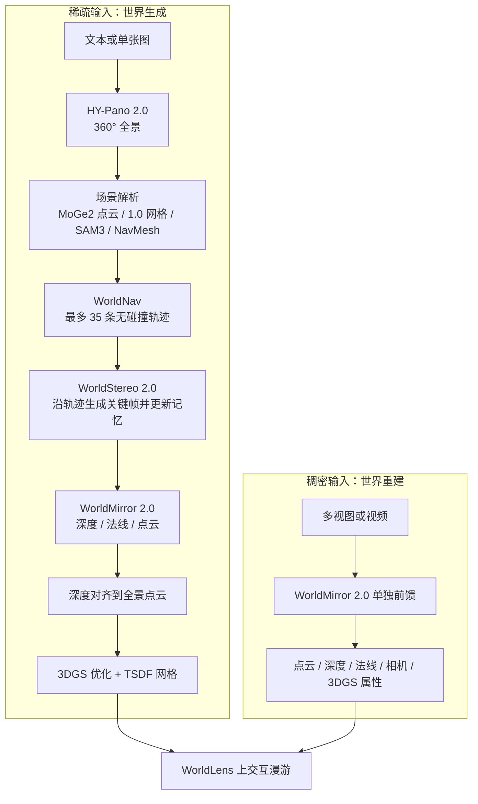
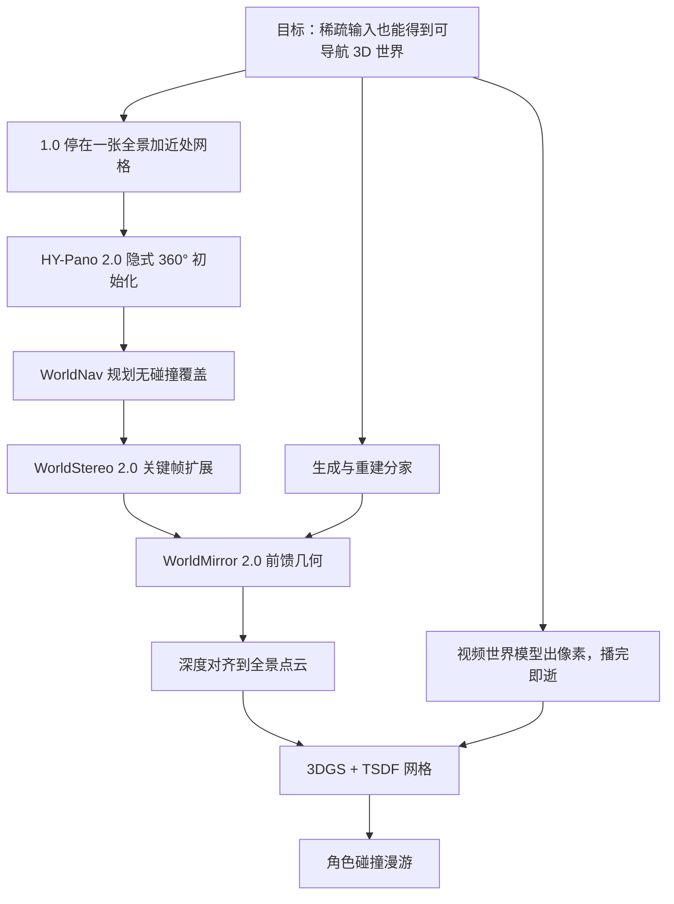

# HunyuanWorld 2.0：全景只是起点，真正的世界要沿着规划好的路走出来

<!-- release-date: 2026-04-16 -->

> 本文依据腾讯混元团队的 **HY-World 2.0: A Multi-Modal World Model for Reconstructing, Generating, and Simulating 3D Worlds**，即 arXiv:2604.14268v1（2026-04-15 提交，44 页）。动笔前核过 arXiv 提交历史：目前只有 v1，本地件封面水印为 `arXiv:2604.14268v1 [cs.CV] 15 Apr 2026`，与官方页一致，**未做替换**。官方仓库没有另放一份技术报告 PDF，只链向同一篇 arXiv。
>
> 全文页码指本地 44 页 PDF 自身页码。文中始终区分三件事：**报告写了什么**、**我们如何解释**、**哪些是外部补充**。凡是本文自己归纳的、从图里读出来的、或者从官方仓库补进来的，都会当场说明。
>
> 边界说明：本篇是 HunyuanWorld 1.0 的后续框架，讲的是**离线 3D 世界**——输入文本 / 单图 / 多图 / 视频，输出可导航的 3D 高斯泼溅场景。同目录另有一条 HunyuanWorld 1.5（WorldPlay）线，那是实时流式交互视频，不是本篇。Genie、Cosmos 一类「世界模型」输出的是像素视频仿真器；本篇输出的是能走进去、能做碰撞的 3D 资产。物体级 3D 资产生成见 Hunyuan3D-2.0 的解读。

## 读之前：这一篇会用到的词

HunyuanWorld 1.0 已经讲过全景图、等距柱状投影（Equirectangular Projection，ERP）、视差、3DoF / 6DoF、网格、点云、3D 高斯泼溅（3D Gaussian Splatting，3DGS）、单目深度、扩散模型和 DiT。本篇默认那些背景还在，只补这一次真正新出现、或者用法变了的词。

**世界生成 vs 世界重建**：报告把输入分成两档。文本或单张图信息太少，模型必须**凭空造出**没见过的地方，叫世界生成；多视图或视频已经把场景拍过一遍，模型要做的是把几何**收回来**，叫世界重建。两条路最后都落到 3D 表示上，但中间走的模块不同（PDF p. 4）。

**3DGS（3D Gaussian Splatting，3D 高斯泼溅）**：用一大堆带位置、朝向、颜色和透明度的椭球去拟合场景。1.0 把它列成网格之外的备选输出；2.0 把它升成**主输出**。渲染快，适合走进去看；做碰撞和物理时，报告会再从它抽出一张网格当代理（PDF p. 22、p. 29）。

**MMDiT（Multi-Modal Diffusion Transformer，多模态扩散 Transformer）**：一种把文字、条件图和噪声全景都放进同一条 token 序列、用自注意力一起去噪的扩散骨架。HY-Pano 2.0 用它，不再像 1.0 那样先按相机内参把照片几何地贴到球面上（PDF p. 6，Fig. 3）。

**NavMesh（Navigation Mesh，导航网格）**：游戏里给角色找路用的那张「能走的地面」。WorldNav 用 Recast Navigation 从全景点云 / 网格上建它，再在上面规划相机路径（PDF p. 7）。

**Plücker 射线**：把一条 3D 射线写成一组坐标，用来告诉生成模型「这一帧的每个像素朝哪个方向看」。WorldStereo 2.0 用它做相机控制（PDF p. 12）。

**Keyframe-VAE（关键帧变分自编码器）**：普通视频 VAE 会在时间维也压缩，镜头一快就糊。Keyframe-VAE 把每一帧当独立图像做**只压空间、不压时间**的编码，用更稀的关键帧覆盖同样大的视角变化（PDF p. 10–11）。

**GGM / SSM++**：WorldStereo 2.0 的两块记忆。全局几何记忆（Global-Geometric Memory，GGM）用点云把 360° 粗结构钉住；改进的空间立体记忆（Spatial-Stereo Memory++，SSM++）把检索到的旧关键帧和当前目标帧左右拼在一起，补细纹理（PDF p. 10、p. 13）。

**DMD（Distribution Matching Distillation，分布匹配蒸馏）**：把多步扩散压成少步学生模型的蒸馏方法。WorldStereo 2.0 用它把生成器蒸成 4 步 DiT（PDF p. 14）。

**RoPE（Rotary Position Embedding，旋转位置编码）**：给注意力里的 Query / Key 按位置做旋转，让模型知道「谁在左、谁在右」。WorldMirror 1.0 用绝对整数网格；2.0 改成归一化到 $[-1,1]$，换分辨率才不会崩（PDF p. 16）。

**DPT 头（Dense Prediction Transformer head）**：接在 Transformer 骨干后面、专门吐出逐像素图（深度、法线、点图、高斯属性）的解码头（PDF p. 15）。

**IBL（Image-Based Lighting，基于图像的光照）**：用一张环境贴图给场景和角色打光。摘要把自动 IBL 写成 WorldLens 的卖点之一，正文没有展开实现（PDF p. 1、p. 37）。

**Marble**：World Labs 的闭源 3D 世界产品。报告拿它当闭源对照，比较日截止到 2026-03-30 的 Marble 1.0，只有定性图，没有对照表（PDF p. 29 脚注 3）。

## 一句话先说清

HunyuanWorld 1.0 的答案是：先生成一张 360° 全景当世界代理，再分层剥开、抬成网格。它能转头、能在近处挪几步，但**球外那一大片世界并不存在**。

HY-World 2.0 没有丢掉全景，而是把它降成**第一站**：

> **先用一张全景站住脚，规划出该往哪走，沿路用视频生成先验把没拍到的地方补出来，最后把这些关键帧锁进一块可导航的 3DGS。**

四段的名字是 HY-Pano 2.0、WorldNav、WorldStereo 2.0、WorldMirror 2.0。因果顺序不能乱：没有全景就没有可走的几何；没有轨迹，扩展模型就不知道镜头该去哪；没有扩展出来的新视角，重建就只能围着原点转；没有重建和对齐，3DGS 就没有可优化的点。

另一件和 1.0 不同的事：多视图或视频不再被当成「生成失败后的补丁」，而是正式的第二条入口。WorldMirror 2.0 既给生成流水线收尾，也能单独做世界重建。报告把自己定位成「开源社区里第一份把生成和重建收进同一套离线 3D 范式的系统」（PDF p. 4）。

所以这篇不要记成四个组件名。要记的是：**全景负责出生点，轨迹负责覆盖，视频先验负责把世界撑大，前馈重建负责把撑大的东西钉成 3D。**

## 报告地图：44 页里各写了什么

| 报告章节 | PDF 页 | 讲了什么 | 密度 |
|---|---|---|---|
| 标题、摘要 | p. 1 | 四阶段、WorldLens 四点卖点、对标 Marble、宣称开源全部权重与代码 | 高 |
| Contents | p. 2 | 目录；WorldLens **没有独立章节** | — |
| Figure 1 | p. 3 | 生成 / 重建 / 机器人 / 游戏 / 环境建图示意 | 低 |
| §1 引言 | p. 4 | 1.0 离线 3D vs 1.5 在线视频；生成与重建分家；四阶段总述 | 高 |
| Figure 2 + §2 Overview + §3 开头 | p. 5 | 四阶段总图；全景作为世界初始化 | 高 |
| §3.1–3.2 HY-Pano 2.0 | p. 6 | 数据升级；隐式透视→ERP；循环填充 + 像素融合 | 高 |
| Figure 3–4 + §4.1 | p. 7 | 全景网络结构；MoGe2 / SAM3 / NavMesh 场景解析 | 高 |
| Figure 5 + Table 1 + §4.2 | p. 8–9 | 五种轨迹，最多 35 条 | 高 |
| Figure 6 + §5 开头 + Figure 7 + Table 2 | p. 9–10 | WorldStereo 三段训练；关键帧潜空间 vs 原生视频 / 自回归 | 高 |
| Figure 8–9 + §5.1 | p. 11–12 | Keyframe-VAE；Plücker + 点云相机控制 | 高 |
| Figure 10–11 + §5.2 | p. 12–14 | GGM、SSM++、记忆增强 | 高 |
| §5.3 | p. 14 | DMD 蒸成 4 步 | 中 |
| Figure 12 + §6.1–6.2 开头 | p. 15 | WorldMirror 总图；相对 1.0 的三处限制 | 高 |
| Table 3 + §6.2.1 | p. 16 | 1.0 / 2.0 对照表；归一化 RoPE | 高 |
| Figure 13 + §6.2.2–6.2.3 | p. 17 | 深度转法线损失；深度掩码头 | 高 |
| §6.3–6.5 | p. 18–19 | UE 数据、伪法线、SP+BF16+FSDP、token 预算、三阶段课程 | 高 |
| Figure 14 + §7 开头 | p. 19 | 深度对齐流水线 | 高 |
| Figure 15 + §7.1 | p. 20–21 | 点云扩展；线性对齐 + 异常值修正 | 高 |
| §7.2 | p. 21–22 | 3DGS：无 SH、天空不加密、MaskGaussian、TSDF 抽网格 | 高 |
| Table 4 + §8.1.1–8.1.2 | p. 23 | 全景指标；轨迹必要性 | 高 |
| Figure 16–18 | p. 24–26 | 全景定性，三整版 | 低 |
| Figure 19 + Table 5–7 | p. 27 | 轨迹消融图；单视图重建与相机控制 | 高 |
| Table 8 + Figure 20 + §8.1.4 | p. 28–29 | 记忆 / 蒸馏消融；相对 video2world；3DGS 消融 | 高 |
| Table 9 + §8.1.5 | p. 29 | 10 场景 3DGS 消融；Marble 对照设定 | 高 |
| Figure 21–22 + Table 10 | p. 30–31 | 整条流水线样例；角色漫游；端到端 712 秒 | 高 |
| Figure 23–24 | p. 32–33 | 与 Marble 的定性对照，两整版 | 低 |
| Table 11–13 + Figure 25–27 | p. 34–36 | WorldMirror 重建、位姿、深度、新视角、法线、先验 | 高 |
| Table 14 + §9 | p. 37 | 推理效率；结论里再次点名 WorldLens | 高 |
| Contribution | p. 38 | 名单 | — |
| 参考文献 | p. 39–44 | 87 条 | — |

四件读目录就会漏掉的事：

- **WorldLens 没有独立章节。** 摘要和结论各写了一句，正文只在交互漫游（Fig. 22）和从 3DGS 抽网格做碰撞（§7.2、§8.1.5）里能对上部分功能。引擎无关架构、自动 IBL、训练—渲染共设计，报告没有展开。
- **没有 Limitations 节。** 结论直接收束到「开源 SOTA、可比 Marble」。失败模式、尺度上限、动态场景，正文几乎不谈。
- **对标 Marble 只有定性图。** 开源对照有表，闭源对照没有数字。
- **参数量、训练数据量、预训练基座名，正文几乎不给。** 全景、WorldStereo、WorldMirror 的规模都要到官方仓库的 Model Zoo 才能看到——那些是外部补充，后面会标出来。

阅读路线：先读「先讲矛盾」和四阶段总览，再按 HY-Pano → WorldNav → WorldStereo → WorldMirror / Composition 走完因果链，最后看评测、WorldLens 缺口和开源范围。**只有十分钟，读矛盾、总览、WorldStereo 为什么改关键帧、WorldMirror 为什么能一身二职、以及评测里 Marble 与 712 秒那两段。**

## 先讲矛盾：1.0 走不远，视频世界留不住

报告开篇把混元自己已经做过的两条路摊开来（PDF p. 4）：

- **HY-World 1.0**：离线 3D。显式建一个可探索的 3D 世界，天然和图形管线兼容。
- **HY-World 1.5**：在线视频。按用户动作实时出画面。那是另一条线，本篇不写它的帧率，也不把它的数字搬过来。

然后指出，3D 世界建模现在还裂成两半（PDF p. 4）：

| 路线 | 擅长 | 卡住的地方 |
|---|---|---|
| 生成（文本 / 单图） | 从稀疏输入想象出能逛的场景 | 重建精度不够严 |
| 重建（多视图 / 视频） | 把深度、法线、点云收回来 | 没有生成先验，看不见的区域补不出 |
| 闭源统一体（点名 Marble） | 两边都能做 | 开源侧没有对等的基础模型 |

1.0 解读里已经写过另一对更老的矛盾：视频好看但不是世界，直接 3D 接得进管线但数据不够。2.0 没有推翻那对判断，它补的是 1.0 **做完之后还缺的三块**：

1. **走不远。** 1.0 的分层网格能制造近处视差，球外世界要另挂视频模型。2.0 把「沿轨迹生成新视角」收进主流程。
2. **生成和重建分家。** 1.0 几乎整条主路径都在 2D 上学习，深度用现成模型、抬升是闭式几何。2.0 需要一个能吃生成关键帧的前馈重建器，同时这个重建器还要能单独服务多视图 / 视频。
3. **输出还不够「能玩」。** 1.0 主输出是网格；2.0 主输出改成可导航 3DGS，再用抽出的网格做碰撞，接上角色漫游（PDF p. 22、p. 29、p. 31）。

和 Genie、Cosmos 那种世界模型的差别，报告自己写在「离线 3D 范式」里（PDF p. 4）：2.0 可以在扩展阶段借用视频扩散的生成先验，但**交付物不是一段播完即逝的像素**，而是一块能换视角重渲染的 3D 资产。这是本文对报告定位的收窄，也是和本站 Genie、Cosmos 解读对齐时必须先说清的一句。

## 先看全景：两条入口，四段因果

这张图按 Figure 2（PDF p. 5）和 §2、§6、§7 的文字重画，只表示模块依赖，不含耗时。Figure 2 画的是生成那一条；重建作为独立入口写在 §6，同时被 §7 嵌回生成的最后一站。

四段必须按这个顺序理解，原因如下。

**第一段 HY-Pano 2.0 解决的是「出生点」。** 没有 360° 覆盖，后面的轨迹规划没有几何，扩展模型也没有可检索的初始记忆。1.0 已经证明全景是数据够用的世界代理；2.0 把它留下，但改成不依赖相机内参的隐式映射。

**第二段 WorldNav 解决的是「该看哪」。** 只围着原点转，遮挡背面、走廊尽头、天上的盲区都还是空的。规划本身不生成像素，它给第三段一份相机路径清单。

**第三段 WorldStereo 2.0 解决的是「路两边长出什么」。** 这是 1.0 最缺的那一截：用视频扩散的生成先验，沿规划好的相机走，把没拍到的地方补成关键帧。它必须既听话（相机控得住）又记得住（多条轨迹之间别漂）。

**第四段 WorldMirror 2.0 + 3DGS 解决的是「把生成结果钉成世界」。** 关键帧仍是 2D。要对齐到全景的世界坐标、初始化 3DGS、抽出能做碰撞的网格，生成才变成可导航资产。WorldMirror 之所以提前在 §6 讲，是因为它还单独承担重建入口。

WorldLens 挂在出口之后：报告称它是高性能 3DGS 渲染平台，用来带角色、打光、做碰撞地逛这些资产（PDF p. 1、p. 37）。实现细节见后文缺口。

## 核心一：HY-Pano 2.0——全景还在，但不再先做几何贴图

### 旧问题

1.0 图生全景的第一步是估计相机内参，把照片反投影到 ERP 球面，再向外扩。报告说这条老路有两个硬伤（PDF p. 6）：

- 真实照片经常**没有、或不准**焦距 / 视场角；
- 显式几何对齐一旦错了，投影畸变会直接写进全景。

全景数据本身也仍稀缺。2.0 没有换代理，它把 1.0 的数据管线加大，并换了一种不吃相机元数据的生成方式。

### 数据：还是真实全景 + 引擎渲染，过滤更针对接缝

数据来源两类（PDF p. 6）：

1. **真实采集**：大量高分辨率真实全景，用来注入真实光照、复杂纹理和自然结构先验。
2. **合成资产**：用 Unreal Engine 一类高端引擎渲染，提供精确几何标签和野外难采的想象型场景。

过滤针对两类脏样本：明显的拼接伪影，以及暴露出来的拍摄设备（比如全景相机本身）（PDF p. 6）。报告说这能拉开语义分布、缩小合成与真实的域差。**数据量、分辨率、过滤阈值一个都没给。**

### 模型：隐式透视→ERP，接缝用「潜空间循环 + 像素融合」

HY-Pano 2.0 用 MMDiT（PDF p. 6，Fig. 3）。做法是：

1. 条件图和全景目标都进同一个潜空间；
2. 把条件图潜变量和全景噪声潜变量**拼成一条 token 序列**；
3. 靠自注意力自己学透视到 ERP 的对应，不再要显式相机先验。

人话版：1.0 是先拿尺子把照片贴到地球仪上，再让模型把空白补上；2.0 把尺子收起来，让注意力在特征里自己找「这张照片该贴在球面哪一块」。代价是对应关系不可检，报告也没给失败案例。

接缝仍是 ERP 的老问题。2.0 的对策是两级（PDF p. 6，Fig. 3 右侧）：

- **潜空间循环填充（circular padding）**：去噪时让左右边界在张量上变成邻居；
- **像素空间线性融合（pixel blending）**：解码后再沿左右边做线性混合。

1.0 用的是循环去噪。2.0 把「循环」留在潜空间，并多了一步像素融合。报告没有消融这两步各自贡献多少。

Figure 3 左侧还能读到：文本编码、带循环填充的潜编码、另一路潜编码，一起送进堆叠的 MMDiT Block。文生全景和图生全景走同一套骨架。

### 因果链收尾

| 环节 | 内容 |
|---|---|
| 旧问题 | 1.0 依赖相机内参做显式贴图，元数据常缺；全景数据仍稀 |
| 新设计 | 加大真实 + UE 数据；MMDiT 隐式学透视→ERP；循环填充 + 像素融合 |
| 工作机制 | 条件图与全景噪声在潜空间拼成一条序列，自注意力找对应 |
| 收益 | 不校准的照片也能扩成 360°；多数全景指标超过 1.0 和所列基线 |
| 代价 | 对应不可检；数据规模未公开；T2P 的 Equi 画质分没有全面超过 1.0 |

**可迁移的启发**：当前一步几何变换需要的元数据经常缺失时，与其把估计误差写进输入，不如让模型在特征空间学那个变换，把几何做成注意力的副产品。适用边界是——你必须用下游指标证明它学对了，而不能只看「不再报缺少内参」。

## 核心二：WorldNav——先决定往哪走，再允许世界变大

### 旧问题

一张全景加一张深度，出生点附近的几何是有的。可是：

- 前景挡住的背面没有；
- 走廊和街道的远处没有；
- 天上和绕物体一圈的视角没有。

如果第三段盲目生成，镜头会穿模、会看重复的地方、会把该补的洞留下。WorldNav 的任务不是画图，是给出**覆盖尽量全、又撞不上东西**的相机路径，并配上文本指令给下游生成（PDF p. 6）。

### 先解析场景，再规划

给定全景，先做四件套（PDF p. 7，Fig. 4）：

1. **全景点云 $P_{\mathrm{pan}}$**：用 MoGe2 的优化框架，把 ERP 切成透视视图，用 LSMR 对齐单目深度。采样密度从默认 12 个视图加到 **42**，用 GPU 加速的 LSMR 扛计算。再用视觉—语言接地管线遮掉无界天空，去掉深度跳变造成的边缘浮点。这坨点云会贯穿轨迹、扩展和合成。
2. **全景网格**：沿用 HY-World 1.0 的做法，**更低分辨率**，专门给轨迹规划做严格碰撞检测。
3. **语义**：Qwen3-VL 找地标和障碍，SAM3 出 2D 掩码，再把质心抬到 3D，统计滤波去掉背景离群点。
4. **NavMesh**：Recast Navigation 标出可走区域。然后三步修网格：射线把顶点吸到地面、KD-Tree 边界腐蚀避免贴障碍太近、在孤立可走区之间造桥多边形。

这里有一个和 1.0 的衔接：**2.0 并没有扔掉 1.0 的网格，只是把它降级成规划期的碰撞体。** 最终给人逛的主资产换成了 3DGS。

### 五种轨迹，上限 35 条

五种模式都从全景中心出发（PDF p. 8–9，Fig. 5，Table 1）：

| 模式 | 上限 | 是否贴物体 | 是否迭代 | 人话 |
|---|---:|---|---|---|
| Regular 常规 | 9 | 否 | 否 | 把全景切成三个 120° 透视，绕每块的中位深度轨道转，先俯仰 +45° 再方位 ±120°，再给俯仰轨道加 +60° 方位，补空中视角 |
| Surrounding 环绕 | 5 | 是 | 否 | 围着显著物体转，半径跟物体 3D 尺寸走；72 个候选点用射线在 NavMesh 上验证，双向贪心连成弧，末端修剪，再用 Dijkstra 接到起点 |
| Recon-Aware 重建感知 | 10 | 是 | 是 | 找网格里又长又尖的退化面（遮挡拉伸），NMS 出簇中心并挂到最近语义地标；相机对准缺失区，再绕着它转一圈看新视角 |
| Wandering 漫游 | 3 | 否 | 否 | 把 NavMesh 按原点切成八个扇区，每区用 Dijkstra 距离场走向最远可达点；适合街道、走廊 |
| Aerial 空中 | 8 | — | 否 | 给已有环绕和漫游加 +45° 上仰，撞到全景网格就动态减小俯仰 |

Table 1 注明：空中类包含环绕和漫游；环绕与重建感知的上限还受全景里检出的物体段数限制。合计上限 35。碰撞导致几乎走不动的轨迹直接丢（PDF p. 8）。

常规轨迹有一个容易漏的设计：**先做俯仰旋转，再做方位。** 报告说这样能先拿到全局概览，方便后续背景生成保持一致（PDF p. 8）。这是在为第三段的记忆机制铺路——先有一张「整场的样子」，再去补局部。

### 因果链收尾

| 环节 | 内容 |
|---|---|
| 旧问题 | 只围着全景原点转，遮挡背面和远处仍是空洞 |
| 新设计 | 先解析几何 / 语义 / 可走性，再启发式规划五种无碰撞轨迹 |
| 工作机制 | 42 视图 MoGe2 点云 + 1.0 低分辨率网格碰撞 + NavMesh 寻路 |
| 收益 | 给扩展阶段一份「该看哪」的清单；消融图显示每加一类轨迹，场景就补一块 |
| 代价 | 启发式，不是学习式规划器；物体段数决定部分上限；规划本身就要 182 秒 |

**可迁移的启发**：生成模型很贵的时候，不要让它自己决定走哪。先用便宜的几何和规则把覆盖问题从生成问题里拆出去。WorldNav 是「先规划再生成」在 3D 世界上的一次具体化：规划错了，后面再强的视频先验也在补错的地方。

## 核心三：WorldStereo 2.0——视频先验只用来扩，不拿来当世界

### 旧问题

第三段要沿 WorldNav 的路径造出大量新视角，供第四段重建。现成的相机控制视频扩散有三个对不上的地方（PDF p. 9–10，Table 2）：

- **原生视频扩散**：一次出一条很长的视频，感受野双向，但帧又密又冗余，快镜头时时空压缩会把几何拧坏。
- **自回归视频**：可以接得很长，但错误会累积，帧质量更差。
- **下游要的不是好看的视频，是能重建的多视角。** 重复帧帮不上点云，糊帧会把深度带崩。

WorldStereo 1.0 已经在做「相机引导视频 + 3D 几何记忆」。2.0 的升级，报告写成三句话（PDF p. 4）：改到关键帧空间、记忆更稳、以及后训练蒸馏。

训练分三阶段（PDF p. 9，Fig. 6）：域适应（相机控制）→ 中期训练（记忆一致性）→ 后蒸馏（快推理）。

### 为什么潜空间要改成关键帧

普通 Video-VAE 同时压空间和时间。镜头一快，重建和生成都会出伪影（PDF p. 11，Fig. 8）。2.0 改成 Keyframe-VAE：对 $(1+T_{\mathrm{kf}})$ 张关键帧各自做带因果填充的图像编码，空间压缩到 $H/8 \times W/8$，**不做时间压缩**（PDF p. 10–11，Fig. 9）。

同一 token 长度下，关键帧张数比视频帧少（$T_{\mathrm{kf}} \ll T_{\mathrm{vid}}$）。他们的补法是**加大采样间隔**，用更稀的帧覆盖同样大的视角变化，并声称丢掉的帧对重建大多是重复的（PDF p. 11）。另外，帧与帧独立，编解码更好并行。

Table 2 把三种范式并排：WorldStereo 2.0 是双向感受野、中等长度、**多条轨迹**、关键帧图像潜空间；报告在帧质量、冗余、相机控制、一致性、效率上全部打了正号。这张表是设计主张，不是实测分数。

### 相机怎么控：Plücker 射线 + 点云，只解冻该解冻的层

WorldStereo 2.0 建在预训练视频 DiT 上，外挂一个从零训的轻量 Transformer 相机适配器（PDF p. 12，Fig. 7b）。引导有两路：

- 相机 Plücker 射线；
- 点云。

域适应阶段还不用全景点云，只用参考视图 $I_{\mathrm{ref}}$ 提出的 $P_{\mathrm{ref}}$（滤掉浮点后 $N \le HW$），再按目标相机把它投到各目标视图：

$$
P^{\mathrm{tar}}_{i}(x) \simeq R^{c \to w}_{i}\, D(x)\, K_{i}^{-1} \hat{x}
$$

$R^{c \to w}_{i}$、$K_{i}$ 是第 $i$ 个目标视图的相机到世界矩阵和内参，$D(x)$ 是参考图上的单目深度，$\hat{x}$ 是齐次像素坐标（PDF p. 12，式 1）。投过去的点云渲成关键帧，再经 Keyframe-VAE 编码。

和「只训控制分支」的 Uni3C 不同，他们还微调 DiT 骨干的一部分，好让骨干适应关键帧潜空间。域适应时冻结交叉注意力和前馈层，报告说这是性能和泛化的最好折中，依据是 Table 7 的消融（PDF p. 12、p. 27）。

### 两块记忆：粗结构用点云钉，细纹理用左右拼接补

**GGM。** 点云在域适应里只是软相机引导，模型常常不理几何。中期训练把全局点云扩成 $P_{\mathrm{glo}} = [P_{\mathrm{ref}}, \hat{P}]$，从 $T_g=2$ 个新视角随机采样附加点，再拿这些点云渲出来的视频去微调，逼模型把 360° 结构内化（PDF p. 12，式 2，Fig. 10a）。推理时直接用 §4.1 的全景点云 $P_{\mathrm{pan}}$ 当全局几何。

**SSM++。** GGM 粗、易累积误差。旧办法是把历史帧全部拿来做全注意力，但全景场景里检索到的参考帧往往不连续、无序。WorldStereo 1.0 的 SSM 受立体匹配启发：把参考帧和目标帧左右拼接，把注意力限制在每一对上。2.0 的 SSM++ 改了四处（PDF p. 13，Fig. 11）：

1. 取消独立记忆分支，检索关键帧直接进主 DiT；
2. 改 RoPE：目标帧和对应检索帧水平拼成宽度 $2W$，检索帧继承目标帧的时间索引；
3. 不再强制每帧都检索，只挑最相关的，且 $T_r < T_{\mathrm{kf}}$；
4. 中期训练放开注意力感受野（交叉注意力除外），用全自注意力看全局；显式点图引导换成 7 维相机向量（四元数 + 平移）经三层 MLP 得到的隐式相机 token。

检索策略按数据分（PDF p. 13–14，Fig. 10b）：已有多视图数据做**时间错位检索**（与目标 30%–90% 时间重叠，故意纳入轨迹外的帧）；UE 合成数据做**多轨迹检索**（按 3D 视场相似度从别的轨迹挑）。推理时，全景切出的透视视图是初始记忆库，之后用生成关键帧增量更新，存 RGB 和相机，按 3D 视场检索。

记忆增强故意把训练条件弄脏（PDF p. 14）：GGM 侧 50% 深度双线性降采样模拟 bleeding、10% 高斯滤波造浮点、真实数据 50% 保留未过滤的单目深度；SSM++ 侧对检索帧做运动模糊、颜色抖动和随机裁剪。报告特别说，像点云扭曲那种过强增强会把几何引导打废，GGM 不能用。

### 蒸馏：4 步，而且连记忆一起蒸

后训练用改过的 DMD（PDF p. 14，式 3）。学生 $G_\theta$、真实分数 $s_{\mathrm{real}}$、假分数 $s_{\mathrm{fake}}$ 都从中期训练后的同一 VDM 初始化；$s_{\mathrm{real}}$ 冻结，$G_\theta$ 和 $s_{\mathrm{fake}}$ 可训，假分数每更新 5 次才更新一次生成器。随机梯度截断稳住训练。GAN 损失被拿掉，因为他们觉得收益不明显还拖慢训练。

和 WorldStereo 1.0 只蒸相机控制、冻结记忆分支不同：2.0 认为 SSM++ 不再依赖显式点图、UE 数据又够，所以蒸馏阶段**连记忆一起全微调**。报告说更贵，但相机精度和记忆能力一起涨。生成器被蒸成 **4 步 DiT**。

### 因果链收尾

| 环节 | 内容 |
|---|---|
| 旧问题 | 视频扩散帧密、快镜头糊、多轨迹不一致，不适合当重建输入 |
| 新设计 | 关键帧潜空间 + 点云/射线相机控制 + GGM/SSM++ + 4 步 DMD |
| 工作机制 | 沿 WorldNav 路径生成中等长度、多条、可检索更新的关键帧 |
| 收益 | 相机误差低于所列开源对照；记忆消融后一致性和画质明显上升 |
| 代价 | 三段训练复杂；记忆增强会在干净指标上略退；推理仍是整条流水线最慢的一段（286 秒） |

**可迁移的启发有两条。** 第一，**生成的表示要按下游任务选，不要按预训练基座选。** 视频 VAE 是为「好看的连续视频」压的，重建要的是稀疏、清晰、视角差大的帧，所以他们宁可少帧、加大间隔。第二，**记忆要分分辨率**：全局用便宜的几何钉结构，局部用检索拼接修纹理，两套记忆不要抢同一个通道。

## 核心四：WorldMirror 2.0——一身二职的前馈重建器

§6 插在世界合成之前，不是跑题。WorldMirror 2.0 既是生成流水线第四段的几何抽取器，也是多视图 / 视频重建的独立入口（PDF p. 15）。

### 1.0 留下三处伤

WorldMirror 1.0 的骨架 2.0 还在用（PDF p. 15，Fig. 12）：

- **任意模态标记化（Any-Modal Tokenization）**：图像、位姿、内参、深度都编成同一条 token；训练时每种先验独立以 0.5 概率丢掉，推理才能随意开关。
- Transformer 骨干做全局—局部注意力，多个 DPT 头一次吐出点图、多视图深度、法线、相机参数、逐像素 3DGS 属性。
- 两阶段课程：先联合训几何头，再冻几何、只训高斯头。

2.0 要修的三件事（PDF p. 15）：

1. 训练分辨率之外，效果掉得厉害；
2. 深度和法线各训各的，几何不一致；
3. 视图一多，显存和延迟吃不消。

Table 3（PDF p. 16）把改动收成一张表，转写如下：

| 组件 | WorldMirror 1.0 | WorldMirror 2.0 |
|---|---|---|
| 位置编码 | 绝对 RoPE | 归一化 RoPE |
| 深度监督 | 只有真值深度 | 真值深度 + 真值 / 伪法线 |
| 无效像素 | 只有置信度 | 置信度 + 深度掩码头 |
| 加速 | 无 | Token/Frame 序列并行 + BF16 + FSDP |
| 数据 | 开源数据 | 再加内部 UE 渲染 |
| 伪标签 | 无 | 法线伪标签 |
| 分辨率 / 视图采样 | 互相独立 | 按 token 预算动态 |
| 课程 | 2 段 | 3 段 |
| 分辨率采样 | 100K–250K 像素 | 50K–500K 像素 |

### 归一化 RoPE：把外推变成内插

1.0 给每个 patch 绝对整数坐标 $(i,j)$。测试分辨率比训练大时，一部分下标从未见过，这叫位置外推；更小时下标空间又用不满（PDF p. 16）。2.0 把坐标按高、宽独立归一化到 $[-1,1]$：

$$
\hat{x}_i = \frac{2i+1}{H_p} - 1,\qquad
\hat{y}_j = \frac{2j+1}{W_p} - 1
$$

分子 $+1$ 是为了对齐像素中心，避免边界 patch 塌到 $\pm 1$。高和宽分开归一，能保住长宽比（PDF p. 16，式 4）。设计灵感来自 DINOv3。

效果在 Fig. 13：归一化 RoPE 跨分辨率余弦相似度保持在 0.95 以上，均值和标准差几乎不漂；标准 RoPE 在大分辨率上相似度掉到约 0.01 量级，均值系统性漂移。后文评测里，1.0 在高分辨率上点图和位姿明显变差，2.0 没有跟着掉——这是少数「设计有直接数字支撑」的地方。

### 深度转法线：给深度头一条不依赖可靠深度真值的路

1.0 深度头和法线头独立监督。真实多视图深度又吵又缺，单目伪深度还有多视图不一致。2.0 加深度转法线损失 $L_{\mathrm{d2n}}$：把预测深度反投影成点，用有限差分求法线，再和法线目标算角误差（PDF p. 17，式 5–6）。

法线目标按数据源分：合成数据用真值深度走同一套深度转法线；真实数据用单目法线教师的伪法线。法线只描述局部朝向，不要求全局尺度一致，所以比伪深度更适合当多视图伪标签（PDF p. 18）。于是深度头在没有可靠深度真值的数据上，也能从法线拿到几何监督。

### 深度掩码头：推理时要能说出「这个像素别信」

1.0 只用置信度调训练损失，推理没有显式有效性。2.0 加一个逐像素有效 logit，二元交叉熵训练（PDF p. 17，式 7）。合成数据的掩码来自渲染管线；真实数据用极端深度、大深度跳变、天空做伪标签。下游融合点云时可以按预测掩码丢掉无效像素。

### 数据、推理、训练策略

数据多了内部 UE 渲染，以及上面说的法线伪标签。他们明确拒绝用单目深度当伪深度，因为会在点云里看出分层（PDF p. 18）。

推理三件套（PDF p. 18）：

- **序列并行**：骨干按 token 切，注意力层 All-to-All；DPT 头按帧切，因为卷积在单张特征图上独立。
- **选择性混合精度**：多数参数 BF16，一小撮数值敏感模块留 FP32。
- **FSDP**：每个 Transformer 块和每个 DPT 头作为一个分片单元。

训练改了两件（PDF p. 18–19）。一件是 **token 预算优先**：每 GPU 固定上限 $T_{\max}$（文中例子 25,000），先采样分辨率（50K–500K 像素）和长宽比，再反推最多能塞多少视图，上限 $N_{\mathrm{cap}}$ 例子是 48。视图不够 $N_{\max}$ 就打包多样本填满预算，避免 1.0 那种按最坏情况预留显存。另一件是课程拆成三段：Stage 1 只用原生标注训几何、不加伪标签和 $L_{\mathrm{d2n}}$；Stage 2 加上深度转法线、提高合成数据比例；Stage 3 冻骨干和几何头，只训从深度头权重初始化的 3DGS 头。

### 因果链收尾

| 环节 | 内容 |
|---|---|
| 旧问题 | 换分辨率就外推；深度 / 法线脱节；视图一多 OOM |
| 新设计 | 归一化 RoPE、深度转法线、掩码头、UE+伪法线、token 预算、三阶段、SP+BF16+FSDP |
| 工作机制 | 任意模态 token 进共享 Transformer，多头一次出几何和高斯属性 |
| 收益 | 高分辨率不再崩；可单独做重建，也可给生成流水线当几何后端 |
| 代价 | 课程和并行配置变复杂；论文没给参数量和训练算力 |

**可迁移的启发**：一个模块要在两条产品线上复用，就不要为「生成」或「重建」各训一个几何网络。WorldMirror 的做法是把先验做成可丢的 token，把分辨率做成归一化坐标，把无效像素做成显式头——让同一套权重既能吃干净多视图，也能吃生成出来的脏关键帧。

## 核心五：世界合成——把生成帧对齐到全景的世界坐标，再优化 3DGS

第四段的输入是：全景 $I_{\mathrm{pan}}$、全景点云 $P_{\mathrm{pan}}$、WorldStereo 沿轨迹生成的 $T_{\mathrm{ex}}$ 张关键帧及其相机（PDF p. 19）。两步：先扩点云，再训 3DGS。

### 点云扩展：WorldMirror 出深度，线性对齐到全景

先从全部生成帧里降采样出子集 $T'_{\mathrm{ex}}$，把全景切出的透视视图和这些关键帧一起交给 WorldMirror，相机作为几何先验（PDF p. 20，式 10）。WorldMirror 不是为全景重建专门训的，报告说配上生成关键帧仍然好用，且在同样相机条件下点云比 MapAnything、DepthAnything3 更干净（PDF p. 20，Fig. 15）。

但 WorldMirror 深度有尺度歧义，对不上 $P_{\mathrm{pan}}$ 的世界坐标；户外难例第三行 Fig. 15 也仍会翻车。于是用全景点云当引导做对齐（PDF p. 19–21，Fig. 14）：

1. 从相机 $C_i$ 把 $P_{\mathrm{pan}}$ 渲成稀疏引导深度 $D^g_i$；
2. 有效掩码是多层交集：WorldMirror 置信度、引导投影、法线一致、去掉边缘浮点、去掉天空；
3. 在有效区域上估尺度 $\gamma_i$ 和偏移 $\beta_i$，得到 $D^a_i = \gamma_i D^m_i + \beta_i$。报告写深度式，脚注说实践在视差空间做，前景对齐更好。

他们觉得 WorldMirror 初始深度已经够好，**逐帧线性对齐就够**，不必上复杂非线性。仍会有稀疏掩码或刁钻轨迹把系数估飞。对策是全局统计：在场景深度范围内均匀取 $Q=9$ 个锚点，看每帧变换后的锚点相对所有帧中位数的最大相对偏差，超过第 90 百分位的系数对当成异常，换成同一视频里最近的正常系数；整段都异常就把深度丢掉（PDF p. 21，式 13）。对齐后的深度反投影成 $P_{\mathrm{ex}}$，与 $P_{\mathrm{pan}}$ 合并再体素下采样，得到最终点云 $\tilde{P}$。

和 video2world 的对照写在评测里：对方用特征匹配 ICP，单场景约 5 小时，还难并行；这边线性对齐利用已知相机，**不到 2 分钟**，质量相当（PDF p. 28–29）。前提是 WorldStereo 的多视图已经足够一致，所以他们不再需要 video2world 那种非刚性 3DGS。

### 3DGS：生成场景几乎没有视角相关外观

初始化用 $\tilde{P}$。每个高斯有不透明度、中心、协方差（拆成缩放 $S_k$ 和旋转 $R_k$）。关键观察：**生成场景几乎没有视角相关效果**，所以不用球谐函数（Spherical Harmonics，SH）建模外观，直接用与视角无关的 RGB $c_k$（PDF p. 21）。后面评测也说 SH 会在新视角里弄出颜色伪影。

加密策略是个两难：不加密，点云疏密不均，低频区域（天空、平面）高斯太多拖渲染，均匀体素下采样又伤高频纹理；开标准自适应加密能找回细节，但天空没有深度监督，会冒大量浮点。解法两步（PDF p. 21–22）：

1. 点云分成天空 / 场景，**只在场景上做标准加密**；
2. 接入 MaskGaussian：每个高斯的存在是从可学习 logit 用 Gumbel-Softmax 采出的二值掩码 $M_k$，写进 tile rasterizer：

$$
c(x)=\sum_{k=1}^{N} M_k c_k \sigma_k T_k,\qquad
T_{k+1}=T_k(1-M_k\sigma_k)
$$

$M_k=0$ 时这个高斯既不贡献颜色也不消耗透射率，但反向仍有梯度。再用平均掩码激活的平方项鼓励稀疏。训练中激活概率长期接近 0 的高斯被永久剪掉。

损失四项（PDF p. 22，式 16–18）：颜色（L1 + SSIM + LPIPS，真值来自全景切分视图和生成关键帧的并集）、几何（对齐深度的稀疏 L1 + MoGe2 法线的余弦，法线因无需对齐所以能用在全部帧）、尺度正则（惩罚过尖的高斯）、掩码稀疏。

最后从优化好的 3DGS 渲 RGB 和深度，填进 TSDF，Marching Cubes 抽网格，去掉小连通块并做简化，供碰撞和物理用（PDF p. 22）。

### 因果链收尾

| 环节 | 内容 |
|---|---|
| 旧问题 | 生成关键帧的深度对不上全景世界坐标；直接 3DGS 会要么太密、要么满天浮点 |
| 新设计 | WorldMirror 深度 + 引导线性对齐 + 天空不加密 + MaskGaussian + 无 SH |
| 工作机制 | 先得到对齐点云当初始化，再按颜色 / 几何 / 稀疏联合优化，最后抽网格 |
| 收益 | 相对 6M 高斯基线，完整配置把数量降约 77%，画质几乎持平 |
| 代价 | 对齐仍可能整段丢深度；外观被当成漫反射，反光、镜面会失真 |

**可迁移的启发**：生成式重建不要照搬捕获式重建的全套。已知相机时，线性对齐往往比通用 ICP 更划算；没有真实光场时，SH 是负担不是能力；没有深度的区域（天空）不要让自适应加密自由生长。

## WorldLens：报告宣布了一个平台，正文几乎没写它

摘要给 WorldLens 四点：引擎无关架构、自动 IBL、高效碰撞、训练—渲染共设计，并支持带角色的交互探索（PDF p. 1）。结论复述「角色支持和光照控制」（PDF p. 37）。

正文能对上的只有这些：

- 从 3DGS 抽网格当碰撞代理，支持实时物理反馈；网格被做成轻量拓扑以便加载（PDF p. 22、p. 29）。
- Fig. 22（PDF p. 31）展示虚拟角色在楼梯、室内、户外里走，图注写实时碰撞和物理上说得通的反馈。图上能看到第三人称角色（含一只熊猫）穿过多类场景。图注**没有出现 WorldLens 这个名字**。
- 端到端加速提到序列并行、SageAttention2、FP8、step caching，这更像训练 / 推理侧，不一定等于「训练—渲染共设计」（PDF p. 31）。

引擎怎么无关、IBL 从哪张全景自动打到角色上、共设计改了光栅化的哪一步，**报告没写**。第三方综述里出现的 OpenGL / Vulkan / Unity 后端清单，不是这份 PDF 的内容，本文不采用。产品页 [sceneTo3D](https://3d.hunyuan.tencent.com/sceneTo3D) 可以去点，那是外部体验，不能用来补论文实现。

## 实验怎么证明

评测按组件拆，没有一张「整个世界好不好逛」的统一分数。下面只收报告写明的数字，并标页码。

### 全景：多数指标超过 1.0，但不是全胜

Table 4（PDF p. 23）。CLIP-T / CLIP-I 测条件对齐；Q-Align 给感知质量和美学，各报 ERP 原图和 12 个透视投影的平均。

| 任务 | 指标 | 最强开源对照 | HY-World 1.0 | HY-Pano 2.0 |
|---|---|---:|---:|---:|
| T2P | CLIP-T ↑ | DiT360 0.248 | 0.250 | **0.258** |
| T2P | Q-Align Qual 透视 ↑ | DiT360 3.788 | 3.992 | **4.103** |
| T2P | Q-Align Qual ERP ↑ | DiT360 4.436 | **4.493** | 4.403 |
| T2P | Q-Align Aes 透视 ↑ | DiT360 2.882 | **3.404** | 3.376 |
| T2P | Q-Align Aes ERP ↑ | DiT360 4.072 | 4.186 | **4.247** |
| I2P | CLIP-I ↑ | GenEx 0.831 | 0.831 | **0.844** |
| I2P | Q-Align Qual 透视 ↑ | CubeDiff 2.938 | 3.317 | **4.026** |
| I2P | Q-Align Qual ERP ↑ | GenEx 3.868 | 4.076 | **4.277** |
| I2P | Q-Align Aes 透视 ↑ | GenEx 2.445 | 2.638 | **3.208** |
| I2P | Q-Align Aes ERP ↑ | GenEx 3.646 | 3.767 | **4.056** |

报告说「多数指标最好」。上表对得上：I2P 五项全胜；T2P 的 ERP 感知质量和透视美学，1.0 仍高一点。定性上 Fig. 16–18 强调结构更完整、接缝更干净、细节更利。

### 轨迹：没有数字表，只有「每加一类就补一块」的图

Fig. 19（PDF p. 27）是逐步叠加：只训全景视图 → 加常规 → 加环绕与重建感知 → 加漫游 → 加空中。报告的观察是：只围着全景会有大块几何空洞；常规轨迹消掉大部分大尺度伪影，但车、木屋、街机侧面和背面仍缺；环绕 / 重建感知补物体；漫游补远处墙和地面。这是设计必要性的定性证据，不是定量覆盖率。

### WorldStereo：开源里相机更准，单视图重建 F1 最高

单视图生成再重建，点云在 Tanks-and-Temples 与 MipNeRF360 上比（PDF p. 27，Table 5）。Precision / Recall / F1 / AUC。WorldStereo 2.0 的 F1 在两个数据集都是最高（41.43 / 51.27）；DMD 版在 TnT 上 F1 再到 43.16，MipNeRF360 上略低于未蒸馏版。Lyra 在 TnT Precision 上最高（50.38），但 Recall 低，F1 仍低于 2.0。

相机控制 Table 6（PDF p. 27）只比域适应、不带记忆的模型（标 *）。WorldStereo 2.0* 的旋转 / 平移 / ATE 为 0.492 / 0.968 / 1.768，低于 SEVA、Gen3C、WorldStereo 1.0*，也低于同表里的 WorldPlay、WorldCompass——后两个是混元视频世界线的模型，这里只作为相机控制基线出现，不要把它们的实时交互数字读进本篇。视觉质量上 2.0* 的 Q-Align 4.205、CLIP-I 89.43 也是表内最高。

Table 7 是域适应消融。用户研究被用来做最终选择：冻结交叉注意力 + FFN、改用 Keyframe-VAE 的那一行，相机三项最好（0.492 / 0.968 / 1.768），质量偏好 64.39% 最高，相机偏好 92.44% 略低于「全解冻」的 93.81%。报告承认常用指标和人眼不完全一致，所以以用户研究为准。

记忆与蒸馏 Table 8（PDF p. 28）：加上 GGM+SSM++ 之后 PSNR 从 16.13 升到 20.94；再解冻 FFN、做点云 / 参考增强、改相机 embedding、把 batch 加到 64，到 Config F 时 PSNR 21.63、ATE 0.041。把 SSM 的空间拼接改成时间拼接（A*）全面变差。蒸馏后 PSNR 21.84，相机略回退（ATE 0.072），一致性和光度还略涨。

### 合成与 3DGS：10 场景消融，高斯少 77%

Table 9（PDF p. 29）平均 10 个场景、20 视图验证集：

| 体素下采样 | 自适应加密 | MaskGaussian | 高斯数 | PSNR | SSIM | LPIPS |
|---|---|---|---:|---:|---:|---:|
| | | | 6.000M | 25.176 | 0.751 | 0.209 |
| ✓ | | | 1.000M | 24.504 | 0.720 | 0.276 |
| ✓ | ✓ | | 5.254M | 25.158 | 0.750 | 0.210 |
| ✓ | ✓ | ✓ | 1.383M | 25.017 | 0.747 | 0.216 |
| ✓ | ✓（仅非天空） | ✓ | 1.381M | 25.023 | 0.747 | 0.215 |

完整配置相对 6M 基线，数量大约少 77%，PSNR 掉 0.15 dB。相对「下采样 + 全图加密」的 5.254M，MaskGaussian 砍掉 73.7%，PSNR 只掉 0.14 dB。这是合成阶段最硬的一张表。

和 Marble 的比较（PDF p. 29、Fig. 23–24）：同一张全景或同一张透视条件。报告的主张是 Marble 容易偏离输入、大视角变化时糊、几何缺失；2.0 更贴条件、栅栏 / 车 / 家具 / 山更完整。**没有对照分数。** 脚注写明比的是 2026-03-30 时的 Marble 1.0。

### 整条生成：H20 上 712 秒

Table 10（PDF p. 31），单次世界生成，NVIDIA H20：

| 阶段 | 全景 | 轨迹规划 | 世界扩展 | 重建与对齐 | 3DGS | 合计 |
|---|---:|---:|---:|---:|---:|---:|
| 时间 | 15s | 182s | 286s | 102s | 127s | 712s |

712 秒约 11.9 分钟，正文写成「只需 10 分钟」（PDF p. 31）。加速手段：各推理段序列并行，外加 SageAttention2、FP8、step caching。**表没有写用了几张 H20。** 轨迹规划和世界扩展占掉 468 秒，是瓶颈。

### WorldMirror 单独当重建模型

点图 Table 11（PDF p. 34）。场景级 7-Scenes / NRGBD，物体级 DTU。基线在中分辨率评；WorldMirror 报低 / 中 / 高三档。正文写低分辨率 189×259，表注写 182×252，中 378×518，高 756×1036，两处低分辨率数字不一致，以各节原文为准。

关键对比（Accuracy 均值，↓）：

- 7-Scenes 中分辨率：1.0 为 0.043，2.0 为 0.033；高分辨率：1.0 掉到 0.079，2.0 为 0.037。
- 全部先验 + 高分辨率：7-Scenes Acc 0.012，是表内最好；DTU Acc 0.554 也是最好。
- VGGT、$\pi^3$ 等开源几何 Transformer 在中分辨率上已经不弱，但没有 2.0 这种跨分辨率稳定性。

位姿 / 深度 / 新视角 Table 12（PDF p. 34）：1.0 的 AUC@30 从中分辨率 86.13 掉到高分辨率 66.29；2.0 从 86.48 升到 86.89。新视角 PSNR 上 1.0 中分辨率 21.34 仍高于 2.0 的 20.07，高分辨率则 1.0 掉到 17.78、LPIPS 0.379，2.0 为 19.98 / 0.235。所以「样样全面超过 1.0」并不成立，成立的是**高分辨率不再崩**。

法线 Table 13（PDF p. 36）：ScanNet / NYUv2 / iBims-1，2.0 中分辨率 mean 角误差 12.3 / 13.9 / 14.2，优于 1.0 和所列单目法线方法。

先验 Fig. 27：高分辨率下与 Pow3R、MapAnything 比「无先验 / 内参 / 深度 / 位姿 / 全部」。2.0 在相机条件和全部先验上领先最多。生成流水线 Fig. 15 是这套先验能力的应用：同样给相机，2.0 的点云更连贯。

推理效率 Table 14（PDF p. 37），518×378，H20：

- 单卡 FP32：128 视图 59.26 GB / 18.00 s，256 视图 OOM。
- 单卡 BF16：128 视图 41.73 GB，256 视图 75.05 GB / 56.96 s 才跑得动。
- 4 卡 SP+BF16+FSDP：128 视图 42.71 GB / 5.60 s（相对基线约 3.2× 加速、显存少约 28%），256 视图 78.78 GB / 17.52 s。

## 开源范围：论文写「全部」，仓库是分批交的

论文摘要和引言写：释放全部模型权重、代码和技术细节（PDF p. 1、p. 5）。这是报告当时的承诺，不是对仓库现状的审计。

**以下是外部补充，不是 PDF 原文。** 官方 GitHub [Tencent-Hunyuan/HY-World-2.0](https://github.com/Tencent-Hunyuan/HY-World-2.0) 的 README 日志：

- 2026-04-16：技术报告 + 部分代码；WorldMirror 2.0 推理代码与权重。
- 2026-05-11：HY-Pano 2.0 推理代码与权重。
- 2026-05-18：世界生成推理代码与 WorldStereo 2.0 权重。
- 2026-07：更新 HY World 2.1，指向产品页。2.1 不是本篇对象。

Model Zoo（仓库 README，论文未写参数量）：WorldMirror-2 约 1.2B；HY-Pano-2 约 80B；HY-Pano-2-Qwen 约 425M；WorldStereo-2 约 17B。权重主仓 [tencent/HY-World-2.0](https://huggingface.co/tencent/HY-World-2.0)，WorldStereo-2 链到另一个 HF 用户目录。这些数字帮助建立量级直觉，不能当成报告里的实验结果。

## 报告没写、本文也不补的东西

- WorldLens 的架构、IBL 算法、引擎适配层、训练—渲染共设计的具体改动。
- HY-Pano / WorldStereo / WorldMirror 在论文里的参数量、预训练基座正式名称、训练步数、数据条数、总训练算力。
- 轨迹规划为何是启发式而不是学习式、五种模式如何按场景自动取舍。
- 动态物体、可交互物理之外的「模拟」——标题有 Simulating，正文的模拟基本等于碰撞代理上的角色漫游，不是可学习的动力学世界模型。
- 失败案例统计、最大可逛范围、户外尺度上限。
- Marble 的定量对照。
- 1.0 那种物体级可分离分层网格，本篇主流程不再强调。

## 最值得带回自己项目的几条

1. **代理只负责出生点时，必须再设计「覆盖」。** 1.0 把全景当世界；2.0 把全景当原点，用规划把覆盖从生成里拆出去。任何「先生成一个全局草稿再细化」的系统都可以问：草稿之外的洞，是模型自己撞上的，还是规划器列出来的？
2. **生成表示按下游选。** 重建要稀疏清晰的大视角差，不要稠密糊视频。Keyframe-VAE 是这条原则的一次落地。
3. **记忆分分辨率。** 全局几何用点云，局部外观用检索拼接；两套记忆不要抢同一个注意力通道。
4. **同一几何网络要服务「脏生成」和「干净捕获」时，把先验做成可丢 token，把分辨率做成归一化坐标。** WorldMirror 的复用不是靠训两个模型。
5. **已知相机时，线性对齐往往够用。** 5 小时 ICP vs 不到 2 分钟线性，前提是生成端已经把一致性做上去。
6. **生成式 3DGS 不要默认抄捕获式配方。** 无视角相关外观就去掉 SH；无深度的天空不要加密；用概率掩码剪低频冗余。
7. **端到端耗时表比单项 SOTA 更能暴露系统瓶颈。** 全景 15 秒很快，轨迹 182 秒加扩展 286 秒才是主体。优化要打在真正占墙钟的那一段。

## 用一张图把因果链收回去

## 关键词回看

- **世界生成 / 世界重建**：稀疏输入要幻想，稠密输入要回收几何；2.0 用同一套 3D 出口接两边。
- **HY-Pano 2.0**：MMDiT 隐式透视→ERP 全景生成。
- **WorldNav**：五种启发式无碰撞相机轨迹，上限 35 条。
- **WorldStereo 2.0**：关键帧潜空间里的相机控制视频生成，带 GGM 与 SSM++。
- **Keyframe-VAE**：只压空间不压时间，用稀关键帧覆盖大视角差。
- **GGM / SSM++**：点云钉全局结构，左右拼接修局部对应。
- **WorldMirror 2.0**：任意模态 token 的前馈多任务几何模型，生成和重建共用。
- **归一化 RoPE**：把分辨率外推变成 $[-1,1]$ 上的内插。
- **MaskGaussian**：用可学习存在掩码剪掉低频高斯、抑制浮点。
- **WorldLens**：报告宣布的 3DGS 渲染平台，正文几乎没有实现。

## 最后的判断

HY-World 2.0 最强的叙事不是「全景模型更大了」，而是：**它承认 1.0 的全景代理只能给出出生点，于是把「往哪走、路上长什么、如何钉成 3D」写成一条不可乱序的因果链。**

相对 1.0，补上的是可规划的扩展和可复用的前馈重建，主输出从分层网格换成可导航 3DGS。相对 Genie / Cosmos 一类像素世界模型，它借用视频先验只为了把空间撑大，交付物仍然是能重渲染、能做碰撞的 3D 资产。相对开源重建模型，WorldMirror 2.0 用归一化位置编码和先验 token 把「换分辨率就崩」「不能同时吃位姿和深度」这两件事按住了，表上的跨分辨率对比是站得住的。

它也把边界留得很清楚——即使报告自己没有 Limitations 节。WorldLens 停留在产品能力清单；和 Marble 的「可比」没有数字；整条生成仍要在 H20 上跑约 12 分钟，其中规划加扩展占六成以上；标题里的 Simulating 主要是碰撞代理上的角色漫游，不是可学习的动力学。正因为这些缺口是看见的，这份报告适合当系统设计材料：记住四段各解决哪一个具体矛盾，而不是记住四个缩写。

如果只记一句话：

> **全景负责出生点，轨迹负责覆盖，视频先验负责把世界撑大，前馈重建负责把撑大的东西钉成能走进去的 3D。**

## 资料与阅读边界

**原件与版本核验**

- 原始依据：本地 `papers/Tencent/HunyuanWorld-2.0.pdf`，即 [arXiv:2604.14268v1](https://arxiv.org/abs/2604.14268)，2026-04-15 提交，44 页。
- 版本核对：arXiv 官方提交历史只有 v1（Wed, 15 Apr 2026 17:59:17 UTC，32,482 KB）。官方页没有后续修订，**未换件**。
- 封面水印 `arXiv:2604.14268v1 [cs.CV] 15 Apr 2026`，PDF 元数据 Creator 为 `arXiv GenPDF (tex2pdf:a6404ea)`，44 页、约 34 MB，与任务给定信息一致。
- 官方仓库 [Tencent-Hunyuan/HY-World-2.0](https://github.com/Tencent-Hunyuan/HY-World-2.0) 未另行托管技术报告 PDF，只链向同一篇 arXiv。项目页：[https://3d-models.hunyuan.tencent.com/world/](https://3d-models.hunyuan.tencent.com/world/) 与 [https://3d.hunyuan.tencent.com/sceneTo3D](https://3d.hunyuan.tencent.com/sceneTo3D)。

**首发日证据**

`release-date` 取 **2026-04-16**。对象已开放代码与权重，按本模块约定取最早官方公开使用日，不用封面 / arXiv 日，也不用 Hugging Face `createdAt`。

直接官方来源：

- 官方 GitHub README 日志两条同日：「April 16, 2026: Release HY-World 2.0 technical report & partial codes!」「April 16, 2026: Open-source WorldMirror 2.0 inference code and model weights!」
- 官方账号 [@TencentHunyuan 于 2026-04-16 02:32 UTC 的开源公告](https://x.com/TencentHunyuan/status/2044604754836505076)，同时给出 GitHub、Hugging Face、技术报告和 sceneTo3D 申请入口。

旁证与排除项：

- arXiv v1 提交于 2026-04-15 17:59 UTC，**早于**官方开源日志一天，按本模块规则只作版本核验，不是首发事件。
- Hugging Face 仓 [tencent/HY-World-2.0](https://huggingface.co/tencent/HY-World-2.0) 的 `createdAt` 为 2026-04-10T03:05:17Z，GitHub 仓 `created_at` 为 2026-04-10T07:09:43Z，HF「Upload folder using huggingface_hub」在 2026-04-10T08:00:49Z。这三者都**早于**官方宣布日，属于发布前预建；与 HunyuanWorld 1.0 解读里「HF 文件提交早于官宣、不取作首发日」的处理一致。
- 当前 GitHub `main` 最早一条可见提交是 2026-05-08 的 `copy from github` 且没有父提交，提交史被重写过，**不能**用来推断首发日。
- 官方后续日志（5 月 11 日 HY-Pano、5 月 18 日 WorldStereo 与世界生成代码）是同系列后续开放，不回写 2.0 首发日。

**证据强度说明**：首发日以官方仓库日志和官方账号同日公告互相印证。预建仓库时间戳更早，但没有更早的「向公众开放使用」官方声明；sceneTo3D 在 4 月 16 日公告里仍是申请入口，不能证明产品当天已无门槛可用。因此按「最早的官方公开事件」取 2026-04-16。

**报告引用到的外部项目**（这些是报告的引用，不是本文的补充结论）

- [HunyuanWorld 1.0](https://arxiv.org/abs/2507.21809)：全景代理与低分辨率全景网格（PDF p. 4、p. 7）。本站有独立解读。
- [MoGe-2](https://arxiv.org/abs/2507.02546)：全景点云与单目深度（PDF p. 7、p. 12）。
- [SAM 3](https://arxiv.org/abs/2511.16719) 与 [Qwen3](https://arxiv.org/abs/2505.09388)：语义地标（PDF p. 7）。
- [Recast Navigation](https://github.com/recastnavigation/recastnavigation)：NavMesh（PDF p. 7）。
- [WorldMirror 1.0](https://arxiv.org/abs/2510.10726)：前馈重建前身（PDF p. 15，参考文献 [44]）。
- [WorldStereo](https://arxiv.org/abs/2603.02049)：1.0 版相机引导扩展，2.0 的前身（PDF p. 9，参考文献 [62]）。官方参考文献条目未印 arXiv 号，该编号来自作者后续公开页，标为外部核对。
- [FlashWorld](https://arxiv.org/abs/2510.13678)：关键帧潜空间的灵感来源之一（PDF p. 10）。
- [DINOv3](https://arxiv.org/abs/2508.10104)：归一化位置编码的灵感（PDF p. 16）。
- [MaskGaussian](https://arxiv.org/abs/2412.20522)：3DGS 概率掩码（PDF p. 22，参考文献 [45]）。
- [DMD](https://arxiv.org/abs/2311.18828) / [ProlificDreamer VSD](https://arxiv.org/abs/2305.16213)：4 步蒸馏（PDF p. 14）。
- [Marble](https://marble.worldlabs.ai/)：闭源对照（PDF p. 29）。
- 评测相关：[Q-Align](https://arxiv.org/abs/2312.17090)、Tanks-and-Temples、MipNeRF360、7-Scenes、NRGBD、DTU、RealEstate10K、DL3DV、ScanNet、NYUv2、iBims-1。
- 同表出现但属于视频世界线的 [WorldPlay](https://arxiv.org/abs/2512.14614)、[WorldCompass](https://arxiv.org/abs/2602.09022)：只作相机控制基线，细节不在本篇。

**本文中属于外部背景补充的部分**（报告未写）

- 「读之前」里 NavMesh、Plücker、Keyframe-VAE、IBL、DMD、RoPE 的直觉定义。
- 与 Genie / Cosmos「像素视频仿真器」的划界，用来对齐本站已有解读；报告自己用的词是离线 3D 范式，没有点名 Cosmos 的公式。
- 官方仓库分批开源时间表与 Model Zoo 参数量。
- Hugging Face / GitHub 预建时间戳。

**本文中属于自行推理或自行计算的部分**（报告未给出）

- 「全景是出生点而不是世界本身」这一对 1.0→2.0 的归纳。
- 四阶段必须按因果顺序理解、不能并行调换的说明。
- Table 4 里 T2P 并非五项全胜、1.0 仍在两项上更高——由表直接读出，报告只说「多数最好」。
- 712 秒约 11.9 分钟，与正文「10 分钟」的四舍五入关系。
- Table 12 里中分辨率新视角 PSNR 1.0 仍高于 2.0，真正站得住的是高分辨率稳定性。
- 标题中 Simulating 在正文里主要落地为碰撞代理上的角色漫游，而不是可学习动力学。
- WorldLens 四点卖点与正文可核对内容之间的落差。
