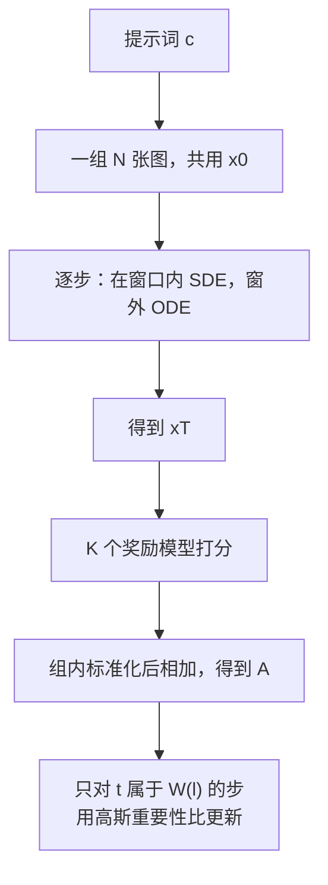
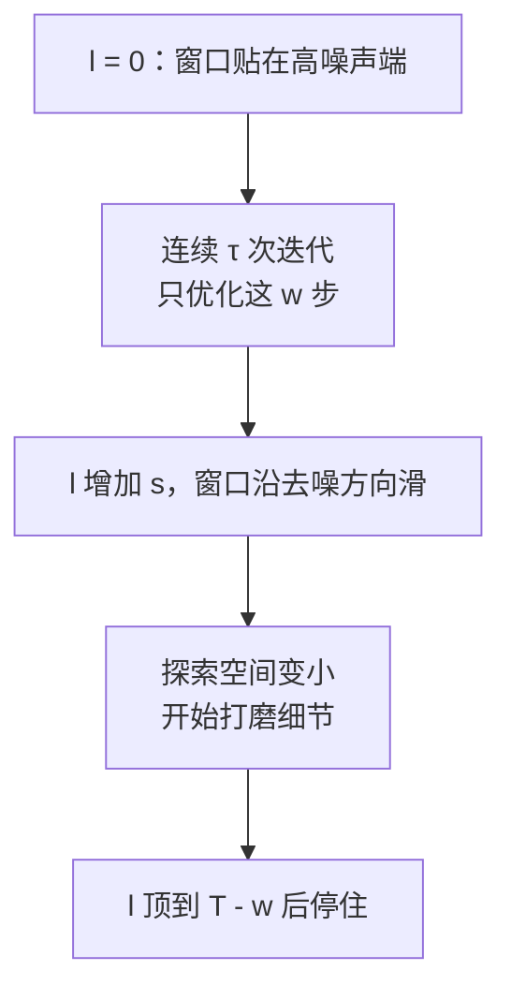
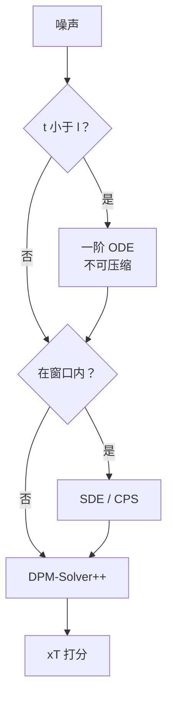

# MixGRPO：GRPO 不必在每一步都走 SDE

<!-- release-date: 2025-07-29 -->

> 本文依据腾讯混元主导的 **MixGRPO: Unlocking Flow-based GRPO Efficiency with Mixed ODE-SDE**，即 arXiv:2507.21802v7（封面水印 `arXiv:2507.21802v7 [cs.AI] 28 Jun 2026`），共 36 页，录用为 ECCV 2026。本地件就是这份官方最新版。下文括号里的 `(PDF p. N)` 一律指这份 36 页 PDF 的自身页码（1–36）。附录从 PDF p. 19 起把印刷页码重新从 1 起算，和文件页码不再一致，不要拿附录页脚的 1、2、3 来对。
>
> v7 比更早的约 20 页版本长出一截。正文里的 CPS（Coefficients-Preserving Sampling，保系数采样）、对 SD3.5-M 与 Flow-GRPO / Flow-DPO 的对照、以及 HunyuanImage-3.0 / HunyuanVideo-1.5 的规模实验，都是后续修订补进 PDF 的，v1 原文没有这些节。本文按 v7 实际写了的内容覆盖，不沿用旧版页码。
>
> 文中始终分开三件事：**报告写了什么**、**我们如何解释**、**哪些是外部补充**。从图里读出来的数会明说。
>
> 第一单位是 Hunyuan, Tencent。并列第一作者是 Junzhe Li（北大 / 混元 / 北大计算中心）、Yutao Cui、Tao Huang；通讯作者是 Zhao Zhong 与 Liefeng Bo。合作方还有中国移动、清华工物。企业主导方是腾讯混元，所以本站目录是 Tencent。代码在论文首页给出：<https://github.com/Tencent-Hunyuan/MixGRPO>。
>
> `release-date` 取 **2025-07-29**。这是一篇方法论文，没有对外可用的产品模型；按本模块规则取该技术首次官方公开日。arXiv v1 提交于 2025-07-29 13:40:09 UTC。GitHub 仓库 `created_at` 为同日 08:37:47Z，但首次代码 commit 是 2025-07-30；官方 README 也把「论文和代码发布」写在 2025/7/30。Hugging Face 权重仓库的 `createdAt` 按规则不是首发日。证据见文末。

## 读这篇之前只需要这几个词

这篇是本站 [Flow-GRPO 篇](../Kuaishou/Flow-GRPO.md) 的直接后续。Flow-GRPO 回答的是「确定的流模型怎么才能做在线强化学习」；本篇假设那件事已经成立，追问的是另一句更土的话：**每一步都随机、每一步都拿去优化，是不是买贵了。**

没读过前作也可以从这里读。下面六个名字会反复出现，只解释到读懂本篇所需的程度。

**流匹配（flow matching）与校正流（rectified flow）**：在干净图和噪声之间拉一条直线，网络学这条线上每一点的速度。推理时从噪声沿速度走回去。本站 [Stable Diffusion 3 篇](../StabilityAI/Stable-Diffusion-3.md) 讲这条直线怎么被选成文生图默认目标。本篇实验的主底板是 **FLUX.1-dev**，补充底板是 **SD3.5-M** 和混元自己的 HunyuanImage-3.0 / HunyuanVideo-1.5，都把流模型当已经训好的生成器来做强化学习。

**常微分方程（Ordinary Differential Equation，ODE）**：给定当前位置和速度，下一步被完全决定。同一份噪声加同一句提示词，走 ODE 得到同一张图。

**随机微分方程（Stochastic Differential Equation，SDE）**：速度之外再加一项布朗运动。同一步可以走出许多条不同的路。Flow-GRPO 和 DanceGRPO 正是靠它，才把去噪写成可以对着写概率的策略。

**马尔可夫决策过程（Markov Decision Process，MDP）**：把「从噪声走到干净图」看成一串状态—动作。奖励通常只在最后一张图上出现一次。GRPO 要更新的，就是这串动作里每一步的策略。

**组相对策略优化（Group Relative Policy Optimization，GRPO）**：同一句提示词采一组图，用组内平均分当尺子，不再另训价值网络。出处是 DeepSeekMath，本篇只借用这个想法。

**函数评估次数（Number of Function Evaluations，NFE）**：训练里网络被前向了多少次。本篇把它拆成两截：$\mathrm{NFE}_{\pi_{\theta_{\mathrm{old}}}}$ 是旧策略把整张图走完、好去打分的次数；$\mathrm{NFE}_{\pi_\theta}$ 是当前策略只为算重要性比而前向的次数（PDF p. 9–10）。墙钟加速往往发生在后一截被砍短，或前一截被高阶求解器压缩。

**信噪比（Signal-to-Noise Ratio，SNR）**：这一步的图里，干净信号相对噪声有多强。去噪早期 SNR 低、探索空间大，决定的是「这是牛还是马」；后期 SNR 高、路径变窄，决定的是胡须和纹理。本篇的滑动窗口就是沿着这条 SNR 梯子往前挪。

## 一句话先说清

Flow-GRPO 和 DanceGRPO 已经证明：把流模型的 ODE 改写成边际不变的 SDE，就可以对同一句提示词采一组不同的图，再用 GRPO 往奖励上推。

它们付出的代价是：MDP 的**每一个去噪步**都要采样，也几乎都要进入优化。DanceGRPO 后来改成随机抽一部分步来更新，但本篇 Figure 1 画出来的是：步数一少，分就掉（PDF p. 2）。

MixGRPO 的回答不是再发明一种强化学习算法，而是改采样器的职责分工（PDF p. 1–3）：

1. 只在一条**滑动窗口**里走 SDE，并只对窗口内的步做 GRPO；
2. 窗口外走 ODE，这些步不进入重要性比，也不进入 KL；
3. 因为窗后的 ODE 不参与优化，可以用 DPM-Solver++ 这类高阶求解器把它走快，得到 **MixGRPO-Flash**；
4. v7 里，窗口内的随机采样还可以从标准 SDE 换成 **CPS**，少一点颗粒伪影，奖励信号干净一些。

头条数字在摘要和 Table 1（PDF p. 1、p. 9），口径要先说清：

- 相对 DanceGRPO 的官方设定（25 步里随机优化 14 步，每轮 291.284 秒），MixGRPO 优化 4 步、每轮 149.326 秒，训练时间约少 **50%**；
- 摘要写 MixGRPO-Flash 再少到约 **71%**。Table 1 里对上 71% 的是 MixGRPO-Flash\*（83.278 秒），不是表里那行 112.372 秒的 MixGRPO-Flash。
- 对齐指标同时涨。FLUX 底座的 ImageReward 从 1.088 到 MixGRPO 的 1.645，超过 DanceGRPO 官方设定的 1.436（PDF p. 9）。引言里写的 1.629 对应的是 Table 10 的 SDE 版，不是 CPS 版（PDF p. 3、p. 14）。

如果只记一句：

> **策略梯度需要随机性，但不需要整条轨迹每一步都随机。把 SDE 关进一条会移动的窗口，窗外用确定的 ODE，GRPO 仍然写得出来，账单却短了一截。**

## 这份 36 页 PDF 各页写了什么

36 页里，正文到第 14 页结束，第 15–18 页是参考文献，第 19 页起才是附录。方法证明、高阶求解器、80B 和视频、跨数据集表、CPS 公式，都在附录里。

| 报告章节 | PDF 页 | 讲了什么 | 密度 |
|---|---|---|---|
| 摘要 | p. 1 | 混合 ODE-SDE、滑动窗口、Flash、约 50% / 71% | 高 |
| Figure 1 | p. 2 | DanceGRPO 优化步一少分就掉；MixGRPO 4 步仍高 | 高 |
| §1 引言 | p. 2–3 | 全轨迹 SDE 的两个病：贵、梯度互相打架；四条贡献 | 高 |
| Figure 2 | p. 4 | 左：全局 SDE vs 滑动窗口；右：探索空间随窗口收缩 | 高 |
| §3.1 式 1–10 | p. 4–6 | 混合采样、高斯策略、只对窗口做 GRPO | 高 |
| §3.2 + Algorithm 1 | p. 6–7 | 窗口大小 $w$、平移间隔 $\tau$、步幅 $s$ | 高 |
| §3.3 + Figure 3 | p. 7–8 | 只加速窗后 ODE；Flash / Flash\* | 高 |
| Table 1 + §3.4 | p. 9 | 主效率表；CPS 作为窗口内的替代随机采样 | 高 |
| Figure 4 + §4.1–4.2 | p. 10–11 | 设定、主结果、跨奖励、换对齐方法、规模实验预告 | 高 |
| Table 2–3 | p. 12 | 域内/域外奖励；SD3.5-M 上对 DPO / Flow-GRPO | 高 |
| Table 4–7 + Figure 5 | p. 13 | 窗口超参消融与灵敏度 | 高 |
| Table 8–10 + §5–6 | p. 14 | 求解器阶数、Flash 步数、SDE vs CPS；限制与结论 | 高 |
| 附录 7–8 | p. 19–21 | 相关工作；混合过程边际等价的 Fokker–Planck 证明 | 高 |
| 附录 9–10 | p. 21–23 | 校正流上的 DPM-Solver++；Flash 的 Algorithm 2 | 高 |
| 附录 11–13 | p. 23–25 | FLUX / SD3.5-M 超参；ReNO；窗前加速会崩 | 高 |
| 附录 14–15 | p. 25–27 | HunyuanImage-3.0 80B；HunyuanVideo-1.5 曲线 | 中 |
| 附录 16 | p. 27–30 | 跨数据集与 $\tau,w,s$ 大表 | 中 |
| 附录 17–18 | p. 31–32 | 组内固定初始噪声；混合推理挡奖励黑客 | 高 |
| 附录 19–20 | p. 32–36 | CPS 公式与定性墙 | 高 |

三件事先知道：

1. **摘要的 71% 对应表里的 Flash\***。MixGRPO-Flash 自己是 112.372 秒，相对 291.284 秒大约少 61%；Flash\* 才到 83.278 秒、约 71%（PDF p. 9、p. 11）。
2. **Table 1 的 MixGRPO 已经是 CPS 版。** ImageReward 1.645 与 Table 10 的 MixGRPO-CPS 一致；SDE 版是 1.629，也就是引言那句（PDF p. 3、p. 9、p. 14）。
3. **正文写的每轮时间和表对不上。** §4.2 写 MixGRPO 把每轮时间从 291.284 秒收到 150.839 秒，Table 1 写的是 149.326 秒（PDF p. 9–10）。本文主数字跟表，并在文末标成 PDF 内部不一致。

## 卡住效率的不是「要不要 GRPO」，是两件被绑在一起的事

Flow-GRPO 已经把「ODE 没有探索」这件事拆开了：先把确定速度场改写成边际不变的 SDE，每一步变成高斯，对数概率和 KL 都能闭式写。DanceGRPO 把同一套想法用到更多视觉生成任务上，并给了一个工程补丁——不要优化全部 25 步，随机抽一个子集。

本篇认为这个补丁不够（PDF p. 2）。

### 裂缝一：全轨迹 SDE 让优化账单和采样账单叠在一起

算重要性比，需要旧策略 $\pi_{\theta_{\mathrm{old}}}$ 和新策略 $\pi_\theta$ 在同一步上的条件概率。若每一步都是 SDE，两条策略都得把整条轨迹走一遍。NFE 随去噪步数线性涨。DanceGRPO 的官方设定是 25 步里随机优化 14 步，$\mathrm{NFE}_{\pi_\theta}=14$，每轮 291.284 秒（PDF p. 9）。

可以把它想成拍连续剧。强化学习要的是「同一场戏多拍几条，好的留下」。全轨迹 SDE 等于每一场、每一个镜头都多拍、都进剪辑室。随机抽 14 步，只是少送一些镜头去剪，拍摄本身仍按 25 场随机走。

### 裂缝二：早步和晚步的梯度在抢方向

早期去噪改的是全局结构，晚期改的是细节。两条梯度同时回传到同一套权重，会互相打架。论文把这写成 *unfocused and inefficient optimization*（PDF p. 2）。DanceGRPO 的随机子集没有按时间顺序组织这件冲突，只是少算一些步。

Figure 1 把「少算就能便宜」这条捷径堵死了（PDF p. 2，读自该图）：DanceGRPO 的 $\mathrm{NFE}_{\pi_\theta}$ 从 24 收到 16、12、4，Pick Score 跟着掉；MixGRPO 同样只优化 4 步，分比 DanceGRPO 优化更多步还高。图的纵轴是 Pick Score，大约从 0.226 走到 0.238，精确数以 Table 1 为准。

所以本篇要修的不是「流模型能不能 RL」——那是前作的问题——而是：**随机性和优化预算，能不能只花在此刻最值得探索的那几步上。**

## 全景：窗口内才是 MDP，窗外只负责把图走完

下图按 Figure 2 左半与 Algorithm 1 重画（PDF p. 4、p. 7），属于**机制示意**，不含实测时间。原图把全局 SDE 画在上、滑动窗口画在下；时间从噪声 $T$ 走到干净图 $0$。

读这张图时抓住五件事：

- 随机性被关在窗口 $S=[t_l,t_r)$ 里，窗外的转移是狄拉克函数，不进 GRPO 的比值和 KL（PDF p. 5–6）；
- 有效 MDP 从长度 $T$ 缩成长度 $w$，默认 $w=4$（PDF p. 4、p. 13）；
- 奖励仍然只在最后一张图上给一次，窗口内每一步共用同一个优势（PDF p. 4，式 1、式 10）；
- 窗口会随着训练从低 SNR 滑到高 SNR，探索空间从分散收到集中。Figure 2 右图三档样本的协方差迹标的是 $5.05\to 1.51\to 1.06$（PDF p. 4，读自该图）；
- Flash 加速的是**窗后**那段 ODE，不是窗前。窗前一压缩，进窗口的状态分布就歪了（PDF p. 8、p. 24–25）。

和 Flow-GRPO 还有一处相反的实现选择：同一组 $N$ 张图共用一份初始噪声，随机性主要靠窗口内的 SDE 提供。论文写明这是跟 DanceGRPO 走的（PDF p. 7，Algorithm 1 第 6 行）。附录 Table 17 说，不固定噪声时 HPS-v2.1 / Pick Score / ImageReward 分别是 0.342 / 0.228 / 1.448，固定后是 0.367 / 0.237 / 1.629（PDF p. 31）。前作 Flow-GRPO 在 SD3.5-M 上观察到「每条轨迹换一份初始噪声更好」。两篇底板、组大小和噪声注入位置都不同，不能直接判谁错；只说明组内起点要不要锁死，是要单独消融的旋钮，不是 GRPO 的定理。这句话是我们的对照，不是本报告原文。

## 设计一：混合 ODE-SDE——边际还在，随机性缩短

### 旧问题

GRPO 的重要性比要求你能写出 $q_\theta(x_{t+\Delta t}\mid x_t,c)$。ODE 给的是一对一映射，对数概率要么是 0、要么是 $-\infty$。SDE 能写，但若 $t$ 从 0 到 $T$ 每一步都是 SDE，优化序列就是整条轨迹。DanceGRPO 用随机子集缓解计算，却把「哪些步该随机」交给了均匀抽样。

### 新设计

定义一个时间区间 $S=[t_l,t_r)\subseteq[0,1)$，只在 $S$ 里走 SDE，外面走 ODE（PDF p. 4–5，式 4、式 6）。校正流上离散之后（PDF p. 5，式 7）：

$$
\mathbf{x}_{t+\Delta t}=
\begin{cases}
\mathbf{x}_t+\boldsymbol{\mu}_\theta(\mathbf{x}_t,t)\,\Delta t+\sigma_t\sqrt{\Delta t}\,\epsilon,& t\in S,\\
\mathbf{x}_t+\mathbf{v}_\theta(\mathbf{x}_t,t)\,\Delta t,& \text{otherwise.}
\end{cases}
$$

窗口内的漂移 $\boldsymbol{\mu}_\theta$ 就是 Flow-GRPO 那套「速度加上分数补偿」：

$$
\boldsymbol{\mu}_\theta(\mathbf{x}_t,t)=\mathbf{v}_\theta(\mathbf{x}_t,t)+\frac{\sigma_t^2}{2t}\bigl(\mathbf{x}_t+(1-t)\mathbf{v}_\theta(\mathbf{x}_t,t)\bigr)
$$

$\epsilon\sim\mathcal N(0,I)$。于是 $t\in S$ 时，策略是各向同性高斯（PDF p. 5，式 8）：

$$
q_\theta(\mathbf{x}_{t+\Delta t}\mid\mathbf{x}_t,c)=\mathcal N\bigl(\mathbf{x}_t+\boldsymbol{\mu}_\theta\Delta t,\,\sigma_t^2\Delta t\,\mathbf{I}\bigr)
$$

窗外是确定更新，这些步从比值和 KL 里删掉。

目标函数只对窗口平均（PDF p. 6，式 9）。把密集下标拆开：对同一句提示词采 $N$ 张图，第 $i$ 张、窗口内第 $t$ 步取

$$
\min\bigl(r_t^i(\theta)A^i,\;\operatorname{clip}(r_t^i(\theta),1-\varepsilon,1+\varepsilon)A^i\bigr)-\beta\,\mathcal J_{\mathrm{KL}}
$$

其中重要性比和优势是（PDF p. 6，式 10）

$$
r_t^i(\theta)=\frac{q_\theta(\mathbf{x}_{t+\Delta t}\mid\mathbf{x}_t,c)}{q_{\theta_{\mathrm{old}}}(\mathbf{x}_{t+\Delta t}\mid\mathbf{x}_t,c)},
\qquad
A^i=\frac{R(\mathbf{x}_T^i,c)-\operatorname{mean}(\{R(\mathbf{x}_T^j,c)\}_j)}{\operatorname{std}(\{R(\mathbf{x}_T^j,c)\}_j)}
$$

KL 同样闭式，写成两步均值的欧氏距离：

$$
\mathcal J_{\mathrm{KL}}=\frac{\lVert\mathbf{x}_{t+\Delta t}(\theta)-\mathbf{x}_{t+\Delta t}(\theta_{\mathrm{old}})\rVert^2}{2\sigma_t^2\Delta t},\qquad t\in S
$$

多奖励时，Algorithm 1 先对每个奖励模型做组内标准化再相加（PDF p. 7 第 17 行）。默认各奖励等权（PDF p. 23）。

附录 8 用 Fokker–Planck 方程证明：在常规正则条件下，混合过程的时间边际和纯 ODE 一致，误差来自离散和分数近似（PDF p. 20–21）。人话是：窗口里路径可以分叉，任意时刻「图看起来该像什么样」仍跟原来的概率流一致。这是前作 ODE-to-SDE 的局部化版本，不是新的生成模型。

读公式时有一个记号陷阱，是我们的提醒，不是报告的缺陷声明。Algorithm 1 把初始噪声写成 $\mathbf{x}_0$，离散下标 $t=0,\ldots,T-1$ 是**去噪步的序号**；校正流连续时间里 $t=0$ 往往是数据、$t=1$ 是噪声（PDF p. 21，式 15）。两套 $t$ 不要混着代入。

### 工作机制

这是根据 PDF p. 6–7 重画的机制示意图。$\mathrm{NFE}_{\pi_\theta}$ 等于窗口宽度 $w$；$\mathrm{NFE}_{\pi_{\theta_{\mathrm{old}}}}$ 仍是完整推理步数，因为最后一张图还是要走完才能打分（PDF p. 6）。所以只做混合采样，墙钟大约能砍掉优化侧，砍不掉 rollout 侧。Flash 要动的就是这一侧。

### 收益

Table 1 是主证据（PDF p. 9）。FLUX 底座：HPS-v2.1 0.313、Pick Score 0.227、ImageReward 1.088、Unified Reward 3.370。DanceGRPO 官方设定优化 14 步、291.284 秒，四项收到 0.356 / 0.233 / 1.436 / 3.397。把 DanceGRPO 也砍到 4 步，随机抽是 0.334 / 0.225 / 1.335 / 3.374，冻在起始步是 0.333 / 0.229 / 1.235 / 3.325，分明显掉，时间才降到约 150 秒。MixGRPO 同样 4 步、149.326 秒，四项是 **0.369 / 0.238 / 1.645 / 3.419**，全表第一。

这就是 Figure 1 要说的事：便宜本身不难，难的是便宜了分还不掉。把 4 步组织成一段连续窗口，比从 25 步里随机抠 4 步有效得多。

### 代价与边界

- **等价的是边际，不是单条路径。** 和 Flow-GRPO 同一句话。
- **窗外没有探索。** 若关键决策其实发生在窗外，窗口再怎么滑也吃不到。消融里冻在起始步仍然有竞争力，说明在他们的设定里早步更值钱；这不是对所有生成器的保证（PDF p. 7、p. 13）。
- **rollout 的 NFE 默认没降。** 没有 Flash 时，$\mathrm{NFE}_{\pi_{\theta_{\mathrm{old}}}}$ 仍是 25。
- **KL 的参考分布是 $\theta_{\mathrm{old}}$，式 10 如此书写。** 和有些 GRPO 实现里对冻结预训练 $\pi_{\mathrm{ref}}$ 的 KL 不是同一件事。PDF 没有另做对照。

### 可迁移启发

当你已经有一条「每一步都能写概率」的轨迹，下一步该问的不是「要不要随机」，而是「随机性的支撑集要多长」。把 MDP 视界从 $T$ 收到 $w$，是在连续时间生成里做时间折扣：只给当前最有杠杆的那几步发探索预算。能闭式写高斯 KL，就继续写；不要因为窗口变短就改回蒙特卡洛。

## 设计二：滑动窗口——先探索结构，再打磨细节

### 旧问题

若窗口冻死在某几步，模型会在那一段过优化，后面的细节步从未被 GRPO 碰过。若窗口每轮随机乱跳，又回到 DanceGRPO 那种「不按 SNR 组织冲突」的状态。需要一种随训练推进的课程，而不是又一个随机掩码。

### 新设计

沿去噪步 $\{0,1,\ldots,T-1\}$ 放一个宽度为 $w$ 的窗口（PDF p. 6，式 11）：

$$
W(l)=\{t_l,t_{l+1},\ldots,t_{l+w-1}\},\qquad l\le T-w
$$

三个超参管它怎么动（PDF p. 6–7）：

| 符号 | 含义 | FLUX 默认 |
|---|---|---|
| $w$ | 窗口里有多少去噪步，也就是 $\mathrm{NFE}_{\pi_\theta}$ | 4 |
| $\tau$ | 每隔多少次训练迭代，窗口挪一次 | 25 |
| $s$ | 每次左端点 $l$ 前进多少步 | 1 |

训练开始时 $l\leftarrow 0$，即窗口贴在最低 SNR 的那一端。每 $\tau$ 次迭代，$l\leftarrow\min(l+s,\,T-w)$。论文把这个默认日程叫 **progressive-constant**（匀速前移）。对照还有：窗口冻住（frozen）、每轮随机选位置（random）、以及 $\tau$ 随训练衰减的 progressive-decay（PDF p. 7、p. 12–13）。

论文把这套课程类比成强化学习里的时间折扣：先在探索空间最大的地方定结构，再把预算挪到细节（PDF p. 2、p. 7）。这是作者的类比，不是单独的对照实验。

### 工作机制

这是根据 Algorithm 1 第 23–25 行重画的机制示意图（PDF p. 7）。$s=1$、$w=4$ 时，窗口每次只前进 1 步，里面有 3 步会在下一轮被重复优化。论文认为高 SNR 段的后几步相对欠拟合，重复是有好处的（PDF p. 29）。

### 收益

Table 4–7 是 FLUX 上的主消融（PDF p. 13）。progressive-constant 综合最好：HPS-v2.1 0.367、Pick Score 0.237、ImageReward 1.629、Unified Reward 3.418。frozen 的 ImageReward 仍有 1.580，说明「只优化早步」已经不差；random 的 ImageReward 掉到 1.513。Decay(Exp) 的 ImageReward 1.632 略高，但 HPS 和 Unified Reward 不如 constant，论文仍选 constant 当默认。

$\tau=25$ 是峰。$\tau=15$ 的 ImageReward 只有 1.509；$\tau=30$ 则四项一起掉，HPS 到 0.350，论文的读法是窗口挪得太慢，会在某几步上过优化（PDF p. 13、p. 28）。$w=4$ 是开销和分数的折中：$w=6$ 的 HPS 0.370 略高，但 ImageReward 掉到 1.547，而且 $\mathrm{NFE}_{\pi_\theta}$ 从 4 涨到 6；$w=1$ 的 Unified Reward 崩到 3.235。$s=1$ 综合最好；$s=3$ 的 HPS 可以到 0.370，但 ImageReward 只有 1.578。

附录 16 把同一组默认值（progressive-constant，$\tau=25$，$w=4$，$s=1$）拿到 HPD-v2 和 Pick-a-Pic-v1 上对调训练，域内域外都还是这组强（PDF p. 27–30，Table 13–16）。Figure 5 的三条 ImageReward 曲线在合理区间里比较平，并且始终在 DanceGRPO / Flow-GRPO 的虚线之上（PDF p. 13，读自该图）。论文据此说对超参不敏感。表显示的是：2–6 的窗口、15–25 的 $\tau$ 还能用；越出这个区间，尤其是 $\tau=30$，会明显掉。「不敏感」不是「不用调」。

### 代价与边界

- **日程是手写的，不是自适应的。** 限制节自己把 $(w,\tau,s)$ 列为未来工作，希望以后用奖励收敛或梯度方差来挪窗口（PDF p. 14）。
- **换底板要重调 $\tau$。** FLUX 用 $\tau=25$；SD3.5-M 附录写成 $\tau=150$（PDF p. 23）。同一套符号，数量级差六倍，不能把 25 当成普适常数。
- **视频把 $w$ 改成了 6。** HunyuanVideo-1.5 上 $w=6$、$\tau=100$、$s=1$（PDF p. 27）。默认值跟着模态变。
- **早步更值钱，是这条数据上的观察。** frozen 仍有竞争力，不代表所有流模型的信息都堆在低 SNR。

### 可迁移启发

连续时间生成里，探索预算可以做成课程，不必做成随机掩码。先问「哪一段的随机性改变最终奖励最狠」，再把窗口从那段开始滑。$\tau$ 太小等于每步都没学熟就走；$s$ 太大等于拒绝复用已经付过钱的步。重复优化不是浪费，有时是在补欠拟合。

## 设计三：MixGRPO-Flash——只加速「不进梯度」的那一段

### 旧问题

混合采样把 $\mathrm{NFE}_{\pi_\theta}$ 从 14 收到 4，但旧策略仍要把图走完才能打分，$\mathrm{NFE}_{\pi_{\theta_{\mathrm{old}}}}$ 还是 25。优化侧已经瘦了，rollout 侧才是下一刀。

窗后的 ODE 不进重要性比，后验如何到达 $x_T$，理论上不必逐步欧拉。高阶 ODE 求解器可以把多步合成少步。问题是：能不能连窗前一起压。

### 新设计

不能。论文只加速**窗口之后**的 ODE（PDF p. 8）。窗前若也换成高阶求解器，数值误差会被窗口里的随机性放大，进 SDE 段的状态分布变了，奖励信号跟着坏。附录把两种做法叫做 Dual（窗前+窗后都加速）和 Post（只加速窗后）。

他们把 DPM-Solver++ 改写到校正流上。用速度场反出 $x_0$ 预测（PDF p. 21–22，式 17–18）：

$$
\mathbf{x}_\theta(\mathbf{x}_i,t_i,c)=\mathbf{x}_i-\mathbf{v}_\theta(\mathbf{x}_i,t_i,c)\cdot t_i
$$

多步二阶的修正量 $D_i$ 和更新式见附录 9 的式 19–21。log-SNR 在校正流里是 $\lambda_{t_i}=\log((1-t_i)/t_i)$（PDF p. 22）。这些式子是为了说明「扩散求解器可以原样搬到流上」，不是新的采样理论。

Algorithm 2 引入压缩率 $\tilde r$，窗后只走 $(T-l-w)\tilde r$ 步，总步数变成 $\tilde T=l+w+(T-l-w)\tilde r$（PDF p. 23）。Flash\* 把窗口冻在 $l\equiv 0$，于是几乎整段 ODE 都可以压，理论加速为（PDF p. 23，式 22）

$$
S=\frac{T}{w+(T-w)\tilde r}
$$

Flash 的窗口会动，平均加速更小，因为窗前那截 $l$ 步仍走一阶 ODE（PDF p. 23，式 23）。

### 工作机制

这是根据 Algorithm 2 第 9–15 行重画的机制示意图（PDF p. 22–23）。分支条件必须保持这个顺序：窗前一阶、窗内随机、窗后高阶。把前两个分支对调，就是会崩的 Dual。

Table 12 给出对照（PDF p. 24）：Dual 的 HPS / Pick / ImageReward 是 0.335 / 0.223 / 1.235，已经接近 DanceGRPO 砍到 4 步的水平；Post 是 0.358 / 0.236 / 1.528。Figure 6 的定性墙：Post 还能保住高频细节和中等饱和；Dual 丢高频、颜色过饱和，而且随训练越来越重（PDF p. 25，读自该图）。

### 收益

Table 1 里 MixGRPO-Flash 的 $\mathrm{NFE}_{\pi_{\theta_{\mathrm{old}}}}$ 平均 16，每轮 112.372 秒，四项 0.358 / 0.236 / 1.528 / 3.407，仍高于 DanceGRPO 官方设定。Flash\* 冻窗口、$\mathrm{NFE}_{\pi_{\theta_{\mathrm{old}}}}=8$，每轮 **83.278 秒**，相对 291.284 秒少约 71%，ImageReward 1.624 甚至接近完整 MixGRPO（PDF p. 9）。

Table 8 扫求解器阶数（PDF p. 14）。二阶中点法被选为默认：Pick Score 0.237、ImageReward 1.578、Unified Reward 3.407。一阶的 HPS 其实更高（0.367 对 0.358），但另外三项不如中点；二阶 Heun 和三阶都更差。论文说「二阶中点最优」，指的是多数对齐指标，不是每一列。

Table 9 把 rollout 步数再往下压（PDF p. 14）。Flash 平均 16 步、每张 6.426 秒是他们标绿的点；再收到平均 13 步，HPS 掉到 0.344、ImageReward 掉到 1.447。Flash\* 收到 8 步、每张 3.789 秒，ImageReward 1.624 反而高，但 Pick Score 只有 0.232。加速和「四项一起涨」不是同一件事。

Figure 4 用「马和火车」「60 cents 甜甜圈」「长颈鹿吃树枝」三组提示看质量：Flash 和 Flash\* 在 $\mathrm{NFE}_{\pi_{\theta_{\mathrm{old}}}}$ 降到 16 和 8 时，文字和语义仍明显好于砍步后的 DanceGRPO（PDF p. 10，读自该图）。

### 代价与边界

- **71% 是 Flash\* 对 DanceGRPO 官方设定。** 摘要把 71% 写在 MixGRPO-Flash 名下（PDF p. 1），表把 83.278 秒写在 Flash\* 那一行（PDF p. 9）。引用时要带星号。
- **Flash 比完整 MixGRPO 弱一截。** Table 1 里 ImageReward 从 1.645 掉到 1.528。论文的定位是「可接受的折中」，不是免费加速。
- **窗前压缩是禁区。** Dual 不是「略差一点」，是优化会塌。
- **高阶求解器改的是训练期 rollout，不是用户侧推理日程。** 产品推理仍可走原来的 ODE。PDF 没有把 Flash 的训练求解器直接当成部署采样器来评。

### 可迁移启发

加速之前先问：这段轨迹的后验，会不会流进梯度。会，就不能用会改状态分布的近似；不会，才是高阶求解器的合法压缩区。MixGRPO 把「优化支撑集」和「采样精度」解耦之后，才能把 DPM-Solver++ 这种推理期工具塞进训练循环。窗前那截看起来也很「确定」，但它决定了 RL 看见什么样的状态，所以仍然贵得有道理。

## 设计四：CPS——窗口里的随机采样也可以换（v7 修订加入）

### 这是哪一版写进来的

v1（2025-07-29）还没有这一节。GitHub README 的 News 把 CPS 写在 **2026-02-03**：作为标准 SDE 的更原则替代，并把对照表和可视化更新进论文。arXiv 同日出现 v4。CPS 本身出自 Wang 与 Yu 的独立工作 arXiv:2509.05952（2025-09），发表在 MixGRPO v1 之后。v7 把它收成正文 §3.4、Table 10、附录 19 和 Figure 13。

所以 CPS 不是 MixGRPO 的原始贡献，是修订期换上的窗口内采样器。主方法（混合 ODE-SDE + 滑动窗口 + Flash）在 v1 就已经成立。

### 旧问题

欧拉–丸山离散的 SDE 每一步都加一份独立高斯。论文说这会在图上留下「grainy」的高频颗粒，HPS、Pick Score 这类奖励模型会盯着纹理打高分，结构却没学到，形成另一种奖励黑客（PDF p. 32）。

### 新设计

CPS 从 DDIM 借系数，保住流匹配的线性插值结构，再单独加一项受控噪声（PDF p. 32，式 25）：

$$
\mathbf{x}_{t_{i-1}}=\frac{1-t_{i-1}}{1-t_i}\mathbf{x}_{t_i}+\Bigl(t_{i-1}-\frac{1-t_{i-1}}{1-t_i}\,t_i\Bigr)\mathbf{v}_{t_i}+\sigma_{t_i}\epsilon_i
$$

对照的标准 SDE 离散是（PDF p. 32，式 24）

$$
\mathbf{x}_{t_{i-1}}=\mathbf{x}_{t_i}-\mathbf{v}_{t_i}\Delta t+\sqrt{2\sigma^2\Delta t}\,\epsilon_i
$$

实现上，CPS 只替换窗口内的随机离散；GRPO 用的高斯协方差仍是 $\sigma_t^2\Delta t\,I$，重要性比和 KL 的公式不用改（PDF p. 9）。这是工程上很省事的一点：换采样器，不换 RL 目标。

### 工作机制与收益

同一套训练（$\mathrm{NFE}_{\pi_{\theta_{\mathrm{old}}}}=25$，$w=4$，$s=1$，固定初始噪声，HPS-v2.1 + Pick Score + ImageReward，300 步）下，Table 10（PDF p. 14）：

| 模型 | HPS-v2.1 | Pick Score | ImageReward | Unified Reward |
|---|---:|---:|---:|---:|
| FLUX | 0.313 | 0.227 | 1.088 | 3.370 |
| MixGRPO-SDE | 0.367 | 0.237 | 1.629 | 3.418 |
| MixGRPO-CPS | 0.369 | 0.238 | 1.645 | 3.419 |

四项都涨，幅度不大。ImageReward 的 1.629→1.645 正好对上引言和 Table 1 的差。Figure 13 用牧羊犬、动漫公主、魔幻城堡三组提示看：SDE 版更容易过饱和、发脏，CPS 版更干净（PDF p. 36，读自该图）。论文的读法是：少一点采样伪影，奖励反馈更可靠。

### 代价与边界

- **CPS 不是 MixGRPO 的必要条件。** SDE 版已经全面超过 DanceGRPO。它是窗口内的升级零件。
- **公式来自外部论文 [43]，本篇只给离散式和一张表。** 没有单独扫 $\sigma_{t_i}$ 的日程，也没有证明 CPS 与 ODE 的边际等价——附录 8 的证明写的是式 7 那种标准混合 SDE。
- **主表混用了 CPS。** 读 Table 1 的 1.645 时，要记得那一行已经换过采样器。

### 可迁移启发

探索噪声的谱形状，和「要不要噪声」是两件事。独立高斯最容易写对数概率，却可能把奖励模型引到纹理捷径上。若 RL 目标只依赖「这一步是高斯、方差已知」，采样器内部怎么构造均值，其实可以换。先保住对数概率的闭式，再换更干净的离散，比同时改目标函数安全。

## 主实验：同一套 FLUX，少步、更高分、跨奖励不过拟合

### 设定

主实验跟 DanceGRPO 对齐：底板 FLUX.1-dev，提示词来自 HPDv2。训练集 103,700 条，四种风格（Animation / Concept Art / Painting / Photo）；论文写 MixGRPO 用 9,600 条、还没跑完一个 epoch 就已经对齐得很好。测试 400 条（PDF p. 9）。

附录 11 的 FLUX 配方（PDF p. 23）：32 张 NVIDIA GPU，每卡 batch 1，最多 300 次迭代；训练采样 $T=25$，先做 time shift $\tilde t=t/(1-(\tilde s-1)t)$，$\tilde s=3$，噪声 $\sigma_t=\eta\sqrt{\tilde t/(1-\tilde t)}$，$\eta=0.7$；每条提示词 12 张图；优势裁到 $[-5,5]$；3 步梯度累积（每次训练迭代 4 次参数更新）；AdamW，学习率 $1\times 10^{-5}$，weight decay $1\times 10^{-4}$；bf16，主权重 fp32。多奖励等权。

开销指标就是前面说的两截 NFE，外加每轮墙钟（PDF p. 9–10）。

奖励模型四个：HPS-v2.1、Pick Score、ImageReward、Unified Reward。论文跟 DanceGRPO 一样用多奖励，认为更稳。ImageReward 更偏图文一致和保真，Unified Reward 更偏语义（PDF p. 10）。

### 和 DanceGRPO 对打

主数字已在设计一给出。这里只补公平性：作者把 DanceGRPO 也改成优化 4 步（随机或冻在起始），时间和 MixGRPO 几乎一样（149.978 / 150.059 对 149.326 秒），分仍然全面落后（PDF p. 9–10）。所以 MixGRPO 的好处不是「我只优化 4 步所以快」，而是「同样 4 步，窗口比随机子集更会花钱」。

Figure 3 的定性墙（PDF p. 8，读自该图）：弯曲道路、四只洗手池、浣熊骑巨型狐狸、哆啦 A 梦、马右边的花瓶、皮夹克青年。三行分别是 FLUX、DanceGRPO、MixGRPO。MixGRPO 在计数、文字周边的语义和人像细节上更稳，DanceGRPO 仍有结构扭曲。这是作者挑选的展示图，不是随机抽样的误差条。

### 跨奖励：不是只刷训练用的那个分

Table 2（PDF p. 12）把训练奖励和没见过的奖励拆开。只拿 HPS-v2.1 训练时，MixGRPO 的域内 HPS 0.373，高于 DanceGRPO 的 0.367；域外 ImageReward 1.396 对 1.141，Unified Reward 3.370 对 3.270。HPS + CLIP Score 一起训时，MixGRPO 的 CLIP Score 0.415 对 DanceGRPO 的 0.400，域外 Unified Reward 3.430 对 3.377。

论文据此说不是奖励黑客。表支持的是：**在这些代理奖励之间，没有出现「域内涨、域外崩」。** 限制节随后承认，奖励模型不够强时，GRPO 照样会黑客，尤其是训练后期（PDF p. 14）。Table 2 没有把黑客从算法里开除，只说明相对 DanceGRPO 更不容易把分刷死在一个模型上。

## 换底板：SD3.5-M 上对 Flow-GRPO，不要把前作的 GenEval 63%→95% 写进来

Table 3 换到底板 SD3.5-M，和其他对齐方法比（PDF p. 12）。设定跟各方法自己论文的最佳配置对齐，不是同一套超参重跑。奖励是 HPS-v2.1 + Pick Score + ImageReward。MixGRPO 只优化 4 步，别人是 10 或 40。

| 模型 | $\mathrm{NFE}_{\pi_{\theta_{\mathrm{old}}}}$ | $\mathrm{NFE}_{\pi_\theta}$ | HPS-v2.1 | Pick Score | ImageReward |
|---|---:|---:|---:|---:|---:|
| SD3.5-M | / | / | 0.307 | 0.227 | 1.163 |
| Offline Flow-DPO | 40 | 40 | 0.304 | 0.222 | 1.452 |
| Online Flow-DPO | 40 | 40 | 0.313 | 0.221 | **1.500** |
| DiffusionNFT | 10 | 10 | 0.313 | 0.235 | 1.494 |
| Flow-GRPO | 10 | 10 | 0.331 | 0.232 | 1.457 |
| DanceGRPO | 10 | 10 | 0.309 | 0.226 | 1.433 |
| MixGRPO | 10 | 4 | **0.342** | **0.236** | 1.485 |

几件必须读出来的事：

- **这张表测的不是 GenEval，也不是 OCR。** 前作 Flow-GRPO 那组 63%→95%、59%→92% 是另一套规则奖励实验，不要写成本篇的结果。
- **MixGRPO 在 HPS 和 Pick Score 上最高，ImageReward 不是。** 在线 Flow-DPO 的 ImageReward 1.500 更高。论文写「能收敛到最好」，表是两胜一负。
- **DanceGRPO 在这张表上几乎没推过底座的 HPS/Pick。** 0.309 / 0.226 对底座 0.307 / 0.227。同一方法换了底板和奖励，表现可以很不一样。
- **MixGRPO 的 $\mathrm{NFE}_{\pi_\theta}$ 仍是 4。** 效率优势在这一列，不在 $\mathrm{NFE}_{\pi_{\theta_{\mathrm{old}}}}$——它和 Flow-GRPO 一样是 10。SD3.5-M 上他们沿用了前作的「训练 10 步、评测 40 步」（PDF p. 23）。

附录 11 的 SD3.5-M 配方（PDF p. 23）：24 张 NVIDIA H20；Adam，学习率 $3\times 10^{-4}$；每条提示词 $N=24$ 张，分辨率 $512\times 512$；训练 $T=10$、评测 $T=40$；CFG 4.5；全局 batch 96 条提示词（每卡 12 条，6 步累积）；timestep fraction 0.99；KL 系数 $\beta=0.001$；EMA；窗口 $w=4$，$\tau=150$，$s=1$。LoRA 微调在正文 §4.1 点到了，秩和 $\alpha$ 没写。

附录 12 拿 SD3.5-Large 对 ReNO（PDF p. 24，Table 11）。ReNO 在单步生成器上用奖励梯度优化初始噪声，还要先做一步蒸馏。MixGRPO 每步 94.297 秒，HPS 0.366 / Pick 0.237 / ImageReward 1.659；ReNO 的开销写成 $\gg 94.297$，HPS 0.352 / Pick 0.235 / ImageReward **1.725**。MixGRPO 赢在 HPS 和 Pick，并免去蒸馏；ImageReward 仍是 ReNO 高。论文说「更好的效率—对齐折中」，没有说三项全赢。

## 80B 图像和视频：附录有曲线，正文几乎没有表

### HunyuanImage-3.0，约 80B，512 GPU

附录 14 把 MixGRPO 接到混元自己的 80B 文生图模型上，512 张 NVIDIA GPU（PDF p. 25–26）。正文只说「稳定优化、效率优势还在」（PDF p. 11）。附录给出的定量句是：相对 Flow-GRPO 或 DanceGRPO 这种全轨迹优化，**大约 70% 的加速**（PDF p. 25）。Figure 7 画了奖励曲线、每步秒数，以及「三只猴子」一类提示的盲测对比：MixGRPO 一边语义一致和写实美学打勾，全轨迹一边打叉（PDF p. 26，读自该图）。

图上的精确坐标论文没有制成表。70% 是作者对图的概括，不是 Table 1 那种逐秒对照。也没有告诉你 80B 上的 $w,\tau,s$、组大小、奖励模型名字。本站 [HunyuanImage 3.0 篇](../Tencent/HunyuanImage-3.0.md) 把 MixGRPO 写成后训练流水线里的一站，并用的是自研奖励；那些细节属于那份技术报告，不要和本篇附录的 70% 混成同一组实验。

### HunyuanVideo-1.5

附录 15 在 HunyuanVideo-1.5 上对 Flow-GRPO（PDF p. 26–27）。64 张 H800；Muon 优化器，学习率 $1\times 10^{-5}$，weight decay 0.01；DanceGRPO 的提示词；$N=8$ 条视频 / 提示词；分辨率 $480\times 864$，121 帧，约 5 秒；$T=25$，time shift 5，$\eta=0.5$；全局 8 条提示词、共 64 条视频 / 次更新；$w=6$，$\tau=100$，$s=1$；奖励是 HPSv3 和 VideoAlign 等权。

Figure 8 四条训练曲线：HPSv3、VideoAlign 的运动质量 MQ、视觉质量 VQ、文本对齐 TA（PDF p. 27，读自该图）。论文的读法：Flow-GRPO 在视频这种高维潜空间里不稳，VQ / TA / HPSv3 上涨得少，有的阶段还掉；MixGRPO 在美学、运动、视觉质量上更单调向上。图没有给出终点数字，正文也没有视频版 Table 1。

本站 [HunyuanVideo 1.5 篇](../Tencent/HunyuanVideo-1.5.md) 把 MixGRPO 写成 I2V 在线 RL 的采样器名字。那是另一份报告里的产品流水线；本篇附录是方法论文自己的对照实验。两边都叫 MixGRPO，不要把那边的四个质量维度分数写进这里。

## 奖励黑客：训练算法解不掉，推理用混合采样挡一下

限制节把话说得很干脆（PDF p. 14）：GRPO 的天花板就是奖励模型。模型打不准，后期就会黑客。若干外部研究被引来支持「这是奖励模型的病，不是 RL 算法的病」。MixGRPO 的目标是在现有、不完美的奖励下更快收敛，不是消灭黑客。

附录 18 给了一个推理期补丁，来自 Flow-GRPO 仓库的讨论 [51]：低 SNR 步用训完的模型，高 SNR 步退回原模型（PDF p. 31）。他们定义混合比例 $p_{\mathrm{mix}}$：去噪前 $p_{\mathrm{mix}}T$ 步走 GRPO 模型，其余走原模型。注意 PDF 有一处笔误，把这段写成了 *initial, high-SNR*；同一段的前一句明确是 post-trained 走低 SNR、原模型走高 SNR。按前一句和「先结构、后细节」的课程来读。

Table 18（PDF p. 31）：

| $p_{\mathrm{mix}}$ | HPS-v2.1 | Pick Score | ImageReward | Unified Reward |
|---|---:|---:|---:|---:|
| 0% | 0.313 | 0.226 | 1.089 | 3.369 |
| 20% | 0.342 | 0.233 | 1.372 | 3.386 |
| 40% | 0.356 | 0.235 | 1.539 | 3.395 |
| 60% | 0.362 | 0.236 | 1.598 | 3.407 |
| 80% | 0.366 | 0.238 | 1.610 | 3.411 |
| 100% | 0.369 | 0.238 | 1.607 | 3.378 |

HPS 在 100% 仍最高，但 Unified Reward 从 3.411 掉到 3.378。论文选 **80%** 当经验值。Figure 9 那张雪景：100% 右上角被标了 HACKING，天空和房子开始过优化；80% 还像一张完整的画（PDF p. 32，读自该图）。

这是**推理期**的混合，和训练期的混合 ODE-SDE 不是同一件事。训练时窗口外走 ODE，是为了省优化；推理时后段退回原模型，是为了把已经被奖励带偏的细节步关掉。作者还写：为了公平，其它基线的展示也用了同一套混合推理（PDF p. 31）。看定性墙时要记得，那不一定是 100% GRPO 模型的输出。

## 报告写下的限制，和它没写的东西

限制节两条（PDF p. 14）：

1. **奖励模型决定上限。** MixGRPO 加快的是在现有奖励下的收敛，不修复奖励本身。他们计划以后自己训更强的奖励模型，本篇没有做。
2. **窗口日程仍是手写超参。** 虽然跨数据集看起来稳，自适应调度仍是未来工作。

### 报告没写、读的人容易以为有的

- **Flash 在 80B 和视频上的墙钟。** 附录 14 的约 70% 没有拆成 NFE 表；视频只有曲线。
- **SD3.5-M 上 LoRA 的秩、$\alpha$、插在哪些层。** 正文说了 LoRA，附录没给。
- **Table 1 每轮秒数是在多少 GPU、什么 batch 下测的。** 附录写训练用 32 GPU，没有写测开销时的硬件口径。
- **逐步奖励或过程监督。** 优势仍是轨迹级广播。
- **CPS 与 ODE 边际等价的证明。** 证明写的是标准混合 SDE。
- **和 Flow-GRPO 在 GenEval / OCR 规则奖励上的对照。** 没有。Table 3 是偏好模型奖励。
- **CFG 在 RL rollout 里怎么处理。** 只在 SD3.5-M 附录出现评测 CFG=4.5。

### 被实验支持 / 只是作者观察 / 尚未公开

**被表支持的：** 相对 DanceGRPO 官方设定，MixGRPO 用 4 步优化达到更高的四项偏好分、时间约减半；Flash\* 到约 71%；同样 4 步时窗口优于随机子集和冻窗口；跨奖励没有域内涨、域外崩；SD3.5-M 上 HPS / Pick 高于 Flow-GRPO 和 DPO；窗前加速会塌；固定组内噪声优于不固定；CPS 略优于 SDE；$\tau=25$、$w=4$、$s=1$ 在两套数据上综合最好。

**作者观察、没有单独对照的：** 「约 70%」的 80B 加速；视频上「显著优于」Flow-GRPO（无终点表）；「对超参不敏感」（$\tau=30$ 已经明显掉）；摘要把 71% 记在 Flash 名下。

**没有公开、因而无法核实的：** 80B 和视频的完整超参与绝对奖励值；Flash 测时硬件；CPS 的 $\sigma$ 日程细节；HunyuanImage-3.0 盲测的票数。代码是外部补充，不是 PDF 内容。

## 可迁移启发

1. **先问随机性的支撑集，再问算法名字。** 全轨迹 SDE 把「能写概率」和「每一步都要写」绑死了。MixGRPO 证明这两件事可以分开：窗外狄拉克，窗口内高斯，GRPO 公式不用改。
2. **探索预算可以做成课程。** 低 SNR 定结构、高 SNR 修细节，比随机抽步更符合去噪自己的时间结构。随机掩码省的是计算，课程省的是冲突。
3. **只压缩不进梯度的那段。** 高阶求解器很诱人，但会改状态分布。窗前看起来也是 ODE，压缩它等于给 RL 喂错状态。
4. **同一组样本的起点要不要锁，是旋钮不是信仰。** 本篇锁死更好，前作 Flow-GRPO 打散更好。换生成器时重新消融，不要从论文标题里抄答案。
5. **换采样器时，保住对数概率的闭式。** CPS 能直接插进来，是因为方差约定没变。这比同时改奖励、改 KL、改离散要安全。
6. **代理奖励上涨时，至少留一个没见过的奖励和一个推理期退路。** Table 2 是前者，80% 混合推理是后者。100% 用训完的模型，Unified Reward 已经在掉。
7. **默认超参跟着底板走。** FLUX 的 $\tau=25$ 和 SD3.5-M 的 $\tau=150$、视频的 $w=6$，说明「4 步窗口」可迁移的是结构，不是那几个整数。
8. **效率数字要带对照设定。** 50% 和 71% 都相对 DanceGRPO 的 14 步官方设定。把 DanceGRPO 也砍到 4 步，时间本来就在 150 秒附近——那时 MixGRPO 赢的是分，不是秒。

## 关键词回看

| 词 | 在这篇报告里指什么 |
|---|---|
| **Global-SDE** | 每个去噪步都走 SDE 并进入优化。DanceGRPO / Flow-GRPO 的默认（PDF p. 1–2） |
| **混合 ODE-SDE** | 窗口内 SDE，窗外 ODE；边际与纯 ODE 一致（PDF p. 4–5、p. 20–21） |
| **滑动窗口 $W(l)$** | 连续 $w$ 步的优化支撑集，从低 SNR 滑到高 SNR（PDF p. 6–7） |
| **$w,\tau,s$** | 窗宽、平移间隔、步幅。FLUX 默认 4 / 25 / 1（PDF p. 13） |
| **progressive-constant** | 匀速前移的默认日程，综合最好（PDF p. 13） |
| **$\mathrm{NFE}_{\pi_\theta}$ / $\mathrm{NFE}_{\pi_{\theta_{\mathrm{old}}}}$** | 优化侧前向次数 / rollout 侧前向次数（PDF p. 9–10） |
| **MixGRPO-Flash** | 窗后用 DPM-Solver++；表里 112.372 秒（PDF p. 9、p. 22–23） |
| **MixGRPO-Flash\*** | 窗口冻在起点，更多 ODE 可压缩；83.278 秒，约 71%（PDF p. 9） |
| **Post vs Dual** | 只加速窗后 vs 窗前也加速；Dual 会塌（PDF p. 24–25） |
| **CPS** | 保线性插值系数的随机离散；v7 修订加入，Table 1 的 1.645 用的是它（PDF p. 9、p. 14、p. 32） |
| **组内固定噪声** | 一组 $N$ 张图共用 $x_0$，跟 DanceGRPO（PDF p. 7、p. 31） |
| **$p_{\mathrm{mix}}=80\%$** | 推理期前 80% 步走训后模型，其余退回原模型（PDF p. 31–32） |
| **HPS-v2.1 / Pick Score / ImageReward / Unified Reward** | 本篇主偏好指标，不是 GenEval（PDF p. 9–12） |

## 最后的判断

这篇论文最值得记住的，不是又一个新的 GRPO 变体名字。

它真正做对的，是把前作刚打通的「流匹配 + 在线 RL」拆成可以单独砍价的两段账单：

> **随机性是写对数概率用的，不是每一步的义务；高阶求解器是给不进梯度的轨迹用的，不是给 RL 状态用的。**

滑动窗口让 4 步优化打败 14 步随机子集；Flash 把不进梯度的 ODE 交给 DPM-Solver++；CPS 在不改 RL 公式的前提下换掉脏噪声。三项都是采样器上的活。奖励模型该黑客还是会黑客，作者自己用 100% 混合推理的那一格承认了。

它也不是免费午餐。主结果绑在 FLUX、HPDv2、偏好模型奖励、32 GPU 和最多 300 次迭代上；SD3.5-M 上 ImageReward 没有赢过在线 DPO；80B 和视频写在附录里，没有和 Table 1 同精度的数。把摘要读成「MixGRPO 已经把视觉 RL 的效率问题解决了」，作者自己的 Dual 崩溃、$\tau=30$ 掉点和 100% 黑客图都不支持。

若只带走一条能用在自己项目里的原则：当你的学习算法需要随机性，而你的生成器在大部分时间里其实是确定的，先给随机性画一块有限的窗口，再决定窗口外的确定轨迹值不值得用更贵的求解器去走完。

## 资料与阅读边界

**本篇依据的唯一原件**：`papers/Tencent/MixGRPO.pdf` = arXiv:2507.21802v7（2026-06-28，36 页）。所有 `(PDF p. N)` 均指该文件自身页码。封面正式标题为 *MixGRPO: Unlocking Flow-based GRPO Efficiency with Mixed ODE-SDE*。水印为 `arXiv:2507.21802v7 [cs.AI] 28 Jun 2026`。ECCV 2026。

**版本核验**：arXiv 官方提交历史为 v1（2025-07-29）、v2（2025-09-29）、v3（2026-01-13）、v4（2026-02-03）、v5（2026-02-04）、v6（2026-03-20）、v7（2026-06-28）。动笔前核过 [abs/2507.21802](https://arxiv.org/abs/2507.21802)，本地件页数、水印与 v7 一致。没有对 v1–v6 做逐句差分；CPS、SD3.5-M 对照、HunyuanImage-3.0 / HunyuanVideo-1.5 出现在修订后的正文与附录中。GitHub News 把 CPS 更新标在 2026-02-03，与 v4 同日。

**本文自己读图或对表得到、报告未直接写成结论的：**

- 149.326 / 291.284 ≈ 48.7%，对应摘要「nearly 50%」；83.278 / 291.284 ≈ 71.4%，对应摘要 71%，但落在 Flash\* 行；
- 正文 150.839 秒与 Table 1 的 149.326 秒不一致；
- 引言 ImageReward 1.629 对应 Table 10 的 SDE，Table 1 的 1.645 对应 CPS；
- Table 3 的 ImageReward 最高的是在线 Flow-DPO 1.500，不是 MixGRPO；
- Table 8 一阶 HPS 高于二阶中点，论文仍选中点；
- Table 18 的 HPS 在 100% 最高，Unified Reward 在 80% 最高；
- Figure 2 右图三档协方差迹 5.05 / 1.51 / 1.06 读自该图上的标注。

**跨篇：** 流匹配为什么能接 GRPO，见 [Flow-GRPO](../Kuaishou/Flow-GRPO.md)。校正流的时间两端见 [Stable Diffusion 3](../StabilityAI/Stable-Diffusion-3.md)。MixGRPO 作为后训练工序出现在 [HunyuanImage 3.0](../Tencent/HunyuanImage-3.0.md) 和 [HunyuanVideo 1.5](../Tencent/HunyuanVideo-1.5.md)；那两篇是模型报告，本篇是方法论文，数字不要互相填。

**外部补充**（均非本报告内容）：

- 官方代码：<https://github.com/Tencent-Hunyuan/MixGRPO>。仓库创建 2025-07-29T08:37:47Z，首次 commit `init` 于 2025-07-30T08:35:02Z。README News：2025/7/30 发论文、代码与 FLUX 权重；2025/10/02 更新与 Flow-GRPO / Flow-DPO 的对照；2026/02/03 加入 CPS；2026/07/01 录用 ECCV 2026。
- 项目页：<https://tulvgengenr.github.io/MixGRPO-Project-Page/>。内容是论文图表的网页版，不含 PDF 以外的新实验表。
- Hugging Face 权重 [tulvgengenr/MixGRPO](https://huggingface.co/tulvgengenr/MixGRPO)：`createdAt` 2025-07-30T06:45:14Z，按规则不是首发日。`diffusion_pytorch_model.safetensors` 的有效上传在 2025-08-05。
- CPS 原文：[Coefficients-Preserving Sampling for Reinforcement Learning with Flow Matching](https://arxiv.org/abs/2509.05952)（Wang & Yu，2025-09）。
- DanceGRPO：[arXiv:2505.07818](https://arxiv.org/abs/2505.07818)。本篇把它当 Global-SDE 基线，不展开它自己的视频实验。

**release-date 取证**：`2025-07-29`。对象是公开技术，无对外可用产品模型，取该技术首次官方公开日。arXiv v1 提交于 2025-07-29 13:40:09 UTC（[abs/2507.21802](https://arxiv.org/abs/2507.21802)）。GitHub 仓库虽在同日 08:37:47Z 创建，但首次代码提交是次日 08:35:02Z，官方 News 也把代码发布写在 7 月 30 日。Hugging Face `createdAt` 不采用。证据强度：**强**（arXiv 官方时间戳为最早可核验的全文公开；代码晚一天，不回写首发日）。
