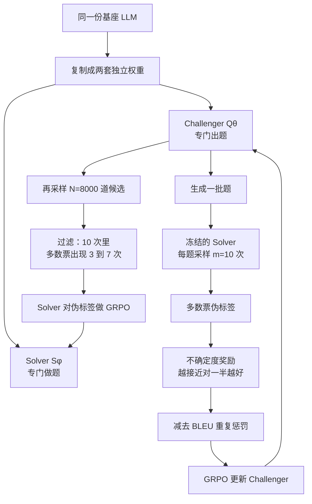

# R-Zero：零掉的是题库和标签，不是验证器；Challenger 与 Solver 必须拆成两套权重

<!-- release-date: 2025-08-07 -->

> 本文依据 Tencent AI Seattle Lab 与华盛顿大学圣路易斯分校、马里兰大学、德州大学达拉斯分校联合发布的 **R-Zero: Self-Evolving Reasoning LLM from Zero Data**，即 arXiv:2508.05004v4、2026-02-13、共 21 页、ICLR 2026 接收的版本。页码均指 PDF 本身的页码。v1 于 2025-08-07 首次公开，本文 `release-date` 取这一天。截至 2026-09-10 核验，arXiv 当前最新版本仍是 v4，与本地原件一致。文中会明确区分「论文写了什么」「本文如何解释它」「哪些是外部资料补充」。

## 读之前需要的最少背景

这篇论文只讲一件事：如果强化学习已经能用规则给答案打分，那题目和标准答案还要不要人来准备。

先把六个会反复出现的词说成人话。

- **可验证奖励强化学习（Reinforcement Learning with Verifiable Rewards，RLVR）**：不模仿某条标准推理过程，只看最终答案对不对。本站 [DeepSeek-R1](/reports/DeepSeek/DeepSeek-R1) 篇讲的就是这条路。
- **zero setting（零设置）**：R1 带出来的一种训练方式。跳过监督微调，不提供人类写好的思维链，直接从基座用任务奖励做强化学习。它零掉的是「推理过程」这一层监督，**没有**零掉题目和标准答案。
- **无标签强化学习（label-free RL）**：连标准答案也不要，改用模型自己的置信度、熵或多数票当奖励。它零掉了标签，**没有**零掉题库——题目还是人准备的。
- **出题者 / 解题者（Challenger / Solver）**：从同一份基座复制出来的**两套独立权重**。出题者负责发明新题；解题者负责把题做出来。参数不共享，各自用 GRPO 更新。这一点必须先记住，后面对照 Absolute Zero 时不会读串。
- **多数票伪标签（majority-vote pseudo-label）**：同一道题让 Solver 答 $m$ 次，出现次数最多的那个答案，当成这道题的「标准答案」。没有外部执行器，也没有人类标注。
- **不确定度奖励（uncertainty reward）**：出题者的分数。Solver 在这道题上越接近对一半、错一半，出题者分越高。太易或太难都接近 0。

后面还会碰到 **组相对策略优化（Group Relative Policy Optimization，GRPO）**。基础机制——为什么不训练 value model、组内归一化怎么算 advantage——在 DeepSeek-R1 篇和 [DAPO](/reports/ByteDance/DAPO) 篇里已经讲过。本文只需要记住：R-Zero 的 Challenger 和 Solver **两边都用 GRPO**，但奖励完全不是同一个东西。

跨篇只留对照，避免把别的文章再讲一遍：

- [DeepSeek-R1](/reports/DeepSeek/DeepSeek-R1) 的 zero setting 走通了「自己写推理过程」，题目和答案仍是人准备的。
- [Absolute Zero](/reports/Tsinghua/Absolute-Zero) 把「谁来出题」也拿走，但出题者和解题者是**同一套权重的两个角色**，老师是代码执行器。
- [DAPO](/reports/ByteDance/DAPO) 改的是：你已经有人类题库时，GRPO 那四个默认设置怎么踩雷。R-Zero 还没有题库。
- [Dr. Zero](/reports/Meta/Dr-Zero) 把类似的出题—解题循环放进搜索引擎这个环境。
- [Reward-Free](/reports/Tencent/Reward-Free-Self-Evolution) 走的是另一条轴：推理时不再依赖外部奖励，靠世界知识探索自发适应。

## 一句话先说清

「零数据」在这篇里具体零掉两层：**后训练阶段的人类题库**，以及**每道题的标准答案**。

它没有零掉的，至少还有这些：预训练好的基座、一份教 Challenger 怎么写出竞赛题的提示词、`<question>` 格式检查、用多数票临时充当老师、以及 GRPO 本身。论文自己把数学当成方便的试验场，因为答案够客观，多数票才统计得动，不必再接代码执行器（PDF p. 3）。

和 Absolute Zero 的差别必须一上来就钉死：

| | Absolute Zero | R-Zero |
|---|---|---|
| 出题 / 解题 | **同一套权重**的两个角色 | **两套独立权重**，分别优化 |
| 谁来当老师 | 代码执行器给出金标 | Solver 自己的多数票 |
| 还要什么环境 | Python 执行器 | 无执行器 |
| 真正零掉的 | 后训练人类题库 | 后训练人类题库 **和** 标签 |

论文把这套系统叫做 **R-Zero**。摘要写：Qwen3-4B-Base 经过三轮自进化，数学基准 +6.49、通用域 +7.54（PDF p. 1）。这两个数字后面会单独对页，因为它们和正文主表不是同一套口径。

先看它最终怎么转：

这是机制示意图，不是实测时间轴，根据 PDF p. 3 的 Figure 2 与 p. 19 的 Algorithm 1 重画。一轮里 Challenger 先动、Solver 后动；下一轮用更新后的 Solver 给 Challenger 打分，两边一起变强，也一起把伪标签变脏。

## 旧方法卡在哪：zero 其实还有两层没 zero 完

监督微调要三样东西：题目、标准推理过程、标准答案。RLVR 把中间那一层拿掉了，模型可以自己写思维链，只用结果对错来更新。R1 的 zero setting 再往前走一步：连冷启动蒸馏数据也不要，直接从基座开训。

论文指出，这一步之后人类监督并没有消失，只是换了位置（PDF p. 2）。大规模、专家出的题和标签，仍然是微调或 RLVR 的前提；让人继续出题，既贵，也构成「能力一旦超过出题者」时的天花板。

现有的两条减负路线，各零掉一层、各留下一层（PDF p. 2）：

| 路线 | 零掉了什么 | 还要什么 |
|---|---|---|
| 无标签 RL | 标准答案 | 预先准备好的题库 |
| 自我挑战 / 自博弈 | 人类出题 | 代码执行器之类的外部验证器，用来保证题合法、答案可核 |

论文给 R-Zero 的位置，是这两条都不要：既不提供题，也不提供标签，也不接执行器。Figure 1 右侧把三种范式画成一张对照（PDF p. 1）：RLVR 与 SFT 要任务也要解答；无标签 RL 只要任务；R-Zero 两格都打叉。

本文的读法更窄一些。**当前真正卡住的，不是「将来没有超人智能可学的题」，而是「RLVR 的可扩展性仍然绑在人类题库上；无标签方法仍然绑在人类题库上；自博弈方法往往绑在执行器上」。** 超人智能那一段是立场，不是本篇实验能证明的事。

它选数学当试验场，理由很具体：数学答案客观，多数票能直接当伪标签，不必再接代码执行器（PDF p. 3）。所以「不需要验证器」这个说法要打折扣——多数票就是验证器，只是这个验证器住在模型自己的采样分布里，不住在外部环境里。

## 核心设计一：Challenger 的奖励，把题出到 Solver 刚好会一半

Challenger 记作 $Q_\theta$，是一个自回归语言模型，专门生成题。它用 GRPO 训练。真正要设计的不是算法，是「一道好题」的标量奖励 $r_i$（PDF p. 3）。

奖励流水线有三道闸，顺序固定。

### 第一闸：格式不合格，直接 0 分

生成结果必须被 `<question>` 和 `</question>` 包住。不合格就记 $r_i=0$，后面的不确定度和重复惩罚都不算（PDF p. 3）。

附录里的 Challenger 提示词还要求另起一块 `\boxed{final answer}`，并且自称是竞赛命题人，难度目标是「不到 30% 的高水平高中生能做出来」（PDF p. 14–15）。**格式检查只看题干标签，不看 boxed 答案在不在。** 更关键的是：Challenger 被要求写出答案，但后文构造 Solver 课表时**完全不用**这个答案，改用 Solver 的多数票。论文没有解释为什么要 Challenger 写答案却不用。本文的读法是：出题模型被训练成「出难题」，它自己的解答不可信；老师必须换人。

提示词里那句「少于 30% 的高中生能做出来」，是写进系统消息的人类难度先验。零的是题库，不是命题口味。

### 第二闸：不确定度，峰值在 50%

对一道生成出来的题 $x$，问当前**冻结的** Solver $S_\phi$ 要 $m$ 个回答 $\{y_1,\ldots,y_m\}$。出现最多的那个当作伪标签 $\tilde y(x)$，经验正确率是「有多少个回答等于这个多数票」：

$$
\hat p(x;S_\phi)=\frac1m\sum_{j=1}^{m}\mathbf{1}\{y_j=\tilde y(x)\}
$$

不确定度奖励写成（PDF p. 3）：

$$
r_{\mathrm{uncertainty}}(x;\phi)=1-2\left|\hat p(x;S_\phi)-\frac12\right|
$$

这是一个三角形：$\hat p=0.5$ 时得 1，$\hat p=0$ 或 $1$ 时得 0。它奖励的不是「题很难」，而是「当前 Solver 刚好卡在会与不会的边界上」。

附录 F 给了一个理论动机（PDF p. 18）。近期有工作形式化过：最有效的训练发生在学习者能力的前沿（论文引 Shi et al., 2025a；Bae et al., 2025）。Solver 到最优策略 $S^\star$ 的 KL 散度，可以被奖励方差下界住；二值奖励下这个下界是

$$
D_{\mathrm{KL}}(S_\phi\|S^\star)\ge\frac{\hat p(1-\hat p)}{2\beta^2}
$$

右边在 $\hat p=0.5$ 时最大。所以把 Challenger 的奖励对准 50%，是在对准「这一轮课表的学习效率上界」。$\beta$ 是熵正则的温度。这是动机，不是本篇自己证出来的定理；论文也没有验证这个下界在实验里紧不紧。

和 DAPO 的对照值得停一下。DAPO 的动态采样丢掉「全对」和「全错」的题，因为那些题的 advantage 是 0。R-Zero 的 Challenger 更狠：它不只是丢掉两端，而是**主动把题生成到中间**。两端都是零梯度；R-Zero 选择把出题策略本身推到最大方差处。

实验里 $m=10$（PDF p. 4）。

### 第三闸：同一 batch 里题目太像，扣分

为了逼 Challenger 出多样的题，论文给了一个 batch 内重复惩罚。相似度用 BLEU，因为 rollout 时要算很多次，BLEU 便宜（PDF p. 3）。两道题的距离是

$$
d_{ij}=1-\mathrm{BLEU}(x_i,x_j)
$$

$d_{ij}<\tau_{\mathrm{BLEU}}$ 的题被聚成一类。题 $x_i$ 若落在簇 $C_k$ 里，惩罚正比于这个簇的相对大小：

$$
r_{\mathrm{rep}}(x_i)=\lambda\frac{|C_k|}{B}
$$

$B$ 是 batch 大小，$\lambda=1$，$\tau_{\mathrm{BLEU}}=0.5$（PDF p. 3–4）。附录 B.4 写实现：NLTK 的 `sentence_bleu` 加 `SmoothingFunction().method1`，只按空白切词、不做大小写或标点归一；距离矩阵交给 scikit-learn 的平均链接层次聚类，metric 设为 `precomputed`（PDF p. 15–16）。附录公式把 $\lambda$ 省掉了，因为实验里 $\lambda=1$，和正文一致。

### 合成：奖励不能是负数

过了格式检查的题，最终标量是（PDF p. 4）

$$
r_i=\max\bigl(0,\ r_{\mathrm{uncertainty}}(x_i;\phi)-r_{\mathrm{rep}}(x_i)\bigr)
$$

整簇都重复时 $|C_k|=B$、$r_{\mathrm{rep}}=1$，不确定度再高也被削成 0。这组 $\{r_1,\ldots,r_G\}$ 拿去算 advantage，最小化 GRPO 损失，更新 $Q_\theta$。

**代价**：BLEU 只看表面 n-gram，换皮同构的题不一定能抓到。论文承认「可以用任何相似度」，选 BLEU 是因为快，不是因为语义对。$\tau_{\mathrm{BLEU}}=0.5$ 没有扫描曲线。

**可迁移的部分**：给生成器设计奖励时，先问「我有没有一个与质量无关的量，正在决定这批样本长得有多像」。重复惩罚不必精致，但必须在 rollout 的频率上便宜到能每步都算。

## 核心设计二：Solver 的课表，从 8000 道里留下「不太确定」的

Challenger 更新完，冻结它，让它当课表生成器。先从 $Q_\theta(\cdot\mid p_0)$ 采 $N=8000$ 道候选；$p_0$ 就是那份命题提示词（PDF p. 4）。

对每道候选，当前 Solver 再答 $m=10$ 次，多数票得到 $\tilde y_i$，经验正确率 $\hat p_i$。只有落在信息带里的题才进训练集 $\mathcal S$（PDF p. 4）：

$$
\left|\hat p_i-\frac12\right|\le\delta,\qquad \delta=0.25
$$

也就是 $\hat p_i\in[0.25,0.75]$。换成次数：10 次里多数票出现 3 到 7 次（含）才留（PDF p. 4）。论文说这个区间和此前若干难度过滤工作一致。

过滤有双重任务，论文写得很清楚（PDF p. 4）：

1. 丢掉太易和太难，给 Solver 一条有梯度的课表；
2. **顺便做质检**。伪标签来自多数票，$\hat p_i$ 很低常常意味着题本身含糊、病态，或伪标签不可靠。

注意 3/10 仍然叫「多数票」：只要没有别的答案出现超过 3 次，3 就是众数。这已经是「答案很散」的题。把它们留在带的下沿，而不是直接丢掉，是在「太难」和「太脏」之间折中。

**论文没写的**：8000 道里最后留下多少。没有 $|\mathcal S|$，没有各迭代的通过率。课表实际有多厚，复现时只能自己跑。

和 DAPO 动态采样的差别：DAPO 有金标，过滤的是「对不对」的两端；R-Zero 没有金标，过滤的是「自己跟自己一致不像」的两端。两端看起来都像课程学习，信号来源完全不同。

## 核心设计三：Solver 对着伪标签做 GRPO

Solver 记作 $S_\phi$，在过滤后的 $\mathcal S$ 上继续 GRPO。奖励简单得多，是一条可验证的 0/1（PDF p. 4）：

$$
r_j=
\begin{cases}
1, & y_j=\tilde y_i,\\
0, & \text{otherwise.}
\end{cases}
$$

正文把匹配对象写成了 $x_j$（题目），这是笔误。Algorithm 1 写的是 $\mathbf{1}(y_j=\tilde y)$（PDF p. 19），按回答是否等于伪标签来判。

这里的「可验证」加了引号。验证的是「像不像多数票」，不是「对不对」。多数票一旦错，这条 0/1 会系统性地强化错误答案。第 4.4 节会看到，这个错误率随迭代上升。

附录 I 给出他们用的 GRPO 写法（PDF p. 20）：组内 z-score 当 advantage，同一条回答的所有 token 共用一个值；目标里仍留着 KL 惩罚。附录 B 的超参把 KL 系数写成 $\lambda_{\mathrm{KL}}=1\times 10^{-2}$（PDF p. 14）。对照 DAPO：DAPO 把 KL 整项删掉，因为长思维链本来就该远离初始模型。R-Zero 没删。另外，附录 I 的损失分母是先按句长平均再按组平均，也就是 DAPO 批评过的样本级聚合，不是 token 级。论文没有讨论这两处选择。

Solver 每轮最多 15 步，Challenger 每轮最多 5 步；两边 global batch 都是 128，学习率都是 $1\times 10^{-6}$；Solver rollout 数 $G=5$，Challenger $G=4$；温度 1.0、top-p 0.99；BF16 + FlashAttention 2（PDF p. 14）。相对 DAPO 的 $G=16$，这里的组非常小。论文没有解释为什么出题组比解题组还小。

Solver 的提示词是常规的「逐步推理，把最终答案放进 `\boxed{}`」（PDF p. 14）。

## 为什么必须拆成两套权重

这一点决定这篇不能被读成 Absolute Zero 的换皮。

Absolute Zero 明确选择不拆网络：大模型本来就会在同一种语言空间里既写题又写答案，出题者和解题者是同一套权重的两个角色。R-Zero 走相反的路。正文从摘要第一段就写：从一份基座初始化两个独立模型，**分别优化、共同进化**（PDF p. 1–2）。

附录 D 专门做了消融，配置名叫 Single-R-Zero：一个模型同时出题、同时从自己出的题里学（PDF p. 17）。Qwen3-4B-Base、数学平均分和伪标签准确率如下。伪标签准确率由 Gemini 标注（和后文 Table 5 用 GPT-4o 不是同一套 oracle）：

| 迭代 | 双模型表现 | 双模型伪标签准确率 | 单模型表现 | 单模型伪标签准确率 |
|---|---:|---:|---:|---:|
| Step 15 | 48.06 | 71.0% | **47.31** | 63.4% |
| Step 30 | 48.44 | 56.2% | 46.95 | 46.6% |
| Step 45 | **49.12** | 48.8% | 45.57 | 32.6% |
| Step 60 | 46.52 | 42.2% | 43.89 | 33.8% |

（PDF p. 17，Table 6）

两条结论，论文自己写了：

1. 双模型峰值更高（49.12），而且能涨到第三轮才塌；单模型第一轮就到顶，之后一路掉。
2. 单模型每一阶段的伪标签都更脏。第一轮已经是 63.4% 对 71.0%。

论文的假说：出题者和解题者来自同一份权重，会带来一种「内部偏见造成的过度自信」（PDF p. 17）。本文补一句对照，不是论文原话：**Absolute Zero 能共享权重，是因为代码执行器从外部切断了「自己出题、自己判分」这条回路；R-Zero 把老师换成了模型自己的多数票，再不拆开，出题和判分就是同一种偏见在签名。**

这是附录里会改变读法的一节。主文实验全是双模型；如果有人按 Absolute Zero 的「一个模型演双簧」去复现 R-Zero，附录 D 已经预告了更早的崩溃和更脏的标签。

## 实验怎么设

### 基座

两条家族（PDF p. 4）：

- Qwen3-4B-Base 与 Qwen3-8B-Base，看同一架构下的规模；
- OctoThinker-3B 与 OctoThinker-8B。OctoThinker 从 Llama-3.1 继续预训练而来；原论文报告过：对 Llama 直接做 RL 效果不好。选它是为了看 R-Zero 能不能在「RL 不友好」的 Llama 谱系上动。

分析实验默认都在 Qwen3-4B-Base 上（PDF p. 6）。Figure 3 另外加了 Qwen3-0.6B-Base 和 1.7B-Base，这两档没有进主表。

实现基于 EasyR1（PDF p. 4）。本站有 [HybridFlow](/reports/ByteDance/HybridFlow) 篇讲 veRL 那一套；EasyR1 是它的一条简化实现。论文没写 GPU 数和墙钟时间。

### 评测口径（附录 C，PDF p. 16）

数学七个基准：AMC、Minerva、MATH-500、GSM8K、OlympiadBench、AIME 2024、AIME 2025。答案可能是表达式，用 GPT-4o 当程序化判官，温度 0.1，只许回 Yes 或 No（PDF p. 15）。AMC 和 AIME 报 mean@32，其余数学题用贪心解码的准确率。

通用三个基准：MMLU-Pro、SuperGPQA、BBEH（BIG-Bench Extra Hard）。评测代码、提示词和 Exact Match 贪心解码都跟 General-Reasoner（Ma et al., 2025）。论文说复现结果和 General-Reasoner、Qwen3 技术报告对齐（PDF p. 5）。

**所有实验表的数字，都是 Solver 训练 45 步之后的结果**；图上则每 15 步报一次（PDF p. 5）。按附录 B，Solver 每轮最多 15 步，所以 45 步对应三轮共进化，60 步对应四轮。后文 Figure 3 的横轴按这个读。

有一个必须提前说的口径问题。摘要和引言的主结果是 Qwen3-4B-Base **数学 +6.49、通用域 +7.54**（PDF p. 1–2）。正文 Table 1 的数学平均是 42.57 → 49.93（+7.36）；Table 2 的通用平均是 26.34 → 31.15（+4.81）。**摘要对不上主表。** +6.49 对得上 Figure 3 / Table 3 的 49.07 − 42.58；+7.54 在 PDF 正文任何一张表里都算不出来。官方仓库 README 把 MATH 平均和三个通用基准再平均成 Overall，Qwen3-4B-Base 从 27.10 到 Iter 3 的 34.64，差正好 7.54。摘要把这个 Overall 写成了「general-domain」。这是本文核对后的判断，论文没有说明 7.54 怎么来。后文引用时会写明数字出自哪张表。

## 数学结果：主表证明「能涨」，没有证明「处处都涨」

Table 1 把每个基座和三条线对比（PDF p. 5）：不训练的 Base、论文复现的 Absolute Zero、**R-Zero（❄ Challenger）**——Solver 只吃未经 RL 训练的 Challenger 出的题、以及完整 R-Zero。雪花标记就是「未训练的出题者」。

Qwen3-4B-Base：

| 配置 | Avg. | AMC | Minerva | MATH | GSM8K | Olympiad | AIME25 | AIME24 |
|---|---:|---:|---:|---:|---:|---:|---:|---:|
| Base | 42.57 | 45.70 | 38.24 | 68.20 | 87.79 | 41.04 | 10.30 | 6.7 |
| Absolute Zero | 46.42 | 52.45 | 41.96 | 76.20 | 89.34 | 42.56 | 10.20 | 12.20 |
| R-Zero（❄ Challenger） | 45.01 | 45.00 | 45.22 | 72.80 | 87.87 | 41.19 | 10.20 | 12.80 |
| R-Zero | **49.93** | **57.27** | **52.94** | **79.60** | **92.12** | **44.59** | 9.60 | **13.40** |

Qwen3-8B-Base：

| 配置 | Avg. | AMC | Minerva | MATH | GSM8K | Olympiad | AIME25 | AIME24 |
|---|---:|---:|---:|---:|---:|---:|---:|---:|
| Base | 48.64 | 51.95 | 50.00 | 78.00 | 89.08 | 44.74 | 12.10 | 14.60 |
| Absolute Zero | 52.68 | 57.89 | 57.90 | 76.60 | 92.00 | 47.80 | **18.20** | **18.40** |
| R-Zero（❄ Challenger） | 52.10 | 60.70 | 57.72 | 81.60 | 92.56 | 46.44 | 11.60 | 14.10 |
| R-Zero | **53.72** | **61.67** | **60.66** | **82.00** | **94.09** | **48.89** | 13.30 | 15.40 |

OctoThinker-3B：Base 26.64 → R-Zero **29.32**（+2.68）。OctoThinker-8B：36.41 → **38.52**（+2.11）。两条上都超过了论文复现的 Absolute Zero 和 ❄ Challenger（PDF p. 5）。

读这张表必须同时读正文里那几句对不上的话。

正文写：Qwen3-8B-Base 三轮之后从 49.18 到 54.69（+5.51）（PDF p. 5）。Table 1 是 48.64 → 53.72（+5.08）。49.18 和 54.69 出现在官方仓库 README 的 MATH AVG 列，不在 PDF 主表。正文还写：第一轮相对 baseline +1.52（8B）和 +3.7（4B）。这两个差，用 README 的「Iter 1 减 Base Challenger」刚好能对上（53.39 − 51.87 = 1.52，48.06 − 44.36 = 3.70），用 Table 1 对不上。**主表和叙述不是同一份数。** 本文以 PDF 表格为准，叙述里的 49.18 / 54.69 / +1.52 / +3.7 当作未同步的旧稿。

几件表内就看得见、不需要外数的事：

1. **完整 R-Zero 在四个基座的数学平均上都高于 ❄ Challenger。** 出题者经过 RL，课表确实比「让基座直接出题」有用。4B 上这笔差最大：49.93 − 45.01 = 4.92。
2. **AIME 不是全面上涨。** 4B 的 AIME25 从 10.30 掉到 9.60；OctoThinker-8B 的 AIME25 从 1.56 掉到 0.42。mean@32 方差大，论文没讨论这些下跌。
3. **和 Absolute Zero 的对比，论文几乎没有方法说明。** 表里有一行 Absolute Zero，正文没写用的是官方 AZR 代码、什么执行器、如何接到 Qwen3-4B-Base（不是 Coder）上。4B 上 R-Zero 平均分更高；8B 上 Absolute Zero 在 AIME24/25 反而高不少（18.20 / 18.40 对 13.30 / 15.40）。把这一行读成「全面超过 AZ」，表不支持。
4. 摘要的 +6.49 来自 Figure 3 的 49.07，不是 Table 1 的 49.93。分析节和主表的「同一模型、同一 45 步」已经差了 0.86 分。论文没有解释。

## 通用推理：数学课表能外溢，但不是每个基座都外溢得过 Absolute Zero

训练课表是数学题。论文问：这种外溢，在课表完全自生成、没有人类标签时还在不在（PDF p. 5）。Table 2（PDF p. 6）：

| 模型 | 配置 | Overall Avg. | SuperGPQA | MMLU-Pro | BBEH |
|---|---|---:|---:|---:|---:|
| Qwen3-4B-Base | Base | 26.34 | 20.88 | 50.58 | 7.57 |
| | Absolute Zero | 29.33 | 27.10 | 52.60 | 8.30 |
| | ❄ Challenger | 28.52 | 24.77 | 54.20 | 6.59 |
| | R-Zero | **31.15** | **27.55** | **55.47** | **10.42** |
| Qwen3-8B-Base | Base | 31.98 | 28.33 | 58.97 | 8.63 |
| | Absolute Zero | 34.40 | **31.89** | 60.50 | **10.80** |
| | ❄ Challenger | 31.29 | 30.12 | 54.14 | 9.60 |
| | R-Zero | **34.50** | 31.38 | **61.53** | 10.60 |
| OctoThinker-3B | Base | 7.47 | 10.09 | 10.87 | 1.46 |
| | Absolute Zero | **16.03** | **17.70** | **24.30** | **6.10** |
| | ❄ Challenger | 10.04 | 11.19 | 14.53 | 4.40 |
| | R-Zero | 11.12 | 12.44 | 16.71 | 4.20 |
| OctoThinker-8B | Base | 11.70 | 13.26 | 20.21 | 1.64 |
| | Absolute Zero | 18.40 | 18.80 | 31.40 | 5.00 |
| | ❄ Challenger | 21.30 | 16.99 | **41.46** | 5.46 |
| | R-Zero | **23.00** | **19.82** | 40.92 | **8.25** |

4B 上 26.34 → 31.15，+4.81。这是 Table 2 自己的通用平均，也是本文认为应当记住的通用域数字。摘要的 +7.54 不要和它混用。

正文写 Qwen3-8B-Base 通用平均 +5.13、OctoThinker-3B +3.65（PDF p. 6）。后者对得上 Table 2（11.12 − 7.47 = 3.65）；前者对不上（34.50 − 31.98 = 2.52）。又是一处叙述和主表分家。

几条表内结论：

1. **Qwen 两档上，数学自进化确实外溢到 SuperGPQA / MMLU-Pro / BBEH。** 4B 的 BBEH 从 7.57 到 10.42；8B 的 MMLU-Pro 从 58.97 到 61.53。
2. **8B 上 R-Zero 和 Absolute Zero 几乎打平**（34.50 对 34.40），SuperGPQA 和 BBEH 还是 Absolute Zero 略高。
3. **OctoThinker-3B 上 Absolute Zero 把 R-Zero 拉开一截**（16.03 对 11.12）。论文写「所有被试模型都能看到迁移」，没有提这一行反例。3B 这个基座更弱，执行器给金标的 AZ 比多数票更吃得开——这是本文的读法，不是论文的解释。
4. 8B 的 ❄ Challenger 通用平均 31.29，**低于 Base 的 31.98**。未训练的出题者在 8B 通用域上是负贡献；RL 训练过的 Challenger 才把数拉回去。数学上 ❄ 已经是正的（52.10 > 48.64）。同一条基线，数学和通用的符号可以相反。

附录 H 做了一个「去掉数学约束」的提示词实验（PDF p. 19–20，Table 8）：让 Challenger 出常识、逻辑和其他非数学题。8B 上，去数学提示之后数学和通用都略升（AMC 61.67 → 65.53，SuperGPQA 31.38 → 32.29）；4B 上几乎持平、数学略降。论文的结论是：基座够大时，更杂的课表还能再涨。注意 Table 8 的 Qwen3-4B 基线 MMLU-Pro 写成 37.38，Table 2 是 50.58，**同一模型的基线在两张表里差 13 分**。R-Zero 的 MMLU-Pro 倒是都写 55.47。所以 Table 8 适合拿来比「R-Zero 对 R-Zero（no math）」这两行，不适合拿来算相对 Base 的增益。

## 消融：重复惩罚护数学，过滤护通用

Table 3 在 Qwen3-4B-Base 上一次关一个模块（PDF p. 6）：

| 方法 | Math AVG | General AVG |
|---|---:|---:|
| R-Zero | 49.07 | 31.15 |
| 去掉重复惩罚 | 45.76 | 28.73 |
| 去掉难度过滤 | 47.35 | 26.69 |

数学上，去掉重复惩罚掉 3.31 分，去掉过滤掉 1.72 分。通用上反过来：去掉过滤掉 4.46 分（31.15 → 26.69），掉到几乎贴着 Base 的 26.34；去掉重复惩罚掉 2.42 分。

论文写过滤让通用域「掉超过 6 分」（PDF p. 7）。Table 3 实际差 4.46。以表格为准。

机制上说得通。重复惩罚管的是课表多样性，对数学这种容易出换皮题的领域更关键。过滤管的是「多数票不可靠的病态题」，这些题对跨域迁移更伤——Solver 在脏标签上过拟合之后，通用基准先崩。论文自己把过滤称为双重机制：校准难度，兼做质检（PDF p. 7）。消融支持「质检」这边：通用掉得比数学多。

Table 3 的 R-Zero 数学是 49.07，不是 Table 1 的 49.93。分析节内部自洽，和主表不自洽。

## 迭代扩不下去：更大只是更晚塌

Figure 3 把数学平均画成 Base → Step 15 → 30 → 45 → 60，对应 0 到 4 轮 Solver 训练（PDF p. 7）。图上标了星号的是每档峰值。按图读出的数字：

| 模型 | Base | Step 15 | Step 30 | Step 45 | Step 60 | 峰值位置 |
|---|---:|---:|---:|---:|---:|---|
| Qwen3-0.6B-Base | 16.77 | **27.39** | 27.15 | 25.05 | 25.15 | 第 1 轮 |
| Qwen3-1.7B-Base | 32.71 | 39.19 | **39.20** | 37.03 | 38.27 | 第 2 轮 |
| Qwen3-4B-Base | 42.58 | 48.06 | 48.44 | **49.07** | 46.52 | 第 3 轮 |

（曲线数值是本文按图读的；论文正文只叙述趋势，没有把这张表写出来。4B 的 49.07 与 Table 3 一致。）

小节标题写「最终会收敛，时机取决于模型大小」（PDF p. 7）。正文用的词是 **performance degradation** 和 **collapse**：良性循环不会无限持续，多轮之后所有模型都掉，只是更大的模型掉得更晚。0.6B 第一轮就到顶；4B 撑过三轮，Step 60 才明显下跌。容量能推迟，不能取消。

1.7B 在 Step 60 从 37.03 回升到 38.27，仍低于峰值 39.20。标题说「收敛」，图上更像「先涨后掉，有的档会小幅反弹」。

附录 E 接着问：塌是不是就是伪标签变脏（PDF p. 17）。他们用 Gemini 标了各规模、各迭代的伪标签准确率（Table 7）：

| 迭代 | 0.6B | 1.7B | 4B |
|---|---:|---:|---:|
| Step 15 | **70.6** | 69.4 | 71.0 |
| Step 30 | 53.4 | **55.2** | 56.2 |
| Step 45 | 50.8 | 52.2 | **48.8** |
| Step 60 | 44.0 | 45.2 | 42.2 |

加粗的是各规模「开始掉分时」的准确率。0.6B 在标签还有 70.6% 时就开始掉；4B 能忍到 48.8%。**不存在一个统一的噪声阈值。** 论文因此说，绝对标签噪声不是失稳的唯一原因；更根本的可能是「只在自己合成的数据上训练」带来的模型崩塌：多样性丢失、自身偏见被放大（PDF p. 17–18，引了 Shumailov et al. 2024 等）。这是假说，附录没有再做「换一批外部题就能稳住」的对照实验。

官方仓库后来把「用少量人类数据把迭代撑住」写成 follow-up（R-Few）。那是论文之后的事，见文末资料边界，不能当成 v4 的结论。

## 当中训：先自进化，再吃人类题，比一上来就吃更好

第 4.3 节把 R-Zero 当成 mid-training：先共进化，每轮结束再拿到有标签数据上做一次训练（PDF p. 7–8）。标签集是 hiyouga/math12k。论文把这条线叫做 supervised fine-tuning，但紧接着写「这个过程我们也用 GRPO」。所以它不是交叉熵式的 SFT，而是**有金标的 RLVR**。后文仍按论文的说法叫 SFT，心里要换成 GRPO。

Figure 4（PDF p. 8）两条线：只做 R-Zero，以及每轮之后再加人类数据。虚线是「基座直接在人类数据上 GRPO」。按图读：

Qwen3-4B-Base：

| 点 | 只 R-Zero | R-Zero + 人类数据 |
|---|---:|---:|
| Base | 42.58 | 48.99 |
| Step 15 | 48.06 | 50.55 |
| Step 30 | 48.44 | **51.34** |
| Step 45 | 49.07 | 49.62 |

48.99 是人类数据基线，也是橙色线的起点。峰值 51.34 相对这条虚线 +2.35，论文正文写的就是这个差（PDF p. 7）。到 Step 45，加人类数据的线已经从 51.34 掉回 49.62，和「迭代过了会塌」是同一件事：中训也救不了第四轮附近的失稳，只是把峰值垫高。

Qwen3-8B-Base：人类数据基线 53.15；R-Zero + 人类在 Step 45 到 **56.84**，论文标 +3.69（56.84 − 53.15）。8B 这条线还在涨，4B 已经回头——又一次，更大只是更晚。

他们还试过把人类数据和 R-Zero 生成的题**混在一起**同时训。Table 4 是 4B 上的分基准结果（PDF p. 8）：

| 数据 | AMC | Minerva | MATH | GSM8K | Olympiad | AIME25 | AIME24 | SuperGPQA | MMLU-Pro | BBEH |
|---|---:|---:|---:|---:|---:|---:|---:|---:|---:|---:|
| 只人类 | 57.97 | **55.15** | 80.8 | 92.04 | **48** | 9.58 | 10.31 | **29.49** | 57.03 | 9.71 |
| 只 R-Zero | 57.27 | 52.94 | 79.6 | 92.12 | 44.59 | 9.6 | 13.4 | 27.55 | 55.47 | 10.42 |
| 混合 | 57.9 | 53.2 | **81.2** | **92.2** | 47.7 | **10.32** | **14.67** | 29.4 | **58.2** | **11.8** |

混合在多数栏位上高于单独任何一边，论文说它仍低于「先 R-Zero 再 SFT」的顺序策略。假说是：混在一起会稀释高质量人类信号，同时部分冲淡自生成噪声；先让模型自己长出推理，再吃干净标签，更划算（PDF p. 8）。精确原因他们留给以后。

可迁移的部分很窄、也很实用：如果已经有一小撮干净题，**不要和自生成数据抢同一个 batch**。先让自博弈把模型推离基座，再拿金标做一次 RL，是这条实验支持的顺序。它没有支持「从此可以不买人类题」。

## 题变难了，伪标签也脏了

第 4.4 节是共进化最直接的一张病理切片（PDF p. 8–9）。从 Challenger 在 Step 15 / 30 / 45 的策略里各采 200 道题，得到三份测试集 $\mathcal D_{\mathrm{step}\,15}$、$\mathcal D_{\mathrm{step}\,30}$、$\mathcal D_{\mathrm{step}\,45}$。假定 GPT-4o 是完美标注员，给每道题金标。内部模型拿这个金标评分；「GPT-4o 自己那一列」其实是**伪标签对 GPT-4o 金标的真准确率**。

Table 5（过滤后的集合，PDF p. 8）：

| 题集 | Base | Solver 15 | Solver 30 | Solver 45 | 伪标签真准确率 |
|---|---:|---:|---:|---:|---:|
| $\mathcal D_{\mathrm{step}\,15}$ | 48.0 | 59.0 | 57.0 | 61.0 | **79.0%** |
| $\mathcal D_{\mathrm{step}\,30}$ | 52.5 | 53.0 | 51.5 | 53.5 | 69.0% |
| $\mathcal D_{\mathrm{step}\,45}$ | 44.0 | 47.0 | 45.0 | 50.5 | 63.0% |

两件事同时发生。

第一，题在变难。固定住 Solver（Step 15），在 GPT-4o 金标下，从第一轮题集的 59.0% 掉到第三轮题集的 47.0%。Challenger 的课表内在难度确实在涨。这正是不确定度奖励想要的。

第二，伪标签在变脏。真准确率从 79.0% 掉到 63.0%。题越难，Solver 的多数票越不能当真理。论文把这称为关键折中，也是框架最终表现的潜在瓶颈（PDF p. 9）。

读表时还有一个小异常：Base 在 $\mathcal D_{\mathrm{step}\,30}$ 上 52.5，反而高于 $\mathcal D_{\mathrm{step}\,15}$ 的 48.0。如果难度单调上升，这不该发生。论文没有解释。200 道题的抽样噪声、或者第二轮 Challenger 短暂出过更偏某类题，都有可能。不要把「每一步都更难」读成严格单调。

和 Table 6 / 7 不要混。Table 5 用 GPT-4o、200 题；Table 6 / 7 用 Gemini，4B 第一轮伪标签是 71.0% 不是 79.0%。oracle 不同，绝对数字不能横比，趋势都是「越往后越脏」。

把 4.2、4.4 和附录 E 放在一起，因果链是这样的（前两步是论文写明的，第三步是附录的假说）：

1. Challenger 被奖励去出 Solver 只会一半的题 → 课表变难；
2. 题变难 → 多数票真准确率下降 → Solver 在更脏的 0/1 上更新；
3. 脏标签加上「只吃自己合成的数据」，多样性丢失，循环在某一步翻成负的。更大的模型能多撑一两轮，因为同样脏的标签对它伤害来得更晚。

## 相关工作只留对照

第 5 节三条线，和开篇的分层是同一张图（PDF p. 9）：

- 无标签 RL 仍要预先存在的未标注题库；R-Zero 连种子题库都不要。
- 语言模型里的自博弈，在代码这类可验证域特别好用（Coder + Tester + 单测）。R-Zero 声称把自己推到「没有这类验证环境的通用推理」。正文训练的仍是数学、验证的仍是多数票，所以这句「已经推到开放域」要和限制节一起读。
- RLVR 从规则验证器走到模型验证器。R-Zero 的 Solver 奖励形式上是 RLVR，验证器是多数票。

Absolute Zero 被放在自博弈那一条引用里（Zhao et al., 2025a），主表也拿来做了基线，但方法节没有讨论「共享权重 + 执行器」和「独立权重 + 多数票」为什么不同。这个对照是本文补的，不是论文自己的章节。

## 限制：多数票走不出能判对错的域

第 6 节写得很干脆（PDF p. 9–10）。R-Zero 的核心机制依赖「对错可以客观判定」。Challenger–Solver 共进化需要清晰、确定的评价信号。开放式任务——创意写作、对话、偏好驱动的生成——没有无歧义的正确性标准，这篇的循环转不起来。他们现在用的标注和验证策略，也不一定能推广到所有任务类型。

第 7 节把同一句话写成未来工作：效率、更鲁棒的标注、新领域；把自进化范式扩到评价主观的开放生成，仍然是显著障碍（PDF p. 10）。

所以相关工作里「扩展到缺乏验证环境的通用推理」和限制节是拧着的。实验支持的是：**在答案可以比较、可以多数票的域（数学，以及附录 H 那种仍然能判 EM 的常识 / 逻辑）里，不要人类题库也能涨分；涨到某一轮会自己回头。** 它没有支持「开放域已经解决」。

可复现性声明写：用到的数据集都公开，超参在附录 B 和第 3 节（PDF p. 10）。训练数据是自生成的，所谓公开数据集指的是评测基准和那份 math12k。GPU 小时、过滤后的 $|\mathcal S|$、随机种子、Absolute Zero 基线怎么复现，声明里都没有。

附录 A 披露：大模型只用来改语法、写数据处理脚本和调试，作者对全文负责（PDF p. 14）。不改变任何实验结论。

## 它怎么支撑基模的训练

论文对此着墨不多，需要克制。

**论文明确写了的：**

- R-Zero 是后训练框架，从 **Base** 模型直接开训，不先做指令微调（Table 1 的每一行都是 Base）；
- 实现建立在 EasyR1 上；
- 可以当 mid-training：先自进化，再在有标签数据上 GRPO，4B 比纯人类数据高 2.35 分（Figure 4）；
- 数学课表能外溢到通用基准。

**论文没有写的：**

- 没有说 R-Zero 被用进腾讯任何一个已发布基座；
- 没有 8B 以上的规模，没有 MoE；
- 没有墙钟、GPU 数、token 预算；
- 没有把多数票换成模型验证器或执行器的对照——那会直接变成 Absolute Zero 或普通 RLVR。

适用前提，缺一不可：

1. 答案必须能被比较，多数票才统计得动（所以他们从数学做起）；
2. Challenger 和 Solver **拆成两套权重**（附录 D）；
3. 有一层过滤，把太一致和太不一致的题挡在课表外；
4. 迭代轮数必须当超参看，不是越大越好——4B 在第四轮已经掉。

换到对话对齐、开放写作、或者没有「可比较的短答案」的任务，这四条至少塌两条。奖励一旦不可比，拆不拆权重都救不回来。

## 关键词回看

- **零数据（zero data）**：这篇零掉的是后训练题库和标签；不零预训练、提示词、格式约束和多数票这个验证器。
- **Challenger / Solver**：两套独立权重。出题者吃不确定度奖励，解题者吃伪标签 0/1。不是 Absolute Zero 那种角色切换。
- **不确定度奖励 $r_{\mathrm{uncertainty}}$**：三角形，峰值在 $\hat p=0.5$。把课表钉在 Solver 当前能力的边界上。
- **重复惩罚 $r_{\mathrm{rep}}$**：batch 内按 BLEU 聚类，簇越大扣得越多；$\lambda=1$，$\tau_{\mathrm{BLEU}}=0.5$。
- **信息带过滤 $\delta=0.25$**：10 次采样里多数票出现 3 到 7 次才进 $\mathcal S$。既是课程，也是质检。
- **多数票伪标签**：Solver 自己投票当金标。第一轮大约 70%–79% 真准确率（取决于 GPT-4o 还是 Gemini），第三轮掉到 60% 上下。
- **R-Zero（❄ Challenger）**：出题者未经 RL，只让 Solver 吃基座直接出的题。用来证明「出题者也要训」。
- **Single-R-Zero**：共享参数的消融。更早塌，伪标签更脏。
- **mid-training**：先 R-Zero 再在人类题上 GRPO；论文叫做 SFT，实现是 GRPO。
- **模型崩塌（model collapse）**：附录 E 对「不是单纯标签噪声」的假说，指向只吃自合成数据时的退化反馈。
- **mean@32**：AMC / AIME 上 32 次采样的平均正确率。其余数学和通用基准是贪心 Exact Match。
- **EasyR1**：本工作的 RL 框架，论文参考文献指向 Zheng et al., 2025b。

## 最后的判断

这篇论文真正做硬的，不是又一个 GRPO 技巧，而是把 RLVR 里看起来「当然得人来做」的两件事——出题、给答案——都换成模型自己，并且用实验说明：**这件事做成的前提，是出题和解题必须拆成两套权重。**

实验支持的部分很清楚。四个基座的数学平均都涨；Qwen 两档的通用基准也涨；❄ Challenger 证明出题者的 RL 不是摆设；重复惩罚和过滤各挡一种病；先自进化再吃人类题，比一上来就吃更高；题确实在变难。这些都有表。

必须和 Absolute Zero 对着读。AZ 留下了代码执行器当老师，所以可以共享权重。R-Zero 把老师换成多数票，所以必须拆开——附录 D 不是可选实现细节，是方法能转下去的条件。主表里那行 Absolute Zero 几乎没有复现说明，8B 数学的 AIME、3B 通用，AZ 并不弱。不要把 Table 1 的加粗读成「全面取代执行器」。

观察和缺口同样清楚。循环会塌，更大只是更晚；伪标签真准确率随难度下降；附录 E 说这不只是噪声，但没有把「换外部题」做成对照。摘要 +6.49 / +7.54 和主表不是同一口径；正文里 49.18 → 54.69、通用 +5.13、过滤掉「超过 6 分」，都对不上表格。评测用 GPT-4o 当数学判官，分析伪标签又换 Gemini，绝对数字不能横跳。

如果只记一句话，可以记：

> **RLVR 已经证明：有可靠验证器，模型可以自己长出推理过程。R-Zero 接着问：验证器能不能也是模型自己的多数票。答案是：可以涨分，但出题和解题必须拆开；多数票会随课表变难而变脏，循环会自己回头。人类题库没有被取消，它被挪到了可选的中训阶段。**

## 资料与阅读边界

- 原始依据：本地 `papers/Tencent/R-Zero.pdf`，即 arXiv:2508.05004v4，2026-02-13，21 页，ICLR 2026。页眉机构为 Tencent AI Seattle Lab，合作方为华盛顿大学圣路易斯分校、马里兰大学、德州大学达拉斯分校。本站按主要归属放在 Tencent 目录。
- arXiv 页面：<https://arxiv.org/abs/2508.05004>。提交历史为 v1（2025-08-07）、v2（2025-08-27）、v3（2026-01-09）、v4（2026-02-13）。截至 2026-09-10 核验没有更新版本。`release-date` 取 v1 首次公开日。
- 官方项目页：<https://chengsong-huang.github.io/R-Zero.github.io/>。
- 官方代码仓库：<https://github.com/Chengsong-Huang/R-Zero>。论文摘要已印出该地址。README 的分迭代表与 PDF Figure 3 的 4B 数学曲线（42.58 / 48.06 / 48.44 / 49.07）一致，与 PDF Table 1 的 49.93 不一致；README 的 Overall AVG（MATH 与三个通用基准再平均）从 27.10 到 34.64，差 7.54，对应摘要那句「通用域 +7.54」。FAQ 写实验在 8 卡服务器上、模型需能单卡加载，PDF 正文没有这些数字。仓库还记录了 `math_verify` 可能死循环、要用超时兜底——论文未写。
- 训练框架 EasyR1：<https://github.com/hiyouga/EasyR1>。仓库 README 说实现受 EasyR1 启发，并带一份 veRL 目录。本站有 [HybridFlow](/reports/ByteDance/HybridFlow) 篇。
- 评测代码来源 General-Reasoner：<https://github.com/TIGER-AI-Lab/General-Reasoner>，论文参考文献 [Ma et al., 2025]。
- 中训用的标签集：<https://huggingface.co/datasets/hiyouga/math12k>，论文脚注 1。
- 外部补充，论文之后：仓库 2025-12-18 的更新提到 Visplay（把 R-Zero 扩到视觉语言模型）和 R-Few（引入人类数据来缓解迭代扩展问题，arXiv:2512.02472）。这两项**不是 v4 的结论**，只说明作者后来也认为「纯自合成循环会塌」需要另想办法。
- 跨篇参考：zero setting 与结果奖励，见 [DeepSeek-R1](/reports/DeepSeek/DeepSeek-R1)；共享权重的出题—解题加代码执行器，见 [Absolute Zero](/reports/Tsinghua/Absolute-Zero)；有人类题库时 GRPO 的四个默认陷阱，见 [DAPO](/reports/ByteDance/DAPO)；搜索环境里的出题—解题循环，见 [Dr. Zero](/reports/Meta/Dr-Zero)；推理时零外部奖励，见 [Reward-Free](/reports/Tencent/Reward-Free-Self-Evolution)。这些对照是本站的阅读框架，不是 R-Zero 论文自己的章节。
