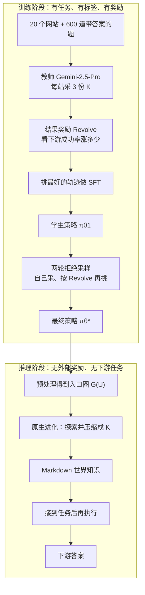
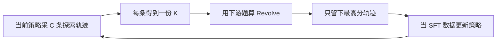

# Reward-Free：零掉的是推理时的外部奖励，不是训练老师；先画地图再做题

<!-- release-date: 2026-04-20 -->

> 本文依据腾讯与香港科技大学（广州）联合发布的 **Training LLM Agents for Spontaneous, Reward-Free Self-Evolution via World Knowledge Exploration**，即 arXiv:2604.18131v1、封面日期 April 21, 2026、共 24 页的版本。页码均指 PDF 本身的页码。v1 于 2026-04-20 首次公开，本文 `release-date` 取这一天，不用 PDF 页眉的 April 21 回写。截至 2026-09-10 核验，arXiv 当前仍只有 v1，与本地原件一致。文中会明确区分「论文写了什么」「本文如何解释它」「哪些是外部资料补充」。
>
> 第一作者单位是腾讯与港科大（广州）；通讯作者与项目负责人为腾讯的 Yan Wang。本站按主要归属放在 Tencent 目录。

## 读之前需要的最少背景

这篇论文只讲一件事：今天所谓「自进化 agent」，大多还在等人给任务、给奖励、给工作流。作者想训出一种能力——进一个没见过的环境，先自己把环境摸清楚，再去做题。

先把六个会反复出现的词说成人话。

- **世界知识（World Knowledge，$K$）**：一份针对**某一个具体环境实例**写的 Markdown 地图。不是「万维网常识」，也不是可复用的技能包。例子是 ACL 2024 官网、某个游戏站、某个代码仓。论文把它塞进 agent 的上下文，当外部模块用（PDF p. 3）。
- **原生进化 / 元进化（Native Evolution / meta-evolution）**：进环境之后、接到任务之前，自己探索并压缩成 $K$ 的那一段能力。论文把「会不会自己先画地图」叫做元能力，把画完地图再做题叫做知识增强执行（PDF p. 3–4）。
- **结果奖励（outcome-based reward）**：不看探索轨迹写得漂不漂亮，只看这份 $K$ 让下游任务成功率涨了多少。公式在 3.1 节。**这条奖励只在训练时用。**
- **监督微调（Supervised Fine-Tuning，SFT）**：先让更强的教师模型 Gemini-2.5-Pro 走完整条探索轨迹，再让学生模仿最好的那条（PDF p. 5）。
- **基于拒绝采样的强化学习微调（Reinforcement-based Rejection Sampling，RFT）**：学生自己采若干条候选 $K$，用结果奖励挑最好的，再拿这些轨迹做下一轮微调。论文同时把它叫做 Rejection Sampling Fine-Tuning。这里的 RFT **不是** 在线 GRPO，也不是别家产品里的 Reinforcement Fine-Tuning（PDF p. 5–6）。
- **环境入口图 $G(U)$**：把网站先爬成有向图、打重要性分、再按 URL 前缀聚类，得到的结构化入口。推理时 agent 拿到的不是光秃秃的首页 URL，而是这份处理好的图（PDF p. 7，附录 A）。

跨篇只留对照，避免把别的文章再讲一遍：

- [Absolute-Zero](/reports/Tsinghua/Absolute-Zero) 零掉的是**后训练题库**，留下代码执行器当老师。本篇零掉的是**推理时的外部奖励**，训练阶段题库、教师和结果奖励都还在。
- [R-Zero](/reports/Tencent/R-Zero)（challenger / solver 共进化）和 [Dr. Zero](/reports/Meta/Dr-Zero)（搜索环境）被本篇 Related Work 归进「对抗式进化」：任务和奖励可以让 agent 自己产，但流水线仍要人搭（PDF p. 3，参考文献 [31]、[34]）。
- [AIDE2](/reports/Weco/AIDE2) 改的是包在模型外面的 harness。本篇几乎不改脚手架，改的是「进环境先写一份地图」这件事。
- [SEAL](/reports/MIT/SEAL) 与 [Self-Rewarding-LM](/reports/Meta/Self-Rewarding-LM) 改的是**权重怎么自己更新**。本篇训练时改权重，推理时**不**做梯度更新，只把 $K$ 塞进 prompt。论文自己拿 Test-Time Training 作对照（PDF p. 3）。

## 一句话先说清

标题写 Reward-Free。真正零掉的，是 **推理时** 的外部奖励、人工任务和逐步工作流。

训练阶段不但有奖励，而且奖励很贵：20 个网站、600 道带标准答案的深搜题，拿下游成功率的增量当 $K$ 的分数（PDF p. 4）。教师是 Gemini-2.5-Pro。学生先模仿教师轨迹，再自己采轨迹、按这个分数挑最好的，做两轮拒绝采样（PDF p. 5–6）。

训完之后，agent 进一个没见过的网站，会自己先探索、压缩成 Markdown 地图，再拿这张地图去做题。Qwen3-30B-A3B 在 WebWalker 子集上从 22.04 到 40.91，Seed-OSS-36B 从 16.26 到 37.50（PDF p. 7，Table 1）。论文把这类涨幅约成约 20 个绝对百分点。更刺眼的一句是：把这份 $K$ 转给没受过这套训练的 Qwen3-14B，它在 Conference / Game 两个域上能超过「没有 $K$ 的 Gemini-2.5-Flash」（PDF p. 8，Figure 3）。

这句话听起来像「完全不需要人」。论文自己没有这么写。预训练权重、教师模型、600 道训练题、网站聚类图、Cognitive Kernel-Pro 脚手架、以及推理时那份较短的生成 prompt，全都还在。后文会把这条边界单独摊开。

先看它最终怎么转：

这是机制示意图，不是实测时间轴，根据 PDF p. 2 的 Figure 1、p. 4 的 Figure 2、p. 5 的式 1–3 与 p. 7 的实现细节重画。

## 「零奖励」具体零掉哪一层

这是全文最容易被标题带着跑的地方。先把三层拆开。

| 层 | 论文实际做了什么 | 还留下什么 |
|---|---|---|
| 训练时的奖励 | **有。** $R_{\mathrm{evolve}}(K)$ 等于「带着 $K$ 做题」减「不带 $K$ 做题」（PDF p. 4，式 1） | 600 道金标题、教师模型、下游执行 agent |
| 推理时的外部奖励 | **无。** 进新环境时不再算 $R_{\mathrm{evolve}}$，也不再给验证过的任务集（PDF p. 5） | 入口图 $G(U)$、生成 prompt、token 预算、脚手架 |
| 推理时的人类指令 | 论文说「不需要人类指令」（PDF p. 1）。SFT 的目标是让模型少依赖密集 prompt（PDF p. 5） | 附录 C.2 仍给了训练后 agent 一份完整生成说明，含工具、分模式、token 上下限（PDF p. 21–22） |

所以 Reward-Free 的精确读法是：

> **把「这份地图好不好」的监督，全部提前折进训练；推理时只跑已经内化的探索策略，不再现场打分。**

它不是「整个生命周期都没有奖励」。更不是「没有人」。Absolute Zero 那边，人从后训练题库里退场，代码执行器还在当场批改；这边，人从推理时的打分里退场，训练时的打分和推理时的地图格式都还在。

本文的判断是：这个切分本身有工程价值——探索轨迹长达数百步，当场用 GRPO 回传确实贵（PDF p. 5）。但把「推理时不打分」写成「真正的自发自进化」，会把入口图、教师、题库这些仍在的部分一起洗掉。

## 旧方法卡在哪：自进化其实还在等人发课本

论文开篇第一句就很冲：当前关于自进化 agent 的研究，很大程度上是一种幻觉（PDF p. 1）。去掉外部奖励或指令，进化就停。

它把已有做法收成两类，再把自己放在第三类（PDF p. 2，Figure 1）：

| 范式 | 人还要提供什么 | 模型自己干什么 | 论文的批评 |
|---|---|---|---|
| 经验驱动进化 | 任务、奖励函数，外加更新机制（改系统提示、扩记忆、扩技能库、或直接微调） | 反复做这些题，把轨迹—分数对当成经验 | 人在编课本，agent 在背课本 |
| 对抗式进化 | challenger / solver 的合作流水线 | 一方出更难的题，一方把题做出来 | 人从出题挪到了搭工作流；agent 仍困在习题册里 |
| 元学习驱动进化（本文） | 训练阶段的教师、题库和结果奖励；推理阶段尽量少 | 先探索环境、压成世界知识，再去做后来才出现的任务 | 声称推理时任务无关、奖励无关、工作流无关 |

中间那一类里，论文点名的工作包括 R-Zero 与 Dr. Zero（PDF p. 12，[31]、[34]）。本站已有 [R-Zero](/reports/Tencent/R-Zero) 与 [Dr. Zero](/reports/Meta/Dr-Zero)。这里只记本篇的归类：它们把任务和奖励交给 agent 互相对抗，但对抗本身仍是人搭好的游戏。

和人进一座新城市、打开一套新软件作对照，是论文自己的动机，不是实验能证明的事（PDF p. 1）。本文把它收窄成一个更可检验的工程问题：

**下游任务还没出现时，训练信号从哪来？** 进化阶段本身是无任务的，不能靠即时金标。这才是 3.1 节要解决的矛盾（PDF p. 4）。

Related Work 里还有一条对照，后文会用到：Test-Time Training 在推理时做梯度更新，和主流高吞吐推理框架不兼容；本篇把观察蒸馏成 $K$，当上下文模块喂进去，推理时不改权重（PDF p. 3）。

## 生命周期拆成两段：先画地图，再做题

论文认为 LLM agent 的根本限制是反应式：先等任务，再开始和环境互动。标准策略写成 $a\sim\pi(a\mid o,\mathrm{Task})$，每个动作都条件于当前观察和预先给定的目标（PDF p. 3）。

它要的是：任务还不存在时，也能主动理解新环境。于是生命周期被拆成两段（PDF p. 3）：

1. **原生进化。** 进入环境 $E$ 后，自发探索并总结：$K\leftarrow\pi_{\mathrm{evolve}}(K\mid E)$。论文写明，这一段在推理时是 task-free 且 reward-free 的。
2. **知识增强执行。** 下游任务出现后，用 $K$ 指导动作：$a_t\sim\pi_{\mathrm{task}}(a_t\mid o_t,K,\mathrm{Task})$。

$K$ 被实现成 Markdown 文档，以便塞进现有 agent 架构。脚注指向 Anthropic 的 skills 仓库。论文立刻划清边界：skill 通常提供任务特定功能，例如 webapp-testing；世界知识捕获的是**某个环境实例的内在逻辑**（PDF p. 3）。

本文的读法：这是一次接口选择，不是一次世界模型突破。$K$ 没有动力学、没有可查询的状态机，就是一份按栏目组织的导览。好处是现有 agent 不用改动作空间就能用；代价是它的上限受上下文长度和摘要质量同时卡住——RQ4 后面会看到，写太长会掉点。

Figure 2 把实现画成三列（PDF p. 4）。左边数据生成在概念上写了 Web / Code / Game，中间是 SFT 再接 RFT，右边是推理时先进化再执行。**主实验只做了网页。** Code 和 Game 出现在总图里，没有对应的表。

元能力被拆成两块（PDF p. 4）：

- **规划与探索**：先做有目标的计划，优先走环境里高价值的区域。
- **信息管理**：把大量异质观察压成信息密度高的 $K$。

原则被说成领域无关，落地却选了 web agent，理由是网页非结构、动态，足够当试验台（PDF p. 4）。标准 LLM 被训成反应式指令跟随，没有「为了知识本身去探索」的本能——所以必须另做一套训练。

## 核心设计一：结果奖励——地图好不好，看它能不能帮你做题

### 旧问题

进化阶段没有任务，就没有逐步金标。如果对人写的摘要打分，又会把监督搬回人类偏好。论文要的训练信号是：**这份 $K$ 有没有用。**

### 新设计

对一个环境 $E$，先准备下游任务集 $T_E$。一份生成出来的 $K$ 的奖励，是它带来的潜在成功增益（PDF p. 4，式 1）：

$$
R_{\mathrm{evolve}}(K)=\mathrm{Success}(T_E\mid K)-\mathrm{Success}(T_E\mid\varnothing)
$$

$\mathrm{Success}(T_E\mid K)$ 是带着 $K$ 的表现，$\mathrm{Success}(T_E\mid\varnothing)$ 是不带先验知识的基线。实践里，一个网站有 $M$ 道带答案的题 $\{(Q_j,A_j)\}_{j=1}^{M}$，成功率就是命中率（PDF p. 5，式 2）：

$$
\mathrm{Success}(T_E\mid K)=\frac{1}{M}\sum_{j=1}^{M}\bigl[f(Q_j,K)=A_j\bigr]
$$

$f(Q_j,K)$ 是 agent 在给定 $K$ 时对问题 $Q_j$ 的预测答案。训练数据是 20 个网站上的 600 道深搜题，用这些金标去算成功率（PDF p. 4）。

### 机制

这条奖励有三个值得记住的性质。

第一，它是**延迟的、轨迹级的**。探索可能走几百步，分数要等 $K$ 写完、再拿去跑一组下游题才出现。论文后来说，这正是没法直接上在线 GRPO 的原因之一（PDF p. 5）。

第二，它是**相对量**。减掉无 $K$ 基线，是在问「这张地图值不值得」，不是在问「这个 agent 本身有多强」。同一份 $K$，换一个更弱的执行模型，分数会变——RQ2 后面证明 $K$ 可以迁移，但式 1 的数值本身绑定了当时那个 $f$。

第三，它**只在训练时出现**。论文把「从有奖励的训练，走到无奖励的推理」写成真正 Native Evolution 的标志（PDF p. 5）。

### 收益

有了这个信号，SFT 可以在三条教师轨迹里挑最有用的那条，RFT 可以在学生自己采的候选里再挑。教师生成的 $K^\ast$ 相对零知识基线，给 Qwen3-30B-A3B 带来平均 10.72 个绝对百分点的训练任务准确率提升（PDF p. 5）。

### 代价与边界

- 算一次 $R_{\mathrm{evolve}}$，等于让辅助 agent 把该网站的下游题跑一遍。论文自己说，这让训练循环里的实时奖励计算不现实（PDF p. 5）。
- 训练任务集是有标签的。推理时的「无任务」成立，是因为这些标签被提前用掉了，不是因为系统从来就不需要题。
- 式 2 把 $f(Q_j,K)=A_j$ 写成指示函数。主评测却用 LLM judge 做语义等价判定（PDF p. 6–7）。训练奖励的判分口径，和 Table 1 的评测口径，论文没有证明是同一套。
- SFT 筛选时，明确用 Qwen3-30B-A3B 当评估 $K$ 效用的基线 agent（PDF p. 5）。RFT 阶段只写用 $R_{\mathrm{evolve}}$，没有再指定评估 agent 是谁。Seed-OSS-36B 的轨迹是不是也用 Qwen 来打分，PDF 没有写。

### 可迁移启发

「过程没金标时，用下游效用当过程的分数」是一套很干净的元学习模板。写工具文档、写代码库索引、写内部 wiki 导览，都可以问同一句：这份摘要让一个固定执行器在一组真题上多对多少。代价也一起迁移——你必须先有一组真题，才能训出「以后不看真题也能写摘要」的策略。

## 核心设计二：SFT——先让教师把「乱逛」变成可模仿的本能

### 旧问题

基座模型能执行复杂探索指令，但缺把高价值信息压出来的内在能力。RQ1 里有直接证据：同一份专家 prompt，未训练基座自己写的 $K$，在 WebWalker 上反而低于完全不写 $K$ 的基线（19.50 对 22.04，PDF p. 8）。探索本身可以变成噪声。

### 新设计

用 Gemini-2.5-Pro 当教师 $\pi_T$，让它在多样网页环境里互动、自主构造结构化 $K$。每个环境实例采 3 个候选 $\{K_i\}_{i=1}^{3}$，用 3.1 节的奖励挑最好的 $K^\ast$，连同完整探索轨迹一起留下（PDF p. 5，式 3）：

$$
T^\ast=\{Q,o_1^\ast,a_1^\ast,o_2^\ast,a_2^\ast,\ldots,o_k^\ast,a_k^\ast\}
$$

对学生 $\pi_{\theta_0}$ 做逐步模仿，得到 $\pi_{\theta_1}$。

### 机制

教师不是自由发挥。附录 C.1 给它的是一份很长的三相工作流（PDF p. 18–21）：

- **Phase 0**：读聚类统计，按类目 URL 数比例分配 token 预算，写入 plan 文件。
- **Phase 1**：逐类目处理。强制先读预算，再按结构分加语义相关性挑选页面、抓取、按模板写入 guidebook，最后 `mark_category_done()`。
- **Phase 2**：超上限就压缩，低于下限就回去再刮页面扩充，最后加 Overview 并保存。

约束包括：只记录本域页面、必须摘要不能原文粘贴、每条 Scraped Pages 必须带完整 URL、按计划花钱不要均分。URL 优先级结合聚类文件里的 `[score:S]` 与页面内容（PDF p. 18）。

SFT 的目标，论文写得很明确：让模型在推理时**不必再依赖密集 prompt** 也能执行这些复杂动作（PDF p. 5）。

教师轨迹的体量：平均 374.8 步，每步 3322.4 个 token（观察加动作）（PDF p. 5）。这是「本能」的密度，不是几句 chain-of-thought。

### 收益

SFT 之后，两个骨干在 WebWalker 上都已经大幅离开 Without 基线：Qwen 从 22.04 到 38.17，Seed 从 16.26 到 28.57（PDF p. 7，Table 1）。Figure 4 里，SFT 这一跳在四个域上都很陡（PDF p. 9）。

### 代价与边界

- 教师工作流非常重。论文批评别人依赖人类工作流，自己把工作流写进了教师 prompt，再蒸馏进学生权重。这是合法的训练技巧，但「workflow-free」只对训完后的推理成立。
- 3 个候选、用 Qwen3-30B-A3B 的下游增益来挑，意味着 SFT 数据的「好」是相对于这个执行器定义的。
- 论文没有给 SFT 的学习率、epoch、上下文截断、是否只训动作 token。轨迹那么长，工程上怎么切，PDF 是空的。

### 可迁移启发

当目标行为本身是「长程、稀疏、靠结果才知道好坏」时，先用强模型加可执行清单把行为采出来，再让学生模仿最好的那条，仍然是最稳的冷启动。关键不在「有没有 SFT」，而在筛选标准是不是下游效用。若只用格式分或教师自洽分，RQ1 里 Prompt-only (Base) 那种「越探索越吵」就会重现。

## 核心设计三：RFT——轨迹太长、奖励太贵，所以不上在线 GRPO

### 旧问题

SFT 只能模仿教师已经走过的路。论文还想让学生自己试错，长出更复杂的探索和信息管理策略（PDF p. 5）。标准在线 RL、例如 GRPO，在这个设定里算不动，原因有两条（PDF p. 5）：

1. **地平线极长。** 生成一份 $K$ 要几百步，奖励稀疏，反向传播的显存开销巨大。
2. **奖励评估太重。** 评估一份 $K$，要让辅助 agent 跑一组下游题。训练循环里实时算分不现实。

GRPO 的组内归一化、裁剪和 token 级 loss，本站 [DAPO](/reports/ByteDance/DAPO) 篇讲过。这里用不到那些细节：本篇根本没有跑 GRPO。

### 新设计

拒绝采样微调。生成和更新解耦：$\pi_{\theta_1}$ 自己对环境实例探索，产出 $C$ 个候选 $K$，用 $R_{\mathrm{evolve}}$ 打分，留下分数最高、也就是元进化效用最强的轨迹，作为下一轮训练集（PDF p. 6）。这个过程做两轮，最终策略记为 $\pi_{\theta}^\ast$。

### 机制

它和「在线 RL」的差别，用动作顺序看更清楚：

根据 PDF p. 6 的 3.3 节重画。循环只走两轮。

这其实是「多采样 + 过滤 + 再模仿」，不是带 advantage 的策略梯度。论文仍把它放在 reinforcement 名下，因为它用试错和结果奖励来选数据。本文把它读成 **离线的、轨迹级的拒绝采样**，避免和 GRPO / PPO 混成同一种算法。

### 收益

Table 1 里，RFT 相对 SFT 的方向大体向上，但不是每一格都涨（PDF p. 7）：

- Qwen 的 WebWalker 平均：38.17 → 40.91；WebVoyager 平均：51.50 → 57.44。
- Seed 的 WebWalker 平均：28.57 → 37.50；WebVoyager 平均：56.00 → 56.79。
- Qwen 在 Conference 上，SFT 的 45.05 高于 RFT 的 43.14。RFT 不是单调改进器。

论文据此说，结果奖励提供了正确的训练信号，使学生能 refinement 探索策略并最终超过教师（PDF p. 8）。Qwen 在 WebWalker 上确实超过了 Prompt-only (Gemini) 的 29.85；Seed 在 WebWalker 上也超过了 31.33。WebVoyager 上 Seed 的 RFT 平均 56.79，和教师 prompt 的 56.82 基本持平，教师略高。

### 代价与边界

- **$C$ 没有给数字。** SFT 阶段教师采 3 条；RFT 的 $C$ 只作为符号出现（PDF p. 6）。
- 两轮之后 Figure 4 出现边际收益甚至回落，尤其 Qwen 的 Education 从 rft1 的高点落到 rft2（PDF p. 9，图读数，正文只说 slight fluctuations）。
- 没有 KL、没有组内基线、没有把没选中的轨迹当负样本。选出的是「当前策略能采到的最好」，不是「相对差轨迹的优势」。
- 仍然完全依赖那 600 道训练题来打 $R_{\mathrm{evolve}}$。RFT 没有把题库也零掉。

### 可迁移启发

长程 agent 训练里，若单条轨迹已经是几百步、奖励还要另开一条评测流水线，先不要默认上 on-policy GRPO。拒绝采样把「采样」和「更新」拆开，用更贵的评测换更少的反向传播，往往更先能跑起来。它换来的是：你对 $C$、筛选阈值和迭代次数几乎没有理论指导，只能看第二轮还涨不涨。

## 核心设计四：入口图 $G(U)$——「自发探索」并不是从裸 URL 起步

### 旧问题

子页面很多的网站，直接丢首页 URL、允许无约束探索，会跑很久、输出不稳定（PDF p. 7）。

### 新设计

先把网站预处理成更可导航的形式，再交给原生进化（PDF p. 7）：

1. 网站建成有向图，按链接拓扑给每个页面打重要性分。
2. 按共享 URL 前缀聚类。
3. 得到聚类后的图表示 $G(U)$，**用它替换原始首页，作为环境 $E$ 的结构化入口**。

附录 A 把重要性写成入度、出度的线性组合（PDF p. 14）：

$$
\mathrm{Importance}(v)=0.7\cdot d_{\mathrm{in}}(v)+0.3\cdot d_{\mathrm{out}}(v)
$$

聚类从第一段 path 开始递归切分，直到每组满足一个规模约束。**这个规模约束的具体数字，PDF 没有给。**

附录 B.1 是 SIGCHI 官网的处理后输入：5 个簇、221 个 URL，簇大小为 $[40,10,130,21,20]$；`https://sigchi.org/conferences/upcoming` 的 score 为 227，事件簇里大量页面只有 11 分（PDF p. 14–15）。B.2 是 ACL 2024 的世界知识样例：2 个类目、分析了 31 页，条目里是日期、场馆、注册截止日这类可执行事实，不是页面原文（PDF p. 15–18）。

### 机制

推理时的「自发」，发生在 $G(U)$ 已经把噪声滤掉、把大站切成可解释簇之后。教师和训练后 agent 的 prompt 都假设输入是这份聚类文件，而不是首页 HTML（PDF p. 18、p. 21）。训练后 prompt 还按站点规模分模式：$\le 250$ 个 URL 走 FULL，每条都收录；更大则 SELECTIVE，每类最多 20 或 10 条（PDF p. 22）。

### 收益

这是让长程探索稳下来的工程前置。没有它，论文自己都认为输出会不稳。RQ1 的步数下降、RQ4 的长度效应，都建立在「agent 面对的是已经聚类打分的入口」这个前提上。

### 代价与边界

这一步把相当一部分「探索」从模型挪回了确定性脚本。入度 0.7、出度 0.3 是启发式，不是学出来的。聚类按 URL 前缀，对不按路径组织的站点会切错。更关键的是：Figure 1 右侧把 Human Dependency 画得很短，但 $G(U)$ 的爬取、打分、聚类在推理时仍然在。本文把它视为**推理阶段仍在的系统脚手架**，不是模型内化的元能力。

### 可迁移启发

想让模型「自己探索」一个大环境，先问：模型是不是在一个已经被切成目录的空间里走。代码仓的目录树、文档站的 sidebar、API 的 tag 分组，都是 $G(U)$ 的亲戚。把目录建设算进系统成本，再谈模型有多自发，数字才可比。

## 实验怎么证明

### 设置：网页脚手架、两个骨干、过滤后的 1427 题

实验框架是 Cognitive Kernel-Pro，交互环境用 Playwright。动作空间是预定义网页操作：`click`、`scroll`、`goto`、`goback`、`stop`。每步观察是当前可见组件的 accessibility tree。轨迹在三种情况下结束：agent 自己判定完成、步数到上限 $t$、或墙钟超过 $L$ 秒（PDF p. 6）。

两套预算差一个数量级：

| 阶段 | 步数上限 $t$ | 时间上限 $L$ |
|---|---:|---:|
| 生成世界知识 | 500 | 43200 秒（12 小时） |
| 下游答题 | 100 | 3600 秒（1 小时） |

骨干是 Qwen3-30B-A3B-Instruct-2507 与 Seed-OSS-36B-Instruct。生成 $K$ 时 temperature / top-p 为 0.3 / 0.95，为了候选更多样；下游答题时为 0 / 0.95，为了更稳（PDF p. 6）。

评测构造子集，不跑完整官方集。WebWalker 四个域——conference、game、organization、education——每域随机十个网站。WebVoyager 只用四个站：Wolfram、Apple、Dictionary、Coursera。两边都滤掉骨干预训练知识就能直接答的题，最后 1427 条。指标一律是准确率（PDF p. 6）。

判分是 LLM judge，而且两套基准用了不同模型（PDF p. 6–7）：

- WebWalker：Qwen-2.5-32B，看最终答案与金标是否语义一致，输出 0 或 1。附录 C.3 明确写：不必字面匹配，短答案、不同日期格式、同义转述都可以判 1（PDF p. 22–23）。
- WebVoyager：Gemini-2.5-Flash，吃问题、agent 答案、以及每步的 accessibility tree，判 SUCCESS 或 NOT SUCCESS。官方协议。C.4 有一条容易打架的规则：答案与 tree 矛盾时信 tree；答案里有 tree 没有的信息时信答案（PDF p. 23–24）。

没有人类复判、没有 judge 一致性数字、没有报告这 1427 条在两套基准上各占多少。WebVoyager 的 judge 和教师模型是同一个 Gemini 家族，Flash 对 Pro 写的 $K$ 会不会更友好，PDF 没有讨论。

### RQ1：会不会涨分、会不会少走步

五种配置（PDF p. 7–8）：

1. **Without**：骨干直接答题，不探索环境。
2. **Prompt-only (Gemini)**：用附录 C 的专家 prompt，让 Gemini-2.5-Pro 写 $K$。
3. **Prompt-only (Base)**：未训练基座，同一份专家 prompt 自己写 $K$。
4. **Ours (SFT)** / **Ours (RFT)**：训练后的 agent 自己写 $K$，再给自己用。

主结果如下，数字来自 PDF p. 7，Table 1。加粗是该骨干设定下的最高分，按论文原表。

**骨干：Qwen3-30B-A3B-Instruct-2507**

| 方法 | Conf. | Game | Org. | Edu. | Walker 平均 | Wolfram | Apple | Dict. | Coursera | Voyager 平均 |
|---|---:|---:|---:|---:|---:|---:|---:|---:|---:|---:|
| Without | 24.28 | 23.65 | 22.30 | 17.93 | 22.04 | 54.30 | 37.20 | 41.86 | 30.95 | 41.08 |
| Prompt-only (Gemini) | 35.59 | 27.87 | 31.36 | 24.56 | 29.85 | **73.90** | **53.40** | 51.16 | 45.23 | 55.92 |
| Prompt-only (Base) | 21.37 | 20.91 | 17.42 | 18.29 | 19.50 | 54.30 | 32.56 | 42.85 | 33.33 | 40.76 |
| Ours (SFT) | **45.05** | 37.35 | 37.98 | 32.31 | 38.17 | 60.87 | 41.86 | 62.79 | 40.48 | 51.50 |
| Ours (RFT) | 43.14 | **42.47** | **42.16** | **35.86** | **40.91** | 58.70 | 48.84 | **67.44** | **54.76** | **57.44** |

**骨干：Seed-OSS-36B-Instruct**

| 方法 | Conf. | Game | Org. | Edu. | Walker 平均 | Wolfram | Apple | Dict. | Coursera | Voyager 平均 |
|---|---:|---:|---:|---:|---:|---:|---:|---:|---:|---:|
| Without | 19.37 | 10.75 | 21.80 | 13.11 | 16.26 | 54.30 | 48.84 | 23.26 | 33.33 | 39.93 |
| Prompt-only (Gemini) | **53.50** | 24.37 | 23.96 | 23.48 | 31.33 | 58.60 | 53.49 | **62.79** | 52.38 | **56.82** |
| Prompt-only (Base) | 20.51 | 12.20 | 17.42 | 16.46 | 16.65 | 47.82 | 46.34 | 30.23 | 22.50 | 36.72 |
| Ours (SFT) | 35.48 | 24.10 | 26.80 | 27.90 | 28.57 | **71.73** | 51.16 | 53.49 | 47.61 | 56.00 |
| Ours (RFT) | 45.07 | **34.29** | **38.41** | **32.22** | **37.50** | 63.04 | **55.81** | 51.16 | **57.14** | 56.79 |

先算论文口里的「约 20%」。相对 Without：

| 骨干 | WebWalker 绝对增益 | WebVoyager 绝对增益 |
|---|---:|---:|
| Qwen3-30B-A3B | 40.91 − 22.04 = 18.87 | 57.44 − 41.08 = 16.36 |
| Seed-OSS-36B | 37.50 − 16.26 = 21.24 | 56.79 − 39.93 = 16.86 |

WebWalker 两侧平均约 20.1 个点，和摘要、结论里的 20% 对得上；WebVoyager 两侧平均约 16.6 个点，更接近「十几个点」。正文 RQ1 写 Qwen 在 WebWalker 上「nearly 19% absolute」（PDF p. 8），这一句是表内可核对的。把 WebVoyager 也说成 20%，是四舍五入，不是每一列都涨了 20。

三件被实验支持的事：

1. **未训练的探索会变成负债。** Qwen 的 Prompt-only (Base) 在 WebWalker 上低于 Without。论文的解释是：基座能跟着复杂指令走，但压不出高价值信息，噪声和幻觉会在执行时把 agent 带偏（PDF p. 8）。
2. **训过的 $K$ 把负债变成资产。** Qwen RFT 的 WebWalker 40.91 超过教师 prompt 的 29.85。这是「学生超过教师」最硬的一格。
3. **教师 prompt 并没有在所有格子上被超过。** Qwen 的 Wolfram / Apple、Seed 的 Conference / Dictionary / Voyager 平均，仍是 Gemini 写的 $K$ 更高。RFT 赢的是「自己写 $K$、自己用」这条闭环，不是「任何时候都比 Gemini 会写地图」。

效率单独一张表，只报了 Qwen3-30B 在 WebWalker 四域上的平均执行步数（PDF p. 8，Table 2）：

| | Conference | Game | Organization | Education | 平均 |
|---|---:|---:|---:|---:|---:|
| Qwen3-30B | 25.65 | 23.26 | 17.96 | 30.25 | 24.28 |
| Qwen3-30B with $K$ | 20.64 | 20.31 | 13.92 | 25.34 | 20.05 |
| Improve Ratio | 0.20 | 0.13 | 0.22 | 0.16 | 0.17 |

平均少走 17% 的步。论文把 $K$ 说成环境的认知地图，提供结构先验，让 agent 少从首页盲走（PDF p. 8）。Seed 的步数、生成 $K$ 本身花了多少步，表里都没有。生成阶段 $t=500$，答题阶段 $t=100$，省下的是**答题**的步，不是系统总步数。

### RQ2：$K$ 能不能借给没训过的模型

论文把 $K$ 说成模型无关的通用协议，测了 Qwen3-14B、GPT-OSS-120B、Kimi-K2-Turbo、Gemini-2.5-Flash，并在后两家旁边画了更强的无 $K$ 对照：Kimi-K2.5 与 Gemini-2.5-Pro（PDF p. 8，Figure 3）。图上只有 Conference 与 Game 两个域。下面数字是本文按 Figure 3 柱上标注读出的，论文正文只点了其中几格。

| 执行模型 | 域 | Without | 用 Qwen3-30B 的 $K$ | 用 Seed-36B 的 $K$ | 更强对照（无 $K$） |
|---|---|---:|---:|---:|---:|
| Qwen3-14B | Conference | 17.5 | 31.8 | 35.6 | — |
| Qwen3-14B | Game | 11.8 | 24.4 | 30.5 | — |
| GPT-OSS-120B | Conference | 29.8 | 33.5 | 30.5 | — |
| GPT-OSS-120B | Game | 21.8 | 43.9 | 43.8 | — |
| Kimi-K2-Turbo | Conference | 34.2 | 46.1 | 56.4 | K2.5：39.9 |
| Kimi-K2-Turbo | Game | 23.3 | 42.9 | 38.3 | K2.5：32.3 |
| Gemini-2.5-Flash | Conference | 31.3 | 35.6 | 51.9 | Pro：40.2 |
| Gemini-2.5-Flash | Game | 25.7 | 26.1 | 30.0 | Pro：32.4 |

论文自己强调的两句（PDF p. 8）：

1. Seed-36B 的知识让 Qwen3-14B 在两个域上平均准确率提高 18.3%。按上表，$(35.6-17.5)$ 与 $(30.5-11.8)$ 再平均，约 18.4，对得上。
2. 带世界知识的 14B Qwen3，超过无辅助的 Gemini-2.5-Flash：Conference 35.6 对 31.3，Game 30.5 对 25.7。这一句也对数。

同一段里还有「Kimi-K2-Turbo 提升 21.0%」。若只用 Seed-36B 的 $K$，两个域平均增益约 18.6 个点，不是 21.0。若每个域取涨得最多的那份 $K$（Conference 用 Seed 的 +22.2，Game 用 Qwen 的 +19.6），平均约 20.9。**论文没有写 21.0 的算法。** 本文按图核对后，只把 18.3 和 14B 超过 Flash 当作对得上的数字；21.0 保留为作者陈述。

「更弱的模型加上 $K$，可以超过更强模型的无 $K$ 基线」也要按域看：Kimi-K2-Turbo 在两个域上都能超过无 $K$ 的 K2.5；Gemini-2.5-Flash 加 Seed 的 $K$ 在 Conference 上超过 Pro（51.9 对 40.2），在 Game 上没有（30.0 对 32.4）。论文写 can even surpass，不是「两个域、两家都超过」。

GPT-OSS-120B 的 Conference 几乎不吃 $K$（29.8 → 33.5 / 30.5），Game 却从 21.8 跳到约 44。迁移不是均匀的。论文没有解释这一格。

作者把这些结果升格成：通往前沿表现的路，不只是放大参数，而是放大在未见环境里主动探索和学习的能力（PDF p. 9）。表支持的是更窄的一句：**在这些网页深搜题上，一份写得好的环境地图，经常比换一个更大的执行模型更值钱。** 「探索能力的 scaling」没有单独的 scaling 曲线。

### RQ3：SFT 和第一轮 RFT 扛了大部分

Figure 4 画四条训练阶段：base、sft、rft1、rft2，两个骨干、WebWalker 四域（PDF p. 9）。正文结论：整体向上；SFT 和 rft1 贡献大头，rft2 多为边际或轻微波动。

Table 1 的 Ours (RFT) 对应最终的 rft2。rft1 没有进表。本文按图读出的形状，和表是对齐的：

- Qwen 的 Conference：SFT 已经到顶（表内 45.05），rft2 回到 43.14。
- Qwen 的 Education：图上 rft1 高于 rft2（表内 rft2 为 35.86），是最清楚的回落。
- Seed 的 WebWalker 四域：SFT 到 rft2 仍在爬，Game / Organization 的第二跳尤其明显（表内 Game 24.10 → 34.29）。

所以「两轮 RFT」作为最终配方写进结论，并不等于第二轮普遍有用。它更像是：第一轮拒绝采样还在纠正 SFT 模仿来的路径，第二轮开始吃噪声。

### RQ4：地图不是越长越好

在 prompt 里显式规定生成 token 的上下界，测 Qwen3-30B-A3B 五个长度：0（无 $K$）、4k–8k、8k–16k、16k–32k、32k–64k（PDF p. 9）。Figure 5 柱上的数字，正文也写了，不必再估：

| 长度设置 | Conference | Game |
|---|---:|---:|
| 0 | 24.28 | 23.65 |
| 4k–8k | 40.55 | 30.74 |
| 8k–16k | 49.85 | 39.71 |
| 16k–32k | 48.05 | 41.56 |
| 32k–64k | 51.96 | 40.72 |

短变中，收益大：Game 从 30.74 到 39.71。再拉长就平台化；Game 从 16k–32k 到 32k–64k 还略降到 40.72。论文的归因是：太短会丢关键信息，中等长度能包住要点，过长会引入冗余噪声、干扰执行（PDF p. 9）。

这一节和 $G(U)$、C.1 / C.2 里的 token 预算是同一件事：世界知识被当成必须管理的上下文配额，不是越详细越好的知识库。Conference 在 32k–64k 仍略涨到 51.96，说明「过长有害」不是两个域都成立，论文举的反例主要是 Game。

主实验实际用了哪个长度区间，RQ1 没有写。RQ4 是敏感性扫描，不能把 51.96 读回 Table 1 的 43.14。

### Case：ACL 2024 的两个日期

Figure 6 的题：ACL 2024 上，Printing Order Service 注册截止日，和主会场馆更新公告之间隔多少天。网站写的是 `https://acl.2024.org/`（PDF p. 10）。

| | 无世界知识 | 有世界知识 |
|---|---|---|
| 第 1 步 | 从首页开始找注册截止日 | 直接从 $K$ 读到印刷服务截止日是 2024-08-09；场馆页有 Centara Grand，但没有公告日期，转去相关页面 |
| 中间 | 第 4 步找到截止日 2024-08-09 | — |
| 收尾 | 第 7 步用「ACL 场馆公告通常提前 3 到 6 个月」的历史模式，把最早可能公告日估成 2024-02-01，算出 190 天 | 第 2 步找到场馆更新公告日 2024-05-05，间隔 96 天 |
| 对错 / 步数 | 错，7 步 | 对，2 步 |

正确信息在图里标绿，错误标红（PDF p. 10）。它说明两件事：地图能把「从哪一页找」变成先验；地图缺的字段，agent 仍会去现场补，而不是幻觉填完——左边那条 190 天，才是用历史模式硬编。

附录 B.2 的 ACL 2024 guidebook 里，Printing Service 条写的早期截止是 August 5、常规截止 August 9，Venue 条没有公告日期（PDF p. 16–17）。和 case 的行为一致：$K$ 是索引加摘要，不是封闭世界。

附录 C.5 是执行阶段怎么用 $K$ 的决策提示（PDF p. 24）：摘要里已经有事实就直接答（少见）；相关子页就去那些 URL，仍不自信或找不着就回首页重走；摘要全无关则整支作废、从首页重来。Figure 6 的右侧走的是第二条。这份 prompt 也说明：知识增强执行并不是把 $K$ 当唯一证据。

## 结论写了什么，以及它没写的限制

第 5 节很短（PDF p. 10）。声称有三句：两阶段训练让 agent 能自发探索并蒸馏世界知识，推理时不需要人类指导或奖励；Qwen3-30B 与 Seed-OSS-36B 获得 20% 绝对提升；生成的知识可迁移，14B 超过无辅助的 Gemini-2.5-Flash。最后一句落到 autonomous self-evolution，并为 AGI 铺路。

全文**没有** Limitations 节。下面这些边界是本文从实验设置和附录里收出来的，不是作者自己列的清单。

**实验支持的：** 在过滤后的网页深搜子集上，训过的 agent 自己写的 $K$ 能抬成功率、减少答题步数；未训练基座直接写 $K$ 可能有害；SFT 和第一轮 RFT 贡献最大；$K$ 可以借给没训过的模型；长度有收益递减。

**只是观察、不能升格的：** Figure 6 一个例子；Figure 1 的 Human Dependency 色条；「探索 scaling 比参数 scaling 更关键」作为普遍规律；结论里的 AGI。

**没公开、会影响复现的：**

- RFT 的候选数 $C$、筛选阈值、两轮各吃多少轨迹。
- SFT / RFT 的优化器、学习率、batch、截断、是否只在动作 token 上算 loss。
- 600 道训练题如何构造、与 1427 条评测如何去重、20 个训练网站是否与评测网站重叠。
- 聚类的规模约束、主实验实际采用的 $K$ 长度。
- 生成 $K$ 本身的墙钟、GPU、费用。
- 训练奖励 $f(Q,K)=A$ 与评测 LLM judge 是否同一套判分。
- RFT 打分时的执行 agent 是不是仍固定为 Qwen3-30B-A3B。

Figure 2 左边画了 Code / Game，正文说原则领域无关（PDF p. 4）。**没有代码仓或游戏世界的表。** 把这篇读成通用环境自进化，超出了证据。

## 可迁移启发

如果只从这篇里拿走能用在自己项目上的东西，按依赖从低到高排：

1. **把「认识环境」和「完成任务」拆开。** 进一个新的代码仓、文档站、后台系统，先生成一份可引用的导览，再做具体 ticket。不必等这篇的训练配方。
2. **用下游效用筛选过程数据，而不是用格式分。** 三条摘要里留让固定执行器多对题的那条。Prompt-only (Base) 说明：会走流程 ≠ 会压缩。
3. **长程、奖励很贵时，拒绝采样往往比在线 GRPO 先能跑。** 采样和更新解耦，用评测换反向传播。记得第二轮可能已经开始波动。
4. **给摘要设配额。** 4k–16k 这一档在这篇的网页设定里是甜区；再长要防噪声。内部 wiki、repo map 同样适用。
5. **先把环境切成目录，再谈模型有多自发。** $G(U)$ 是这篇能跑起来的前置，不是细节。
6. **依赖这篇训练配方的部分。** 教师 Gemini-2.5-Pro、600 道金标、Cognitive Kernel-Pro、12 小时生成预算，都不是可随手复用的超参。换环境要重做题库，否则 $R_{\mathrm{evolve}}$ 没有定义。

## 最后的判断

这篇论文真正做硬的，不是把奖励从宇宙里删掉，而是把奖励的位置挪了：训练时用「地图有没有帮你做题」教模型怎么探索；推理时把打分机关掉，只跑已经内化的探索策略，把观察写成一份可迁移的 Markdown。

实验支持的部分很清楚。WebWalker 上大约 19 到 21 个绝对点，WebVoyager 上大约 16 到 17 个点；未训练探索会变成噪声；学生在 WebWalker 上可以超过教师 prompt；$K$ 能借给 14B，并在两个域上超过无 $K$ 的 Gemini-2.5-Flash。这些都有表或柱上的数字。

观察的部分同样清楚，但不应升格：一个 ACL case、第二轮 RFT 的波动、Human Dependency 示意图、通往 AGI 的最后一句。它们解释作者怎么看这件事，不单独承担「所以方法成立」。

没公开的部分会影响复现：$C$、训练超参、训练 / 评测是否串站、主实验用的长度、墙钟和费用。官方仓库补的是网页流水线而不是论文级训练配方。

和 Absolute Zero 并排看，零的对象正好错开：那边零后训练题库，当场还留着执行器当老师；这边零推理时外部奖励，训练时还留着老师和题库。两边都证明了一件事——「零」是分层的。被零掉的那一层要写清楚，剩下的那一层更要写清楚。

如果只记一句话，可以记：

> **先用有标签的下游涨分，教会模型怎么给陌生环境画地图；推理时把打分关掉，并不等于系统里从来没有过老师。Reward-Free 零的是现场奖励，不是训练时的人。**

## 资料与阅读边界

- 原始依据：本地 `papers/Tencent/Reward-Free-Self-Evolution.pdf`，即 arXiv:2604.18131v1，封面日期 April 21, 2026，24 页。页眉机构为 Tencent 与 HKUST (GZ)。本站按主要归属放在 Tencent 目录。
- arXiv 页面：<https://arxiv.org/abs/2604.18131>。提交历史目前只有 v1（2026-04-20 11:54:20 UTC）。截至 2026-09-10 核验没有更新版本。`release-date` 取 v1 首次公开日。
- 官方代码仓库：<https://github.com/Bklight999/world-knowledge>。封面 Code 链接指向这里。仓库创建于 2026-04-06，早于论文；README 描述的是网页环境流水线（爬取、聚类、生成 $K$、CK-pro 推理、LLM 判分、准确率 / 步数分析），脚本里仍把 $K$ 叫做 `notebook` 或 `guidebook`。目录含 `dpo/`，论文正文没有 DPO。这是外部补充，不能当成 PDF 里的训练配方。
- 官方模型与数据：<https://huggingface.co/Bklight999/World-Knowledge>。封面 Models 与 Data 两个链接指向同一仓库。创建于 2026-04-20。其中 `qwen-30b/`（13 个 shard）与 `seed_oss_36b/`（15 个 shard）是权重，`sft_data.json`（约 379 MB）是数据。README 几乎只有论文信息，没有单独的训练卡。许可证 cc-by-2.0。Hugging Face 的 `createdAt` 按本站规则不作为首发日。
- 论文写明的 agent 框架：Cognitive Kernel-Pro，arXiv:2508.00414；浏览器运行时 Playwright（<https://playwright.dev/>）。skill 接口对照见 Anthropic skills 仓库（PDF p. 3 脚注）。
- 评测原论文：WebVoyager（arXiv:2401.13919）、WebWalker（arXiv:2501.07572）。本篇用的是过滤后的子集，不能和这两篇的全量分数混读。
- 跨篇参考：零后训练题库见 [Absolute-Zero](/reports/Tsinghua/Absolute-Zero)；改 harness 见 [AIDE2](/reports/Weco/AIDE2)；改权重的自我改进见 [SEAL](/reports/MIT/SEAL) 与 [Self-Rewarding-LM](/reports/Meta/Self-Rewarding-LM)；GRPO 默认陷阱见 [DAPO](/reports/ByteDance/DAPO)；出题—解题共进化见 [R-Zero](/reports/Tencent/R-Zero) 与 [Dr. Zero](/reports/Meta/Dr-Zero)。这些对照是本站的阅读框架，不是该论文自己的章节。
