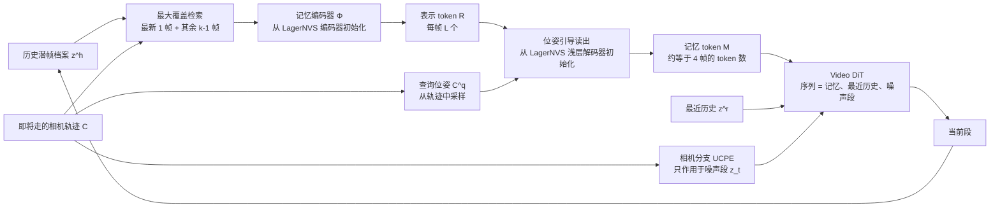

# WorldCrafter：让下一步要看的视角，决定历史该怎么压进记忆

<!-- release-date: 2026-09-21 -->

> 本文依据腾讯 ARC Lab（Tencent IEG）与北京大学合作的 **WorldCrafter: Consistent Video World Model with Implicit 3D-aware Memory**，即 arXiv:2609.24984v1（页边标注 2026-09-21，PDF p. 1），共 13 页（PDF p. 1–13）。第一作者 Wangbo Yu 与 Kunhao Liu 并列，通讯作者 Wenbo Hu，均属 ARC Lab（PDF p. 1）。页码一律指这份 PDF。正文共 9 页，第 9 页后半起是参考文献，没有附录（PDF p. 9–13）。全文把 3 件事分开标注：**报告明确写了什么**、**我们如何解释或验算它**、**哪些是外部资料补充**。

## 读前先把几个词说成人话

这篇论文的难点不在公式，在于它同时借了 3 条技术线：视频扩散、分块自回归、新视角合成。先把会反复出现的词说清楚。

- **视频世界模型（video world model）**：一个会「接着画」的视频生成器。用户每移动一次相机，它就生成下一段画面，像一个用像素而不是用网格渲染的游戏引擎（PDF p. 2）。
- **分块（chunk）自回归**：长视频切成固定长度的小段，一段一段按顺序生成，后一段以前面的结果为条件（PDF p. 4）。
- **VAE 潜变量（latent）**：视频先被变分自编码器（Variational Autoencoder，VAE）压成更小的张量，扩散模型在这个压缩空间里干活，最后再解码回像素（PDF p. 3）。本文说「历史潜帧」，就是已经生成、还存成潜变量的旧帧。
- **DiT（Diffusion Transformer，扩散 Transformer）**：把潜变量切成 token，用 Transformer 去噪的生成器（PDF p. 3）。
- **再访一致性（revisit consistency）**：相机离开某处、绕一圈再回来时，画面是否还和第一次看到的一样。这是本文要解决的核心指标。
- **记忆 token 预算（memory-token budget）**：DiT 每次去噪时，留给「历史信息」的 token 数量是固定的。本文的全部设计都在这个固定预算里做文章。
- **记忆编码器（memory encoder）与读出（readout）**：前者把一批历史潜帧写成一种带 3D 意识的中间表示，后者再从这个表示里取出固定数量的 token 交给 DiT（PDF p. 4–5）。
- **位姿引导读出（pose-guided readout）**：读出时拿「接下来要去的相机位姿」当查询。同样的历史，去不同的地方会读出不同的记忆。这是本文最核心的一刀。
- **新视角合成（Novel View Synthesis，NVS）**：给几张照片和相机参数，渲染出一个没拍过的视角。本文的记忆编码器从一个 NVS 模型 LagerNVS 初始化（PDF p. 3–4）。

## 一句话先说清

视频世界模型能让人「走进」一张图，但走远了再回来，房间常常变样。旧办法要么把大量历史帧塞进注意力（贵），要么只挑几帧（看不全），要么用深度估计把旧帧投影到新视角（依赖几何、怕动态物体）（PDF p. 2）。

WorldCrafter 的回答是（PDF p. 1–5）：

1. 用一个从 NVS 模型借来的**记忆编码器**，把最多 9 帧历史潜帧（PDF p. 5）编码成带 3D 感知的隐式表示，不做显式深度重建；
2. 用**下一段要去的相机位姿**去查询这份表示，读出一组固定数量的记忆 token，数量相当于 4 帧完整潜帧的 token 数（PDF p. 5）；
3. 这组 token 与最近几帧一起拼进 DiT 的自注意力序列，引导当前段的生成（PDF p. 4）。

作者声称的收益（PDF p. 2、p. 6、p. 8–9）：

- 再访一致性相对最强基线提升 47.6%（PDF p. 2）；
- 8 个基线里，相机控制误差 3 项全部最低（PDF p. 6、p. 8）；
- 记忆处理耗时每段 0.062 s，比基于深度的空间记忆的 1.346 s 快 21.7 倍（PDF p. 9）；
- 蒸馏后的 WorldCrafter-fast 在 4 卡机器上达到 16 fps（PDF p. 5）。

### 一条阅读路线

如果只有半小时读原文，建议按这个顺序：

1. **p. 1 的 Figure 1 和 p. 3 的 Figure 2**：先看它能做什么、管线长什么样。
2. **p. 4–5 式 (4)–(7)**：记忆怎么写、怎么读，2 种读出的差别只在式 (7) 多了一个 $\mathbf{C}^{\mathrm{q}}$。
3. **p. 5 的 3.4–3.5 节**：4 阶段训练和混合蒸馏，数字都在这 2 段。
4. **p. 6 Table 1–2、p. 7 Table 3**：记忆、相机、画质 3 张主表。
5. **p. 8 Table 4 与 Figure 5，p. 9 消融文字**：每个设计是否真的有用，这比主表更要紧。
6. **p. 9 第 5 节**：只有 2 条限制，但第 2 条直接指向下一代设计。

## 主要矛盾：记忆既要看得全，又要装得下，还得不怕东西在动

论文把已有记忆方法分成 3 类（PDF p. 2–3）。把每类卡在哪说清楚，WorldCrafter 的每个设计就都有了靶子。

| 路线 | 存的是什么 | 卡在哪 |
|---|---|---|
| 上下文记忆（context memory） | 原始历史帧、潜变量 token 或缓存的注意力特征，直接放进注意力 | 全部放进去计算量太大；只挑几帧又牺牲视角覆盖（PDF p. 2） |
| 空间记忆（spatial memory） | 用深度或新视角合成把旧帧变换到目标视角，编码后按通道拼到噪声上 | 依赖准确几何；对目标视角对齐太紧，会把动态物体「钉死」（PDF p. 2–3） |
| 隐式记忆（implicit memory） | 用学到的表示压缩历史 | 近期方法借几何估计模型（如 VGGT）的特征，但那类预训练偏几何预测，不管外观能不能复原（PDF p. 2–3） |

作者的判断落在第 3 类的缺口上：几何估计模型只要求「深度对」，不要求「颜色和纹理能还原」；而再访时用户看到的是外观。于是他们换了一种预训练来源——**新视角合成**。NVS 模型训练时必须从几张图渲染出没见过的视角，几何和外观都得保住，这正是记忆需要的归纳偏置（PDF p. 3）。

于是矛盾可以写成一句话：

> DiT 留给记忆的 token 预算是固定的。历史越长、视角越多，信息越装不下。能不能让「下一步要看哪里」来决定压缩时保留什么，同时不依赖显式深度，好让动态场景也能用？

## 先看全景：第一段只看相机，之后每段都「查一次记忆」

图里的流程可以按一次 rollout 走一遍（PDF p. 3–4）：

1. **第一段**：还没有历史，DiT 只以相机位姿为条件生成第一段（图左）。
2. **检索**：从全部历史潜帧里，保留最新 1 帧，再按「联合视野覆盖最大」贪心选出其余几帧（图上方浅绿框「History latent frames」里白色高亮的「Retrieved latent frames」）。
3. **写入**：记忆编码器把选中的潜帧和它们的相机参数编码成一串表示 token（图中下方的淡紫方块）。
4. **读出**：拿当前段的目标相机位姿去查询这串表示，得到固定数量的记忆 token（图中 Memory readout）。
5. **生成**：DiT 把「记忆 token + 最近历史 + 噪声」当成一条序列去噪（图右下）。
6. **回写**：新生成的一段加入历史档案，进入下一轮（图右上的 Update）。

下面这张图把同一件事按「数据怎么流」重画，是机制示意，依据 PDF p. 3 Figure 2 与 p. 4–5 的 3.2–3.3 节，不是原文图：

有 2 点要先记住，后面反复用到：

- **记忆是在去噪之前就读好的**。读出模块在 DiT 外面，DiT 只拿到一组现成的 token，不需要在网络内部学「去历史里找什么」（PDF p. 3）。这是它和 MemLearner、CaR 这类「在生成器内部学查询」的方法的分界线（PDF p. 3）。
- **编码器的输入帧数和 DiT 的记忆 token 数都是固定的**。历史档案越来越长，但每一段的计算量不随之增长（PDF p. 2）。

## 从数学上看：只在条件里多加了 2 样东西

先看底座。本文用条件流匹配（conditional flow matching）训练去噪器（PDF p. 3–4）。给定干净潜变量 $\mathbf{z}$、扩散时间 $t$ 和高斯噪声 $\boldsymbol{\epsilon}$，加噪后的状态和要预测的「速度」是：

$$
\mathbf{z}_t = (1-t)\,\mathbf{z} + t\,\boldsymbol{\epsilon},
\qquad
\mathbf{v}_t^{*} = \boldsymbol{\epsilon} - \mathbf{z}
$$

DiT $\mathbf{v}_\theta$ 在文本条件 $\mathbf{y}$ 下去拟合这个速度，损失是二者差的平方（PDF p. 4，式 1–2）：

$$
\mathcal{L}_{\mathrm{FM}} = \mathbb{E}_{\mathbf{z},t,\boldsymbol{\epsilon}}\left[\,\lVert \mathbf{v}_\theta(\mathbf{z}_t, t \mid \mathbf{y}) - \mathbf{v}_t^{*} \rVert_2^2\,\right]
$$

标准的分块自回归只多看「最近历史」$\mathbf{z}^{\mathrm{r}}$（PDF p. 4，式 3）：

$$
\frac{\mathrm{d}\mathbf{z}_t}{\mathrm{d}t} = \mathbf{v}_\theta(\mathbf{z}_t, t \mid \mathbf{z}^{\mathrm{r}}, \mathbf{y})
$$

WorldCrafter 在条件里再加 2 样：从累积历史 $\mathbf{z}^{\mathrm{h}}$ 得到的记忆 $\mathbf{M}$，以及目标相机轨迹 $\mathbf{C}$（PDF p. 4，式 4）：

$$
\frac{\mathrm{d}\mathbf{z}_t}{\mathrm{d}t} = \mathbf{v}_\theta(\mathbf{z}_t, t \mid \mathbf{M}, \mathbf{z}^{\mathrm{r}}, \mathbf{C}, \mathbf{y})
$$

符号的意思：$\mathbf{z}_t$ 是当前段在扩散时间 $t$ 的状态；$\mathbf{z}^{\mathrm{h}}$ 是累积下来的全部干净历史；$\mathbf{z}^{\mathrm{r}}$ 是从中保留的固定长度最近历史；$\mathbf{C}$ 给每一帧一个相机到世界的位姿和内参（PDF p. 4）。

这 2 样条件进入 DiT 的方式完全不同：

- **记忆 $\mathbf{M}$ 走序列拼接**：每一步去噪，DiT 处理的是 $[\mathbf{M};\mathbf{z}^{\mathrm{r}};\mathbf{z}_t]$ 这一整条序列，记忆变成一条专门的 token 流，同时保留段级因果（PDF p. 4）。
- **相机 $\mathbf{C}$ 走一个并行的注意力分支**：按 PRoPE 的思路，把相对相机几何当成自注意力里的位置变换；实现上用 UCPE 的并行相机注意力分支，它有独立的 Q、K、V 投影，输出经一个零初始化投影加回原自注意力。这个分支**只作用于噪声段** $\mathbf{z}_t$，记忆和最近历史不注入相机（PDF p. 4）。

**我们如何解释它。** 相机分支只管「接下来这段往哪看」，而记忆 token 里「从哪看」的信息已经在读出时被目标位姿塑形过了。所以不必再给记忆段注入相机——它本身就是「为这组目标视角准备的」。零初始化投影则让相机分支在训练初期不扰动预训练 DiT，这是在大模型上加新条件的常见做法。

## 核心设计一：记忆编码器——借一个新视角合成模型的「3D 直觉」

### 旧问题：隐式记忆学不到 3D，几何特征又不管外观

从零学一个隐式记忆，模型很难自己悟出「这几帧在 3D 空间里是怎么对应的」。借几何估计模型的特征能补上 3D，但如前所述，那类特征为预测深度而生，外观细节可能被丢掉（PDF p. 2–3）。

### 新设计：从 LagerNVS 初始化，改吃 VAE 潜帧

LagerNVS 是一个实时的全神经新视角合成模型（PDF p. 12，参考文献 [63]）。WorldCrafter 拿它的编码器架构和权重来初始化记忆编码器 $\Phi$，做了 2 处改动（PDF p. 4）：

1. **丢掉浅层的图像处理层**（Figure 2 与 3.4 节写作 DINO 层），换成一个新的 patch embedding 层，让每个 VAE 潜帧直接映射进表示空间。这样就不用把历史解码回 RGB 再编码。
2. **历史相机位姿相对最新一帧表达**，作为相机 token 在编码时注入。

写入公式是（PDF p. 4，式 5）：

$$
\mathbf{R} = \Phi(\mathbf{z}^{\mathrm{h}}, \mathbf{C}^{\mathrm{h}}) \in \mathbb{R}^{|\mathbf{z}^{\mathrm{h}}| L \times d}
$$

$|\mathbf{z}^{\mathrm{h}}|$ 是输入的历史潜帧数，每帧产出 $L$ 个维度为 $d$ 的 token。表示 $\mathbf{R}$ 在多帧之间聚合几何和外观，但**不物化任何显式 3D 重建**（PDF p. 4）。$L$ 和 $d$ 的具体取值原文没有写。

### 工作机制：长度随帧数线性增长，所以输入帧数必须封顶

$\mathbf{R}$ 的长度随输入帧数线性增长。为了控制编码器成本，输入限制为 $k$ 帧（PDF p. 4）。训练第 3 阶段写明编码器固定吃 9 个潜帧（PDF p. 5）；消融里写「保留最新 1 帧，再选 8 帧」（PDF p. 9）。这 2 处合起来，$k = 9$。

### 收益与证据

- 与「直接放 4 帧检索到的历史潜帧」的上下文记忆相比，记忆和相机指标全部更好（PDF p. 8，Table 4；详见后文消融）。
- 延迟上，编码器每段 0.049 s（PDF p. 9）。

### 代价与边界

- 每一段都要把选中的历史**重新编码一遍**。作者在限制里自己点了这一条（PDF p. 9）。
- 编码器的「3D 直觉」来自 LagerNVS 的预训练。原文没有做「随机初始化编码器」的对照，所以**预训练先验到底贡献多少，Table 4 没有直接回答**；Table 4 回答的是「冻结 vs 联合训练」。

### 可迁移启发

想给生成模型加一个「空间记忆」，先找一个预训练目标与你的需求对齐的编码器。需要复原外观，就别只用深度模型的特征；NVS 的训练目标天然要求「几何 + 外观」都能还原。改吃潜变量而不是像素，可以省掉一次解码—再编码的往返。

## 核心设计二：位姿引导读出——同一份历史，去哪就读什么

### 旧问题：固定预算里，不知道该留哪些信息

表示 $\mathbf{R}$ 有 $9L$ 个 token，DiT 的记忆预算只有「4 帧的 token 数」（PDF p. 5）。必须压缩。问题是：按什么压？

### 2 种读出的对比

**位姿无关读出（pose-free readout）**：一个学到的读出模块把完整表示映射成固定数量的记忆 token，与接下来的相机轨迹无关，把「挑出相关信息」的工作留给 DiT 的注意力（PDF p. 4–5，式 6）：

$$
\mathbf{M} = \mathrm{Readout}\bigl(\Phi(\mathbf{z}^{\mathrm{s}}, \mathbf{C}^{\mathrm{s}})\bigr)
$$

**位姿引导读出（pose-guided readout）**：从即将走的目标轨迹里采样一组固定数量的查询位姿 $\mathbf{C}^{\mathrm{q}} \subset \mathbf{C}$，拿它们去查询表示（PDF p. 5，式 7）：

$$
\mathbf{M} = \mathrm{Readout}\bigl(\Phi(\mathbf{z}^{\mathrm{s}}, \mathbf{C}^{\mathrm{s}}),\, \mathbf{C}^{\mathrm{q}}\bigr)
$$

这里 $\mathbf{z}^{\mathrm{s}}$、$\mathbf{C}^{\mathrm{s}}$ 是检索选中的历史潜帧及其相机参数（PDF p. 4）。位姿引导版的读出模块用 LagerNVS 的**浅层解码器层**初始化，再加投影层映射到 DiT 的 token 空间（PDF p. 5）。

### 工作机制：在 NVS 模型里，「按位姿查询」本来就是渲染

**我们如何解释它。** LagerNVS 的解码器原本的工作就是「给定场景表示和一个新相机，渲染出那个视角」。WorldCrafter 保留了这套「按相机查询」的结构，但不真的渲染出图像——输出的 token 直接进 DiT 的自注意力（PDF p. 2）。所以记忆 token 可以理解成「目标视角的一份粗略草稿，写在 DiT 能读懂的 token 语言里」。摘要里说的「target view-specific tokens」（PDF p. 1）就是这个意思。

作者给的解释更克制：位姿引导读出把固定的记忆预算更有效地分配给了与目标相关的信息（PDF p. 5）。

### 收益与证据

同样的历史输入、同样的输出 token 预算下，换成位姿无关读出，记忆和相机指标全部变差：LPIPS 从 0.255 升到 0.333，RotErr 从 13.536 升到 18.307（PDF p. 8，Table 4）。

### 代价与边界

- 查询位姿「采样自即将走的轨迹」，意味着**系统必须提前知道下一段相机怎么走**。在键鼠交互里这通常成立（按键先于画面），但轨迹若在一段内剧烈变化，查询位姿能否覆盖，原文没讨论。
- 查询位姿取多少个、怎么采样、每个位姿产出多少 token，原文只说「固定数量」，没有给数（PDF p. 5）。

### 可迁移启发

当下游消费者的 token 预算固定、上游信息又远多于预算时，**让下游的查询条件参与压缩**，往往比「先无差别压缩、再让下游自己挑」更省。这和检索增强里「按问题做重排」、推理服务里「按请求裁剪 KV」是同一种思想：压缩器应该知道消费者要什么。

## 核心设计三：最大覆盖检索——挑一组互补的帧，而不是挑最像的几帧

### 旧问题：按相似度排序，挑出来的帧可能都在看同一处

此前的上下文记忆方法按「历史帧与目标位姿的视野（Field of View，FoV）相似度」逐帧排序，只取前几帧（PDF p. 4）。每帧独立打分，选出来的几帧可能高度重叠，覆盖范围有限，而且对单帧的选择很敏感（PDF p. 4）。

### 新设计：贪心最大化联合覆盖

推理时，保留历史里最新 1 帧，再**贪心**选出 $k-1$ 帧，使它们的**联合**视野对「即将走的相机轨迹所看的目标区域」覆盖最大（PDF p. 4）。

**我们如何解释它。** 这是一个经典的集合覆盖问题：第一帧挑覆盖最多的，第二帧挑「补上最多新区域」的，依此类推。相似度排序会连挑 3 张几乎一样的正面照；覆盖排序挑完正面照，下一张会去挑侧面。原文没有给出覆盖面积的具体计算方式（例如是否按视锥体素化、按像素投影还是按角度），只给了「贪心」「联合视野」「目标区域」这几个关键词（PDF p. 4）。

### 收益与证据

消融里两者都保留最新 1 帧、再选 8 帧，DiT 记忆 token 预算相同（PDF p. 9）。换成相似度检索后：LPIPS 0.296 对 0.255，RotErr 14.657 对 13.536（PDF p. 8，Table 4）。作者的结论是：不增加历史输入数量，只改变挑法，就能提升再访一致性和相机控制（PDF p. 9）。

另外注意，这是 Table 4 里差距最小的一个变体（PDF p. 8）。检索方式有用，但不是主要贡献。

### 可迁移启发

从一个大池子里挑少量样本当上下文时，「逐个打分取前 K」会挑出冗余。只要能定义「覆盖」，贪心地挑互补样本通常更划算。这对多视图重建选关键帧、RAG 去冗余、长视频摘要都适用。

## 核心设计四：记忆与生成器联合训练

记忆编码器、读出模块、DiT 和相机分支在最后一个阶段**一起训练**，让记忆表示与 DiT 的 token 空间相互适应（PDF p. 2、p. 5）。

对照变体「冻结记忆编码器」在最后阶段固定编码器，其余照常训练。它的指标全部变差：LPIPS 0.305 对 0.255，RotErr 15.428 对 13.536（PDF p. 8，Table 4）。

Figure 5(b) 把两者在相同迭代数下的验证 LPIPS 画成曲线。2 条线从 0 步同一点出发（读图约 0.49，PDF p. 8）；联合训练在约 2k 步已降到约 0.33，8k 步约 0.25（PDF p. 8，读自 Figure 5(b)）；冻结编码器约 6k 步后停在约 0.32 附近（PDF p. 8，读自 Figure 5(b)）。横轴到 8k，正好对应第 4 阶段的 8,000 步（PDF p. 5）。作者的读法是：联合训练更早达到更低误差，并保持优势；这支持「让记忆表示与生成器共同适应」，而不是「学着消费一个固定的表示空间」（PDF p. 9）。

**我们如何解释它。** LagerNVS 的表示空间是为「渲染 RGB」优化的，WorldCrafter 的消费者却是一个视频 DiT。表示里哪些信息对 DiT 有用，只有让梯度从 DiT 流回编码器才能学到。冻结编码器等于要求读出模块单方面去「翻译」，翻译能力有上限。

**可迁移启发：** 借预训练编码器当条件时，先单独热身编码器、再与生成器联合训练，是一个稳妥的 2 步。WorldCrafter 的第 3 阶段（单独热身编码器）加第 4 阶段（联合训练）就是这个套路（PDF p. 5）。

## 训练 recipe：从 Helios 出发的 4 个阶段

### 数据

训练数据来自 3 个来源（PDF p. 5）：

- **Open-Sora-Plan（OSP）数据集**：真实视频，覆盖室内外场景与物体运动；
- **DL3DV**：大规模 3D 场景视频数据集；
- **MIND**：合成视频，用于提升动态主体建模。

所有数据用 Depth Anything 3 标注**度量尺度**的相机位姿，用 Qwen2.5-VL 生成字幕（PDF p. 5）。借助字幕和估计的相机轨迹，作者还从 OSP 里筛出一个「相机跟随运动主体」的子集，帮助模型学会相机运动与主体运动的协调（PDF p. 5）。筛选的具体规则、各来源的时长与分辨率，原文没有写。

### 底座：Helios-base 与它的推理窗口

视频 DiT 从 Helios-base 初始化（PDF p. 5）。Helios 是一个实时长视频生成模型（PDF p. 13，参考文献 [96]；它的一作 Shenghai Yuan 也是本文作者之一，PDF p. 1）。

原 Helios-base 的推理窗口由以下几部分组成（PDF p. 5）：

| 原窗口组成 | WorldCrafter 的处理 |
|---|---|
| 9 帧噪声段 | 保留 |
| FramePack 式干净历史：压缩的 16 帧段 | **删除**，换成记忆 token |
| FramePack 式干净历史：2 帧段 | 保留 |
| 最新一个潜帧 | 保留 |
| 1 个注意力汇聚帧（attention sink） | 保留 |
| — | 前置记忆 token，数量等于 4 个未压缩历史帧的 token 数 |

**我们如何解释它。** 这张表揭示了 WorldCrafter 在系统层面的真实身份：它不是从零搭的世界模型，而是**把 Helios 窗口里「压缩的远期历史」这一格，换成了「按目标视角读出的 3D 感知记忆」**。近期历史（2 帧段、最新帧、sink）照旧负责动作的连续性；远期历史改由记忆负责。这正对应作者的分工：记忆提供历史场景信息，最近上下文支撑可见运动的延续（PDF p. 2）。

### 4 个阶段

| 阶段 | 训练什么 | 数据 | 步数 | GPU / 全局 batch |
|---|---|---|---:|---|
| 1 | 微调 Helios-base 适应新窗口；每段从前 4 段里随机取 4 帧历史填记忆槽 | OSP 760,000 条 | 5,000 | 32 / 32 |
| 2 | 只训 UCPE 相机分支，DiT 主干冻结 | 筛选 OSP 子集 40,000 条 + DL3DV 6,000 条 | 原文未写 | 32 / 128 |
| 3 | 记忆编码器热身：从 LagerNVS 编码器初始化，浅层 DINO 层换成潜变量 patch embedding，固定输入 9 个潜帧 | DL3DV + 筛选 OSP 子集 | 5,000 | 16 / 16 |
| 4 | 加入读出模块，编码器 + 读出 + DiT + 相机分支联合训练；记忆 token 数等于 4 帧完整帧 | 先 DL3DV + 筛选 OSP 子集，再加 MIND | 8,000 + 1,000 | 32 / 32 |

表中数字均出自 PDF p. 5。

读这张表要注意 3 点：

1. **第 1 阶段没有记忆编码器**。记忆槽里放的是随机取的 4 帧原始历史（PDF p. 5）。这一步只是让 DiT 习惯「窗口前面多了一段 4 帧大小的东西」。
2. **第 2 阶段冻结主干**，只训相机分支（PDF p. 5）。相机控制与记忆被拆开学。
3. **第 4 阶段的最后 1,000 步才加入 MIND 合成视频**，目的是提升动态主体建模（PDF p. 5）。这个「最后才加合成数据」的顺序，在蒸馏阶段会变成一个关键分叉点。

训练用的 GPU 型号、总 GPU 时、学习率、优化器，原文都没有写。

## 蒸馏：实时化，以及「一个模型不够，就用 2 个」

### 金字塔蒸馏

沿用 Helios 的由粗到细金字塔去噪，再用分布匹配蒸馏（Distribution Matching Distillation，DMD）减少采样步数：3 个空间分辨率，每个分辨率 2 个去噪步（PDF p. 5）。按此计算共 6 步，这个总数是我们乘出来的。

相机条件要跨金字塔各级工作：UCPE 相机编码时，空间坐标按分辨率缩放，相机位姿和视场角在各级保持不变（PDF p. 5）。

### 混合蒸馏：低噪声模型管质感，高噪声模型管主体

作者观察到用合成数据蒸馏时有一个取舍：加入 MIND 能提升主体跟随能力，但会带来**涂抹状的纹理**（PDF p. 5）。他们的解法是蒸馏 2 个模型，数据配方不同（PDF p. 5）：

| 模型 | 从哪个底座蒸馏 | 蒸馏数据 | 推理时负责 |
|---|---|---|---|
| 高噪声模型 | 加入合成数据**之后**的底座 | OSP + DL3DV + MIND | 除最后一步外的全部去噪步 |
| 低噪声模型 | 加入合成数据**之前**的底座 | 筛选 OSP 子集 + DL3DV | 最后一个去噪步 |

**我们如何解释它。** 扩散模型的高噪声步决定构图和运动（主体在哪、怎么动），低噪声步决定纹理细节。把「会跟主体但纹理糊」的模型放在前面，「纹理自然」的模型放在最后一步收尾，就把两者的优点按噪声阶段拼到了一起。这与一些视频模型「高噪声专家 + 低噪声专家」的分工思路相近，但本文是在蒸馏阶段用数据配方制造出 2 个专家。

蒸馏后的 WorldCrafter-fast 在一台 4 GPU 机器上达到 16 fps 的生成速度（PDF p. 5）。GPU 型号、生成分辨率、是否含 VAE 解码、首帧延迟，原文都没有写。

## 实验怎么证明

### 评测集：145 张图，725 条轨迹，带闭环再访

作者自建评测集（PDF p. 5–6）：

- 145 张起始图，来源包括 HappyOyster、Project Genie、网络图片和 GPT-Image2 生成图（PDF p. 5–6）；
- 其中 83 个动态、以物体为中心的场景，62 个静态场景（PDF p. 6）；
- 每张图配文本描述和 5 条度量尺度相机轨迹，每个方法共 725 条视频（PDF p. 6）；
- 轨迹长 528–1,648 帧，包含**闭环再访**，用来检查早先看到的内容在长时程后是否还在（PDF p. 6）。

对比 8 个近期可控相机的视频世界模型：DreamX-World、Alaya-EVOKE、HY-WorldPlay、Lyra 2.0、Echo-WM、LingBot-World 2、Matrix-Game 3.5、SANA-WM（PDF p. 6）。它们的记忆路线各不相同（PDF p. 6–7）：

- HY-WorldPlay 与 DreamX-World：按相机相似度检索历史上下文，相机控制用 PRoPE；
- SANA-WM：Gated DeltaNet 记忆 + UCPE + Plücker 射线条件；
- Echo-WM：UCPE 相机分支 + 滑动窗口记忆；
- Alaya-EVOKE 与 Lyra 2.0：用 Depth Anything 3 估深度构建空间记忆，几何变换（warp）后作条件；
- Matrix-Game 3.5：几何 patch 记忆 + Warped PRoPE。

SANA-WM 评的是带 refiner 的全步数底座，Lyra 2.0 与 HY-WorldPlay 评全步数底座，其余评蒸馏版（PDF p. 7）。所有方法输入相同的起始图、文本和目标轨迹，生成结果统一缩放到 640 × 384 再评测（PDF p. 7）。

**我们如何解释它。** 这个评测集是作者自建的，轨迹由作者设计。「包含闭环再访」正对着本文的设计目标，对手方法未必针对这种轨迹调过。另外，基线里混着全步数版和蒸馏版，WorldCrafter 两版都报了——横向比较时要留意每一行评的是哪一版。

### 记忆：Table 1

记忆评测沿用 HY-World 1.5 的协议：比较再访时生成的帧与初访时对应的帧（PDF p. 7）。指标 4 个：MEt3R（多视图一致性）、LPIPS（感知距离）、PSNR、SSIM（PDF p. 7）。725 条视频取平均（PDF p. 6）。

下表数字均取自 Table 1（PDF p. 6），↓ 越低越好，↑ 越高越好：

| 方法 | MEt3R ↓ | LPIPS ↓ | PSNR ↑ | SSIM ↑ |
|---|---:|---:|---:|---:|
| DreamX-World | 0.548 | 0.627 | 12.898 | 0.243 |
| Alaya-EVOKE | 0.414 | 0.565 | 12.332 | 0.290 |
| HY-WorldPlay | 0.394 | 0.515 | 12.983 | 0.252 |
| Lyra 2.0 | 0.334 | 0.487 | 14.050 | 0.390 |
| Echo-WM | 0.449 | 0.582 | 12.592 | 0.239 |
| LingBot-World 2 | 0.492 | 0.633 | 10.449 | 0.219 |
| Matrix-Game 3.5 | 0.405 | 0.549 | 12.976 | 0.224 |
| SANA-WM | 0.397 | 0.553 | 13.142 | 0.246 |
| WorldCrafter | 0.166 | 0.255 | 18.016 | 0.517 |
| WorldCrafter-fast | **0.129** | **0.186** | **20.868** | **0.616** |

读这张表要知道 3 件事：

1. **差距很大，不是小胜。** 最强基线 Lyra 2.0 的 LPIPS 是 0.487（PDF p. 6），WorldCrafter 是 0.255（PDF p. 6）；PSNR 从 14.050 升到 18.016 dB（PDF p. 8）。引言里的「相对最强基线提升 47.6%」（PDF p. 2）没有写明是哪个指标；我们按 Table 1 验算，$(0.487-0.255)/0.487 \approx 47.6\%$，与 LPIPS 这一项对得上。
2. **最强基线是一个空间记忆方法。** Lyra 2.0 用深度估计做空间记忆（PDF p. 7），在 8 个基线里 4 项全部最好（PDF p. 6）。这说明在再访一致性上，「显式几何」确实比纯上下文检索强；WorldCrafter 要证明的是「不用显式几何也能更强」。
3. **蒸馏版在记忆上反而更好。** WorldCrafter-fast 4 项全部第一（PDF p. 6、p. 8）。原文只陈述了这一结果，没有解释原因。**我们的推测**（未经原文证实）：蒸馏后的模型可能更保守、更少「发挥」，再访时更贴近历史；这与后面 VBench 里 fast 版动态程度更低的现象方向一致。

Figure 3 是一个中式园林亭子的静态场景（PDF p. 6）。第 3 行最直观：WorldCrafter 回到起点时亭子、假山、水面都在原位；LingBot-World 2、SANA-WM、Alaya-EVOKE、DreamX-World 回来时看到的已是另一处园林（读自 Figure 3）。第 4 行点云由 VGGT-Ω 从生成视频里重建（PDF p. 8）：WorldCrafter 的点云能看出亭子的结构，其余方法的点云更散乱（读自 Figure 3）。

Figure 4 是空间站里的宇航员（PDF p. 7）。这是动态场景，宇航员本身在动，所以再访时人的姿态不同是正常的；要看的是**舱体布局**有没有保住。WorldCrafter 的再访舱壁与初访一致；HY-WorldPlay 在探索阶段画面已经变成模糊的白色平面；Echo-WM 的再访画面纹理杂乱；Matrix-Game 3.5 的再访宇航员出现拖影（读自 Figure 4）。

### 相机控制：Table 2

生成视频每 4 帧采一帧，用 VGGT-Ω 恢复相机轨迹；按 SANA-WM 的做法，轨迹相对首帧归一化，再用 Umeyama Sim(3) 对齐；指标是旋转误差 RotErr、相机中心平移误差 TransErr、位姿矩阵差异 CamMC，都是越低越好（PDF p. 8）。

下表数字均取自 Table 2（PDF p. 6）：

| 方法 | RotErr ↓ | TransErr ↓ | CamMC ↓ |
|---|---:|---:|---:|
| DreamX-World | 54.116 | 2.759 | 3.138 |
| Alaya-EVOKE | 26.042 | 2.042 | 2.199 |
| HY-WorldPlay | 34.051 | 2.146 | 2.359 |
| Lyra 2.0 | 16.145 | 1.538 | 1.624 |
| Echo-WM | 21.455 | 2.072 | 2.189 |
| LingBot-World 2 | 30.615 | 2.004 | 2.192 |
| Matrix-Game 3.5 | 19.881 | 1.920 | 2.028 |
| SANA-WM | 23.531 | 1.740 | 1.887 |
| WorldCrafter | **13.536** | **1.475** | **1.546** |
| WorldCrafter-fast | 18.251 | 1.638 | 1.737 |

WorldCrafter 3 项全部最低，WorldCrafter-fast 每项第 3（PDF p. 8）。与记忆表相反，**蒸馏在相机控制上付出了代价**：RotErr 从 13.536 升到 18.251（PDF p. 6）。

**我们如何解释它。** 相机误差是从生成视频里用 VGGT-Ω 反推出来的。如果一个模型画面崩了（例如 Figure 4 里 HY-WorldPlay 的白色平面），VGGT-Ω 也就估不准轨迹。所以相机误差与画面一致性并不独立：记忆好、画面稳，相机误差也会跟着低。Table 4 里记忆变体的相机指标跟着变化，也印证了这一点。

### 画质：Table 3

画质用 VBench 的自定义输入模式评测，725 条视频（PDF p. 7–8）。8 个维度分别是主体一致性 SC、背景一致性 BC、时间闪烁 TF、运动平滑 MS、美学质量 AQ、成像质量 IQ、动态程度 DD、整体一致性 OC，外加 VBench 总分 Overall（PDF p. 7）。

下表数字均取自 Table 3（PDF p. 7），全部越高越好：

| 方法 | SC | BC | TF | MS | AQ | IQ | DD | OC | Overall |
|---|---:|---:|---:|---:|---:|---:|---:|---:|---:|
| DreamX-World | 75.994 | 87.601 | 95.327 | 98.100 | 57.593 | 60.412 | 99.806 | 24.583 | 77.652 |
| Alaya-EVOKE | 80.522 | 88.994 | 95.872 | 98.481 | 61.579 | **71.249** | 99.029 | 25.015 | 81.406 |
| HY-WorldPlay | 75.407 | 86.629 | 95.553 | 97.626 | 53.454 | 61.700 | 97.087 | 21.182 | 76.539 |
| Lyra 2.0 | 77.277 | 87.935 | 95.167 | 98.652 | 57.832 | 65.149 | 99.806 | 21.484 | 78.943 |
| Echo-WM | 81.671 | 90.206 | 95.771 | 96.751 | 61.818 | 66.564 | 98.835 | 26.082 | 80.211 |
| LingBot-World 2 | 75.584 | 87.725 | 94.206 | 96.657 | 60.815 | 68.776 | **100.000** | 25.605 | 78.174 |
| Matrix-Game 3.5 | 70.370 | 83.626 | 94.395 | 98.087 | 58.615 | 69.374 | **100.000** | 18.813 | 76.967 |
| SANA-WM | 79.413 | 89.625 | 95.768 | 98.608 | **63.467** | 66.080 | 98.835 | 25.234 | 80.841 |
| WorldCrafter | **82.695** | **90.589** | 96.217 | **98.787** | 61.432 | 69.058 | 96.893 | **26.745** | **81.910** |
| WorldCrafter-fast | 81.365 | 89.559 | **96.444** | 98.736 | 58.650 | 63.982 | 96.505 | 24.306 | 80.285 |

作者的读法：两版合计在 8 个维度里拿到 5 项最好；WorldCrafter 总分 81.910（PDF p. 8）最高，WorldCrafter-fast 时间闪烁最好；增益主要反映更强的场景一致性和时间连贯性（PDF p. 8）。

作者没点出、但表里读得到的 2 件事：

- **动态程度 DD 是 WorldCrafter 两版最低的一项。** 96.893 和 96.505 是全表最低的 2 个值，其余 8 个基线在 97.087–100.000 之间（PDF p. 7）。**我们如何解释它**：「更一致」和「更少动」在 VBench 上可能是同一枚硬币的两面，场景动得少，SC、BC、TF 自然就高。这个取舍原文没有讨论。
- **总分差距不大。** 81.910 对 Alaya-EVOKE 的 81.406（PDF p. 7），远不像 Table 1 的差距那样悬殊。画质不是本文的主战场，本文的主张也只是「保持画质」（PDF p. 1）。

## 消融：每个设计换掉一个，看哪个伤得最重

全部消融在**蒸馏前**的 WorldCrafter 上做，训练和推理设置、DiT 记忆 token 预算都固定，每个变体只改 1 处设计（PDF p. 8–9）。

下表数字均取自 Table 4（PDF p. 8）：

| 变体 | MEt3R ↓ | LPIPS ↓ | PSNR ↑ | SSIM ↑ | RotErr ↓ | TransErr ↓ | CamMC ↓ |
|---|---:|---:|---:|---:|---:|---:|---:|
| 上下文记忆 | 0.382 | 0.497 | 13.907 | 0.315 | 26.522 | 2.083 | 2.150 |
| 冻结记忆编码器 | 0.227 | 0.305 | 16.873 | 0.472 | 15.428 | 1.793 | 1.886 |
| 位姿无关读出 | 0.251 | 0.333 | 16.486 | 0.467 | 18.307 | 1.701 | 1.828 |
| 相似度检索 | 0.213 | 0.296 | 17.125 | 0.485 | 14.657 | 1.579 | 1.664 |
| WorldCrafter | **0.166** | **0.255** | **18.016** | **0.517** | **13.536** | **1.475** | **1.546** |

按伤害从大到小读：

1. **上下文记忆伤得最重。** 这个变体把记忆编码器和读出模块产出的记忆 token，换成 4 帧检索到的历史潜帧；它从第 2 阶段模型初始化，训练步数与完整模型相同（PDF p. 9）。LPIPS 0.497、PSNR 13.907（PDF p. 8），几乎退回到 Lyra 2.0 那一档（Table 1 的 0.487 / 14.050，PDF p. 6）。**这一行是全文最有力的证据**：token 数一样，放 4 帧原始潜帧，不如放「9 帧编码后再按目标视角读出」的记忆。
2. **位姿无关读出排第 2。** LPIPS 0.333，RotErr 18.307（PDF p. 8）。RotErr 的恶化在所有非上下文变体里最大，说明「按目标视角读」对相机旋转控制尤其要紧；但 TransErr、CamMC 上它（1.701、1.828）反而好于冻结编码器（1.793、1.886）（PDF p. 8）。
3. **冻结编码器排第 3。** LPIPS 0.305（PDF p. 8）。
4. **相似度检索伤得最轻。** LPIPS 0.296（PDF p. 8）。

Figure 5(a) 把上下文记忆与 WorldCrafter 的再访 LPIPS 按「初访到再访间隔的帧数」画出来，间隔取 160、360、640、960、1360 帧（PDF p. 8）。读图：间隔 160 帧时两者约 0.27 对 0.22（PDF p. 8，读自 Figure 5(a)）；间隔 1360 帧时上下文记忆约 0.51，WorldCrafter 约 0.29（PDF p. 8，读自 Figure 5(a)）。作者的判断是：WorldCrafter 的再访误差增长更慢，间隔越长优势越大（PDF p. 9）。

**我们如何解释它。** 上下文记忆只能放 4 帧，间隔越长、中间走过的视角越多，4 帧能覆盖的比例越小，误差随间隔近似线性上升。WorldCrafter 的编码器能吃 9 帧，再经最大覆盖挑选，覆盖面更大，所以曲线更平。

### 记忆处理的耗时：Figure 5(c)

与基于深度的空间记忆方法（Lyra 2.0、Matrix-Game 3.5、Alaya-EVOKE）比较额外开销（PDF p. 9）。设置：640 × 384 分辨率（PDF p. 9），每段生成 9 个潜帧，空间 warp 用 4 帧历史（PDF p. 9）；共用的 VAE 解码和视频去噪不计入（PDF p. 9）。

| 方法 | 组件 | 每段耗时 |
|---|---|---:|
| 基于深度的空间记忆 | 深度估计与对齐（Depth Anything 3） | 0.409 s |
| | 批量 warp | 0.937 s |
| | 合计 | 1.346 s |
| WorldCrafter | 记忆编码器 | 0.049 s |
| | 读出 | 0.013 s |
| | 合计 | 0.062 s |

表中数字均出自 PDF p. 9。合计相差 21.7 倍（PDF p. 9）；我们验算 $1.346 / 0.062 \approx 21.7$，一致。

**我们如何解释它。** 快的根源是 WorldCrafter 直接在潜变量上工作：不需要把历史解码回 RGB 去估深度，也不需要逐像素投影。代价是它放弃了显式几何带来的可解释性和精确对应。另外要注意：这组耗时没有给 GPU 型号；空间记忆一侧用 4 帧，WorldCrafter 一侧编码器吃 9 帧，两边输入帧数并不相同，原文没有说明这一差别对比较的影响。

## 限制、边界，以及原文没写的东西

作者在第 5 节只写了 2 条限制（PDF p. 9）：

1. 在特别复杂或特别长的轨迹上，一致性仍可能崩溃；
2. 每一段都要重新编码历史，带来额外延迟。作者提出的方向是一个**自回归流式记忆编码器**，每生成一段就增量并入记忆状态，避免重复计算。

我们读完还要补的边界：

- **评测集是自建的**，145 张图、725 条轨迹（PDF p. 5–6）。轨迹由作者设计且带闭环再访，是否公开原文没说。
- **动态场景的一致性是怎么算的**，原文没有单独拆分。83 个动态场景与 62 个静态场景的分项指标没有给出（PDF p. 6），所以「动态场景也有效」目前只有 Figure 1(b)(c)、Figure 4 这类定性图支撑。
- **「分钟级」的具体时长**：轨迹长 528–1,648 帧（PDF p. 6），但原文没写输出帧率，无法换算成秒。Figure 1 的时间戳最长到 54.0 s（PDF p. 1）。
- **实时性的条件**：16 fps 是 4 GPU、蒸馏版的数字（PDF p. 5）；GPU 型号、分辨率、端到端延迟都没写。未蒸馏的 WorldCrafter 速度没有给。
- **动态程度更低**：见 Table 3 的讨论，原文没有分析。
- **没有与更多记忆帧的对照**：编码器输入 $k$ 只报告了 $k = 9$；增减 $k$、改变记忆 token 预算的影响，原文没有做。
- **预训练先验的贡献**：没有「随机初始化编码器 / 读出」的对照，LagerNVS 初始化的独立价值没有被量化。
- **代码与权重**：PDF 只给了项目页地址（PDF p. 1），没有写是否开源代码或权重。

## 可迁移启发

1. **固定预算下，让消费者的查询参与压缩。** 位姿引导读出的本质是：下游需要什么，上游就按什么压。这在 KV 裁剪、RAG 重排、多模态 token 压缩里同样成立。
2. **借一个预训练目标对齐的编码器。** 需要复原外观就用 NVS 类的编码器，不要只用深度模型特征。预训练目标决定了表示里保留什么。
3. **在潜变量空间里做记忆。** 改 patch embedding 让编码器直接吃 VAE 潜帧，省掉解码—估深度—warp 的整条链，记忆处理耗时降到原来的 1/21.7（PDF p. 9）。
4. **挑上下文要挑互补，不要挑最像。** 贪心最大覆盖是便宜又有效的改进，即便它在本文里不是最大的收益来源。
5. **远期历史和近期历史分开管。** 远期交给压缩记忆，近期保留原始帧；前者管「世界长什么样」，后者管「动作接得上」。WorldCrafter 在 Helios 窗口里只替换了远期那一格。
6. **一个蒸馏模型兼顾不了，就按噪声阶段拆成 2 个。** 高噪声步管构图和运动，低噪声步管纹理；各自用最合适的数据配方蒸馏。
7. **先单独热身、再联合训练。** 第 3 阶段单独热身编码器，第 4 阶段放开联合训练；消融显示联合训练比冻结编码器收敛更快、更低（PDF p. 8–9）。

## 关键词回看

- **隐式 3D 感知记忆**：不物化 3D 重建，而是把多帧历史编码成一串带 3D 归纳偏置的 token。本文的核心对象。
- **记忆编码器 $\Phi$**：从 LagerNVS 编码器初始化，浅层换成潜变量 patch embedding，固定吃 9 个潜帧。
- **位姿引导读出**：用目标轨迹上采样的查询位姿 $\mathbf{C}^{\mathrm{q}}$ 读出记忆，从 LagerNVS 浅层解码器初始化。消融中比位姿无关读出 LPIPS 低 0.078（0.255 对 0.333，PDF p. 8）。
- **记忆 token 预算**：固定为 4 帧完整潜帧的 token 数，替换 Helios 窗口里压缩的 16 帧段（PDF p. 5）。
- **最大覆盖检索**：保留最新帧，贪心选出联合视野覆盖目标区域最大的其余帧。
- **联合训练**：编码器、读出、DiT、相机分支一起训，让记忆表示与 DiT token 空间相互适应。
- **UCPE 相机分支**：PRoPE 思路的并行相机注意力，只作用于噪声段。
- **混合蒸馏**：高噪声模型（含合成数据）管前面的步，低噪声模型（不含合成数据）管最后一步。
- **47.6%**：引言给出的相对最强基线的提升（PDF p. 2），按 Table 1 验算与 LPIPS 相对 Lyra 2.0 的下降对得上。
- **21.7 倍**：记忆处理耗时 0.062 s 对 1.346 s（PDF p. 9）。
- **16 fps**：WorldCrafter-fast 在 4 GPU 机器上的生成速度（PDF p. 5）。

## 资料与阅读边界

### 本文依据的版本

依据本地 PDF，即 arXiv:2609.24984v1，页边标注 2026-09-21（PDF p. 1），13 页；[arXiv 页面](https://arxiv.org/abs/2609.24984) 截至核验只有 v1，提交于 2026-09-21，`release-date` 取这一天。文中只讲一项技术，没有对外可用的模型发布记录，因此按技术首次官方公开日取值。

### 同站相关篇目（外部补充）

- 记忆评测协议沿用的 HY-World 1.5 技术报告，以及基线之一 HY-WorldPlay，见 HunyuanWorld-1.5 一篇。那边的「重构上下文记忆」是按空间与时间重新挑旧帧的上下文记忆路线，正是本文 Table 4 里「上下文记忆」变体所代表的一类。
- 同为腾讯的世界生成工作还有 HunyuanWorld-1.0、HunyuanWorld-2.0 两篇，走的是离线 3D 资产路线，与本文的流式视频世界模型不是一条线。

### 报告明确写了、本文覆盖了的部分

摘要与 Figure 1；第 1 节动机与 3 项贡献；第 2 节相关工作的 3 类记忆划分；第 3.1 节流匹配与分块自回归（式 1–3）；第 3.2 节记忆条件与相机条件（式 4）；第 3.3 节记忆写入、检索与 2 种读出（式 5–7）与 Figure 2；第 3.4 节数据与 4 阶段训练；第 3.5 节金字塔蒸馏与混合蒸馏；第 4.1 节评测集与基线；第 4.2–4.4 节 Table 1–3 与 Figure 3–4；第 4.5 节 Table 4 与 Figure 5；第 5 节讨论与限制。参考文献只用于核对被引方法的名称与出处（PDF p. 9–13）。

### 原文没有公开、本文也不补的缺口

- 记忆编码器的 $L$、$d$，查询位姿的数量与采样方式，覆盖面积的计算方法；
- 第 2 阶段的训练步数；全部阶段的学习率、优化器、GPU 型号与总算力；
- 各数据来源的规模、分辨率、筛选规则（第 1 阶段的 760,000 条与第 2 阶段的 40,000 + 6,000 条除外，PDF p. 5）；
- 生成分辨率、输出帧率、16 fps（PDF p. 5）的硬件与测量口径；
- 动态与静态场景的分项指标；
- 评测集、代码与权重是否公开。项目页未能核实。
