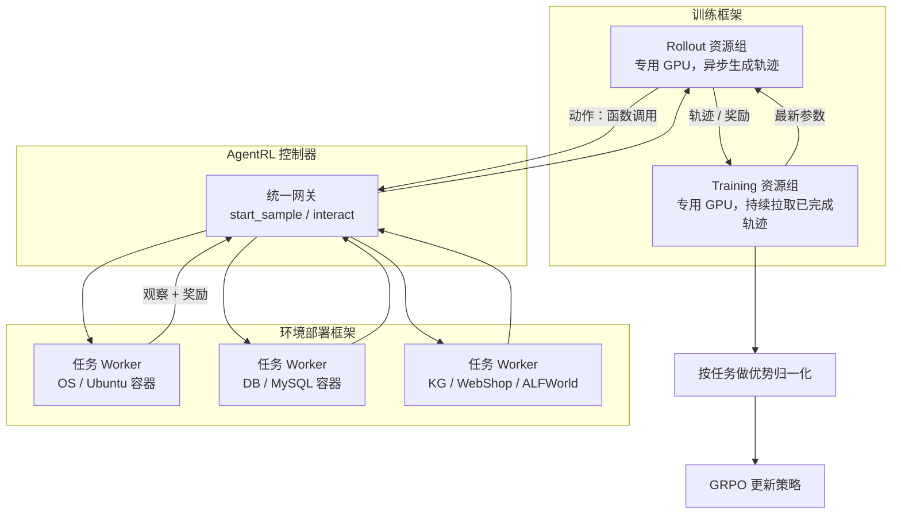

# 同步 RL 只能等最长的那条多轮轨迹跑完：AgentRL 把生成和训练拆开，再按任务归一化优势

<!-- release-date: 2025-10-05 -->

> 本文依据清华大学与 Z.AI 联合发布的 **AgentRL: Scaling Agentic Reinforcement Learning with a Multi-Turn, Multi-Task Framework**，即 arXiv:2510.04206v1、2025-10-05 提交、共 24 页的预印本（封面写 Preprint. Under review.）。页码均指 PDF 本身的页码。按主要归属方，本站把它放在 Tsinghua 目录下；合作关系是清华 + Z.AI，多位作者标注在 Z.AI 实习期间完成工作（PDF p. 1）。文中会明确区分「论文写了什么」「本文如何解释它」「哪些是外部资料补充」。截至 2026-09-10 核验，arXiv 上最新版本仍是 v1，与本地原件一致。
>
> 这是一篇**系统加算法的技术论文**，不是基模 Technical Report。它没有发布新的模型架构，也没有预训练配方。它讲的是：怎样把大语言模型当成会跟环境多轮交互的智能体来做强化学习，以及为了同时训五个异构环境，框架和算法各自改了什么。

## 读之前需要的最少背景

这篇论文默认你已经见过「用奖励训语言模型」这件事。不熟的话，先记住下面几件事就够了。

**强化学习（Reinforcement Learning，RL）** 是让一个策略跟环境交互、用累计奖励更新自己。对语言模型来说，策略就是模型本身：它读当前上下文，吐出下一步动作。

最近有两条常见路：

- **基于人类反馈的强化学习（Reinforcement Learning from Human Feedback，RLHF）**：奖励来自另一个学出来的奖励模型。本站 [HybridFlow](/reports/ByteDance/HybridFlow) 讲的就是承载这类训练的框架。
- **可验证奖励强化学习（Reinforcement Learning with Verifiable Rewards，RLVR）**：奖励来自程序，比如数学对错、代码单测、智能体有没有完成任务。本站 [DeepSeek-R1](/reports/DeepSeek/DeepSeek-R1) 走的是这条路。

AgentRL 走的是第二条。它用的基线算法是 **组相对策略优化（Group Relative Policy Optimization，GRPO）**：同一个问题采样一组回答，用组内相对高低当优势，不再单独训一个价值网络。出处见 [DeepSeekMath](/reports/DeepSeek/DeepSeekMath)。

还要分清三个词，后文会反复用：

- **生成 / 展开（rollout）**：模型在环境里走完一整条多轮轨迹，得到观察、动作和奖励。
- **训练（training）**：用这些轨迹算损失、反向传播、改参数。
- **函数调用（function call）**：模型不直接输出「go to cabinet 1」这种自由文本，而是按约定格式调用一个工具，环境只执行工具参数。

最后是这篇真正要进入的设定。普通数学 RL 往往是**单轮**：模型写完答案，环境打一次分，结束。**智能体强化学习（agentic RL）** 把这件事拉成多步马尔可夫决策过程：模型走一步、环境给新观察、模型再走一步，直到成功、失败或超时。论文把单步情形看成多臂老虎机，多步才是真正的智能体问题（PDF p. 3，附录 B）。

## 一句话先说清

现有的语言模型强化学习，多半还是「一次生成、一个任务」。

一旦变成多轮交互，两条轨迹的长度可能差出一个数量级。同步训练只能等最长的那条跑完，短轨迹占用的 GPU 就在空转。一旦再变成多任务，五个环境的接口、状态和难度都不一样：有的任务奖励涨得很快，有的几乎不动，梯度会被跑得快的任务带走。

AgentRL 的回答分两层：

> **框架层把生成和训练拆到不同的资源组上异步跑；环境层把异构任务收成同一套函数调用接口；算法层用跨策略采样把探索撑开，再用按任务的优势归一化把多任务的尺度对齐。**

它在开源模型上训五个 AgentBench 任务，32B 平均成功率做到 70.4%，超过 GPT-5、Claude-Sonnet-4 Thinking 和 DeepSeek-R1 的提示结果。一个模型同时训五个任务，平均分几乎等于五个单任务专家里每个任务的最好成绩（PDF p. 1、7–8）。

这句话里有两个容易读过头的地方，后面会拆开：70.4% 是他们自己的 **AgentBench-FC** 口径；「超过 GPT-5」指的是这五个任务的平均成功率，不是所有智能体基准。

## 全景：一次多轮多任务训练到底在跑什么

先把系统画出来。上半部分是训练引擎，下半部分是环境集群，中间是控制器。

这是根据 PDF p. 4 的 Figure 2、p. 4 的 Figure 3 与 p. 5 的 Figure 5 重画的**机制示意图**，不是实测时间轴。箭头表示控制与数据方向。

论文把它拆成四块，分别对应 Table 2 里的四条缺口（PDF p. 3–6）：

| 缺口 | AgentRL 的设计 | 它接在哪 |
|---|---|---|
| 多轮轨迹长短差太大，同步 batch 会让 GPU 空转 | 生成和训练分资源组、协程调度、动态 batch | 训练框架 |
| 要同时拉起大量可交互环境 | 函数调用 API、容器化、中央控制器 | 环境框架 |
| 多轮状态空间大，训练后期探索塌缩 | 跨策略采样：一条轨迹里的每一步可以从不同策略抽 | 算法 |
| 多任务难度、长度、采样效率差太多 | 任务优势归一化：每个任务自己的 token 优势先归到零均值单位方差 | 算法 |

论文附录还写了一句实现来源：训练框架是在 **verl** 上做的「完全异步改造」（PDF p. 18）。verl 的论文就是本站 [HybridFlow](/reports/ByteDance/HybridFlow)。**HybridFlow 解决的是「四个模型之间谁下命令」；AgentRL 接着解决的是「多轮环境交互时生成和训练怎么叠着跑」。** 两边的时间轴不同，今天仓库里的代码也不在本篇范围内。

## 旧方法卡在哪

### 第一层：单轮同步流水线，接不住多轮轨迹

单轮 RL 通常是同步的：先生成一整批回答，再训练，再生成（PDF p. 3）。数学题的回答长度虽然也有差异，但环境交互几乎为零，长短差还能被 batch 吞掉。

多轮智能体不是这样。模型每走一步都要等环境：查知识图谱、跑 SQL、点网页、在 Ubuntu 里执行 bash。有的轨迹三步结束，有的走到最大轮数才被掐掉。同步架构里，GPU 0–7 必须一起做完这一批 rollout，再一起训练（PDF p. 4，Figure 3(i)）。**短轨迹所在的卡，只能空转着等长轨迹。**

论文把这个不平衡写成扩展障碍：它降低训练效率，让强化学习很难往更大规模推（PDF p. 3）。

环境这边还有第二道墙。多轮训练要求 rollout **实时**跟环境交互，不是离线回放。于是你要同时拉起大量同构会话：每个会话一个沙箱、一套状态、一套超时。现有 RL 框架大多没有把这件事当成一等公民（PDF p. 2，Table 1）。

### 第二层：一个任务一个模型，谈不上通才

论文指出，多数 LLM 智能体工作是给每个任务单独训一个策略（PDF p. 3）。五个环境就要五个模型。想做通才，至少还要过两关：

- **接口不统一。** OS 要 bash，DB 要 SQL，KG 要图查询，WebShop 要点击，ALFWorld 要文本动作。状态表示和算力需求也不一样（PDF p. 3）。
- **学习速度不齐。** 有的任务奖励很快抬头，有的几乎不动。标准 RL 算法会让快的任务主导更新，慢的任务被淹没，表现为训练不稳和性能失衡（PDF p. 6）。

Table 1 把当时能对上的系统摆在一起（PDF p. 2）。本文按论文的五列整理，不改勾叉：

| 方法 | 多轮 | 多任务 | 全异步 | 训练时实时交互 | 异构环境 |
|---|---|---|---|---|---|
| VeRL / OpenRLHF / NeMo-Aligner / EasyR1 / ToolRL | 否 | 否 | 否 | 否 | 否 |
| AReaL | 是 | 否 | 是 | 否 | 否 |
| AgentTuning | 是 | 是 | 否 | 否 | 否 |
| DigiRL / RAGEN / GiGPO / ARPO | 是 | 否 | 否 | 是 | 否 |
| AgentRL | 是 | 是 | 是 | 是 | 是 |

读这张表时有一条边界：**勾叉是论文自己的分类，不是独立评测。** 比如 AReaL 是异步推理 RL 系统，本站另有 [AReaL](/reports/AntGroup/AReaL) 解读；它确实不做交互式异构环境。AgentTuning 是把多任务轨迹做成监督微调，不是在线 RL。Table 1 证明的是「当时没有系统同时打上这五个勾」，不是「别的系统在各自问题上没用」。

还有一处排版：表头把 Interactive 写成了 `Interative`（PDF p. 2）。本文按 Interactive 理解。

## 核心设计一：生成和训练拆开，用协程把空槽填上

### 旧问题

同步架构把 rollout 和 training 排成一条时间线。一批里只要有一条长轨迹，整批 GPU 都得等（PDF p. 3–4）。

### 新设计

AgentRL 把 rollout 引擎放到**专用资源组**，跟训练异步执行。训练模块每次更新之后，只从 rollout 引擎里**拉取已经完成的数据**，不等整批 rollout 结束。batch 大小允许在一个范围内波动。调度器用协程把空闲的 GPU 槽填上（PDF p. 4）。

Figure 3 的下半张图画得很直白（PDF p. 4）：

- GPU 0–3 连续做 rollout；
- GPU 4–7 连续做 training；
- 实线传参数，虚线传数据。

同步版是「整卡先 rollout、再 training」的节拍器；异步版是两条传送带并排转。

### 工作机制

论文强调两件事，用来压 **off-policy 偏差**（用稍旧的策略采出来的数据去更新新策略，会偏）：

1. 数据队列设最大长度；
2. 每一步都把轨迹**全部**搬进训练引擎，尽量让数据贴近最新策略。

论文原话是「later experiments suggest to be acceptable」（PDF p. 5）。**正文和附录都没有单独一张图或一张表，专门量化这个偏差有多大。** 「可接受」是作者判断，不是一条带数字的实验结论。这是本文核对后留下的观察。

### 收益

Figure 4 在 WebShop 上对比 14B 的 Qwen2.5，双轴都是对数坐标（PDF p. 5）。图上标出的吞吐是：

| GPU 数 | 同步基线 | AgentRL 异步 |
|---:|---:|---:|
| 16 | 9K tokens/s | 17K tokens/s |
| 32 | 16K tokens/s | 33K tokens/s |
| 64 | 29K tokens/s | 56K tokens/s |

这些数字读自 Figure 4 的标注，不是正文句子。粗算加速大约 1.9×–2.1×。图上还有一条「Perfect Scaling」参考线，异步曲线更靠近它。

论文没有把这条曲线换算成端到端墙钟，也没有报告一次完整训练要多少 GPU 小时。吞吐证明的是**这一段流水线更快**，不是「同样质量下总费用更低」。

### 代价与边界

拆资源组意味着同一时刻有两份模型：一份在生成，一份在训练。参数要在两组之间搬。论文画了 Params Transfer，但没有测量搬运占一轮时间的比例。

异步还要求你能接受动态 batch。下游的优势估计、梯度裁剪如果默认「每步样本数固定」，都要跟着改。论文只说 batch「在一定范围内波动」，没有给出上下界。

**可迁移启发：** 多轮 RL 的空转，往往不是算子太慢，而是**同步屏障设错了位置**。能按「已完成轨迹」而不是「整批结束」触发训练，短轨迹就不必给长轨迹陪绑。这条对任何轨迹长度方差很大的负载都成立：智能体、长思维链、带工具的搜索，都是同一类问题。

## 核心设计二：把异构环境收成同一套函数调用

### 旧问题

五个任务的动作格式本来就不是一种语言。若每个环境自己定义「模型该怎么说话」，训练引擎就要为每个任务写一套解析、一套会话管理、一套监控。多任务扩展的成本会按任务数线性涨（PDF p. 3、6）。

### 新设计

环境框架三件套（PDF p. 5，Figure 5）：

1. **基于函数调用的统一 API。** 用工具调用替换各环境自己的动作文本。
2. **容器化部署。** 每个任务环境是一个隔离的执行单元。
3. **中央高性能控制器。** 作为训练引擎的全局编排器，管理「数千个」并行训练回合的生命周期。

多任务再加一层：Worker 侧生命周期操作相同；控制器侧给 RL 引擎只留一个网关。异构执行被收成「单任务情形的透明扩展」（PDF p. 6）。

附录 D 把改造落到 AgentBench 上，得到他们称为 **AgentBench-FC** 的版本（PDF p. 16–17）：

- 动作按 OpenAI Function Call 格式抽成工具。KG 环境实现了七个工具，正文点名的有 `get_relations`、`get_neighbors`、`count`；
- 交互改成外部请求；
- 控制器 / Worker 接口重写成 `start_sample`（开任务）、`interact`（多轮）、以及 `list_sessions`、`list_workers`（监控容器内会话和 worker）。

五个任务本身是（PDF p. 17–18）：

| 任务 | 环境在干什么 | 模型要会什么 |
|---|---|---|
| OS | 真实 Ubuntu Docker，用 bash | 把自然语言变成精确的 Shell，处理 stdout / stderr |
| DB | 真实数据库，用 SQL | Text-to-SQL、读表结构、多表连接和嵌套查询 |
| KG | 大规模知识图谱（如 Freebase） | 在部分可观察的图上做多步检索与集合运算 |
| ALFWorld | 文本家居世界 | 常识、目标拆解、根据「柜子是关的」这类反馈改计划 |
| WebShop | 模拟电商网站 | 搜索、点击、筛选、下单 |

奖励被压到 $[0,1]$：做对 1，做错 0；异常终止（超出最大轮数或最大回复长度）再罚 $-0.2$，用来鼓励正常收束（PDF p. 17–18）。注意：$-0.2$ 已经越出 $[0,1]$。论文先说归一化到 $[0,1]$，后又引入负惩罚，两处并置，没有解释如何再缩放。本文照录，不替它圆。

### 工作机制

训练侧的异步 agent 循环按 Figure 5 走（PDF p. 5）：

1. 向控制器 `Start`，拿到初始观察；
2. 模型根据历史生成一次 **Action**（函数调用）；
3. 控制器把调用路由到对应 Worker 容器；
4. 环境返回观察和奖励；
5. 轨迹写进 History，下一轮继续，直到结束。

Worker 内部还有一层抽象的环境控制器，负责会话创建、交互、超时和清理。论文说这一层把执行逻辑跟物理部署分开，所以后端可以换、负载可以弹性伸缩（PDF p. 18）。控制器本身用非阻塞分发、按锁层级避免死锁，并用超时做故障检测和自愈：不稳定节点会被注销再接回来（PDF p. 18）。

### 收益

收益首先是**可扩展的异构**，不是某一次评测涨了几分。五个任务能放进同一次 GRPO 训练，靠的就是这套接口。没有它，后面的「一个模型对五个专家」实验根本跑不起来。

容器隔离还带来故障隔离：一个会话把环境搞崩，不必带走别的会话（PDF p. 5）。

### 代价与边界

统一成函数调用，等于把「模型会不会按格式说话」变成了训练的一部分。后文会看到：Qwen2.5-7B 在 ALFWorld 评测时，必须额外给一条 one-shot 示范，否则它生成不了合法工具调用（PDF p. 7）。GLM-4-9B 则要先用少量监督微调适应函数调用格式，再进入 RL（PDF p. 18）。**接口统一省的是框架代码，税收在模型的格式学习上。**

「数千个并行回合」是论文给出的量级，没有并发上限、没有延迟分布、没有控制器本身的 CPU 开销。GitHub README 另有「目标支持最多 10,000 并发会话、控制器用 Go 重写」的说法，那是仓库文档，不是论文内容，见文末补充。

**可迁移启发：** 多任务 RL 的第一笔投资，往往不是更聪明的损失，而是**先让环境对训练引擎长得一样**。把「开会话 / 走一步 / 收观察 / 关会话」收成四个动词，新任务就变成一个 Worker 镜像，而不是一次框架分叉。函数调用是当前最省事的动词表；换成别的协议也可以，关键是训练循环不要看见任务差异。

## 核心设计三：跨策略采样，让一条轨迹不要只听一个模型的话

### 旧问题

RL 训练后期，模型越来越只会走自己熟悉的路。多轮状态空间比单轮大得多，这个问题更重（PDF p. 5）。论文还引了 **模型崩塌（model collapse）**：反复在自己生成的数据上训练，能力下降、方差变小（PDF p. 5）。

单轮数学题里，探索不够最多是「这道题的几种解法没见到」。多轮里，某一步走错，后面整条成功路径都进不了训练数据。**探索不足会被轨迹长度放大。**

### 新设计

**跨策略采样（cross-policy sampling）**：一条轨迹的每一步，动作从一组可用模型里随机抽，而不是从头到尾绑定同一个模型（PDF p. 5–6，Figure 6）。

Figure 6 把三种 rollout 画成三行（PDF p. 5）：

| 模式 | 一条轨迹内部 | 一个 batch 内部 |
|---|---|---|
| Single | 每一步都来自同一个模型 | 各轨迹可来自不同模型，但轨迹内不换 |
| Mix | 轨迹内不换 | 一半轨迹来自模型 1，一半来自模型 2 |
| Cross | **每一步都可以换模型** | 所有样本都按跨策略方式生成 |

Mix 不是 Cross。Mix 只是把两个模型的完整轨迹拼进同一个数据集；Cross 是在**同一次与环境的交互里**换策略。

### 工作机制

附录 C 把这件事写成（PDF p. 16）：轨迹里每一步的动作

$$
a^{c,(t)} \sim \mathrm{random}(\mathcal{M})(\cdot \mid s^{(t)})
$$

$\mathcal{M}$ 是模型池，$s^{(t)}$ 是复合状态——环境状态加上到这一步为止的语言上下文。

论文给的直觉是：语言状态通过一个落地函数映到环境状态。成功集合 $G$ 在语言空间里有一个「能走到成功的合法说法」前像 $L_G$。跨策略采样扩大的是 $L_G$ 的覆盖，同时把输出约束在合法语言里，避免滑进胡言乱语（PDF p. 6、16）。

**这是作者的形式化直觉，不是一条被实验直接验证的覆盖率定理。** 后文 Figure 8 的 pass@k 是它的间接证据。

训练时很难把不同架构的模型塞进同一条更新流水线。实际做法是：让模型跟**自己的旧版本**做跨策略。一部分 rollout 引擎被标成 **stale engine（陈旧引擎）**，参数不是每步都更新，而是隔多步才更新一次（PDF p. 6）。论文没有写这个间隔是多少。

### 收益：先看推理，再看训练

**推理侧。** 论文把 Qwen2.5-14B-Instruct 和 Llama-3.1-8B-Instruct 丢进 WebShop，比较 Single / Mix / Cross 的 pass@k（PDF p. 9，Figure 8(a)）。正文结论是：

- $k$ 小时，Cross 略低于最好的单模型；
- $k$ 增大后，Cross 超过两个单模型，也超过 Mix。

论文把最后这一点读成：Cross 探到了两个模型能力边界**之外**的路径，而不是只在两条轨迹库里做并集（PDF p. 9）。Mix 的最大 $K$ 是其他策略的两倍，因为两条模型的数据合在一起——即便给了它更多尝试次数，仍然不如逐步换策略。

图上没有标出每个 $k$ 的精确数值。本文不从图上估读小数。

**训练侧。** Figure 8(b) 是 WebShop 上的预备实验，论文自己加了注释：设置与主实验不完全相同（PDF p. 9）。两条训练曲线的 pass@1 都明显高于未训练基座；带跨策略的那条在 $k$ 增大时保持优势。作者的读法是：它在提高能力的同时保住了多样性（PDF p. 9）。

**消融。** Table 6 在 14B 上关掉跨策略，平均成功率从 65.0 降到 60.7，KG 从 67.7 降到 55.7（PDF p. 8）。KG 是五个环境里最「开放」的之一，掉得最狠，和「状态空间越大越需要跨策略」这条叙事一致。

Figure 7(a) 是 KG 上的训练 pass rate：关掉跨策略的曲线更早见顶（PDF p. 8）。论文原话是 without 的模型「reaches the top earlier」。本文的解释是：更早见顶未必是学得更快，更像是探索过早收束，把能力边界冻在了一个较低的地方。

附录还有一个定性案例（PDF p. 19–20，Figure 9）。问题是：「同时修藏传佛教和道教的宗教实践有多少种？」

- GLM-4 能推理出答案，但陷入「过早下结论」的循环，反复用非标准格式输出，不按协议调用工具做验证；
- Llama 工具理解是错的，一直用错误逻辑调 `count`，直到打到任务轮数上限；
- 两者交叉：GLM 先把关系查清楚，Llama 的策略强行把交互拉回工具调用、打断 GLM 的空转，随后 GLM 再用合理的 `count` 得到答案。

这个案例说明的是**互补失败模式**，不是「两个弱模型平均一下变强」。它也提醒：跨策略的价值依赖于池子里的策略真的不同；若两个副本只会犯同一种错，交叉换不来新路径。

### 代价与边界

论文自己在 Limitations 里写了（PDF p. 24）：融合不同策略会引入轻微的分布偏移，训练动态上可能出现温和、短暂的不稳。这是换更宽状态覆盖的代价。未来工作提到自适应策略加权，但本篇没做。

另外，主实验里的跨策略是「当前策略 × 自己的旧版本」，Figure 8(a) 和 Figure 9 却是「两个不同家族的模型」。**推理实验证明的是异模型交叉有用；训练主结果用的是同模型陈旧副本。** 两者相关，但不是同一条设置。论文没有做「训练时也交叉 Qwen 和 Llama」的实验——它明说不同架构很难塞进同一条 RL 流水线（PDF p. 6）。

**可迁移启发：** 多轮探索不一定要加噪声或加熵奖励。另一种办法是**在时间轴上把策略切开**：让「会规划但懒得调用工具」的策略和「会调用工具但规划差」的策略在同一条轨迹里接力。实现上，最便宜的异策略来源往往是自己的旧 checkpoint，不必真的维护第二套模型。

## 核心设计四：按任务归一化优势，别让好学的任务吃掉难学的任务

### 旧问题

五个任务的难度、序列长度、采样效率差很多（PDF p. 6）。GRPO 已经在「同一道题的一组轨迹」内部做了相对归一化，但**跨任务**仍然可能一边倒：ALFWorld 的奖励曲线先抬头，OS 还在原地，更新就会被 ALFWorld 主导。

### 新设计

**任务优势归一化（task advantage normalization）**：在当前 batch 里，每个任务自己的全部 token 级优势先减均值、再除标准差，使该任务的优势分布为零均值、单位方差（PDF p. 6，式 (1)）。

先把下标说成人话。一次高阶动作 $a_t$ 是一串 token。每个 token 有一个优势估计 $\hat{A}_{i,s,g,t,k}$：

- $i$：任务；
- $s$：该任务里的第几个样本；
- $g$：该样本的第几条轨迹；
- $t$：环境步；
- $k$：这个动作里的第几个 token。

把任务 $i$ 在本 batch 里所有 token 的优势收成集合 $\mathcal{A}_i^{\mathrm{tok}}$，然后：

$$
\tilde{A}_{i,s,g,t,k} = \frac{\hat{A}_{i,s,g,t,k} - \mu_i}{\sigma_i},
\qquad
\mu_i = \mathrm{mean}(\mathcal{A}_i^{\mathrm{tok}}),\ 
\sigma_i = \mathrm{std}(\mathcal{A}_i^{\mathrm{tok}})
$$

### 工作机制

GRPO 的组内归一化回答的是：「同一道题的几条轨迹，谁相对更好？」任务归一化回答的是：「这个任务里的优势，和另一个任务里的优势，能不能用同一把尺子进同一个 batch？」

两者可以叠。论文没有写死计算顺序，但式 (1) 的输入是已经算好的 $\hat{A}$，而附录 B 里 GRPO 的 $\hat{A}$ 是组内相对回报（PDF p. 16）。本文按「先组内、再任务内」来读。若实现里把任务归一化替代了组内归一化，行为会不同——**论文没给伪代码，这条顺序是解释，不是原文保证。**

它和本站 [Absolute-Zero](/reports/Tsinghua/Absolute-Zero) 里按「任务类型 × 角色」分组归基线，是同一类想法：多任务不要共用一条全局基线。两边互不引用，只是问题同构。

### 收益

Table 6 关掉任务优势归一化，平均成功率从 65.0 降到 59.4；WebShop 从 55.0 降到 50.6，KG 从 67.7 降到 54.7，OS 从 45.1 降到 38.0（PDF p. 8）。

Figure 7(b) 用 ALFWorld 的训练 pass rate 说明稳定性：带归一化的曲线平滑上升到接近 1.0；关掉之后波动明显、抬升变慢（PDF p. 8）。论文的解释是：没有归一化时，模型倾向于按不同速率学不同任务，而不是联合学。

Figure 7(c) 把五个环境平均起来：完整方法最高，去掉跨策略次之，去掉任务归一化最低（PDF p. 8）。图上没有数值标签，本文不估读。

### 代价与边界

把每个任务的优势都拉到单位方差，等于告诉优化器「五个任务同等重要」。若你其实想让某个任务多学一些，这个设计会帮倒忙。论文的数据采样已经用「小数据集复制 + 轮流交错」把任务出现次数拉齐（PDF p. 6），归一化和采样策略是配套的。

它也解决不了「任务之间负迁移」的全部问题。Table 4 显示单任务模型在别的任务上会崩到接近 0；多任务能把它们拉回来，但 WebShop 上单任务专家仍略高（60.3 vs 58.5）。归一化稳定的是**联合训练过程**，不是自动得到每个任务的全局最优。

**可迁移启发：** 只要一个 batch 里混着多种难度的任务，先问优势是在哪一层归一化的。只在全局归一，难任务的信号会被吞掉；只在组内归一，跨任务的学习率仍然不可比。按任务（或按任务类型）再做一次标准化，是低成本的稳定器。

## 训练时他们实际怎么跑

论文没有发布新模型结构。基座是现成的 Qwen2.5-Instruct 系列和 GLM-4-9B-0414（PDF p. 7、18）。下面这些来自附录 E.2，是能复现时必须知道的分母。

| 项目 | 论文写了什么 |
|---|---|
| 基线算法 | GRPO，加上第 3.1 节的自定义改动（跨策略采样等） |
| 推理引擎 | SGLang |
| 训练并行 | FSDP |
| 采样温度 | 0.8；每条 rollout 采样 8 次 |
| 奖励 | 整条轨迹对错的二元分；超最大轮数或最大回复长度罚 $-0.2$ |
| 硬件 | H800；14B 最少 16 卡，卡越多训练越快 |
| 步数 | 多任务混合设置下超过 1000 步 |
| Qwen | **不做**热身监督微调，直接 RL |
| GLM-4-9B | 先用少量 SFT 适应函数调用格式，再 RL |
| 评测 | 温度 0.8，每任务连续 4 次取平均 |

数据构造在附录 D.2（PDF p. 16）：

- ALFWorld、WebShop：直接用官方训练集；
- OS、KG、DB：用 Self-Instruct，采样和过滤走 o3 与 claude4-sonnet 的 API；
- DB 额外混入 BIRD 的 Text-to-SQL 训练样本。

为了五个任务被均匀抽到，小数据集被复制到与最大任务大致同规模，再按任务轮流交错输出（PDF p. 6）。

**论文没写的：** 学习率、KL 系数、clip 范围、最大轮数、最大回复长度、每个任务的样本数、stale engine 的更新间隔、动态 batch 的上下界、训练墙钟。这些都不能从 PDF 里补。

Figure 1(b) 的横轴是 Train Samples（M），从 0 到 3.0，起点标注 37.2%（w/o SFT）（PDF p. 1）。3.0M 按图上的单位是约三百万条训练样本，论文没有定义「sample」是轨迹、token 还是环境步。不要把它读成 3T token。

## 实验证明了什么，没证明什么

### 主结果：平均分的 SOTA，不是每个格子的 SOTA

Table 3 是主表，四次重复的均值 ± 标准差（PDF p. 7）。AgentRL 一行摘录如下：

| 模型 | ALFWorld | DB | KG | OS | Webshop | 平均 |
|---|---:|---:|---:|---:|---:|---:|
| Qwen2.5-32B-Instruct（提示） | 32.1 | 55.8 | 33.8 | 37.0 | 27.5 | 37.2 |
| GPT-5（2025-08-07） | 65.4 | 63.2 | 64.1 | 34.5 | 33.7 | 52.2 |
| Claude-Sonnet-4 Thinking | 69.0 | 68.4 | 64.4 | 51.0 | 38.3 | 58.2 |
| DeepSeek-R1 | 51.4 | 60.4 | 50.2 | 53.6 | 31.0 | 49.3 |
| AgentLM-70B | 86.0 | 37.7 | 47.0 | 21.5 | 64.9\* | 51.4 |
| AgentRL 3B | 92.4 | 60.0 | 55.0 | 40.5 | 52.1 | 60.0 |
| AgentRL 14B | 91.5 | 72.2 | 72.8 | 43.6 | 58.5 | 67.7 |
| AgentRL 32B | 94.5 | 70.4 | 77.0 | 51.7 | 58.6 | 70.4 |
| AgentRL GLM-4-9B | 93.3 | 66.9 | 75.7 | 33.2 | 55.9 | 65.0 |

带 `*` 的 Webshop 分是从原论文直接摘的奖励，不是本篇复测（PDF p. 7）。

Figure 1(a) 把 32B 相对自己基座的绝对增益标在柱上：OS +14.7%，Webshop +31.1%，DB +14.6%，KG +43.2%，ALFWorld +62.4%（PDF p. 1）。用 Table 3 验算对得上。

读这张表时要同时记住几条限制：

1. **SOTA 说的是五任务平均。** AgentLM-13B 的 Webshop 是 70.8\*，高于 AgentRL 32B 的 58.6；Claude-Sonnet-3.7 Thinking 的 OS 是 53.1，也高于 AgentRL 32B 的 51.7。论文没有隐瞒这些格子，摘要里的「significantly outperforms」指的是平均分和他们的训练设置。
2. **从 3B 到 32B 平均分单调上升**（60.0 → 62.0 → 67.7 → 70.4），附录称为 scaling law 趋势（PDF p. 19）。这是五档模型的观察，不是拟合过的定律。
3. Qwen 全系列平均分都高于 GPT-5 / Claude-Sonnet-4 Thinking / DeepSeek-R1 的提示结果。3B 已经到 60.0。这更多说明「在这五个可验证环境里，针对性 RL 很值钱」，而不是 3B 通用智能体超过了 GPT-5。
4. 7B 的 ALFWorld 有 dagger：评测时给了 one-shot，因为它自己产不出合法工具调用（PDF p. 7）。
5. GLM-4-9B 的 OS 只有 33.2，明显弱于同表其他 AgentRL 行。框架能接到不同家族，不代表每个家族在每个任务上都涨。

### 单任务专家几乎不能迁移

Table 4 是全文最值得记住的一张（PDF p. 7）。五个专家各自只在自己的任务上强，换环境就塌：

| 只在该任务上训 | ALFWorld | DB | KG | OS | Webshop | 平均 |
|---|---:|---:|---:|---:|---:|---:|
| ALFWorld 专家 | 89.7 | 49.7 | 22.3 | 33.7 | 15.9 | 42.3 |
| DB 专家 | 0.2 | 73.9 | 26.2 | 43.1 | 16.0 | 31.9 |
| KG 专家 | 4.6 | 57.6 | 72.2 | 40.3 | 19.5 | 38.8 |
| OS 专家 | 5.7 | 58.2 | 25.3 | 39.8 | 22.0 | 30.2 |
| Webshop 专家 | 0.0 | 57.9 | 30.7 | 40.1 | 60.3 | 37.8 |
| 五个专家各取最好 | 89.7 | 73.9 | 72.2 | 43.1 | 60.3 | 67.8 |
| 一个多任务模型 | 91.5 | 72.2 | 72.8 | 43.6 | 58.5 | 67.7 |

DB 专家在 ALFWorld 上是 0.2，Webshop 专家是 0.0。多任务模型的平均 67.7，只比「五个专家拼出来的 oracle」低 0.1，而且 ALFWorld、KG、OS 三格还略高。

**这张表证明的是：在这五个环境上，联合训练几乎不牺牲峰值。** 它没有证明任意新任务都能这么便宜地加进来。负迁移在单任务方向上非常狠，说明这些环境共享的「工具调用协议」并不会自动变成跨任务技能——要靠联合训练才能把协议用活。

### 没见过的任务：BFCL-v3

Table 5 把只在五个 AgentBench 任务上训过的 32B，拿到 Berkeley Function Calling Leaderboard v3 上测（PDF p. 8）：

| | 单轮 nonlive | 单轮 live | 多轮 | 总体 |
|---|---:|---:|---:|---:|
| Qwen2.5-32B-Instruct | 86.0 | 77.4 | 16.2 | 59.9 |
| AgentRL 32B | 85.8（↓0.2） | 79.3（↑1.9） | 19.2（↑3.0） | 61.4（↑1.5） |

多轮 +3.0，总体 +1.5，单轮 nonlive 略降。论文把它写成「对函数调用泛化有帮助，是通才智能体的一步」（PDF p. 8）。幅度不大，而且 BFCL 仍然是函数调用，不是完全不同的模态。作为 OOD 证据，它是温和正信号，不是质变。

### 失败模式：RL 主要在教「把任务做完」

Table 7 对比 Qwen2.5-14B 基座和 AgentRL 在终止状态上的变化（PDF p. 20）。**Completed 只表示提交了答案，不保证正确**；两列加起来也不到 100%，还有其他结局。

| 环境 | 基座 Completed | 基座打到轮数上限 | AgentRL Completed | AgentRL 打到轮数上限 |
|---|---:|---:|---:|---:|
| ALFWorld | 0.070 | 0.68 | 0.926 | 0.074 |
| DB | 0.957 | 0.043 | 0.993 | 0.007 |
| KG | 0.747 | 0.213 | 0.947 | 0.033 |
| OS | 0.548 | 0.444 | 0.847 | 0.118 |
| WebShop | 0.725 | 0.275 | 0.980 | 0.020 |

ALFWorld 的变化最戏剧：基座 68% 的回合是耗尽步数，训完之后 92.6% 会提交答案。附录 E.5.3 用「把盐瓶放进抽屉」把行为差拆开（PDF p. 21）：基座反复发出非法动作 `look`、死盯 cabinet 1；RL 后会正确使用 `take_action`、优先搜操作台、按「走到抽屉 → 打开 → 放进去」的顺序收束。

这和奖励设计是对齐的：异常终止罚 $-0.2$，等于明确告诉模型「先学会结束」。成功率上涨里，有一部分来自「不再把回合耗尽」，不只是「更会推理」。

### 消融数字和主表对不上

Table 6 的 AgentRL-14B 平均是 65.0，Table 3 同尺寸是 67.7。各任务也不相同，例如 Table 6 的 ALFWorld 是 93.1，Table 3 是 91.5。论文没有解释这两张表是不是同一次训练、同一套超参、同一个 checkpoint。

**比较 Table 6 的三行内部是合法的**（完整方法 vs 去跨策略 vs 去归一化）。把 65.0 直接当成 Table 3 的 67.7 来读，不行。

## 论文自己划的边界，以及它没写的东西

附录 G.1 只点了两条（PDF p. 24）：

1. 跨策略采样会带来轻微分布偏移和短暂不稳，换来更宽的状态覆盖。
2. 本篇验证的是受控环境。下一步才是更复杂、更动态的真实场景。

G.2 的未来工作是：更多环境、更大模型、更精细的跨策略变体、更好的多任务优化（PDF p. 24）。

下面这些是本文核对全文后认为**没有公开**的，不是论文当缺陷写出来的：

- 完整超参（学习率、KL、clip、最大轮数、最大长度、stale 间隔、动态 batch 范围）；
- 各任务训练样本量和 Self-Instruct 过滤比；
- 异步带来的 off-policy 偏差的实测（只说「可接受」）；
- 控制器调度开销、参数同步耗时、端到端 GPU 小时；
- 任务优势归一化与 GRPO 组内归一化的精确叠加顺序；
- Table 6 与 Table 3 的 14B 数字为何不一致；
- 真实浏览器、真实 GUI、开放互联网——正文只在相关工作里提到 GUI 智能体和 AutoGLM，实验没有这些环境。

摘要写算法和框架被用进了 **AutoGLM**（PDF p. 1，引用 Liu et al., 2024b）。AutoGLM 本身是更早的 GUI 智能体工作。论文没有展示 AutoGLM 的新数字，也没有说明 AgentRL 在其中占哪一段训练。不要把本篇的 70.4% 读成 AutoGLM 的成绩。

## 可迁移启发

### 1. 先拆同步屏障，再谈算法

多轮 RL 的第一瓶颈经常是「短的等长的」。把 rollout 和 training 放到不同资源组、按完成而非按整批触发更新，是框架层的杠杆。代价是 off-policy 和参数搬运，必须显式限制数据队列，不能假装异步等于免费。

### 2. 环境对训练引擎要长得一样

函数调用、容器、控制器这三件套的价值，是让「加第 N 个任务」变成加一个 Worker，而不是改训练循环。自己做智能体训练时，优先把 `reset / step / close` 收成同一套 API，再考虑损失怎么写。

### 3. 多轮探索可以在轨迹内部换策略

跨策略采样不是「多采几条」，是「一步换一个老师」。最便宜的第二个老师是自己的旧权重。若失败模式互补（一个会规划不会调用，一个会调用不会规划），交叉比把两条完整轨迹拼起来更有用——Figure 8(a) 里 Cross 超过 Mix，依据正在这里。

### 4. 多任务先对齐优势的尺子

任务难度差一个数量级时，全局归一化会让好学的任务吃掉难学的任务。按任务把 token 优势拉到零均值单位方差，是一条几乎不改模型结构的稳定器。它要和「任务均匀采样」一起用，否则只是把采样偏差换一种形式写进梯度。

### 5. 单任务专家的迁移可能接近零

Table 4 不是轻度遗忘，是 ALFWorld 专家到 WebShop 只剩 15.9、WebShop 专家到 ALFWorld 是 0.0。若产品目标是一个模型覆盖一类环境，联合训练不是锦上添花，是能不能用的前提。反过来，若你只上线一个环境，单任务专家在该环境上仍可能略强。

### 6. 奖励会改行为，不只改分数

$-0.2$ 的异常终止惩罚，把「学会结束」写进了目标。Table 7 里 Completed 比例的跳升，说明很大一块收益是行为协议（工具格式、收束），不一定是更深的推理。评估时要把「提交率」和「正确率」分开看。

### 7. 平均 SOTA 要连着口径读

70.4% 是 AgentBench-FC、温度 0.8、四次平均、五个任务等权。WebShop 上 AgentLM 的摘录分数更高，OS 上某些 Claude 变体也更高。把摘要里的「超过 GPT-5」写进自己的系统介绍之前，先对一下任务集和提示协议。

## 关键词回看

- **智能体强化学习（agentic RL）**：语言模型作为策略，在环境里多轮行动、根据观察改行为。单步退化成多臂老虎机；多步才是这篇的对象。
- **RLVR**：奖励由程序给出，不靠学出来的奖励模型。本篇五个任务都属此类。
- **GRPO**：组内相对优势，本篇的更新基线。跨策略采样和任务优势归一化是加在它上面的改动。
- **全异步生成–训练**：rollout 与 training 分资源组，训练按已完成轨迹拉取，batch 大小可波动。
- **stale engine**：故意不每步同步的 rollout 副本，用来在训练里提供「旧策略」这一个异策略来源。
- **跨策略采样**：一条轨迹的每一步从模型池随机抽动作。不同于 Mix（轨迹级混合）。
- **任务优势归一化**：每个任务的 token 优势在本 batch 内标准化为零均值单位方差。
- **AgentBench-FC**：把 AgentBench 五个环境改成 OpenAI 函数调用协议后的训练 / 评测口径。
- **函数调用接口**：模型只通过工具提交动作，环境只执行参数。统一接口的税，是模型必须先学会格式。
- **off-policy 偏差**：异步下数据来自稍旧策略。论文用队列上限和「每步搬空轨迹」来压它，但没有单独测过。

## 最后的判断

这篇论文的贡献不在新骨架，而在把「多轮 + 多任务」同时放进同一套可跑的 RL 系统里。四项设计对准 Table 2 的四条缺口，而且互相咬合：

- 没有异步，多轮轨迹的长短差会把 GPU 卡住，五个任务更跑不起规模；
- 没有统一环境接口，多任务只是五个并排的单任务作业；
- 没有跨策略采样，多轮后期探索会收束，开放环境（尤其是 KG）先见顶；
- 没有任务优势归一化，联合训练会按不同速率分裂。

实验上，最硬的结果是 Table 4：一个模型 ≈ 五个专家的 oracle 拼盘，而每个专家几乎不能迁移。吞吐上，Figure 4 给出大约 2 倍的异步收益。泛化上，BFCL-v3 只有 +1.5 的温和增益，论文没有夸成通才已经完成。

它的边界同样清楚。受控环境、可验证奖励、函数调用协议、Qwen 上跳过 SFT——这些前提少一条，数字就不能原样搬。跨策略在训练里用的是旧副本，在案例分析里用的是异模型，两条证据链不要焊死成一条。14B 主表和消融表对不上，off-policy「可接受」没有图。这些不是小瑕疵清单，而是你若要复现或上线时必须自己补的测量。

如果只记一句话：

> **多轮多任务 RL 先要解决的不是「更聪明的优势估计」，而是让长短轨迹不必互相等待、让不同环境不必互相改代码、让不同任务的优势能用同一把尺子进同一个 batch。**

## 资料与阅读边界

- **原始依据**：本地 `papers/Tsinghua/AgentRL.pdf`，**AgentRL: Scaling Agentic Reinforcement Learning with a Multi-Turn, Multi-Task Framework**，arXiv:2510.04206v1，共 24 页（正文约至 p. 10，参考文献 p. 10–13，附录 A–H 为 p. 14–24）。PDF 水印为 `arXiv:2510.04206v1 [cs.AI] 5 Oct 2025`。本文所有页码指 PDF 页码。
- **版本核验**：[arXiv:2510.04206](https://arxiv.org/abs/2510.04206)。提交历史只有一版：v1 于 2025-10-05T13:40:01Z（外部核对：[arXiv API](https://export.arxiv.org/api/query?id_list=2510.04206)）。**截至 2026-09-10 核验，最新版本仍是 v1，与本地原件一致，无需替换原件。**
- **`release-date` 取 2025-10-05**。理由：AgentRL 是公开的框架与算法，不是对外提供的产品模型，按流程取该技术首次官方公开日。已核查渠道里最早的公开事件是 arXiv v1。GitHub 仓库 [THUDM/AgentRL](https://github.com/THUDM/AgentRL) 的公开 release 标签晚于这一天（例如 worker-v0.2.0 在 2025-10-09），按流程不回写。
- **官方代码仓库**：[https://github.com/THUDM/AgentRL](https://github.com/THUDM/AgentRL)（论文 p. 1）。**本文没有阅读该仓库源码，也没有把仓库里的实现细节当作论文结论。** 源码现状归本站「开源解读」模块，与本篇时间轴不同。
- **外部补充清单**（均已在正文中标注，不与论文内容混用）：
  - arXiv 提交时间戳与「仅 v1」这一事实：[arXiv abs](https://arxiv.org/abs/2510.04206)、[arXiv API](https://export.arxiv.org/api/query?id_list=2510.04206)；
  - 仓库存在、README 写明训练框架与环境框架分列、并声明代码派生自 AgentBench 与 verl：[THUDM/AgentRL](https://github.com/THUDM/AgentRL)。README 另有「控制器用 Go 重写、目标 10,000 并发」等实现陈述，**论文正文只写「数千个并行回合」和附录 E.3 的自愈策略，没有写 Go 或 10,000**；
  - AutoGLM 产品页：[https://autoglm.zhipuai.cn](https://autoglm.zhipuai.cn)，论文仅声明算法与框架被用于构建它，没有新实验。
- **未公开 / 无法核实的缺口**：完整优化器超参、样本规模、stale 更新间隔、动态 batch 范围、off-policy 偏差实测、控制器与参数同步的耗时、Table 6 与 Table 3 的 14B 不一致原因、任务归一化与 GRPO 的精确计算顺序、真实开放环境上的结果。
- **跨篇参考**：verl / 混合编程模型见 [HybridFlow](/reports/ByteDance/HybridFlow)；GRPO 出处见 [DeepSeekMath](/reports/DeepSeek/DeepSeekMath)；RLVR 与 zero setting 见 [DeepSeek-R1](/reports/DeepSeek/DeepSeek-R1)；另一条全异步 RL 系统见 [AReaL](/reports/AntGroup/AReaL)；按任务分组归基线的相近想法见 [Absolute-Zero](/reports/Tsinghua/Absolute-Zero)。这些工作本篇只作为引用或对照出现，细节以各篇为准。
