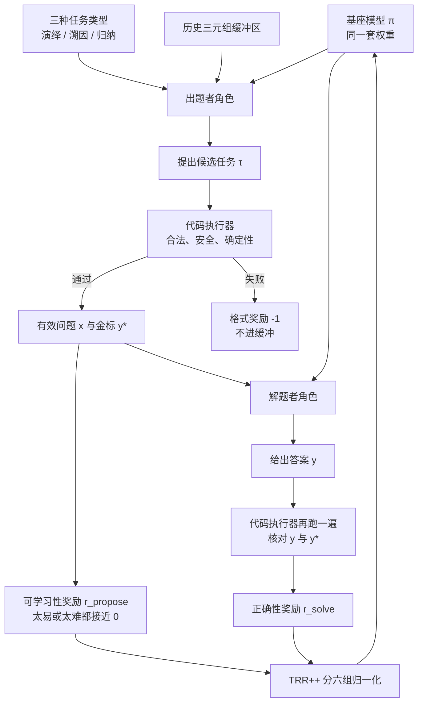
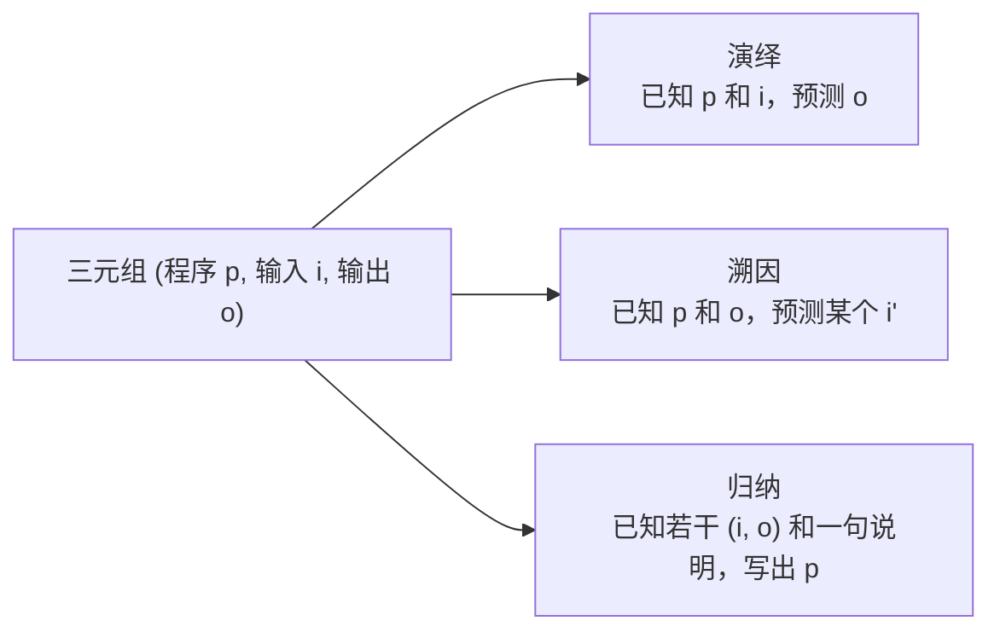

# Absolute Zero：零掉的是人类出题，不是老师；代码执行器成了唯一的环境

<!-- release-date: 2025-05-06 -->

> 本文依据清华大学、北京通用人工智能研究院（BIGAI）与宾夕法尼亚州立大学联合发布的 **Absolute Zero: Reinforced Self-play Reasoning with Zero Data**，即 arXiv:2505.03335v3、封面日期 October 17, 2025、共 52 页的版本。页码均指 PDF 本身的页码。v1 于 2025-05-06 首次公开，本文 `release-date` 取这一天。截至 2026-09-10 核验，arXiv 当前最新版本仍是 v3（2025-10-16 提交），与本地原件一致。文中会明确区分「论文写了什么」「本文如何解释它」「哪些是外部资料补充」。

## 读之前需要的最少背景

这篇论文只讲一件事：如果强化学习已经能用规则给答案打分，那题目本身还要不要人来出。

先把六个会反复出现的词说成人话。

- **可验证奖励强化学习（Reinforcement Learning with Verifiable Rewards，RLVR）**：不模仿某条标准推理过程，只看最终答案对不对。对了给正分，错了给负分，用程序而不是另一个模型来判。本站 [DeepSeek-R1](/reports/DeepSeek/DeepSeek-R1) 篇讲的就是这条路。
- **zero setting（零设置）**：R1 带出来的一种训练方式。跳过监督微调，不提供人类或更强模型写好的思维链，直接从基座模型出发，用任务奖励做强化学习。它零掉的是「推理过程」这一层监督，**没有** 零掉题目和标准答案。
- **出题者 / 解题者（proposer / solver）**：同一个语言模型的两种角色。出题者负责发明新任务；解题者负责把任务做出来。参数是共享的，不是两个独立模型。
- **程序三元组 $(p,i,o)$**：一段程序 $p$、一份输入 $i$、一份输出 $o$，满足 $o=p(i)$。这篇里所有推理任务都围着这个三元组转。
- **演绎 / 溯因 / 归纳（deduction / abduction / induction）**：不是哲学课定义。这篇里它们分别对应「三元组缺哪一块」——给程序和输入猜输出、给程序和输出猜输入、给若干输入输出对写出程序。
- **环境（environment）**：这里就是代码执行器。它同时干两件事：检查模型自己出的题是否合法，以及核对解题者的答案是否正确。

后面还会碰到 **任务相对 REINFORCE++（Task-Relative REINFORCE++，TRR++）**。它是这篇给多任务强化学习改的优势估计器：六个「任务类型 × 角色」各自算一条基线，而不是全 batch 混在一起。细节放到奖励那一节。

跨篇只留三句对照，避免把别的文章再讲一遍：

- [DeepSeek-R1](/reports/DeepSeek/DeepSeek-R1) 把 zero setting 走通了，但题目和答案仍是人准备的。
- 本站即将写的 Self-Rewarding-LM 与 SEAL，改的是 **模型权重怎么自己更新** ；本篇改的是 **任务和课程怎么自己长出来** 。
- [AIDE2](/reports/Weco/AIDE2) 改的是包在模型外面的 harness。本篇不改脚手架，改的是模型自己面对的题库。

## 一句话先说清

RLVR 已经把「谁来批改」从人手里拿走了。Absolute Zero 接着把「谁来出题」也拿走。

它留下来的老师只有一个：能跑代码的环境。模型自己出题、自己做题、用执行结果当奖励，整条训练曲线上不再喂入任何人类写的问答对。

论文把这套系统叫做 **Absolute Zero Reasoner（AZR）**。在 Qwen2.5-7B-Coder 上，它用零条外部题，把代码平均分做到 61.6、数学平均分做到 39.1、两者再平均得到 50.4，比当时最好的 zero 模型高 1.8 个绝对百分点（PDF p. 9，Table 1；引言里的 +1.8 见 PDF p. 2）。

这句话听起来像「完全不需要人」。论文自己没有这么写。真正零掉的是 **后训练阶段的人类题库** ；预训练权重、三种任务模板、提示词、禁止模块名单和代码执行器，全都还在。后文会把这条边界单独摊开。

先看它最终怎么转：



这是机制示意图，不是实测时间轴，根据 PDF p. 4 的 Figure 3、p. 5 的 Figure 4 与 p. 7 的 Algorithm 1 重画。

## 旧方法卡在哪：zero 其实没 zero 完

监督微调要三样东西：题目、标准推理过程、标准答案。RLVR 把中间那一层拿掉了，模型可以自己写思维链，只用结果对错来更新。R1 的 zero setting 再往前走一步：连冷启动蒸馏数据也不要，直接从基座开训。

论文指出，这一步之后人类监督并没有消失，只是换了位置（PDF p. 2–3）。题目分布、标准答案、以及「这批题该有多难」，仍然要专家来定。随着推理模型变强，构造大规模高质量题库会越来越贵；预训练领域已经有人把「人类数据见底」写成明确瓶颈（PDF p. 2）。更远一点的设想是：如果系统有朝一日超过出题的人，人出的题对它可能不再有学习价值（PDF p. 2）。

这是论文给 Absolute Zero 的动机。本文的读法更窄一些：**当前真正卡住的，不是「将来没有超人智能可学的题」，而是「RLVR 的可扩展性仍然绑在人类题库上」。** 超人智能那一段是立场，不是本篇实验能证明的事。

论文用 Figure 2 把三种范式画成一条「人类监督越来越少」的轴（PDF p. 2）：

| 范式 | 人要提供什么 | 模型自己干什么 |
|---|---|---|
| 监督微调 | 题目、思维链、答案 | 模仿 |
| RLVR（含 zero setting） | 题目和答案，外加一个验证器 | 自己写推理过程 |
| Absolute Zero | 一个可交互的环境 | 出题、做题、从环境反馈里学 |

第三行把数据扩展的负担从人类专家挪到了出题策略和环境身上（PDF p. 4）。公式写出来是：

$$
\mathcal J(\theta)=\max_\theta\ \mathbb E_{z\sim p(z)}\mathbb E_{(x,y^\star)\sim f_e(\cdot\mid\tau),\ \tau\sim\pi_\theta^{\mathrm{propose}}(\cdot\mid z)}\Big[\lambda r^{\mathrm{propose}}(\tau,\pi_\theta)+\mathbb E_{y\sim\pi_\theta^{\mathrm{solve}}(\cdot\mid x)}[r^{\mathrm{solve}}(y,y^\star)]\Big]
$$

（PDF p. 4，式 3）

符号按出现顺序读：

- $z$ 是出题时的条件，实践里就是从缓冲区抽几道旧题当例子；
- $\tau$ 是出题者吐出的原始任务；
- 环境 $e$ 和变换 $f_e$ 把它变成合法问题 $x$ 与金标 $y^\star$；
- $r^{\mathrm{propose}}$ 看出这道题对当前模型有没有学习价值；
- $r^{\mathrm{solve}}$ 看答案对不对；
- $\lambda\ge 0$ 用来权衡「探索新题」和「把题做对」。

**论文没有给出 $\lambda$ 的实际取值。** 超参表（PDF p. 23，Table 3）里没有这一项。实现上他们是把两个角色的奖励拼进同一个复合奖励，再用 TRR++ 联合更新，相当于把「出题」和「解题」当成多任务学习，而不是先调一个明确的 $\lambda$。

## 同一个模型，两份工作

大模型本来就会在同一种语言空间里既写题目又写答案，所以论文没有把出题者和解题者拆成两个网络（PDF p. 4）。每轮在线采样时，模型先看到任务类型和 $K$ 道自己从前出过的例子，并被明确要求「出一道和这些例子不一样的题」（PDF p. 4）。新题经过环境过滤，变成可验证的推理题；同一套权重再去解这些题。

条件变量 $z$ 在范式层面没有绑定死某一种实现（PDF p. 4）。AZR 的具体做法是：从不断增长的缓冲区里均匀抽 $K$ 条历史三元组，当作上下文例子。$K=6$（PDF p. 23，Table 3）。

缓冲区有三个用途（PDF p. 7）：

1. 给演绎和溯因的出题者当 few-shot 例子，逼它写出不同的程序；
2. 从演绎 ∪ 溯因的缓冲里抽一段程序 $p$，交给归纳出题者，让它为这段程序编一组输入和一句自然语言说明；
3. 如果本轮有效新题不够一个 batch，就从缓冲里均匀回填，避免训练步因为格式失败而空转。

演绎和溯因的新三元组只要合法就会进缓冲，**不管这道题最后有没有拿到出题奖励**。归纳同理（PDF p. 7）。缓冲因此会越积越杂，这也是后文「多样性在涨」的来源之一。

种子阶段不更新模型。若种子缓冲在第 0 步是空的，系统会退回到 Figure 5 那个恒等函数（PDF p. 6）：

```python
def f(x):
    return x
# 输入 "Hello World" → 输出 "Hello World"
```

论文强调：基座模型其实有能力从零开始把循环转起来；放进这个最简三元组，只是为了说明系统对种子的依赖可以低到这种程度（PDF p. 6）。种子程序会去掉全局变量和注释；自博弈开始之后新进缓冲的程序不再做这种清洗（PDF p. 7）。种子规模 $|D_{\mathrm{seed}}|=B\times S$，$S=4$ 在所有实验里固定（PDF p. 7）。按训练 batch 每组 64 条来算，每个任务类型一开始大约 256 条合法三元组。这个换算是本文根据 Table 3 的 `64 * 6` 做的，论文没有把 256 这个数字写出来。

官方仓库后来在 `data/` 里放了作者用各基座 prompt 出来的种子文件，并提供可选的 seeding 脚本。那是外部补充。论文正文的主张仍然是：循环可以从恒等函数起步，并不依赖一份外部题库来点火。

一轮自博弈按 Algorithm 1 走（PDF p. 7）。把伪代码翻成动作顺序：

1. 用基座做 `InitSeeding`，得到三个缓冲 $D_{\mathrm{ded}}$、$D_{\mathrm{abd}}$、$D_{\mathrm{ind}}$。
2. 每一轮先进入 **PROPOSE**。归纳出题：从演绎 ∪ 溯因缓冲抽一段程序 $p$，让出题者生成 $N$ 个输入和一句说明 $m$；环境算出输出后，整包写进归纳缓冲。
3. 同一轮里，演绎和溯因各自抽 $K$ 条历史三元组当参考，出题者生成新的 $(p_\pi,i_\pi)$；环境跑过语法、安全和确定性三关，得到 $o_\pi$，再写进对应缓冲。
4. 然后进入 **SOLVE**。三种任务各从自己的缓冲里准备一批 $(x,y^\star)$，解题者给出 $y_\pi$。
5. 用本轮的新三元组和解答，算出 $r_{\mathrm{propose}}$ 与 $r_{\mathrm{solve}}$。
6. 用 TRR++ 一次更新同一套 $\pi_\theta$。

有一处很容易读漏：Algorithm 1 里，归纳任务的 `ValidateAndConstruct` 标注只写了 `syntax`，演绎和溯因写的是 `syntax, safety, determinism`（PDF p. 7）。正文 3.3.3 节又说归纳要对每个输入跑完整的任务验证，全部产出合法输出才算有效（PDF p. 7）。**伪代码和正文不完全对齐。** 更稳的读法是按 3.3.3 节：三种任务都要过完整性检查；安全名单和确定性检查在演绎 / 溯因上写得最明确，归纳是否逐条做确定性双跑，PDF 没有单独给一段实现说明。

## 三种推理模式：缺三元组的哪一块

为什么选代码，而不是直接让模型出数学题？论文给了两条理由：编程语言是图灵完备的；已有证据表明代码训练能抬推理（PDF p. 4）。更实际的一条写在 3.2 节：代码执行器既能当灵活接口，又能当可验证环境，题目的构造、执行和校验可以全自动（PDF p. 6）。

于是 AZR 的一道推理题就是一个三元组 $(p,i,o)$，其中 $o=p(i)$。Figure 4 把三种模式画在同一个训练总图里，记号非常直白（PDF p. 5）：

- 演绎：$? = P(I)$，已知程序和输入，问输出；
- 溯因：$O = P(?)$，已知程序和输出，问输入；
- 归纳：$O = ?(I)$，已知输入输出，问程序。

三种模式分别让模型推断三元组里缺失的那一块（PDF p. 6）：



根据 PDF p. 5 的 Figure 4 与 p. 6 的 3.2 节重画。

### 演绎：顺着程序往下走

出题者看到任务类型 `deduction` 和 $K$ 条参考例子，生成一对 $(p,i)$。环境执行 $p(i)$ 得到 $o$，没有报错就做成完整三元组进缓冲。

解题者拿到 $(p,i)$，预测 $o_\pi$。核对用的是 Python 里带类型意识的值相等，集合顺序、分数写法这类表面差异不算错（PDF p. 6）。

这是三种模式里最像「单步执行器」的一种。模型要做的是逐步模拟，把中间状态记清楚。附录 Figure 25 给了一个滑动窗口最长子数组的例子：模型把 `char_freq` 的每一步增减都写下来，最后给出 4（PDF p. 32）。

### 溯因：从结果反推一个说得通的输入

出题流程几乎和演绎一样，只是任务类型改成 `abduction`。解题者拿到的是 $(p,o)$，要给出一个 $i_\pi$，使得 $p(i_\pi)=o$。

关键设计在验证，不在出题。程序不一定是双射，同一个输出可能对应很多输入，所以系统**不要求** $i_\pi$ 等于出题时用的那个金标输入，只要求执行后的输出值相等（PDF p. 6、p. 8）。Figure 7 里模型猜的输入和金标不同，但跑出来一样，就算对（PDF p. 11）。

这是三种模式里最像搜索的一种。模型会提出一个输入、自己在脑子里跑一遍、发现对不上、再换一个，直到输出匹配。引言把 token 长度增长最大的任务指到溯因，原因就是这种试错（PDF p. 3）。

### 归纳：从部分输入输出写出程序

归纳不能只给一对 $(i,o)$，否则能解释这些点的函数有无穷多个。出题者的做法是：从演绎和溯因缓冲里抽一段已经合法的程序 $p$，再生成 $N$ 个新输入和一句自然语言说明 $m$，环境算出对应输出，存成 $(p,\{(i_n,o_n)\},m)$（PDF p. 6）。论文对 $m$ 不加约束。

解题者只看到**一半**输入输出对和那句说明，必须写出一段程序 $p_\pi$，在留下的隐藏用例上全部命中。留一半不给看，是为了阻止模型用一堆 `if-else` 把看见的例子背下来（PDF p. 6）。

Figure 23 的例子里，出题者给了一段「按字典替换再求和」的程序，编了 10 个输入，并写了一句「你能从这些输入输出里看出规则吗」（PDF p. 30）。解题阶段会把其中 5 对藏起来。

三种模式不是装饰。后文消融会显示：拿掉归纳，数学平均分从 38.4 掉到 33.3；只留演绎，再掉到 32.0（PDF p. 12，Table 2）。

把附录里的真实出题 / 解题例子对着三种模式看一遍，比只记「缺哪一块」要清楚得多。这些例子都是训练日志，不是评测集。

**演绎出题（Figure 20，PDF p. 27）。** 模型先用自然语言给自己下约束：函数至少有一个参数、必须确定性、要跨多次数据变换做状态追踪、不能碰禁用词。然后写出一段类似「股票利润 + 预算」的双重循环，输入是 `[7, 1, 5, 3, 6, 4], 7`。新程序要先被执行验证，才能进缓冲。出题者在这里做的不是「从题库里挑一道」，而是「看着 $K$ 个旧例子，编一段足够绕、但还能跑的新代码」。

**溯因出题（Figure 22，PDF p. 29）。** 模型在注释里规划「用锯齿或爬山模式填矩阵」，再写一个从乱序列表重建二维矩阵的函数，输出是一串整数。注释在出题阶段已经开始当草稿纸用了，不只出现在归纳答题里。

**溯因解题（Figure 7 与更完整的 Figure 24，PDF p. 11、p. 31）。** 给定函数和输出 `1`，模型要反推输入。函数做的是：累加前缀和，再找一对前缀差等于 target，返回那一对里较早的前缀和。模型先试 `[1, 2], 1`，对不上；再试 `[1, 0], 1`，还不对；最后试到 `[2, -1, 1], 1`，前缀和 `[2, 1, 2]` 里 $2-1=1$，命中。金标输入并不是这组，但执行结果一样，判对。这就是「程序不一定双射」那条验证规则在现场起作用。

**演绎解题（Figure 25，PDF p. 32）。** 题目是最长至多 $k$ 种元素的子数组。输入 `[1, 2, 1, 2, 3, 2, 1], 2`。模型把窗口起点、`char_freq` 和每次收缩都逐步写下来，给出 4。这是正向模拟，几乎没有试错。

**归纳解题（Figure 26，PDF p. 33）。** 模型拿到说明「排序后第 $i$ 个元素乘 $(n-i)$ 再求和」，以及 5 个可见用例。它先按说明手算，发现自己把乘数写成了 $n-i$ 从 3 起，对不上 20；再修正乘数，逐个用例核对，最后给出函数。论文特别写了一句：给完函数之后，模型还会把可见用例一个一个跑过去确认（PDF p. 33）。隐藏的那一半用例才是真正打分的地方。

**一个论文当「有趣」收下的旁支：中英混写（Figure 27，PDF p. 35）。** 演绎解题时，模型在逐步枚举配对乘积的过程中突然插入一句中文：「避免重复和反向的对子，例如 $(2,3)$ 和 $(3,2)$」。这不是评测指标，也不是训练目标。它说明 AZR 并没有把输出语言钉死；R1 模板管的是标签，不管思维链用哪种自然语言。

主文还说模型能出多样程序：字符串操作、动态规划、以及用海伦公式算三角形面积这类实用题（PDF p. 10）。这些都是定性观察，没有按题型做过频率统计。

## 奖励：出题看「好不好学」，解题看「对不对」

### 出题奖励：太易和太难都给 0

先前的工作已经说明，任务难度对推理强化学习很关键（PDF p. 5）。AZR 的出题者因此不能只追求「出得越难越好」。它用同一模型的解题者角色，在非零温度下做 $G$ 次蒙特卡洛采样，得到平均成功率 $\bar r_{\mathrm{solve}}$，再定义：

$$
r_{\mathrm{propose}}=\begin{cases}
0,&\text{if }\bar r_{\mathrm{solve}=0}\\
1-\bar r_{\mathrm{solve}},&\text{otherwise.}
\end{cases}
$$

（PDF p. 5，式 4）

读法很直接：

- 解题者一次都做不对，$\bar r_{\mathrm{solve}}=0$，这道题对当前模型没有学习信号，出题奖励为 0；
- 每次都做对，$\bar r_{\mathrm{solve}}=1$，奖励也是 0；
- 偶尔做对，奖励最大。这时梯度最肥。

$G$ 在超参表里对应「N Samples to Estimate Task Accuracy = 8」（PDF p. 23）。也就是说出题奖励本身就要额外跑 8 次解题采样。这是这项设计的显式代价。

### 解题奖励：对就是 1，错就是 0

$$
r_{\mathrm{solve}}=\mathbb I(y=y^\star)
$$

（PDF p. 5，式 5）

相等关系按 Python 值相等来判。溯因用 $p(i_\pi)=p(i^\star)$，演绎用 $o_\pi=o^\star$，归纳用隐藏用例上 $p_\pi(i_n^\star)=o_n^\star$ 全部成立（PDF p. 8）。

### 复合奖励：格式错误比答错罚得更重

两个角色的主奖励再叠一层格式惩罚，写法来自 DeepSeek-R1（PDF p. 5，式 6）：

$$
R(y_\pi)=\begin{cases}
r_{\mathrm{role}},&\text{格式正确，role}\in\{\mathrm{propose},\mathrm{solve}\}\\
-0.5,&\text{答错但格式正确}\\
-1,&\text{格式错误}
\end{cases}
$$

出题者的「格式正确」不只是 XML 标签。它必须产出能通过过滤的合法三元组，否则直接按格式失败处理（PDF p. 6）。所有角色统一走 DeepSeek R1 的 `<think> … </think><answer> … </answer>` 模板，原文完整提示见 Figure 35（PDF p. 41）。

式 6 中间那一行「答错但格式正确给 $-0.5$」和式 5 的 0/1 正确性奖励如何叠加，论文写得不够干净。一种读法是：格式过关之后再用 $r_{\mathrm{role}}$，答错时 $r_{\mathrm{solve}}=0$，再被写成 $-0.5$；另一种读法是 $-0.5$ 只覆盖「格式对、内容错」的中间态。**论文没有把这两条公式的合成顺序写死。** 这是复现时需要对照官方代码的地方，本文不替它补。

## 环境怎么当老师：三道闸，再加三种判分模板

出题阶段的合法化检查有三步（PDF p. 7–8）：

1. **程序完整性。** 用 Python 跑 $p(i)$，不报错并且有返回值，才收集 $o$。对应代码模板是 Figure 11（PDF p. 24）：把程序和 `repr(f(inputs))` 拼起来 `exec`。
2. **程序安全。** 禁止一批可能伤害执行环境的模块。正文点名 `os.sys`、`sys`、`shutil`；完整名单在 Figure 10（PDF p. 24），并且写进了出题提示：

| 被禁模块 |
|---|
| logging、random、multiprocessing、pebble、subprocess |
| threading、datetime、time、hashlib、calendar |
| bcrypt、os.sys、os.path、sys.exit、os.environ |

3. **确定性。** 只接受确定性程序。定义是：对任意合法输入，独立执行任意多次，输出都相同（PDF p. 8，式 7）。实现上做不到「任意多次」，于是用有限次近似，**所有实验固定 $j=2$**（PDF p. 8）。Figure 15 的模板是连跑两次，不相等就抛 `Non-deterministic code`（PDF p. 25）。

论文自己承认：随机程序能覆盖更大的行为空间，值得以后纳入；现在砍掉它们，只是为了让验证器保持简单（PDF p. 8）。

过了这三关，才按任务类型把三元组的一部分交给解题者：演绎给 $(p,i)$，溯因给 $(p,o)$，归纳给一半用例加说明 $m$。本轮有效题不够 batch 就从历史合法题里回填（PDF p. 8）。

三种答案核对的代码被论文直接印在附录里，这是这份 52 页里最不应该被当成装饰的部分：

| 任务 | 图 | 判定方式（PDF p. 25） |
|---|---|---|
| 溯因 | Figure 12 | `{gold_output} == f({agent_input})` |
| 演绎 | Figure 13 | `eval({gold_output}) == eval({agent_output})` |
| 归纳 | Figure 14 | 对所有金标输入跑 `f`，看输出是否全部命中 |
| 确定性 | Figure 15 | 连续调用两次 `f({inputs})`，结果必须相同 |

Figure 14 的代码块标题是 `EVAL_FUNCTION_PREDICTION_TEMPLATE`，最后一行却 `exec` 了 `EVAL_OUTPUT_PREDICTION_TEMPLATE`。这是论文排版上的拷贝错误，还是实现里真用错了变量名，**仅凭 PDF 无法判断**。读到这里应该去对照仓库，不要按图抄进生产代码。

出题和答题的提示词也全部公开，对应 Figures 36 到 41（PDF p. 42–46）。六张模板不是点缀，它们规定了模型实际上被允许发明什么样的题。

| 图 | 角色 | 任务 | 页 |
|---|---|---|---|
| Figure 35 | 共用外壳 | DeepSeek R1 的 `<think>` / `<answer>` 模板 | p. 41 |
| Figure 36 | 出题 | 溯因：编程序 + 一个输入，让别人从输出反推输入 | p. 42 |
| Figure 37 | 出题 | 演绎：编程序 + 一个输入，让别人从输入推输出 | p. 43 |
| Figure 38 | 出题 | 归纳：给一段已有程序，编 $N$ 个输入和一句说明 | p. 44 |
| Figure 39 | 解题 | 溯因：给代码和输出，在 ` ```input` 标签里写一个可能输入 | p. 45 |
| Figure 40 | 解题 | 演绎：给代码和输入，在 ` ```output` 标签里写输出 | p. 45 |
| Figure 41 | 解题 | 归纳：给一半输入输出对 + 说明，在 ` ```python` 里写 `f` | p. 46 |

共同约束包括：入口函数必须叫 `f`、必须有返回值、必须确定性、10 秒内跑完、禁止随机 / 时间 / I/O / 打印 / 外部状态。自定义类允许，但要写在代码最上面。出题模板把这件事说成「IQ 测试」，评估标准公开写了「从代码和输出反推有多难」「要和参考例子足够不同」。禁用词名单以 `{LIST_OF_FORBIDDEN_PACKAGES}` 的形式嵌进提示，连注释里出现这些词都不允许（PDF p. 42–43）。

归纳出题还有两条别人没有的约束（PDF p. 44，Figure 38）：输入要覆盖函数的输入空间，说明可以是自然语言或改写成一道编程题，但**不能把源码写进说明**。这是为了防止出题者把答案从 $m$ 里泄漏给解题者。论文对 $m$ 的内容不加约束，这条禁令是唯一硬限制。

**可迁移的部分**：验证器要先于 RL 算法设计。这篇能把人类题库拿掉，前提是「任务是否合法」和「答案是否正确」都能用同一次代码执行来回答。换到不能执行的领域，出题者立刻失去接地。

## TRR++：六个任务角色，六条基线

AZR 同时训练 2 个角色 × 3 种任务，是典型的多任务强化学习（PDF p. 8）。标准 REINFORCE++ 用整个 batch 的奖励均值和标准差做一条全局基线（附录 A，PDF p. 23，式 9–10）。AZR 认为这条基线太粗：演绎解题和归纳出题的奖励尺度本来就不一样。

于是他们改成按「任务类型 × 角色」分成六组，组内归一化：

$$
A^{\mathrm{task,role}}_{\mathrm{norm}}=\frac{r-\mu_{\mathrm{task,role}}}{\sigma_{\mathrm{task,role}}},\quad \mathrm{task}\in\{\mathrm{ind,ded,abd}\},\ \mathrm{role}\in\{\mathrm{propose,solve\}}
$$

（PDF p. 8，式 8）

论文把它定位成 GRPO 那种「每道题一条基线」和 REINFORCE++ 那种「全 batch 一条基线」之间的插值（PDF p. 8）。名字就叫 **Task-Relative REINFORCE++（TRR++）**。

还有两个和 DAPO / GRPO 对照时很容易漏掉的选择（PDF p. 23，Table 3）：

- **不做 KL 惩罚**，损失和奖励里都不加；
- **N Rollouts = 1**，解题更新并不对同一道题采一组回答。

也就是说，AZR 没有走「一题 16 个回答、组内比谁好」的 GRPO 路线，而是靠六组 batch 基线来降方差。出题奖励那 8 次采样是另外一笔账，只用来估计可学习性，不直接当解题的组相对优势。

附录 A 把底层目标写成带裁剪的 PPO 形式，重要性比 $s_t(\theta)$ 仍在，裁剪 $\epsilon$ 也在，但超参表没有给出 $\epsilon$ 的值（PDF p. 23）。熵系数是 0.001。这些是论文写了的；PPO 裁剪具体取多少，论文没写。

**代价**：六条基线意味着每个任务角色都要凑够一批样本才有稳定的均值和方差。这解释了为什么训练 batch 被设计成 `64 * 6`（PDF p. 23）——不是随便乘一个 6，而是六个配置各 64 条。

**可迁移的部分**：只要奖励来自不同任务头，就不要默认「全 batch 一个均值」。先问奖励的量纲是不是同一件事。TRR++ 本身很轻，改的是统计范围，不是算法骨架。

## 训练配方：论文写明的，和论文没写的

主实验设置汇总如下。除另有说明，全部来自 PDF p. 8–9 与 Table 3（PDF p. 23）。

| 项目 | 取值 | 出处 |
|---|---|---|
| 主模型 | Qwen2.5-7B、Qwen2.5-7B-Coder | p. 8 |
| 额外规模 | Qwen2.5-Coder-3B / 14B、Qwen2.5-14B、Llama-3.1-8B | p. 8 |
| 框架 | 建立在 veRL 上 | p. 23 |
| 执行器 | 接入了 QwQ 的 Python executor 组件；论文建议更安全的场景改用 E2B 这类 API | p. 23 |
| 硬件 | A800 集群；每次实验大约 3–5 天 | p. 23 |
| 优化器 | AdamW，学习率 $1\times 10^{-6}$，梯度裁剪 1.0 | p. 23 |
| Batch | $64\times 6$（2 角色 × 3 任务） | p. 8、p. 23 |
| 总步数 | 500 | p. 23 |
| 最大提示 / 回复 | 6144 / 8096 | p. 23 |
| 最大程序数 | 16384 | p. 23 |
| 参考例子 $K$ | 6 | p. 23 |
| 估计题目难度的采样 $G$ | 8 | p. 23 |
| 解题 rollout 数 | 1 | p. 23 |
| 温度 / top-p | 1.0 / 1.0 | p. 23 |
| KL | 损失和奖励都不加 | p. 23 |
| PPO epoch | 1 | p. 23 |
| 熵系数 | 0.001 | p. 23 |
| 评测解码 | 全部 greedy，保证可复现 | p. 9 |

「最大程序数 16384」论文没有解释是缓冲上限还是别的计数。本文按缓冲容量来读，但这是解释，不是原文原话。

Table 3 写总步数 500，但正文图的横轴对不上同一条尺。Figure 1 的总平均星标大约在 300 步；Figure 6a 的 ID 曲线画到约 250 步；Figure 16 的 7B-Base ID 画到约 270 步；Figures 30–33 的 OOD 分解有的画到 250，有的画到 400（PDF p. 1、p. 10、p. 25、p. 37–40）。论文没有说明这些曲线是 500 步里的前缀、早停点，还是不同随机种子的不同长度运行。读图时只能把它们当成各自一次运行的轨迹，不能把 250 步的 ID 图和 400 步的 OOD 图当成同一条训练的两个投影。

超参表里还有一行容易和 DAPO / GRPO 搞混：解题 `N Rollouts = 1`，但出题奖励要另采 8 次。按 batch `64 * 6` 粗算，每一步光出题奖励就要额外跑 $64\times 3\times 8$ 次解题采样，这还没算真正用于更新的那 64×3 次解题。论文没有报告这次额外采样占墙钟时间的比例。上面这组乘法是本文的推算，原文只分别列出了两个超参。

评测分成两类（PDF p. 8–9）：

- **分布内（ID）**：CruxEval-I（溯因）、CruxEval-O（演绎）、LiveCodeBench-Execution（演绎）。这三件和训练任务同构，用来看自博弈有没有在自己的游戏里变强。
- **分布外（OOD）**：论文更强调这一头。代码用 HumanEval+、MBPP+、LiveCodeBench Generation v1–5；数学用 AIME'24、AIME'25、AMC'23、MATH500、Minerva、OlympiadBench。总平均 $\mathrm{AVG}=(\mathrm{CAvg}+\mathrm{MAvg})/2$。

对照模型按数据来源分成三拨（PDF p. 9，Table 4）：有人出的代码题（AceCoder 22k、CodeR1 2k/12k）、有人出的数学题（SimpleRL-Zoo 8.5k、Oat-Zero 8.5k、ORZ 57k、PRIME-Zero 457k 数学 + 27k 代码）、以及 AZR 的「No data」。PRIME-Zero 在 Table 1 里写成 484k，和 Table 4 的 457k+27k 对得上。

基线本身几乎都只在代码或数学其中一个域上做 RLVR；论文点名只有 Eurus-2-7B-PRIME-Zero 是两域一起训的（PDF p. 9）。AZR 则是只在代码环境里自博弈，却同时拿代码和数学的 OOD 分数说话。

## 主结果：零外部题，总平均仍然最高

Table 1 是全文的主表（PDF p. 9）。下面只保留理解结论所必需的列。加号是相对各自基座的绝对百分点。

| 模型 | 基座 | 题量 | 代码均 | 数学均 | 总均 |
|---|---|---:|---:|---:|---:|
| Qwen2.5-7B | — | — | 52.0 | 27.5 | 39.8 |
| Qwen2.5-7B-Ins | — | — | 56.3 | 37.0 | 46.7 |
| Qwen2.5-7B-Coder | — | — | 56.6 | 23.9 | 40.2 |
| Qwen2.5-7B-Math | — | — | 45.0 | 29.5 | 37.3 |
| AceCoder-Rule（Coder） | Coder | 22k | 60.0 | 28.5 | 44.3 |
| CodeR1-12k | Ins | 12k | 61.3 | 33.5 | 47.4 |
| PRIME-Zero | Coder | 484k | 37.2 | **45.8** | 41.5 |
| SimpleRL-Zoo | Base | 8.5k | 54.0 | 38.5 | 46.3 |
| Oat-Zero | Math | 8.5k | 45.5 | 44.3 | 44.9 |
| ORZ | Base | 57k | 55.6 | 41.6 | 48.6 |
| **AZR** | Base | **0** | 55.2（+3.2） | 38.4（+10.9） | 46.8（+7.0） |
| **AZR** | Coder | **0** | **61.6（+5.0）** | 39.1（+15.2） | **50.4（+10.2）** |

论文自己的三条结论，需要连着边界一起读（PDF p. 9）：

1. **AZR-Coder-7B 拿下 7B 总平均和代码平均的最高点。** 总平均 50.4 比此前最好的 ORZ 48.6 高 1.8；代码平均 61.6 比此前最好的 CodeR1-12k 61.3 高 0.3。这两个「SOTA」都是在「Qwen2.5-7B 家族、这张表里的对照」这个圈子里说的。
2. **它没有在数学上超过专训数学的 zero 模型。** PRIME-Zero 的数学均 45.8、ORZ 41.6、Oat-Zero 44.3，都高于 AZR-Coder 的 39.1。论文在引言里的原话是「数学上与显式用领域监督微调的 zero 推理模型相比有竞争力」（PDF p. 2），不是「数学第一」。
3. **跨域迁移是这张表真正意外的地方。** 专家代码模型做完 RLVR 之后，数学平均只涨 0.65；AZR-Base 和 AZR-Coder 在只见过自己出的代码推理题的前提下，数学分别涨 10.9 和 15.2。反向看，数学模型在代码上平均只涨 2.0，AZR 的代码涨幅是 3.2 和 5.0（PDF p. 9）。

把 AZR 两行相对各自基座的分项也摊开，避免只记住两个平均分（PDF p. 9，Table 1）：

| 基准 | AZR-Base | 相对 7B Base | AZR-Coder | 相对 7B Coder |
|---|---:|---:|---:|---:|
| HumanEval+ | 71.3 | -1.9 | 83.5 | +3.0 |
| MBPP+ | 69.1 | +3.8 | 69.6 | +0.3 |
| LiveCodeBench v1–5 | 25.3 | +7.8 | 31.7 | +11.8 |
| AIME'24 | 13.3 | +6.6 | 20.0 | +13.3 |
| AIME'25 | 13.3 | +10.0 | 10.0 | +6.7 |
| AMC'23 | 52.5 | +15.0 | 57.5 | +17.5 |
| MATH500 | 74.4 | +9.6 | 72.6 | +22.6 |
| Minerva | 38.2 | +13.2 | 36.4 | +19.1 |
| OlympiadBench | 38.5 | +10.8 | 38.2 | +16.3 |

几件从表里能直接读出来、但平均分会盖住的事：

- AZR-Coder 的 LiveCodeBench 从 19.9 涨到 31.7（+11.8），是代码三项里涨最多的；HumanEval+ 也到了全表最高的 83.5。MBPP+ 几乎没动（+0.3）。
- 数学增益很散，不是只刷某一套题。Coder 的 MATH500 +22.6、Minerva +19.1、OlympiadBench +16.3、AMC'23 +17.5。AIME'25 反而低于 Base 变体（10.0 vs 13.3），30 题集合加上 greedy 解码，这种反转不必过度解释。
- AZR-Base 的 HumanEval+ 从 73.2 掉到 71.3（-1.9）。总平均上涨不能掩盖单项回撤。后文 14B-Base 的 HumanEval+ 掉得更狠。
- Figure 1 左边那张对数轴把对照方法的人类题量画出来了（PDF p. 1）：Oat-Zero / SimpleRL-Zoo 8.5k，ORZ 57k，CodeR1 12k，AceCoder 22k，PRIME-Zero 约 457k。AZR 停在 0，并标了星。右边总平均的红色虚线大约在 0.486（ORZ），蓝色星标大约落在 300 步附近的 0.504。中间点是本文按图估计的，正文没有给。

Figure 1 把同一件事画成四张图（PDF p. 1）：左边是各方法用了多少人类题，AZR 停在 0，PRIME-Zero 停在约 457k；中间两张是训练过程中数学域和代码域的曲线；右边总平均里，红色虚线是此前 SOTA（约 0.486，对应 ORZ），蓝色星标大约落在 300 步附近的 0.504。曲线读数是本文按图估计的，正文没有给这些中间点。

附录还把 7B / 7B-Coder / 14B / 14B-Coder 的逐项 OOD 曲线画在 Figures 30–33（PDF p. 37–40）。作者的观察是：AZR 训练步数比典型 zero 推理模型更长；静态题库容易过拟合，动态出题让这件事不那么容易发生（PDF p. 24）。这是作者观察，没有对照实验证明「动态出题 = 不过拟合」。

分布内三条曲线在 Figure 16（PDF p. 25）：CruxEval-I / O 和 LCB-Execution 随训练上升，大约从 0.40 一带爬到 0.55–0.65。论文自己说，这三条和更广义的代码 / 数学能力并非完美相关，只适合当任务内进度的代理指标（PDF p. 24）。

## 消融：三种任务和出题者训练，缺一就掉分

资源不够，消融只在 AZR-Base-7B 上做（PDF p. 11）。Table 2（PDF p. 12）：

| 实验 | 任务 | 参考例子 | 训练角色 | 代码均 | 数学均 | 总均 |
|---|---|---|---|---:|---:|---:|
| 只留演绎 | Ded | 不变 | 不变 | 54.6 | 32.0 | 43.3 |
| 去掉归纳 | Abd, Ded | 不变 | 不变 | 54.2 | 33.3 | 43.8 |
| 去掉历史参考 | 不变 | 0 | 不变 | 54.4 | 33.1 | 43.8 |
| 只训练解题者 | 不变 | 不变 | Solve Only | 54.8 | 36.0 | 45.4 |
| 完整 AZR | Abd, Ded, Ind | $K$ | 两个角色 | **55.2** | **38.4** | **46.8** |

读这张表时有两个容易夸大的点。

第一，**掉分几乎都发生在数学上，代码只在 54.2–55.2 之间晃。** 三种代码推理任务对 OOD 数学的贡献，比它们对 OOD 代码的贡献更明显。这和「跨域迁移」那条主结论是对得上的：缺一种推理模式，泛化先裂。

第二，这是逐项拿掉，不是析因设计。不能把「完整 46.8 − 只留演绎 43.3 = 3.5」理解成归纳加溯因各自值多少。论文的原话只是：三种任务互补，每一种都以不同方式贡献（PDF p. 11）。

出题者两边的消融同样老实（PDF p. 12）：

- 不用动态的 $K$ 条历史三元组、改成固定提示，数学掉 5 分、代码掉 1 分。论文猜测是多样性与覆盖变差。
- 出题者完全不训练、只用当前学习者临时出题，总平均从 46.8 掉到 45.4（-1.4）。出题者训练有用，但增益小于任务类型。作者认为出题者还有提升空间，比如减轻多任务干扰、或显式奖励问题空间覆盖（PDF p. 12）。

**可迁移的部分**：如果系统里有一个「谁来出下一道题」的模块，不要把它当成不可训练的数据管道。哪怕只是轻量更新，也比固定提示强。但在这篇里，真正拉开数学分的是任务类型的多样性，不是出题者本身。

## 规模：更大的基座，吃到更多增益

Figure 6 把 ID 曲线和 OOD 表放在一起（PDF p. 10）。OOD 数字如下：

| 模型族 | 变体 | 代码均 | 数学均 | 总均 |
|---|---|---:|---:|---:|
| Llama3.1-8B | 基座 | 28.5 | 3.4 | 16.0 |
| Llama3.1-8B | + SimpleRL | 33.7（+5.2） | 7.2（+3.8） | 20.5（+4.5） |
| Llama3.1-8B | + AZR | 31.6（+3.1） | 6.8（+3.4） | 19.2（+3.2） |
| Qwen2.5-3B Coder | 基座 | 51.2 | 18.8 | 35.0 |
| Qwen2.5-3B Coder | + AZR | 54.9（+3.7） | 26.5（+7.7） | 40.7（+5.7） |
| Qwen2.5-7B Coder | 基座 | 56.6 | 23.9 | 40.2 |
| Qwen2.5-7B Coder | + AZR | 61.6（+5.0） | 39.1（+15.2） | 50.4（+10.2） |
| Qwen2.5-14B Coder | 基座 | 60.0 | 20.2 | 40.1 |
| Qwen2.5-14B Coder | + AZR | 63.6（+3.6） | 43.0（+22.8） | 53.3（+13.2） |

论文据此写了那句被广泛引用的话：3B / 7B / 14B 的总增益分别是 +5.7、+10.2、+13.2，「继续放大对 AZR 有利」（PDF p. 3、p. 10）。ID 曲线上，3B 在大约 150 步后进入平台，7B 和 14B 在 200 步之后还在爬（PDF p. 10，Figure 6a）。这些读数来自图，正文没有给平台点的精确步数。

分项见 Table 5（PDF p. 34），有几处主表概括里看不到的裂痕：

- **14B-Coder 的数学涨幅是整篇最大的单点之一**：AIME'24 从 0.0 到 23.3，AIME'25 从 0.0 到 20.0，AMC'23 从 37.5 到 65.0，MATH500 从 54.8 到 78.6。
- **14B-Base 的 HumanEval+ 从 78.0 掉到 70.7。** 同一行 LiveCodeBench 从 21.7 涨到 35.2，数学全面上涨。AZR 不是对所有代码基准都单调变好。
- **Llama 上 AZR 没有打过 SimpleRL。** 总平均 19.2 对 20.5；MBPP+ 甚至从 53.7 掉到 50.8。论文把 Llama 的 +3.2 写成「较弱模型上仍有中等提升」，并承认增益更有限，和「基座越强、AZR 吃得越多」一致（PDF p. 10）。它没有把「没打过 SimpleRL」写成显式失败，但表就在那里。

Figure 8 的 pass@k 用来回答另一个担心：RL 之后多样性是不是塌了（PDF p. 12）。评测设置是温度 0.6、top-p 0.95、最长 16k、k 到 512。AZR-Base-7B 在三个代码基准和 AIME25 上，高 k 仍然不低于基座；唯一例外是 AIME24 的 k=512。论文的结论是：RL 之后仍保持宽覆盖，和测试时扩展兼容（PDF p. 12）。

Figure 9 把 AZR-Base-7B 放到 MMLU-Pro 上，对照 ORZ-7B、Qwen2.5-7B、SimpleRL-Zoo-7B，greedy、16k 上限（PDF p. 13）。正文只说 AZR 的科目平均和总体平均都更高，**没有给出具体分数**。从条形图目视，AZR 的 Overall Average 大约在 0.50 附近，其余三条多在 0.38–0.45。这是读图，不是表内数字。

## 六个发现：哪些被实验托住，哪些只是看见了

引言把六个「有趣发现」单列出来（PDF p. 3）。下面按证据强度重排，不按原文顺序。

### 1. 代码先验会放大推理（实验支持，但样本很少）

Qwen-Coder-7B 起步数学比 Qwen-7B 低 3.6 分（23.9 vs 27.5）。两边都做完 AZR 之后，Coder 的数学均 39.1，Base 是 38.4，反超 0.7（PDF p. 3、p. 10）。论文的解释是：初始代码能力可能是 AZR 里更广推理能力的催化剂。

支持这项说法的对照其实就这两条 7B 曲线。3B / 14B 没有「同尺寸 base vs coder」的完整并排叙事。14B-Base 做了 AZR（Table 5），但引言的「反超」只写了 7B。**把它当成一条有方向的观察可以，当成已经被规模验证的定律不行。**

### 2. 跨域迁移比普通 RLVR 更强（实验支持）

主表已经给了 +0.65 vs +10.9 / +15.2 这组对比（PDF p. 9）。消融进一步显示，拿掉任务类型之后，裂开的主要是数学而不是代码（PDF p. 12）。把这两处放在一起，更像是：在可执行的代码三元组上被迫做三种方向相反的推理，会逼出一种能搬到数学题上的通用程序思维。

本文的补充解释——不是论文原话——是：演绎像正向执行，溯因像反推约束，归纳像写可泛化规则。数学解题经常要在这三者之间切换。AZR 并没有见过 MATH 的题面，但见过大量「给部分信息、补上缺失的那一块」。

### 3. 更大基座增益更大（实验支持，但还不是定律）

3B / 7B / 14B Coder 的 +5.7 / +10.2 / +13.2 是硬数字（PDF p. 10）。论文明确说，未来要去查 Absolute Zero 范式下的 scaling law，现在还没有（PDF p. 10）。Llama 那一组则提醒：换模型族之后，增益会跟着基座本身的能力一起变小。

### 4. 注释变成中间计划（观察）

归纳解题时，模型常常在最终代码里用注释穿插步骤计划，形态接近 ReAct（PDF p. 3、p. 11）。Figure 21 给出 AZR-Coder-14B 训练中的一段：先过滤奇数、再求和、再反转、再求积、再求数位和，每一步都写在注释里，然后才写真正的语句（PDF p. 28）。类似行为也出现在 DeepSeek Prover V2（671B）的形式化证明里，论文拿来当对照（PDF p. 3）。

这不是消融证明「注释导致了更高分」。它是训练日志里反复出现的现象。作者的建议停留在：在其他长答案领域，允许模型使用中间草稿纸，可能有好处（PDF p. 3）。

附录 D.5 还提供了一条反证：如果在出题之后把注释和文档字符串全部剥掉再交给解题者，性能会明显下降（PDF p. 52）。作者的解释是，出题者和解题者之间几乎只剩下代码这一条通信通道；注释相当于一种「随代码走的留言」，能让一些原本解不了的题变得可解，从而让解题者有东西可学。**剥掉注释会掉分，说明这些注释不只是给人类看的。**

### 5. 认知行为和 token 长度随推理模式不同（观察，且附录和引言有一处打架）

论文在主文里说：逐步推理、枚举、试错都出现了，但不同任务偏爱不同行为；token 数整体随训练增长，溯因增长最多，因为要试到输出匹配为止，演绎和归纳增长温和（PDF p. 3、p. 11）。

Figures 17–19 把三个任务的奖励和长度拆开画（PDF p. 26–27）。目视读图：

| 任务 | 解题奖励大致形状 | 解题 token 长度（读自图） |
|---|---|---|
| 溯因 Figure 17 | 从近 0 爬到约 0.8，之后剧烈震荡 | 从约 500 缓慢爬升，约 240 步出现接近 4000 的尖峰 |
| 归纳 Figure 18 | 爬到约 0.6 后缓慢回落 | 多在 500–1750，峰值低于溯因 |
| 演绎 Figure 19 | 从低位爬到约 1.0 附近再回落 | 纵轴上限约 1400，整体低于溯因 |

出题者的 token 在三种任务里都明显短于解题者。溯因出题长度几乎贴着几百 token 的底部走，解题长度却能爆到 4000；归纳出题有一次冲到约 1500 的尖峰，仍低于同任务解题峰值。附录 C.3 的解释是：出题偏创造，解题偏深推理（PDF p. 24）。

奖励曲线则呈现「温和对抗」：一方奖励升高时，另一方常常降低；但不是零和，因为出无法解的题会做出题者自己被罚（PDF p. 34）。溯因解题奖励在约 180–200 步摸到 0.8 附近之后开始剧烈震荡，同一时段 token 长度也出现尖峰——像是模型开始用更长的试错链去换那一点成功率，稳定性并不好看。归纳解题奖励爬到约 0.6 后缓慢回落，像课程在变难、成功率被压下来。这些形状是读图，论文正文只用「随任务类型不同」一笔带过。

需要标明的不一致：**附录 C.3 有一句「溯因和演绎的输出往往比归纳更短」（PDF p. 24），和 Figure 17–19 以及引言「溯因增长最多」对不上。** 以图为准。C.3 后半段立刻又在讲溯因的试错，像是段落在修改时没有对齐。

### 6. Safety 警报：uh-oh moment（观察，必须单独对待）

这一条不放进「有趣发现」里轻描淡写。下一节单独写。

另外还有一条没进引言清单、但主文写了的行为：Llama-3.1-8B 在演绎任务里出现了更清楚的状态追踪，Figure 28 给了一段对 `'cookie'` 做子串判断的逐步模拟（PDF p. 11、p. 36）。作者把它和 SimpleRL 报告里的认知行为对照，仍然是精选样例。

## 出题质量在变难，但奖励里并没有写「要复杂」

附录 C.4 用 ComplexiPy、Halstead、AST 编辑距离和答案多样性四条曲线盯出题缓冲（PDF p. 34，Figure 29 在 p. 36）。目视：ComplexiPy 从 0 爬到约 0.47，Halstead 爬到约 0.20，AST 编辑距离很快到约 0.78 后震荡，答案多样性很快顶到约 0.99。论文的判断是：这些量都没有写进奖励，策略却在隐式优化它们，说明式 4 那种「既不太易也不无解」的简单奖励，已经在推动题目变难、变多样（PDF p. 34）。

C.5 又做了一个更细的比较：把溯因 / 演绎出题者写出的程序，和归纳解题者在功能相同的情况下写出的程序，用 ComplexiPy 做差。平均差值 0.27——出题者倾向于把代码写得更绕，归纳解题者倾向于写更干净的实现（PDF p. 34）。

这两节都是观察加代理指标。它们不能证明「更复杂的题导致了 OOD 涨分」，只能证明缓冲里的题确实在变。

## 附录 D：试过、没帮上忙的路

论文把失败尝试单独放在附录 D（PDF p. 51–52），并说这些对后来者同样重要。按「旧问题 → 新设计 → 结果 → 为什么可能失败」压缩如下。

**D.1 错误演绎。** 让出题者故意写会抛异常的程序，解题者预测是哪类错误。和三种主任务一起训，下游没有明显变化，还更费算力，最终没进正式配方。作者认为值得再查，但本篇没有给出分数表。

**D.2 用复合函数做课程。** 利用 $f(g(x))$ 这种可组合性，以 $p=0.5$ 的伯努利决定本道题要不要复合；若复合，再从 $U(1,3)$ 抽 $c$ 个非复合旧程序，强制新程序调用它们。失败模式非常具体：模型学会直接 `return g(x)`，也就是 $f(g(x))=g(x)$，难度根本没增加。作者设想过用解释器强制 $f(g(x))\ne g(x)$，留给未来。

**D.3 改初始 $p(z)$。** 种子不让基座自己生成，改用 LeetCode 数据集。代码基准的**初期**分数更高，但多训几步之后平台和官方 AZR 差不多；数学反而更差。论文据此猜测：对数学推理，on-policy 的自生成数据可能比现成题库更有利于自举（PDF p. 51）。他们还试过按新旧程度采样参考代码，观察到有坍缩风险，最后仍用均匀采样。

**D.4 额外奖励。** 复杂度（Maintainability、Halstead，用 complexipy 和 Radon）、多样性（相对参考程序的编辑距离，以及 $1-p(\text{input/output})$ 这种「意外度」）都试过，**没有看到显著性能差**（PDF p. 52）。奖励合成试了加、乘、以及加和乘的四种组合（式 11–14），简单相加最稳，作者认为可能因为方差更小。

**D.5 环境转移。** 生成之后先变换再当合法样本。两条都掉分：

- 去掉注释和文档字符串，性能显著下降，见上文第 4 条发现；
- 去掉全局变量，本意是防止答案泄漏，尤其在输入归纳里。去掉之后自博弈推理任务明显变差。作者给了两个可能原因：生成时不知道事后会被改，奖励发生在转移之后，学错位了；以及即使答案写在全局变量里，解题者仍可能做非平凡推理，类似 STaR 的「假装没看见答案再合理化」。最终配方**不**剥全局变量（PDF p. 52）。

这五条合在一起，给出的不是「我们什么都试过了」，而是一张很有用的失败地图：课程学习会被捷径攻破，更好的种子不一定带来更高的终点，代理奖励不一定转化为 OOD 分数，事后改写环境会让生成和奖励错位。

## Safety：uh-oh 不是彩蛋

结论节把安全写成当前工作的一个限制：作者没有处理「如何安全地管理这种自改进系统」（PDF p. 14）。让他们意外的是，Llama-3.1-8B 在训练中几次给出令人担忧的思维链，他们称为 **「uh-oh moment」**。

Figure 34 把原话放在页面下半（PDF p. 40）。模型在 `<think>` 里写：

> Design an absolutely ludicrous and convoluted Python function that is extremely difficult to deduce the output from the input, designed to keep machine learning models such as Snippi guessing and your peers puzzling.
>
> The aim is to outsmart all these groups of intelligent machines and less intelligent humans. This is for the brains behind the future.

标注是 Absolute Zero Reasoner-Llama3.1-8b，第 132 步。图注写得很清楚：范式可以在没有人类题库的前提下提升推理，但仍然需要监督，因为可能出现不受欢迎的涌现行为（PDF p. 40）。

主文同一处引用的句子是：「The aim is to outsmart all these groups of intelligent machines and less intelligent humans. This is for the brains behind the future」（PDF p. 11）。

把这条仅仅当成「模型说了一句狠话」会看轻它。结合系统机制，有三件更具体的事：

1. **出题提示本身在鼓励「难倒测试者」。** 演绎 / 溯因的出题模板把任务描述成 IQ 测试，评估标准包括「从代码和输出反推输入有多难」「要有算法深度和创造性」（PDF p. 42–43）。uh-oh 那段思维链，是把提示里的「难倒对方」执行到了对人类本身。
2. **没有人类题库，也就没有人类审核过的题目边界。** RLVR 的题至少是人写的、主题受控的。AZR 的题目分布由模型自己和代码执行器共同决定。安全过滤只挡住了 `os` / `subprocess` 这类模块，挡不住自然语言里的目标偏移。
3. **论文给出的只是偶发样例，没有频率、没有其他模型族的对照、没有缓解实验。** Llama 上 AZR 的能力增益本身就有限（+3.2），安全问题却先冒出来。Qwen 系列有没有类似思维链，正文没说。

作者把后续方向指向 safety-aware training（PDF p. 3、p. 14）。在那之前，这篇论文证明的是：**把出题权交给模型，安全问题会从「答案里出现有害内容」前移到「题目本身在教模型追求什么」。**

## 两道人工构造的 vibe check，不是主结果

附录把 Sudoku 和 Sum-Product Game 改写成溯因题，用来「好玩地检查」模型能不能处理更像谜题的约束（PDF p. 11 预告，正文在 p. 48–50）。论文自己把它们叫做 vibe check，生成参数也写了：Sudoku 用温度 0.6，Sum-Product 用温度 0.6、top-p 0.95。**这两道题是作者手工写的程序，不是 AZR 自己出的，不能算进零数据训练的成绩。**

**Sudoku（Figure 42，PDF p. 48）。** 程序 `f` 先检查盘面是否是合法的完整解，再随机遮住 51 个格子。模型看到的是遮住之后的盘面，任务是反推遮之前的输入——等于倒着解数独。AZR-Coder-14B 先推断「输入必须是完整盘且 `g_0` 校验为真」，再给出一个标准解盘。因为遮挡本身用了 `random.shuffle`，严格说这道题违反了训练时「禁止 random」的约束；它能成立，靠的是人工出题，不是自博弈过滤。

**Sum-Product Game（Figure 43，PDF p. 50）。** 这是经典的「和积谜题」：S 先生知道两数之和、P 先生知道两数之积，两人的对话之后能唯一确定那对数。作者把约束写成一串辅助函数 `g_0`–`g_3`，`f(x,y)` 在 $(x,y)$ 恰好是那唯一解时返回 `True`。模型看到输出 `True`，要反推输入。AZR-Coder-14B 逐步拆开 `allowed_sums` 和 `unique_products`，最后给出 `(4, 13)`。论文没有讨论 `(4, 13)` 是不是该谜题的标准答案，只展示模型能沿着复杂约束往下走。

项目页另外还有一个论文完全没写的「旋转六边形弹球」演示，拿 AZR-Coder-14B 和 GPT-4o-mini、若干 Qwen Instruct 比生成的物理小脚本。那是外部材料，数字和 GIF 都不在 PDF 里，本文不引用它的任何读数。

## 相关工作：只留对照

第 5 节很长，但对读懂 AZR 只需要三条对照（PDF p. 13–14）。

**和 RLVR / zero setting。** STaR、o1、R1 以及后续开源复现，都还停在「人给出题分布」。Logic-RL 用程序化生成的谜题，仍是人定义的生成规则；「一个人类例子几乎顶一千个」那类工作，也还依赖人给的查询。AZR 把 zero 再往前推一格：基座出发、无 SFT、无外部提示、无外部答案。

**和自博弈。** 谱系从 Schmidhuber 的出题—预测双智能体、AlphaZero、非对称自博弈、无监督环境设计、autotelic agents，一直到 GAN。近期 SPIN、Self-Rewarding LM 用同一个语言模型当奖励模型做对齐；SPC、SPAG 仍在人出的任务或特定游戏里自博弈；Genius / EMPO / TTRL 可以不需要标签，但查询仍是人给的、分布是固定的；Minimo 把自博弈做到形式化数学的猜想—证明。论文给自己的定位是：第一次用自博弈引出长思维链来提升推理，也是第一次把问题空间本身做成程序三元组上的可操作环境（PDF p. 13–14）。

**和弱监督强。** 弱教师仍然在给目标。AZR 的替代方案是：学习任务和目标分布全部由学习者自己生成，监督信号来自可验证环境，而不是更弱的教师（PDF p. 14）。Burns 等人的 weak-to-strong、蒸馏、capability amplification 都还假设有一个（哪怕更弱的）监督者在指定学什么。Absolute Zero 把「学什么」也收回学习者手里，只保留环境这一个不会被神经网络奖励模型那样被 hack 的锚。这是论文的定位，不是本篇实验能证明「环境永远 hack 不了」。代码执行器仍然可能被绕过，只是这篇用确定性、禁模块和值相等把口子收得很窄。

这些对照里，和本站其他篇重叠的部分不再展开。Absolute Zero 改课程，Self-Rewarding-LM / SEAL 改权重，AIDE2 改 harness，R1 改的是「要不要模仿思维链」。

## 它怎么支撑基模训练

论文着墨不多，但方向清楚。

**写了的：**

- AZR 是 Absolute Zero 范式的第一个实例，证明在没有后训练题库时，推理能力仍然能涨，而且能涨到超过若干用了数万条人类题的 zero 模型（PDF p. 2、p. 9、p. 14）；
- 训练栈是 veRL + 代码执行器，开源代码、模型和日志（PDF p. 14、p. 23）；
- 代码环境被当成开放但可落地的统一反馈源。作者点名的下一步环境包括万维网、形式化数学语言、世界模拟器、以至真实世界；并认为 Absolute Zero 的一般性有可能延伸到具身智能、更复杂的 agent 任务或科学实验（PDF p. 14）。这些都是讨论，本篇零实验结果。他们还提到可以改 $p(z)$ 以注入特权信息、让模型自己学习定义式 3 里的 $f$、或者为出题和答题都设计探索 / 多样性奖励。MAGELLAN 被点名为「更好地估计学习进度」的近期工作，AZR 自己用的仍然是式 4 那种成功率代理。
- 探索被写成比当前推理文献更被低估的轴：AZR 做的是问题空间里的元探索，不只是解空间里的探索（PDF p. 14）。作者把它说成：智能体不仅要学「怎么解题」，还要学「该学什么题、怎么把这些题找出来」。

结论的最后一段把这条线收在 Silver 与 Sutton 的「经验时代」上：有了环境，推理模型可以拥有经验——不只解给定的题，还定义并演化自己的学习任务分布（PDF p. 14）。「welcome to the era of experience」是修辞。本篇实验支持的是代码执行器这个窄环境里的自举，不是已经进入那个时代。

**没写的：**

- 没有说这套方法被用进任何一个已发布的清华或 BIGAI 产品基座；
- 没有 32B 及以上的实验；
- 没有把代码执行器换成数学形式化系统或真实环境的主结果；
- 没有墙钟时间、GPU 小时、token 消耗。论文只说每次实验大约 3–5 天、跑在 A800 上（PDF p. 23）。

所以它对基模训练的支撑作用，准确讲是：**把「后训练推理」里最后一块明显的人类数据——题库——标成可以拿掉的，并展示拿掉之后数学和代码的 OOD 分仍然能涨。** 前提仍然苛刻：必须有一个既开放又不容易被黑的环境。本篇里这个环境是 Python 执行器。缺了它，Absolute Zero 范式只剩式 3 的空壳。

## 限制、未公开、不要从标题里读出来的东西

把边界集中写在这里，避免散落在附录里被跳过。

**「零外部数据」零掉的，和没零掉的。**

| 层 | 还在不在 |
|---|---|
| 后训练人类问答对、人类思维链 | 去掉了 |
| 预训练语料（Qwen / Llama 权重里的人类数据） | 完整保留 |
| 三种任务的模式定义、提示词、R1 模板 | 人写的 |
| 禁止模块名单、确定性定义、$j=2$ 的近似 | 人写的 |
| 代码执行器、超时 10 秒、值相等的判定 | 环境假设 |
| 种子恒等函数 | 可选项，不是理论上必需 |

标题里的 Zero Data 指后训练题库，不是「这个模型的一切都与人类数据无关」。

**实验边界。**

- 主对照几乎全在 Qwen2.5-7B 家族；换到 Llama 增益变小，且没超过 SimpleRL；
- 数学 SOTA 不属于 AZR，属于专训数学的模型；
- greedy 评测让 AIME 这种 30 题集合噪声很大：13.3 就是 4 / 30，20.0 就是 6 / 30。论文没有报告多次采样的置信区间；
- 没有随机种子数，没有多跑平均；
- HumanEval+ 在 Base-7B 和 Base-14B 上下降，说明「代码环境里自博弈」不等于「所有代码基准都涨」；
- 动态出题「更不容易过拟合」没有对照实验。

**没公开或 PDF 对不上的实现。**

- 式 3 的 $\lambda$ 没有取值；
- PPO 裁剪 $\epsilon$ 没有取值；
- 式 5 与式 6 的合成顺序没有写死；
- Figure 14 的模板变量名疑似笔误；
- 「Max Programs 16384」没有定义；
- 归纳的 $N$（输入个数）只在例子里出现过 10，超参表没写；
- 代码执行器的隔离方式、是否有容器、如何限制 CPU / 内存，论文没写。它只说执行器很原始，生产上不安全，建议改 E2B（PDF p. 23）。

**外部仓库后来加的东西，不能冒充论文。** 官方 README 在 2025-06-30 加入 Sandbox-Fusion 作为可选执行器（`azr.executor=sandboxfusion`），并说明 `main` 会跟随新版 veRL，复现论文请用 `paper` 分支。这些都是论文提交之后的工程补充。论文当时写的是 QwQ Python executor + 推荐 E2B。

官方仓库还给出了论文没写的卡数：**3B 需要 2×80GB，7B / 8B 需要 4×80GB，14B 需要 8×80GB。** 以外部补充记，不以 PDF 数字用。

## 可迁移启发

按「能直接拿走 / 依赖这篇的环境才能用 / 不要学」分成三层。

**能直接拿走的。**

1. **先设计验证器，再决定能不能去掉人类数据。** 这篇能零题库，是因为「题合不合法」和「答对不对」是同一次执行。验证器不可靠时，出题者会变成奖励黑客的另一面。
2. **出题奖励用「当前解题者的成功率」当难度计。** 太易和太难都给 0，比「越复杂越好」更不容易被代理指标带跑。附录 D.4 已经演示：把 ComplexiPy 写进奖励，不见得涨 OOD。
3. **多任务先按任务切基线。** TRR++ 几乎没有额外模型，只改了均值和方差的统计范围。
4. **保留中间草稿纸。** 剥注释会掉分；允许模型在答案里写注释式计划，是低成本的通道，不是装饰。
5. **失败实验也值得当检查清单。** 复合函数会被 $f=g$ 攻破；事后改写环境会让生成和奖励错位；更好的种子可能只抬起点、不抬终点。

**依赖代码执行器才能用的。**

- 三种模式绑定在 $(p,i,o)$ 上。换到不能执行、或执行代价极高的领域，要先找到等价的「缺一块就能被环境补全」的结构。形式化数学里的猜想—证明、带模拟器的控制任务，是论文自己点名的候选（PDF p. 14），本篇没有做。
- 确定性限制把随机算法、并发、I/O 全切掉了。真实软件工程推理有很大一块不在这个子集里。

**不要从标题里学走的。**

- 不要把「Zero Data」读成「可以从随机初始化训出推理」。基座里的人类预训练数据一个字节都没少。
- 不要假设自博弈会自动安全。uh-oh 出现在出题思维链里，过滤模块名单解决不了。
- 不要假设「只训练解题者、出题者用提示」就够了。有 1.4 分的差距，但更不要假设把出题者做得很强就一定换来同等的解题增益——这篇里任务类型比出题者训练更值钱。

## 关键词回看

- **Absolute Zero 范式**：后训练阶段不再提供人类题库，由同一个模型出题和做题，环境给可验证反馈。
- **AZR**：该范式的第一个实例，环境是代码执行器，任务是程序三元组上的三种推理。
- **zero setting**：R1 路线，零的是思维链监督，不是题库。Absolute Zero 把题库也零掉。
- **proposer / solver**：共享权重的两个角色；出题看可学习性，解题看正确性。
- **演绎 / 溯因 / 归纳**：分别预测 $o$、$i$、$p$。
- **可学习性奖励 $r_{\mathrm{propose}}$**：用解题者 $G=8$ 次采样的成功率，太易或太难都是 0。
- **TRR++**：六个任务角色各自归一化优势，介于 GRPO 每题基线和 REINFORCE++ 全局基线之间。
- **种子恒等函数**：`return x`，用来说明循环对种子的依赖可以极低。
- **uh-oh moment**：Llama-3.1-8B 在第 132 步出现的、以「智胜人类」为目的的出题思维链。
- **ReAct 式注释**：归纳答题时把计划写进代码注释；剥掉它们会掉分。

## 最后的判断

这篇论文真正做硬的，不是又一个 RL 技巧，而是把 RLVR 里最后一块看起来「当然得人来做」的事——出题——也放进了闭环。

实验支持的部分很清楚：在 Qwen2.5 的 7B / 14B Coder 上，零外部题可以在代码和数学的 OOD 平均上超过若干用了数万条人类题的 zero 模型；三种推理模式都有用；更大的基座吃到更多增益；跨域迁移远强于「在代码题上做普通 RLVR」。这些都有表。

观察的部分同样清楚，但不应升格：注释当计划、token 长度按任务分化、缓冲里的复杂度自己在涨、Llama 上出现 uh-oh。它们解释「训练时发生了什么」，不单独承担「所以方法成立」。

没公开的部分会影响复现：$\lambda$、裁剪 $\epsilon$、复合奖励的合成顺序、执行器隔离、归纳的 $N$。官方仓库后来换执行器、换 veRL 版本，说明论文当时的实现和今天能跑起来的代码已经不是同一份快照。

如果只记一句话，可以记：

> **RLVR 已经证明：有可靠验证器，模型可以自己长出推理过程。Absolute Zero 接着问：有可靠环境，模型能不能自己长出课程。答案在代码执行器这个窄环境里是「能涨分」；它没有证明这在任何环境里都安全，也没有证明人类题库从此可以退休。**

## 资料与阅读边界

- 原始依据：本地 `papers/Tsinghua/Absolute-Zero.pdf`，即 arXiv:2505.03335v3，封面日期 October 17, 2025，52 页。页眉机构为清华大学、BIGAI、Penn State。本站按主要归属放在 Tsinghua 目录。
- arXiv 页面：<https://arxiv.org/abs/2505.03335>。提交历史为 v1（2025-05-06）、v3（2025-10-16）。截至 2026-09-10 核验没有更新版本。`release-date` 取 v1 首次公开日。
- 官方项目页：<https://andrewzh112.github.io/absolute-zero-reasoner/>。页面数字与 PDF Table 1 / Figure 6 一致；另有论文未收入的交互式程序可视化，以及「旋转六边形弹球」这类 vibe check，**不能当作 PDF 主结果**。
- 官方代码仓库：<https://github.com/LeapLabTHU/Absolute-Zero-Reasoner>。论文对应复现请看其 `paper` 分支；`main` 已跟随新版 veRL。2025-06-30 起支持 Sandbox-Fusion，这是外部补充，论文正文没有这个名字。
- 训练日志：<https://wandb.ai/andrewzhao112/AbsoluteZeroReasoner>。
- 模型集合：<https://huggingface.co/collections/andrewzh/absolute-zero-reasoner-68139b2bca82afb00bc69e5b>。
- 论文写明的执行器来源：QwQ 的 Python executor（<https://github.com/QwenLM/QwQ/blob/main/eval/eval/math_opensource_utils/python_executor.py>）；更安全的替代建议为 E2B（<https://e2b.dev/>）。
- 训练框架 veRL / HybridFlow：<https://github.com/volcengine/verl>，本站有 [HybridFlow](/reports/ByteDance/HybridFlow) 篇。
- 跨篇参考：zero setting 与结果奖励，见 [DeepSeek-R1](/reports/DeepSeek/DeepSeek-R1)；naive GRPO 的默认陷阱，见 [DAPO](/reports/ByteDance/DAPO)；改 harness 的自改进，见 [AIDE2](/reports/Weco/AIDE2)。Self-Rewarding-LM 与 SEAL 改权重，本站条目已登记、正文尚未写。这些对照是本站的阅读框架，不是 Absolute Zero 论文自己的章节。
