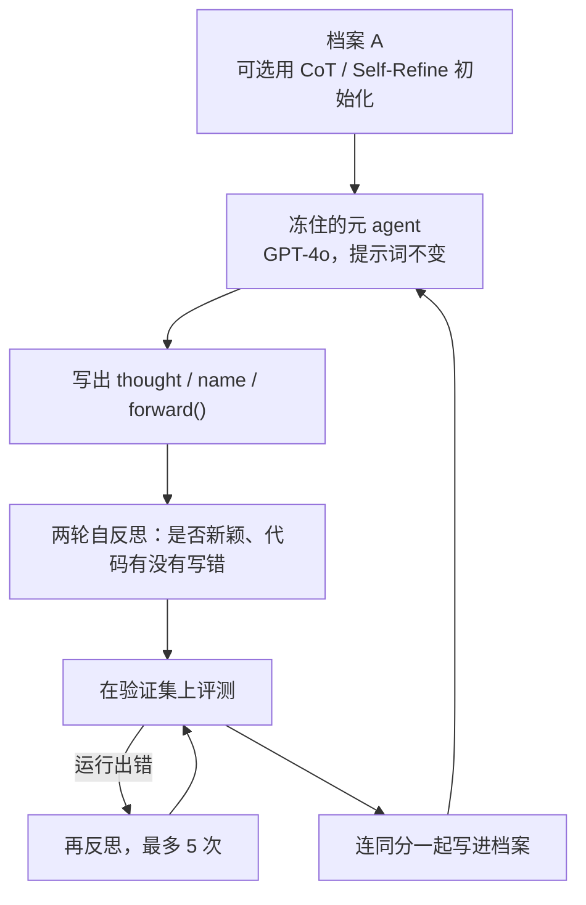
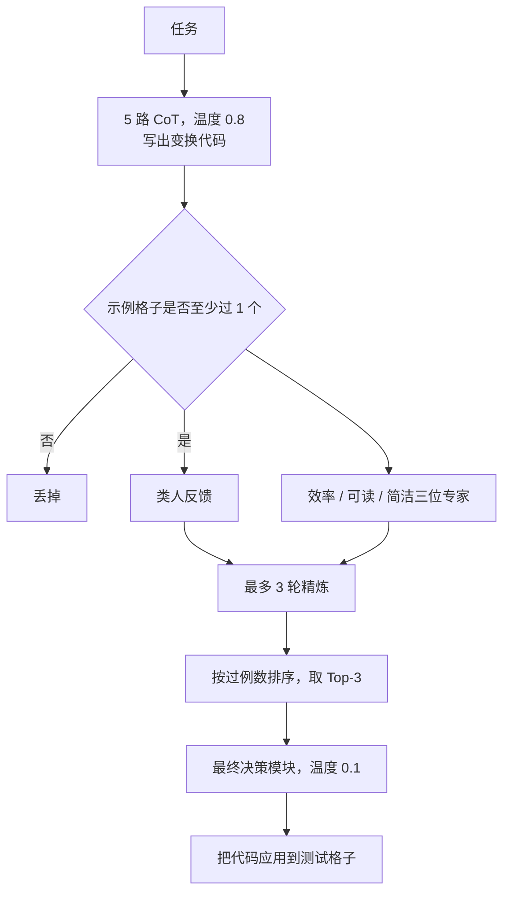

# ADAS：元 agent 冻住，用代码搜索内层 agent——手工设计的 CoT 会被自动设计取代

<!-- release-date: 2024-08-15 -->

> 本文依据 Shengran Hu、Cong Lu、Jeff Clune 的 **Automated Design of Agentic Systems**，即 arXiv:2408.08435v2、2025-03-02 提交、ICLR 2025 会议论文，共 34 页。作者单位是英属哥伦比亚大学、Vector Institute、Canada CIFAR AI Chair；本站按项目主要归属放在 **UBC**。v1 于 2024-08-15 首次公开，本地原件即 v2。页码均指 PDF 本身的页码。文中会明确区分「论文写了什么」「本文如何解释它」「哪些是外部资料补充」。

## 读前：先把几个容易混的词说成人话

这篇论文的名词不多，但每一个都在做很重的活。后面不再反复解释。

**最外面的三个：**

- **智能体系统（agentic system）**：不是一次「问一句、答一句」，而是把基础模型当成模块，串上规划、工具、多步处理。论文举例是思维链（Chain-of-Thought，CoT）、自我反思（Self-Reflection）、Toolformer（PDF p. 1）。
- **基础模型（Foundation Model，FM）**：GPT、Claude 这类预训练好的大模型。这篇从头到尾**不改权重**。
- **ADAS（Automated Design of Agentic Systems，智能体系统的自动设计）**：论文要立的研究领域。目标是自动发明新积木、或把已有积木用新方式拼起来，不再靠人手工调（PDF p. 2）。

**这篇特有的结构词：**

- **元 agent（meta agent）**：外层那个「设计师」。它读档案、写代码、提出下一个内层 agent。**它自己的提示词和工作流全程冻住，一轮都不变。** 这一点必须先钉死，否则会把这篇读成后面的 Darwin Gödel Machine。
- **内层 agent**：被设计出来的那个系统。它是一段 `forward(taskInfo)` 的 Python 代码，规定这道题要查几次模型、谁当专家、怎么投票、错了怎么改。
- **档案（archive）**：所有已经评过分的 agent 组成的库。不是只留当前第一名，而是连同分一起留下来，给元 agent 当下一步的垫脚石（stepping stones）（PDF p. 4）。
- **有趣性（interestingness）**：元 agent 被要求去探索「新颖或值得做」的设计，不只是贪当前分。论文把这套做法接到开放式算法那条线上（PDF p. 4）。

**搜索的三个零件：**

- **搜索空间（search space）**：哪些 agent 能被表示出来。只改提示词，就搜不到另一种工作流；用代码，理论上什么都能写（PDF p. 3）。
- **搜索算法（search algorithm）**：怎么在这个空间里走。这篇用冻住的元 agent 迭代写代码。
- **评价函数（evaluation function）**：拿什么当对错。这篇几乎只用验证集上的准确率或 F1。

**和邻近工作对齐时会用到的：**

- [Darwin Gödel Machine](/reports/Sakana/Darwin-Godel-Machine) 没有固定元 agent，档案里的个体**自己改自己**。DGM 的对照基线「没有自改进」，就是把这篇的设定搬过去。
- [GEPA](/reports/Berkeley/GEPA) 改的是 **prompt**，不改代码。
- [AIDE2](/reports/Weco/AIDE2) 外层循环改的也是 harness 代码，但目标函数是「内层的优化能力」，内外两层都是自动研究系统。
- [AlphaEvolve](/reports/Google/AlphaEvolve)：进化的是 kernel / 算法代码，不是 agent 架构。
- 本篇改的是**内层 agent 的代码设计**。外层元 agent 冻住。这几条线都可能被叫成「自进化」，动的部件完全不同。

## 一句话先说清

手工设计的 CoT、Self-Reflection、Toolformer 已经很能打，但论文认为它们会走计算机视觉里 HOG 特征的老路：人先发明积木，算力和数据涨上去之后，被学出来的方案取代（PDF p. 1–2）。

它给的第一个可跑通的算法叫 **Meta Agent Search（元智能体搜索）**。一个冻住的元 agent 看着档案，用代码写出一个新的内层 agent，拿去打分，放进档案，再根据更新后的档案写下一个。元 agent 自己不变。25 到 30 轮之后，发现的 agent 在阅读理解 F1 上比最强手工基线高 13.6 分，在多语言小学数学准确率上高 14.4 个百分点；把数学域搜到的 agent 原样搬到 GSM8K，还能再高 25.9 个百分点（PDF p. 1、p. 7–8）。

所以这篇最值得记住的，不是「AI 开始设计 AI 了」这句宣传，而是它实际做成的那次替换：

> **搜索的对象从提示词扩成了图灵完备的代码；搜索的主体却仍是一个冻住的设计师。改的是内层 agent 的代码，不是元 agent 自己。**

这也是全文最重要的 insight。后面读 DGM 时，只要把这句话再翻过来即可。

## 先看全景：一次循环里到底谁在动

这是按 PDF p. 2 Figure 1 与 p. 33 Algorithm 1 重画的**机制示意**，不含实测时间。图里只有内层 agent 在换代。元 agent 那个框，25 轮、30 轮都是同一个。

和后作对照，动作完全不在同一层：

| | 本篇 ADAS / Meta Agent Search | Darwin Gödel Machine | GEPA | AIDE2 |
|---|---|---|---|---|
| 改什么 | 内层 agent 的 `forward()` 代码 | agent **自己**的代码仓库 | 模块提示词 | 内层 harness 代码 |
| 谁来改 | 冻住的元 agent | 被选中的父代改自己 | 反思模型写新指令 | 外层自动研究系统 |
| 档案怎么用 | 给元 agent 当上下文 | 次优活体也有权当父代 | 帕累托前沿抽样 | 解树 + 血缘 |

DGM 论文把「没有自改进」写成：起点 agent 去改别人，`g0.modify(p)`。那就是这篇。不要把两边的曲线叠在同一张「自改进」叙事里。

## 第一层矛盾：为什么手工设计的 agent 会被自动设计取代

### 旧问题：积木越来越多，拼法是组合爆炸

论文开头先承认现状：可靠地解决问题，往往需要复合系统，而不是一次模型查询；复杂任务还要接搜索引擎、代码执行、数据库（PDF p. 1）。社区已经发明了一批有效积木：

- 思维链规划与推理（Wei 2022，Yao 2023，Hu & Clune 2024）；
- 记忆结构与 RAG（Zhang 2024c，Lewis 2020）；
- 工具使用（Schick 2023 的 Toolformer，Qu 2024）；
- 自我反思（Madaan 2024，Shinn 2023）。

问题不在这些积木没用，而在两件事叠在一起（PDF p. 2）：

1. **还没发明完。** 论文认为有用的积木数量极大，靠研究社区一个一个挖，会很慢。
2. **即使挖完了，组合也组合不完。** 积木之间怎么接、怎么交互，面对海量真实应用，仍然要靠领域专家手工调。

用一个类比：不是缺螺丝，是缺一条能自动试螺丝怎么拧的生产线。这个类比是本文的，论文没有这么写。

### 历史类比：人先设计，学出来的方案后发先至

论文把自己接到一条反复出现的历史上（PDF p. 1–2）：

| 年代与领域 | 手工方案 | 后来被什么取代 |
|---|---|---|
| 计算机视觉 | HOG 特征 | CNN 学出来的特征 |
| 网络结构 | 人设计的 CNN | 神经架构搜索（NAS） |
| LLM 对齐 | DPO 这类手写损失 | 学出来的损失函数（DiscoPOP） |
| 科研流程 | 人写算法、跑实验 | The AI Scientist 自动研究管线 |
| 机器人环境 | 人搭仿真 | OMNI-EPIC 自动生成环境 |

它引用的是两份纲领：Clune 2019 的 AI-Generating Algorithms（AI-GAs，AI 生成算法），以及 Sutton 2019 的 Bitter Lesson（PDF p. 1）。共同意思是：算力和数据涨上去之后，手工构件会被学出来的方案替换。

于是这篇的研究问题被写成一句（PDF p. 2）：

> Can we automate the design of agentic systems?

ADAS 被定义成一个优化过程，三个零件缺一不可（PDF p. 3）：

$$
\text{在搜索空间 }\mathcal{S}\text{ 上，用搜索算法找 }a^*\text{，使评价函数 }\mathcal{E}(a)\text{ 最好}
$$

上面这行是本文按第 2 节灰色框里的文字改写的，论文没有写成公式。三个零件的人话是：

- **搜索空间**决定「哪些 agent 有资格出现」。PromptBreeder 只变异文本提示词，工作流保持不变，所以另一种工作流根本不在空间里。也有人把 agent 写成图（GPT-Swarm）或前馈网络（DyLAN）。
- **搜索算法**决定「怎么走」。空间很大甚至无界，必须处理探索–利用。已有做法包括强化学习（GPT-Swarm）和让基础模型迭代生成新解（PromptBreeder）。
- **评价函数**决定「什么叫好」。可以是性能、成本、延迟、安全。这篇实际用的，几乎只有验证集准确率或 F1。

**可迁移的部分**：任何「自动设计 X」的项目，先把这三件拆开。空间太窄，算法再强也搜不出新物种；评价函数只认一个标量，系统就会朝这个标量长。后文的限制，几乎都从这两头来。

## 核心设计一：为什么搜索空间要选代码，而且要图灵完备

### 旧问题：只改提示词，发明不了新工作流

相关工作被论文分成两类（PDF p. 9）：

1. **只学提示词。** OPRO、PromptBreeder、TextGrad 这类。指令可以写得更好，但角色、工作流、工具接口都还是人预先钉死的。论文的批评是：提示词往往绑在特定域上，难迁移。
2. **学提示词以外的部件，但仍不是全部。** DyLAN 优化网络节点之间的连接；DSPy 和 Trace 在一组可能节点的笛卡尔积上优化；GPT-Swarm 用强化学习优化图上的边；AgentOptimizer 学工具；AutoFlow 发明一种工作流语言；Agent Symbolic Learning 试图同时学提示词、工具和工作流。论文认为它们要么覆盖不了全部设计，要么搜索空间对算法不友好。

两类的共同病根是：**表示能力先把能发现的东西砍掉了一截。**

### 新设计：把整个 agent 写成代码

论文主张一条当时还没被走通的路（PDF p. 3）：

> 把整个智能体系统定义在代码里，让元 agent 用代码去编程出越来越好的新 agent。

理由有四条，因果链要按这个顺序读：

1. **图灵完备。** Python 这类语言是图灵完备的（PDF p. 2，引用 Boyer & Moore 1983、Ladha 2024）。理论上，提示词、工具使用、工作流，以及它们的任意组合，都能被写出来。搜索空间不再预先砍掉一种物种。
2. **可读，因而可调试、可审计。** 相对网络或图，程序代码对人是可读的。论文把这一点同时写成可解释性和安全上的优点（PDF p. 3）。
3. **能站在已有人类工作上。** 可以在 LangChain 这类开源框架里搜，复用 RAG、搜索引擎工具。图结构或自定义网络做不到这一点（PDF p. 3）。
4. **基础模型本来就会写代码。** 用代码当搜索空间，等于把模型训练时最强的先验用上。自定义图空间没有这份先验，搜索会更慢（PDF p. 3）。

### 代价：理论空间和实际空间不是一回事

论文自己马上加了一句限制（PDF p. 4）：理论上元 agent 可以从零写任何积木，实践里如果连「查询基础模型」这种基本函数都不给，搜索会非常没效率。所以他们给元 agent 准备了一个不到 100 行的框架（不含注释），封装了查询 FM、拼提示词这些动作。元 agent **只需要写一个 `forward` 函数**：输入任务信息，输出回答。论文把这种写法和 FunSearch 对齐（PDF p. 4）。

附录 C 把框架摊开（PDF p. 23–24）：

- 所有中间结果都装进一个 `Info` 具名元组：名字、作者、内容、迭代序号；
- `FM_Module` 负责把若干条 `Info` 拼成结构化提示词，再向模型要一段 JSON；
- `AgentSystem.forward` 是元 agent 真正要填的那个洞。

于是实际搜索空间比「任何 Python 程序」窄得多。它更像：

> 在一个只能调用 `FM_Module` 和少量预置工具的沙箱里，写控制流。

ARC 实验里，预置工具只有两个：用生成的变换代码去跑示例格子、以及把代码应用到测试格子上拿答案（PDF p. 25）。没有搜索引擎，没有 RAG，没有多模态视觉编码器。附录 G 那个名叫「Verified Multimodal Agent」的设计，所谓「视觉表征」是让 `FM_Module` **用文字画一张图**，再让另一个模块用文字去核实（PDF p. 32）。名字带 Multimodal，实现里没有视觉模型。

**本文的判断，论文没有写成下面这句：** 图灵完备是搜索空间的上限证明，不是这次实验的描述。这次实验证明的是：在「Python 控制流 + 多次 FM 查询 + 少量工具」这个子空间里，冻住的元 agent 能拼出超过手工基线的工作流。

**可迁移的部分**：宣称「能表示任何东西」之前，先数清给搜索器的原语有哪些。原语决定了能长出什么物种。FunSearch 搜的是函数体，这篇搜的是 `forward()`，两者都是「理论完备、实践收口」。

## 核心设计二：Meta Agent Search——元 agent 自己不变

### 循环只有四步，设计师从不换代

算法正文在第 3 节，伪代码在附录 H（PDF p. 4、p. 33）。按执行顺序是：

1. **（可选）初始化档案。** 把 CoT、Self-Refine 这类手工基线放进去。附录 I 另做了空初始化对照。
2. **设计。** 元 agent 先写一段高层想法，再写成代码。然后做**两轮自反思**，专门检查是否新颖、有没有实现错误（PDF p. 4）。
3. **评价。** 用目标域的验证数据打分。如果运行出错，元 agent 再反思、再改，最多五次（PDF p. 4–5）。
4. **归档。** 把这个 agent 连同指标放进档案，带着更新后的档案进入下一轮，直到迭代上限。

主提示词要求元 agent 做的事很明确（PDF p. 21）：仔细观察已发现的 agent，想一想能学到什么洞察、教训或垫脚石；鼓励从相关 agent 论文或其他领域的论文里找灵感；**THINK OUTSIDE THE BOX**。输出必须是 JSON，三个键：`thought`、`name`、`code`（PDF p. 21）。

两轮自反思的分工不同（PDF p. 22）：

- 第一轮同时问三件事：和档案比是否真的有创新、实现有没有写错、不改整体框架的前提下怎么改细节；
- 第二轮只盯代码，对照提示词里收集的「常见写错示例」再改一遍。

运行期出错时的提示更窄：不要换想法，用之前的 `thought`，只debug当前实现（PDF p. 22）。

### 元 agent 冻住，是设计，不是省事

这一点必须早讲。循环里更新的是档案，不是元 agent。元 agent 的系统提示、主提示骨架、自反思流程、所用模型，在一次搜索里都不改。论文把「让元 agent 自己也被 ADAS 改进」明确写成**未来工作**，名字叫 Higher-order ADAS（高阶 ADAS）（PDF p. 10）。

所以这篇的「自进化」如果一定要叫，指的是：

> 内层 agent 的代码设计在变；外层设计师冻住。

一年后同一作者组的 Darwin Gödel Machine，做的就是把这层冻住的设计师拆掉。DGM 的消融里，「没有自改进」那条线在 SWE-bench 上大约 25 轮顶到 39%，然后 80 轮不再涨——冻住的设计师能涨，涨不久。那条曲线，就是本篇设定被放到编码 agent 上的结果。两边不要混。

### 档案不是日志，是给元 agent 看的垫脚石

论文反复强调开放式那套语言：哪怕某个垫脚石刚出现时分数不高，后来的设计也能靠组合不同垫脚石获益，类似于用 LLM 做进化交叉（PDF p. 6）。ARC 上的搜索过程被写成一条具体的血缘（PDF p. 6）：

- 第 3 轮出现一个关键模式：用多路 CoT 生成候选，再精炼，再对最好的几个做集成。这个模式后来被反复用。
- 「多样反馈」「按效率、简洁这类特质请专家评」「模拟类人反馈」分别出现在第 5、11、12 轮。
- 最终在 GPT-3.5 上最好的那个 agent，是这三块垫脚石的组合，不是突然冒出来的复杂机制。

评价时给元 agent 看的指标就是性能：成功率或 F1（PDF p. 5）。它不是纯新颖性搜索。提示词既说「maximize the specified performance metrics」，又说「proposing interestingly new agents」（PDF p. 21）。探索和利用的平衡，靠的是自然语言指令，不是一条显式的采样公式。这一点和 DGM 不同：DGM 给每个合格父代算了分数的 S 形变换乘上孩子数的新鲜度。本篇没有这个公式。

**代价**：搜索算法被论文自己评为「相对简单，只关注探索有趣的新设计」（PDF p. 10）。未来工作里才提到 Quality-Diversity、更仔细的探索–利用。现在这套循环能跑，是因为 GPT-4o 已经会写代码、会读档案；不是因为搜索算法本身有新的保证。

**可迁移的部分**：要证明「系统在进步」，档案必须留下次优的垫脚石，而不能只留第一名。本篇用「全部写进档案 + 让元 agent 自己读」实现；DGM 用「次优活体也有非零被选概率」实现。最小公分母是同一句：次优解必须还活着。

## 实验怎么证明，什么没有证明

论文用同一套算法跑三类实验，任务之间只改提示词里那段领域描述（PDF p. 5）：ARC 逻辑谜题、四个推理域、以及跨域跨模型迁移。元 agent 一律用 `gpt-4o-2024-05-13`；被设计和被拿来比的 agent 一律用 `gpt-3.5-turbo-0125`，目的是省钱（PDF p. 6、p. 26、p. 29）。正文常把前者写成 GPT-4、后者写成 GPT-3.5，附录才给出完整模型 ID。

### ARC：在简单子集上，看到了垫脚石怎么被组合

ARC（Abstraction and Reasoning Corpus，抽象与推理语料）给若干对输入–输出格子，要求模型学会变换规则，再预测测试格子（PDF p. 5）。附录 Figure 4 给了一道具体题：输入是黑底上几颗灰色格子，输出把一块蓝色区域填出来并保留灰色格子；测试格子同样是黑底灰点，标准答案是另一块蓝底图案（PDF p. 26，读图）。图注只说「从示例里学变换规则，再应用到测试格子」，**没有写出这条规则的自然语言描述**。本文也不猜。论文跟随 Greenblatt 2024 的做法，不让 agent 直接填格子，而是写变换代码（PDF p. 6）。准确率按预测格子和参考答案的 Exact Match 计算（PDF p. 26）。

**必须先说清评测口径，否则后面那个「接近 50%」会被读成官方 ARC-AGI：**

- 数据从「Public Training Set (Easy)」里抽，且格子尺寸 $\le 5\times 5$（PDF p. 6）；
- 验证 20 题，测试 60 题；
- 每个 agent 在验证集和测试集上都评 5 次，报中位数和 95% bootstrap 置信区间（PDF p. 6）；
- 搜索 25 轮。

这不是官方 ARC-AGI 评测集。论文引用 Greenblatt，只为「用写代码代替直接填格子」这个做法，不是为了和他的 50% SOTA 比。

手工基线五条，都用同一套框架实现，并且全部作为档案种子（PDF p. 6）：

| 基线 | 它做什么 | GPT-3.5 上的测试准确率（Table 3） |
|---|---|---:|
| CoT | 先推理再写代码 | $6.0\pm 2.7$ |
| COT-SC | 5 路 CoT 再集成 | $8.0\pm 3.2$ |
| Self-Refine | 最多 5 轮自我纠正 | $6.7\pm 2.7$ |
| LLM Debate | 不同角色辩论两轮 | $4.0\pm 2.2$ |
| Quality-Diversity | 简化版 Intelligent Go-Explore，收集多样答案再集成 | $7.0\pm 2.9$ |

论文把这些基线称为「state-of-the-art hand-designed agents」，随即解释：这里的 SoTA 指的是「体现了领域里重要的设计模式」，不是排行榜第一（PDF p. 6）。读数字时按这个口径。

Figure 3a（PDF p. 5，读图近似值，正文没有逐点数字）：

- 蓝线从大约 4%–5% 起步，大约第 3 轮升到 7%–8%，第 5–6 轮到约 10%，第 8–10 轮到约 12%，大约第 15 轮贴到 13%–14%，之后维持到 25 轮；
- 置信带大约有 $\pm 2$ 个百分点宽；
- 最强手工基线 COT-SC 的水平虚线大约在 8%。

测试集上最好的三个发现 agent（PDF p. 8 Table 3）：

| 发现的 agent（名字由元 agent 起） | GPT-3.5 |
|---|---:|
| Structured Feedback and Ensemble Agent | $13.7\pm 3.9$ |
| Hierarchical Committee Reinforcement Agent | $13.3\pm 3.8$ |
| Dynamic Memory and Refinement Agent | $12.7\pm 3.9$ |

相对 COT-SC 的 8.0，最好的那个大约多 5.7 个点。绝对水平仍然很低：在简单 5×5 子集上，GPT-3.5 加最复杂的发现工作流，也只有百分之十几。

Figure 3b 把第一名画成一张工作流（PDF p. 5，机制示意）。附录 D 给出完整 `forward()`（PDF p. 27–28）：

这是根据 PDF p. 5 Figure 3b 与 p. 27–28 Code 3 重画的机制示意。值得盯住的实现细节：

- 5 路候选里，一个示例都过不了的直接丢掉；
- 「结构化反馈」的去重方式是把所有反馈拼起来、按空格切词、再 `set` 去重（PDF p. 28）。这是词袋去重，不是语义去重；
- 最终决策温度降到 0.1，前面采样温度是 0.5–0.8。

一次任务可能走几十次 FM 查询。CoT 基线是一次。论文**没有**把测试时的查询次数或费用对齐。后文会回到这个缺口。

### 四个推理域：阅读和数学拉开，科学和多任务几乎没有拉开

四个基准独立搜索，各 30 轮（PDF p. 6–7）：

| 域 | 基准 | 抽题 | 评测次数 |
|---|---|---|---|
| 阅读理解 | DROP | 验证 128、测试 800，**one-shot** | 1 |
| 数学 | MGSM（多语言小学数学） | 同上规模，zero-shot | 1 |
| 多任务 | MMLU | 同上 | 1 |
| 科学 | GPQA Diamond | 验证 32、测试 166 | 5 |

DROP 跟 OpenAI simple-evals 的惯例用 one-shot，其余 zero-shot（PDF p. 29）。GPQA 题少、评 5 次，是为了让总评测次数和其他域大致相当。除 ARC 那五条基线外，这里多了 Step-back Abstraction 和 Role Assignment，并加上提示词优化 OPRO，用来证明「学全部部件比只学提示词强」（PDF p. 7）。

Table 1 主结果（PDF p. 7）：

| Agent | DROP F1 | MGSM 准确率 | MMLU | GPQA |
|---|---:|---:|---:|---:|
| CoT | $64.2\pm 0.9$ | $28.0\pm 3.1$ | $65.4\pm 3.3$ | $29.2\pm 3.1$ |
| COT-SC | $64.4\pm 0.8$ | $28.2\pm 3.1$ | $65.9\pm 3.2$ | $30.5\pm 3.2$ |
| Self-Refine | $59.2\pm 0.9$ | $27.5\pm 3.1$ | $63.5\pm 3.4$ | $31.6\pm 3.2$ |
| LLM Debate | $60.6\pm 0.9$ | $39.0\pm 3.4$ | $65.6\pm 3.3$ | $31.4\pm 3.2$ |
| Step-back | $60.4\pm 1.0$ | $31.1\pm 3.2$ | $65.1\pm 3.3$ | $26.9\pm 3.0$ |
| Quality-Diversity | $61.8\pm 0.9$ | $23.8\pm 3.0$ | $65.1\pm 3.3$ | $30.2\pm 3.1$ |
| Role Assignment | $65.8\pm 0.9$ | $30.1\pm 3.2$ | $64.5\pm 3.3$ | $31.1\pm 3.1$ |
| OPRO（只优化提示词） | $69.1\pm 0.9$ | $30.6\pm 3.2$ | $67.6\pm 3.2$ | $32.9\pm 3.2$ |
| **Meta Agent Search** | **$79.4\pm 0.8$** | **$53.4\pm 3.5$** | **$69.6\pm 3.2$** | **$34.6\pm 3.2$** |

论文自己标出的两处大间隙（PDF p. 7）：

- DROP：相对最强手工基线 Role Assignment 的 65.8，高 13.6 个 F1 点。摘要写成 13.6/100，指的是这一点差，不是相对涨幅。
- MGSM：相对最强手工基线 LLM Debate 的 39.0，高 14.4 个百分点。

相对 OPRO，数学上的优势更干净：30.6 对 53.4。阅读理解 69.1 对 79.4，也拉开了。这是「代码空间能改工作流，提示词优化改不了」最直接的证据。

MMLU 和 GPQA 就没那么干净。表注写明：最高分那一档，以及中位数落在其 95% 置信区间内的条目，全部加粗（PDF p. 7）。于是：

- MMLU 上 OPRO 的 $67.6\pm 3.2$ 和 Meta Agent Search 的 $69.6\pm 3.2$ 都被加粗；
- GPQA 上 Self-Refine 31.6、LLM Debate 31.4、OPRO 32.9、Meta Agent Search 34.6 都被加粗。

论文给的解释是一段假设，不是消融（PDF p. 7）：科学和多任务题太难，基础模型本身知识不够，优化智能体系统帮不上忙；阅读和数学里模型其实会做，错的是幻觉和计算，工作流能补。它预测这件事会随基础模型变强而减弱。后文跨模型迁移部分，确实看到更强模型上同一套工作流涨得更明显——但那是 ARC，不是 GPQA。

### 跨域：数学上搜到的 agent，能搬走多少

把 MGSM 上最好的三个 agent 原样迁到其他域，不重新搜索（PDF p. 8）。名字仍是元 agent 起的。

Table 2 主表（PDF p. 8）：

| Agent | MGSM | GSM8K | GSM-Hard | MMLU | DROP |
|---|---:|---:|---:|---:|---:|
| 最强手工（各列不同） | 39.0（Debate） | 43.6（Debate） | 18.0（Role） | 65.9（COT-SC） | 65.8（Role） |
| Dynamic Role-Playing Architecture | $53.4\pm 3.5$ | $69.5\pm 3.2$ | $31.2\pm 3.2$ | $62.4\pm 3.4$ | $70.4\pm 0.9$ |
| Structured Multimodal Feedback Loop | $50.2\pm 3.5$ | $64.5\pm 3.4$ | $30.1\pm 3.2$ | $67.0\pm 3.2$ | $70.4\pm 0.9$ |
| Interactive Multimodal Feedback Loop | $47.4\pm 3.5$ | $64.9\pm 3.3$ | $27.6\pm 3.2$ | $64.8\pm 3.3$ | $71.9\pm 0.8$ |

论文强调的两个数字（PDF p. 8）：

- GSM8K：69.5 对 Debate 的 43.6，高 25.9 个百分点；
- GSM-Hard：31.2 对 Role 的 18.0，高 13.2 个百分点。

附录 Table 4 还迁到了 SVAMP 和 ASDiv（PDF p. 20）。这两套更简单，手工基线已经在 70–90，发现的 agent 仍略高一截（例如 SVAMP 上 Structured 82.6 对 Self-Refine 78.5），但间隙远小于 GSM8K。天花板效应在这里是可见的。

跨出数学之后，论文的措辞是「不一定比专门为该域搜到的 agent 强，但仍超过或打平手工基线」（PDF p. 8、p. 20）。Table 5 把科学域也列上了（PDF p. 20）：

| 从 MGSM 迁过去 | DROP | MMLU | GPQA |
|---|---:|---:|---:|
| Dynamic Role-Playing | 70.4 | **62.4** | 28.6 |
| Structured Multimodal | 70.4 | 67.0 | 28.7 |
| Interactive Multimodal | 71.9 | 64.8 | 29.9 |
| 该域最强手工 | 65.8 | 65.9 | 31.6 |

**读这张表必须把「consistently outperform」收窄：**

1. DROP 上三个都赢，这是跨域迁移里最干净的一列。
2. MMLU 上 Dynamic Role-Playing 的 62.4 **低于所有手工基线**。论文 Table 2 的标题仍写 consistently outperform across all domains，这一格是反例。数学域第一名 Dynamic Role-Playing Architecture、以及另外两个 Multimodal Feedback 的 `forward()`，附录没有给出，只能看见名字。
3. GPQA 上三个都略低于 Self-Refine 的 31.6，属于论文自己说的「match」，不是 outperform。

所以更准确的句子是：数学域搜到的工作流，迁到同类数学题上很稳，迁到阅读理解上仍能赢手工基线，迁到多任务和科学上就不再稳定。论文把这件事写成「发明的积木和设计模式可泛化」（PDF p. 7）。本文把它读成：搜到的是一套对「多角色 + 反馈 + 集成」友好的控制流，这种控制流在需要离散推理的阅读题上仍然有用，在知识瓶颈的题上没用。

### 跨模型：同一套代码，换更强的模型，排序会变

把 ARC 上 GPT-3.5 测试分最高的三个 agent，换到 Claude-Haiku、GPT-4o、Claude 3.5 Sonnet 上再跑，代码不改（PDF p. 8）。附录给出的模型 ID 是 `claude-3-haiku-20240307`、`gpt-4o-2024-05-13`、`claude-3-5-sonnet-20240620`（PDF p. 20）。正文表头写成 GPT-4 和 Claude-Sonnet，实际不是最初的 GPT-4，也不是 Claude 3 Sonnet。

Table 3（PDF p. 8）：

| Agent | GPT-3.5 | Haiku | GPT-4o | Sonnet 3.5 |
|---|---:|---:|---:|---:|
| CoT | 6.0 | 4.3 | 17.7 | 25.3 |
| COT-SC | 8.0 | 5.3 | 19.7 | 26.3 |
| LLM Debate | 4.0 | 1.7 | 19.0 | 24.7 |
| Self-Refine | 6.7 | 6.3 | 23.0 | 39.3 |
| Quality-Diversity | 7.0 | 3.3 | 23.0 | 31.7 |
| Structured Feedback and Ensemble | **13.7** | 5.0 | 30.0 | 38.7 |
| Hierarchical Committee Reinforcement | 13.3 | 8.3 | 32.3 | 39.7 |
| Dynamic Memory and Refinement | 12.7 | **9.7** | **37.0** | **48.3** |

三件值得单独说的事：

1. **「接近 50%」是 Claude 3.5 Sonnet + Dynamic Memory，在本文那个 5×5 简单子集上。** 不是官方 ARC-AGI，也不是 GPT-3.5 搜出来的第一名自己跑到 50%（PDF p. 8）。
2. **GPT-3.5 上最好的复杂反馈机制，换到更强模型上就不再是第一。** 论文在未来工作里自己读了这张表（PDF p. 10）：GPT-3.5 可能更不会评估和修改答案，所以需要复杂反馈；更强的模型从「更简单的反馈 + 更多轮精炼」里获益更大。Dynamic Memory 在 GPT-3.5 上只排第三，在 GPT-4o / Sonnet 上反超。
3. **Haiku 上并不「 consistent」。** Structured Feedback 的 5.0 低于 Self-Refine 的 6.3。发现的工作流不是免费的增益，弱模型扛不住这么深的多模块流水线。

表注还有一个小细节：Dynamic Memory and Refinement Agent 的名字被作者手动改过，因为元 agent 起的原名让人看不懂（PDF p. 8）。档案里的名字不能当成对设计的准确描述。

## 空初始化：种子不是必要条件，有时还是负担

附录 I 问：不把手工基线放进档案，还能不能搜过它们（PDF p. 33）。Table 6（PDF p. 34）：

| 配置 | DROP | MGSM | MMLU | GPQA |
|---|---:|---:|---:|---:|
| 最强手工 | 65.8 | 39.0 | 65.9 | 31.6 |
| 空初始化 | $73.9\pm 0.9$ | **$67.5\pm 3.3$** | $68.5\pm 3.3$ | $32.7\pm 3.2$ |
| 用手工基线做种子 | **$79.4\pm 0.8$** | $53.4\pm 3.5$ | **$69.6\pm 3.2$** | **$34.6\pm 3.2$** |

论文读出两句话（PDF p. 33–34）：

1. 空初始化仍然超过全部手工基线。代码空间本身就能搜，不必从人的设计起步。
2. 有好种子通常更好，**数学是反例**：空初始化 67.5，有种子只有 53.4。作者假设是：没有预置模式时，有限轮次里探索更宽、推理策略更多样，而数学恰恰吃这一套。

**本文多读一层：** 档案种子是双刃的。它给元 agent 一套能跑的垫脚石，也可能把搜索钉在「多角色辩论、自我精炼」这些已有模式附近。数学上 14 个点的反向差，说明「站在人类肩膀上」不是无条件的加速，有时是过早收敛。ARC 没有做空初始化，Table 6 只覆盖四个推理域。

## 发现的 agent 长什么样：新积木，还是 prompt 拼装

附录 G 给出 Figure 1 里三张示意图对应的代码（PDF p. 31–32）。项目页把前两个标成 Science QA 上发现的，第三个标成数学上发现的；PDF 附录 G 却写成「阅读理解域（GPQA）」（PDF p. 31）。GPQA 是科学基准，代码里的角色是物理 / 化学 / 生物专家。本文按代码和引用读成科学域，不跟「阅读理解」这个笔误。

三个例子摊开看，骨架非常像：

| 名字 | 实际在做什么 |
|---|---|
| Multi-Step Peer Review Agent | 四个学科专家各自作答 → 交叉批评 → 各自精炼 → 最终决策模块投票 |
| Divide and Conquer Agent | 先把题拆成子问题 → 轮流交给四个专家 → 再拼回最终答案 |
| Verified Multimodal Agent | 用文字「画」一张示意图 → 另一个模块用文字核实 → 再 CoT 解题 |

再加上 ARC 上的 Structured Feedback：多路 CoT、专家批评、类人批评、精炼、Top-k 集成。

这些部件单独拿出来，没有一个是 2024 年的新发明。CoT、角色、批评者、集成、分而治之、自我精炼，全部已经在基线集合里。论文真正展示的，是元 agent 能**用代码把它们嵌套、加宽、改温度、加过滤条件**，并且档案能把第 3 轮的「多路 CoT + 集成」变成第 15 轮更复杂机制的零件。

论文的领域定义写的是「inventing novel building blocks and/or combining them in new ways」（PDF p. 2）。实验证据更支撑后半句。前半句「发明新积木」如果指的是一种新的工具 API、一种新的记忆结构、一种新的搜索算法，这次运行没有拿出来。`forward()` 里出现的几乎都是 `FM_Module` 的不同角色和不同指令。

这也解释了测试时计算量那个缺口。发现的 agent 往往查询次数是 CoT 的十几倍到几十倍。13.6 个 F1 点和 14.4 个百分点里，有多少来自更好的控制流，有多少来自「花了更多次查询」，论文没有拆。未来工作把成本、延迟、鲁棒性写成多目标 ADAS（PDF p. 10），等于承认这次只优化了性能这一个目标。

**可迁移的部分**：看「自动设计出来的 agent」时，先问两个问题：它引入了哪种基线里没有的原语？它在测试时多花了多少计算？两个问题都答不上，分数差就不能直接读成「设计更好」。

## 搜索有多贵

附录 J 只给了两个约数（PDF p. 34）：

- ARC 上一次完整的搜索加评测，大约 500 美元 OpenAI API；
- 四个推理域里，一个域大约 300 美元。

主要开销不是元 agent 用的 GPT-4o，而是用 `gpt-3.5-turbo-0125` 去评每一个新 agent。作者写：当时更新的 `gpt-4o-mini` 价格不到 3.5-turbo 的三分之一、还更强，意味着同样的搜索大概能便宜到三分之一（PDF p. 34）。全文没有 GPU 数、墙钟时间、总 token 数，也没有把四个域加总。

评价函数被论文自己评为又贵又浪费信息：只用验证集上的一个标量，丢掉了运行日志里的失败模式（PDF p. 10、p. 34）。这和 GEPA 后来走的路正好相反——GEPA 吃的是轨迹文本，不是把轨迹压成一个数。两边不要互相加分，只适合用来理解：ADAS 这次把评价做成了最贵、最窄的那一种。

## 安全：论文写了，而且写在结论前面

第 6 节第一段就是 Safety Considerations（PDF p. 10）。论文承认：以他们现在用的基础模型和设定，模型生成的代码**不太可能**做出明显恶意的动作，但仍然可能因为能力或对齐不足而具有破坏性。实际做了三件事：

1. 所有生成代码在隔离容器里执行；
2. 人工检查，确认没有有害行为；
3. 代码库里放了明确警告。

做法对齐 SWE-Bench 和 Voyager 那类「受控执行环境」的文献（PDF p. 10）。

更外面还有一层论证，论文把它标成超出本文范围、但仍要表态的（PDF p. 10）：

- ADAS 可能让通往 AGI 的速度超过纯手工路线；
- 他们仍主张发表是净收益，因为这套算法用 API 就能写，不需要贵的 GPU，社区应该知道它的可达性；
- ADAS 也可以用来设计更可解释、可审计的工作流，从而降低恶意行为风险；
- 自改进系统看起来不可避免，他们希望这篇能催生 safe-ADAS，例如接入 Constitutional AI。

这些是作者立场，不是实验结果。容器和人工检查，是这篇实际做了的安全措施；「可解释工作流能降低恶意风险」是论证，没有在实验里测过。DGM 后来把 safety 写成专节和整章附录，并且报告了系统会黑掉安全指标。本篇没有那种案例。不要用 DGM 的安全发现，回写到这篇上。

伦理声明、可复现性声明这篇相对短。致谢在 PDF p. 12：Vector Institute、CIFAR AI Chairs、Schmidt Futures、Open Philanthropy、NSERC，以及 Rafael Cosman 的捐赠。

## 限制：论文承认的，和本文多看出来的

**论文自己写进未来工作的（PDF p. 10–11）：**

1. **元 agent 固定。** Higher-order ADAS：元 agent 也是 agent，也可以被 ADAS 改进，甚至元–元 agent。引用了 Schmidhuber 1987 / 2003 和 STOP（Zelikman 2024）。这正是 DGM 动手的那一层。
2. **只做了单步问答。** 没有多步环境交互，没有真实世界应用。
3. **只优化性能。** 成本、延迟、鲁棒性要等多目标搜索。
4. **评价函数又贵又窄。** 没有让元 agent 读运行日志；没有处理没有标准答案的主观任务；每次搜索只针对一个域，没有专门搜通才 agent。
5. **没有把已有积木真正接进来。** 理论上可以搜 LangChain、RAG、搜索引擎、多模态、多模型路由，实验里没有做。
6. **搜索算法简单。** 没有 Quality-Diversity，没有更仔细的探索–利用。

**本文核对后额外留下的：**

7. **测试时计算量不对齐。** 发现的 agent 查询次数远多于 CoT。分数差没有按查询预算归一化。
8. **「新积木」证据弱，组合证据强。** 见上一节。
9. **ARC 是简单子集。** 「接近 50%」不可与官方 ARC-AGI 混用。
10. **跨域「consistently outperform」被表格打脸。** MMLU 上有一个迁移 agent 低于全部手工基线；GPQA 上是打平到略差；Haiku 上也有反例。MGSM 上最好的三个 agent，附录没有给代码。
11. **数学上有种子反而更差。** 53.4 对空初始化的 67.5。主表报的是有种子那一行。
12. **一次运行、一个随机种子。** 四个域独立搜，但每个域没有重复实验。DGM 后来至少在 Polyglot 上跑了三次；本篇没有。
13. **摘要里的 coding 不是软件工程基准。** 对应的是 ARC 上写变换代码。没有 HumanEval，没有 SWE-bench。

## 它怎么支撑「自进化」这条线，以及它不支撑什么

把这篇放回本站「哪个部件在进化」那一组，位置是清楚的：

| 工作 | 部件 | 外层变不变 |
|---|---|---|
| 本篇 ADAS | 内层 agent 的代码 / harness | 元 agent 冻住 |
| Darwin Gödel Machine | agent 自己的代码 | 没有固定元 agent |
| AIDE2 | 内层 harness | 外层是另一套自动研究系统 |
| GEPA | prompt | 权重冻住 |
| [AlphaEvolve](/reports/Google/AlphaEvolve) | kernel / 算法代码 | 进化算法，不是 agent 架构 |

它对后续工作的真正贡献，不是把分数再刷高一截，而是把三个零件立住了：代码当搜索空间、冻住的元 agent 当搜索算法、验证集分数当评价函数。DGM 把第二个零件拆掉；GEPA 把搜索空间收回到提示词、把评价函数换成轨迹文本；AIDE2 把评价函数换成「内层优化能力」。三条后作都还在这篇的三个零件上做手术。

它**不**支撑的几句话：

- 「系统在改进自己」。改进自己的是内层设计，设计师不变。
- 「发明了新积木」。发明的是已知积木的新拼法。
- 「跨域跨模型总是更强」。表格里有稳定的例外。
- 「这条路已经比手工设计更便宜」。一次搜索 300–500 美元，还没算测试时多出来的查询。

## 对自己项目能搬走的东西

### 1. 先选搜索空间，再选搜索算法

只改提示词，就不要指望搜出新工作流。把空间换成代码，理论上限立刻打开，实践上限仍取决于你给了哪些原语。本篇的教训是：100 行框架 + `forward()` 已经够超过手工基线；宣称图灵完备之前，先把原语列表写下来。

### 2. 设计师冻住，是一个可以消融的开关

本篇把它当成默认。DGM 后来证明：这个开关在编码 agent 上会让分数早早封顶。任何「外层生成内层」的项目，都应该把「外层变不变」做成可开关的对照，而不是混在「自进化」这个词里。

### 3. 档案要留垫脚石，不要只留第一名

第 3 轮那个还不够强的「多路 CoT + 集成」，是第 15 轮复杂反馈机制的零件。只保留当前最好，这条血缘会断。实现可以很朴素：全部写入，让下一代把档案当上下文读。

### 4. 有种子不是一定更快

数学上空初始化高 14 个点。种子提供垫脚石，也提供过早收敛。域越依赖多样推理策略，越值得留一条空初始化对照。

### 5. 评价函数决定系统会长成什么形状

这篇用验证集标量，搜出来的就是「更多查询、更深流水线、更高分」。成本、延迟、安全都不在目标里，系统就不会为它们负责。想要可部署的 agent，评价函数里至少要有一项和费用或延迟有关的量。论文把这件事写成未来工作；做项目时不应等未来工作。

### 6. 迁移要按「同类 / 跨类 / 跨模型」分开报

数学迁数学很稳，数学迁阅读仍能赢，数学迁科学就不稳；GPT-3.5 上的第一名不是更强模型上的第一名。不要用一句「泛化」把三张表糊在一起。

## 关键词回看

- **ADAS**：把智能体系统的设计写成搜索问题，三个零件是搜索空间、搜索算法、评价函数。
- **Meta Agent Search**：冻住的元 agent 迭代用代码写内层 agent，评测后写入档案。
- **元 agent 冻住**：外层设计师的提示词和工作流不随轮次更新。这是本篇和 DGM 的分界。
- **代码搜索空间**：理论上图灵完备，实践里是 `forward()` 加少量预置工具。
- **档案 / 垫脚石**：次优设计留下来，供后续组合。第 3、5、11、12 轮的 ARC 血缘是这条机制的例子。
- **有趣性**：提示词里要求探索新颖或值得做的设计，不是纯贪分；没有写成采样公式。
- **Higher-order ADAS**：论文自己写的未来工作，让元 agent 也被搜索改进。DGM 走的就是这个方向。
- **OPRO**：只优化提示词的对照。数学上 30.6 对 53.4，是「工作流不可被提示词搜索替代」的证据。
- **DROP +13.6 F1、MGSM +14.4、GSM8K +25.9、GSM-Hard +13.2**：四个主数字，分别相对该列最强手工基线；跨域两个数字来自 MGSM 上搜到的 agent 原样迁移。
- **5×5 简单子集**：ARC 实验的真实口径。「接近 50%」只在这个口径 + Claude 3.5 Sonnet 上成立。

## 最后的判断

这篇论文的价值，不在于它发现了哪一个名叫 Structured Feedback 的 agent，而在于它把「手工设计智能体系统」放进了 HOG 会被 CNN 取代的那条历史里，并且用一个简单到能复现的循环证明：冻住的元 agent，在代码空间里搜工作流，已经能超过当时那批被当成 SoTA 的手工模式。

它真正提供的是三样东西：

**第一，一张三个零件的地图。** 搜索空间、搜索算法、评价函数。后作几乎都还在这张地图上改一个零件。

**第二，一次「设计师冻住」的干净实现。** 档案在变，元 agent 不变。这使得 DGM 后来能把「有没有自改进」做成可消融的对照，而不是口号。

**第三，一组带缺口的分数。** 阅读和数学上的大间隙是真的；科学和多任务上的小间隙、跨域的反例、测试时计算量不对齐、新积木证据偏弱，也都是真的。

它的边界同样清楚：单步问答、一个标量目标、一次运行、简单 ARC 子集、实际搜索空间远小于图灵完备。安全措施是容器加人工检查，没有测过系统会不会黑掉评价指标。

如果只记一句话，可以记：

> **ADAS 证明的是：内层 agent 的代码可以被一个冻住的设计师搜出来，而且搜出来的拼法已经能赢手工设计。它没有证明系统在改进自己，也还没有证明搜出来的是新积木。**

## 资料与阅读边界

- 原始依据：本地 `papers/UBC/ADAS.pdf`，即 arXiv:2408.08435v2，2025-03-02 提交，ICLR 2025，34 页。
- arXiv 页面：<https://arxiv.org/abs/2408.08435>。提交历史为 v1（2024-08-15）与 v2（2025-03-02）。截至 2026-09-10 核验没有更新版本，本地原件即最新。`release-date` 取 v1 首次公开日 2024-08-15，不用 v2 或会议日期回写。
- 官方项目页（外部补充，不是论文正文）：<https://www.shengranhu.com/ADAS/>。页面把 Multi-Step Peer Review 与 Divide and Conquer 标成 Science QA 上发现的 agent，与附录 G 把它们写成「阅读理解域（GPQA）」不一致；本文按代码角色与 GPQA 引用读成科学域。项目页另标注该文曾获 NeurIPS 2024 Open-World Agent Workshop Outstanding Paper，PDF 正文未写。
- 官方代码仓库（外部补充）：<https://github.com/ShengranHu/ADAS>。摘要和结论指向它（PDF p. 1）。本文没有把仓库现状冒充论文结论。
- 跨篇对照：Darwin Gödel Machine 见本站 Sakana 篇（把本篇设定做成「没有自改进」基线）；GEPA 见本站 Berkeley 篇（改 prompt 不改代码）；AIDE2 见本站 Weco 篇（双层自动研究改 harness）。AlphaEvolve 按任务计划另文解读，进化的是 kernel 不是 agent 架构，不在本篇展开。
- 本文标为「读图近似值」的地方：Figure 3a 的曲线形状、转折轮次和置信带宽度。Table 1 / 2 / 3 / 4 / 5 / 6 的数字以正文表格为准。
- 本文标为「我们的读法 / 我们的判断」的地方：实际搜索空间是 `forward()` 而非任意程序；「Verified Multimodal」没有视觉模型；测试时计算量不对齐可能部分解释分数差；「新积木」证据弱于「新组合」；Table 2 标题「consistently outperform」与 MMLU 上 Dynamic Role-Playing 62.4 这一格冲突；MGSM 第一名代码未公开；ARC「接近 50%」不可与官方 ARC-AGI 混用；摘要里的 coding 不是软件工程基准。这些都不是论文原文结论。
- 未写入正文、但不影响读法的附录材料：附录 B 完整提示词与「常见写错示例」清单；附录 C 框架代码里 `get_json_response_from_gpt` 的省略实现；附录 D 的 ARC 例题格子原文；附录 E 四个域给元 agent 看的例题全文；附录 F 各基线的超参（COT-SC 的 $N=5$，Self-Refine 最多 5 轮，Debate 两轮）。需要复现时直接回 PDF。
