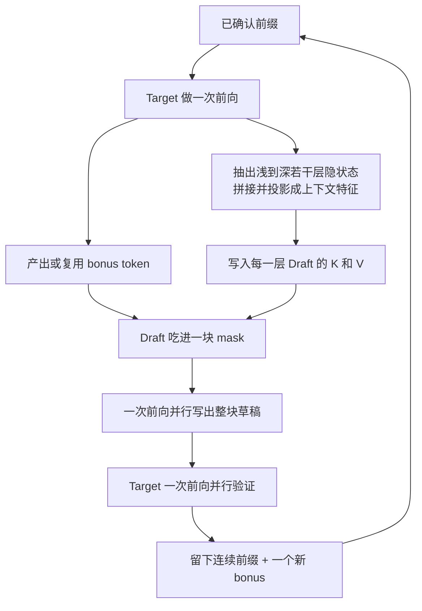

# DFlash：用块扩散一次写出整段草稿，投机解码才不再卡在 2–3×

<!-- release-date: 2026-02-05 -->

> 本文依据 UC San Diego 的 **DFlash: Block Diffusion for Flash Speculative Decoding**，即 arXiv:2602.06036v2（2026-05-28），共 13 页。ICML 2026。截至核验 arXiv 最新是 v2。页码均指这份 PDF。全文把三件事分开标注：**报告明确写了什么**、**我们如何解释或验算它**、**哪些是外部资料补充**。
>
> 封面三位作者 Jian Chen、Yesheng Liang、Zhijian Liu，单位都是 UC San Diego，通讯作者 Zhijian Liu（PDF p.1）。首页写明 *Proceedings of the 43rd International Conference on Machine Learning, Seoul, South Korea. PMLR 306, 2026*。arXiv 评论栏写 Accepted at ICML 2026，本版是相机就绪稿。本地 PDF 13 页，`pdfinfo` 与逐页渲染一致。
>
> `release-date` 取 **2026-02-05**。这是方法论文，对象本身不是一个对外可用的基座模型，按本模块规则记该技术首次官方公开日。证据是 [arXiv:2602.06036](https://arxiv.org/abs/2602.06036) 提交历史：v1 于 2026-02-05 18:59:30 UTC 上传，v2 于 2026-05-28 修订。不要用 v2 修订日回写，也不要用 Hugging Face 仓库的 `createdAt`。

投机解码的一般原理——为什么 decode 访存受限、接受率怎么变成加速比、经典算法怎样保持 target 的分布——本站写在知识库 `knowledge/04-Infra/01-原理/投机解码.md`。那一篇讲的是算法家族。本篇只讲 DFlash 自己写了什么。

## 读之前：这篇会反复用到的词

- **Target（目标模型）**：真正要对用户负责的那个大模型。最终每个被留下的 token，都得过它这一关。
- **Draft（草稿模型）**：先猜后面几个 token 的小模型。猜得快、猜得准，大模型才能一次验证一串。
- **Speculative decoding（投机解码）**：草稿先猜 $\gamma$ 个 token，target 用一次前向把这 $\gamma$ 个一起验证。通过的留下，通不过的从分叉点重来。
- **Acceptance length $\tau$（平均接受长度）**：一轮里平均留下多少个 token。论文把它的范围写成 $\tau \in [1,\gamma+1]$，里面那个多出来的 1，是 target 自己补的 **bonus token（奖励 token）**（PDF p.3）。
- **Autoregressive drafting（自回归草稿）**：草稿也像普通语言模型一样，一个 token 接一个 token 往前写。EAGLE-3 走这条路。
- **Block diffusion（块扩散）**：把一段连续位置看成一块。块与块之间仍按时间往前走；块内部的 mask 位置可以一次并行填上。DFlash 把这件事只用在草稿阶段。
- **Mask token（掩码 token）**：占着「还没写出来」的位置。DFlash 的草稿一次吃进一整块 mask，一次前向把它们全部填成候选 token。
- **Context feature / KV injection（上下文特征 / 键值注入）**：从冻结的 target 里抽出若干层隐状态，融合成一条条件，再写进草稿每一层的 Key 和 Value。不是只在草稿入口拼一次就不管了。

## 一句话先说清

投机解码看起来已经很快了：小模型猜，大模型验。可是 EAGLE-3 这类最强的现成方法，草稿自己还在逐 token 自回归。论文说，这种串行草稿既慢，又会把前面的错往后传，于是实际加速比大概就停在 2–3 倍（PDF p.1）。

扩散语言模型本来擅长并行填空，但现成的扩散大模型生成质量往往不如自回归模型，去噪步数一多，并行优势也被吃掉（PDF p.1）。

DFlash 的拆法是：

> **并行只发生在草稿里；对错仍由自回归 target 一锤定音。**

具体两步。第一，草稿改成轻量块扩散，一块 mask 只跑一次前向，整块候选一起出来。第二，草稿不许从零推理，必须读 target 已经算好的多层隐状态。论文把这句话写成 *the target knows best*（PDF p.2）。

主表上，关掉思考模式的 Qwen3-8B，MATH-500 达到 6.08×，七项平均 4.86×；相对同表里树大小 60 的 EAGLE-3，这项平均大约是 2.4 倍（PDF p.6，Table 1）。摘要里的「超过 6×」「相对 EAGLE-3 最高 2.5×」都来自这张图和这张表，后文会把设置摊开，避免把峰值当成所有任务的均值。

## 报告地图：13 页各写了什么

| 报告章节 | PDF 页 | 讲了什么 | 密度 |
|---|---|---|---|
| 摘要 + §1 引言 + Figure 1 | p.1–2 | 2–3× 天花板、块扩散草稿、target 特征条件化、6.1× / 2.5× 的宣传口径 | 高 |
| §2 相关工作 | p.2–3 | 投机解码、扩散语言模型、用扩散当草稿的前作 | 中 |
| §3 预备 + 式（1）–（3）+ Figure 3 | p.3–4 | 加速比公式；自回归草稿费用随 $\gamma$ 线性涨，块扩散一次前向 | 高 |
| Figure 2 + §4.1 推理 | p.4–5 | 抽 target 特征、KV 注入、一块 mask 一次前向 | 高 |
| Figure 4 + §4.2 训练 | p.5–6 | 随机锚点、块内双向、跨块隔离、位置加权损失、共享词表头 | 高 |
| Table 1 + §5.1 | p.6–7 | Qwen3-4B/8B，温度 0 与 1，对 EAGLE-3 树 16 / 树 60 | 高 |
| Table 2 + §5.2 | p.7 | 打开思考模式：约 4.5× / 3.9× | 高 |
| Table 3 + §5.3 | p.7 | 单卡 B200、SGLang、并发 1–32 | 高 |
| §5.4 + Table 4 | p.7–8 | 4K 训的草稿用 1.6K 样本接到长上下文 | 中 |
| §5.5 + Table 5–9 | p.7–9 | 同数据打 LLaMA、层数、特征层数、训练/推理块大小、KV 注入 vs 输入融合 | 高 |
| §6 结论 + 致谢 + 影响声明 | p.9 | 扩散模型改当草稿适配器；SGLang 集成与算力致谢 | 中 |
| 参考文献 | p.10–11 | — | — |
| 附录 A.1–A.3 + Table 10 | p.12 | 训练超参、去掉 target 特征只剩 2–3×、KV 公式与 42 MB | 高 |
| 附录 A.4 + Table 11–12 | p.12 | 更多模型与 vLLM | 高 |
| 附录 A.5 + Figure 5 + Table 13 | p.12–13 | 损失衰减、随机采样掩码块 | 高 |

三件事先知道：

- **这不是一篇训练基座的论文。** Target 全程冻结。被训练的只有很浅的草稿 Transformer 层；词表嵌入和语言模型头与 target 共享并保持冻结（PDF p.5–6）。
- **超过 6×是峰值，不是七项平均。** Qwen3-8B 在 Figure 1 / Table 1 的 MATH-500 是 6.08×，引言写成 6.1×；七项 greedy 平均是 4.86×，聊天任务 MT-Bench 只有 2.75×（PDF p.2、p.6）。
- **正文没有写出接受-拒绝概率。** 无损是作者对「target 负责验证」的定位，不是文中的一条公式。这一点单独写在后面，不从知识库倒推过来。

## 旧矛盾：自回归草稿为什么把加速比卡在大约 2–3×

先把投机解码的账本按论文自己的写法摊开。记 target 为 $\mathcal{M}_t$，草稿为 $\mathcal{M}_d$。每一轮草稿先提出 $\gamma$ 个 token，target 一次验证。平均每个被留下的 token 花掉的时间是（PDF p.3，式（1））：

$$
L = \frac{T_{\text{draft}} + T_{\text{verify}}}{\tau}
$$

$T_{\text{draft}}$ 是写草稿的时间，$T_{\text{verify}}$ 是验证的时间，$\tau$ 是这一轮期望留下的 token 数，含 target 补出来的 bonus。相对「target 自己一个一个吐」的加速比是 $\eta = L_{\text{target}} / L$。

这句话只说了一件事：加速要么来自 $\tau$ 变大，要么来自 $T_{\text{draft}}$ 变小。两条路在自回归草稿上是打架的。

自回归草稿每写一个 token 都要跑一次前向，于是（PDF p.3，式（2））

$$
T_{\text{draft}} = \gamma \cdot t_{\text{step}}
$$

想把 $\gamma$ 开大，草稿费用就线性涨。为了不把这笔账涨爆，现成方法把草稿压得很浅。论文点名 EAGLE-3 只用 **一层** Transformer（PDF p.3）。层数不够，草稿质量就上不去：$\gamma$ 再大，$\tau$ 也会很快饱和。

论文把后果写在引言里，针对的就是 EAGLE-3 这类仍用自回归草稿的 SOTA（PDF p.1）：

> 这种串行草稿本身就低效，还容易误差累积，于是实际加速比大概被封在大约 2–3×。

同页还补了两条相邻的失败路径，避免读者以为「换扩散」三个字就能自动赢（PDF p.2）：

- DiffuSpec、SpecDiff-2 用大约 7B 的大扩散模型当草稿。接受长度可以很长，但草稿自己又贵又占显存，实际加速往往只有 3–4×。
- PARD 把小自回归模型训成「模仿扩散式并行」。模型太小，接受长度上不去，加速天花板大约 3×。

我们怎么读这 2–3×：它不是一条定理，是作者对「草稿仍自回归、又不敢做深」这条设计空间的经验上限。Table 1 给了对照。关掉思考模式、温度 0、Qwen3-8B 上，EAGLE-3 树大小 16 的七项平均是 1.76×，树大小 60 也只有 2.02×；Qwen3-4B 对应是 1.81× 与 2.08×（PDF p.6）。这些数字确实落在引言说的区间里。Figure 1 的绿色柱就是这组 EAGLE-3（60）的设置，高度大约 1.8–2.2×（PDF p.2）。

## 新设计：一块 mask，一次前向，再让 target 来验

块扩散草稿把式（2）换成式（3）（PDF p.3）：

$$
T_{\text{draft}} = t_{\text{parallel}}
$$

人话：$\gamma$ 个位置不再串行排队，而是同一块 mask 一次前向全部填上。论文认为，对体量相近的模型，现代 GPU 跑一次并行前向，远便宜于跑 $\gamma$ 次串行前向，于是 $t_{\text{parallel}} \ll \gamma \cdot t_{\text{step}}$。块不是极大时，$T_{\text{draft}}$ 对 $\gamma$ 几乎不敏感（PDF p.3–4）。

这是设计空间翻过来的关键。草稿费用不再随长度线性涨，草稿才有资格做深一点、表达力强一点。论文的经验观察是：5 层 DFlash 一次写 16 个 token，延迟仍低于 1 层 EAGLE-3 写 8 个 token，接受长度还更高，所以它落在「质量–费用」更好的一边（PDF p.4，Figure 3）。

Figure 3 没有印出逐柱毫秒。从图上读：横轴是草稿 token 数 4 / 8 / 16，纵轴是延迟（ms），20 是图上的最高刻度。EAGLE-3 的柱随长度近似线性升高，16 token 时已经明显高出 20 ms 那条线；DFlash 的 1 层、3 层、5 层三条柱在三个长度上几乎持平，5 层版本仍明显低于 EAGLE-3 的 8 token 成本（PDF p.3，Figure 3）。这些是读图，不是表格里的打印数字。

上图是根据 Figure 2 与 §4.1 重画的机制示意，不是实测时间线（PDF p.4）。

一轮里真正发生的事，按论文的顺序是（PDF p.4–5）：

1. Target 先对提示词做标准 prefill，吐出第一个 token。
2. 这一次前向里，从浅到深均匀抽若干层隐状态，拼起来，过一个很浅的投影，融成 **target context feature**。
3. 这条特征被写进草稿每一层的 KV cache，后面几轮还可以复用。
4. 草稿看到的输入是：已经确认的 decode token，加上一整块 mask。块内用双向注意力，一次前向把 mask 全部填成草稿 token。
5. Target 再对这整块做一次并行验证。留下的连续前缀成为新的已确认文本；target 还会补一个 bonus token，作为下一轮草稿的干净锚点。

论文把草稿叫做 **diffusion adapter（扩散适配器）**：它不从零推理，而是把 target 已经建好的深层上下文，转换成一块并行草稿（PDF p.2）。

## 核心设计一：条件必须来自 target，否则又回到 2–3×

只把草稿换成块扩散，不够。论文拿 PARD 当反例：小扩散草稿如果完全不读 target 内部表示，就得从零预测未来，接受长度差，加速有限（PDF p.4）。

他们自己做了对照。训一个 5 层块扩散草稿，**不注入任何 target 特征**，在几个数学基准上看速度。结果写在附录 Table 10（PDF p.12）：

| 温度 | GSM8K 加速 / $\tau$ | MATH-500 | AIME24 | AIME25 |
|---|---|---|---|---|
| 0 | 2.83× / 3.38 | 3.73× / 4.61 | 3.43× / 4.12 | 3.35× / 4.07 |
| 1 | 2.76× / 3.29 | 3.31× / 4.12 | 2.66× / 3.23 | 2.65× / 3.24 |

正文对这张表的概括是：加速通常只有大约 2–3×（PDF p.4）。MATH-500 greedy 的 3.73× 略高于这句概括，但数量级没变——没有 target 特征，块扩散并没有自动变成 6×。

原因按论文的话说：大自回归模型的隐状态比 token 级 logits 信息多得多。它们装着长程依赖和任务语义，并且**隐式地编码了未来若干 token**。这一点他们引 Samragh 等人 2025 年的观察（PDF p.2、p.4）。DFlash 不让小草稿重做推理，而是把这些隐状态当成条件。

实现上，提示词进来之后，target 先做一次普通 prefill。抽特征的层是固定的：从第 2 层到倒数第 3 层之间均匀抽 5 层，拼起来，过一个浅投影，变成一条紧凑的 target 上下文特征（PDF p.4、p.6）。主实验里草稿 5 层（Qwen3-Coder 用 8 层），块大小 16（LLaMA-3.1 用 10）（PDF p.6）。

## 核心设计二：特征要写进每一层的 KV，而不是只在入口融合一次

EAGLE-3 也用 target 的隐特征。论文说，它的做法是把这些特征与草稿的 token 嵌入融合，**只作为草稿的输入**。草稿一加深，target 带来的信息就被一层一层稀释，再加层，接受长度的收益就会递减（PDF p.4）。

DFlash 换了注入位置。融合后的 target 特征被当成**持久的上下文**，直接进每一层草稿的 K 和 V；这些投影会进草稿的 KV cache，多轮之间复用（PDF p.4）。附录把公式写清楚了（PDF p.12）。先把选中的 target 层拼起来，投影到草稿隐空间：

$$
\mathbf{H}_t = \mathrm{RMSNorm}\bigl(W_c[\mathbf{H}^{(l_1)};\ldots;\mathbf{H}^{(l_5)}]\bigr)
$$

$\mathbf{H}_t$ 被所有草稿层共享。到第 $i$ 层，草稿 token 只出 Query；K 和 V 则是「target 特征 + 草稿 token」在序列维上的拼接：

$$
\mathbf{Q}_i = W_i^{Q}\mathbf{H}_d,\qquad
\mathbf{K}_i = [W_i^{K}\mathbf{H}_t;\ W_i^{K}\mathbf{H}_d]_{\mathrm{seq}},\qquad
\mathbf{V}_i = [W_i^{V}\mathbf{H}_t;\ W_i^{V}\mathbf{H}_d]_{\mathrm{seq}}
$$

人话：target 特征只是给这块 mask 多准备了一段可以读的记忆，它不走草稿的 Q、不走输出投影、不走自注意力更新、也不走 FFN（PDF p.12）。

额外参数几乎只有共享投影 $W_c \in \mathbb{R}^{D \times 5D}$。以 Qwen3.5-35B-A3B、$D=2048$、BF16 为例，论文算的是

$$
5 \times 2048 \times 2048 \times 2 \approx 42\ \text{MB}
$$

对照大约 70 GB 的 target，可以忽略。激活也不大：batch 1、序列 2048 时，投影输入大约 40 MB、输出大约 8 MB；decode、块大小 16 时，临时激活低于 400 KB（PDF p.12）。

我们验算一下 42 MB：按二进制 MiB，$5 \times 2048 \times 2048 \times 2 / 1024^{2} = 40$ MiB；按十进制大约 41.9 MB。论文写的是约 42 MB，数量级一致。

消融 Table 9 把「注入位置」和「草稿是不是自回归」拆开（PDF p.9）。设定是 Qwen3-4B、5 层草稿、块大小 8，每格是 $\tau$ / 加速比：

| 变体 | 注入方式 | GSM8K | HumanEval | MT-Bench |
|---|---|---|---|---|
| EAGLE-3-5L（自回归） | 只在输入融合 | 4.2 / 2.1× | 4.3 / 2.2× | 3.1 / 1.4× |
| DFlash-AR（自回归） | KV 注入 | 4.8 / 2.4× | 4.6 / 2.3× | 3.4 / 1.5× |
| DFlash（块扩散） | 只在输入融合 | 3.5 / 2.9× | 3.5 / 2.9× | 2.6 / 2.0× |
| DFlash（块扩散） | KV 注入 | 4.2 / 3.3× | 4.0 / 3.2× | 3.0 / 2.2× |

两件事同时成立。第一，同样是自回归草稿，KV 注入比 EAGLE-3 式输入融合更准。第二，块扩散即使 $\tau$ 略低于「KV + 自回归」（GSM8K 上 4.2 对 4.8），加速比仍然明显更高（3.3× 对 2.4×），因为整块是一次前向写出来的。论文的总结是：DFlash 同时吃到了更强的条件和更快的并行草稿（PDF p.9）。

对自己的项目，这条比「上扩散」三个字更可迁移：**条件要在每一层都还在，不能只在门口喊一声。** 深度一加，入口融合就会稀释。把条件做成 KV 里的持久记忆，接受长度才跟得上层数。

## 核心设计三：训练必须长得像推理

标准块扩散训练，是把回复均匀切块，块内随机遮一些位置，再学着重填。DFlash 说这样和推理对不齐。推理时，草稿看到的第一个位置永远是 target 刚验证出来的干净 token，也就是上一轮的 bonus；它要并行预测的是后面 `block_size − 1` 个位置（PDF p.5）。

于是他们改了造块方式。从回复里随机抽 **anchor token（锚点）**，每个锚点当一块的第一个位置，其余位置全部 mask。草稿学的就是：看见这个干净锚点，一次写出后面整块。锚点随机，等于让草稿见到更多样的 target 特征，数据覆盖也更好（PDF p.5）。

Figure 4 把注意力画成三色格子（PDF p.5）。蓝色是注入进来的 target 上下文特征；黄色是干净锚点；绿色是要并行预测的 mask；白色是不可见位置，用来挡住块与块之间的偷看。块内双向，跨块禁止。多块可以拼成一条序列，用 Flex Attention 一次前向、一次反向一起训。

Table 13 是这套随机锚点相对「标准均匀切块」的对照。两边都是 3 层草稿、5 条 target 特征、块大小 16、§5.5 的 100K 子集（PDF p.13）：

| 设定 | MATH-500 加速 / $\tau$ | HumanEval | MT-Bench |
|---|---|---|---|
| 标准切块 | 4.13× / 4.94 | 3.29× / 3.86 | 2.13× / 2.80 |
| 随机采样锚点 | 4.69× / 5.64 | 3.90× / 4.61 | 2.38× / 3.18 |

三个任务的 $\tau$ 和加速比一起涨。这不是装饰性的数据增强，是在让训练分布贴住「上一轮 bonus + 本轮一整块 mask」。

长上下文那边，论文点名 EAGLE-3 的 training-time test 很贵。DFlash 的办法是：每条序列固定掩码块数量，每个 epoch 重新随机抽锚点。增强还在，训练费用被块数上限住（PDF p.5）。

还有一个投机解码特有的不对称：块里越靠前的错误，会让后面全部作废。所以早期位置对 $\tau$ 的贡献更大。他们对块内第 $k$ 个位置的交叉熵乘一个指数衰减权重（PDF p.5，式（4））：

$$
w_k = \exp\left(-\frac{k-1}{\gamma}\right)
$$

这里的 $\gamma$ 是衰减速率，不是草稿长度。附录把取值写死：块大小 16 时为 7，块大小 10 时为 5，块大小 8 时为 4（PDF p.12）。Figure 5 画的是 MATH-500 上接受长度随 epoch 的曲线。带衰减的蓝线在前几个 epoch 爬得更快，大约第 7 个 epoch 到达约 6.5 的高点；不带衰减的橙线全程落后一截，后期也没有追上（PDF p.13）。论文的概括是：衰减让收敛更快，也更好。图上没有打印逐点数值，以上高点是读图。

最后，草稿与 target 共享 token 嵌入和语言模型头，并且这两块冻结，只更新草稿 Transformer 层。论文说这样可训练参数更少，也迫使草稿当一个对齐 target 表示空间的轻量适配器（PDF p.5–6）。

附录 A.1 的其余超参（PDF p.12）：AdamW，学习率 $6\times 10^{-4}$，梯度裁剪 1.0，余弦日程，warmup 比例 0.04，6 个 epoch。主数据混合最长 3072 token（Qwen3-Coder 4096），每条序列随机抽 512 个锚点。训练可以在线（每步现算 target 隐状态）或离线（先缓存再训草稿）。

## 无损吗：只按这篇论文自己的验证规则写

不要把知识库里 Leviathan 的接受概率 $\min(1,p/q)$ 和残差分布，写成 DFlash 正文已经给出的证明。这篇 13 页没有写出那两条公式。

论文自己怎么说「无损」：

- 投机解码这个范式「实现无损加速」，草稿由更大的 target 并行验证（PDF p.1）。
- 他们选择「扩散负责高速并行草稿，自回归 target 负责验证，从而保证最终输出仍无损」（PDF p.1）。
- 摘要把主结果叫做 **over 6× lossless acceleration**（PDF p.1）。
- 结论把验证写成「对输出质量的原则性保证」，并因此敢于把去噪步数压到几乎只剩并行（PDF p.9）。
- 相关工作里，TiDAR 被明确写成最终生成质量「还不是无损」，作为反衬（PDF p.3）。

一轮的操作，正文只写到这个粒度：草稿提出 $\gamma$ 个 token，target 并行验证；$\tau$ 含 bonus token，范围是 $[1,\gamma+1]$（PDF p.3）。训练侧还写明，下一轮草稿条件化的那个干净 token，就是上一轮验证产生的 bonus（PDF p.5）。温度 0 的主表明确是 **greedy decoding**；温度 1 写成 **non-greedy sampling**（PDF p.6–7）。没有另写 typical acceptance，也没有另写拒绝之后从哪个分布重采。

我们能负责任说的只有这些：

- 作者把 DFlash 放在标准投机解码框架里，无损来自「最终留下的 token 由 target 验证决定」，不是来自草稿自己保证质量。
- 温度 0 时，greedy 验证与逐 token greedy 对齐，是这个框架里最干净的一种情形。论文在温度 0 和温度 1 都报了加速比，但没有另做「打开 DFlash 前后，采样分布是否一致」的检验表。
- 文中没有把接受规则写成可复现的伪代码。工程里究竟用严格推测采样，还是用贪心前缀匹配，PDF 本身不够判定。

所以：DFlash **声称**无损，依据是投机验证而不是草稿质量；本篇不把知识库的证明套过来当成论文已经写过的步骤。

## 实验怎么证明它快，快在哪一种设置里

除非另说，实验在 NVIDIA H200 上做（PDF p.6）。主草稿：5 层（Qwen3-Coder 8 层），块大小 16（LLaMA-3.1 为 10），从 target 第 2 层到倒数第 3 层均匀抽 5 层隐状态（PDF p.6）。训练数据大约 80 万条，来自 NVIDIA Nemotron Post-Training Dataset V2 与 CodeAlpaca，**回复用 target 自己重新生成**，为的是对齐 target（PDF p.6）。没有和其他扩散草稿方法比，原因写得很直白：那些工作缺开源实现（PDF p.6）。Qwen3 上的 EAGLE-3 权重来自 AngelSlim，LLaMA-3.1 上用 EAGLE-3 官方权重（PDF p.6）。

### Instruct、关掉思考：峰值 6×，平均约 4.9×，聊天明显更弱

Table 1 是主表。后端是 Transformers，最大生成 2048 token，思考模式关闭。EAGLE-3 两组：树大小 16，用来和 DFlash 块大小 16 对齐草稿预算；树大小 60，沿用 EAGLE-3 论文里冲接受长度的设置，验证更贵。两组的 draft steps 都是 7，top-$k$ 都是 10（PDF p.6）。

下面只抄温度 0。每格是加速比 / $\tau$（PDF p.6，Table 1）：

**Qwen3-4B，温度 0**

| 方法 | GSM8K | MATH-500 | AIME25 | HumanEval | MBPP | LCB | MT-Bench | 平均 |
|---|---|---|---|---|---|---|---|---|
| EAGLE-3（16） | 1.99× / 3.30 | 1.83× / 3.08 | 1.79× / 3.05 | 1.84× / 3.05 | 1.78× / 2.95 | 1.73× / 2.91 | 1.74× / 3.02 | 1.81× / 3.05 |
| EAGLE-3（60） | 2.27× / 3.77 | 2.10× / 3.52 | 2.13× / 3.51 | 2.12× / 3.47 | 2.02× / 3.38 | 1.90× / 3.22 | 2.04× / 3.49 | 2.08× / 3.48 |
| DFlash（16） | 5.15× / 6.53 | 6.09× / 7.84 | 5.68× / 7.27 | 5.21× / 6.64 | 4.78× / 6.09 | 5.41× / 7.09 | 2.85× / 4.35 | 4.91× / 6.54 |

**Qwen3-8B，温度 0**

| 方法 | GSM8K | MATH-500 | AIME25 | HumanEval | MBPP | LCB | MT-Bench | 平均 |
|---|---|---|---|---|---|---|---|---|
| EAGLE-3（16） | 1.94× / 3.23 | 1.81× / 3.02 | 1.79× / 3.00 | 1.89× / 3.17 | 1.69× / 2.82 | 1.57× / 2.65 | 1.63× / 2.83 | 1.76× / 2.96 |
| EAGLE-3（60） | 2.23× / 3.71 | 2.05× / 3.49 | 2.05× / 3.44 | 2.17× / 3.65 | 1.93× / 3.25 | 1.81× / 3.03 | 1.90× / 3.26 | 2.02× / 3.40 |
| DFlash（16） | 5.15× / 6.54 | 6.08× / 7.87 | 5.62× / 7.08 | 5.14× / 6.50 | 4.65× / 5.95 | 5.51× / 7.27 | 2.75× / 4.24 | 4.86× / 6.49 |

温度 1 时，DFlash 的七项平均降到 Qwen3-4B 的 4.24×（$\tau=5.69$）和 Qwen3-8B 的 4.03×（$\tau=5.48$）。EAGLE-3（60）对应是 1.93× 与 1.88×（PDF p.6）。数学和代码仍然明显领先，聊天仍然最弱：Qwen3-8B 的 MT-Bench 只有 2.47×。

宣传口径怎么和表对上，必须分开写。

**超过 6×** 是峰值口径。Table 1 里只有 MATH-500 跨过 6。Qwen3-4B 是 6.09×，Qwen3-8B 是 6.08×。引言把 Qwen3-8B 写成最高 6.1×，是 6.08 的四舍五入（PDF p.2、p.6）。Figure 1 的蓝色柱，MATH-500 印的就是 6.08（PDF p.2）。七项平均是 4.9× 量级，不是 6×。摘要「across a range of models and tasks」容易读成「每个任务都 6 倍」，表不支持这种读法。

相对 EAGLE-3 的 **2.5×** 必须对设置。Figure 1 的绿色柱与 Table 1 里 Qwen3-8B、温度 0、EAGLE-3（60）逐项对齐，不是树大小 16 那一行。用表验算相对倍数：

| 任务 | DFlash | EAGLE-3（60） | DFlash / EAGLE-3 |
|---|---|---|---|
| GSM8K | 5.15× | 2.23× | 2.31 |
| MATH-500 | 6.08× | 2.05× | 2.97 |
| AIME25 | 5.62× | 2.05× | 2.74 |
| HumanEval | 5.14× | 2.17× | 2.37 |
| MBPP | 4.65× | 1.93× | 2.41 |
| LiveCodeBench | 5.51× | 1.81× | 3.04 |
| MT-Bench | 2.75× | 1.90× | 1.45 |
| 平均 | 4.86× | 2.02× | 2.41 |

「up to 2.5×」对准的是数学、代码上接近或超过 2.5 的那些列，以及七项平均的 2.41。Figure 1 图注写 more than 2.5×，对 MATH-500、AIME25、LiveCodeBench 成立，对 MT-Bench 不成立。引言「across most benchmarks nearly 2.5×」更贴近这张相对倍数表。

§5.1 还有一句容易看岔的话：greedy 下平均 4.9×，「相当于相对 EAGLE-3（16）提升 2.4×」（PDF p.6）。用同表验算，4.91/1.81 与 4.86/1.76 大约是 2.7–2.8 倍；2.4 倍更贴近相对 EAGLE-3（60）的 4.91/2.08 与 4.86/2.02。温度 1 那句「相对 EAGLE-3 提升 2.2×」同样更贴近树大小 60。后文只用表里的绝对数字，不再沿用这句相对倍数的括号。

DFlash 即使对树大小 60 的 EAGLE-3，接受长度也更长，而验证开销更低——树 60 要一次验证很多分支，块 16 只验证一条长度为 16 的链（PDF p.6–7）。

### 打开思考模式：大约 4.5× 与 3.9×

草稿改在带推理轨迹的 target 输出上训。评测换成 GPQA、MATH-500、AIME25，后端仍是 Transformers（PDF p.7，Table 2）：

| 模型 | 温度 | GPQA 加速 / $\tau$ | MATH-500 | AIME25 |
|---|---|---|---|---|
| Qwen3-4B | 0 | 4.23× / 5.23 | 4.59× / 5.74 | 4.39× / 5.54 |
| Qwen3-4B | 1 | 3.67× / 4.55 | 3.93× / 4.89 | 3.64× / 4.68 |
| Qwen3-8B | 0 | 4.17× / 5.17 | 4.64× / 5.82 | 4.51× / 5.74 |
| Qwen3-8B | 1 | 3.75× / 4.65 | 4.03× / 5.06 | 3.70× / 4.69 |

正文概括为大约 4.5× 与 3.9×（PDF p.7）。这是 greedy 与采样两组的约数，不是某一格的精确值。思考链很长，论文认为这种加速在部署上更有价值。注意：这里的 $\tau$ 低于关掉思考时 MATH-500 的 7.8，加速比也从 6× 落到 4× 出头。长推理并没有让草稿更「好猜」，只是绝对延迟更高，同样倍数更值钱。

### 真正的服务框架：SGLang 上并发 1 到 32 都还在赚

§5.3 换到单卡 B200、SGLang、FlashAttention-4，并打开 Spec-v2 的调度重叠（PDF p.7）。Table 3 同时给吞吐（tok/s）、相对基线的加速比，以及平均 $\tau$。下面只保留加速比和 $\tau$，吞吐原文都在（PDF p.7）：

| 模型与任务 | 并发 1 | 4 | 8 | 16 | 32 | 平均 $\tau$ |
|---|---|---|---|---|---|---|
| Qwen3-4B MATH-500 | 4.8× | 4.3× | 4.1× | 3.5× | 2.9× | 8.01 |
| Qwen3-4B HumanEval | 4.0× | 3.6× | 3.2× | 2.7× | 2.2× | 6.63 |
| Qwen3-8B MATH-500 | 5.1× | 4.5× | 4.5× | 3.9× | 2.8× | 8.01 |
| Qwen3-8B HumanEval | 4.2× | 3.6× | 3.6× | 3.0× | 2.4× | 6.50 |
| Coder-30B-A3B HumanEval | 3.5× | 3.0× | 3.2× | 3.2× | 3.1× | 8.09 |
| Coder-30B-A3B LCB | 2.6× | 2.4× | 2.3× | 2.4× | 2.3× | 6.42 |
| Coder-30B-A3B MBPP | 3.2× | 3.0× | 3.2× | 3.3× | 3.1× | 7.23 |

正文强调的峰值是 Qwen3-8B 上最高 5.1×（PDF p.7），对应 MATH-500、并发 1。随并发升高，4B/8B 的倍数明显往下掉，这是投机解码的老现象：batch 一大，验证侧从访存受限变成算力受限，草稿白算的部分开始抢算力。Coder-30B-A3B 是 MoE，激活大约 3B，倍数反而更稳，HumanEval 从 3.5× 只掉到 3.1×。论文没有把「MoE 更稳」写成一条定律，只是表上能看见。

LLaMA-3.1-8B-Instruct 是另一张更刺眼的服务表。DFlash 用和 EAGLE-3 完全相同的 UltraChat + ShareGPT 训练，块大小 10，SGLang Spec-v1（因为 Spec-v2 不支持 EAGLE-3 的树草稿），单卡 B200、Flashinfer（PDF p.7–8，Table 5）：

| 任务 | 方法 | 并发 1 | 4 | 8 | 16 | 32 | 平均 $\tau$ |
|---|---|---|---|---|---|---|---|
| GSM8K | EAGLE-3（10） | 1.6× | 1.5× | 1.4× | 1.2× | 1.0× | 3.49 |
| GSM8K | EAGLE-3（60） | 1.9× | 1.6× | 1.3× | 0.9× | 0.6× | 4.55 |
| GSM8K | DFlash（10） | 2.4× | 2.2× | 2.1× | 1.8× | 1.6× | 4.32 |
| HumanEval | EAGLE-3（10） | 2.0× | 1.9× | 1.8× | 1.5× | 1.2× | 3.62 |
| HumanEval | EAGLE-3（60） | 2.0× | 1.7× | 1.3× | 0.9× | 0.6× | 4.65 |
| HumanEval | DFlash（10） | 2.8× | 2.6× | 2.5× | 2.1× | 1.8× | 4.91 |
| Alpaca | EAGLE-3（10） | 1.5× | 1.4× | 1.4× | 1.1× | 0.9× | 3.11 |
| Alpaca | EAGLE-3（60） | 1.8× | 1.5× | 1.2× | 0.8× | 0.5× | 4.07 |
| Alpaca | DFlash（10） | 2.2× | 2.0× | 1.8× | 1.5× | 1.4× | 3.73 |

树开到 60，$\tau$ 确实更长，但并发 16 以后加速比掉到 1 以下：比不用投机还慢。DFlash 的 $\tau$ 不一定总是最高（GSM8K 上 4.32 低于 EAGLE-3（60）的 4.55），可是草稿一次前向、验证一条链，高并发仍然赚。这是式（1）的现场版：只看 $\tau$ 会选错方法。

附录 Table 11 把同一套 SGLang、并发 8、单卡 B200 扩到更多模型。每格是 $\tau$ / 加速比（PDF p.12）：

| 模型 | 方法 | MATH-500 | HumanEval | MT-Bench |
|---|---|---|---|---|
| Qwen3.5-4B | MTP | 6.5 / 1.5× | 6.3 / 1.6× | 5.3 / 1.3× |
| Qwen3.5-4B | DFlash | 7.1 / 3.0× | 7.3 / 2.9× | 5.6 / 2.3× |
| Qwen3.5-9B | MTP | 6.7 / 1.7× | 6.6 / 1.7× | 5.3 / 1.3× |
| Qwen3.5-9B | DFlash | 7.3 / 3.5× | 7.9 / 3.4× | 5.5 / 2.5× |
| Qwen3.5-35B-A3B | MTP | 6.9 / 1.7× | 7.1 / 1.6× | 5.2 / 1.2× |
| Qwen3.5-35B-A3B | DFlash | 7.2 / 2.4× | 7.9 / 2.3× | 5.4 / 1.7× |
| Qwen3.5-27B | DFlash | 7.7 / 3.8× | 9.1 / 3.9× | 5.5 / 2.5× |
| Qwen3-Coder-Next | DFlash | 6.0 / 1.9× | 7.2 / 1.9× | 3.9 / 1.2× |
| GPT-OSS-20B | DFlash | 5.1 / 2.2× | 4.3 / 2.2× | 4.2 / 2.0× |
| GPT-OSS-120B | DFlash | 5.4 / 1.6× | 4.4 / 1.7× | 3.7 / 1.3× |

有原生 MTP 时，DFlash 的 $\tau$ 往往只高一点，加速比却能翻倍。原因还是式（2）对式（3）：MTP 头仍按自回归方式往前滚，DFlash 一块一次。GPT-OSS-120B 掉到 1.3–1.7×，说明大模型、难猜的对话，这块并行草稿不是万能的。Qwen3-Coder-Next 的 MT-Bench 只有 1.2×，和主表聊天弱是同一方向。

Table 12 是 vLLM、Qwen3.5-9B。每格是 DFlash 吞吐（tok/s），括号里是相对自回归的加速比（PDF p.12）：

| 并发 | MATH-500 | HumanEval | MT-Bench |
|---|---|---|---|
| 1 | 849（4.0×） | 969（4.6×） | 627（3.0×） |
| 8 | 5096（3.2×） | 5434（3.4×） | 3536（2.2×） |
| 16 | 7669（2.5×） | 8131（2.7×） | 5297（1.7×） |
| 32 | 9836（1.9×） | 10258（2.1×） | 6787（1.3×） |

低并发很强，高并发仍为正，但倍数在收敛。论文没有把 vLLM 与 SGLang 做成同一口径的对照实验，两张表不能直接比绝对值。

### 长上下文：4K 训出来的草稿，1.6K 条就能接上去

基础草稿在 4K 上下文上训。超过 4K，接受长度会掉。他们拿 Qwen3.5-27B 的基础草稿，用 LongAlign-10K 里 1.6K 条样本微调 3 个 epoch，再在 LongBench 上按长度切片看 $\tau$（PDF p.7–8，Table 4）：

| 上下文 | hotpotqa 基础 / 长上下文 | qasper 基础 / 长上下文 | gov_report 基础 / 长上下文 |
|---|---|---|---|
| 1K | 4.91 / 4.99 | 5.27 / 5.38 | 4.53 / 4.53 |
| 2K | 4.97 / 5.06 | 5.50 / 5.67 | 4.35 / 4.38 |
| 4K | 4.91 / 5.41 | 5.17 / 5.80 | 3.93 / 4.25 |
| 8K | 4.46 / 5.76 | 4.17 / 5.62 | 3.32 / 4.04 |
| 16K | 3.61 / 6.05 | 3.57 / 6.00 | 2.67 / 3.81 |
| 32K | — | — | 2.09 / 3.56 |

基础草稿从 4K 往后单调变差；微调后的草稿在 hotpotqa / qasper 上随长度不降反升。论文的解释：抽出来的 target 特征在长上下文里仍然有代表性，草稿用很轻的适配就能学会更长程的模式（PDF p.7）。32K 只有 gov_report 有数，另外两个任务没报。

### 层数、特征条数、块大小：接受长度不是唯一目标

消融默认用全量数据里随机抽的 100K 条，单卡 H200，greedy；在 SGLang 上评的除外（PDF p.7）。

**草稿层数**（块大小 16，5 条 target 特征，PDF p.8，Table 6）：

| 层数 | MATH-500 加速 / $\tau$ | HumanEval | MT-Bench |
|---|---|---|---|
| 3 | 4.69× / 5.64 | 3.90× / 4.61 | 2.38× / 3.18 |
| 5 | 4.71× / 5.99 | 3.96× / 4.94 | 2.35× / 3.37 |
| 8 | 4.64× / 6.33 | 3.96× / 5.29 | 2.23× / 3.50 |

8 层 $\tau$ 最长，5 层平均加速最好。聊天任务上 8 层已经开始变慢。论文的结论：最优层数取决于部署，不是越深越好（PDF p.8）。

**target 特征条数**（3 层草稿，块大小 16，PDF p.8，Table 7）：5 条全面好于 3 条。代价是离线训练时缓存隐状态的存储随条数线性涨。

**训练块大小 vs 推理块大小**（8 层，5 条特征，PDF p.8，Table 8）：

| 训练 → 推理 | MATH-500 加速 / $\tau$ | HumanEval | MT-Bench |
|---|---|---|---|
| 16 → 16 | 4.64× / 6.33 | 3.96× / 5.29 | 2.23× / 3.50 |
| 16 → 8 | 3.87× / 5.09 | 3.39× / 4.44 | 2.12× / 3.18 |
| 8 → 16 | 3.78× / 5.02 | 3.24× / 4.28 | 2.09× / 3.09 |
| 8 → 8 | 3.97× / 5.21 | 3.53× / 4.61 | 2.22× / 3.29 |

匹配时，块 16 在数学和代码上明显更长。论文还观察：块 8 的模型在 MATH-500 上有 35.7% 的轮次整块被吃满，说明 8 经常不够用；块 16 的接受分布更散，平均更高（PDF p.9）。泛化不对称：大块训、小块推，接近「小块训小块推」；反过来不行。这给了动态调块的空间——大 batch、算力已满时把块改小，验证更便宜。正文把自适应调度写成未来工作（PDF p.9）。

## 报告没有写的部分

- 接受-拒绝的具体规则、随机数、残差分布、和 CUDA Graph / 设备端长度这类服务实现。无损停在框架定位。
- 草稿每层的隐藏维度、头数、参数量。附录只给了 Qwen3.5-35B-A3B 上投影矩阵大约 42 MB，没有一张「各 target 对应草稿参数量」的表。
- GPU 小时、卡数、在线 vs 离线训练各自用了多久。致谢列出 Qualcomm、Amazon 的资助，以及 Modal、Yotta Labs、Eigen AI、InnoMatrix 的算力（PDF p.9），没有量化。
- 与 DiffuSpec / SpecDiff-2 / TiDAR / Samragh 的实验对照。缺开源实现（PDF p.6）。
- 聊天任务为什么弱。MT-Bench 在主表、附录、更多模型里都是最矮的柱，没有误差分析。
- 自适应块大小调度、树形块扩散、和 MTP 头的组合。大块训小块推只证明「可以缩小」，没有在线策略。
- 量化草稿、多卡张量并行下怎么广播 target 特征、PD 分离之后特征从哪抽。这些是部署问题，13 页没有。
- 打开 DFlash 前后，除加速比和 $\tau$ 以外的质量表。没有 BLEU、没有「同一随机种子下逐 token 对拍」。

**不要把论文之后的仓库更新读回这 13 页。** GitHub 上后来出现的 DFlash 2、更多目标模型、SGLang / vLLM / MLX / llama.cpp 的接入，都是外部补充，不是 v2 正文的实验。

## 可以带回自己项目的几条

**草稿的串行，是投机解码自己给自己设的天花板。** 验证已经并行了，草稿还在逐 token 走，$\gamma$ 和 $T_{\text{draft}}$ 一起涨，$\tau$ 却因为浅草稿饱和。式（2）换成式（3），层数才有资格加。

**并行填空可以只发生在草稿里。** 不必先把基座改造成扩散语言模型。DFlash 的用法是：扩散负责一块 mask 一次写完，自回归 target 负责对错。Table 10 说明，没有 target 特征，并行本身只能回到 2–3×。

**条件要活过每一层。** EAGLE-3 式入口融合，深度一加就稀释。把同一条融合特征写成每一层的 KV，接受长度才跟得上层数。Table 9 把这件事从「是不是扩散」里拆了出来。

**训练分布要长得像推理。** 随机锚点模拟 bonus token，块内双向、跨块隔离模拟一块一次的注意力，位置加权模拟「前面错了后面全废」。Table 13 和 Figure 5 是这三条的定量。

**$\tau$ 不是选方法的充分统计量。** Table 5 里 EAGLE-3（60）的 $\tau$ 可以更长，并发一高反而慢于基线。最终指标是墙钟加速比，分母里既有草稿费用也有验证费用。

**大块和小块不是同一只模型的两个开关。** 只能大往小泛化。高并发要把块改小，得在大块上训过。

## 关键词回看

- **自回归草稿天花板**：串行费用随 $\gamma$ 线性涨，浅草稿让 $\tau$ 饱和，经验加速大约 2–3×。
- **块扩散草稿**：一块 mask 一次前向填完；块间仍按时间走。
- **$T_{\text{draft}} = t_{\text{parallel}}$**：草稿费用对中等 $\gamma$ 不敏感，所以草稿可以做深。
- **the target knows best**：用 target 隐状态里已经有的未来信息，而不是让小草稿从零推理。
- **KV 注入**：融合特征作为每一层的额外 K/V，而不是只在输入拼一次。
- **Bonus token / 锚点**：验证留下的那个由 target 给出的干净 token，下一轮草稿从它开始写。
- **位置加权 $w_k$**：块内越靠前的交叉熵越重，因为前面的错会作废整块。
- **$\tau \in [1,\gamma+1]$**：含 bonus。加速比是 $\tau$ 除以草稿加验证的总时间，不是 $\tau$ 本身。
- **Diffusion adapter**：冻结 target 的嵌入和 LM head，只训浅草稿层，当并行解码适配器。

## 最后的判断

DFlash 没有发明投机解码，也没有宣称扩散语言模型已经能在最终质量上打败自回归模型。它盯住的是一句会被「我们已经在做投机解码」盖过去的话：

> **验证并行了，草稿如果还在逐字写，加速比就会停在草稿自己的串行上。**

哪些结论有表或图：

- 自回归 EAGLE-3 在 Table 1 的 greedy 平均大约 1.8–2.1×，与引言 2–3× 相符（PDF p.1、p.6）。
- 去掉 target 特征，5 层块扩散回到大约 2–3×（Table 10，PDF p.12）。
- Qwen3-8B、Transformers、MATH-500 greedy：6.08×；七项平均 4.86×；相对 EAGLE-3（60）平均约 2.41 倍，MATH-500 约 2.97 倍（Table 1，Figure 1）。
- 思考模式大约 4.5× / 3.9×（Table 2）。
- SGLang 单卡 B200 上，Qwen3-8B MATH-500 并发 1 为 5.1×，并发 32 仍有 2.8×（Table 3）。
- 同数据的 LLaMA-3.1-8B 上，EAGLE-3（60）在并发 16–32 慢于基线，DFlash 仍为正（Table 5）。
- KV 注入优于入口融合；块扩散在 $\tau$ 相近时仍然更快（Table 9）。
- 5 层平均加速最好，8 层 $\tau$ 更长（Table 6）。大块训可以往小块推，反过来不行（Table 8）。

哪些是作者观察或定位：

- 「无损」是投机验证框架的定位，正文没有接受概率公式，也没有分布对拍实验。
- 「扩散语言模型的新范式是当草稿，而不是在最终质量上硬刚自回归」（PDF p.9），这是研究方向上的判断。
- 聊天弱、GPT-OSS-120B 只有 1.3–1.7×，没有机制解释。
- 自适应块大小「留给未来工作」。

哪些没有公开：接受规则伪代码、草稿完整规格、训练墙钟、与其他扩散草稿的对照、质量对拍。

如果只带走一条设计原则：

> **谁并行、谁做主，要拆开。并行给草稿，做主留给 target；草稿读的必须是 target 每一层还能看见的条件，而不是入口处的一声招呼。**

## 资料与阅读边界

**原件与版本**

- 本地原件：`papers/UCSD/DFlash.pdf`，标题 **DFlash: Block Diffusion for Flash Speculative Decoding**，arXiv:2602.06036**v2**，13 页，首页水印 `arXiv:2602.06036v2 [cs.CL] 28 May 2026`。
- 版本核对：[arXiv 摘要页](https://arxiv.org/abs/2602.06036) 提交历史为 v1（2026-02-05 18:59:30 UTC，140 KB）与 v2（2026-05-28 09:13:25 UTC，143 KB）。评论栏：Accepted at ICML 2026. Camera-ready version。截至撰写时最新是 v2，本地件就是这一版。
- 署名：Jian Chen、Yesheng Liang、Zhijian Liu，单位 UC San Diego。通讯 zhijian@ucsd.edu。利益冲突声明：与本工作无财务冲突（PDF p.2）。

**首发日证据**

`release-date` 取 **2026-02-05**。判据是方法论文的首次官方公开日，即 arXiv v1 提交日。v2 是 ICML 相机就绪修订，不得回写。Hugging Face 权重仓库的 `createdAt` 不用。

**文中图表与公式**

- Figure 1：Qwen3-8B、Transformers 后端，DFlash vs EAGLE-3 vs 自回归基线（PDF p.2）。EAGLE-3 柱对应 Table 1 的树大小 60。
- Figure 2：推理数据流，target 特征注入每层 KV（PDF p.4）。正文 Mermaid 是按它重画的机制示意。
- Figure 3：1/3/5 层 DFlash 与 1 层 EAGLE-3 的草稿延迟（PDF p.3）。
- Figure 4：训练注意力，蓝/黄/绿/白四色（PDF p.5）。
- Figure 5：带 / 不带损失衰减的 MATH-500 接受长度曲线（PDF p.13）。
- 式（1）–（3）：每 token 延迟、自回归草稿费用、块扩散草稿费用（PDF p.3）。
- 式（4）：位置加权（PDF p.5）。
- Table 1–13：正文与附录的全部实验表，页码见报告地图。

**外部补充，不是 PDF 正文**

论文首页印了项目页、代码和模型链接（PDF p.1）。arXiv HTML 把它们解析为：

- 项目页 [https://dflash.z-lab.ai](https://dflash.z-lab.ai)，会跳到 [https://z-lab.ai/projects/dflash/](https://z-lab.ai/projects/dflash/)
- 代码 [https://github.com/z-lab/dflash](https://github.com/z-lab/dflash)
- 模型集合 [https://huggingface.co/collections/z-lab/dflash](https://huggingface.co/collections/z-lab/dflash)

这些链接能证明代码与权重后来公开了，**不能**用来补 13 页里没写的层宽、接受规则或更新后的加速比。GitHub README 在论文之后还出现了 DFlash 2（Inco AI，2026 年 8 月博文）以及更多 target 的草稿权重、SGLang / vLLM / MLX 用法。那是后续工作。本篇数字一律以 v2 PDF 为准。

**本站相关**

- 投机解码的一般原理与经典无损规则：知识库 `knowledge/04-Infra/01-原理/投机解码.md`。那一篇不是 DFlash 的证明，也不覆盖块扩散草稿。
- 本篇在报告模块的方向是推理服务与架构探索：投机解码是推理期加速，不是训练并行，也不是语言基模。
