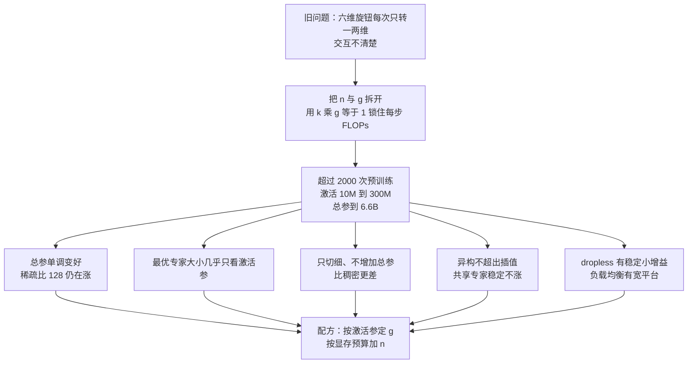

# 切块切粒：两千次实验之后，MoE 配方其实很简单

<!-- release-date: 2026-05-12 -->

> 本文依据 University of Washington 的 **Slicing and Dicing: Configuring Optimal Mixtures of Experts**，即 arXiv:2605.11689v1（2026-05-12），共 158 页。截至核验 arXiv 只有 v1。页码均指这份 PDF。全文把三件事分开标注：**报告明确写了什么**、**我们如何解释或验算它**、**哪些是外部资料补充**。

这是一篇配置搜索论文，不是基模技术报告。它没有对外发布的模型或权重，也没有推理服务的内核实现。它只回答一个看起来很工程、其实一直没人系统做过的问题：

> **混合专家（Mixture-of-Experts，MoE）那些被大家轮流调过的旋钮——专家个数、粒度、异构专家、共享专家、负载均衡、要不要丢 Token——能不能各自优化，不必每次都联合穷举？**

作者把超过 2000 次预训练铺在同一张网格上，最大模型大约 6.6B 总参数（PDF p.1、p.15）。结论出奇地收敛：真正推动质量的几乎只有两维，其余大多是次要扰动。

封面四位作者里，Margaret Li、Sneha Kudugunta、Luke Zettlemoyer 挂 University of Washington；Danielle Rothermel 挂 New York University（PDF p.1）。目录按主要归属放在 `Washington`。代码与数据声明发布在 [github.com/hadasah/slicing_and_dicing](https://github.com/hadasah/slicing_and_dicing)（PDF p.2）；截至撰稿，仓库 README 仍写着 “Code and Data coming soon”，**论文声称开源，公开仓库里还没有可运行的实现。**

## 先把六个旋钮说成人话

后面所有实验都在转这六个旋钮。先用人话钉死，再出现缩写就不会悬空。

- **专家（expert）**：把原来那一层前馈网络（Feed-Forward Network，FFN）复制成许多份小网络。每个 Token（词元，模型读写文本的最小块）只唤醒其中几份。
- **路由器（router）**：一个小的打分器，决定当前 Token 该去哪几位专家。本文默认是 **Token Choice**：每个 Token 选自己亲和度最高的那几位，而不是每个专家反过来挑 Token。
- **粒度 $g$（granularity）**：单个专家有多「厚」。论文把它定义成「这个专家的中间层宽度，除以稠密 FFN 的中间层宽度」（PDF p.2）。$g=1$ 就是专家和稠密 FFN 一样大；$g=\tfrac{1}{4}$ 就是中间层只有稠密版的四分之一，专家更细。
- **激活数 $k$ 与专家总数 $n$**：一层里一共有 $n$ 位专家，每个 Token 只用其中 $k$ 位。$n$ 变大几乎不增加每步浮点运算，但会吃显存；$k$ 变大则每步都更贵。
- **稀疏比 $s$（activation sparsity）**：总 FFN 参数是激活 FFN 参数的多少倍，$s := n\cdot g$（PDF p.3）。有人把它叫 expansion factor（扩展倍数），论文故意不用这个词，因为它已经被拿去指 FFN 中间层相对隐藏层的扩张。
- **共享专家 / 通才（shared expert / generalist）**：不经路由、每个 Token 都要走的那一位专家。DeepSeekMoE 把它当作「特化」的配套设计；这篇论文在 FLOP 对齐的设定下发现它帮不上忙。
- **丢 Token（token dropping）与无丢弃路由（dropless routing）**：专家容量有限时，多出来的 Token 可以被丢掉、改送到次优专家，或者用块稀疏内核保证一个都不丢。后者来自 MegaBlocks（Gale 等人，2022），论文当作一种路由实现来消融。

标题里的 slicing 和 dicing，本文的读法是：slicing 是把专家**切薄**（改 $g$），dicing 是把专家**切成更多块**（改 $n$）。论文要做的事，就是把这两刀从「绑在一起砍」变成「分开砍」。

## 一句话先说清

在他们扫过的每一档激活参数规模上，只要算力对齐，**总参数越多越好，哪怕激活比低到 128**；最优专家大小几乎只取决于激活参数，与总参数无关；共享专家、异构专家、负载均衡超参相对次要，只有无丢弃路由有一份稳定小增益。

于是配方被压成两步（PDF p.2、p.10）：

> **按激活参数规模把专家大小定下来，再按显存预算把专家个数加到顶。其余旋钮不必当成主搜索轴。**

对训练，这意味着 sweep 预算不该平均洒在六维上。对推理服务，这意味着在解码 FLOPs 锁死时，质量的第一约束是「还能不能再塞进一些不激活的专家」，而不是再发明一种更花哨的路由。

## 这篇论文的论证是一条直线

主文只有 10 页正文（PDF p.1–p.10），参考文献 3 页，附录从第 14 页铺到第 158 页。附录几乎全是同一组实验在不同规模、不同验证集上的重复图。本文按主文叙事写；附录只吸入会改变理解的几处：训练配方（附录 A）、学习率与路由实现（附录 B）、随机种子与小模型反例（附录 C.1、C.3），以及「下游除 HellaSwag 外被噪声淹没」（附录 C.7）。

这张图是本文按第 1、3、5 节的论证顺序重画的机制示意（依据 PDF p.1–p.10），不是实测时间轴。框里的数字来自论文正文与 Table 2。

**建议的阅读路线**：只想拿走配方，读「一句话」和第七站末尾的两步即可。想判断「共享专家是不是该删」，读第五站，并带着 DeepSeek-V2 / V3 的对照一起看。想判断自己的小规模消融可不可信，读第六站的 10M / 20M 反例。想知道 158 页附录里有没有藏着相反结论，读「附录里真正改变理解的几件事」。

## 第零站：MoE 看起来有一张六维菜单

稠密 Transformer 里，FFN 中间层宽度习惯取隐藏维度的 4 倍（PDF p.2、p.14）。早期 MoE 把这个 FFN 原样复制成 $n$ 份，每个 Token 只走 1 或 2 份。后来菜单变长了：

1. 专家要不要切细（DeepSeekMoE 那条线）；
2. 要不要留一位永远在场的共享专家；
3. 一层里能不能混用几种大小的专家；
4. 负载均衡用辅助损失、无损失偏置，还是两者一起；
5. 溢出的 Token 丢掉还是用 dropless 内核硬吃下去；
6. 路由是 Token 选专家，还是专家选 Token。

论文的判断是：这些创新「迄今只被单独评估，或只在有限组合里评估」（PDF p.1）。于是一直没人回答那个真正影响排期的问题——**它们之间有没有强交互，值不值得做成一次联合网格搜索。**

这不是学究式的完整性癖好。训练一次中等 MoE 已经很贵；如果六维必须联合扫，实验室级的搜索根本做不完。如果它们近似可分，配方就可以从「玄学」变成「先定两维，其余用默认值」。

## 第一站：四个量必须拆开，否则你以为在调粒度，其实在调计算量

### 粒度不是「专家变小」这么简单

论文把粒度写成（PDF p.2）：

$$
g=\frac{\text{专家 FFN 的中间层宽度}}{\text{稠密 FFN 的中间层宽度}}
$$

只看这个定义，有人会以为「把 $g$ 改小」就是「专家变细、模型变强」。但 $g$ 一变，若 $k$ 不跟着变，每 Token 的激活参数就变了，比较就不再公平。

### 用激活参数锁住每步 FLOPs

他们的对齐规则是（PDF p.3）：

$$
k\cdot g=1
$$

人话：要让 MoE 的激活 FFN 参数跟稠密基线一样多，专家切成四分之一厚，每个 Token 就得同时走 4 位专家。切成八分之一厚，就得走 8 位。$g=1$ 时 $k=1$，也就是 Switch Transformers 那种 top-1。

这一步的后果必须先说清，因为它决定了后面所有「共享专家有没有用」的读法。**他们比较的不是「同样的路由专家之外再白捡一位共享专家」，而是「激活 FFN 参数总量不变」。** 加一位共享专家，路由专家能用的激活额度就被抢走一块。

### 专家总数几乎只涨显存

$n$ 可以独立于 $g$ 和 $k$ 再变。论文写得很干脆：总专家数变大，计算成本几乎可以忽略，但每个新增专家都按基础设施吃显存（PDF p.3）。

于是稀疏比自然出现：

$$
s:=n\cdot g
$$

$s=1$ 就是「所有 FFN 参数都被激活」，和稠密一样；$s=128$ 就是总 FFN 参数是激活 FFN 参数的 128 倍，每个 Token 只摸到其中 $\tfrac{1}{128}$。摘要里那句「extreme active expert parameter ratios like 128」，指的就是这个 $s$，不是 128 位专家，也不是 128%（PDF p.1）。

### 异构与通才：菜单还能再打开

同质 MoE 要求一层里所有专家一样厚。论文把定义放宽成两件事（PDF p.3、p.8）：

- **异构**：一层里放两池不同粒度的专家，例如 8 位 $g=\tfrac{1}{2}$ 再加 16 位 $g=\tfrac{1}{4}$。
- **通才 / 共享专家**：永远激活的一位，粒度 $g_{\mathrm{gen}}$ 可以另选。

FLOP 对齐相应地变成「通才加上所有被激活专家的粒度之和等于 1」（PDF p.8）：

$$
g_{\mathrm{gen}}+\sum_i k_i\cdot g_i=1
$$

稀疏比也推广成 $s=g_{\mathrm{gen}}+\sum_i n_i\cdot g_i$。这些式子看起来烦，做的事只有一件：**禁止任何人靠「多算一点」赢。**

### 路由器这一侧有三条常见补丁

不额外约束时，路由器会把流量堆到少数专家上，其余专家拿不到梯度，模型退化成一个小网络（PDF p.3）。论文扫了三条补丁：

1. **辅助负载均衡损失**，权重 $\alpha$，加在语言建模交叉熵上（PDF p.3–p.4）：

$$
L=L_{\mathrm{CE}}+\alpha L_{\mathrm{auxiliary}}
$$

最常用的一项是 $L_{\mathrm{LB}}=N_E\sum_i f_i P_i$，即「这位专家分到的 Token 比例」乘「路由器给它的平均概率」，再按专家数缩放（PDF p.4）。

2. **无损失负载均衡**：DeepSeek-V3 那种给每位专家加一个不进梯度的偏置，每步按超参 $\gamma$ 挪一点，把负载往均匀推（PDF p.4）。论文把它和辅助损失做成 $2\times 2$ 交叉。

3. **容量因子与 dropless**：即使平均负载均衡，单个 batch 仍会局部过载。常见做法是给每位专家留 2 倍容量（capacity factor = 2），多出来的丢掉或改道。论文指出这既浪费至少一半容量，又消不掉所有溢出（PDF p.4）。dropless 用块稀疏保证不丢。

他们还提到 ST-MoE 的 router Z-loss，用来压路由器 logits 的幅度（PDF p.4）。主实验里 Z-loss 权重固定为 $1\times 10^{-3}$（PDF p.14）；附录 B 说去掉它在他们的规模上几乎没影响，但文献认为它在激活参数超过 1B 时才真正管稳定性，所以仍保留（PDF p.18）。

## 第二站：两千次预训练，锁住的是 FLOPs，不是墙钟

### 模型档位

架构松散地跟 OLMoE 走（Muennighoff 等人，2025；PDF p.4）。他们按**激活参数**命名七档：10M、20M、50M、80M、110M、200M、300M；总参数从约 10M 拉到 6.6B（PDF p.4、p.15）。

Table 2 里几个对读图有用的锚点（PDF p.15）：

| 名称 | 层数 | 隐藏维 | 注意力头 | 激活非嵌入 | 稠密总参 | $s=64$ 时总参 | 本档最大总参 |
|---|---:|---:|---:|---:|---:|---:|---:|
| 10M | 3 | 48 | 3 | 110.9K | 9.7M | 15.0M | 15.0M（$s=64$） |
| 50M | 5 | 240 | 6 | 4.6M | 52.7M | 270.5M | 934.0M（$s=256$） |
| 110M | 9 | 432 | 9 | 26.9M | 113.5M | 1.4B | 1.4B（$s=64$） |
| 300M | 12 | 832 | 13 | 132.9M | 299.8M | 6.6B | 6.6B（$s=64$） |

**本文从表上读到的一个关键结构事实**：10M 档即使把 FFN 稀疏比拉到 64，总参也只从 9.7M 涨到 15.0M。原因是非嵌入激活只有 110.9K，词表嵌入占了绝对大头。300M 档同样 $s=64$，总参却从 299.8M 涨到 6.6B。后面「小模型上 MoE 赢不了稠密」必须带着这张表读，不能只怪「模型太小」。

同质网格的 $(n,g)$ 组合画在 Figure 8（PDF p.16）。本文数过格子：大约 43 个点，覆盖 $g\in\{1,\tfrac{1}{2},\tfrac{1}{4},\tfrac{1}{8},\tfrac{1}{16},\tfrac{1}{32},\tfrac{1}{64}\}$、$n\in\{2,4,8,16,32,64,128,256,512,1024\}$，对应 $s$ 最大到 256。不是每个规模都跑满整张图：50M 能看到 $s=256$，300M 主文 Figure 2 的稀疏比图例只到 32，Table 2 最大 $s=64$。摘要里的「ratio like 128」出现在他们真正扫到 $s=128$ 的那些档，主要是较小的激活规模。

异构网格被刻意收窄，否则组合会爆炸。他们只允许两池专家，并且两池平分激活参数和总参数：$n_1=\tfrac{1}{2}n_2$、$k_1=\tfrac{1}{2}k_2$、$g_1=2g_2$（PDF p.8、p.17）。Table 3 列出的粒度对是 $(\tfrac{1}{2},\tfrac{1}{4})$、$(\tfrac{1}{4},\tfrac{1}{8})$、$(\tfrac{1}{8},\tfrac{1}{16})$、$(\tfrac{1}{16},\tfrac{1}{32})$（PDF p.17）。每一个异构点，都可以看成两个邻近同质点之间的插值——这个设计本身已经预告了第五站的结论。

### 数据、步数和超参

数据直接用 OLMoE 的公开混合：DCLM-Baseline、StarCoder、peS2o、arXiv、OpenWebMath、Algebraic Stack、英文 Wikipedia 与 Wikibooks（PDF p.14）。每个模型按 Chinchilla 的建议，用大约 20 倍于激活参数的 Token 来训（PDF p.14）。换算一下：

- 10M 激活 $\rightarrow$ 约 200M Token（Figure 16 写明；PDF p.30）；
- 20M 激活 $\rightarrow$ 约 400M Token（Figure 17；PDF p.30）；
- 300M 激活 $\rightarrow$ 约 6B Token。

主实验超参锁在 Table 1（PDF p.14；粗体是 §3.1–3.2 的默认值）：

| 项 | 值 |
|---|---|
| 词表 | 50K |
| batch | 512 |
| 序列长 | 2048 |
| 学习率 | $4\times 10^{-4}$ |
| FFN 中间层 | $4\times$ 隐藏维 |
| 调度 | 余弦衰减（也试过 WSD，主实验没用） |
| warmup | 50 step |
| 结束学习率 | 峰值的 0.1 倍 |
| 优化器 | Adam，$\beta_1=0.9$，$\beta_2=0.95$ |
| 非线性 | SwiGLU |
| MoE Z-loss | $1\times 10^{-3}$ |
| 负载均衡损失权重 $\alpha_{\mathrm{LB}}$ | $1\times 10^{-2}$（主实验）、$1\times 10^{-4}$（消融） |
| 无损失偏置 $\gamma$ | 0（主实验）、$1\times 10^{-3}$（消融） |
| Token 丢弃 | dropless（主实验）与 default |
| 路由 | Token Choice |

**本文的换算，不是论文原文**：batch $\times$ 序列长 $=512\times 2048=1{,}048{,}576$，大约每步 1.05M Token。50M 档约 1.05B Token，只相当于约 1000 step；300M 档约 5700 step。warmup 只有 50 step。这是实验室规模的短跑，不是生产预训练的里程。后文所有「单调变好」都该标上这个时间尺度。

学习率扫过 $\{1\times 10^{-4},4\times 10^{-4},1\times 10^{-3},4\times 10^{-3},1\times 10^{-2}\}$。最优学习率会随激活参数、总参数和其它设定一起变；他们决定锁在「对最大规模、超过 1 亿激活参数接近最优」的 $4\times 10^{-4}$，换可比较的趋势，不换每个格子上的绝对最优（PDF p.18）。WSD 在初期略好于余弦，但随规模变敏感，主实验仍用余弦（PDF p.18）。

### 评测口径

主指标是一组 held-out 语言建模任务的宏平均交叉熵：Paloma 子集里的 C4、The Pile、WikiText-103、Dolma（再拆 books / common-crawl / peS2o / reddit / stack / wiki）、M2D2 S2ORC、ICE（PDF p.14）。下游有 BoolQ、HellaSwag、MMLU（人文学科 / STEM / 社会科学 / other）。**主文几乎只看语言建模 CE**；附录 C.7 明确说，下游除 HellaSwag 外，随机噪声会淹没信号（PDF p.117）。

附录 C.1 用 5 个随机种子，在 50M 的一档稠密和一档 MoE（$g=\tfrac{1}{2}$，$n=64$）上量方差（PDF p.20）。语言建模平均 CE 的标准差是 0.02；HellaSwag 的标准差是 0.00；BoolQ 与 MMLU 各分项在 0.08 到 0.43 之间。论文据此认为语言建模趋势不必每个格子都跑多种子。

表 4 印出来的均值是稠密 5.38、该 MoE 5.70（PDF p.20）。这个方向和 Figure 2 在 50M 上「几乎所有 MoE 都优于稠密」的图不一致。**本文只采用它真正要证明的事——LM 方差接近 0、下游噪声大；均值列不作架构对比。** 可能是列对调，也可能是这个种子实验的配置与主网格不完全同设定。论文没有解释。

### 算力账单

训练卡是 A40、L40、L40S、H200 的混合。主实验大约 32,000 GPU 小时，预实验另外 9,500（PDF p.14）。各档单次训练大约是 2、4、8、12、24、56、108 GPU 小时，对应 10M 到 300M（PDF p.14）。卡型不同，这些小时数不能直接加总成一张账单，论文也没给折算。

异构两池的实现是「每池一个路由器」，不是一个路由器打全部专家。论文说这是基础设施限制，功能上等价于单路由器（PDF p.18）。他们不用 Expert Choice，理由有两条：不能保证每个 Token 分到同样的计算，部分 Token 等于被丢掉；以及专家挑 Token 会让序列前面的路由看到后面的 Token，泄漏未来信息（PDF p.18）。

## 第三站：总参越多越好，哪怕激活比低到 128

主文把同质网格画成 Figure 2 的三列（PDF p.5）。建议按列读，不要被 9 张小图吓住。

### 左列：专家个数锁死，把专家加厚

$n$ 固定时，把 $g$ 从 $\tfrac{1}{64}$ 推到 $1$，就是在加每位专家的宽度，也就是加总参数。三条激活档（50M / 110M / 300M）上，曲线整体向下：交叉熵随专家变厚而下降（PDF p.5–p.6）。论文的句子是：「在固定专家总数时，性能随专家变大而提升。」

### 中列：粒度锁死，把专家个数加上去

$g$ 固定时，把 $n$ 从 2 加到 1024，每步 FLOPs 几乎不变，总参在涨。曲线同样向下（PDF p.5–p.6）。论文说，也许存在一个临界点，再加总专家参数会不再涨、甚至变差；**在他们的设定里没观察到**（PDF p.6）。

### 这两列合在一起说的是同一件事

无论你用「加厚」还是「加个数」去堆不激活的专家参数，质量都在涨。50M 档总参从 50M 拉到 930M，110M 档拉到 1.4B，300M 档拉到 6.6B，趋势没有翻转（PDF p.5）。稀疏比到 128 时，50M 那一组仍在随总参变好。这就是摘要第一句硬结论（PDF p.1）。

**本文的解释**：MoE 的「免费午餐」不是细切本身，是你用同样的每步 FLOPs 买到了更多参数。参数多在那里，即使这个 Token 没用到，训练过程中别的 Token 会用到，容量就还在。左列和中列是同一容量用两种切法实现。

### 一个必须单独标出的例外：top-1

$g=1$ 时 $k=1$，每个 Token 只更新路由器的一行。论文观察到：固定 $n$，把 $g$ 从 $\tfrac{1}{2}$ 再加到 $1$，趋势会回退（PDF p.6）。他们的假说与 ST-MoE 一致——只有一位专家被激活时，路由器各行无法互相校准。**所以「专家越大越好」在 $g=1$ 处停住了。** FLOP 对齐的 MoE 里，留至少两位激活专家，不是口味，是优化器能看见的几何。

## 第四站：最优专家大小几乎只看激活参

Figure 2 的右列把问题换成「总参锁死、内存预算锁死，该切厚还是切多」（PDF p.5–p.6）。横轴仍是 $g$，每条线是一个固定的 $s$。

论文读图的结论是（PDF p.6）：

- 最优粒度随 $s$ 只缓慢变化。稀疏比往上加时，最优 $g$ 几乎不动，略微变粗。因此**稀疏主要该靠加 $n$，而不是把专家继续切细。**
- 最优粒度明显随有效模型规模变。

三档的具体区间是（PDF p.6）：

| 激活参数 | 最优 $g$ | 随 $s$ 增大时的移动 |
|---|---|---|
| 50M | $[\tfrac{1}{4},\tfrac{1}{2}]$ | $s\ge 32$ 时移到 $\tfrac{1}{2}$ |
| 110M | $[\tfrac{1}{8},\tfrac{1}{4}]$ | 更大 $s$ 时移到 $\tfrac{1}{4}$ |
| 300M | $\le\tfrac{1}{8}$ | 主文给的是上界 |

结论第 5 节把这三档收成一句更粗的话：「在我们的设定里把粒度保持在大约 $\tfrac{1}{4}$ 的较粗水平」（PDF p.10）。**大约 $\tfrac{1}{4}$ 是跨档的口诀，不是 300M 的点估计。** 300M 已经走到 $\tfrac{1}{8}$ 或更细。

摘要里「optimal expert size is nearly invariant to total parameter count and depends only on active parameter count」（PDF p.1），对应的就是右列：固定激活规模时，总参（也就是 $s$）怎么变，最优专家大小几乎不动；换一档激活规模，最优大小才换。

**本文的验算，不是论文原文。** 稠密 FFN 中间层是 $4\times$ 隐藏维。若把「专家大小」理解成专家中间层宽度：

- 50M、隐藏维 240、取 $g=\tfrac{1}{4}$ $\rightarrow$ 专家中间层 240；
- 110M、隐藏维 432、取 $g=\tfrac{1}{8}$ $\rightarrow$ 专家中间层 216；
- 300M、隐藏维 832、取 $g=\tfrac{1}{8}$ $\rightarrow$ 专家中间层 416。

跨激活档，绝对宽度并不是常数，它跟着激活规模涨。论文说的「不变」是：**对同一档激活参数，不要因为你决定堆更多总参，就把专家继续切细。** 切细是另一档激活规模的事。

这和「DeepSeekMoE 把专家切得很细所以细就是好」不是同一句话。细或粗要先问你的激活参数在哪一档。

## 第五站：另外几维几乎都可以从主搜索里拿掉

### 只切细、不增加总参，比稠密更差

如果 MoE 的好处来自「把一个大 FFN 切成并行的小块」这种归纳偏置，那么在 $s=1$ 时把 FFN 切成 2、4、8 份，应当至少不差。他们做了这个对照：总参和激活参都不变，只是把 FFN 切成 $n$ 个 $g=\tfrac{1}{n}$ 的常开模块，权重要么均匀，要么用一个伪路由器学习（PDF p.6–p.7）。

Figure 3 里这些 $s=1$ 的点全部显著差于稠密基线（PDF p.6）。论文的推论：MoE 的主机制是增加总参数，不是「切细」本身。

### 异构专家落在两条同质曲线之间

Figure 4 把异构画成虚线，同质画成实线（PDF p.6）。固定稀疏比时，异构点落在最邻近的两个同质点之间或近旁，没有冒到上方去变成新的最优。论文的原话是「heterogeneity alone does not yield improved performance」（PDF p.8）。

**本文的读法**：他们的异构网格从一开始就被定义成「两个同质点的插值」（PDF p.17）。这个实验能排除「两池不同大小会凭空多出一种能力」，不能排除「一种完全不同的异构方案」——比如按层变化粒度、三池以上、或者按 token 类型把粗细专家当不同通路。论文自己也说组合会爆炸，所以只探了这一小块（PDF p.8）。

### 共享专家在 FLOP 对齐下稳定不涨

通才粒度取 $\{\tfrac{1}{2},\tfrac{1}{4},\tfrac{1}{8}\}$，覆盖同质和异构、并盯着前面最好的配置来加（PDF p.8）。Figure 5 在 50M 上画得很直白：任何粒度的通才，结果都是持平或略差（PDF p.7）。附录 C.4 把同一张图重复到其它规模，方向不变。

这里有一个容易误读的约束。通才占掉 $g_{\mathrm{gen}}$ 之后，剩下的路由专家粒度之和必须是 $1-g_{\mathrm{gen}}$。例如通才已经是 $\tfrac{1}{8}$，就不可能再只使用 $g=\tfrac{1}{2}$ 的路由专家（PDF p.8）。所以「加共享专家」在这篇论文里从来不是免费加容量，而是**从路由专家的激活预算里挖一块出来做常开通路。**

贡献列表把这件事写得很重：「generalists consistently hurt」（PDF p.2）。主文稍微软一点：「comparable or slightly degraded」（PDF p.8）。两种表述都比「共享专家是 MoE 标配」更负面。

相关工作里他们点了两篇相反结论的论文（PDF p.9）：

- OLMoE（他们的训练配方来源）在 1B 激活 / 7B 总参、只扫单因素时，也发现共享专家会伤性能。这一点与本文一致。
- Zhao 等人（2025）认为共享专家必要，并且存在一个固定的最优激活专家数 $\approx 7$。本文明确反对：这些最优值是规模依赖的，不是常数；高自由度拟合很容易过拟合到一个具体区间。

与 DeepSeek 系列的对照放到第九站，避免把外部报告写进本章。

### 所以：六维里能独立优化的是哪些

论文开篇问的就是「这些选择能否在不考虑交互的前提下独立优化」（PDF p.1）。把主文实验收成一张表，是本文的整理，不是论文原表：

| 旋钮 | 要不要进主搜索 | 交互 | 依据 |
|---|---|---|---|
| 专家总数 $n$ | 要。显存允许就加 | 与 $g$ 在固定内存下互为交易 | Figure 2 中列、右列 |
| 粒度 $g$ | 要。按激活参定，不要随总参乱切 | 最优值几乎不随 $s$ 变 | Figure 2 右列 |
| 异构 | 不必。先把同质做好 | 表现像插值 | Figure 4 |
| 共享专家 | 不必。FLOP 对齐下不涨 | 会抢走路由专家的激活额度 | Figure 5 |
| 负载均衡超参 | 只需进入平台，不必细扫 | 出区间会伤，平台内差不多 | Figure 7 |
| Token 丢弃 | 打开 dropless 即可 | $n$ 极大时与 default 差距缩小 | Figure 6 |

独立优化的准确含义不是「六维完全可分」，而是：**主搜索可以塌缩成 $(n,g)$ 两维；其余旋钮用默认值，不会把最优解搬到另一块区域。**

## 第六站：10M / 20M 的反例，其实是算力不够

论文没有假装趋势从 10M 就开始。50M 及以上，即使较劣的 MoE 也常常赢稠密；10M 和 20M 上，MoE 在所有设定里都赢不了稠密，包括异构、通才、负载均衡消融（PDF p.6、p.27，Figure 12–15）。

他们的假说不是「模型太小所以 MoE 无效」，而是**数据预算和参数预算的交互**。验证方式：把 10M 的数据扩到 20 倍（4B Token），把 20M 的数据扩到 5 倍（2B Token），让总计算量和 50M 那一档差不多（PDF p.6、p.30）。扩完之后，MoE 重新超过稠密，$(n,g)$ 的权衡也开始像 50M（Figure 16–17，PDF p.30）。

这里有一处附录笔误，需要按主文和带 Token 数的图注来读。正文写「10M 扩 20 倍、20M 扩 5 倍」（PDF p.6），Figure 16–17 的 4B / 2B 也支持这一句。附录 C.3 段首把 5 倍和 20 倍写反了，还写成「约 100 倍和 400 倍于激活参数」（PDF p.27）。**本文以主文和带绝对 Token 数的图注为准。**

**本文的解释**：Table 2 已经提示过，10M 档加专家几乎加不到总参。Chinchilla 的 20 Token / 参数再叠上去，训练信号太短，稀疏容量还没被用上。把 Token 加到和 50M 同一计算量，稀疏容量才开始兑现。所以「小模型上 MoE 没用」不能直接外推到「生产规模上 MoE 必须切多细」；它首先是一次算力对齐失败。

## 第七站：路由只需两件事——打开 dropless，把负载均衡留在平台里

### dropless 有稳定小增益

Figure 6 把 dropless 和允许丢 Token 的 default 叠在同一张粒度图上（PDF p.7）。跨规模，dropless 更好或持平。贡献列表的用词是「small but consistent gain」（PDF p.2）。

有一个边界：总专家数到 $n=1024$ 时，default 开始追平 dropless（PDF p.9）。附录 B 把这个现象的起点写得更早，在 $n=256,512,1024$ 的部分预实验里已经接近（PDF p.19）。论文的解释是平均每位专家的负载变低，溢出变少，丢不丢差别自然变小。

对推理服务，这句话的迁移方向是：**中等 $n$ 时，dropless 内核（MegaBlocks 那一类块稀疏）值得做；专家极多、每位专家本来就很空时，它不再是一等公民。** 论文没有给延迟或吞吐数字，这只是从质量曲线推出来的工程含义。

### 负载均衡：平台很宽，掉下去却很陡

他们扫 $\alpha_{\mathrm{LB}}\in\{1\times 10^{-4},1\times 10^{-2}\}$ 和 $\gamma\in\{0,1\times 10^{-3}\}$，覆盖同质、异构和通才（PDF p.9）。50M 同质画在 Figure 7（PDF p.8），其余在附录 C.4。

几条同时成立的观察：

1. 最差的一格是 $\alpha_{\mathrm{LB}}=1\times 10^{-4}$ 且 $\gamma=0$，也就是辅助损失太轻、又没有无损失偏置（PDF p.9）。附录 Figure 10–11 显示这一格的负载均衡损失和负载不均衡都更高（PDF p.24、p.26）。他们把负载不均衡定义成「一个 batch 里最大专家负载除以平均负载」（PDF p.26）。
2. $n\le 128$ 时没有一格明显统治（PDF p.9）。Figure 7 图注更宽一点：除了 $(\alpha_{\mathrm{LB}}=1\times 10^{-2},\gamma=1\times 10^{-3})$ 之外，其它设定在 $n\le 512$ 都差不多（PDF p.8）。
3. $n$ 很大时，无损失偏置会伤性能。他们用的 $\gamma=1\times 10^{-3}$ 照抄 DeepSeek-V3；专家一多，这个步长对每位专家的路由概率来说就太粗（PDF p.9）。
4. 附录 Figure 11 还显示，$\gamma=1\times 10^{-3}$ 会在专家总数升高时把负载不均衡显著推高（PDF p.26）。质量变差和均衡变差在这里是同一方向，不是「更均衡却伤了 CE」。

论文对 DeepSeek-V3 的无损失机制给了一句很具体的读法：DeepSeek-V3 **没有**考虑 dropless，可能需要无损失机制来避免丢 Token，同时又不把辅助损失加得太重（PDF p.9）。**这是论文的推断，不是 DeepSeek 报告的原文。** 本站对 DeepSeek 那套机制的讲述见 [DeepSeek-V3](/reports/DeepSeek/DeepSeek-V3)，不要把两篇的句子混成一句。

Z-loss 如前所述，主实验保留，预实验看不出质量影响（PDF p.18）。它不进入配方的主轴。

## 第八站：训练曲线、HellaSwag，以及附录里真正改变理解的几件事

158 页里大约 140 页是附录。结构是：

| 附录 | 页码 | 本文是否吸入 | 原因 |
|---|---|---|---|
| A 训练细节、Table 1–3、Figure 8 | p.14–p.17 | 吸入 | 没有这些数字，主文的「6.6B / 20 Token 每参数」无法落地 |
| B 学习率、WSD、Z-loss、路由器实现 | p.18–p.19 | 吸入 | 解释他们为什么锁学习率、为什么不用 Expert Choice |
| C.1 五种子 | p.20 | 吸入方差，不用均值对比 | 见第二站 |
| C.2 训练 CE、负载均衡损失、负载不均衡 | p.21–p.26 | 吸入 Figure 10–11 的结论句 | 给第七站的「最差一格」提供机制证据 |
| C.3 10M / 20M 与加 Token | p.27–p.30 | 吸入 | 改变「小模型上 MoE 无效」的读法 |
| C.4 全规模重复主文图 | p.31 附近起 | 不搬图 | 论文自己说趋势与主文相同 |
| C.5 HellaSwag 准确率 | p.39 | 吸入一句 | 足够大的计算规模上，准确率趋势跟 CE 同向 |
| C.6 按语言建模数据集拆开 | 其后约 80 页 | 不搬 | 主文已说各域趋势相似（PDF p.5） |
| C.7 按下游客拆开 | p.117 起 | 吸入段首 | 除 HellaSwag 外噪声淹没信号 |

Figure 9 把训练 CE（最后 50 step 平均）画出来，说训练曲线和验证 CE 同向（PDF p.22）。这排除了「他们只是在验证集上过拟合出一张漂亮图」。

Figure 25 说，计算规模足够大时，HellaSwag 的长度归一化准确率走势与交叉熵一致（PDF p.39）。主文没有把下游当作架构选择的依据，附录把原因写死了：除 HellaSwag 外，下游噪声比效应大（PDF p.117）。**读这篇论文不要从 MMLU 曲线里找配方。**

C.4 之后按规模、按数据集把 Figure 2–7 再画几十遍。本文核对过图注：标题仍是「加总参变好 / 异构无额外收益 / 通才变差或持平 / dropless 更好或持平 / 负载均衡必须落在平台里」。没有发现主文结论被某张附录图翻转。不把 2000 次实验的表搬进来。

## 第九站：和现有生产配方对不上时，差在哪一刀

相关工作第 4 节点名了三条线（PDF p.9）。对照时必须分开「论文写了什么」和「我们如何把本站其它报告放在旁边」。

### 和「粒度绑在专家数上」的 scaling 论文

Tian 等人（2025）从计算效率看激活比、粒度和共享专家，但把粒度绑在专家数上、并且各因素单独看。论文认为，这就是他们推荐「切得更细」而本文推荐「明显更粗、且共享专家没好处」的原因（PDF p.9）。**拆开 $n$ 和 $g$，是这篇论文相对那些 scaling 拟合的方法贡献。**

Clark、Ludziejewski、Abnar、Wang 那些更早的 MoE scaling 工作，被放在「简化设定」里（PDF p.9）。本文不展开他们的拟合式，论文也没有重拟合一条新的定律。

### 和 OLMoE

配方来源是 OLMoE。OLMoE 在单规模（1B 激活 / 7B 总参）上逐项消融，共享专家同样有害（PDF p.9）。这篇论文做的是把同一套数据与相似架构拉成七档、并把 $n$ 与 $g$ 拆开。它不是 OLMoE 的复现报告，也没有声称自己的 300M 激活可以代替 OLMoE 的 1B 激活。

### 和 DeepSeekMoE / DeepSeek-V3：最大的外部张力

DeepSeek-V3 被引用为「细粒度特化 + 共享专家 + 更好的路由 = 一套更优配方」的代表（PDF p.9）。本站已有的讲述是：

- [DeepSeek-V2](/reports/DeepSeek/DeepSeek-V2) 里的 DeepSeekMoE：专家切细，并留出每个 Token 都走的共享专家；
- [DeepSeek-V3](/reports/DeepSeek/DeepSeek-V3) 沿用该结构，并加上无辅助损失的偏置去调排队顺序。

两边差在三处，都是设定而不是「谁写错了」：

1. **规模**。本文最大 300M 激活 / 6.6B 总参、约 20 Token / 激活参数；DeepSeek-V3 是 671B 总参 / 37B 激活、百万 GPU 小时量级。论文自己也把 Zhao 等人的「固定最优 $k\approx 7$」判断为规模过拟合（PDF p.9）。同一把尺子反过来量自己：300M 上伤害共享专家的结果，外推到 37B 激活时只是一个假说。
2. **FLOP 对齐方式**。本文加共享专家必须从路由专家的激活额度里挖。生产模型若把共享专家当成「额外常开容量」而不是「重分配」，比较对象就变了。
3. **dropless**。本文主实验默认 dropless，并猜测 DeepSeek-V3 需要无损失偏置，部分是因为没走 dropless（PDF p.9）。这是论文的猜测。

**可迁移的读法不是「删掉共享专家」，而是「在 FLOP 对齐、实验室规模、dropless 打开时，共享专家不是一等公民；不要把它和 $n$、$g$ 放在同一搜索优先级。」** 生产线上要不要留一位常开专家，仍然要在自己的规模上量，不能靠这 2000 次实验替你决定。

## 对训练和推理，这张配方具体改什么

论文几乎不谈推理系统。下面是本文把第 5 节配方接到训练排期和推理服务上的翻译，全部标成解释。

### 训练排期

1. **把 sweep 预算集中在 $(n,g)$。** 先按激活参数选一个较粗的 $g$（他们的口诀是大约 $\tfrac{1}{4}$，更大激活档往 $\tfrac{1}{8}$ 走），再沿 $n$ 加到显存上限。不要先上异构，也不要先上共享专家。
2. **不要用 $s=1$ 的切细实验代替 MoE 实验。** Figure 3 已经说明，切细本身不是收益来源。
3. **学习率锁死，换来可比的趋势。** 每个格子单独扫学习率，在 2000 次的预算里既做不到足够分辨率，又会引入额外噪声（PDF p.18）。他们引用的是同一组作者的 scaling 综述（Li、Kudugunta、Zettlemoyer，2025）。
4. **辅助损失只要落在平台里。** $\alpha_{\mathrm{LB}}=1\times 10^{-2}$、$\gamma=0$ 是主实验默认；$\gamma=1\times 10^{-3}$ 在大 $n$ 上要重调，不能从 DeepSeek-V3 原样抄。
5. **小规模消融必须把 Token 补到能让稀疏容量兑现。** 10M / 20M 在 Chinchilla-20 下会给出「MoE 无效」的假阴性。

### 推理服务

1. **解码 FLOPs 锁死以后，质量的第一约束是显存。** $n$ 加下去几乎不增加每 Token 计算，但每个专家都要住在可访问的内存里。服务侧该问的是「还能不能再放一些不激活的专家」，而不是「再砍一点激活专家」。
2. **专家不要无底线地切细。** 细专家意味着更大的 $k$、更碎的 GEMM、更重的 all-to-all。本文的最优 $g$ 在实验室规模上明显粗于 DeepSeekMoE 常见的「几十上百位小专家、每次激活六到八位」。吞吐敏感的时候，粗专家和这篇论文的质量最优是同一方向。本站 [Trinity-Large](/reports/Arcee/Trinity-Large) 也记录过「为了吞吐把专家做大」的生产选择；那是另一篇报告的原文，不是这篇的结论。
3. **dropless 是中等 $n$ 的质量按钮。** $n$ 到数百、上千，丢 Token 的发生率自己会掉，内核复杂度的回报下降。
4. **top-1 省通信，但在 FLOP 对齐下质量回退。** 若服务侧为了 EP 通信改成 $k=1$，要清楚这不是免费的。
5. **论文没有给 EP、PD 分离、专家并行拓扑或 decode 延迟。** 不能从这张质量网格推出该用多少专家并行度。

## 论文没有写、因而不能补的部分

- 没有推理延迟、吞吐、TTFT、容量因子对墙钟的影响。dropless 的「增益」只是验证 CE。
- 没有专家并行、流水线、通信重叠的实现。异构「每池一个路由器」只说是基础设施限制（PDF p.18），没有图画或伪代码。
- 没有长上下文。序列长固定 2048（PDF p.14）。
- 没有指令微调、强化学习或后训练。全部是预训练 CE。
- 没有公开可运行的代码与数据。论文给了 GitHub 链接（PDF p.2），仓库目前仍是占位。
- 没有把 2000 次实验拟合成一条可外推的 scaling law。他们明确批评高自由度拟合容易过拟合（PDF p.9）。
- 最大激活参数 300M，最大总参 6.6B，Token 预算约 20 倍激活参数。这三件事一起，构成外推上限。
- 没有报告每个格子的墙钟或 Token / 秒，GPU 小时只给了分档大约值，且卡型混合（PDF p.14）。

## 可以带走的六条

### 1. 六维菜单可以塌成两维

旧习惯是每次只转一两个旋钮，再靠别的论文的默认值填其余。这篇论文证明，在 FLOP 对齐的预训练 CE 上，异构、共享专家、负载均衡超参不值得进入主搜索。**主搜索是 $(n,g)$，其余用默认值。**

### 2. MoE 的主机制是多出来的那些不激活参数

只切细、不增加总参，会输给稠密（Figure 3）。加厚或加个数，只要总参在涨，CE 就在降（Figure 2）。配方写成「显存允许就加专家」，不是因为作者懒，是因为他们没找到总参的临界点。

### 3. 专家大小跟总参几乎无关，跟激活参有关

固定激活档，稀疏比从 2 拉到几十，最优 $g$ 几乎不动。换一档激活规模，最优 $g$ 才变。不要把「某篇 7B 总参论文的细专家」抄到自己的 300M 激活模型上，也不要反过来。

### 4. 共享专家不是免费的特化装置

在激活额度守恒时，它是从路由专家那里挖出来的常开通路。实验室规模上这条通路不涨点。生产模型若要留它，需要自己的规模证据，不能把 DeepSeek 的标配和这篇的负面结果直接相加。

### 5. 路由只要不掉出平台

dropless 打开，辅助损失留在 $10^{-2}$ 量级，无损失偏置的步长不要在大 $n$ 上照抄 $10^{-3}$。再细扫 $\alpha$ 和 $\gamma$，收益小于把同一笔计算拿去加专家。

### 6. 小规模、短 Token 的 MoE 消融会撒谎

10M / 20M 在 Chinchilla-20 下全面输给稠密；把 Token 补到与 50M 同计算量，趋势就回来。做架构搜索时，先问稀疏容量有没有被数据用上，再问架构好不好。

## 关键词回看

- **粒度 $g$**：专家 FFN 中间层相对稠密 FFN 中间层的比例。$g$ 小就是细专家。
- **激活数 $k$**：每个 Token 走几位专家。本文用 $k\cdot g=1$ 锁住 FLOPs。
- **专家总数 $n$**：一层里有多少位专家。主要吃显存。
- **稀疏比 $s=n\cdot g$**：总 FFN 参数相对激活 FFN 参数的倍数。摘要里的 128 指这个量。
- **通才 / 共享专家**：不经路由、每个 Token 都走的 FFN。
- **异构专家**：同一层里两池不同 $g$ 的专家。
- **Token Choice**：Token 选专家；与 Expert Choice 相对。
- **辅助负载均衡损失 $L_{\mathrm{LB}}$**：用 $f_i P_i$ 惩罚扎堆。
- **无损失偏置 $\gamma$**：不进梯度、每步把专家负载往均匀推的控制器。
- **dropless routing**：用块稀疏保证不丢 Token。
- **router Z-loss**：压路由器 logits 幅度的辅助项，本文规模上几乎看不到质量影响。
- **FLOP 对齐**：比较对象的每 Token 激活 FFN 参数相同，禁止靠多算取胜。

## 最后的判断

这篇论文最好的地方，不是又提出一种专家结构，而是把 MoE 配置从「一份来自大厂报告的菜单」降维成「一次两维网格」。

2000 多次预训练听起来像蛮力。真正省下来的，是证明蛮力不必花在另外四维上。共享专家、异构、负载均衡超参、Z-loss，在他们的设定里要么有害，要么有宽平台。**一份看起来很复杂的架构，被实验证明其有效自由度其实很少。** 这对训练排期的价值，大于再多一张 300M 的 CE 表。

需要守住的边界同样清楚。最大 6.6B 总参、约 20 Token / 激活参数、序列 2048、评测以语言建模 CE 为主、代码尚未真正放出。它证明的是：

> **在 300M 激活以内、FLOP 对齐、Token Choice + dropless 的预训练里，质量几乎只响应专家个数和粒度；按激活参定专家大小、按显存加专家个数，是目前最简单且未被他们自己的网格推翻的配方。**

它没有证明生产级 100B 以上激活、长上下文、RL 后训练里共享专家仍然无用，也没有证明推理延迟会随 $n$ 免费下降。把这两句分开，这篇 158 页的附录才不会被误当成一份部署手册。

如果只记一句：

> **MoE 的搜索空间看起来像一桌菜，真正要点的只有两道：专家有多厚、有多少个。厚薄看激活参数，个数看显存。其余大多是调料，调料值得尝一口，不值得单开一桌。**

## 资料与阅读边界

- 原始依据：本地 `papers/Washington/Slicing-and-Dicing-MoE.pdf`，**Slicing and Dicing: Configuring Optimal Mixtures of Experts**，Margaret Li、Sneha Kudugunta、Danielle Rothermel、Luke Zettlemoyer，arXiv:2605.11689v1，共 158 页（正文与结论至 p.10，参考文献 p.10–p.13，附录 A–C 为 p.14–p.158）。
- 版本核验：[arXiv:2605.11689](https://arxiv.org/abs/2605.11689)。提交历史只有 **[v1] Tue, 12 May 2026 07:47:22 UTC**。截至撰稿核验，没有 v2。本地 PDF 页数 158、标题与作者一致，arxiv 页眉为 `arXiv:2605.11689v1 [cs.LG] 12 May 2026`。
- `release-date` 取 **2026-05-12**。理由：这是一项配置搜索技术，从未作为可用产品或具名模型对外开放，按流程取该技术首次官方公开日，即 arXiv v1。GitHub 仓库在论文发表时仍是占位，不构成更早的公开事件。
- 论文声明的代码与数据：[github.com/hadasah/slicing_and_dicing](https://github.com/hadasah/slicing_and_dicing)。截至撰稿仅有 README「Code and Data coming soon」，**没有核对到训练脚本或数据文件。**
- 训练数据与架构的直接前作：OLMoE，[arXiv:2409.02060](https://arxiv.org/abs/2409.02060)（PDF p.4、p.12）。本文对 OLMoE 的描述取自本篇转述，没有另读 OLMoE 原文补写。
- dropless 的出处：MegaBlocks，[arXiv:2211.15841](https://arxiv.org/abs/2211.15841)（PDF p.4、p.11）。
- 负载均衡辅助损失的出处：Shazeer 等人，Outrageously Large Neural Networks，[arXiv:1701.06538](https://arxiv.org/abs/1701.06538)（PDF p.3–p.4）。
- Expert Choice 的出处：Zhou 等人，[arXiv:2202.09368](https://arxiv.org/abs/2202.09368)（PDF p.18）。本文未采用该路由。
- 无损失负载均衡与 DeepSeek-V3 配方：本站 [DeepSeek-V3](/reports/DeepSeek/DeepSeek-V3)；细粒度专家与共享专家的出处：本站 [DeepSeek-V2](/reports/DeepSeek/DeepSeek-V2)。这些是本仓库已发布文章的记述，不是本篇论文的结论。
- 论文点名但本站尚未解读的对照：Tian 等人 2025（[arXiv:2507.17702](https://arxiv.org/abs/2507.17702)）、Zhao 等人 2025（[arXiv:2509.23678](https://arxiv.org/abs/2509.23678)）、DeepSeekMoE（[arXiv:2401.06066](https://arxiv.org/abs/2401.06066)）。**本文没有阅读这些对照的正文去补细节，只转述本篇第 4 节对它们的评价。**
- 文中所有标为「本文的解释」「本文的换算」「本文从表上读到」「本文数过格子」「本文的读法」的内容，都是对论文材料的二次处理，不是论文原文结论。论文原文结论一律带 PDF 页码。凡文中说「论文没有写」的地方，都已在对应章节核对过，不做补写。
