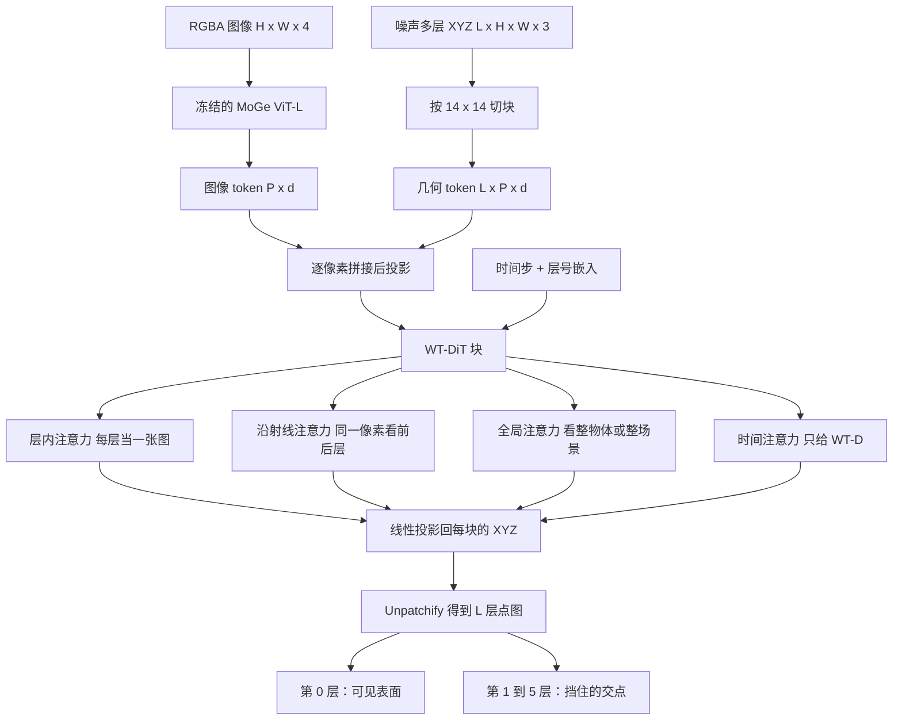

# World Tracing：每个像素一条射线，看得见的表面和挡住的表面叠在一起

<!-- release-date: 2026-05-29 -->

> 本文依据 World Labs 主导的 **World Tracing: Generative Pixel-Aligned Geometry Beyond the Visible**，即 arXiv:2606.13652v1（2026-06-11，26 页）。动笔前核过 arXiv 官方提交历史：目前只有 v1，提交时间 2026-06-11 17:52:48 UTC；本地件封面水印为 `arXiv:2606.13652v1 [cs.CV] 11 Jun 2026`，与官方件一致，**未做替换**。第一作者 Hao Zhang 同时署名 World Labs 与 UIUC；Narendra Ahuja 在 UIUC，其余作者在 World Labs。按企业主导，目录放在 WorldLabs。
>
> 全文页码指 PDF 自身页码。本篇从第 1 页起页脚就印着 `1`，PDF 页码与印刷页码一致，引用时可以直接对照。
>
> `release-date` 取 **2026-05-29**。这是方法首次经官方渠道向公众开放使用的日期：GitHub [`haoz19/world-tracing`](https://github.com/haoz19/world-tracing) 的提交 `112644c` 信息为「Initial public release」，作者时间 2026-05-29T18:31:11Z，仓库当时已带推理代码、检查点表和 Hugging Face 权重链接；同日 Hugging Face Space [`haoz19/world-tracing-demo`](https://huggingface.co/spaces/haoz19/world-tracing-demo) 的提交 `fe3edc9` 同样写「Initial public release」（2026-05-29T18:31:37Z），浏览器里即可跑物体 / 场景 / 动态三档。arXiv v1 是 2026-06-11，那是论文上传日，不是模型可用日。项目页 [`haoz19.github.io/world-tracing-page`](https://haoz19.github.io/world-tracing-page/) 的 `gh-pages` 最早一次部署是 2026-05-23T19:14:14Z，但那是预烘焙样例画廊，当时推理仓还不存在；仓库 `createdAt` 与 Hugging Face 权重仓 `createdAt`（约 2026-05-24）一律不当作首发日。权重仓目前是门控，`model.pt` 的文件提交时间无法在未授权下核到，故不以它回写日期。
>
> 文中始终区分三件事：**报告写了什么**、**本文如何解释**、**哪些是外部补充**。凡是从图里读出来的、从 GitHub / Space / 项目页补进来的，都会当场说明。
>
> 边界说明：同方向已发布的 TRELLIS、TRELLIS.2、Seed3D 2.0、HunyuanWorld 1.0 可以对照「深度图只看见表面，图生 3D 对不齐像素」这条判断，**不要把那些篇的人评、秒数或参数量读成本报告的实验**。本 PDF 里的 TRELLIS.2 只作为图生 3D 基线和免训练网格解码器出现。

## 一张图进 3D，一直在两头选

先把矛盾摊开，再上名词。

给一张照片，下游真正想要的往往是两件事同时成立：看得见的地方要跟像素对得上；被挡住的地方也要有几何，不能一转头就破洞。报告把现有路线劈成两支，两支各缺一半（PDF p. 2）：

**深度估计这一支。** 每个像素给出「这个方向上最近的表面有多远」。它天生钉在输入像素上，所以看起来很忠于照片。但它停在第一层可见表面：柜子后面的墙、人背后的地面、物体的背面，图里根本没有，模型也就不预测。多视图重建、点图（pointmap）预测器把尺度和内参也学进来了，结构限制没变——仍然是每个像素一个 3D 点（PDF p. 3）。

**图生 3D 这一支。** 输出是完整形状，背面、内腔、被挡住的面都可以编出来。但它们通常在一个**规范坐标系**（canonical frame，物体自己的盒子，不跟拍摄相机对齐）里生成。网格可能很好看，却对不回那张输入图：腿前后颠倒、多出来一块假平面、相机位姿对不上（PDF p. 3、p. 23）。下游要做插入、编辑、按轨迹渲视频时，还得再估一遍对齐。

两边缺的是同一件事。报告把它叫作 **faithful generation（忠实生成）**：可见表面要重建准，不可见表面要生成得像样，而且都写在相机坐标系里（PDF p. 2）。

这件事还决定数据能不能变大。像素对齐的几何可以直接吃深度图这种「和图像同网格」的监督；规范系里的图生 3D 则主要吃艺术家做好的 3D 资产，规模和多样性都更难往上推。不少图生 3D 还先把图压成一个全局潜变量，再另开一个 3D 生成器，细的像素证据在这一刀里就丢了（PDF p. 2）。

World Tracing 的回答不是再在两支里选一个，而是换表示：

> **每个像素沿这条视线叠一摞相机坐标系 3D 点。第 0 层是看见的表面，后面几层是从前往后被挡住的交点。可见重建和遮挡补全，变成同一张张量上前后相邻的层。**

## 读之前只需要这几个词

下面这些词正文都会用到。这一节是读前背景，不全是报告自己定义的。

**深度图（depth map）。** 和原图同尺寸的一张图，每个像素存「这个方向上最近的物体离相机多远」。单目深度估计只看一张图就猜这个量。它有一个经常被忘掉的限制：只描述**最近那一层**。柜子后面的墙在深度图里是不存在的。

**点图（pointmap）。** 每个像素直接存一个相机坐标系 3D 点 $(X,Y,Z)$，而不是只存深度再配一副相机内参。报告的输出是多层点图。内参不是输入；需要针孔相机时，从第 0 层点云闭式拟合一副自洽的 $K$（PDF p. 2、p. 4）。

**相机坐标系 vs 规范坐标系。** 相机坐标系以拍摄这张图的相机为原点，光轴朝前，点和像素有对应。规范坐标系是物体自己的盒子，常把物体摆到原点、缩到单位尺度。图生 3D 喜欢后者，因为训练资产都是这样摆的；代价是「这根椅腿对应照片里哪几个像素」不再自动成立。

**分层深度图像（Layered Depth Image，LDI）。** 图形学里的老想法：一条射线上不只记最近的表面，而记从前往后若干次命中。报告把这条线接到神经网络上，并点名最近的前辈是 LaRI 和 DualPM——它们学的是物体级的单目分层深度回归（PDF p. 3）。

**深度剥离（depth peeling）。** 从同一相机反复光栅化：第一遍记下最近表面，下一遍忽略已经记下的更近表面，于是下一次交点露出来。报告用它从 3D 资产制造多层真值（PDF p. 6、p. 22）。

**流匹配（flow matching）与扩散 Transformer（DiT）。** 从噪声走到数据的生成模型。最简单的直线路径是 $x_t=(1-t)x_0+t x_1$，网络预测「现在该往数据走多快」。当去噪网络是 Transformer 时叫 DiT。报告的 WT-DiT 在**像素网格上的 XYZ** 上做流匹配，不经过学习到的 VAE 潜空间（PDF p. 4–5）。

**无分类器引导（Classifier-Free Guidance，CFG）。** 推理时同一步跑「带条件」和「不带条件」再外推。**本 PDF 没有写 CFG 系数，也没有写训练时是否丢条件。** 不要从别的扩散模型把这个数搬过来。

**Chamfer 距离与 F-score。** 两组点云之间「彼此找最近邻」的距离；F-score 是在某个距离阈值内命中的比例。报告用它们衡量完整几何，不只看可见表面（PDF p. 8）。

**尺度–平移对齐（scale–shift invariant alignment，SSI）。** 评深度时允许整体乘一个系数、加一个常数再比误差，避免「尺子单位不同」把方法比死。物体表、场景表、NYU / ETH3D 都用同一套 SSI（PDF p. 7–8、p. 25）。

**MoGe。** 一种单目点图估计器，报告冻结它的 ViT-L 当图像编码器，建立在 DINOv2 上（PDF p. 3、p. 5）。它本身只出可见层。

**TRELLIS 的 Stage-1。** 同方向已发布报告里，TRELLIS / TRELLIS.2 先在规范系里生成稀疏占用，再生成细节和纹理。本报告把 World Tracing 的点云体素化后替换这一段，后面的网格和贴图解码器不改（PDF p. 11）。那两篇的人评数字不是本实验。

## 一句话先说清

World Tracing（文中简称 WT）是一套从单图或短视频出发的像素对齐多层几何。对每个输入像素，它预测一叠有序的相机坐标系 3D 点：第 0 层是可见表面，后面几层是从前往后与被挡表面的交点（PDF p. 1–2）。

实例化这个表示的网络叫 **WT-DiT**（world-tracing diffusion transformer）。多层几何被当成彼此独立、又互相看见的去噪 token，用分解注意力加全局注意力耦合；训练是像素空间流匹配，噪声日程按「可见层更像重建、遮挡层更像生成」来混合（PDF p. 1、p. 5）。

同一套表示覆盖三个变体：WT-O 做静态物体，WT-S 做静态场景，WT-D 做动态物体，动态只多加时间注意力（PDF p. 5–6）。因为 2D–3D 对应被表示本身保住了，文本驱动的场景编辑、几何条件的新视角视频、免训练接到带纹理 mesh 生成器，都不需要再为每个任务训一遍 3D 模型（PDF p. 2、p. 10–11）。

规模上，正文把 WT-DiT 写成约 17 亿参数（其中约 14 亿可训练），在 $504\times 504$、$L=6$ 层上训练，64 张 H100，全局 batch 512，推理 20 步（PDF p. 8、p. 20）。物体数据约 30 万资产、约 1700 万渲染视图；动态约 1.68 万条短视频（PDF p. 7、p. 21）。

## 整条流水线怎么连起来

下面这张图是机制示意，根据 PDF 第 3 页 Figure 2 和第 4–5 页正文重画，不是实测耗时。

读这张图时记住三件报告写明的事：

- 图像证据和噪声几何始终待在同一套像素网格上，没有「全局编码器 → 另一个 3D 生成器」那种断开（PDF p. 5）。
- 层与层之间靠沿射线注意力对齐前后，靠全局注意力看整体，动态再加一路时间（PDF p. 5）。
- 输出不是深度图加内参，而是相机系 XYZ；内参是事后从第 0 层拟合出来的（PDF p. 2）。

三个变体共享表示、流匹配损失、深度填充、冻结图像编码器和结构化注意力，只在坐标归一化、输入分辨率和是否加时间块上分叉（PDF p. 6）。

## 报告地图：26 页里各写了什么

先摊开篇幅。正文到第 11 页，第 12 页是整版层可视化，附录从第 13 页到第 26 页。密度在表示、填充策略、注意力分解和三张主表上；训练超参和真实 RGBD 混训大量在附录。

| 报告章节 | PDF 页 | 讲了什么 | 密度 |
|---|---|---|---|
| 标题、摘要、Figure 1 | p. 1 | 像素对齐多层几何；物体 / 场景 / 动态；编辑与网格 | 高 |
| §1 引言 | p. 2 | 深度 vs 图生 3D；数据缩放；四点贡献 | 高 |
| Figure 2 + 贡献 3–4 + §2 | p. 3 | WT-DiT 总图；LaRI / DualPM / TRELLIS 对照 | 高 |
| §3–3.1 | p. 4 | 式 1–2；点图；深度填充；流匹配入口 | 高 |
| 式 3 + §3.2 | p. 5 | 端点损失；三路注意力；层 FiLM；WT-D 时间块 | 高 |
| Figure 3 + §3.3–3.4 | p. 6 | 下游接口示意；噪声课程；深度剥离；约 30 万物体 | 高 |
| Table 1 + §3.5 + §4.1 起 | p. 7 | 物体表；混训式 4；数据构成 | 高 |
| Table 2 + 训练细节 | p. 8 | 场景表；17 亿 / 64×H100 / 20 步 | 高 |
| Figure 4 + 场景讨论 | p. 9 | 分布外定性；墙面变弯的对照 | 中 |
| Table 3–4 + §4.3 + §5 起 | p. 10 | 动态表；时间步消融；填充 vs 掩膜 | 高 |
| §5.1–5.3 + §6 | p. 11 | 编辑、视频、TRELLIS 杂交；结论 | 高 |
| Figure 5 | p. 12 | WT-S 的六层深度栈 | 中 |
| 参考文献 | p. 13–18 | 引用 | 低 |
| App. A | p. 19 | 式 5–8；z-score / 对数中位数；噪声填充；单调罚 | 高 |
| App. B | p. 20 | 48 层 / 宽 1536 / 两阶段分辨率；内参拟合 | 高 |
| App. B 续 + Figure 6 + App. C 起 | p. 21 | 时间步密度图；数据来源 | 高 |
| App. C 续 | p. 22 | RGBD 12 数据集；评测协议；剥离算法 | 高 |
| Table 5 + App. E.1 | p. 23 | 各层有效像素占比；扩散 vs 回归 | 高 |
| App. E.2–E.3 | p. 24 | 平面结构；NYU / ETH3D 混训增益 | 高 |
| Table 6 + App. F 起 | p. 25 | 真实场景可见深度 | 高 |
| App. F.1–F.5 | p. 26 | 层数、XYZ vs 深度、泛化、限制 | 高 |

## 核心设计一：每个像素一叠点，而不是「一张深度」或「一个规范 mesh」

### 旧问题：忠和全被表示拆开了

深度模型要对齐像素，就只能看见第一层。图生 3D 要形状完整，就把物体搬进规范盒子，像素对应丢掉。报告认为下游真正要的是相机坐标系里又忠又全的几何（PDF p. 2）。分层深度的老办法已经知道「一条射线可以记多次命中」，但近期神经网络要么只回归物体、要么仍要每层再预测一张有效性掩膜（PDF p. 3–4）。

### 新设计：相机系多层点图

给一张 RGBA 图 $I\in\mathbb{R}^{H\times W\times 4}$（RGB 加一张二值有效性掩膜），WT 预测

$$
\mathbf{X}\in\mathbb{R}^{L\times H\times W\times 3},\qquad \mathbf{X}[\ell,\mathbf{u}]=\mathbf{x}_{\ell}(\mathbf{u})
$$

其中 $\mathbf{x}_{\ell}(\mathbf{u})$ 是穿过像素 $\mathbf{u}$ 的射线上，从前往后第 $\ell$ 次与表面的交点，写在相机坐标系里（PDF p. 4，式 1）。第 0 层是可见表面，后面是被挡住的交点。$L=6$ 是正文默认（PDF p. 5、p. 26）。

Alpha 的含义分两种：物体模型用它抠出前景；场景模型用它盖掉天空这类无穷远像素（PDF p. 4）。相机内参不是输入。

### 工作机制

这把「忠实 3D 生成」变成了一个带层号的多图生成问题：第 0 层被观察像素死死钉住，越往后越像条件生成（PDF p. 4）。所有层都在输入像素网格上，所以 2D–3D 对应和相机位姿是表示自带的，不是后处理对齐出来的。

坐标范围物体和场景差几个数量级，所以训练前要做可逆归一化。物体和动态用数据集级、分通道的 z-score；场景先按样本中位数归一化，再对深度做 $\ln(z/m)$，对 $x,y$ 做带符号的 $\ln(1+|\,\cdot\,|/m)$（PDF p. 4、p. 19，式 5–6）。同一套网络预测归一化后的张量，只换坐标变换。

### 收益、代价、边界

收益是后面三条下游的共同前提：编辑时物体和场景已经在同一相机里；视频模型可以直接把点云沿轨迹栅格化成几何条件；接到 TRELLIS 时不必再估姿态（PDF p. 10–11）。

代价也很硬。$L$ 是固定的。附录说六层是实用甜点：物体渲染上，有效像素占比从第 0 层的 8.14% 掉到第 5 层的 0.60%（PDF p. 23，Table 5）。再加层能照顾树叶、笼子、格栅这种反复穿孔的形状，但显存涨、尾部更难监督（PDF p. 26）。高度穿孔的几何、无纹理和反光区域的合成到真实差距，报告自己列为限制（PDF p. 26）。

附录还做了一件对照：预测「深度 + 内参」而不是 XYZ。深度加内参更紧凑，但焦距或主点稍错，整坨形状会一起歪。直接预测 XYZ 把标定误差吸进点图本身，在裁切、掩膜、相机元数据不确定的真实图上更稳（PDF p. 26）。**这是附录里的设计观察，不是一张消融表。**

### 可迁移启发

当下游要的是「对着这张图做事」而不是「在资产库里生成一个物体」，输出坐标系应该跟输入相机走，而不是跟训练资产的盒子走。像素网格当原生坐标，比事后 ICP 对齐便宜，也更难偷偷翻面。

## 核心设计二：空的层往前填，不要再训一张掩膜

### 旧问题：深层又稀又和坐标抢梯度

一条射线常常打不到六次。直接多层的做法要同时回归坐标、再给每层一张「这里有没有点」的二值掩膜（PDF p. 4）。深层只在一小部分像素上有效，类别极不平衡，掩膜头容易崩成「全无效」。坐标回归和可见性分类还会互相打架。

报告给了一条早期诊断：联合训深度加掩膜时，两个梯度的 EMA 余弦相似度接近 0 或为负，例如 500 步时是 $-0.19$，在靠前的解码块里最明显（PDF p. 10）。物体渲染上平均有效面积从 L0 的 8.14% 掉到 L5 的 0.60%，超过 13 倍失衡（PDF p. 10、p. 23）。

### 新设计：目标向前填，输入无效处填噪声

如果位置 $(\ell,\mathbf{u})$ 没有交点，就用更前面最近的有效层把它填上：

$$
\mathbf{x}_{\ell}(\mathbf{u})\leftarrow\mathbf{x}_{\ell'}(\mathbf{u}),\qquad \ell'=\max\{k<\ell:\mathbf{x}_{k}(\mathbf{u})\ \text{is valid}\}
$$

得到稠密目标 $\bar{\mathbf{X}}$（PDF p. 4，式 2）。填进去的是重复点，不是新几何，所以形状不变。网络若把深层塌回前表面，意思就是「这条射线已经打穿了」。

输入侧是另一件事。层 0 剪影以外的像素（物体背景、场景天空）在损失里被 alpha 盖掉；训练和推理时，这些位置的噪声几何被换成新的高斯噪声，再送进网络（PDF p. 5、p. 19，式 7）。有效射线上每层都有目标；无效像素只携带无信息噪声。

### 工作机制

于是训练目标变成单一的 XYZ 扩散，没有每层掩膜头、没有剪影头、没有可见性分类头（PDF p. 5）。一层软的相邻层单调罚 $\mathcal{L}_{\mathrm{mono}}$ 推着归一化深度从前到后排，系数 $\lambda_{\mathrm{mono}}=0.1$，排对了这项就是 0（PDF p. 19，式 8）。因为两套归一化对深度都是单调的，这个罚不会把层序弄反。

### 收益、代价、边界

收益是深层不再被「先判无效」掐死。报告说：原本就有效的深层像素，误差只比继承来的稍高，两者仍在同一量级，说明填充是可用的稠密监督（PDF p. 10）。LaRI 那种回归加掩膜，在他们的定性里常常只剩浅层几何（PDF p. 23）。

代价：填充把「没有交点」编码成「和前一层重合」，评估完整几何时要自己知道哪些点是真交点、哪些是重复。报告的 All-L 指标只对多层方法定义（PDF p. 8），但**没有写推理时如何从重合点里切出真实深层**。固定 $L=6$ 也意味着尾巴上大量重复点仍要占计算。

### 可迁移启发

稀疏标签上不要急着再开一个分类头。先问：能不能把「没有事件」写成「和上一个事件相同」，让回归在稠密张量上跑。类别失衡的掩膜头，崩起来比坐标头更快。

## 核心设计三：WT-DiT 把层、射线、全局拆开算注意力

### 旧问题：多层 token 全连既贵又没有几何结构

$L\times P$ 个 token 做全注意力，既贵又没有「同一层是一张图、同一像素是一条射线」这种归纳偏置。VGGT 一类多视图 Transformer 按帧 / 全局交替，那是多张图之间的事；这里要在一张图的多层上产出前后自洽的几何（PDF p. 5）。

### 新设计：三路分解 + 层 FiLM + 冻结 MoGe

图像证据来自冻结的 MoGe ViT-L，只训练从它最后若干块到解码宽度的投影，所以 WT-DiT 继承的是 MoGe 在野外图像上的视觉先验，而不是只从渲染几何里学（PDF p. 5、p. 20）。噪声 XYZ 按同样的像素网格切块：一层一个几何 token，默认 $L=6$，块大小 $14\times 14$（PDF p. 5、p. 20）。每个 $(\ell,u)$ 上，噪声几何和该像素的图像特征拼在一起再投影到解码宽度，中间没有单独的交叉注意力通路。

解码器在三种注意力形状之间循环（PDF p. 5）：

| 路 | 张量形状 | 在干什么 |
|---|---|---|
| 层内 | $(B\cdot L,\ P,\ D)$ | 每一层当一张 2D 图，带 $(y,x)$ 上的 2D RoPE |
| 沿射线 | $(B\cdot P,\ L,\ D)$ | 同一像素看从前往后的各层，管层序和沿射线一致性 |
| 全局 | $(B,\ L\cdot P,\ D)$ | 看物体或场景级上下文，更贵 |

层号用 FiLM：层嵌入经 MLP 变成逐通道 $(\gamma_\ell,\beta_\ell)$，做 $h\leftarrow\gamma_\ell\odot h+\beta_\ell$，用来打破层的置换对称，不再另学一套加性位置 token。扩散时间 $t$ 用标准 AdaLN，整叠共享（PDF p. 5）。

动态模型 WT-D 不改静态解码器，只在每个全局注意力块后面插一块时间注意力：沿时间轴 1D RoPE，LayerScale 初值 $\gamma=10^{-5}$，使得从单帧 WT-O 热启动时，$T=1$ 的行为与静态检查点一致，再慢慢接上时间耦合（PDF p. 5、p. 20）。

附录给了骨架规格：物体骨干 48 个 pre-norm DiT 块，宽度 $D=1536$，24 个注意力头；总参数约 17 亿，冻结 MoGe 后约 14 亿可训练（PDF p. 20）。小规模消融里，LayerScale 初值 $10^{-4}$ 在 1 万步把总损失从 0.009258 降到 0.007018，XYZ 损失从 0.007242 降到 0.003537；单独加 RoPE 在那个小设置里是中性的，完整模型仍保留它，因为空间和沿射线注意力要跨分辨率、跨裁切外推（PDF p. 26）。

### 工作机制

层内注意力负责「这一层看起来像不像一张几何图」；沿射线注意力负责「后面几层不要从可见表面上漂走」——报告把这条显式射线轴写成单图能产出自洽多层几何的关键原因（PDF p. 5）。全局注意力补物体级、场景级关系。图像特征和几何状态一直对齐，所以像素级对应是架构保的，不是损失保的。

### 收益、代价、边界

收益在定性里很具体：相对规范系生成器，像素对齐加冻结 MoGe 更不容易把姿态翻反、更少编出假平面（PDF p. 9、p. 23）。相对 LaRI 的回归头，扩散更能表达背面那种多峰不确定（PDF p. 23）。

代价：三路循环仍然要走全局注意力，$L\cdot P$ 的那一路最贵。报告没有给 FLOPs 分解，也没有「去掉沿射线注意力」的完整大模型消融，只在 §4.3 把射线轴和深层不漂作为设计理由（PDF p. 5、p. 10）。场景模型的输入分辨率，正文只写「三个变体分辨率不同」，**没有给出场景自己的数字**（PDF p. 6）。

### 可迁移启发

多轴数据不要一上来就做全注意力。先按数据自带的轴分解：这里是层（图）、射线（深度顺序）、全局（物体）。哪一条轴对应「不能漂」的物理约束，哪一条就应该显式存在，而不是指望全连接自己学出来。冻结一个已经会看图的 2D 几何编码器，比在渲染资产上重学「图长什么样」便宜。

## 核心设计四：在 XYZ 上做流匹配，噪声日程按层分家

### 旧问题：可见层和遮挡层不是同一种不确定

第 0 层被输入图像钉住，更像重建；后面几层只被间接约束，更像条件生成。一种扩散时间分布会亏掉其中一边（PDF p. 6）。报告把自己放在一条像素对齐几何的谱上：MoGe 回归单层，PPD 把单层几何做成均匀时间步的扩散，WT 把它扩成多层流匹配（PDF p. 10）。

另一件事：他们不把 XYZ 再压进 VAE 潜空间，而是直接在归一化坐标信号上做流匹配，引用的是「让去噪模型就去噪」这条线（PDF p. 4）。

### 新设计：端点参数化 + 两阶段混合日程

干净端点 $x_0=\tilde{X}$，噪声 $x_1\sim\mathcal{N}(0,I)$，时间 $t\sim p_{\mathrm{train}}(t)$，直线插值 $x_t=(1-t)x_0+t x_1$。网络输出 $x_0$ 参数化的预测，端点损失为

$$
\mathcal{L}_{\mathrm{FM}}=\mathbb{E}_{x_0,x_1,t}\Bigl[\bigl\|A\odot\bigl(F_{\theta}(x_t^{\mathrm{net}},t,f_I)-x_0\bigr)\bigr\|_{2}^{2}\Bigr]
$$

$A$ 是 alpha 有效性掩膜，广播到所有层和 XYZ 通道，有效区域以外不进损失（PDF p. 5，式 3）。推理时由端点预测诱导速度 $v_{\theta}(x_t,t,f_I)=(x_t-F_{\theta}(x_t^{\mathrm{net}},t,f_I))/t$，从最大噪声积到 $t=0$，默认 20 个 ODE 步（PDF p. 5、p. 8）。

噪声课程分两段（PDF p. 6、p. 21）：

1. 早期：可见层从**平台化 logit-normal** 采样，深层从**标准 logit-normal** 采样，各层时间独立。标准 logit-normal 把质量集中在 $t=0.5$ 附近，更适合当生成；平台化变体把中央平台展宽，给小 $t$ 更多概率，更适合当重建。
2. 各层稳住之后：整叠改抽一个共享时间步，来自两个分布的等权混合，让层间耦合和推理时一致。

Figure 6 画的是三条解析密度，不是训练曲线（PDF p. 21）。Table 4 用 CD-L2 做消融（PDF p. 10）：

| 日程 | L0 ↓ | L1–L5 ↓ | All ↓ |
|---|---:|---:|---:|
| 平台化 logit-normal | 0.021 | 0.033 | 0.031 |
| logit-normal | 0.023 | 0.028 | 0.027 |
| **混合** | **0.020** | **0.025** | **0.024** |

平台化帮了 L0，伤了深层；混合在三列上都最好。

### 工作机制

人话：可见层需要在「已经比较干净」的时间段多练，遮挡层需要在「还很噪、必须靠图像猜」的时间段多练。先分家，再合成一个共享日程，避免推理时各层时间不一致把沿射线注意力搞乱。

完整损失是 $\mathcal{L}=\mathcal{L}_{\mathrm{FM}}+\lambda_{\mathrm{mono}}\mathcal{L}_{\mathrm{mono}}$（PDF p. 19）。没有掩膜、剪影、可见性分类损失。

### 收益、代价、边界

收益是同一套目标同时服务重建和生成，不必做两个网络。Table 1 里 WT-O 虽然预测六层，第 0 层的 MAE / RMSE / AbsRel 仍是可见表面最好的一档：生成遮挡几何没有把可见表面卖掉（PDF p. 7–8）。

代价：20 步迭代采样。报告把实时应用列为需要蒸馏或更少步数的未来工作（PDF p. 26）。**采样器细节、是否用 CFG、移位系数，PDF 都没写。** Table 4 没有写这张消融的数据范围和步数，只能当日程比较，不能当主表的绝对值。

### 可迁移启发

同一张输出里如果同时有「几乎被输入决定的通道」和「必须想象的通道」，不要共用一个时间分布。先按不确定类型分日程，等结构稳住再合并，比一上来折中更不容易两头都稀。直接在物理量（这里是 XYZ）上做生成，还是先学一个潜空间，是另一道独立的选择——本报告站在前者，省掉 VAE，也把「潜空间重建糊不糊」从误差预算里拿掉。

## 核心设计五：同一套网络同时吃多层 3D 和单层 RGBD

### 旧问题：监督制度把模型锁死

单目深度和点图预测器只暴露一层，吃不了多层资产。TRELLIS 一类图生 3D 要完整几何，吃不了单层 RGBD 拍照。LaRI 用深度加每层掩膜，而且只在合成多层渲染上训，从没见过真实 RGBD（PDF p. 7）。

### 新设计：沿层轴开关损失

用 $b_{\mathrm{single}}\in\{0,1\}$ 标记这个样本是不是只有可见层。把式 3 的有效性掩膜沿层关掉：

$$
A^{(\ell)}\leftarrow A^{(\ell)}\bigl(1-b_{\mathrm{single}}\,\mathbb{1}[\ell\geq 1]\bigr)
$$

单层样本只监督 L0，L1 到 L5 仍只由多层 3D 资产塑造（PDF p. 7，式 4；PDF p. 22）。不新增参数、不新增头、不加制度嵌入。

实践中的数据混合在附录：每个 mini-batch 以 $p_{\mathrm{dojo}}=0.6$ 抽 3D 资产语料，以 $p_{\mathrm{rgbd}}=0.4$ 抽 12 个数据集的 RGBD 风格语料；RGBD 分支内部按 $\sqrt{N_{\mathrm{rows}}}$ 加权，六个真实照片集再乘 1.5（PDF p. 22）。帧仍是 $504\times 504$，走同一套在线增强，深度用原内参反投影成相机系 XYZ，再用场景那套对数中位数归一化，广播到 $L=6$ 层。

### 工作机制

多层资产继续提供「柜子后面有墙」这种真值；RGBD 照片提供「真实室内外的可见表面长什么样」。两者在损失里按层分家，所以混训不会把深层目标改写成单层深度。

### 收益、代价、边界

这是附录里的加项，不是主表的默认检查点。正文 Tables 1–4 全部用只吃 3D 资产的检查点；只有 Table 6 把混训 WT-S 单列出来（PDF p. 8、p. 25）。混训只在 3D 资产检查点上又跑了 5 万步，验证损失当时还在降，作者把数字写成下界（PDF p. 25）。

在 NYU（1449 帧室内）和 ETH3D（室内 222 / 室外 232）上，同一套 SSI、评测分辨率 504、WT-S 取 8 个种子里 AbsRel 最好的那个（PDF p. 25）。20 步混训相对纯 3D 资产，AbsRel 在 NYU 从 0.0398 降到 0.0382（相对降 4.0%），ETH3D 室内 0.0398 → 0.0345（13.3%），室外 0.0533 → 0.0495（7.1%）；50 步（表中带 * 的行）再扩到 6.0% / 16.6% / 15.4%，即 0.0374 / 0.0332 / 0.0451（PDF p. 24–25）。50 步混训在 NYU 的 $\delta<1.25$ 是表上最好的 0.9871，AbsRel 仍低于 Pi3X 的 0.0341。作者自己把位置写清楚：中心目标不是在可见表面上超过专用深度模型，而是额外给出那些基线根本没有的遮挡层，同时在可见表面上保持竞争力（PDF p. 25）。

室外残差集中在 playground 场景，对所有方法都偏分布外（PDF p. 24）。纯 3D 资产的 WT-S 几乎全来自 3D-FRONT 和一份内部场景，室外天然偏少，渲染帧量比 MoGe-2 / Pi3X / Depth Anything 3 / VGGT 用的真实 RGB-D「小几个数量级」（PDF p. 24）——这是作者的定性比较，没有给出那些基线的具体帧数。

### 可迁移启发

想同时用「完整但合成」和「真实但残缺」的监督，先让表示容得下残缺：缺的层用掩膜从损失里拿掉，而不是改网络。制度开关放在数据侧，比放在结构侧更容易加新语料。

## 数据、训练 recipe 和三个变体

### 多层真值从剥离来，不从深度数据集来

公开深度集和 mesh 生成集都不带「一条射线上第 3 次命中」。报告对整理过的 3D 资产做深度剥离：同一相机反复渲染，得到有序深度栈，再用渲染内参反投影成相机系 XYZ（PDF p. 6、p. 22）。少于 $L$ 次命中的射线走式 2 的向前填充。

三份语料（PDF p. 7、p. 21）：

- **物体：** 约 30 万个独立资产、约 1700 万渲染视图。来源包括 Objaverse-XL、Objaverse、3D-FUTURE、Toys4k、GSO，以及 Truebones 的绑定角色当静态视图。
- **场景：** 公开 3D-FRONT 室内，外加一份内部整理的场景；内部集在评测里只当泛化探针，不是可复现主基准（PDF p. 8–9）。
- **动态：** 约 1.68 万个动画资产切成短视频，Objaverse-XL 动画子集加 Truebones 绑定角色。留出的同来源分裂成 Obj.-Val 和 Truebone 评测。

光照、视点、内参都随机。在线增强包括几何（裁切、缩放、水平翻转、平面旋转、小仿射）、光度（亮度对比饱和、伽马、压缩、噪声）和 alpha 边界抖动；几何和掩膜类增强在动态视频上跨帧共享（PDF p. 23）。掩膜边界被抖出来的像素，用增强后最近的有效渲染几何当弱伪标签，损失降权（PDF p. 6、p. 20）。

RGBD 混训那 12 个数据集在附录写全了，分两族（PDF p. 22）：

- 真实：ScanNet v2 约 250 万帧 / 1513 个室内扫描；MegaDepth 约 15 万张地标图；BlendedMVS 约 1.7 万帧；ArkitScenes 约 5000 个房间；Argoverse2 的 1000 个室外驾驶场景；Waymo Open 约 1150 段。
- 合成单视图：Hypersim 约 7.7 万；Taskonomy 约 460 万帧 / 约 500 栋楼；外加 Aria Synthetic Environments、ParallelDomain、TartanAir v2 三个较小集合。

### 优化与两阶段分辨率

物体模型先在 $196\times 196$ 上跑 10 万步学表示，再在 $504\times 504$ 上 10 万步（PDF p. 20）。动态从静态物体检查点出发，加上时间块，再在视频上微调 5 万步。优化器 AdamW，学习率 $10^{-4}$，余弦降到 $10^{-5}$，2000 步 warmup，weight decay 0.01，betas $(0.9,0.999)$。主物体实验：64 张 H100，每卡 batch 2，梯度累积 4，有效 batch 512。梯度裁剪到范数 1.0。EMA 衰减 0.9995。损失偶发超过运行 EMA 4 倍的步会跳过，以免带坏 Adam 统计（PDF p. 20）。

物体和动态的坐标反变换是逆 z-score；场景是逆对数中位数（PDF p. 20）。内参用第 0 层点 $\mathbf{x}_0(u)=(X,Y,Z)$ 与像素 $(u,v)$ 做最小二乘，拟合 $(f_x,f_y,c_x,c_y)$（PDF p. 20）。

### 三个变体差在哪

| 变体 | 任务 | PDF 写明的规格 | 坐标变换 |
|---|---|---|---|
| WT-O | 静态物体 | $504\times 504$，$L=6$，约 17 亿参数 | 数据集 z-score |
| WT-S | 静态场景 | 同一架构，分辨率正文未给数字 | 样本对数中位数 |
| WT-D | 动态物体 | 从 WT-O 微调；$T=16$ 帧 | 与物体相同 |

正文把「WT-DiT 是 17 亿参数、在 $504\times 504$ 上训练」写在实验设置里，没有再给 WT-S / WT-D 单独的参数量表（PDF p. 8）。GitHub 上另外写了场景 15 亿 / $840\times 840$、动态 21 亿 / $336\times 336$ 等检查点规格——**那些数字 PDF 没有，见文末外部补充。**

## 实验证明了什么

作者要验证两件事：像素对齐多层在物体、场景、动态上都更忠实；以及这套几何对依赖位姿、对应或解遮挡结构的下游有用（PDF p. 7）。评测口径刻意偏向几何一致性，而不是好看（PDF p. 8）。生成类方法（含 TRELLIS 系和杂交）每个输入抽 $K=8$ 个种子，报几何最好的那个（PDF p. 8）。

### 物体：可见层没有为了背面变差

Table 1 左半是可见表面深度，同一套逐样本尺度–平移对齐（PDF p. 7）：

| 方法 | MAE↓ | RMSE↓ | AbsRel↓ | $\delta<1.25$↑ |
|---|---:|---:|---:|---:|
| Depth Anything 3 | 0.0703 | 0.0920 | 0.0384 | 0.9973 |
| LaRI | 0.0366 | 0.0506 | 0.0198 | 0.9992 |
| Pi3X | 0.0317 | 0.0440 | 0.0172 | 0.9994 |
| MoGe-2 | 0.0261 | 0.0368 | 0.0141 | 0.9995 |
| VGGT | 0.0257 | 0.0370 | 0.0138 | 0.9995 |
| **WT-O** | **0.0149** | **0.0243** | **0.0079** | **0.9996** |

右半是完整几何，100 个物体的基准（PDF p. 7）：

| 方法 | L1↓ | L2↓ | F@0.01↑ | F@0.05↑ | 输出 |
|---|---:|---:|---:|---:|---|
| TRELLIS.2 | 0.0566 | 0.00717 | 0.204 | 0.598 | Mesh |
| SAM 3D | 0.0475 | 0.00501 | 0.203 | 0.675 | 3DGS |
| LaS-Comp | 0.0477 | 0.00739 | 0.225 | 0.677 | Mesh |
| ReconViaGen | 0.0478 | 0.00528 | 0.228 | 0.677 | Mesh |
| WT-O*（接 TRELLIS.2 的 Stage 2） | 0.0326 | 0.00530 | 0.321 | 0.808 | Mesh |
| **WT-O** | **0.0213** | **0.00194** | **0.549** | **0.898** | 点云 |

读这张表时要分开两列。左列 WT-O 在专用深度 / 点图模型里领先，说明多层生成没有牺牲 L0。右列 WT-O 报的是点云，和 mesh / 3DGS 不是同一载体；更公平的网格对照是 WT-O*，它把 WT-O 当作 TRELLIS.2 的 Stage-1 先验，F@0.01 从纯 TRELLIS.2 的 0.204 升到 0.321（PDF p. 7–8）。SAM 3D 的 L2（0.00501）仍略好于 WT-O* 的 0.00530，报告没有把「每一列都第一」写成结论。

Figure 4 上半的输入故意来自训练分布外：DAVIS 视频帧和生成图。报告的观察：LaRI 深层掩膜容易塌，TRELLIS.2 会翻姿态、编假平面；WT 保住像素对齐的同时把形状补全（PDF p. 9、p. 23）。附录补了一句：小规模、层数更少、数据量跟 LaRI 可比的控制实验，趋势仍在，所以不只是数据放大（PDF p. 23）。**没有把这个控制实验做成表。**

### 场景：可见层和全层一起报

Table 2 分两块。可复现主基准是留出的 3D-FRONT，50 个样本；另外 200 个内部样本只当「超出布置好的房间」的探针（PDF p. 8–9）。All-L 只对多层方法有定义。

**3D-FRONT 留出集（PDF p. 8）：**

| 方法 | MAE↓ | AbsRel↓ | L0 CD-L1↓ | L0 F@0.05↑ | All-L CD-L1↓ | All-L F@0.05↑ |
|---|---:|---:|---:|---:|---:|---:|
| VGGT | 0.0393 | 0.0441 | 0.0345 | 0.7839 | – | – |
| Depth Anything 3 | 0.0369 | 0.0403 | 0.0330 | 0.7992 | – | – |
| LaRI-scene | 0.0319 | 0.0359 | 0.0268 | 0.8576 | 0.0575 | 0.6671 |
| MoGe-2 | 0.0248 | 0.0269 | 0.0213 | 0.9131 | – | – |
| Pi3X | 0.0234 | 0.0260 | 0.0192 | 0.9206 | – | – |
| WT-S*（只训 3D-FRONT） | 0.0106 | 0.0118 | 0.0097 | 0.9845 | 0.0224 | 0.8890 |
| **WT-S** | **0.0102** | **0.0114** | **0.0093** | **0.9867** | **0.0216** | **0.8951** |

WT-S* 几乎贴上 WT-S，用来隔离「内部场景语料」的贡献（PDF p. 9）。50 个样本的留出集很小，领先幅度大，但区间估计报告没给。

**内部测试集（PDF p. 8）：** WT-S 的 MAE 0.0328、AbsRel 0.0470、L0 F@0.05 0.8720、All-L F@0.05 0.6500，仍高于表上其他方法；LaRI-scene 的 All-L F@0.05 是 0.5565。领先幅度比 3D-FRONT 小。报告把它写成泛化探针而不是主榜，内部集本身也不可对外复现。

Figure 4 下半是生成的室内外图，不在 3D-FRONT 训练分布里。报告观察到 MoGe-2 有时把该是平面、竖直的立面和墙掰弯，WT-S 更直（PDF p. 9、p. 24）。Figure 5 把六层摊开：前两行是留出的 3D-FRONT，后七行是分布外生成房间；层号增大时，家具后面的地板和墙、门洞和吊灯后面的房间内部被填上，第 0 层仍对齐输入。预测用 WT-S、20 步（PDF p. 12）。这些是定性，没有层间 IoU。

NYU / ETH3D 见上一节混训。不要把 Table 6 的 50 步混训数字，读成 Tables 1–4 用的那个检查点。

### 动态：平均赢，动作基准上输给原生网格方法

Table 3 是全局 CD-L2，越低越好（PDF p. 10）：

| 基准 | GVFDiffusion | SS4D | ActionMesh | WT-D |
|---|---:|---:|---:|---:|
| ActionBench | 0.0879 | 0.0882 | **0.0243** | 0.0291 |
| Truebone | 0.0166 | 0.0145 | 0.0120 | **0.0063** |
| Obj.-Val | 0.0248 | 0.0249 | 0.0142 | **0.0034** |
| 平均 | 0.0385 | 0.0381 | 0.0162 | **0.0105** |

Obj.-Val 是留出的 Objaverse-XL 动画物体，Truebone 是带显式关节的绑定资产，ActionBench 偏动作驱动。WT-D 赢前两个和平均；ActionMesh 赢 ActionBench，报告的解释是那里的真值是跟踪出来的动画表面，和它的原生输出格式一致（PDF p. 10）。动态模型只在短视频上工作，长程记忆和跨视频的身份保持列为未来工作（PDF p. 26）。

### 这些数字没有证明什么

- 没有人评、没有 CLIP 外观分、没有网格纹理指标。好看不是本榜。
- 场景主基准 50 个样本；物体 100 个资产。规模谈不上大。
- 生成方法 best-of-8，回归 / 前馈基线没有同等的种子选择。对 WT 有利。
- 内部场景集不可复现，只能当作者提供的探针。
- 编辑和新视角视频在论文里是定性演示加补充视频，没有定量（PDF p. 8、p. 11）。

## 下游：对齐像素之后，三件事都可以免训练接上

§5 的共同模式只有一句：输出已经是输入相机里的完整几何，并且内参和像素对应还在，所以下游只加轻量、免训练的组合逻辑（PDF p. 10）。Figure 3 用点云 → 带纹理 mesh → 轨道视频把这条接口画出来（PDF p. 6）。

### 文本驱动的 3D 场景编辑

2D 编辑器能改图，不能改成 3D 一致的场景。做法是：先让 2D 编辑器加、删、换图像内容，再用 WT 把结果抬回 3D。原场景走 WT-S，新物体或被改区域走 WT-O，因为两边已经在同一张照片的相机里、共享像素 / 点对应，插入是闭式的（PDF p. 11）。不需要按每次编辑做优化，也不需要渲染闭环。报告强调：规范系物体生成器可以给出像样的资产，但不知道它在输入相机里的位置（PDF p. 11）。

这是表示带来的能力，不是另训的编辑模型。失败模式报告没量化：2D 编辑器改坏的像素，会被忠实地抬进 3D。

### 几何条件的新视角视频

图像到视频的世界模型常用深度图或渲染几何轨迹当条件。单层可见表面在相机一动时，新露出的区域必须凭空编。WT 在视频生成开始前就提供一份完整的几何记忆：沿目标轨迹把预测点云栅格化，得到稠密、多视图的深度引导（PDF p. 11）。物体绕一圈时背面已经在深层里，冻结的视频模型是在填一份几何一致的信号，而不是无支撑地幻觉解遮挡。项目页把配对的视频模型写成 Wan2.2 VACE——**那是外部页面上的名字，PDF 只泛称视频扩散模型并引用 VACE 等论文（PDF p. 11、p. 14）。**

### 位姿对齐的 TRELLIS 杂交

TRELLIS 风格的流水线网格和贴图好看，但稀疏结构在规范系里生成，没有显式的输入相机位姿；网格可能无法重投影回那张条件图（PDF p. 11）。WT 已经有相机系、像素对齐的点叠和可恢复内参，于是把这叠点体素化，当作后续 TRELLIS 阶段的稀疏结构，**不重训 TRELLIS**。杂交保住 TRELLIS 的纹理和网格解码器，换掉最弱的一环：不看姿态的 Stage-1。对照是纯 TRELLIS / TRELLIS.2，以及 VGGT 引导的 ReconViaGen、LaS-Comp（PDF p. 11）。Table 1 的 WT-O* 就是这条线的定量：网格 F@0.01 / F@0.05 明显高于纯 TRELLIS.2（PDF p. 7）。

同方向已发布的 TRELLIS.2 报告把 Stage-1 写成占用生成；本报告等于用像素对齐点云去替那一段。不要把 TRELLIS.2 原文的人评 66.5% 写进这里。

## 限制、未公开，以及论文之后的仓库

附录 F.5 列的边界都很具体（PDF p. 26）：

- 固定层数。高度穿孔可能要超过六个表面。
- 渲染监督。无纹理、反光区域仍有合成到真实的伪影。
- 迭代流采样。要实时得蒸馏或减步。
- 动态只吃短视频。没有长程记忆，也没有显式的跨帧点对应或 3D 轨迹——那是未来要把 WT-D 扩出去的方向。
- 场景是单帧抬升。多帧融进更大的相机对齐世界，还没做。
- 物体模型和场景模型仍是分开的专家。附录观察到：没训过场景的物体模型，在场景图上也能给出还过得去的几何；一张图里多个物体也能共存，因为预测的是每条射线一叠点，不是每个裁切一个规范资产（PDF p. 26）。作者把「训成一个统一的物体–场景–动态模型」写成最清楚的下一步。

报告没写、因而本文也不补的实现包括：CFG 是否使用及系数；具体 ODE 求解器名字；沿射线注意力的头数是否与层内不同；场景分辨率和场景参数量；训练墙钟时间和 GPU·小时；推理毫秒；从重合填充点恢复「真深层」的后处理。

**论文之后实际发生的事（外部补充，不是 PDF 内容）。** 2026-05-29 公开了推理代码和 Hugging Face Space。当前 GitHub README 的已发布检查点表是：物体 `r75b`，$504\times 504$，17 亿，[`haoz19/object-model-6layer`](https://huggingface.co/haoz19/object-model-6layer)；场景 `r69l`，$840\times 840$，15 亿，[`haoz19/scene-model-6layer-840`](https://huggingface.co/haoz19/scene-model-6layer-840)；动态 `r76`，$336\times 336$、16 帧，21 亿，[`haoz19/dynamic-model-16frame`](https://huggingface.co/haoz19/dynamic-model-16frame)。仓库还写了 A100 / H100、bfloat16、20 步下物体约 13 秒、场景约 17 秒、动态 8 帧约 30 秒——**这些秒数和 15 亿 / 21 亿 / 840 规格 PDF 都没有。** 权重目前是 CC BY-NC-ND 4.0 且门控，需人工审核。带纹理 mesh 的示例脚本接到公开的 TRELLIS.2，跳过它的 Stage-1。动态分辨率 GitHub 写 336，PDF App. B 写物体和动态都在 $504\times 504$ 上训练，两边不一致时以 PDF 为准，GitHub 只说明「后来放出的检查点」。

## 把自己项目能拿走的，串回整个系统

如果只记一个设计原则，就是开篇那句：不要在「对齐像素但看不见背面」和「形状完整但对不齐照片」之间单选。把两者写成同一条射线上前后相邻的层。

拆开之后，有四条不依赖 64 张 H100 的做法：

1. **表示先决定下游能不能免训练。** 像素对应一旦丢掉，编辑、插入、按轨迹条件视频每一件都要再估对齐。WT 的三条下游没有新的 3D 训练，是因为表示没把对应扔掉。
2. **稀疏事件优先改成稠密重复，而不是再开分类头。** 深度填充和无效像素噪声填充是一对：有效射线永远有目标，无效像素永远不贡献损失。
3. **不确定类型不同，噪声日程就应该不同。** 可见层偏重建、遮挡层偏生成，混合日程在 Table 4 上两头都比单一日程好。任何「同一张输出里有的通道几乎被输入决定、有的通道必须想象」的模型都可以借这招。
4. **监督制度用掩膜开关，不要用结构开关。** 式 4 让多层资产和单层 RGBD 进同一个 WT-S，不改架构。

依赖特定规模的部分也说清楚：冻结 MoGe ViT-L、48 层宽 1536 的 DiT、约 30 万物体和 1700 万视图、64 张 H100、20 步采样。没有这些，多层点图作为表示仍然成立——剥离是确定性渲染，填充是几行索引操作。

同方向那几篇可以这样对照，而不要串数字：TRELLIS / TRELLIS.2 / Seed3D 2.0 解决的是「完整资产长什么样、贴图对不对」，输出常常在规范盒子里；HunyuanWorld 1.0 解决的是「一张全景如何变成可走的场景」，被挡内容靠分层修补图像。World Tracing 卡在两者之间的接口层：先给出和像素对齐、又超出可见范围的几何，再让那些生成器当解码器来用。

## 关键词回看

- **忠实生成：** 可见表面要准，不可见表面要全，而且都在相机坐标系里。
- **多层点图：** 每个像素一叠 $(X,Y,Z)$。第 0 层可见，后面是从前往后的遮挡交点。
- **深度填充：** 没有交点的深层，复制更前的有效点；形状不变，监督变稠。
- **无效像素噪声填充：** 剪影外的几何 token 换成高斯噪声，损失忽略它们。
- **WT-DiT：** 像素空间流匹配 Transformer。层内、沿射线、全局三路注意力，动态再加时间。
- **层 FiLM：** 用逐层缩放平移打破层置换对称。
- **混合噪声日程：** 可见层偏平台化 logit-normal，深层偏标准 logit-normal，稳住后抽等权混合。
- **混训开关 $b_{\mathrm{single}}$：** 单层 RGBD 只监督 L0，深层仍只看多层资产。
- **自洽内参：** 从预测的第 0 层点云最小二乘拟合 $K$，不是网络另预测的。
- **WT-O / WT-S / WT-D：** 物体、场景、动态三个变体；动态从物体热启动。
- **WT-O*：** 把 WT 点云当作 TRELLIS.2 Stage-1 的稀疏结构，后面网格和贴图不改。

## 最后的判断

World Tracing 最强的叙事不是「深度模型加几层」或「再做一个图生 3D」，而是：**它把 2D–3D 对应写成表示的不变量，然后让可见重建和遮挡生成变成同一条射线上的不同层。**

实验支持的部分很清楚。物体和场景的可见表面，在作者的 SSI 口径下优于对照的深度 / 点图模型；完整几何的 Chamfer / F-score 优于对照的图生 3D；动态在三个基准的平均 CD-L2 上领先。Table 4 支持混合日程。Table 6 支持「同一架构可以再吃真实 RGBD」，但那不是主表检查点。

只是作者观察、没有表撑着的部分：真实图上更少翻面、更少假平面、墙更直、物体模型零样本看场景。下游三条是定性能力展示。

没公开因而不应假装知道的部分：场景精确分辨率与参数量、推理墙钟、CFG、从填充点恢复真深层的规则、统一物体–场景模型是否已经训出来。

如果只记一句话，可以记：

> **每个像素先沿视线记下打到的第一层，再把挡住的层叠在后面；对齐是网格自带的，完整是后面几层补的。**

## 参考资料

- 论文：Hao Zhang 等，*World Tracing: Generative Pixel-Aligned Geometry Beyond the Visible*，arXiv:2606.13652v1，2026-06-11。World Labs Technical Report。
- 项目页：[https://haoz19.github.io/world-tracing-page/](https://haoz19.github.io/world-tracing-page/)（外部；交互式预烘焙样例。`gh-pages` 最早部署 2026-05-23，推理仓公开于 2026-05-29）。
- 代码：[https://github.com/haoz19/world-tracing](https://github.com/haoz19/world-tracing)（外部；`Initial public release` 提交时间 2026-05-29。当前检查点表、秒数、840 / 336 规格以仓库为准，不是 PDF 原文）。
- 演示：[https://huggingface.co/spaces/haoz19/world-tracing-demo](https://huggingface.co/spaces/haoz19/world-tracing-demo)（外部；同日 `Initial public release`）。
- 权重：[`haoz19/object-model-6layer`](https://huggingface.co/haoz19/object-model-6layer)、[`haoz19/scene-model-6layer-840`](https://huggingface.co/haoz19/scene-model-6layer-840)、[`haoz19/dynamic-model-16frame`](https://huggingface.co/haoz19/dynamic-model-16frame)（外部；CC BY-NC-ND 4.0，门控。17 亿 / $504\times 504$ 与 PDF 一致；其余规格 PDF 未写）。
