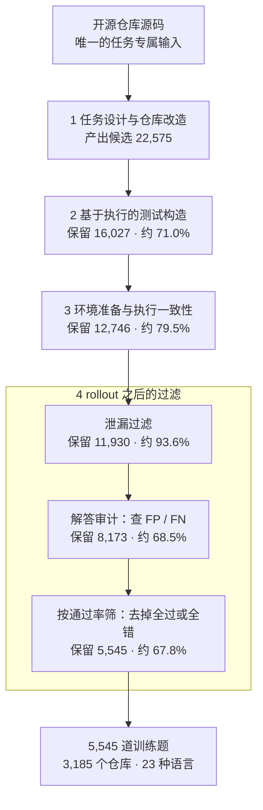

# CodeMidas：不等 issue 和 PR，直接把现成代码挖成编码 RL 环境

<!-- release-date: 2026-09-18 -->

> 本文依据小米 LLM Core 与北京大学、香港大学、中国人民大学合作的 **CodeMidas: Scaling Agentic Coding RL Environments from Code Itself**，即 arXiv:2609.22068v1（2026-09-18），共 15 页，其中正文与参考文献占第 1–14 页，附录 A–B 在第 15 页。页码均指这份 PDF 的物理页码。全文把 3 件事分开写：**论文明确写了什么**（带页码）、**我们如何解释或验算它**（会写明）、**外部资料补充**（给出处并标注）。

## 读前先把几个词说成人话

这篇论文的主体是一条「造题」流水线，后面的 RL 实验是给这批题做验收的。先把反复出现的词说清楚。

- **编码 Agent（coding agent）**：一个能在代码仓库里读文件、改代码、跑命令的模型。它不是一次吐出一段代码，而是连续几十到几百轮地和环境交互。
- **RL 环境（RL environment）**：论文里一道训练题由 3 样东西组成：一段任务说明（statement）、一个装好依赖的容器化开发环境、一个对解题者隐藏的可执行验证器（verifier）（PDF p. 4）。Agent 干完活，验证器才被注入进来打分，给出 0 或 1 的奖励（PDF p. 4）。
- **验证器 / 测试预言（test oracle）**：判断「这份实现对不对」的那套测试。难点在于它既要拒掉错的实现，又不能把换了写法但同样正确的实现也拒掉（PDF p. 2）。
- **开发痕迹（development artifacts）**：issue、PR、commit、现成测试、文档这类「开发过程中顺手留下的记录」。以往的造题管线大多从这些记录出发（PDF p. 1–2）。
- **参考解（reference solution）**：被挖掉之前的原始实现。CodeMidas 把它另存一份，用来跑出测试的期望值，也用来检验题目本身是否成立（PDF p. 5）。
- **Rollout（一次作答轨迹）**：让模型在某道题上从头到尾做一遍，记录全部推理、工具调用和最终提交。
- **GRPO（Group Relative Policy Optimization，组相对策略优化）**：对同一道题采样一组 rollout，用组内相对好坏当作优势来更新策略，不需要单独的价值网络。论文只在 PDF p. 7 引用 Shao 等人 2024，这句定义是通用背景。
- **泄漏（leakage）**：环境里残留了能直接拿到答案的东西，比如编译产物、缓存副本、造题 agent 留下的文件。Agent 找到它们就能「抄答案」而不用真干活（PDF p. 5）。
- **FP / FN（假阳性 / 假阴性）**：实现其实不对却过了测试，叫假阳性；实现其实对了却没过测试，叫假阴性（PDF p. 6）。

与本站其他篇的关系：MiMo-V2.6 一篇把 CodeMidas 列为 MiMo-V2.6 代码 RL 的 5 条造题管线之一，只用一句话带过方法；这里是它的完整方法与实验。3 天后公开的 Skill2Env 一篇走的是另一条路，从公开的 Agent Skills 出发造终端环境，可以对照读。

## 先用几句话说清

训练编码 Agent 的 RL，缺的是 2 样东西：**足够多样的题**，和**靠得住的判分**（PDF p. 1）。已有管线大多从 issue、PR、commit 或现成测试出发造题，于是题目的覆盖面被「开发过程恰好留下了什么记录」框死了（PDF p. 1–2）。

CodeMidas 换了一个起点：**已经实现了的功能本身就是题**。一个仓库里每一个带公开入口、行为可观察的功能，都同时给出了 3 样东西：要让 Agent 实现什么（从公开接口和行为推出），一份标准答案（原始代码），以及测试期望值的来源（跑原始代码）（PDF p. 2）。把功能挖掉、把剩下的代码修成一个自洽的起点，再用原始代码跑出测试，就得到一道题。这条管线的唯一任务专属输入是源码（PDF p. 1）。

它把 agent 的算力花在造环境的每一步上：写题、写测试、查一致性、查泄漏、审判分、按通过率筛题（PDF p. 1、p. 4–6）。主要结果：

- 从 22,575 个候选筛到 5,545 道训练题（PDF p. 4，读自 Figure 1），来自 3,185 个开源仓库，覆盖 23 种编程语言、15 个技术领域（PDF p. 1、p. 6）。
- 用这 5,545 道题对 MiMo-V2.5 做 GRPO，5 个外部 benchmark 全部上涨：DeepSWE 从 10.0% 到 21.7%，ProgramBench 的 Almost Solved 从 4.5 到 21.5，Terminal-Bench v2.1 从 63.7% 到 72.2%（PDF p. 2、p. 7）。
- 筛过的 3k 子集在 3 项评测上都胜过没筛的 8k 样本；完整 5,545 题在 DeepSWE 上比没筛的 8k 高 4.59 个百分点（PDF p. 2、p. 9）。
- RL 之后 Agent 动手前读得更多、验证手段更多样；其中「自己写检查并运行」与更高通过率相关，差 4.2 个百分点（PDF p. 9）。

## 主要矛盾：题目被开发记录框死了

### 旧问题：造题的原料是「过程记录」，不是「代码本身」

论文从 SWE-bench 讲起：它确立了「基于执行的仓库级 issue 修复」这一评测形态（PDF p. 2）。它的具体做法（issue 当题面，PR 的补丁当答案，PR 附带的测试当判分）是通用背景，论文没有展开。后来的管线沿着几个方向扩量（PDF p. 1–3）：

- 从 issue、PR 直接收集或让模型改写题面（SWE-rebench V2、SWE-Universe 等）；
- 从 commit 生成测试和题面，不再依赖人写的 issue（R2E-Gym）；
- 故意改坏代码、让现成测试失败，再让 Agent 修（SWE-smith）；
- 从现成单元测试和它的运行时依赖反推增量开发任务（SWE-Flow）；
- 把函数 docstring 改写成规格（R2E），或者给文档加编译好的参考程序，要求从零实现（MindForge）。

论文的判断是：这些做法都把「能造出什么题」绑在了「记录下来的改动、测试或文档覆盖了什么」上（PDF p. 2）。没有 issue 的功能、没有测试的模块、没有文档的库函数，都进不了题库。

### 论文的对照表

Table 1 把各管线「造一道题需要哪些专属输入」列成一张表（PDF p. 3）。✓ 表示不需要，◆ 表示部分环节需要，✗ 表示需要。

| 方法 | 不需要 issue | 不需要 PR | 不需要 commit | 不需要现成测试 | 不需要书面描述 | 语言数 |
|---|:---:|:---:|:---:|:---:|:---:|---:|
| SWE-rebench V2 | ◆ | ✗ | ✗ | ✗ | ✓ | 20 |
| daVinci-Env | ✗ | ✗ | ✗ | ✗ | ✓ | 1 |
| R2E-Gym | ✓ | ✓ | ✗ | ◆ | ✓ | 1 |
| SWE-smith | ✓ | ◆ | ◆ | ✗ | ✓ | 1 |
| SWE-Flow | ✓ | ✓ | ✓ | ✗ | ✓ | 1 |
| SWE-Hub | ✓ | ✓ | ✓ | ✗ | ◆ | 11 |
| R2E | ✓ | ✓ | ✓ | ✓ | ✗ | 1 |
| MindForge | ✓ | ✓ | ✓ | ✓ | ✗ | 15 |
| CodeMidas | ✓ | ✓ | ✓ | ✓ | ✓ | 23 |

读表只看一件事：CodeMidas 是表里唯一一行 5 列全是 ✓ 的，语言数 23 也是最多（PDF p. 3）。离它最近的 R2E 和 MindForge 不需要开发记录，但需要书面描述（docstring 或文档）。

**我们如何解释它。** 这张表是作者自己列的输入需求对照，不是同一套实验下的效果比较。它说明的是「原料面更宽」，不证明「造出的题更好」。题好不好要看后面的过滤和 RL 实验。

### 新矛盾：原料放开之后，判分更难了

从代码本身造题，最容易出问题的恰恰是判分。论文列了 2 个要求（PDF p. 2）：

1. 题面要把「必须做到的行为」写清楚，同时把内部实现方式留给解题者自己选；
2. 测试必须执行这些要求：错的实现要拒掉，换一种写法但同样正确的实现要放行。

这 2 条互相拉扯。测试写松了，错实现也能过，奖励被钻空子；测试写死了（照抄原实现的报错措辞、输出顺序、内部结构），对的实现也会被判错，奖励变成噪声。论文在相关工作里点了这 2 种失败都真实存在：EvalPlus 发现扩充测试后能抓出原测试漏过的错误程序，PatchDiff 记录了被 SWE-bench 测试接受的错误补丁，SWE-bench Pro 与 SWE-rebench V2 讨论过规格缺口和过严测试（PDF p. 3）。

所以这篇论文的重心不只是「挖题」，而是**挖出来之后怎么让判分可信**。4 个模块里有 3 个在管这件事。

## 先看全景：4 个模块，一个漏斗

原图的漏斗标出 6 个保留数，箭头把每个数连到一个环节。正文没有逐步列出这些数，下面的对应关系是我们按 Figure 1 的箭头读出的（PDF p. 4）；每步保留率是我们用相邻 2 个数相除算的。

从 22,575 到 5,545，整体只留下约 24.6%（我们按 Figure 1 算，PDF p. 4）。砍得最多的是最后 2 步：解答审计和按通过率筛题，各自只留下约 68%。这 2 步都要先让模型真的去做题，是整条管线里最花算力的部分。

每道题的形态在这 4 个模块之后是固定的（PDF p. 4）：

- 解题者拿到任务说明和改造过的仓库（带依赖）；
- 验证器在整个解题过程中都放在解题者的环境之外；
- 解题结束才把验证器注入进来，跑完给一个二值奖励。

下面按模块走一遍，每个模块都按「旧问题 → 新设计 → 机制 → 收益 → 代价」讲。

## 模块 1：任务设计与仓库改造

### 旧问题：挖掉一段代码，剩下的仓库往往已经不成立

直接删掉一个函数的实现，剩下的代码可能编译不过、导入失败，或者别处的调用已经把答案「写在了调用方式里」。题面也很难凭空写：要说清要实现什么，又不能把实现细节泄露出去。

### 新设计：让一个 agent 找功能、定边界、挖实现、修起点

流程是这样的（PDF p. 4–5）：

1. **找功能**：agent 看仓库结构和构建元数据，找出**有公开入口、结果可观察**的功能，并优先挑需要跨代码库推理的。
2. **限定接口类型**：支持 3 类，命令行工具、纯函数库、有状态的库 API；分别按进程输出、返回值、跨调用的状态变化来判定行为（PDF p. 4）。
3. **定范围**：沿着公开入口和共享依赖追踪，决定哪些代码属于这道题。
4. **挖掉并修补**：删掉被选中的核心实现，再调整剩余代码，让它成为一个自洽的开发起点。题面和代码边界一起反复修改，同时保留共享组件和项目上下文。
5. **留答案**：原始实现另存一份，作为参考解（PDF p. 5）。

题面规定输入、可观察行为和必须提供的公开接口；解题者自己决定内部辅助函数和算法（PDF p. 5）。

Figure 1 左上角给了一个例子：一个 `serialize(data, pretty)` 函数原本先调 `Devaluator.devaluate(data)` 做编码，再 `JSON.stringify`；改造之后，编码那一步被删掉，剩下的代码改成直接对 `data` 做 `JSON.stringify`（PDF p. 4，读自 Figure 1）。

**我们如何解释它。** 这个例子说明「挖掉」不是简单地把函数体清空，而是把依赖这段实现的周边代码也修到能跑、但缺了那项能力的状态。这样 Agent 面对的是一个像真实开发中途的仓库，而不是一个满屏报错的残骸。

### 收益与代价

收益是原料面：只要仓库里有带公开入口的功能，就能出题，不需要任何人为这个功能写过 issue、测试或文档。

代价写在接口类型的限制里：只支持 CLI、纯函数、有状态 API 这 3 类，而且要求结果可观察（PDF p. 4）。没有公开入口的内部逻辑、结果只体现在 UI 或外部副作用上的功能，按这个定义进不来。论文没有统计候选功能在这一步被拒的原因分布。

### 可迁移启发

如果你手上有一堆内部仓库，却没有干净的 issue 和测试，这一步可以直接借：**把已有功能当题，把原实现当答案**。关键不是「删」，而是删完之后把起点修成自洽的，并且让题面和代码边界一起迭代。

## 模块 2：基于执行的测试构造

### 旧问题：测试要么太松，要么太死

有了参考解，最偷懒的办法是把原实现的输出原样抄进断言。这样测试确实能区分「有没有实现」，但会顺带锁死原实现的偶然细节：报错信息的措辞、无关紧要的输出顺序、内部数据结构。换一种写法的正确实现会被判错。

### 新设计：先按题面写输入，再跑参考解取期望，最后专门删掉多余约束

机制分 3 步（PDF p. 5）：

1. **按题面出输入**：agent 把题面里的行为要求映射成测试输入和边界情况，在仓库的一份参考副本上调用公开入口，记录结果。CLI 用命令执行，纯函数用输入输出对，有状态 API 用一串调用；有状态测试要覆盖跨调用的依赖，题面有规定时还要测顺序和清理行为。每条测试都记下自己覆盖的是哪条要求。
2. **只锁题面锁定的东西**：题面明确规定的输出和性质，用参考解的执行结果作期望值；题面没规定的方面，断言只检查题面写了的约束。论文的例子是：测试要求抛出指定类型的异常，但不锁死异常消息的措辞。期望输出各不相同的多组输入，用来确认实现确实依赖输入，而不是返回常量（PDF p. 5）。
3. **逐条审断言**：再由一个 agent 审每一条断言，找出题面不支持的限制，比如精确措辞、偶然的顺序、内部结构，把它们换成行为检查，同时保留题面要求的检查。如果某条断言依赖一个私有符号、又找不到行为上的替代，**整道题直接拒掉**。改完的测试在参考解上重跑一遍，确认仍然兼容（PDF p. 5）。

审完之后，测试输入和断言冻结，判分时只是拿提交的实现去跑这些检查（PDF p. 5）。

Figure 1 里这一步被压缩成 3 行伪代码：`input = input_from(task)`，`output = execute(reference, input)`，然后 `assert execute(solution, input) == output`（PDF p. 4）。

**我们如何解释它。** 这 3 行伪代码只是最粗的轮廓。真正让判分可信的是第 2 步和第 3 步：参考解只负责给题面锁定的那部分提供期望值，没锁定的部分宁可放松也不照抄。这正对应前面那对矛盾的「别把对的判成错」一侧。「别把错的判成对」一侧，则留给模块 4 的解答审计去兜底。

### 可迁移启发

用参考实现生成测试期望时，**加一道专门找「多余约束」的审查**，比加更多测试用例更要紧。私有符号断言没法替换时就弃题，不要硬留：一道判分可疑的题，对 RL 的伤害比少一道题大。

## 模块 3：环境准备与执行一致性

### 环境准备：装依赖，同时清掉「答案的影子」

从一个统一的基础容器镜像出发，agent 按项目自己的声明安装依赖、准备构建和运行资源（PDF p. 5）。然后做清理：

- 删掉可能暴露被删实现的产物：编译输出、缓存副本、造题 agent 留下的文件；
- 删掉和目标功能相关的原有测试；
- 保留构建和运行所需的包、fixture、构建包装脚本，保证补完的实现能在这个环境里跑起来（PDF p. 5）。

**我们如何解释它。** 删原有测试这一步很容易被忽略：原仓库的测试文件本身就是一份「期望行为说明书」，留着它，Agent 可以对着测试反推实现，这道题就变成了另一种题。

### 执行一致性：6 个新容器，2 个必须挂、4 个必须过

每道题在训练时的运行设置下，放进 6 个全新容器检查：2 个装着挖空后的起点，4 个装着放回参考解的版本（PDF p. 5）。

| 起点跑测试 | 放回参考解跑测试 | 结论 |
|---|---|---|
| 2 次全部失败 | 4 次全部通过 | 保留 |
| 任一次通过 | 任意 | 拒掉 |
| 任意 | 任一次失败 | 拒掉 |

这张表按 PDF p. 5 正文与 Figure 1 第 3 格（PDF p. 4）整理。重复跑的目的有 2 个：确认存在预期的「从失败到通过」转变，并筛掉执行结果不稳定的题（PDF p. 5）。

- 起点就能过，说明测试没有真正测到被挖掉的功能，或者功能根本没挖干净；
- 参考解有一次过不了，说明测试不稳定（依赖时序、随机、网络或环境状态），拿它当奖励会引入噪声。

**我们如何解释它。** 这一步是整条管线里最便宜的一道闸：只跑测试，不需要任何模型作答。它挡住的是「题目本身不成立」和「判分会抖」这 2 类问题，把更贵的 rollout 过滤留给更隐蔽的缺陷。按 Figure 1 的数，这一步之后从 16,027 留下 12,746（PDF p. 4）。

### 可迁移启发

「起点必挂、参考必过、多跑几次」这个检查几乎零成本，任何可执行奖励的 RL 数据都应该先过它。重复次数不必照搬 2 和 4，但**参考解一侧要比起点一侧多跑**，因为不稳定的正确答案比不稳定的错误起点更伤奖励。

## 模块 4：rollout 之后的 3 道过滤

执行检查只覆盖了 2 个固定点：起点和参考解。真正训练时，Agent 会提交各种各样的中间实现，有的会去钻环境的空子。所以 RL 训练之前，作者再用 agent rollout 和它们的结果过滤一遍，查 3 件事（PDF p. 5）：可被利用的泄漏、解答评估和测试判定之间的分歧、在筛选模型下全过或全错的题。

### 过滤 1：对抗式找泄漏

专门派一个 agent 扮演「作弊者」：它的目标是不做正经开发、只靠残留线索拿到答案（PDF p. 5）。它会搜解题者能看到的整个环境，包括编译产物、缓存、造题 agent 留下的文件，以及目标项目已经被安装的副本；每一个疑似漏洞都记下支撑它的命令和输出。然后另一个审查环节拿这些证据对照参考解和验证器核实；确认泄漏的材料能绕过预期的实现工作，这道题就拒掉（PDF p. 5–6）。

Figure 1 右上给了 2 个典型泄漏：编译后的 `dist/serialize.js` 和缓存的 `.cache/serialize.ts`（PDF p. 4）。

**我们如何解释它。** 「已安装的项目副本」这一条特别值得注意。很多语言的包管理器会把被测项目本身装进 site-packages 或 node_modules，挖掉源码目录里的实现并不能挖掉已安装包里的那份。静态清理很难穷举这些位置，所以让一个 agent 主动去找，比写清单更可靠。按 Figure 1 的数，这一步从 12,746 留下 11,930，损失最小（PDF p. 4）。这可能说明模块 3 的清理已经挡住了大部分，但论文没有给出拒绝原因，无法确认。

### 过滤 2：解答审计，查验证器的 FP 与 FN

为了看验证器在「真实 Agent 提交」上是否判得对，先让一个编码 agent 每道题做 4 次（PDF p. 6）。再由一个审查 agent 看这些轨迹，包括提交的代码和测试输出，同时对照任务说明、验证器和参考解。它判断每份实现是否满足题面，并检查题面要求和验证器行为是否错位（PDF p. 6）：

- 审查认为不对、测试却通过了，记为**假阳性**；
- 审查认为对了、测试却失败了，记为**假阴性**。

发现验证器有缺陷的题一律拒掉（PDF p. 6）。

**我们如何解释它。** 模块 2 的断言审查是「看着测试想」，这一步是「看着真实提交验」。前者只能发现写在断言里的多余约束；后者能发现测试漏掉的错误写法、以及一些人没想到的正确写法。这是整条管线里砍得最多的一步之一：从 11,930 留下 8,173（PDF p. 4），也就是说约 31% 通过了执行一致性和泄漏检查的题，在真实提交面前暴露出判分问题（我们按 Figure 1 算）。

### 过滤 3：按通过率筛，只留「有对有错」的题

最后，让一个前沿模型每道题做若干次，用验证器打分（PDF p. 6）。全部通过或全部失败的题，可能只是太难或太易，也可能还藏着缺陷，比如测试太弱或者题面漏了要求；单看结果分不清是哪种（PDF p. 6）。作者的处理是：**只保留在这个模型和这个预算下既有成功又有失败的题**（PDF p. 6）。

论文给这一步的理由是「全过全错的原因无法判别」。**我们如何解释它**：这一步和 GRPO 的训练信号也天然对齐。GRPO 用组内相对好坏当优势；按常规定义，一组 rollout 奖励全是 1 或全是 0 时，组内没有相对差别，优势为 0，这道题贡献不了梯度。论文附录写明关闭了按标准差归一化优势（PDF p. 15），此时优势就是奖励减组内均值，全同的组依然是 0。所以「只留有对有错的题」同时去掉了可疑题和对训练无用的题。这层联系是我们的推断，论文没有这样写。

### 这一步的边界

- 用来筛题的「前沿模型」没有给出名字，每题尝试次数也只说「several」（PDF p. 6）；Figure 1 画的是每题 8 个点，但图上标注的是「n attempts per task」，只是示意（PDF p. 4）。
- 难度是相对筛选模型而言的，不是相对被训练的 MiMo-V2.5。论文没有说明两者的强弱关系。
- 解答审计里「编码 agent 做 4 次」用的是哪个模型，论文也没写（PDF p. 6）。
- 3 道过滤各自拒掉了多少题、拒掉的原因分布，正文只给了 Figure 1 的漏斗数，没有更细的统计。

### 可迁移启发

1. **用 agent 当红队查泄漏**，把「已安装的副本」列进搜索范围。
2. **审判分时看真实提交**，不要只看测试代码。同一道题 4 次提交就能暴露大部分 FP / FN。
3. **只留有对有错的题**，在 GRPO 这类组相对算法下几乎总是划算的：它既是质检，也是在去掉零梯度样本。

## 数据集长什么样

最终保留 5,545 道题，来自 3,185 个仓库，覆盖 23 种语言、15 个技术领域（PDF p. 6）。

### 语言分布

每道题继承所在仓库的主语言标签。前 10 种语言覆盖 5,545 题中的 5,445 题，即 98.2%（PDF p. 6，Figure 2 图注）。下表读自 Figure 2（PDF p. 6）。

| 语言 | 题数 | 占比 |
|---|---:|---:|
| Python | 1,185 | 21.37% |
| TypeScript | 1,015 | 18.30% |
| Go | 897 | 16.18% |
| C++ | 695 | 12.53% |
| JavaScript | 624 | 11.25% |
| C | 409 | 7.38% |
| Java | 331 | 5.97% |
| Rust | 141 | 2.54% |
| Ruby | 106 | 1.91% |
| Kotlin | 42 | 0.76% |

**我们如何解释它。** Python 只占约 21%，TypeScript 和 Go 紧随其后。对比 Table 1 里多数前作只支持 1 种语言（PDF p. 3），这张分布是「源码即原料」最直接的收益：不需要为每种语言单独维护一套 issue 抓取或测试框架适配，只要 agent 能读懂构建元数据、能装依赖。

### 领域分布

领域标签来自仓库。最大的 3 类是系统软件 17.42%、Web 14.61%、开发者工具 13.56%，合计 45.6%（PDF p. 6–7）。其余依次是 AI/ML 9.11%、数据科学 7.57%、多媒体 7.14%、Specialized 6.89%、Cloud/DevOps 3.95%、区块链 3.55%、桌面 3.28%、安全 3.25%、游戏开发 3.08%、硬件 2.67%、自动化 2.02%、移动端 1.57%，另有 18 道未标注领域的题，占 0.32%（PDF p. 6，读自 Figure 3）。

### 参考解有多大

统计参考补丁里增删的全部源码行，包括注释和空行：中位数 142 行，四分位距 66–305 行；65.9% 的题的参考补丁至少改了 2 个源文件（PDF p. 7）。Figure 4 的直方图在 100–200 行附近最高（PDF p. 6，读自 Figure 4）。

**我们如何解释它。** 142 行的中位数，加上约 66% 跨文件，说明这批题多半不是「补一个函数体」的小题，而是要在仓库里找到多个落点的中等规模开发。这和模块 1「优先挑需要跨代码库推理的功能」一致（PDF p. 4）。

## 训练配置

策略模型是 MiMo-V2.5，算法 GRPO，奖励是验证器给出的 0 或 1（PDF p. 7、p. 15）。完整配置见附录 Table A1（PDF p. 15）：

| 设置 | 取值 |
|---|---|
| 初始策略 | MiMo-V2.5 |
| 训练题池 | 5,545 道 CodeMidas 题 |
| 算法 | GRPO |
| 奖励 | 验证器二值结果（0 或 1） |
| 按标准差归一化优势 | 关闭 |
| Batch size | 32 |
| 每题 rollout 数 | 32 |
| 最大 prompt 长度 | 8,192 token |
| 最大 response 长度 | 516,096 token |
| 每条 rollout 最大轮数 | 500 |
| 最大 staleness | 8 |
| 优化器 | Adam |
| 学习率 | $5\times 10^{-6}$ |
| Warmup 步数 | 0 |
| Adam $(\beta_1, \beta_2)$ | (0.95, 0.95) |
| Adam $\epsilon$ | $10^{-15}$ |
| 梯度裁剪阈值 | 1 |
| 权重衰减 | 0 |
| CodeMidas Val 规模 | 200 题 |
| CodeMidas Val 每题尝试次数 | 3 |

几个值得停下来看的地方：

- **每步 32 道题 × 每题 32 条 rollout**（PDF p. 15），即每步 1,024 条轨迹（PDF p. 15，乘积我们算的）。每题 32 条让组内均值估得比较稳，和「只留有对有错的题」配合，每道题都能产出有区分度的优势。
- **单条 rollout 最长 516,096 token、最多 500 轮**（PDF p. 15）。这是按长程 agent 任务配的预算；Figure 6 里平均总长度在训练后期超过 200k token（PDF p. 8，读自 Figure 6 右轴），说明预算确实被用上了。
- **最大 staleness 为 8**（PDF p. 15）。字面意思是用于更新的 rollout 最多可以落后当前策略 8 个版本，这通常意味着异步 rollout 与训练。论文没有描述训练系统，也没有解释这个值的含义，这里只能按字面理解。
- **关闭按标准差归一化**（PDF p. 15），论文没有给理由，也没有做对照。

训练只看到约 70 步（Figure 6、7 的横轴到 70，PDF p. 8）。论文没有给算力、墙钟时间，也没有给 MiMo-V2.5 的参数规模。

## 实验怎么证明

### 评测设置

初始策略和 RL checkpoint 用完全相同的评测设置（PDF p. 7）。5 个外部 benchmark 都按官方任务集跑（PDF p. 7）：

- **SWE-bench Pro**：长程的仓库级 issue 修复；
- **DeepSWE v1.1**：同为仓库级软件工程任务，论文把它归到 issue 修复；
- **ProgramBench**：从零重建整个程序；报告 Almost Solved，即通过至少 95% 测试的题的比例；
- **RepoZero C2Rust**：把 C 仓库翻译成 Rust；
- **Terminal-Bench v2.1**：命令行里的真实任务。

除 ProgramBench 外都报通过率，所有提升都按相对初始策略的百分点记（PDF p. 7）。CodeMidas Val 是从 CodeMidas 任务里另抽的 200 题，与 5,545 道训练题分开，每题评 3 次；作者核实过训练集与 CodeMidas Val、与 5 个外部 benchmark 的任务集都不相交（PDF p. 7）。

benchmark 各测什么的说明是我们根据 benchmark 名称与论文引用的文献标题补的背景，论文正文只把它们归成 issue 修复、整程序构建、代码翻译、终端工作 4 类（PDF p. 2、p. 8）。

### 主结果：5 项全涨，从零构建涨得最多

下表数字出自 Figure 5（PDF p. 7）。

| Benchmark | 任务类型 | 初始 | RL 后 | 增益（百分点） |
|---|---|---:|---:|---:|
| SWE-bench Pro | issue 修复 | 50.3 | 54.4 | +4.1 |
| DeepSWE | issue 修复 | 10.0 | 21.7 | +11.7 |
| ProgramBench（Almost Solved） | 整程序构建 | 4.5 | 21.5 | +17.0 |
| RepoZero C2Rust | 代码翻译 | 40.5 | 51.8 | +11.3 |
| Terminal-Bench v2.1 | 终端工作 | 63.7 | 72.2 | +8.5 |

摘要里写的「DeepSWE +11.7%」「ProgramBench +17%」「Terminal-Bench v2.1 +8.5%」都是百分点，不是相对涨幅（PDF p. 1、p. 7）。

**我们如何解释它。** 3 件事值得读出来：

1. **涨得最多的恰恰是离训练题最远的形态。** CodeMidas 的题是「在现有仓库里补一个功能」，而 ProgramBench 是从零重建整个程序，涨了 17.0 个百分点；DeepSWE 的初始分只有 10.0%，RL 后翻了一倍多（PDF p. 7）。论文据此认为「从已实现功能造的题」给出的训练信号能迁移到多种软件工作（PDF p. 2、p. 8）。
2. **SWE-bench Pro 涨得最少**，只有 4.1 个百分点，而它的初始分已经是 50.3%（PDF p. 7）。论文没有解释原因。
3. **Terminal-Bench v2.1 也涨了 8.5 个百分点**（PDF p. 7），而 CodeMidas 的题是「在仓库里补功能」，论文没有说题库里有专门的终端操作类任务，最接近的是 CLI 工具这类接口（PDF p. 4）。这更像是「在容器里长程动手干活」这种通用能力的迁移。

这张图只有一个基座、一次 RL，没有和别的造题管线在同一基座上对比，也没有给方差或多次运行的区间。它证明的是「CodeMidas 的题对 MiMo-V2.5 有用」，不证明「CodeMidas 比 SWE-smith 等前作更好」。

### 训练曲线：通过率与轨迹长度一起涨

CodeMidas Val 的通过率从 35.0% 升到 44.7%；从第 40 步起，每个评估点都比初始高约 8–10 个百分点（PDF p. 8）。与此同时平均轨迹总长度一路上升，论文的解读是模型更充分地用上了可用的交互预算（PDF p. 8）。

**我们如何解释它。** 通过率在前 15 步有一次快速上升，15–35 步大致持平，40 步之后再上一个台阶（读自 Figure 6，PDF p. 8）。长度则是比较平滑地增长。2 条曲线的形状并不完全同步，所以「更长 = 更好」只是伴随关系，论文也只说「accompany」，没有声称因果（PDF p. 8）。

## 分析一：题的数量与质量，各自值多少

### 实验设计

4 组设置，训练配置完全相同，评估同一段 checkpoint 区间（PDF p. 8）：

- **高质量 1k / 3k**：从 5,545 题里随机抽的子集；
- **高质量 5k**：完整 5,545 题；
- **Vanilla 8k**：过滤之前抽的约 8,000 题，每题有题面、开发环境和验证器，但**没有做环境清理、没有做执行一致性检查、也没有做 3 道 rollout 后过滤**（PDF p. 8）。

### 学习曲线：完整数据集在后半程一直领先

1k 在第 30 步达到 41.30，3k 在第 65 步达到 43.22；完整数据集从第 40 步到第 70 步的每个评估点都领先，最终 44.73（PDF p. 8–9）。

**我们如何解释它。** 小池子早期并不吃亏：1k 在第 30 步前后甚至领先（读自 Figure 7，PDF p. 8），但之后就平了。这符合直觉：题少时，模型很快把能学的学完，后半程没有新信号；题多时后半程才拉开。vanilla 8k 的虚线则一直在底部附近抖动，第 45 步左右还有一次明显下跌（PDF p. 8，读自 Figure 7）。

### 3 项评测上的终点对比

下表数字出自 Figure 8（PDF p. 9）。

| 题池 | SWE-bench Pro | DeepSWE | CodeMidas Val |
|---|---:|---:|---:|
| 高质量 1k | 52.86 | 17.57 | 41.30 |
| 高质量 3k | 54.02 | 19.05 | 43.22 |
| 高质量 5k（5,545） | 54.40 | 21.70 | 44.73 |
| Vanilla 8k | 53.81 | 17.11 | 40.24 |

论文的 2 条结论（PDF p. 9）：

1. **规模有用**：1k → 3k → 5k 在 3 项上都单调上升，DeepSWE 从 17.57 到 19.05 到 21.70，CodeMidas Val 从 41.30 到 43.22 到 44.73。
2. **质量更有用**：完整 5k 比 vanilla 8k 在 SWE-bench Pro、DeepSWE、CodeMidas Val 上分别高 0.59、4.59、4.49 个百分点；连高质量 3k 都在 3 项上全部胜过 vanilla 8k。作者把这归因于清理、执行检查和 rollout 后过滤合起来带来的「环境可靠性」和「训练适配性」。

**我们如何解释它。** 表里还有一格论文没点出来：高质量 1k 在 SWE-bench Pro 上是 52.86，**低于** vanilla 8k 的 53.81；只在另外 2 项上胜出（PDF p. 9，读自 Figure 8）。所以「质量压过数量」在 3k 这个量级上成立，但不是任意小的高质量池都能压过大的未过滤池。

另外，SWE-bench Pro 上 4 组的差距都在 1.6 个百分点以内（52.86 到 54.40），而 DeepSWE 上 5k 与 8k 差了 4.59 个百分点（PDF p. 9）。过滤的价值在 DeepSWE 这种初始分低、区分度高的 benchmark 上更显眼。

### 这组实验没回答的问题

- vanilla 8k 同时缺了 5 道工序：环境清理、执行一致性、泄漏过滤、解答审计、按通过率筛。**没有逐项消融**，所以不知道哪一道最值钱（PDF p. 8）。
- 「按通过率筛」会系统性地改变题目难度分布，这和「去掉有缺陷的题」是 2 种效果。vanilla 8k 里既有坏题，也有全过或全错的题，两者的贡献在这组实验里分不开。
- 没有给多次运行的方差。Figure 7 的曲线未平滑、相邻点之间常有 1–3 个百分点的起伏（vanilla 8k 在第 45 步前后一次掉了约 3 个百分点，读自 Figure 7，PDF p. 8），而 SWE-bench Pro 上 5k 与 8k 只差 0.59 个百分点（PDF p. 9），这个差距是否稳定无法判断。

## 分析二：RL 之后 Agent 的行为变了什么

### 3 个行为指标怎么量

论文盯 3 种行为，定义都在附录 B（PDF p. 15）：

- **代码库探索**：第 1 次改代码之前，不重复的读取 / 搜索请求数。同一文件同一行段的读取、同一查询同一范围同一选项的搜索只算 1 次；专用工具和 shell 命令发出的等价请求视为重复。
- **代码起草**：对每次 Write / Edit 的内容，以 4 个字符为步长采样不重复的 16 字符片段，数其中有多少在这次写入之前的推理里出现过。起草比例是命中总数除以所有写入动作的采样片段总数。
- **自我验证**：最后一次改代码之后，执行过的不重复验证命令数，包括项目测试命令、内联检查、临时测试程序、本地跑程序。同一命令重复执行只算 1 次。

简单说：探索是「动手前看了多少」，起草是「写进文件的代码有多少是先在脑子里想好的」，自我验证是「改完之后用了几种办法检查」。

Figure 9 是一个具体例子（PDF p. 10）：Agent 先读 `spider.py`，发现 `from_yaml` 里已经在调用尚未定义的 `data_spider(..., hidden=hidden, ...)`；再在推理里写出「非 hidden 且以点开头就跳过」的判断，然后用 Edit 把 `data_spider` 和 `_spider` 写进去；最后建一个 `.secret.csv`，分别在默认和 `hidden=True` 下调用，确认一次被略过、一次被包含。

**我们如何解释它。** 这个例子顺带展示了模块 1 的效果：调用方还在，被调函数被挖掉了。Agent 读调用方就能推出接口，这正是「保留项目上下文」的用意（PDF p. 5）。

### 训练中：3 项都上升

下表出自 Table 2（PDF p. 10），比较训练早期与后期 rollout 的均值；变化量按未四舍五入的均值计算。

| 行为 | 指标 | 早期 | 后期 | 变化 |
|---|---|---:|---:|---:|
| 代码库探索 | 改代码前的读取 / 搜索次数 | 27.2 | 40.1 | +12.9 |
| 代码起草 | 起草比例 | 0.358 | 0.629 | +0.271 |
| 自我验证 | 改完后不重复的验证命令数 | 2.03 | 2.53 | +0.50 |

动手前的探索多了约 13 次，写入代码与推理的重合度从约 36% 升到约 63%，验证手段也更多样（PDF p. 9–10）。论文没有给「早期」「后期」具体对应哪几步。

### 哪些行为真的和成功相关

在 CodeMidas Val 上、固定同一道题和同一 checkpoint 比较（PDF p. 9）：

| 行为划分 | 通过率差（百分点） | 95% 置信区间 |
|---|---:|---|
| 有 vs 没有 Agent 自己写并运行的检查 | +4.2 | 1.8 到 6.6 |
| 探索次数高于 vs 低于该 checkpoint 中位数 | +0.7 | -1.9 到 3.7 |
| 起草比例高于 vs 低于该 checkpoint 中位数 | +1.95 | -0.04 到 3.96 |

置信区间按整道题重采样，同一道题在各 checkpoint 的观测放在一起抽（PDF p. 9）。

**我们如何解释它。** 这张表比 Table 2 更有信息量，也更诚实：

- 只有**自我验证**的区间完全在 0 之上，是 3 项里唯一站得住的相关；
- **探索**的区间跨过 0，点估计也只有 0.7；也就是说，RL 让 Agent 多读了约 13 次（PDF p. 10），但在同题同 checkpoint 里多读的 rollout 并没有显著更容易成功；
- **起草**的下界是 -0.04，擦着 0 过去，只能算弱证据。

所以论文标题式的说法「探索更多、验证更多样」是对行为变化的描述；真正和成功挂钩的，目前只有「自己写检查并跑」这一条。而且这仍是相关，不是因果：更会写检查的 rollout，可能本身就是对题目理解得更好的那些。

### 迁移到外部任务：行为变化也在，但轮数各走各的

下表出自 Table 3（PDF p. 10），每个 benchmark 取最早 3 个与最晚 3 个 checkpoint 的均值；3 个行为指标只算有定义的 rollout，交互轮数算全部 rollout，各 checkpoint 的测量子集可能不同。

| 评测 | 代码库探索（读取 / 搜索次数） | 代码起草（起草比例） | 自我验证（不重复命令数） | 交互长度（assistant 轮数） |
|---|---|---|---|---|
| SWE-bench Pro | 23.1 → 35.5 | 0.304 → 0.653 | 0.80 → 0.96 | 37.3 → 50.1 |
| ProgramBench | 55.7 → 83.6 | 0.106 → 0.361 | 0.93 → 0.99 | 155.1 → 122.8 |
| Terminal-Bench v2.1 | 11.9 → 16.8 | 无 | 2.01 → 2.61 | 59.2 → 69.5 |

论文的读法（PDF p. 10）：

- 探索在 3 个 benchmark 上都增加；
- 起草比例在 SWE-bench Pro 和 ProgramBench 上增加；
- 验证多样性的变化因 benchmark 而异；
- 交互长度在 SWE-bench Pro 上从 37.3 轮增加到 50.1 轮，在 ProgramBench 上反而从 155.1 轮降到 122.8 轮。在 ProgramBench 上，更多的探索伴随着更短的整体交互。

**我们如何解释它。** ProgramBench 这一行最有意思：从零写程序时，前期多看 28 次（55.7 → 83.6），总轮数却少了约 32 轮（PDF p. 10，差值我们算的）。一种合理的读法是「先想清楚再动手」减少了后期的反复试错，这和起草比例从 0.106 涨到 0.361 是同一个方向。但论文只报告了伴随关系，没有做逐条轨迹的因果分析。

另外，SWE-bench Pro 和 ProgramBench 上自我验证的变化很小（0.80 → 0.96、0.93 → 0.99），平均每条 rollout 连 1 条不重复验证命令都不到（PDF p. 10）。行为变化在 Terminal-Bench v2.1 上最明显（2.01 → 2.61）。「验证多样化」在外部任务上的证据比在训练分布内弱得多。

## 限制与未公开信息

论文自己没有单列限制一节。以下是读完必须留下的判断：

- **没有同基座的管线对比。** Table 1 比的是输入需求，Figure 5 只比了训练前后（PDF p. 3、p. 7）。CodeMidas 的题和 SWE-smith、R2E-Gym 等前作的题放在同一个 MiMo-V2.5 上谁更有效，论文没做。
- **没有逐模块消融。** 质量实验只有「全做」与「全不做」2 档（PDF p. 8），5 道质检工序各值多少未知。
- **单基座、单次运行。** 只训了 MiMo-V2.5，没有给方差、种子数或多次运行区间；训练只看到约 70 步（PDF p. 8）。
- **造题用的模型全部没点名。** 找功能、写测试、审断言、装环境、找泄漏、做 4 次解答、审查 FP / FN、按通过率筛题，各个 agent 用的是什么模型、什么 harness，论文都没写。
- **造题成本没给。** 从 22,575 个候选到 5,545 道题（PDF p. 4），其中 2 步需要让模型真去做题，论文没有给这部分的算力或金额。
- **数据集和代码是否公开，论文没有说。** 全文没有给仓库或数据链接。
- **筛选难度的锚点是另一个模型。** 「有对有错」是相对未具名的前沿模型和未说明的预算而言（PDF p. 6），和被训练的策略之间的难度匹配没有讨论。
- **CodeMidas Val 和训练题同源。** 它与训练集不相交，但出自同一条管线（PDF p. 7），所以 CodeMidas Val 上的提升是分布内的；外部 benchmark 的结果才是迁移证据。
- **行为分析是相关分析。** 只有自我验证一项的置信区间在 0 之上（PDF p. 9），探索和起草与成功之间的关联未被证实。
- **训练系统没有描述。** 附录只给了 staleness 8、单条最长 516,096 token 这类超参（PDF p. 15），没有 rollout 系统、容器调度或异步训练的实现细节。

## 可迁移启发

1. **把「已实现的功能」当题，把原代码当答案。** 这让造题摆脱了对 issue、PR、测试、文档的依赖，语言覆盖也随之放开。内部代码库没有干净的开发记录时尤其有用。
2. **参考实现只给题面锁定的部分提供期望值。** 专门加一道「找多余约束」的审查，把措辞、顺序、内部结构这类偶然细节换成行为检查。换不掉的私有符号断言，宁可弃题。
3. **便宜的检查放前面，贵的放后面。** 执行一致性只跑测试不作答，先挡掉「题不成立」和「判分会抖」；需要模型作答的泄漏红队、解答审计、通过率筛选放后面，处理更隐蔽的缺陷。
4. **让 agent 当红队去找泄漏。** 编译产物、缓存、造题残留、已安装的包副本，静态清单很难穷举。
5. **判分质量要在真实提交上验。** 每题几次真实作答加一个审查 agent，就能抓出测试代码里看不出的 FP / FN。按 Figure 1 的数，这一步砍掉了约 31% 已通过泄漏检查的题（PDF p. 4，比例我们算的）。
6. **只留有对有错的题。** 在 GRPO 这类组相对算法下，它同时是质检和去零梯度样本。
7. **质量能换数量，但有下限。** 高质量 3k 在 3 项上都胜过未过滤的 8k，而高质量 1k 在 SWE-bench Pro 上没做到（PDF p. 9）。过滤之后仍要把规模做上去。
8. **看行为指标时，先看它和成功的关联，再看它涨了多少。** 探索次数涨了约 47%（27.2 → 40.1），却和同题通过率没有显著关联；3 项里相对涨幅最小的自我验证（约 25%，2.03 → 2.53）反而是唯一站得住的信号（PDF p. 9–10，涨幅我们算的）。

## 关键词回看

- **源码即唯一任务输入**：不需要 issue、PR、commit、现成测试或书面描述，只需要仓库源码（PDF p. 1、p. 3）。
- **任务 = 题面 + 容器环境 + 隐藏验证器**：验证器只在判分时注入，给 0 或 1 的奖励（PDF p. 4）。
- **挖掉并修补**：删掉核心实现，再把剩余代码修成自洽的起点；原实现留作参考解（PDF p. 4–5）。
- **基于执行的测试**：跑参考解取期望值，只锁题面锁定的部分；再逐条删多余约束（PDF p. 5）。
- **执行一致性**：6 个新容器，起点 2 次必挂、参考 4 次必过（PDF p. 5）。
- **泄漏过滤 / 解答审计 / 通过率筛选**：rollout 之后的 3 道过滤，分别查抄答案、查判分错、查全过全错（PDF p. 5–6）。
- **22,575 → 5,545**：漏斗首尾，整体约 24.6% 保留（PDF p. 4，比例我们算的）。
- **5 个外部 benchmark 全涨**：ProgramBench +17.0、DeepSWE +11.7、RepoZero C2Rust +11.3、Terminal-Bench v2.1 +8.5、SWE-bench Pro +4.1 个百分点（PDF p. 7）。
- **高质量 3k 胜过 vanilla 8k**：质量能换数量（PDF p. 9）。
- **探索 / 起草 / 自我验证**：RL 后 3 项都涨，只有自我验证与同题通过率显著相关，+4.2 个百分点（PDF p. 9–10）。

## 资料与阅读边界

### 本文依据的版本

- 原件：arXiv:2609.22068v1，「CodeMidas: Scaling Agentic Coding RL Environments from Code Itself」，15 页，页边标注 `arXiv:2609.22068v1 [cs.AI] 18 Sep 2026`（PDF p. 1）。
- 官方页：[arXiv:2609.22068](https://arxiv.org/abs/2609.22068)。截至核验只有 v1，提交于 2026-09-18。
- `release-date` 取 **2026-09-18**，即 arXiv v1 提交日。论文没有给出开源仓库、数据集或其他更早的官方公开渠道；CodeMidas 是一项方法与数据集工作，不是可单独使用的模型，因此按「技术首次官方公开日」取 arXiv v1。
- 作者单位：小米 LLM Core 为主，合作单位为北京大学、香港大学、中国人民大学；通讯作者为 Tong Yang 与 Fuli Luo（PDF p. 1）。

### 报告明确写了、本文覆盖了的部分

摘要；第 1 节动机与主要结果；第 2 节相关工作与 Table 1；第 3 节 Figure 1 全景、3.1 任务设计与仓库改造、3.2 基于执行的测试构造、3.3 环境准备与执行一致性、3.4 泄漏过滤 / 解答审计 / 通过率筛选、3.5 数据集概况与 Figure 2–4；第 4 节实验设置与 Figure 5–6；第 5.1 节规模与质量实验及 Figure 7–8；第 5.2 节行为分析、Figure 9、Table 2–3；第 6 节结论；附录 A Table A1；附录 B 行为指标定义。

### 外部资料补充（不是本 PDF 原文）

- MiMo-V2.6 一篇（依据 MiMo-V2.6 技术报告）把 CodeMidas 列为 MiMo-V2.6 代码 RL 的 5 条造题管线之一，与 GitHub PR / issue、内部开发请求、规格驱动、长程工程并列。这说明 CodeMidas 在 MiMo 后续代际里进入了实际训练数据来源；具体占比那篇报告同样没有给。
- Skill2Env 一篇是 3 天后 NVIDIA 的同类工作，原料换成公开 Agent Skills，判分加了 rubric；两篇都在回答「可执行 RL 环境的原料从哪来」。
- 各 benchmark「测什么」的一句话说明，按论文引用的原始文献标题补充（SWE-Bench Pro、ProgramBench、RepoZero、Terminal-Bench），论文正文只给了类别归属。
- GRPO 在关闭标准差归一化后「全同组优势为 0」的推导，是按 GRPO 的常规定义做的解释，论文没有写。

### 原文没有公开、本文也不补的缺口

- 各造题 agent、筛选用前沿模型、解答审计作答模型的名字与 harness；
- 造题的总算力、单题成本与各环节耗时；
- 3 道 rollout 后过滤各自的拒绝原因分布，以及漏斗每一步的正文统计（只有 Figure 1 的数）；
- 逐模块消融、同基座与其他造题管线的对比、多次运行方差；
- MiMo-V2.5 的规模、RL 训练的算力与墙钟时间、异步训练系统的实现；
- 数据集、造题代码与训练代码是否开源；
- 训练早期 / 后期在 Table 2 中具体对应的步数。
