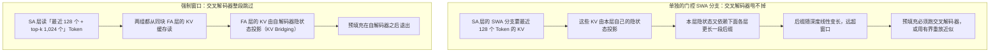
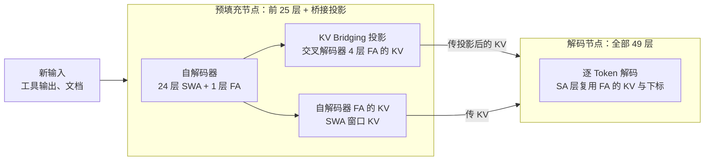

# 让预填充只跑半个模型：HySparse2 的两级 KV 共享

<!-- release-date: 2026-09-22 -->

> 本文依据本地 `papers/Xiaomi/HySparse2.pdf`，即 **HySparse2: Hybrid Sparse Attention with Two-Level KV Sharing**，arXiv:2609.26368v1、2026-09-22 提交，共 16 页，署名 LLM-Core Xiaomi。页码均指 PDF 自身的页码。文中区分三件事：**报告明确写了什么**、**我们怎么解释它**、**哪些是外部资料或本文推算**。

## 读前先把几个词说成人话

这篇论文短（正文 12 页），但它同时动了三处：层怎么排、KV 从哪来、稀疏按什么粒度挑。先把会反复出现的词说清楚：

- **KV 缓存（KV cache）**：注意力层把历史 Token 的 Key 和 Value 存在显存里，生成新 Token 时直接查，不重算。上下文越长，它越大。
- **预填充（prefill）**：把一大段输入一次性喂进模型、建好 KV 缓存的阶段。**解码（decode）** 是之后一个一个吐 Token 的阶段。
- **全注意力（Full Attention，FA）**：每个 Token 看全部历史。能看远，但计算随上下文长度线性涨（整段是平方）。
- **滑动窗口注意力（Sliding-Window Attention，SWA）**：每个 Token 只看最近 $W$ 个。便宜，但看不远。
- **稀疏注意力（Sparse Attention，SA）**：每个 Token 只看从历史里挑出来的一小撮 KV。挑得准，就能用 SWA 的价钱买到接近 FA 的视野。
- **混合注意力（hybrid attention）**：少数 FA 层夹在大量便宜层（SWA 或 SA）之间。
- **跨层 KV 共享（cross-layer KV sharing）**：后面的层不自己存 KV，直接用前面某层的。省存储，有时也省计算。
- **YOCO（You Only Cache Once）**：微软 2024 年的 decoder-decoder 架构。前半截叫 **自解码器（self-decoder）**，后半截叫 **交叉解码器（cross-decoder）**；交叉解码器的 KV 全部来自自解码器，所以预填充跑完前半截就能退出。
- **HySparse**：这篇的前作（Gao 等，2026，arXiv 2602.03560）。FA 层与 SA 层交错，FA 层既把自己的 KV 借给后面的 SA 层，也把「该看哪些位置」的下标借给它们。
- **预填充–解码分离（Prefill–Decode Disaggregation，PD 分离）**：预填充和解码放在不同机器上跑，中间传 KV。

这篇的名字里有两个「级」。**外层**是 YOCO 式的「自解码器 → 交叉解码器」，论文叫 **KV Bridging（KV 桥接）**；**内层**是 HySparse 式的「FA 层 → 同块 SA 层」，论文叫 **KV Reuse（KV 复用）**（PDF p. 1、p. 3）。YOCO 与 HySparse 两篇前作的原文都没有收进本库，下文只按本 PDF 对它们的转述来写。

## 一句话先说清

HySparse 已经把注意力计算和 KV 存储压下来了，但预填充时仍要把 49 层全部跑一遍（PDF p. 3）。对 agent 来说这正好是痛处：每一轮只生成一小段动作，却要读回一大段工具输出，推理越来越「输入主导」（PDF p. 2）。

HySparse2 把 YOCO 的外壳套在 HySparse 外面，并做了三处改动（PDF p. 1–5）：

1. **KV Bridging 只桥接 FA 层**：交叉解码器的每个 FA 层，用自己的 K/V 投影去投影自解码器 FA 层的输入隐状态，生成自己的 KV 缓存；
2. **Token 级稀疏**：HySparse 按 64 个 Token 一块来挑，HySparse2 改成逐个 Token 挑；
3. **去掉 SA 层里单独的 SWA 分支**：改成把最近的一段 Token 强制塞进稀疏选择里，局部和全局都从同一份 FA 的 KV 缓存里读。

第 3 条是能「完整提前退出」的关键：交叉解码器里不再有任何一份 KV 要靠它自己的隐状态来建。于是预填充只跑前 25 层，其中只有 1 层是全注意力（PDF p. 5、p. 12）。

在 80B 总参、3B 激活（80B-A3B）的 MoE 上，论文给的硬数字是（PDF p. 2、p. 8–9）：

- 轻量后训练后，平均 MRCR-v2 比 HySparse 高 11.30 个百分点，RULER-v2 高 19.81 个百分点（PDF p. 2、p. 8）；
- 1M 上下文时，预填充 FLOPs 比 HySparse 少 2.92 倍、比 Hybrid SWA 少 5.02 倍（PDF p. 9）；
- 1M 上下文、FP8 存储时，KV 缓存 2.69 GB，对 HySparse 的 6.72 GB 和 Hybrid SWA 的 12.09 GB（PDF p. 9）。

读完要带走的判断是：**这三笔收益来源不同**。预填充省下的主要是「只跑半个模型、只跑 1 层 FA」；KV 缓存相对 HySparse 省下的那 2.5 倍，按我们的验算几乎全部来自换成 MQA 与新的头维度，不是来自两级共享；检索提升则主要归功于 Token 级稀疏。下面逐一拆开。

### 一条阅读路线

如果只有半小时读原文，建议按这个顺序：

1. **p. 4 的 Figure 2**：左边是 49 层怎么排，右边是一个 FA+SA 块里 KV 和下标怎么流。整篇就这一张结构图。
2. **p. 5 第 3.3 节后半**：为什么单独的 SWA 分支会拖住预填充，这是全文最绕、也最有价值的一段。
3. **p. 6 Table 1 与训练设定**：三个模型差在哪；注意 HySparse2 同时换了 MQA 和头维度。
4. **p. 8 Figure 3、p. 9 Figure 4**：后训练后的长上下文与 agent 指标，以及预填充和 KV 的成本曲线。
5. **p. 9–11 三组消融**：Token 对 Block、三种局部窗口处理、KV Bridging 有无以及对 KV Mirror。

p. 7 的 Table 2 是通用能力的对照尺，第一次读可以只看最后两行长上下文。

## 主要矛盾：agent 的上下文是「读」进来的，不是「写」出来的

论文开篇把 agent 推理的形状说得很清楚：多轮交互里，一次很短的动作或工具调用，可能换回一大段搜索结果、执行轨迹或文档；这段新输入要先预填充，解码才能继续。观察越积越多，模型又要在不断变长的历史里检索、拼接证据（PDF p. 2）。于是三件事同时被要求（PDF p. 1–2）：

1. **预填充要快**：新输入远多于新输出；
2. **KV 缓存要小**：历史只增不减；
3. **长程检索要准**：证据散落在很多轮之前。

旧方案各缺一块。只压注意力计算不够：论文点明，即使注意力便宜了，新 Token 仍要穿过整个骨干网络，这笔计算省不掉（PDF p. 2）。HySparse 省了注意力和 KV，但预填充仍执行全部层（PDF p. 3）。YOCO 能让预填充提前退出，但它本身不解决稀疏检索的精度。HySparse 的块级稀疏在预训练评测里看不出劣势，到了多轮、长上下文的 agent 任务上却出现明显的精度损失（PDF p. 3–4）。

于是矛盾变成：

> 能不能同时拿到 YOCO 的「预填充只跑一半」、HySparse 的「FA 层当索引器、SA 层复用 KV」，并且把检索精度补回来？难点在于，这两种共享叠在一起时，交叉解码器里任何一处「需要自己隐状态才能建的 KV」都会让提前退出破功。

## 先看全景：49 层，前 25 层建全部缓存

图引自 PDF p. 4 Figure 2。左半边从下往上数：Embedding 之后，自解码器是 12 层 SWA、1 层 FA、12 层 SWA，共 25 层；交叉解码器是 4 个块，每块 1 层 FA 接 5 层 SA，共 24 层，合计 49 层，与第 4 节的设定一致（PDF p. 4、p. 6）。全模型因此只有 5 层 FA：自解码器 1 层，交叉解码器 4 层，对上 Table 1 的「#Full = 5」（PDF p. 6）。

图上有两点正文没有逐字写出，是我们逐根线读出来的：

- **蓝线有两个取点**。一个在自解码器那层 FA 的输入处（下层 12 层 SWA 之后），连到交叉解码器最上面两个 FA；另一个在自解码器出口、「Prefill Exit」虚线处，连到交叉解码器下面两个 FA。正文只写「每个交叉解码器 FA 层作用在对应自解码器 FA 层的输入隐状态上」（PDF p. 2、p. 4），没有列出 4 个 FA 层各自配哪个源，也没有解释出口处这个取点。以图为准，就是「一个源供两层」。
- **右半边的色块**：FA 层下面那排格子里，绿色是 top-$k$ 挑中的 Token，散在整段历史里；末尾一串黄色是强制保留的最近窗口。传到上面 SA 层的是「绿 + 黄」拼起来的那一小段 KV 和对应下标（PDF p. 4，Figure 2 图注）。

三种注意力设计的差别在 Table 1（PDF p. 6）和第 4.1 节正文（PDF p. 6）：

| 模型 | FA 层数 | 头数（Q / KV） | 头维度（QK / V） | 稀疏或局部设定 |
|---|---:|---|---|---|
| Hybrid SWA | 9 | 64 / 4 | 192 / 128 | 窗口 128 的 SWA |
| HySparse | 5 | 64 / 4 | 192 / 128 | 以 64 个 Token 为块、共挑 1,024 个 Token，另加 128 窗口的 SWA 分支，门控融合 |
| HySparse2 | 5 | 64 / 1 | 256 / 256 | 逐 Token 挑 1,024 个全局 Token，外加 128 个强制保留的最近 Token |

Hybrid SWA 就是 MiMo-V2 系列用的混合 SWA（PDF p. 6），它的来历见 MiMo-V2-Flash 一篇。它要 9 层 FA，因为再少精度就明显掉；HySparse 与 HySparse2 各只用 5 层 FA，论文说仍与「每层全注意力」的参考相当（PDF p. 6）。注意：**全注意力参考模型的分数，论文一个也没给**。

还有三处共同设定（PDF p. 6）：

- HySparse2 的 SWA 层用部分旋转位置编码（RoPE），64 个旋转维、底数 10,000；FA 与 SA 层不用位置编码（NoPE），所以长上下文外推时不必调 RoPE；
- 三个模型的全部 SA 与 SWA 层都带 sigmoid 输出门，以及每头一个可学的 sink 偏置；
- HySparse2 用 **MQA**（KV 只有 1 个头），另两个用 GQA（4 个 KV 头）。论文给的理由是 KV 缓存更小、Token 级稀疏核的效率更好。

最后这一条后面算账时要反复用到。

## 核心设计一：KV Bridging，只桥接全注意力层

### 旧问题：预填充仍要走完整个骨干

HySparse 的 FA 层把 KV 与 top-$k$ 下标借给同块 SA 层，注意力算得少了、KV 存得少了，但每一层照样要把新 Token 的隐状态算出来（PDF p. 3）。对 agent 这种每轮都要读进一大段工具输出的负载，MoE 前馈、投影这些与注意力无关的计算一分没省。

YOCO 给过一条路：自解码器建一份全局 KV，交叉解码器各层都用它，预填充建完缓存就能退出（PDF p. 2）。

### 新设计：交叉解码器的 FA 层，从自解码器 FA 的输入隐状态投影出自己的 KV

设自解码器第 $i$ 层与交叉解码器第 $j$ 层是一对 FA 层，$\mathbf{H}^{\mathrm{self}}_i$、$\mathbf{H}^{\mathrm{cross}}_j$ 分别是它们的输入隐状态。第 $j$ 层这样算 K、V、Q（PDF p. 4，式 1）：

$$
\mathbf{K}^{\mathrm{cross}}_j=\mathrm{Proj}^{K}_j\!\left(\mathbf{H}^{\mathrm{self}}_i\right),\quad
\mathbf{V}^{\mathrm{cross}}_j=\mathrm{Proj}^{V}_j\!\left(\mathbf{H}^{\mathrm{self}}_i\right),\quad
\mathbf{Q}^{\mathrm{cross}}_j=\mathrm{Proj}^{Q}_j\!\left(\mathbf{H}^{\mathrm{cross}}_j\right)
$$

读法：K 和 V 的「原料」来自自解码器，但每个交叉层有 **自己的** 投影矩阵，所以同一个源喂出来的几份 KV 彼此不同；Q 则照常用本层自己的当前隐状态（PDF p. 4）。两边的混合比例可以不同，一个自解码器 FA 层可以供多个交叉解码器 FA 层（PDF p. 4）。

### 和 YOCO 差在哪

按论文的描述，YOCO 是「一份全局 KV 被交叉解码器各层共享」（PDF p. 2）。HySparse2 有两处不同：

1. **只桥接 FA 层**。交叉解码器里的 SA 层不从自解码器取任何东西，它们走内层的 KV Reuse，复用同块 FA 的 KV（PDF p. 3）。
2. **每层各投影一份，而不是共用一份**。这意味着交叉解码器的 4 个 FA 层各存各的 KV。

**我们如何解释它**：第 2 点决定了 KV Bridging 省的是 **计算**，不是 **存储**。4 份 KV 都要进缓存，只是它们的原料在自解码器里就算好了。所以预填充可以提前退出，而缓存条数并没有因为「桥接」变少。

### 为什么源头选全注意力层

论文拿 KV Mirror（Liu 等，2026，arXiv 2607.08186）做了对照。KV Mirror 是 U 形连接：第 1 层配第 $n$ 层、第 2 层配第 $n-1$ 层，依此类推；KV Bridging 只连两边的 FA 层。两者都是把源隐状态重新投影成目标 KV。对照在同一混合骨干、同一预训练配方的 80B-A3B 上做（PDF p. 11）。

图引自 PDF p. 11 Figure 5。终点分数是正文给的：KV Bridging 87.65，KV Mirror 81.28（PDF p. 11）。

论文把原因写成一个 **假设**：FA 层的梯度会穿过整段可见上下文上的注意力分数回传，SWA 只把这种直接连接限制在局部窗口里；更密的监督让 FA 层的输入隐状态保留更多全局信息，更适合拿去投影（PDF p. 11）。这是作者的解释，论文没有做验证它的实验。

### 桥接会不会伤质量

为了看这套设计能否放大，作者另训了一对 290B-A8B 模型，约 1.8T Token、32k 上下文，一个有桥接、一个没有（PDF p. 10）。Table 5（PDF p. 11）：

| 任务 | 无桥接 | 有桥接 |
|---|---:|---:|
| MMLU | 72.68 | 72.80 |
| TriviaQA | 73.32 | 74.10 |
| BBH | 70.65 | 69.57 |
| DROP | 71.37 | 68.17 |
| GSM8K | 77.63 | 76.65 |
| Repo Code PPL ↓ | 1.1351 | 1.1353 |
| RULER | 96.32 | 96.01 |
| LongPPL ↓ | 3.6053 | 3.4202 |

论文的读法是「大体相当」（PDF p. 11）。逐格看：MMLU、TriviaQA、LongPPL 有桥接更好；BBH、GSM8K 掉约 1 分；DROP 掉 3.20 分，是表里最大的一格，论文如实写出但没有解释（PDF p. 11）。

**我们如何解释它**：桥接的收益在推理侧（下面算），代价体现在少数推理类任务上的小幅下滑。这张表只证明「不伤大局」，不证明「没有代价」。

### 可迁移启发

想让预填充提前退出，先问：后半截模型的每一份 KV，原料是不是都能在前半截里备齐。给每个目标层配独立投影，是用一点参数换「不同层看同一原料的不同视角」；源头选 FA 层而不是 SWA 层，Figure 5 给了实测支持，机理仍是假设。

## 核心设计二：Token 级稀疏，把预算花在单个位置上

### 旧问题：块级选择在 agent 轨迹上吃亏

HySparse 用块级稀疏，是精度和效率的折中：预训练评测没看出明显劣势，规则的块结构又便于写高效算子（PDF p. 3）。但论文说，在多轮、长上下文的 agent 任务上，块级选择出现了明显的精度劣势（PDF p. 3–4）。另一方面，稀疏算子的进展（论文引 TileLang）让 Token 级实现变得可行（PDF p. 3）。

### 新设计：FA 层按注意力分数逐 Token 取 top-$k$

FA 层本来就要算精确的注意力分数，HySparse2 直接在单个 Token 上做 top-$k$，后面的 SA 层复用这些被挑中 Token 的 KV（PDF p. 4–5）。FA 层因此兼任「索引器」，给的是精确分数下的选择，论文称之为 oracle token selection；也因此不需要另训一个索引器模块，也不需要辅助蒸馏目标（PDF p. 5）。

### 证据：同样预算，检索与图推理明显更好

两个变体骨干相同，都挑 1,024 个全局 Token，都保留单独的 128 窗口 SWA 分支；块级的块大小是 64（PDF p. 9）。Table 3（PDF p. 9）：

| 类别 | 任务 | 块级 | Token 级 |
|---|---|---:|---:|
| 预训练 | BBH | 61.93 | 60.70 |
| 预训练 | MMLU-Pro | 35.74 | 36.97 |
| 预训练 | NoLiMa | 40.27 | 38.43 |
| 长上下文（≤32k） | RULER-v2 | 49.56 | 56.13 |
| 长上下文（≤32k） | MRCR-v2（2 针） | 12.94 | 21.08 |
| 长上下文（≤32k） | GraphWalks | 29.38 | 34.92 |

正文给的提升：RULER-v2 高 6.57 分，两针 MRCR-v2 高 8.14 分，GraphWalks 高 5.55 分，而且都在 32k 训练长度之内就出现了（PDF p. 9）。GraphWalks 按表内两数相减是 5.54，与正文差 0.01，应是未四舍五入前的差值。

另外两点表上读得出、正文没强调：Token 级在 BBH 和 NoLiMa 上反而更低；块级这一列的 BBH、MMLU-Pro、NoLiMa 三个数与 Table 2 里 HySparse 那一列完全相同（PDF p. 7、p. 9），论文没有说明块级变体是否就是那个 HySparse 模型。

### 为什么对 agent 特别有用

论文的解释（PDF p. 10）：agent 轨迹里推理、工具调用和返回结果反复交错，一次回答要用的信息散在好几轮里，还夹着标识边界的角色分隔符和其他特殊 Token。预算固定时，为了留住一个这样的 Token 而选中整块，会把容量花在它的邻居上；逐 Token 选就能把预算撒到整段上下文的各个位置。检索和图推理的提升与这个解释一致。

**我们如何解释它**：这是一个「证据稀疏且分散」的场景。块级选择默认「相关的东西挨在一起」，在文档阅读里常常成立，在工具输出拼成的轨迹里不成立。

### 代价与边界

论文没有给 Token 级与块级的算子吞吐对比，只说 Token 级「已经可行」，并把换 MQA 的理由之一写成「Token 稀疏核效率更好」（PDF p. 3、p. 6）。所以 Token 级的效率代价，本文找不到实测数字。

### 可迁移启发

稀疏粒度应跟着「证据在上下文里怎么分布」来定。如果负载是多轮 agent 轨迹、关键 Token 是零散的分隔符和字段，块级省下的算子规整性可能不值得。

## 核心设计三：把局部窗口塞进稀疏选择，完整退出才成立

这张图按 PDF p. 5 第 3.3 节后半的文字重画，是机制示意，不是论文原图；128 与 1,024 取自第 4.1 节（PDF p. 6）。

### 旧问题：单独的 SWA 分支会拖出一条级联依赖

HySparse 的 SA 层里，除了稀疏选中的全局 Token，还有一条单独的 SWA 分支负责最近 128 个 Token，两路门控融合（PDF p. 6）。放进 YOCO 式结构后，这条分支出了大问题（PDF p. 5）：

- 交叉解码器里的 SWA 分支，要用 **本层自己的隐状态** 投影出最近一段 Token 的 KV；
- 这些隐状态又依赖前面各层在更多 Token 上的隐状态，所需的范围随深度线性变长；
- 于是交叉解码器要处理的 Token 后缀，远长于窗口本身。

这些状态要么在预填充时算出来——交叉解码器就不能被整个跳过；要么用有界重放（bounded replay，论文引 DeepSeek-V4.1-Flash）之类的办法近似（PDF p. 5）。

**我们的估算**（不是论文数字）：交叉解码器有 20 层 SA。若每层都带 128 窗口的 SWA 分支，最上层最近 128 个 Token 的 KV，往下每经过一层 SWA，依赖范围大约再往前扩 128 个 Token，量级上是 $20 \times 128 = 2{,}560$ 个 Token 的后缀要跑完整个交叉解码器。确切数字取决于 FA 层怎么算这些后缀 Token，论文没有给。

### 新设计：强制窗口，局部 Token 也从 FA 的 KV 缓存里读

HySparse2 去掉单独的 SWA 分支，改为：最近一段 Token 总是被选中，其余名额再给窗口外得分最高的 Token；两组都从 FA 层的 KV 缓存里读，并被后面的 SA 层复用（PDF p. 5）。设定是 128 个强制本地 Token 加 1,024 个全局 Token（PDF p. 6）。

这样交叉解码器里的每一份 KV 都来自 FA 层，而 FA 层的 KV 又来自自解码器的隐状态。论文的原话是，这个依赖「从构造上被移除」，预填充时交叉解码器一层都不用算（PDF p. 5）。附带的好处是省掉了那条分支的独立投影参数，论文说这笔开销在他们的门控基线里「相当大」，但没有给具体数字（PDF p. 5）。

### 证据：强制窗口与门控分支大体相当

三个变体共享同一骨干、同样的 KV Bridging 和同样的 SWA 自解码器，只在交叉解码器 SA 层怎么处理局部上下文上不同；比的是预训练、32k 以内（PDF p. 10）。Table 4（PDF p. 10）：

| 类别 | 任务 | 门控 SWA 分支 | 无 SWA | 强制窗口 |
|---|---|---:|---:|---:|
| 推理 | BBH | 62.23 | 60.11 | 62.25 |
| 推理 | MMLU-Pro | 39.15 | 37.19 | 38.12 |
| 推理 | MATH | 35.82 | 33.82 | 33.38 |
| 推理 | DROP | 60.06 | 58.94 | 56.85 |
| 推理 | GSM8K | 64.52 | 60.35 | 59.44 |
| 推理 | ARC-C | 81.06 | 79.01 | 78.41 |
| 推理 | HellaSwag | 79.85 | 78.23 | 78.42 |
| 推理 | WinoGrande | 73.09 | 73.95 | 72.85 |
| 长上下文（≤32k） | NoLiMa | 37.62 | 38.37 | 36.16 |
| 长上下文（≤32k） | RULER | 88.19 | 84.55 | 89.84 |
| 长上下文（≤32k） | RULER-v2 | 53.66 | 54.62 | 55.98 |
| 长上下文（≤32k） | MRCR-v2 | 27.66 | 20.73 | 22.67 |
| 长上下文（≤32k） | GraphWalks | 35.39 | 36.48 | 37.13 |
| 长上下文（≤32k） | LongPPL ↓ | 6.8807 | 7.1307 | 6.9838 |

论文的三条读法（PDF p. 10）：

1. 局部信息是必须的：直接去掉（无 SWA）总体变差；
2. 强制窗口拿到了 RULER、RULER-v2、GraphWalks 三项最好；
3. 相对门控分支，强制窗口 GSM8K 低 5.08 分、MRCR-v2 低 4.99 分、LongPPL 高 1.50%。作者认为这是 **可以接受的代价**，因为它不需要额外投影参数、不需要局部 KV 缓存，从而让提前退出成为可能。

**我们如何解释它**：这张表的 8 项推理类任务里，强制窗口只在 BBH 上略高于门控分支（62.25 对 62.23），其余 7 项都更低，差距不全是噪声量级（GSM8K 5.08、DROP 3.21）（PDF p. 10）。强制窗口换来的是结构上的可退出性，不是「白拿」。作者的判断是这笔交换值得，表上的数字支持「可接受」，不支持「无损」。

### 可迁移启发

提前退出类设计，要把后半截的每一种 KV 来源都列出来：只要有一种依赖本层隐状态，它就会沿深度把依赖拉长。把「局部窗口」改成「选择集合里强制保留的一段」，是把两种注意力并成一种 KV 来源的通用手法。

## 三笔账分别从哪来

### 整体对比一：预训练后，通用能力相当，长上下文领先

三个 80B-A3B 模型用相同数据与训练日程（PDF p. 2、p. 6）。Table 2（PDF p. 7）：

| 类别 | 任务 | Hybrid SWA | HySparse | HySparse2 |
|---|---|---:|---:|---:|
| 知识 | MMLU | 61.48 | 64.48 | 63.92 |
| 知识 | MMLU-Redux | 63.96 | 68.44 | 67.50 |
| 知识 | C-Eval | 65.08 | 67.09 | 67.90 |
| 知识 | CMMLU | 67.41 | 69.97 | 69.90 |
| 知识 | TriviaQA | 60.59 | 60.67 | 59.67 |
| 推理 | BBH | 60.14 | 61.93 | 64.29 |
| 推理 | MMLU-Pro | 36.12 | 35.74 | 37.56 |
| 推理 | MATH | 36.18 | 36.14 | 34.32 |
| 推理 | DROP | 60.90 | 63.78 | 58.99 |
| 推理 | GSM8K | 64.44 | 64.14 | 61.94 |
| 推理 | ARC-C | 75.51 | 79.18 | 77.82 |
| 推理 | HellaSwag | 79.38 | 79.19 | 79.54 |
| 推理 | WinoGrande | 73.72 | 74.19 | 71.82 |
| 代码 | HumanEval+ | 35.98 | 34.76 | 34.15 |
| 代码 | MBPP+ | 55.56 | 52.65 | 52.65 |
| 代码 | Repo Code PPL ↓ | 1.1578 | 1.1588 | 1.1570 |
| 长上下文 | RULER | 88.71 | 84.89 | 90.77 |
| 长上下文 | NoLiMa | 30.13 | 40.27 | 49.76 |

Repo Code PPL 是内部基准，在带跨文件依赖的长代码仓上算字节困惑度，因此也测长上下文建模（PDF p. 7）。

论文的读法（PDF p. 7–8）：通用能力与两个基线大体相当；最清楚的提升在长上下文，RULER 与 NoLiMa 分别比 HySparse 高 5.88 和 9.49 分；BBH、MMLU-Pro 更强，DROP 上 HySparse 仍占优。

表上还能读出论文没展开的几格：HySparse2 在 TriviaQA、MATH、DROP、GSM8K、WinoGrande、HumanEval+ 上是三者最低，与各项最高分相差 1–5 分（PDF p. 7）。和 Table 4、Table 5 放在一起看，DROP 与 GSM8K 在三张表里都往下走，方向一致。

### 整体对比二：轻量后训练后，四项指标在每个长度上都领先

后训练约 100B Token，加入 agent 数据，上下文扩到 256k（PDF p. 6）。四个指标的口径（PDF p. 7）：

- **AgentPPL**：内部基准，取 1,000 条多轮 agent 轨迹，只在推理、工具调用和回复片段上算字节困惑度；
- **LongPPL**：只在依赖长程上下文的关键 Token 上算困惑度，用 349 个来自 agent 轨迹与长上下文任务的样本；
- **MRCR-v2**：多轮检索，2、4 或 8 根「针」；
- **RULER-v2**：12 个检索与问答子任务。

检索平均分对各长度等权，困惑度曲线按上下文长度分组（PDF p. 8）。

图引自 PDF p. 8 Figure 3。正文给的精确数（PDF p. 8）：

| 相对谁 | 平均 MRCR-v2 提升 | 平均 RULER-v2 提升 |
|---|---:|---:|
| HySparse | 11.30 | 19.81 |
| Hybrid SWA | 6.44 | 18.65 |

256k 时 RULER-v2 是 58.45，对 HySparse 的 32.61 和 Hybrid SWA 的 35.74（PDF p. 8）。

图上还有两件事值得看（读自 Figure 3，非正文数字）：MRCR-v2 在 128k 处三条线最接近，HySparse2 只比 Hybrid SWA 高约 1 分；AgentPPL 与 LongPPL 的差距很小，三条线挤在一起。

论文对两条困惑度曲线走向相反给了解释（PDF p. 8）：上下文更长，LongPPL 的关键 Token 能看到更多相关信息，所以下降；而 agent 轨迹里多出来的是更多的轮次和工具输出，相关证据更难找，所以 AgentPPL 上升。

### 整体对比三：预填充与 KV 缓存

图引自 PDF p. 9 Figure 4，80B-A3B 配置、FP8 存 KV（PDF p. 9）。正文给的精确数：1M 时预填充 FLOPs 比 HySparse 少 2.92 倍、比 Hybrid SWA 少 5.02 倍；KV 缓存 2.69 GB、6.72 GB、12.09 GB（PDF p. 9）。论文在引言里把这些称作「我们的分析」（PDF p. 2），是按配置算出来的，不是实测延迟。

这两条曲线能用 Table 1 的配置自己算出来。下面是 **我们的验算**，不是论文内容。

**KV 缓存**。设 FP8 每个数 1 字节、1M 取 $2^{20}$ 个 Token，忽略 SWA 层 128 个 Token 的窗口缓存（相对 1M 可以不计）。每层 FA 每个 Token 要存的字节数是：

$$
\text{每 Token 每层字节} = n_{\mathrm{KV}} \times \left(d_{K} + d_{V}\right)
$$

- HySparse2：$1 \times (256 + 256) = 512$，5 层 FA，$5 \times 512 \times 2^{20} \approx 2.68$ GB；
- HySparse：$4 \times (192 + 128) = 1{,}280$，5 层 FA，约 6.71 GB；
- Hybrid SWA：同样 1,280，9 层 FA，约 12.08 GB。

三个数与论文的 2.69、6.72、12.09 GB 都对得上。HySparse2 的 5 份 KV 就是自解码器 1 层 FA 加交叉解码器 4 层 FA 各自一份。这说明：

> HySparse2 相对 HySparse 的 KV 缩小（$6.72 / 2.69 \approx 2.5$ 倍），**几乎全部来自每层 KV 从 1,280 字节降到 512 字节**，即换成 MQA 与新的头维度。两者存 KV 的 FA 层数都是 5。KV Bridging 与 KV Reuse 没有让 HySparse2 比 HySparse 少存一层。相对 Hybrid SWA 的缩小，则是「5 层对 9 层」与「512 对 1,280」两笔相乘。

论文第 2.2 节把 HySparse2 在 KV 压缩上的定位写成推进跨层共享（PDF p. 3），第 4.1 节也提到换 MQA 能让 KV 缓存更小（PDF p. 6），但没有把这 2.5 倍拆开。按上面的算术，「相对 HySparse」的这笔主要是头配置的功劳；跨层共享省下的是「每层都存 KV」那种设计的存储，这一点 HySparse 已经做到了。

**预填充 FLOPs**。长上下文时，每 Token 预填充 FLOPs 的增长几乎全部来自 FA。一层 FA 里，每个查询对每个键做一次 QK 点积和一次加权 V，约 $2 \times n_{Q} \times (d_{QK} + d_{V})$ 次浮点运算；因果掩码下平均每个 Token 看 $L/2$ 个键。在 $L = 2^{20}$ 时：

- HySparse 一层 FA 约 $2 \times 64 \times 320 \times 2^{19} \approx 21.5$ GFLOPs，5 层约 107；
- Hybrid SWA 9 层约 193；
- HySparse2 **预填充只跑自解码器那 1 层 FA**，$2 \times 64 \times 512 \times 2^{19} \approx 34.4$ GFLOPs。

这三个斜率与 Figure 4 左图上 1k 到 1M 的增幅（约 35、108、193，读图估计）一致。所以 2.92 倍主要来自「预填充只跑 1 层 FA 而不是 5 层」；HySparse2 这 1 层因头维度更大，单层反而比 HySparse 的一层更贵。1k 处 HySparse2 约 5 GFLOPs，两条基线约 7–9 GFLOPs（读图估计），这点差距才是「只跑半个模型」省下的非注意力计算；它不随长度增长，所以到 1M 时在总账里只占小头。

### 可迁移启发

读这类「成本曲线」时，先按配置把 KV 字节和 FA 层数算一遍，再去看作者把收益归给了哪个设计。这篇的三笔收益里，**检索精度** 主要来自 Token 级稀疏，**预填充** 主要来自两级共享带来的提前退出，**KV 缓存** 相对前作主要来自 MQA。三者在整体对比里是打包出现的，只有前两者有单独的消融。

## 推理侧：预填充节点只放半个模型

这张图按 PDF p. 5 第 3.5 节的文字重画，是机制示意，不是论文原图。论文只明写了两件事：预填充节点只放自解码器与桥接投影，交叉解码器 FA 的 KV 在预填充节点上算好再传给解码节点。「自解码器自己的 KV 也要传」「解码节点放全部 49 层」是我们按架构补的推断。

论文写了两件与部署有关的事（PDF p. 5）：

**PD 分离**。预填充节点只放自解码器和 KV Bridging 的投影。对 Figure 2 那个 49 层模型，只需部署前 25 层，预填充节点的显存需求降到接近一半；SWA 与 FA 比例很高时，预填充阶段只有 1 层做全注意力。交叉解码器 FA 的 KV 在预填充节点上算好再传给解码节点，因为 **投影后的 KV 比源隐状态小**（PDF p. 5）。**我们的核算**：隐状态宽 2,048，HySparse2 一层 KV 是 1 个头 ×（256 + 256）= 512 个数（PDF p. 6）。交叉解码器有 4 层 FA：若 4 层共用一个源，4 份 KV 合计 2,048 个数，与一份隐状态一样多；按 Figure 2 画的两个取点，是 2 份隐状态（4,096 个数）对 4 份 KV（2,048 个数），KV 才小一半。KV 按 FP8 存（PDF p. 9），隐状态若按更高精度传，差距还会更大。论文没有写传输精度，也没有给传输量的实测。

**投机解码**。预训练时，HySparse2 挂 1 层 MTP（多 Token 预测），条件是自解码器与交叉解码器边界处的隐状态，用来帮助收敛。后训练时可以换成更大的 DFlash 式草稿模型（Chen 等，2026，arXiv 2602.06036），条件还是同一处隐状态。因为这处隐状态在前半截就算好了，草稿和验证可以异步进行。论文明写：训练更大的草稿模型、协调异步执行，都是 **未来工作**（PDF p. 5）。

**我们如何解释它**：「边界隐状态早出」是这套结构的第二个红利。它既是交叉解码器 KV 的原料，也可以是草稿模型的输入。但这一段全是设想，没有实验。

## 全注意力为什么还留着

两代 HySparse 都保留少量 FA 层，作者的理由有两层（PDF p. 5）：

1. 他们相信 FA 对模型质量仍然重要；
2. FA 层兼任索引器，用精确分数给后面的 SA 层做 oracle 选择，于是可以原生端到端训练，不必另训索引器、也不必加辅助蒸馏目标。

代价是 FA 贵，所以比例压得很低；HySparse2 预填充时只需 1 层 FA（PDF p. 5）。作者列了两条可能的后续方向：后训练时用轻量索引器加稀疏注意力去近似剩下的 FA 层（引 SeerAttention 与 DeepSeek-V3.2）；或者把 FA 层的查询头减少、SA 层的查询头增加，把算力从 FA 挪到 SA（PDF p. 5）。两条都没有做。

## 训练设定：写了什么、没写什么

写了的（PDF p. 6）：

- 模型：80B-A3B MoE，49 层，隐藏维 2,048；用简化的 mHC（残差混合矩阵固定为单位阵）；
- 预训练：约 500B Token，32k 上下文；
- 轻量后训练：约 100B Token，加入 agent 数据，上下文扩到 256k；
- 优化器 Muon，WSD 学习率日程，峰值学习率预训练 $10^{-3}$、后训练 $5 \times 10^{-5}$；
- 三个模型在每个阶段数据配比与日程相同；整体对比报预训练与后训练两组结果，消融只报预训练结果；
- 290B-A8B 的桥接消融：约 1.8T Token，32k 上下文（PDF p. 10）。

没写的：MoE 的专家数、路由与激活配置；数据配比与 agent 数据的来源；稀疏注意力与 Token 级 top-$k$ 的算子实现；训练用的硬件与墙钟时间；后训练的具体做法。论文正文也没有给代码或权重的链接。

## 限制、边界，以及不要补进去的实现

- **整体对比不是单变量对照**。HySparse2 同时换了 MQA 与头维度（256 / 256），再加上两级共享、Token 级稀疏和强制窗口；位置编码（SWA 层部分 RoPE、FA/SA 层 NoPE）论文只写了 HySparse2 的设定，没有说两条基线是否相同（PDF p. 6）。Table 2 与 Figure 3 的领先是这一整包的效果，只有 Token 级、局部窗口、桥接三项有单独的消融，MQA 没有。
- **KV 缓存的收益归因需要自己拆**。按我们的验算，相对 HySparse 的 2.5 倍几乎全来自 MQA 与头维度；两级共享没有减少存 KV 的层数。
- **预填充与 KV 数字是分析值**。论文说是「我们的分析」（PDF p. 2），没有端到端延迟、吞吐或 PD 分离下的 KV 传输实测。
- **推理类任务有持续的小幅代价**。DROP、GSM8K 在 Table 2、Table 4、Table 5 里都下降，强制窗口相对门控分支还低了 MRCR-v2 4.99 分（PDF p. 7、p. 10、p. 11）。
- **没有全注意力基线的数字**。论文把「每层全注意力」当最强参考，并以「不明显落后于它」来定 FA 层数，但没有列出它的分数（PDF p. 6）。
- **后训练很轻**。约 100B Token 的轻量后训练，不是完整的对齐流程；agent 相关结果都是困惑度（AgentPPL 为内部基准）与检索基准，没有端到端的 agent 任务成功率（PDF p. 7–8）。
- **KV Bridging 为什么比 KV Mirror 好**，论文只给了假设（PDF p. 11）。
- **Figure 2 里出口处的第二个取点**，正文没有解释。

## 可迁移启发

1. **agent 推理是输入主导的**。优化目标要把预填充单列出来；只压注意力复杂度，省不掉新 Token 穿过整个骨干的那笔计算。
2. **提前退出的前提是「后半截每份 KV 的原料都在前半截」**。逐一检查每种 KV 来源；任何依赖本层隐状态的局部分支，都会沿深度拉出一条级联依赖。
3. **局部窗口可以不是一个独立分支**。把最近一段 Token 强制放进稀疏选择集合，局部和全局就共用一份 KV，结构更简单，代价是部分推理任务的小幅下降。
4. **FA 层既是质量保障，也是免费的索引器**。精确分数下的 top-$k$ 不需要另训索引器，也就没有蒸馏误差。
5. **稀疏粒度要跟证据分布走**。证据零散（分隔符、字段、跨轮引用）时，Token 级比块级更值；预训练基准可能看不出差别，要在 agent 式检索上测。
6. **读成本数字先自己算一遍配置**。KV 字节 = KV 头数 ×（K 维 + V 维）× 存 KV 的层数 × 长度 × 每个数的字节数；这篇的 KV 数字三个都能对上，也因此看出收益的真正来源。
7. **PD 分离下，前后两半可以分开部署**。预填充节点只放一半权重，传的是投影后更小的 KV，而不是隐状态。

## 关键词回看

- **两级 KV 共享**：外层 KV Bridging（自解码器 → 交叉解码器，只连 FA 层），内层 KV Reuse（同块 FA → SA，共享 KV 与 Token 下标）。
- **自解码器 / 交叉解码器**：YOCO 式前后两半。HySparse2 前半截是 24 层 SWA 加 1 层 FA，后半截是 4 个「FA + 5 层 SA」的块。
- **Prefill Exit**：预填充跑完 25 层自解码器就退出，交叉解码器的 KV 全部由自解码器隐状态投影而来。
- **Token 级稀疏**：逐 Token 取 top-$k$，1,024 个全局 Token；对照块级（64 个 Token 一块）。
- **强制窗口（Forced SWA）**：最近 128 个 Token 总被选中，替代单独的 SWA 分支。
- **级联 SWA 依赖**：交叉解码器里的 SWA 分支会让预填充需要处理一个随深度线性变长的 Token 后缀。
- **Oracle token selection**：FA 层用精确注意力分数给后续 SA 层选 Token，不需要单独索引器。
- **KV Mirror**：U 形跨层配对的对照方案，RULER 终点 81.28 对 KV Bridging 的 87.65。
- **2.92 倍 / 5.02 倍**：1M 时预填充 FLOPs 相对 HySparse / Hybrid SWA 的缩减。
- **2.69 / 6.72 / 12.09 GB**：1M、FP8 时三种设计的 KV 缓存。

## 资料与阅读边界

### 本文依据的版本

- 本地原件：`papers/Xiaomi/HySparse2.pdf`，16 页，页边标注 `arXiv:2609.26368v1 [cs.CL] 22 Sep 2026`。
- 官方页：[arXiv:2609.26368](https://arxiv.org/abs/2609.26368)，截至 2026-09-25 只有 v1，提交日 2026-09-22。

### 报告明确写了、本文覆盖了的部分

摘要与 Figure 1（其内容是 Figure 3、Figure 4 的子集，正文用后两者）；第 1 节引言；第 2 节三段背景；第 3 节 KV Bridging、KV Reuse 的两处改动、FA 的角色、PD 分离与投机解码；第 4.1 节实验设定与 Table 1；第 4.2 节 Table 2、Figure 3、Figure 4；第 4.3–4.5 节 Table 3、Table 4、Table 5、Figure 5；第 5 节结论。

### 外部资料补充（不是 PDF 原文）

- 前作 HySparse：[arXiv:2602.03560](https://arxiv.org/abs/2602.03560)，*HySparse: A Hybrid Sparse Attention Architecture with Oracle Token Selection and KV Cache Sharing*，2026-02-03 提交。本文对它的描述只取自本 PDF 的转述。
- YOCO：[arXiv:2405.05254](https://arxiv.org/abs/2405.05254)，*You Only Cache Once: Decoder-Decoder Architectures for Language Models*，NeurIPS 2024。
- KV Mirror 的出处：[arXiv:2607.08186](https://arxiv.org/abs/2607.08186)，*Hidden Decoding at Scale: Latent Computation Scaling for Large Language Models*。
- DFlash：[arXiv:2602.06036](https://arxiv.org/abs/2602.06036)，*DFlash: Block Diffusion for Flash Speculative Decoding*。
- 本站相关篇目：Hybrid SWA 的来历见 MiMo-V2-Flash 一篇；「锚点层 top-k 复用」这条线另见 IndexCache 一篇；有界重放见 DeepSeek-V4.1-Flash 一篇。
- 「KV 缓存与预填充 FLOPs 的验算」「级联依赖约 2,560 个 Token 的量级估算」都是本文按 Table 1 配置推算的，不是论文数字。

### 原文没有公开、本文也不补的缺口

- MoE 专家配置、路由方式；
- 预训练与后训练的数据配比、agent 数据来源；
- Token 级稀疏算子的实现与吞吐，Token 级对块级的效率对比；
- 端到端预填充延迟、解码吞吐、PD 分离下的 KV 传输量；
- 全注意力参考模型的分数；
- 去掉 SWA 分支省下的参数量；
- Figure 2 里两个桥接源分别对应哪几层的文字说明；
- 代码与权重是否公开。
