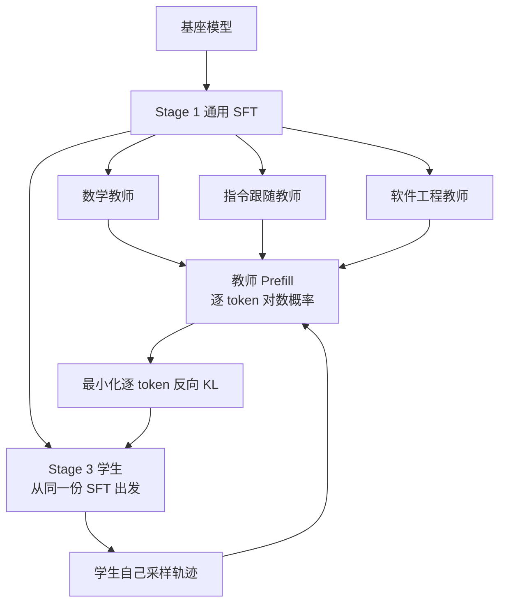

# MOPD：多域能力合不进一个模型，就把生产和整合拆开

<!-- release-date: 2026-06-29 -->

> 本文依据北京大学、Xiaomi LLM Core、香港大学与中国人民大学联合发布的 **MOPD: Multi-Teacher On-Policy Distillation for Capability Integration in LLM Post-Training**，即 arXiv:2606.30406v1、2026-06-29 首次公开、共 15 页的版本。页码均指这份 PDF 本身的页码。截至 2026-09-10 核验，arXiv 上只有 v1，与本地原件一致。通讯作者是 Zhifang Sui（北大）与 Fuli Luo（小米）；按主要归属（Xiaomi LLM Core）与索引登记放在 `reports/Xiaomi/`。全文把三件事分开标注：**论文写了什么**、**我们如何解释它**、**哪些是外部资料补充**。
>
> 这是一篇后训练方法论文，不是基模报告。模型架构、预训练和推理加速不在范围内。它在工业模型上的部署验证见 §4.3；MiMo-V2-Flash 本身怎么训、注意力和草稿头怎么设计，见已发布的 [MiMo-V2-Flash 解读](/reports/Xiaomi/MiMo-V2-Flash)。那篇模型报告已经讲过 MOPD 在 309B 上的用法，**本篇不从那边补任何数字**。本篇真正多出来的，是 Qwen3-30B-A3B 上四条整合基线、两种蒸馏损失、同源教师稳定性和多轮学生–教师演化。

## 一句话先说清

数学、代码、指令跟随、软件工程，各自用强化学习都能把模型往上推。论文开篇把这件事说得很干脆：每条领域流水线单独跑都有效；我们真正想要的，却是**一个模型同时把这些能力都装上**。（PDF p.1）

问题是合不进去。

把所有领域的题混在一个 batch 里联合强化学习，信号会互相踩，出现跷跷板；按领域一个接一个训，先训好的能力会在后面的阶段掉下去；让教师先写好范文再让学生去背，学生推理时会走到没见过的前缀上；把教师权重做平均或任务算术，融合结果既不稳，也到不了每个教师的峰值。（PDF p.1–2，Table 1）

MOPD 的回答是把后训练拆成两件事：**能力生产**和**能力整合**。先按领域独立做强化学习，得到一批冻结的领域教师；再让学生在自己采样出来的轨迹上，按题目所属领域把轨迹交给对应教师，用教师逐个 token 的对数概率当密集监督，把多个教师的能力合进一个学生。（PDF p.2、p.4）

在 Qwen3-30B-A3B 上，这套做法的归一化分数是 0.937，比最强基线 Mix-RL 的 0.882 高 5.5 个点，三个领域都收回了教师相对 SFT 学生那截涨幅的 91%–95%。（PDF p.2、p.7）同一套配方后来用在工业级的 MiMo-V2-Flash 上。（PDF p.8）

全文最值得带走的不是「又一种蒸馏」，而是这句话背后的分工：

> **领域专长的生产可以并行、可以各用各的奖励和超参；真正要小心的只有最后那一次「在学生自己会走的路上，把多个教师的分布拉过来」。**（PDF p.10–11，§5；这是本文对论文主张的归纳。）

## 读前需要的最少背景

这篇论文假设读者已经知道：语言模型可以用强化学习（Reinforcement Learning，RL）在后训练阶段针对某个任务往上推；也知道知识蒸馏是让一个模型去拟合另一个模型的输出分布。本文只补往下读够用的四件事。

- **策略 $\pi_\theta$**：正在训练的那个语言模型。给它一道题 $x$，它写出一条回答 $y$。
- **教师 $\pi_{\phi_d}$**：领域 $d$ 上已经训好、参数冻结的专家模型。学生更新时它不跟着动。
- **On-policy（在线策略）**：训练数据是学生**自己当前**采样出来的轨迹，而不是教师事先写好的范文。相对的做法叫 off-policy（离策略）。
- **反向 KL（reverse KL）$D_{\mathrm{KL}}(\pi_\theta\,\|\,\pi_{\phi_d})$**：按学生的分布取期望，去对齐教师。人话是：学生走到哪里，就在哪里问教师「这一步你会给多大概率」。它和经典蒸馏常用的前向 KL 方向相反——前向 KL 是在教师写过的位置上监督学生。

组相对策略优化（Group Relative Policy Optimization，GRPO）的基础机制见本站 DeepSeek-R1 篇，这里不重复。论文 Stage 2 的领域教师用的就是带动态采样的 on-policy GRPO（PDF p.15，Appendix A）。

还有一个容易撞车的名字，先划清。arXiv:2605.12652 也叫 MOPD，全称是 Multi-Rollout On-Policy Distillation，做的是同一道题的多条 rollout 之间互相当教师。**那是另一篇论文。** 本文只讲 Multi-Teacher 这一篇。

## 旧方法卡在哪：三种轴上，四种办法都凑不齐

论文把已有的能力整合办法收成四类，用三根轴来比：监督是不是逐 token 密集的、训练是不是 on-policy、教师生产能不能并行。（PDF p.2，Table 1）

| 方法 | 密集监督 | On-policy | 可并行 | 论文指出的病根 |
|---|:---:|:---:|:---:|---|
| Param-Merge | × | — | ✓ | 在权重空间融合，结果不稳，到不了每个教师的峰值 |
| Off-Policy Finetune | ✓ | × | ✓ | 学生只在教师的范文上学习，推理时会走到没见过的前缀 |
| Mix-RL | × | ✓ | × | 跨域训练信号互相干扰，出现跷跷板 |
| Cascade RL | × | ✓ | × | 先训好的能力在后续阶段衰退，整段长跑放大稳定性风险 |
| **MOPD** | ✓ | ✓ | ✓ | 论文主张这是唯一三者同时成立的 |

这张表是论文自己的定性归类，不是实验结果。实验结果在 §4。

四类办法对应的具体做法如下。（PDF p.1–2）

**Mix-RL。** 把所有领域的题放进同一个数据集，做联合强化学习。相关工作补了一句：每个样本仍然用自己领域的奖励和 advantage，混的是 batch 组成，不是把奖励函数合成一个。（PDF p.3）论文把它的失败归因于跨域训练信号互相干扰，也就是多任务学习里的 see-saw effect（跷跷板效应）。引用的范例是 Qwen3 技术报告（Yang et al., 2025）。

**Cascade RL。** 按领域一个接一个训，后一阶段从上一阶段的 checkpoint 接着走。先训好的能力可能在后面掉下去，而且整段串行跑得很长，稳定性风险被放大。引用的范例是 Nemotron-Cascade（Wang et al., 2026）。

**Off-Policy Finetune。** 先按领域训出 RL 教师，再拿教师的 rollout 对学生做监督学习。监督是密集的，教师也可以并行生产，但学生学的是教师的分布，不是自己推理时会碰到的分布。论文把这叫做经典的 exposure bias（曝光偏差）：训练时下一步总是接在「正确前缀」后面，推理时前缀却是自己生成的，一步错就离训练分布越来越远。引用的范例是 DeepSeek-V3.2（Liu et al., 2025）。

**Param-Merge。** 把多个教师的权重做线性平均，或者在权重空间里做任务算术（task arithmetic）：用「教师减去公共初始化」得到任务向量，再加减组合。完全不用再训练，所以谈不上 on-policy。论文认为融合模型通常不稳定，也匹配不到所有教师的完整能力。引用的是 Model Soups 与 Task Arithmetic。

**我们的解释：** 这四条路其实是在三个互斥的约束里找折中。要密集监督，最容易想到的是 SFT 式蒸馏，于是掉到 off-policy；要 on-policy，最容易想到的是继续做 RL，于是要么混 batch、要么串行，教师就不能真正独立；要并行，最容易想到的是合权重，于是离开了策略空间。MOPD 的设计目标，就是同时咬住这三根轴。

论文因此不在权重空间合、也不在一份静态数据集上合，而是**直接在策略空间合**：每个 prompt 按领域路由到对应教师，学生在自己的 rollout 上接收该教师的逐 token 信号。（PDF p.2）

## 用一张图看整条流水线

这是根据 PDF p.4 Figure 1 与 §3.1 重画的机制示意，不含实测时间。原图里 Stage 2 还画了 Search 和 Safety 作为示例领域；Qwen3-30B-A3B 上的受控实验只用 Math、Instruction Following、Software Engineering 三个领域（PDF p.6）。MiMo-V2-Flash 上的教师覆盖 Math、Code、IF、SWE、Tool Use（PDF p.8）。

有一个细节必须先看清：Stage 2 的教师和 Stage 3 的学生都从**同一份 Stage-1 SFT** 出发，教师训好后冻结，学生并不继承任何一个教师的参数。（PDF p.3–4）所以这不是「大模型教小模型」，也不是「从最强教师接着训」，而是同一个起点上的不同分支：教师在各自领域里被 RL 推到峰值，学生从公共 SFT 重新出发，把这些峰值合回来。

## 三阶段：先并行生产，再一次性整合

### Stage 1：通用 SFT，只负责给出公共初始化

基座先在覆盖所有目标能力的语料上做监督微调，得到一份 SFT checkpoint。它同时是所有领域教师的起点，也是 Stage 3 学生的起点。（PDF p.3）

Qwen3 实验的起点是 Qwen3-30B-A3B-Base，所有基线和 MOPD 都从同一份 SFT 出发，这一条保证后面的对比公平。（PDF p.6）附录里写了各领域 SFT 数据的来源，见后文实验设置。

### Stage 2：每个领域用自己最顺手的 RL，而且完全并行

对每个领域 $d$，从 Stage-1 checkpoint 训一个领域专家 $\pi_{\phi_d}$。数学用可验证答案的 RL，软件工程用可执行沙箱里的 agent RL，每个教师可以用自己的配方，彼此独立，可以完全并行。（PDF p.3）

这一阶段的产出不是最终要上线的模型，而是一组冻结的教师。论文后文把「教师和学生从同一份 SFT 长出来」称为 **same-origin（同源）**，并在 §4.4.2 证明这不是实现细节，而是稳定性的前提。

### Stage 3：学生自己采样，教师只打分

学生从 Stage-1 SFT 初始化。每个优化步骤做四件事：（1）从多域数据里采一批 prompt；（2）学生为每道题生成一条轨迹，并记下沿途每个位置的概率分布；（3）按题目所属领域把轨迹交给对应教师，教师对这条轨迹做 prefill，得到自己的逐 token 概率；（4）最小化学生与该教师之间的逐 token 反向 KL。（PDF p.3–4）

Figure 1 的图注把同一件事写成五步：从领域混合里采样 prompt、路由到匹配教师、学生 rollout、教师 prefill、用教师信号更新学生。（PDF p.4）顺序和正文略有出入，功能上等价——路由依据的是题目的领域标签，在生成之前就知道。

论文给这套管线列了五条结构性好处。（PDF p.4）

1. **没有曝光偏差。** 学生在自己的 rollout 上训练，训练和推理的状态分布按构造对齐。
2. **逐 token 的密集监督。** 轨迹的每个位置都有教师的概率分布，比标准 RL 的整条轨迹一个奖励密得多，方差更低、样本效率更高。
3. **在策略空间稳定整合。** 能力靠「这道题交给哪个教师」来合并，不靠平均权重。
4. **教师模块化、可并行。** 一个教师的 RL 失败或要调超参，不影响别的教师。
5. **同源教师带来的稳定性。** 教师和学生从同一份 SFT 出发，初始 KL 低，蒸馏过程平滑。这一条留给 §4.4.2 用实验证明。

**我们的解释：** 第 1、2 条是算法性质，第 3、4 条是组织方式，第 5 条是适用范围。后面的实验会显示：前四条在同源设定下成立；一旦把教师换成更强但不同源的外部模型，第 5 条崩了，前几条也救不回来。

## 算法：同一个反向 KL，两种实现

Stage 3 要优化的目标只有一个：让学生对被派来的教师，在自己采样的前缀上，逐个位置做反向 KL。（PDF p.5，式 1）

$$
\mathcal{L}_{\text{rev-KL}}
=
\mathbb{E}_{x,\,y\sim\pi_\theta}
\left[
\frac{1}{|y|}
\sum_{t}
\sum_{v}
\pi_\theta(v)\,
\log\frac{\pi_\theta(v)}{\pi_{\phi_d}(v)}
\right]
$$

符号先说清楚：

- $x$ 是题目，$y$ 是学生写出的整条轨迹，$|y|$ 是长度；
- $\pi_{\phi_d}$ 是这道题所属领域的教师；
- $\pi_\theta(v)$、$\pi_{\phi_d}(v)$ 都是在前缀 $(x, y_{<t})$ 下、下一个词取 $v$ 的概率，论文为了少写条件省略了后件；
- 内层对 $v$ 的求和扫过词表，所以这是该位置上两个完整下一词分布之间的 KL。

$\frac{1}{|y|}$ 把不同长度的轨迹放到同一尺度上。期望按学生的 $\pi_\theta$ 取，所以前缀 $y_{<t}$ 来自学生自己——这就是 on-policy。

直接按式 1 做，每个位置都要教师和学生拿出完整词表分布，通信和存储都很贵。论文给了两种省钱的实现。

### 实现一：策略梯度，只看实际采样到的那个 token

沿着 MiniLLM 的思路，论文把蒸馏写成一个强化学习过程。式 1 对 $\theta$ 的梯度是（PDF p.5，式 2）

$$
\nabla_\theta\mathcal{L}
=
-\mathbb{E}_{x,y}
\left[
\frac{1}{|y|}
\sum_{t}
\log\frac{\pi_{\phi_d}(y_t)}{\pi_\theta(y_t)}
\,\nabla_\theta\log\pi_\theta(y_t)
\right]
$$

这正是策略梯度的形状。括号里的对数差充当每个 token 的 advantage（优势）：

$$
\hat{A}_{\text{MOPD},t}
=
\operatorname{sg}\bigl[\log\pi_{\phi_d}(y_t)-\log\pi_\theta(y_t)\bigr]
$$

（PDF p.5，式 3）$\operatorname{sg}[\cdot]$ 是停梯度，只取数值、不回传，对应实现里的 `detach`。

人话是：学生实际写出了 $y_t$，看教师和自己给这个词的对数概率差了多少。教师更喜欢这个词，差为正，这个 token 被鼓励；教师更不喜欢，被抑制。

为了稳定，再把 advantage 做双侧裁剪，默认上限 $A_{\max}=5$（PDF p.5、p.15）：

$$
\hat{A}^{\text{clip}}_{\text{MOPD},t}
=
\operatorname{clip}\bigl(\hat{A}_{\text{MOPD},t},\,-A_{\max},\,+A_{\max}\bigr)
$$

最终损失是（PDF p.5，式 4）

$$
\mathcal{L}^{\text{PG}}_{\text{MOPD}}(\theta)
=
-\mathbb{E}_{x,y}
\left[
\frac{1}{|y|}
\sum_{t}
\hat{A}^{\text{clip}}_{\text{MOPD},t}\,
\log\pi_\theta(y_t)
\right]
$$

论文说，这个形式可以直接塞进现成的 PPO / GRPO 训练框架，唯一要改的是 advantage 怎么算。（PDF p.5）

**我们的解释，分三步看这条因果链。**

第一，式 1 在每个位置对整个词表求和，式 2 只留下实际采样到的 $y_t$。这是把「分布之间的 KL」换成「沿学生自己的样本做蒙特卡洛估计」。方差会变大，换来的是：教师每个位置只需要返回一个标量对数概率，不必传整张词表。

第二，advantage 的符号决定了更新方向。$\log\pi_{\phi_d}-\log\pi_\theta>0$ 时，学生在这个 token 上低于教师，策略梯度把它的概率抬上去；小于 0 则压下来。所以只要教师和学生大致走在同一片高概率区域里，这个信号是在做细粒度的「这里多一点、那里少一点」。一旦学生采样到的 token 落在教师看来接近零概率的区域，advantage 会系统性为负，学生会被反复惩罚，熵会塌。§4.4.2 的外部教师实验，走的就是这条失败路径。

第三，双侧裁剪把单步能信的对数差限制在 $[-5,5]$，也就是概率比大约在 $e^{-5}$ 到 $e^{5}$（约 0.007 到 148）之间。更大的差距被切断，避免一个极端 token 主导梯度。论文没有对 $A_{\max}$ 做消融。

**它相对标准 GRPO 还改了两处默认，写在附录里。** MOPD 不用 Dynamic Sampling，每道题只采 $N=1$ 条回答，batch size 2048；领域教师的 GRPO 则是 $N=8$，还开动态采样，Math / IF 的 batch 是 144，SWE 是 80。（PDF p.15）**我们的解释：** GRPO 的 advantage 来自同一道题多条回答之间的相对好坏，全对或全错时梯度为零，所以需要 $N>1$ 和动态采样。MOPD 的 advantage 来自教师–学生对数差，每一条轨迹的每个 token 都有非零信号，组内对比不再必要。论文没有把「$N=1$ 是否必要」单独消融，这是我们根据两组超参差出来的阅读，不是论文原话。

### 实现二：top-$k$ 蒸馏，看教师最认的 $k$ 个词

策略梯度每个位置只用一个采样 token。论文给的低方差替代是：在教师的 top-$k$ 词上做蒸馏，既多用一点教师分布，实现仍然简单。（PDF p.5）引用的出处是 Peng 等人 2024 年关于预训练蒸馏设计空间的工作。

令 $\mathcal{T}^{d}_{t}=\mathrm{TopK}_{k}\bigl(\pi_{\phi_d}(\cdot\mid x,y_{<t})\bigr)$ 为教师在位置 $t$ 概率最高的 $k$ 个词。损失是（PDF p.5，式 5）

$$
\mathcal{L}^{\text{TopK}}_{\text{MOPD}}(\theta)
=
\mathbb{E}_{x,y}
\left[
\frac{1}{|y|}
\sum_{t}
\sum_{v\in\mathcal{T}^{d}_{t}}
\Bigl[
\pi_\theta(v)\log\frac{\pi_\theta(v)}{\pi_{\phi_d}(v)}
-\pi_\theta(v)
+\pi_{\phi_d}(v)
\Bigr]
\right]
$$

实验里默认 $k=64$。（PDF p.8、p.15）

式 5 相对「只在 top-$k$ 上截断的朴素反向 KL」多了一项 $\pi_{\phi_d}(v)-\pi_\theta(v)$。论文写：这一项纠正 top-$k$ 截断引入的偏差，保证损失在 top-$k$ 词上于 $\pi_\theta=\pi_{\phi_d}$ 处取最小；没有它，朴素截断版没有这个性质。（PDF p.5）

**我们的解释：** 只看一个词 $v$，朴素项是 $p\log(p/q)$，对 $p$ 求导得到 $\log(p/q)+1$，零点在 $p=q/e$，会系统性低估教师概率。补上 $-p+q$ 之后，导数变成 $\log(p/q)$，零点正好在 $p=q$。这是未归一化测度上的 KL（有时叫 I 散度）的标准写法。论文没有写出这步求导，但「保证最小化点在 $\pi_\theta=\pi_{\phi_d}$」与它对得上。

除了正确性，top-$k$ 还减轻基础设施负担：教师 prefill 只要回 $k$ 个 logit，可以像一个轻量奖励信号那样传输；全词表蒸馏则要为每个 token 运送整个词表分布。（PDF p.5）

**两条实现的取舍，先记在这里，实验放到后面。** 策略梯度更省、能直接复用 RL 框架；top-$k$ 理论上方差更低、信息更多。§4.4.1 会显示：在同源教师下两者几乎一样，策略梯度已经够稳，top-$k$ 没有额外的稳定性或方差收益；在不同源的强教师下，top-$k$ 崩得更狠。

## 基础设施：教师 prefill 当成奖励服务

Stage 3 多出来的操作，是每条学生轨迹都要过一遍对应教师，拿到逐 token 对数概率或 top-$k$ logit。一个自然的基线是把教师 prefill 折进 RL 训练循环，但这会把基础设施搞复杂，还引入额外的串行延迟。（PDF p.5–6）

论文的观察是：教师 prefill 和 RL 里的奖励计算是同一类事。于是每个领域教师被部署成训练器外面的独立 prefill 服务。（PDF p.6）

运行时：学生采样器持续生成；一条序列的 rollout 一结束，训练器就向对应教师服务发一个异步 prefill 请求；教师算完逐 token 对数概率再返回。教师 prefill 和**其他序列**的采样在时间上重叠，所以 MOPD 的墙钟时间由采样主导，教师成本基本上藏在学生采样后面。论文写：在他们的部署里，教师几乎没有可测的墙钟开销。（PDF p.6）

**我们的解释：** 「没有可测的墙钟开销」不等于教师不占 GPU。它只说明关键路径上采样仍是瓶颈，教师服务的计算被重叠掉了。论文没有给教师侧的卡数、利用率和 prefill 吞吐，所以这条不能读成「MOPD 几乎不加成本」。

本 PDF 没有写训练引擎和推理引擎的数值不一致，也没有写 MoE 路由重放。那些是 [MiMo-V2-Flash 解读](/reports/Xiaomi/MiMo-V2-Flash) 里工业部署的内容，不能搬到这篇方法论文上。

## 实验怎么证明

### 设置：三个领域，一个归一化分数

受控实验的载体是 Qwen3-30B-A3B。所有方法从同一份 SFT 出发。（PDF p.6）

三个领域和对应评测是：

| 领域 | 评测 | 解码 |
|---|---|---|
| 数学 | AIME25、AIME26，每题采样 32 次取平均（avg@32） | 温度 1.0，不用 top-$p$ 或 top-$k$ 截断 |
| 指令跟随 | IFBench、IFEval，每题评一次 | 同上 |
| 软件工程 | SWE-bench Verified，每任务评一次 | 同上 |

（PDF p.6、p.15，Appendix B）

三个领域的绝对涨幅差很多，直接对原始准确率取平均会让涨幅空间大的领域（指令跟随）主导分数。论文因此报告 **normalized score（归一化分数）**。（PDF p.6）

对每个领域 $d$，令 $s_d^{\mathrm{s}}$ 为 Stage-1 SFT 学生的准确率，$s_d^{\mathrm{t}}$ 为 Stage-2 该领域专家的准确率，$s_d$ 为某方法的准确率：

$$
\tilde{s}_d
=
\frac{s_d-s_d^{\mathrm{s}}}{s_d^{\mathrm{t}}-s_d^{\mathrm{s}}}
$$

SFT 学生得 0，领域专家得 1。头条数字是三个领域上的均匀平均 $\bar{\tilde{s}}$。大于 1 表示超过了该领域专家，小于 0 表示相对 SFT 学生退步。

**我们的验算：** 领域内若有两个基准，需要先把两个准确率平均再代入上式，而不能把五个基准列平等权平均。按「领域内先平均」可以精确复现 Table 2 的 0.9373 与 0.8818；五个基准直接平均会得到约 0.923，对不上。论文正文没有写出「领域内先平均」这一步，但这是让头条数字自洽的唯一读法。

附录给出的训练数据与超参如下，后面读表时会用到。（PDF p.15，Appendix A）

| 项目 | 数学 | 指令跟随 | 软件工程 |
|---|---|---|---|
| SFT 数据 | Mixture-of-Thoughts 的数学子集 | 按 IFBench 方法构造 prompt，用 gpt-oss-120b 蒸馏 | 从 R2E-Gym 任务用开源模型蒸馏 |
| RL 数据 | 多个开源集合过滤，含 BigMath、ORZ | 同样按 IFBench 配方合成 | R2E-Gym-Lite |
| 最大长度 | 32,768 | 32,768 | 65,536，交互轮数上限 50 |
| 领域 RL | on-policy GRPO + Dynamic Sampling，学习率 $3\times 10^{-6}$，batch 144，$N=8$，约 175K 条 | 同左 | batch 80，$N=8$，约 150K 条 |

Mix-RL：学习率 $4\times 10^{-6}$，batch 256，$N=8$，batch 内领域比 Math : IF : SWE = 0.35 : 0.35 : 0.3。Cascade RL 与领域 RL 配置相同，顺序是 IF → Math → SWE。MOPD：不用 Dynamic Sampling，batch 2048，$N=1$，领域比同样是 0.35 : 0.35 : 0.3。

**我们的观察：** Mix-RL 每步 256 道题 × 8 条回答 = 2048 条序列，MOPD 每步 2048 道题 × 1 条回答 = 2048 条序列，序列条数对齐，但 MOPD 覆盖的唯一 prompt 多 8 倍。论文没有讨论这个设计，只给出了两组超参。

### Table 2：MOPD 赢的是整合，不是每一列

（PDF p.7，Table 2。准确率以 % 计。加粗是六个整合方法里该列最好，下划线是第二；SFT 与 RL Teacher 是参照，不参与加粗。）

| 方法 | AIME25 | AIME26 | IFBench | IFEval | SWE-bench Verified | 归一化分数 |
|---|---:|---:|---:|---:|---:|---:|
| Student（仅 SFT） | 45.42 | 54.48 | 42.69 | 84.17 | 35.80 | 0.0000 |
| RL Teacher | 54.79 | 63.65 | 78.40 | 95.50 | 51.20 | 1.0000 |
| Mix-RL | **52.71** | 63.75 | 75.00 | 94.58 | 48.80 | 0.8818 |
| Cascade RL | 48.54 | 61.88 | 77.11 | 95.80 | 47.80 | 0.7752 |
| Off-Policy Finetune | 51.56 | 63.44 | **80.95** | 93.35 | 45.80 | 0.8241 |
| Param-Merge（平均） | 47.81 | 59.58 | 53.74 | 88.79 | 39.60 | 0.3280 |
| Param-Merge（任务算术） | 49.38 | 63.96 | 78.23 | **95.81** | 48.80 | 0.8574 |
| MOPD | 51.46 | **65.31** | 77.89 | 93.84 | **50.40** | **0.9373** |
| Δ（MOPD − 教师） | −3.33 | +1.66 | −0.51 | −1.66 | −0.80 | −0.0627 |

论文从这张表读出四条观察。（PDF p.7–8）下面把「论文写了什么」和「数字本身还显示什么」分开。

**观察一：Mix-RL、Cascade RL、Off-Policy Finetune 各留各的缺口，形状不同。** 三者归一化分数分别是 0.882、0.775、0.824，总量接近，分域弱点不同。Cascade 按 IF → Math → SWE 训：最先训的 IF 收回了 98% 的涨幅空间，第二阶段的数学只收回 57%；Figure 2 还显示，数学准确率在随后的 SWE 阶段继续掉。Off-Policy Finetune 在 IF 上超过教师（分域归一化 1.01），在 SWE 上只收回 65%。Mix-RL 是最均衡的基线（分域极差 0.064），但总体仍落后 MOPD 5.5 个点。

**观察二：MOPD 归一化分数最高，而且最均匀。** 0.937，比第二名 Mix-RL 高 0.055。三个分域归一化落在 $[0.91, 0.95]$，极差只有 0.044，所有方法里最小。Cascade 横跨 0.57–0.98（极差 0.41），Off-Policy Finetune 横跨 0.65–1.01（极差 0.36）。

**观察三：Param-Merge 对融合配方极度敏感。** 线性平均全面失败（0.328）；任务算术回到 0.857，但分域很散：IF 上达到教师（1.00），数学只收回 73%。论文的结论是：结果既依赖融合系数，也依赖评测集，参数融合不是可靠的整合工具。

**观察四：MOPD 的样本效率明显更高。** Figure 2 的横轴是各领域累计训练样本（千条）。MOPD 在约 25K 条 IF 样本、约 30K 条 SWE 样本内就到了教师级平台；Mix-RL 要在每个领域吃满 150K–180K 才能接近同一水平。论文把原因归于教师的逐 token 监督比轨迹级 RL 奖励提供了更丰富的梯度。（PDF p.8）

**必须同时看清的几件论文没有当成头条、但表里写着的事。**

第一，MOPD **不是每一列的冠军**。AIME25 上 Mix-RL 的 52.71 高于 MOPD 的 51.46；IFBench 上 Off-Policy Finetune 的 80.95 高于 77.89；IFEval 上任务算术的 95.81 甚至略超教师的 95.50。MOPD 赢的是「三个领域都收到差不多满」这件事，不是单点峰值。

第二，相对教师，MOPD 仍然差一截：归一化 0.937 对应 Δ −0.0627，也就是还没把教师相对 SFT 的涨幅全收回来。AIME25 差 3.33 分是表里最大的单点缺口。论文摘要写「继承了每个教师几乎全部的能力」，结论写「每个领域收回 91%–95% 的学生–教师涨幅空间」（PDF p.1、p.11）。「几乎全部」的精确含义就是这 91%–95%，不是 100%，也不是每个基准都追上。

第三，Off-Policy Finetune 在 IF 上能超过教师、在 SWE 上却只收回 65%。论文的定性判断是「离线模仿教师轨迹在不同任务类型上迁移不均匀」（PDF p.7）。**我们的推断：** SWE 是多轮、带环境的 agent 轨迹，exposure bias 更伤——训练时每一步都接在教师的正确前缀后面，推理时前缀是自己滚出来的。IF 更接近单轮约束满足，范文和推理分布的差距较小。这只是读表，论文没有做「把 SWE 轨迹按轮切开再蒸馏」这类对照。

第四，线性平均几乎没把 SWE 从 SFT 的 35.80 推走（只到 39.60）。三个 MoE 教师在权重空间里平均，路由和专家很可能对不齐。论文没有分析这一层，只报告了失败。

### Figure 2：Cascade 的数学是在 SWE 阶段掉下去的

Figure 2 三张子图画的是领域级准确率对应该领域已训练样本数。（PDF p.7）论文用来支撑两条：Cascade 存在跨阶段干扰，以及 MOPD 更早到达平台。

能从正文直接读出的是：Cascade 的数学在进入 SWE 阶段之后准确率下降；MOPD 的 IF 约 25K、SWE 约 30K 就到教师级平台。（PDF p.7–8）

**读图补充，不是论文逐点给出的数字：** IF 面板上 MOPD（红线）在横轴很早的位置就升到约 85 附近并维持；Cascade 的 IF 阶段贴着教师线，后续阶段没有明显崩掉——论文也只点名数学在 SWE 阶段衰退，没有说 IF 同样衰退。数学面板的纵轴大约从 48 到 58，波动不小，MOPD 与 Mix-RL 后期有交叉。SWE 面板上 MOPD 同样起得很快。这些是看图的印象，精确结论以正文那两个「约 25K / 约 30K」为准。

### Table 3：扩到 309B，按本 PDF 写

为了确认这套方法能搬到工业级前沿模型，作者把完整三阶段管线用在 MiMo-V2-Flash 上。教师覆盖 Math、Code、IF、SWE、Tool Use，全部是 RL 训出来的。（PDF p.8，Table 3）

| | AIME25 | HMMT25 | LCB | IFBench | SWE-Bench Verified | $\tau^2$-Bench | $\tau^2$-Telecom |
|---|---:|---:|---:|---:|---:|---:|---:|
| Student | 89.3 | 76.9 | 77.5 | 55.4 | 67.8 | 75.9 | 92.7 |
| Teacher | 93.9 | 82.6 | 82.6 | 68.9 | 74.2 | 79.6 | 95.0 |
| MOPD | 94.1 | 84.4 | 83.2 | 66.7 | 73.4 | 80.3 | 95.3 |
| Δ | +0.2 | +1.8 | +0.6 | −2.2 | −0.8 | +0.7 | +0.3 |

论文的结论只有两句：多数基准上追上或超过对应教师；两处退步是 IFBench −2.2 和 SWE-Bench Verified −0.8，相对其余项的收益是温和的。（PDF p.8）

**阅读边界，必须写死。** 本表是这篇方法论文对 309B 部署给出的全部数字。学生从 89.3 起步，已经远高于 Qwen3 实验里 SFT 的 45.42，说明这里的「Student」是 MiMo 自己那条流水线里进入 MOPD 之前的模型，不是 Qwen3 那份 SFT。架构、MTP、滑动窗口、RL 系统，以及更多基准，一律以 [MiMo-V2-Flash 解读](/reports/Xiaomi/MiMo-V2-Flash) 为准。模型报告里出现、本 PDF 没写的项目（例如 BrowseComp）**不要读进这篇**。模型报告还写了 Token 级教师信号与结果奖励相加、训练引擎和推理引擎的重要性采样，那些同样不是本 PDF 的实验设定。

### 两种损失相当，前提是教师同源

§3.2 的两种损失在 Qwen3-30B-A3B 上用同一批教师、同一数据预算、同一套超参对照，top-$k$ 取 $k=64$。（PDF p.8，Table 4 上两行）

| 数学教师 | 损失 | AIME25 | AIME26 | IFBench | IFEval | SWE-bench Verified | 归一化 |
|---|---|---:|---:|---:|---:|---:|---:|
| RL Teacher | 策略梯度 | 51.46 | 65.31 | 77.89 | 93.84 | 50.40 | 0.9373 |
| RL Teacher | Top-$k$ | 51.77 | 64.79 | 75.85 | 93.07 | 50.20 | 0.9093 |

Top-$k$ 在数学上相当，在 IF 和 SWE 上略差；总体 0.909 对 0.937，论文称为 overall similar capability。（PDF p.8）

Figure 3 在同源设定下两条训练轨迹几乎重合：数学准确率平滑上升，逐 token 反向 KL 从已经很低的初始值约 0.04 单调下降，策略熵全程稳在约 0.30。（PDF p.8–9）

论文的机制解释是：教师和学生分布接近时，学生的 rollout 集中在教师的高概率区域，两种梯度估计收到的有效信号差不多，收敛到相近终点。因此，**同源教师下策略梯度已经够稳，引入 top-$k$ 并不带来额外的稳定性或方差下降。**（PDF p.8）

**我们的判断：** 这个结论比「两种损失都行」更硬。它说明式 5 那套「更低方差、更多教师分布」的理由，在这篇论文真正关心的设定里没有变成可测收益。Top-$k$ 的实际价值被论文自己写在基础设施上：payload 小，像奖励信号一样传。算法精度上，默认用策略梯度即可。

### 换更强的外部教师，蒸馏会崩

一个很自然的问题：教师换成更强、但分布不同的外部模型，会不会更好？论文在数学领域做了对照：把原来的 Qwen3-30B-A3B 数学 RL 教师换成 Qwen3-235B-A22B，IF 与 SWE 教师、数据、超参都不动。（PDF p.9）

| 数学教师 | 损失 | AIME25 | AIME26 | IFBench | IFEval | SWE-bench Verified | 归一化 |
|---|---|---:|---:|---:|---:|---:|---:|
| Qwen3-235B-A22B | 策略梯度 | 45.63 | 51.56 | 79.25 | 93.99 | 50.60 | 0.6003 |
| Qwen3-235B-A22B | Top-$k$ | 0.94 | 0.42 | 72.96 | 88.97 | 51.20 | −1.1898 |

（PDF p.9，Table 4 下两行）

尽管 235B 的绝对数学能力明显更强，学生的数学在两种损失下都掉了。策略梯度的归一化从 0.937 掉到 0.600，AIME25 几乎回到 SFT 的 45.42。Top-$k$ 是灾难性的：AIME25 只剩 0.94，归一化 −1.19，已经低于 SFT 学生。

Figure 3 给出机制。（PDF p.9）

- 初始逐 token KL 约 0.19，是同源设定约 0.04 的大约 5 倍，定量说明分布差很大。
- 策略梯度下，数学准确率持续下滑，熵从 0.30 收到 0.21。论文的原话是：学生策略向单峰收窄，因为它从教师的低概率区域收到的主要是惩罚性梯度。
- Top-$k$ 在大约第 18 步灾难性发散，KL 和熵剧烈振荡，优化稳定性完全丢掉。

论文的结论：同源教师对 MOPD 是关键的；紧密的分布对齐才能保证训练全程稳定，从而得到可靠、一致的收益。（PDF p.9–10）

**我们的解释：** 这可能是全文最重要的负结果。On-policy 蒸馏的监督发生在学生自己的前缀上。教师若来自另一套数据、另一套 SFT、另一个规模，学生采样到的前缀对教师是离群点，教师在这些前缀上的对数概率不能当成「更强模型的正确示范」，只是一组校准很差的分数。策略梯度还只看一个采样 token，惩罚是标量；top-$k$ 强行在教师的高频词和学生的实际前缀之间对齐，前缀已经错了，这 $k$ 个词的监督更会把学生拉向不存在的模式，所以崩得更快。

可迁移的推论是：**教师更强既不是充分条件，在分布差开之后甚至不是好处。** 先问学生会不会走到教师熟悉的区域，再决定要不要蒸馏。

论文在这里引用了 Ko et al., 2026 与 Li et al., 2026 两篇讨论教师–学生策略散度与 on-policy 蒸馏稳定性的工作，自身贡献是把这件事做成了「换一个更强外部模型」的受控实验。

### 多轮演化：合回来的学生，可以再去当下一轮教师的起点

单轮 MOPD 已经收回大部分涨幅空间，但 Table 5 显示数学和 IF 仍有余量。论文的提案是：把 MOPD 之后的学生当作新的初始化，重新按领域做 RL 得到更强教师，再做一次 MOPD。（PDF p.10）

他们在 Qwen3-30B-A3B 上验证了一轮。第二轮只对数学和 IF 做 RL 与蒸馏，SWE 两步都不做；SWE 分数只反映数学 / IF 蒸馏的间接影响。（PDF p.10，Table 5）

| 轮次 | AIME25 | AIME26 | IFBench | IFEval | SWE-bench Verified | 归一化 |
|---|---:|---:|---:|---:|---:|---:|
| Iter 1 MOPD | 51.46 | 65.31 | 77.89 | 93.84 | 50.40 | 0.937 |
| Iter 2 RL Teacher | 54.27 | 65.52 | 81.46 | 95.65 | 50.40 | 1.030 |
| Iter 2 MOPD | 53.44 | 64.90 | 79.76 | 95.44 | 50.20 | 0.986 |

两条观察。（PDF p.10）

1. 从 Iter-1 学生再做领域 RL，确实能得到更强教师：Iter-2 RL Teacher 的归一化 1.030，比 Iter-1 MOPD 高 0.093。这说明单轮 MOPD 没有把领域能力的上限吃干。
2. 在新教师指导下，Iter-2 学生在数学和 IF 上继续涨，归一化从 0.937 到 0.986（+0.049）。管线可以从更强教师持续吸收能力。

**读这张表时要留三个边界。** 第一，只做了一轮后续，不是长期自进化曲线。第二，SWE 完全没参与第二轮，50.20 对 50.40 只能说明「别的领域再蒸馏一次，SWE 没有明显被踩」，不能说明 SWE 也能继续涨。第三，Iter-2 教师的 1.030 是相对**第一轮** SFT / 教师尺度算的归一化，所以可以大于 1——它表示第二轮教师超过了第一轮领域专家，不是「超过了 100 分」。

[MiMo-V2-Flash 解读](/reports/Xiaomi/MiMo-V2-Flash) 里把「蒸馏出的学生回到 Stage 2 当更强教师」写成了该报告的未来工作。那是 2026-01 的模型报告；本方法论文在 2026-06 给出了 Qwen3-30B-A3B 上的一轮实证。两篇不要互相改写。

## 讨论：生产和整合解耦之后，组织方式会变

论文认为，MOPD 在分数之外的结构意义，是把多域后训练里固有的串行依赖拆掉：Stage-2 的分域 RL 负责生产，Stage-3 的蒸馏负责整合。（PDF p.10）三条工作流后果：

- **并行开发。** Stage-2 教师彼此独立，各领域团队可以同时迭代自己的奖励、沙箱和数据流水线，没有固定顺序。算力足够时，直接提高整体吞吐。
- **配方级解耦。** 每个领域可以选自己的 RL 算法、rollout 流程、奖励函数和超参，不必担心和别的领域冲突，也不必担心自己的优化选择干扰别人。
- **风险隔离。** RL 经常要为了推能力或救稳定性而调算法、调超参，每次调整往往意味着重跑。联合多域 RL 下，重跑会把整次运行打回起点；MOPD 下重跑被关在出问题的那一个领域，其他教师继续。

**我们的判断：** 这三节没有新实验，是对管线组织的主张。它成立的前提已经在 §4.4.2 里暴露了：教师必须和学生对齐到「同源」那种程度。并行和配方解耦在生产阶段是真的；整合阶段仍然要求这些并行产物不是分布上的陌生人。把「各领域爱怎么训怎么训」推到「教师可以是任意外部强模型」，这篇论文自己的负结果不允许。

## 它怎么支撑基模的后训练

这篇论文的交付物是一套后训练范式，不是一个新模型。它对基模训练的支撑作用可以收成三句话。

**第一，给「多域 RL 之后如何变成一个可上线模型」提供了受控对照。** Mix-RL、Cascade RL、Off-Policy Finetune、Param-Merge 此前多是各家报告里的实践选择，很少在同一 SFT、同一教师、同一评测尺度上并排。Table 2 把它们的分域缺口形状画出来了：混训均衡但吃不满，串行会遗忘，离线模仿看任务类型，合权重看配方。

**第二，把蒸馏写成现成 RL 框架里的 advantage。** 式 4 只改 advantage 计算。代价是同源约束和教师 prefill 服务；收益是不必为整合阶段再维护一套独立的训练循环。

**第三，在 309B 的 MiMo-V2-Flash 上做了工业验证。** 证据强度弱于 Qwen3 上的四条基线对照——没有 Mix-RL 等对照，只有「学生 / 教师 / MOPD 后」三行——但它说明这套方法不是 30B 上的实验室现象。

适用前提也很清楚，缺一不可：

1. 训练时知道每道题属于哪个领域，才能做 prompt 级路由；
2. 教师从与学生同一份 SFT（或足够近的分布）上长出来；
3. 有足够的教师 prefill 算力，并且能和服务化异步重叠；
4. 整合目标是「收回各领域教师已经达到的峰值」，不是「从外部更强模型偷来学生从未采样过的能力」。

第四条把 MOPD 和「用 GPT 级教师做知识蒸馏」区分开。后者要解决的是支持重叠，不是本 PDF 的设定。

## 边界与未公开信息

论文本身没有「限制」一节。下面这些是对照原文整理出的缺口。

**实验覆盖。**

- 受控对照只有 Qwen3-30B-A3B 一个模型、三个领域。Figure 1 画了 Search 和 Safety，但它们不在 Table 2 里。
- 没有「单个通才教师做 on-policy 蒸馏」的基线，所以还不能把收益完全归给「多教师」而不是「on-policy 本身」。
- 没有多种子、没有显著性；AIME 用 avg@32 降方差，IF 和 SWE 只评一次。
- 多轮演化只做了一轮后续，且第二轮不含 SWE。
- 309B 验证没有整合基线对照。

**没写的实现细节。**

- 领域标签在训练时如何得到，是数据自带还是分类器，论文没写。
- Param-Merge 的融合系数、Off-Policy Finetune 的 SFT 数据量与 epoch 没写。
- $A_{\max}=5$、$k=64$ 没有消融；MOPD 的训练步数、总序列数没有在附录给出，只能从 Figure 2 的横轴推断他们训到了与 Mix-RL 相近的样本预算。
- 教师 prefill 的 GPU 占用、墙钟数字只有「几乎没有可测开销」一句。
- 没有代码或数据发布。

**本 PDF 明确没做、不要从模型报告补的。**

- 没有把 Token 级教师信号与结果奖励（ORM / GRPO）相加。
- 没有训练–推理数值差的重要性采样，没有 MoE 路由重放。
- 没有 BrowseComp 等模型报告里的额外基准。

**主张与证据要分开的地方。**

- 「没有曝光偏差」是构造性论证（学生在自己的 rollout 上训），Table 2 里 Off-Policy Finetune 在 SWE 上落后可以当作旁证，但论文没有专门的曝光偏差测量。
- 「教师几乎没有可测墙钟开销」是部署观察，没有曲线或表。
- 「管线可以持续吸收更强教师的能力」目前只有一轮、两个领域的支持。

## 可迁移启发

1. **先把「把这个领域做到头」和「把多个头合进一个模型」拆开。** 合不进去时，先检查是不是把两件需要不同优化信号的事绑在同一次训练里了。生产阶段允许各领域用自己的奖励、沙箱和超参；整合阶段只处理分布对齐。
2. **整合发生在策略空间，用 prompt 路由，而不是权重平均。** Table 2 里线性平均 0.328、任务算术 0.857 且分域散，是这件事的直接证据。
3. **蒸馏可以写成 RL 的 advantage。** 教师与学生的对数概率差就是逐 token 奖励，塞进现有 PPO / GRPO 即可。要改的是 advantage，不必新写训练循环。
4. **教师强不等于学生喝得到。** 同源时两种损失都行；换成更强的 235B，数学蒸馏崩溃。先测量学生轨迹上的初始 KL，再决定用哪个教师。
5. **密集监督的样本效率可以差出一个数量级。** 约 25K–30K 对 150K–180K。若奖励本来就稀疏（整条对错），用教师的逐 token 对数差把监督变密，往往比继续堆 RL 样本更划算。
6. **Top-$k$ 的偏差修正是一个可复用的小技巧。** 在截断的词集合上做 KL，记得补 $-\pi_\theta+\pi_{\phi}$，否则最小化点不在「两个分布相等」。
7. **教师 prefill 按奖励服务来部署。** 不要折进训练循环里逐步串行；异步重叠之后，墙钟可以由采样主导。

## 关键词回看

- **能力整合（capability integration）：** 把多个领域各自训出来的峰值收进一个可部署模型。
- **跷跷板效应（see-saw effect）：** 提升一个领域导致另一个领域退步。Mix-RL 和 Cascade RL 的分域缺口是它的两种形状。
- **曝光偏差（exposure bias）：** 训练时下一步总接在「正确前缀」后，推理时前缀是自己生成的，一步错就离训练分布越来越远。
- **MOPD（Multi-Teacher On-Policy Distillation，多教师在线策略蒸馏）：** 先分域 RL 得到教师，再在学生自己的 rollout 上按领域路由，用教师逐 token 信号整合。
- **同源教师（same-origin teachers）：** 教师由与学生同一份 SFT 做领域 RL 得到，初始 KL 低。本方法的稳定性前提。
- **反向 KL：** $D_{\mathrm{KL}}(\pi_\theta\,\|\,\pi_{\phi_d})$，期望按学生分布取。学生走到哪里，教师就在哪里打分。
- **策略梯度实现：** 用 $\operatorname{sg}[\log\pi_{\phi_d}(y_t)-\log\pi_\theta(y_t)]$ 当 token 级 advantage，双侧裁剪后做普通策略梯度。
- **Top-$k$ 蒸馏实现：** 在教师 top-$k$ 词上做带 $-\pi_\theta+\pi_{\phi}$ 修正的反向 KL，默认 $k=64$。
- **归一化分数：** 把 SFT 学生标成 0、领域教师标成 1 之后的分域涨幅回收率，再对领域取均匀平均。
- **Mix-RL / Cascade RL / Off-Policy Finetune / Param-Merge：** 四种对照范式，分别对应混 batch 联合 RL、串行 RL、教师范文 SFT、权重空间融合。

## 最后的判断

MOPD 的公式并不新。反向 KL 蒸馏、把 KL 写成策略梯度、top-$k$ 截断，都可以在 MiniLLM 和预训练蒸馏文献里找到来源。这篇论文的贡献是把它们组织成一个**可并行的多域后训练范式**，并在同一起点上把四种常用整合办法的缺口形状量出来。

被实验支撑的：

- 在 Qwen3-30B-A3B 的 Math / IF / SWE 上，MOPD 的归一化分数 0.937 高于 Mix-RL 0.882、任务算术 0.857、Off-Policy Finetune 0.824、Cascade RL 0.775、线性平均 0.328，且分域极差最小（PDF p.7，Table 2）；
- 样本效率高于 Mix-RL（约 25K–30K 对 150K–180K，PDF p.8）；
- 同源时策略梯度与 top-$k$ 相当（0.937 对 0.909，PDF p.8–9）；
- 换成 Qwen3-235B-A22B 做数学教师会不稳定，top-$k$ 在约第 18 步崩溃（PDF p.9）；
- 再做一轮「学生 → 新教师 → 再蒸馏」，归一化从 0.937 到 0.986（PDF p.10）。

是作者观察或组织主张的：

- 教师 prefill 几乎没有可测墙钟开销；
- 拆开生产和整合会提高团队吞吐、隔离重跑风险；
- 「没有曝光偏差」作为构造性结论。

明确没做到的：

- 单点上并非全胜，AIME25 仍低于 Mix-RL，也仍低于数学教师 3.33 分；
- 外部更强教师这条路走不通，方法的适用范围被同源约束住；
- 309B 上只有部署验证，没有四条基线的重跑。

如果只记一句话：

> **多域后训练里，真正稀缺的不是更强的教师，而是一个学生自己会走到、教师也认的前缀。先分头把教师训到头，再只在这些前缀上合——生产和整合拆开之后，并行才是真的。**

## 资料与阅读边界

- 原始依据：本地 `papers/Xiaomi/MOPD.pdf`，即 [arXiv:2606.30406v1](https://arxiv.org/abs/2606.30406)，2026-06-29 提交，15 页。截至 2026-09-10 核验，arXiv 只有 v1，与本地一致。
- `release-date` 依据：这是后训练方法，不存在单独对外开放使用的模型对象，取该技术首次官方公开日，即 arXiv v1 的 2026-06-29。MiMo-V2-Flash 的权重首发日是 2025-12-16，早于本方法论文；模型报告里已经用过 MOPD 这一名字，但完整方法、四条基线和同源分析以本 PDF 为准。
- 工业部署的模型报告：[MiMo-V2-Flash 解读](/reports/Xiaomi/MiMo-V2-Flash)，原件 [arXiv:2601.02780](https://arxiv.org/abs/2601.02780)。本篇只按本 PDF §4.3 的 Table 3 写 309B，不从那篇补数字。
- 同名但不是这篇：Microsoft / CMU 的 [Multi-Rollout On-Policy Distillation](https://arxiv.org/abs/2605.12652)（arXiv:2605.12652），用同一 prompt 下其他 rollout 的成败当教师上下文。缩写同为 MOPD，方法完全不同。
- **外部补充，后作：** 清华 AIR 与 ByteDance Seed 的 [Open-MOPD](https://arxiv.org/abs/2608.19098)（arXiv:2608.19098，2026-08-19）在 SmolLM3-3B 上把能力整合和教师路由拆开研究，认为朴素多教师 on-policy 蒸馏的主要失败是跨域优化预算失衡，而不是 token 级教师分歧。那是另一套模型、另一套评测，数字不能改写本 PDF 的 0.937。本仓库索引里还有未发布的 `Behavior-Leverage-Imbalance`、`Counteraction-Aware-OPD`，正文不引用它们的细节。
- **外部补充，实现笔记：** NVIDIA NeMo-RL 文档把 MOPD 写成由 MiMo-V2-Flash 技术报告引入，advantage 为 `sg[log π_teacher − log π_student]`。这是框架实现说明，不是本 PDF；本 PDF 另外还写了 top-$k$ 形式、四条整合基线和同源约束。
- 论文引用、本文只用来标明范式出处的工作：MiniLLM 反向 KL（[arXiv:2306.08543](https://arxiv.org/abs/2306.08543)）；Agarwal 等人的 on-policy 蒸馏（[arXiv:2306.13649](https://arxiv.org/abs/2306.13649)）；Peng 等人的 top-$k$ 蒸馏设计空间（[arXiv:2410.16215](https://arxiv.org/abs/2410.16215)）；Mix-RL 范例 Qwen3（[arXiv:2505.09388](https://arxiv.org/abs/2505.09388)）；Cascade RL 范例 Nemotron-Cascade（[arXiv:2512.13607](https://arxiv.org/abs/2512.13607)）；Off-Policy Finetune 范例 DeepSeek-V3.2（[arXiv:2512.02556](https://arxiv.org/abs/2512.02556)）；Param-Merge 的 Model Soups（[arXiv:2203.05482](https://arxiv.org/abs/2203.05482)）与 Task Arithmetic（[arXiv:2212.04089](https://arxiv.org/abs/2212.04089)）；曝光偏差（[arXiv:1511.06732](https://arxiv.org/abs/1511.06732)）。这些不是本实验的对照实现细节。
- GRPO 与动态采样的机制见本站 DeepSeek-R1 篇与 DAPO 篇；本 PDF 只把它们当作 Stage-2 教师的训练算法（PDF p.15）。
