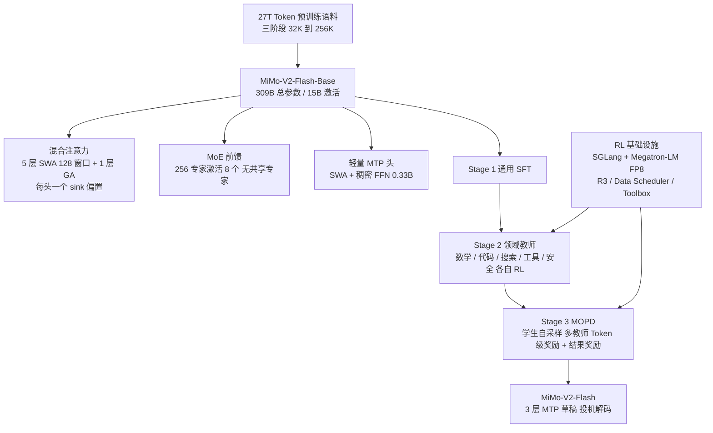
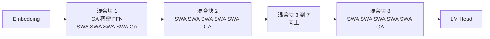
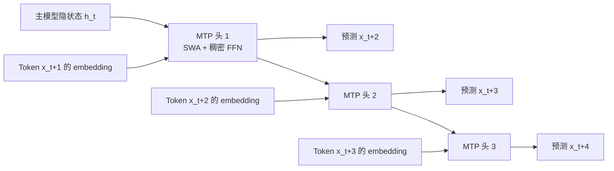
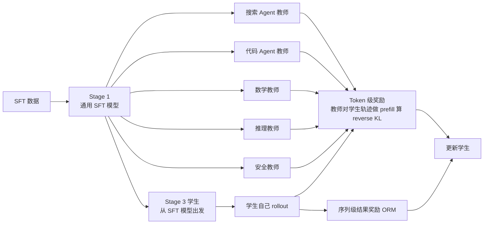
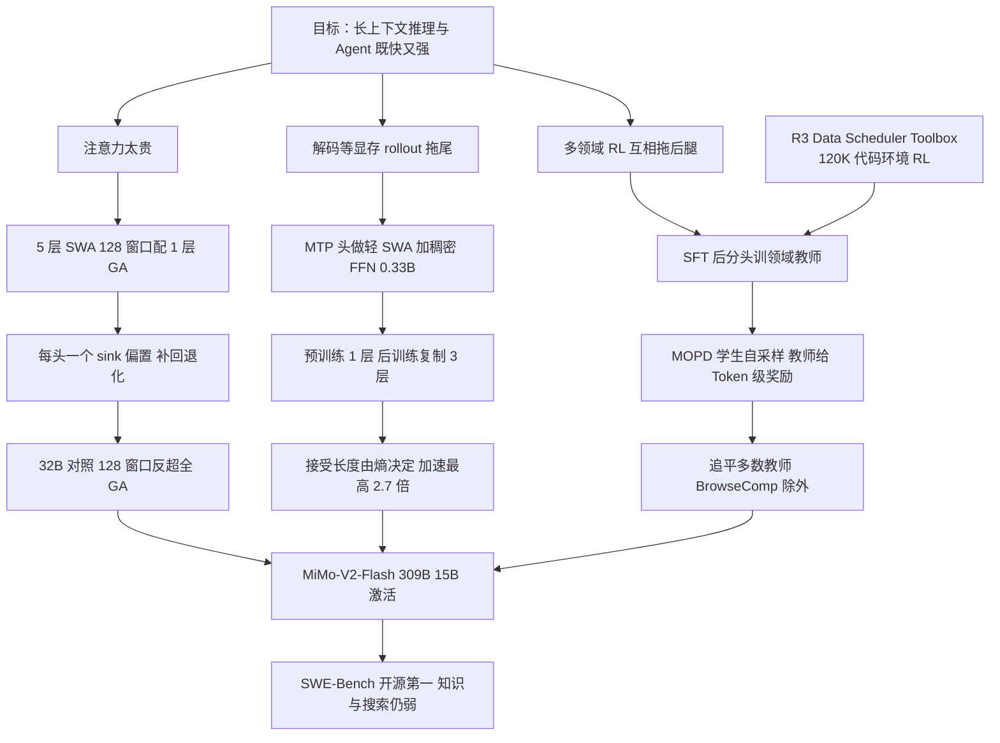

# MiMo-V2-Flash：128 个 Token 的窗口、一个可学习的 sink、三层草稿头，15B 激活参数怎样追上 37B

<!-- release-date: 2025-12-16 -->

> 本文依据小米 LLM-Core 团队发布的 **MiMo-V2-Flash Technical Report**，即 arXiv:2601.02780v2（2026-01-08 修订版），共 31 页（正文 p.1–22，参考文献 p.22–28，贡献者名单 p.29–30，附录 B、C 在 p.31）。截至 2026-09-08 核验，arXiv 上只有 v1（2026-01-06）与 v2（2026-01-08）两个版本，本地原件就是 v2，无需更换。页码均指 PDF 本身的页码。全文把三件事分开标注：**报告明确写了什么**、**我们如何解释或验算它**、**哪些是外部资料补充**。凡标着「我们的验算」「我们的推断」「读图估计」的内容，都不是报告的结论。

## 阅读前先搭一张最小地图

这篇报告的正文只有 22 页，但它把一个 309B 模型从架构、预训练、后训练、RL 系统到推理加速全部走了一遍。先把六个会反复出现的名字讲成人话：

- **Token（词元）**：模型读写文本的最小单位，一个汉字、一个英文词、一个标点都可能是一个或几个 Token。
- **KV Cache（Key-Value Cache，键值缓存）**：生成下一个 Token 时，前面每个 Token 留下的中间结果。上下文越长，这块显存越大。
- **MoE（Mixture-of-Experts，混合专家）**：把前馈网络拆成很多「专家」，每个 Token 只走其中几个。总参数很大，每个 Token 真正用到的很小。
- **SWA 与 GA**：**滑动窗口注意力（Sliding Window Attention，SWA）** 只让当前 Token 看最近的一小段；**全局注意力（Global Attention，GA）** 让它看整段历史。前者便宜，后者能看远。
- **MTP（Multi-Token Prediction，多 Token 预测）**：训练时在主模型之外再挂一个小模块，让它预测「再下一个」Token；推理时这个小模块可以先替主模型打草稿。
- **On-Policy Distillation（在线策略蒸馏）**：学生自己生成一段话，老师逐个 Token 告诉它「这里我会怎么说」，学生按这个差距修正自己。与「拿老师写好的范文来背」的离线蒸馏相对。

报告另外三个自造的名字，读到相应章节再解释：**注意力 sink 偏置**、**MOPD（Multi-Teacher On-Policy Distillation，多教师在线策略蒸馏）**、**R3（Rollout Routing Replay，rollout 路由重放）**。

## 一句话先说清

MiMo-V2-Flash 是一个 309B 总参数、15B 激活参数的 MoE 模型，它想解决的矛盾只有一个：**推理模型和 Agent 都要在很长的上下文里工作，而长上下文既要快、又要强，这两件事通常互相打架。**（PDF p.4）

它的回答分成三步，每一步都是一次「敢不敢压得更狠」的赌注：

1. **注意力层面**：每 5 层滑动窗口注意力配 1 层全局注意力，窗口只有 128 个 Token。这比同类混合架构激进得多，代价靠一个每头一个标量的「注意力 sink 偏置」补回来。（PDF p.4–7）
2. **推理层面**：MTP 模块故意做得很轻（0.33B，用 SWA 和稠密前馈），预训练时只挂一层，后训练时复制成三层，直接当草稿模型做投机解码；三层草稿在低熵任务上平均一次被接受 3.6 个 Token，解码加速最高 2.6 倍。（PDF p.1、9、21–22）
3. **后训练层面**：不再让一个模型在数学、代码、搜索、安全之间跷跷板式地来回训练，而是先训一批领域教师，再让学生在自己的采样轨迹上同时向多个教师学，这套做法叫 MOPD。（PDF p.11–14、18）

报告最值得记住的不是某个数字，而是这句话背后的思路：

> **能力不必来自「每一层都看全部历史」和「一个模型在所有任务上同时被优化」。把看远的责任交给少数层、把打草稿的责任交给小模块、把领域专长的责任交给多个教师，主模型只负责把它们接起来。**

这也是全文最重要的 insight。

## 先看全景：这个模型是怎么连起来的

这张图是根据报告 Figure 2（PDF p.5）与 Figure 3（PDF p.13）合并重画的机制示意，不是任何一张原图的复制。

先把配置放在一起，后面每一节都会回来引用：

| 配置 | 数值 | 页码 |
|---|---:|---|
| 总参数 / 激活参数 | 309B / 15B | PDF p.1、10 |
| Transformer 层数（总 / SWA / GA） | 48 / 39 / 9 | PDF p.6、10 |
| 混合块结构 | 8 个混合块，每块 5 层 SWA 接 1 层 GA；第一层单独用 GA + 稠密 FFN | PDF p.5 |
| 滑动窗口大小 | 128 | PDF p.6 |
| SWA 头数（Q / KV） | 64 / 8 | PDF p.6 |
| GA 头数（Q / KV） | 64 / 4 | PDF p.6 |
| 每头维度（QK / V） | 192 / 128 | PDF p.6 |
| RoPE | 只作用于 Q、K 的前 64 维 | PDF p.6 |
| 隐藏维度 | 4096 | PDF p.10 |
| MoE 专家（总 / 激活） | 256 / 8，无共享专家 | PDF p.5–6、10 |
| 专家中间维度 / 第一层稠密 FFN 中间维度 | 2048 / 16384 | PDF p.10 |
| MTP 块 | SWA（64/8 头，窗口 128）+ 稠密 FFN，0.33B | PDF p.5–6 |
| 预训练 Token 数 | 27T | PDF p.1、9 |
| 上下文 | 原生 32K，第三阶段扩到 256K | PDF p.1、10 |
| 训练精度 | FP8 混合精度 | PDF p.4、6 |

有两个数字值得一开始就看清楚。

第一，48 层里只有 9 层是全局注意力。报告说这带来「接近 6 倍」的长上下文 KV Cache 与注意力计算下降（PDF p.4）。**我们的验算**：如果按层数算，全局层占 9/48，倒数是 5.33 倍；「6 倍」是按 5:1 的比例说的，没有算进第一层那个额外的 GA。两种说法差别不大，但读者应该知道 6 倍是个约数。

第二，激活参数 15B 里到底是什么。**我们的验算**：按 256 个专家、47 个 MoE 层、每个专家三个 4096×2048 的矩阵算，路由专家的参数总量约 302.8B，占 309B 的 98%；每个 Token 激活 8 个专家只用到其中约 9.5B，再加上 48 层注意力约 4.5B 和第一层稠密 FFN 约 0.2B，不含词表就已接近 14.1B，与报告的 15B 一致。这意味着这个模型的「体重」几乎全在专家上，而每个 Token 真正跑过的计算量和一个 15B 稠密模型相当。报告没有给出词表大小，所以我们没法把 embedding 的部分算进去。

## 第一层问题：长上下文为什么同时卡住训练和推理

报告开篇把问题定在一个很具体的地方：推理链和 Agent 工作流都靠大规模 RL 推动，而它们都需要很长的上下文；长上下文建模「必须同时快和强」。（PDF p.4）

拆开看，长上下文在三个地方付钱。

### 花销一：注意力计算随长度平方增长

全局注意力里每个 Token 都要和前面所有 Token 比一次。序列长 $L$，比较次数大约是 $L^2$ 量级。滑动窗口把每个 Token 能看的范围固定在 $W$ 个，比较次数变成 $L \times W$；$W=128$ 时，对 32K 的序列来说就是 256 分之一。

### 花销二：KV Cache 随长度线性增长，而且每个请求都要单独存

生成时，历史 Token 的 Key 和 Value 留在显存里。全局层的缓存随 $L$ 线性长；滑动窗口层只需要留最近 $W$ 个 Token，上下文再长也不涨。

**我们的验算**：按 Table 1 的头数与维度（PDF p.6），一层 GA 每个 Token 要存 $4 \times (192 + 128) = 1280$ 个数，一层 SWA 每个 Token 要存 $8 \times 320 = 2560$ 个数，但只存 128 个 Token。序列到 256K 时，9 层 GA 的缓存约 30.2 亿个数，39 层 SWA 的缓存加起来只有 1278 万个数，占总量的 0.42%。如果 48 层全是 GA，缓存会是现在的 5.3 倍。所以「接近 6 倍」这个数字，在长序列上基本就是 GA 层数之比。

### 花销三：解码是访存瓶颈，RL rollout 又把这个瓶颈放大

自回归解码每生成一个 Token 只做一次前向，算术强度很低，GPU 大部分时间在等显存。通常的办法是把很多请求打成一个 batch 摊薄权重读取，但报告指出：这只对 FFN 有效，**对注意力无效**，因为每个请求有自己的 KV Cache，别的请求帮不上忙。（PDF p.9）

RL 训练把这个问题放大两次：一是 on-policy 训练的 batch 天然小，GPU 利用率更低；二是 rollout 后期总有几条特别长的轨迹拖尾，batch 大小逼近 1，整块 GPU 为一条序列空转。（PDF p.9）

这三笔账决定了报告的三个设计：SWA 混合解决前两笔，MTP 解决第三笔，而 MOPD 解决的是「RL 算力扩上去之后，怎么把多个方向的收益合到一个模型里」。

## 核心设计一：5 层滑动窗口配 1 层全局，窗口只留 128 个 Token

### 旧问题：窗口一小、比例一高，模型就退化

滑动窗口的好处前面已经算过。问题是它有代价：历史一旦滑出窗口，这一层就再也看不到。混合架构的常规做法是让一部分层保留全局注意力，把「看远」的责任交给它们。

报告引用 Gemma 3 的经验说：SWA 用得太激进——窗口太小，或者 SWA 与 GA 的比例太高——会导致明显的性能退化，长上下文任务尤其严重。（PDF p.6）**外部补充**：Gemma 3 技术报告（[arXiv:2503.19786](https://arxiv.org/abs/2503.19786)）自己用的是每 5 层局部配 1 层全局、局部窗口 1024 个 Token。MiMo-V2-Flash 沿用了 5:1 的比例，却把窗口缩到 128，只有 Gemma 3 的八分之一。这是一个明知有风险还往前走了一步的选择。

### 新设计：让每个头有权「谁也不看」

报告把化解风险的功劳记在一个很小的部件上：**可学习的注意力 sink 偏置（learnable attention sink bias）**。它允许模型在需要时给所有 Token 分配「很少或者零」的注意力。（PDF p.6）

先说为什么需要它。普通 softmax 强制一个 Query 对历史的注意力权重之和等于 1。当窗口里的 128 个 Token 对当前位置都没用时，模型仍然必须把 1 分出去，于是噪声被强行混进输出。全局注意力的层因为总能看到序列开头，通常会把这部分「无处可放」的注意力堆到第一个 Token 上，这就是文献里说的 attention sink 现象；滑动窗口层看不到序列开头，连这个「垃圾桶」都没有。

报告的实现沿用 gpt-oss 的做法：每个注意力头有一个标量 $sink \in \mathbb{R}$，加进 softmax 的分母。（PDF p.6）**外部补充**：gpt-oss 模型卡（[arXiv:2508.10925](https://arxiv.org/abs/2508.10925)）的原话是每个头「在 softmax 分母里有一个学到的偏置」，作用是让注意力机制可以「不看任何 Token」；gpt-oss 同样用 128 个 Token 的带状窗口，但它是窗口层与稠密层 1:1 交替，比 MiMo 的 5:1 保守得多。

### 工作机制：三行公式

先算当前 Token $i$ 与历史 Token $j$ 在一个头里的相关分数：

$$
a_{ij} = \frac{q_i k_j^{\top}}{\sqrt{d}}
$$

$q_i$ 是 Token $i$ 的 Query，$k_j$ 是 Token $j$ 的 Key，$d$ 是头维度。（PDF p.6，式 1）

然后把分数变成权重。与普通 softmax 唯一的差别是分母多了一项 $\exp(sink - m_i)$：

$$
s_{ij} = \frac{\exp\left(a_{ij} - m_i\right)}{\exp\left(sink - m_i\right) + \sum_{j'} \exp\left(a_{ij'} - m_i\right)},
\qquad
m_i = \max\left(\max_j a_{ij},\ sink\right)
$$

$m_i$ 是数值稳定用的最大值，它把 $sink$ 也算进比较范围，保证指数不溢出。（PDF p.7，式 2、3）

最后按权重把 Value 加起来：

$$
o_i = \sum_{j=1}^{n} s_{ij} v_j
$$

（PDF p.7，式 4）

关键在于：分子里没有 $sink$ 那一项。也就是说，$sink$ 只出现在分母，它吸走的那份注意力不对应任何 Value，等于被丢掉了。当窗口里所有 $a_{ij}$ 都远小于 $sink$ 时，所有 $s_{ij}$ 都接近 0，输出接近零向量，这一层对残差流几乎不做贡献。模型于是获得了一个「这层我不发言」的选项。

这个机制和 DeepSeek-V4 解读里讲到的 attention sink 是同一形状（那篇文章的式 27 也是在分母加一个可学习项），只是 V4 把它用在压缩后的稀疏注意力上，MiMo 把它用在滑动窗口上。两边的共同点是：**当注意力的候选集合被人为截断时，模型必须有一个「以上都不选」的出口。**

### 模型的层是怎么排的

根据 Figure 2 与 2.1 节重画（PDF p.5），是机制示意。报告的原话是：模型堆叠 8 个混合块，每块 5 层 SWA 接 1 层 GA；「唯一的例外是第一个 Transformer 块，它用全局注意力和稠密 FFN」（PDF p.5）；Table 1 给出总共 48 层、39 层 SWA、9 层 GA（PDF p.6）。**我们的推断**：8 × 6 = 48 正好是全部层数，所以第一层的 GA 不是额外加的一层，而是把第一个混合块里的第一层 SWA 换成了 GA + 稠密 FFN；这样 GA 是 8 + 1 = 9 层，SWA 是 40 − 1 = 39 层，与 Table 1 完全对上。上图的混合块 1 就是按这个推断画的。报告没有解释为什么第一层要用全局注意力，只说是为了「稳定早期表示学习」（PDF p.5）。

两类层的头数也不一样：SWA 层 64 个 Query 头配 8 个 KV 头，GA 层 64 个 Query 头配 4 个 KV 头（PDF p.6）。**我们的解释**：GA 层的 KV 会随上下文线性增长，所以给它更少的 KV 头；SWA 层的 KV 有上限，多给几个头不贵。这是把 GQA 的分组比例按「谁的缓存会长大」来分配，而不是全模型一刀切。

RoPE 只作用于 Q、K 的前 64 维（PDF p.6）。GA 的 RoPE 基频从 32K 阶段的 640,000 调到 256K 阶段的 5,000,000，而 SWA 的基频始终是 10,000，从头到尾没有改过（PDF p.10）。**我们的解释**：滑动窗口层看到的相对距离最多 128，10,000 的基频足够分辨；上下文扩展只需要动看得远的那几层。

### 收益：32B 稠密模型上的四组对照

报告在一个 32B 稠密模型上做了架构对照，Query-Key 维度与 RoPE 配置与正式模型一致。四个变体共享同一条流水线：8192 序列长度预训练 250B Token，再用 40B Token 扩到 32,768，然后做长上下文 SFT 和带思维链的推理 SFT。（PDF p.7）

第一组：通用基准，用的是没做长上下文扩展的 base 模型。（PDF p.7，Table 2）

| 变体 | MMLU | BBH | TriviaQA | GSM8K | MATH | CMMLU | MBPP |
|---|---:|---:|---:|---:|---:|---:|---:|
| 全 GA | 57.3 | 54.7 | 53.2 | 34.2 | 9.5 | 50.3 | 54.7 |
| 混合 SWA，W=128，无 sink | 54.9 | 52.4 | 52.8 | 36.9 | 8.9 | - | - |
| 混合 SWA，W=128，有 sink | 58.3 | 56.1 | 53.7 | 36.9 | 10.3 | 53.3 | 56.3 |
| 混合 SWA，W=512，有 sink | 58.3 | 54.9 | 54.9 | 37.9 | 10.0 | 52.3 | 53.2 |

第二组：长上下文，用长上下文扩展后的 base 模型评 GSM-Infinite、NoLiMa、RULER-32k，用长上下文 SFT 模型评 MRCR。（PDF p.7，Table 3）

| 变体 | GSM-Infinite | NoLiMa | RULER-32k | MRCR |
|---|---:|---:|---:|---:|
| 全 GA | 12.3 | 49.7 | 89.4 | 32.5 |
| 混合 SWA，W=128，有 sink | 17.3 | 51.2 | 89.4 | 34.4 |
| 混合 SWA，W=512，有 sink | 17.2 | 38.5 | 84.7 | 19.6 |

第三组：复杂推理，用推理 SFT 模型评。（PDF p.7，Table 4）

| 变体 | AIME24/25 | LiveCodeBench | GPQA-Diamond | 平均 |
|---|---:|---:|---:|---:|
| 全 GA | 45.5 | 40.0 | 41.7 | 42.4 |
| 混合 SWA，W=128，有 sink | 47.1 | 43.9 | 48.1 | 46.3 |

**外部补充**，帮助读表：GSM-Infinite 是把小学数学题嵌进可以无限加长的噪声上下文里、按推理步数分档的测试；NoLiMa 故意让问题与答案没有字面重合，测模型能不能靠语义联想找到远处的信息；RULER 是一套合成的长上下文检索与聚合任务；MRCR 要求在多轮对话里按顺序找回多根「针」。它们分别对应报告参考文献里的 arXiv:2502.05252、2502.05167、2404.06654、2409.12640，编号已逐一在 arXiv 核实。

报告从三张表里读出三条结论。（PDF p.8）

**第一，sink 不是锦上添花，而是止血带。** 没有 sink 的 128 窗口在通用基准上全面落后于全 GA；加上 sink 之后，不仅追平，还在 MMLU、BBH、MATH、CMMLU、MBPP 上反超。之后所有实验都默认带 sink。

**第二，窗口 128 比 512 好，这一点反直觉。** 两者在通用基准上几乎一样；但做完长上下文扩展和长上下文 SFT 之后，128 窗口超过了全 GA，512 窗口却明显退化——NoLiMa 从 51.2 掉到 38.5，MRCR 从 34.4 掉到 19.6。

**第三，推理任务上混合 SWA 反而更强。** AIME、LiveCodeBench、GPQA 三项全部高于全 GA，平均高 3.9 分。

### 报告自己怎么解释「小窗口反而更好」

报告承认这个结果「可能看起来反直觉」，给出的假设是两点：更好的正则化，以及有效的稀疏性。小窗口迫使 SWA 层只关注局部，这是一种归纳偏置，减轻对虚假模式的过拟合；同时 128 的窗口逼着 SWA 层把长程依赖完全交给 GA 层，形成更清晰的分工。512 的窗口反而模糊了这条分界线，SWA 层会试图自己处理一部分长程依赖，冲淡了局部与全局的分离。（PDF p.8）

报告随后专门加了一段话，强调这些观察「是经验性的，来自我们特定的实验设置，包括模型规模、数据集和训练流程」。（PDF p.8）这句话应该被认真对待：**这是作者的假设，不是被单独验证过的机制。** 报告没有做注意力模式的分析来证实「512 窗口的 SWA 层确实在偷偷处理长程依赖」。

### 与 MiniMax-M2 的结论对着读

同一时期，MiniMax-M2 的报告得出了几乎相反的结论。据本仓库的 MiniMax-M2 解读，M2 团队在 M2 架构规模上继续预训练了几千亿到上万亿 Token，试了不同的 SWA 与全注意力比例、不同 RoPE 设置、层内与层间混合、加 sink token 等变体，结论是：MMLU、MATH 和 32K 的 RULER 完全没差，但 128K 的 RULER 检索与 MTOB 翻译任务上混合 SWA 明显落后，SFT 之后 32K 以上的 Agent 与长上下文任务也显著更差；于是 M2 掉头回了全注意力。

两边的结论不能直接拿来互相否定，因为设置差得很远，要逐项看：

| 维度 | MiMo-V2-Flash 的对照 | MiniMax-M2 的对照（据 M2 解读） |
|---|---|---|
| 规模 | 32B 稠密，250B + 40B Token | M2 架构规模，几千亿到上万亿 Token |
| 窗口 | 128（对照 512） | 未在解读里给出具体窗口 |
| sink | 每头可学习标量，作用在 softmax 分母 | 试过「加 sink token」 |
| 评测长度 | 对照实验最长 32K | 差距出现在 128K |
| 结论 | 128 + sink 在 32K 内超过全 GA | 32K 内无差，128K 检索明显落后 |

把两张表叠起来看，它们其实可以同时为真：**在 32K 以内，两家都没有看到 SWA 混合吃亏；分歧出现在更长的上下文上，而 MiMo 的对照实验根本没有测到那里。** MiMo 正式模型在 128K 以内的 MRCR 得分是 45.7，高于 Kimi-K2-Thinking 的 44.2，但低于 DeepSeek-V3.2-Thinking 的 55.5 和 Gemini 3.0 Pro 的 89.7（PDF p.20，Table 9）。这个成绩说明 5:1 加 128 窗口在 128K 上「能用」，但没有证明它在检索型任务上不付代价。

DeepSeek-V4 走的是第三条路。据本仓库的 DeepSeek-V4 解读，V4 也保留了一段 128 个 Token 的滑动窗口，但只把它当三档记忆里最近的一档，远处的历史靠压缩后的稀疏检索与高度压缩的全局扫描覆盖。三份报告放在一起，可以看出行业在 2025 年底对同一个问题给出了三种答案：M2 回到全注意力，MiMo 把 SWA 压到极限再用 sink 补，V4 把 SWA 降级为配角。谁对，取决于目标上下文长度和任务类型。

### 代价与边界

- **对照规模小。** 32B 稠密、290B Token，与 309B MoE、27T Token 之间差了两个数量级。报告自己说结论依赖设置。
- **没有 256K 的对照。** 正式模型在 NIAH 上到 256K 仍有 96.7% 成功率（PDF p.13，Table 6），但那是大海捞针，不是检索加推理。
- **sink 的理论仍开放。** 报告明确说 attention sink 的精确理论基础「仍是活跃的研究领域」，自己的证据是经验性的。（PDF p.6）
- **第一层为什么用 GA 没有消融。** 报告只给了「稳定早期表示学习」一句话。（PDF p.5）

### 可迁移启发

1. **截断候选集合时，给模型一个「不选」的出口。** 无论是滑动窗口、Top-k 检索还是稀疏路由，只要注意力的候选被人为限制，softmax 归一化就会把噪声硬塞进输出。一个分母里的可学习标量就能解决，成本几乎为零。
2. **分工要靠约束逼出来。** 报告的假设是：窗口小到 SWA 层无法承担长程依赖，分工才清晰。如果这个假设成立，那它也适用于其他「局部模块 + 全局模块」的设计——让局部模块的能力边界明显小于任务需要，全局模块才会真的被训练起来。
3. **按「谁的缓存会长大」分配 KV 头。** GA 层 4 个 KV 头、SWA 层 8 个，是把 GQA 的压缩力度用在最贵的地方。
4. **只扩需要看远的那几层的位置编码。** SWA 层的 RoPE 基频从头到尾不变，长上下文扩展只改 GA 层。

## 核心设计二：把 MTP 做轻，让它当原生草稿模型

### 旧问题：解码在等显存，而 batch 帮不了注意力

前面已经讲过：解码是访存瓶颈，把请求打成大 batch 只能摊薄 FFN 的权重读取，注意力部分每个请求各有各的 KV Cache，摊不了。（PDF p.9）

投机解码（speculative decoding）是另一条路：先用一个便宜的草稿模型连猜几个 Token，再让主模型一次前向把它们全部验证。验证时主模型同时处理多个位置，等于在**一个请求内部**制造了并行度——报告称之为 Token 级并行，它同时提高 FFN 和注意力的算术强度，而且不增加 KV Cache 的读写量。（PDF p.9）

问题是草稿模型从哪来。外挂一个独立小模型要单独训练、单独对齐分布；分布不一致，猜的 Token 就常被拒绝。

### 新设计：训练目标和草稿模型是同一个模块

MTP 本来是一个训练目标：在主模型之外挂一个小模块，用主模型的隐状态预测「再下一个」Token，让训练信号更密。报告引用 Gloeckle 等人、DeepSeek-V3 和 MiMo-7B 的结果说 MTP 能提升训练效率和模型质量，但它把重心明确放在另一件事上：**把 MTP 当作原生的草稿模型，做自投机解码**（self-speculative decoding），拿到真实部署里的加速。（PDF p.9）

据本仓库的 DeepSeek-V3 解读，V3 的 MTP 模块由与主模型共享的 embedding、共享的输出头、一个自己的 Transformer 块和一个投影矩阵组成，深度为 1，推理时可以丢掉也可以留着做投机解码。MiMo-V2-Flash 的差别在于它从一开始就为「留着用」优化：

- **用稠密 FFN，不用 MoE**，限制参数量；
- **用 SWA，不用 GA**，减少 KV Cache 和注意力计算；
- 每个 MTP 块只有 **0.33B** 参数；
- 预训练时只挂 **1 个**头，避免额外开销；后训练时把这个头**复制 $K$ 次**，组成 $K$ 步的 MTP 模块，所有头联合训练做多步预测；
- 每个头的输入是主模型的隐状态加上对应位置的 Token embedding。（PDF p.5、9）

根据 Figure 2 右半部分重画（PDF p.5），是机制示意。图里 embedding 和 LM Head 与主模型共享（原图标注 tied）。推理时三个头依次猜出三个 Token，主模型一次前向验证；接受几个，就往前走几个。

### 收益一：接受长度由「下一个 Token 有多确定」决定

草稿被接受的长度，直接决定加速比。报告用 3 层 MTP 在多个基准上测了平均接受长度，并把它和主模型的下一 Token 交叉熵放在一起看。（PDF p.21，Figure 7）

**读图估计**（Figure 7，PDF p.21）：WebDev 的熵约 0.05，接受长度约 3.6；AIME25、SciCode、LiveCodeBench 的熵在 0.14–0.17，接受长度 3.2–3.3；GPQA 与 MMLU Pro 的熵在 0.23–0.27，接受长度约 2.95–3.0。报告的拟合曲线是：

$$
y = 4\left(1 - 0.58\, x^{0.58}\right), \qquad R^2 = 0.995
$$

$x$ 是下一 Token 的交叉熵，$y$ 是平均接受长度。（PDF p.21）

**我们的解释**：这条曲线里的常数 4 不是随便选的。3 个草稿头最多猜 3 个 Token，加上主模型验证时自己产出的 1 个，一步最多前进 4 个 Token，所以 4 是接受长度的理论上限；熵趋近 0 时曲线趋近 4，熵越大离上限越远。报告没有明说这一点，但它解释了为什么拟合式的形状是「上限减去一个随熵增长的项」。

报告的结论是：下一 Token 交叉熵是 MTP 吞吐的「主要决定因素」；写网页代码这类低熵任务接受长度长，MMLU Pro 这类高不确定性任务接受长度短。（PDF p.21）这对部署很实用：**同一个模型在不同业务上的投机解码收益可以预先从熵估出来。**

### 收益二：加速比随接受长度线性增长

报告在 16K 输入、1K 输出的设置下，按每节点 batch 大小和接受长度测了解码加速。（PDF p.21–22，Table 10）

| 每节点 batch | 无 MTP | 2.8 | 3.0 | 3.2 | 3.4 | 3.6 | 3.8 |
|---:|---:|---:|---:|---:|---:|---:|---:|
| 32 | 1.00× | 1.86× | 1.99× | 2.12× | 2.25× | 2.39× | 2.52× |
| 48 | 1.00× | 1.82× | 1.95× | 2.08× | 2.21× | 2.34× | 2.47× |
| 64 | 1.00× | 1.97× | 2.11× | 2.25× | 2.39× | 2.53× | 2.67× |
| 96 | 1.00× | 1.99× | 2.13× | 2.28× | 2.42× | 2.56× | 2.70× |
| 128 | 1.00× | 1.82× | 1.94× | 2.07× | 2.20× | 2.33× | 2.46× |

列头是接受长度。摘要里的「2.6× 解码加速」对应接受长度 3.6、batch 96 那一格的 2.56×；表里最高的一格是 batch 96、接受长度 3.8 的 2.70×。（PDF p.1、22）

**我们的验算**：每一行的加速比几乎精确等于接受长度乘一个常数——batch 32 约 0.66，batch 64 约 0.70，batch 96 约 0.71，batch 128 约 0.65。这个常数可以理解为「验证一步的成本相对于普通解码一步的成本」的倒数：接受长度 3.6 意味着一步前进 3.6 个 Token，但这一步要多跑三个草稿头和一次多位置验证，所以实际只拿到 2.5 倍左右。batch 96 的常数最高，batch 128 反而下降，报告把这归因于不同 batch 下计算与 I/O 需求以及 kernel 效率的变化，并建议按硬件 roofline 同时调 batch 和 MTP 层数。（PDF p.22）

### 收益三：RL rollout 的两个具体痛点

报告认为 MTP 对 RL 训练「特别合适」，理由是两点。（PDF p.9）

第一，**让小 batch 的 on-policy RL 变得可行**。当前 RL 训练普遍靠大 batch、off-policy 算法拉吞吐；on-policy 更稳、更有效，但小 batch 用不满 GPU。MTP 用 Token 级并行替代 batch 级并行，等于在不增加 batch 的前提下提高利用率。

第二，**缓解长尾拖尾**。rollout 后期剩下的几条长序列 batch 逼近 1，这时 MTP 同时提高注意力和 FFN 的效率，直接缩短总延迟。

要注意的是，这一节是动机论证，**报告没有给出 MTP 在 RL rollout 上的实测加速数字**；Table 10 测的是 16K 输入 1K 输出的通用解码场景。

### 代价与边界

- 后训练阶段三个头联合训练，训练成本增加；报告没有量化这部分开销。
- 三个头每步都要跑，被拒绝的草稿是白算的；高熵任务上接受长度接近 3，收益明显缩水。
- 加速比对 batch 敏感，batch 128 的收益低于 batch 96；不是「开了就快」，要按硬件调。
- MTP 对训练质量的贡献没有单独消融；报告引用的是前人结论。

### 可迁移启发

1. **训练目标和推理加速器可以是同一个模块。** 与其外挂一个分布不一致的小模型，不如让主模型训练时顺手训一个「同源」的草稿头。
2. **草稿头要按推理成本设计，不按训练收益设计。** 用 SWA、稠密 FFN、0.33B，就是为了让它在推理时几乎不占 KV 和计算。
3. **先用熵预估收益，再决定开不开。** 拟合曲线让你不用跑完整 benchmark 就能估计某类业务的接受长度。

## 沿用的骨架：MoE 与混合精度

MiMo-V2-Flash 的 MoE 层没有做新机制，值得记的是几个与 DeepSeek-V3 不同的选择。

### 256 个路由专家，激活 8 个，没有共享专家

每个 MoE 层 256 个专家、每 Token 激活 8 个，专家中间维度 2048，**不设共享专家**。（PDF p.5–6、10）据本仓库的 DeepSeek-V3 解读，V3 是 1 个共享专家加 256 个路由专家、激活 8 个路由专家。MiMo 去掉了共享专家，报告没有说明理由，也没有给消融。

负载均衡沿用了 V3 那套「无辅助损失」的思路：给专家加一个只影响路由排序的偏置，按负载增减，报告叫它 expert bias update factor，预训练前两阶段设为 0.001，第三阶段降到 $1.0 \times 10^{-5}$；另外保留一个很小的序列级辅助损失，系数 $1.0 \times 10^{-5}$。（PDF p.10）SFT 阶段这两个数分别是 $1.0 \times 10^{-4}$ 和 $1.0 \times 10^{-6}$。（PDF p.15）报告没有解释为什么各阶段取值不同，但后面 SFT 一节会讲到，它们是 MoE 训练稳定性的关键旋钮。

### FP8 训练，但四处保留高精度

报告采用与 DeepSeek-V3 类似的 FP8 混合精度框架，并明确列出保留高精度的地方：注意力输出投影、embedding、输出头用 BF16；MoE 路由参数用 FP32。报告称这个配置在不明显影响训练效率和显存的前提下提高了数值稳定性。（PDF p.6）

**我们的解释**：路由参数用 FP32 是很有针对性的选择。路由决定每个 Token 去哪 8 个专家，一点数值抖动就可能改变 Top-8 的边界，而这种改变在后面讲 R3 时会看到，正是 MoE 做 RL 时训练与推理不一致的根源。

### 初始化与优化器

所有可学习参数用标准差 0.006 随机初始化；AdamW，$\beta_1 = 0.9$，$\beta_2 = 0.95$，权重衰减 0.1，梯度裁剪最大范数 1.0。（PDF p.10）这些与 DeepSeek-V3 的取值相同，报告没有多说。

## 预训练：27T Token 分三段喂

### 数据：明确向「长程依赖」倾斜

语料 27T Token，来源包括公开网页、书籍、学术论文、代码、数学和更广的 STEM 材料。处理流程沿用 MiMo-7B，但报告说做了一个「有意的转向」：更看重带长程依赖的数据——长篇网页文档，以及仓库级代码、pull request、issue 和 commit 历史这类精心整理的代码语料，目的是让模型学会跨很远的上下文建立联系、做多步推理。（PDF p.9–10）

这个转向与架构是配套的。5:1 的 SWA 混合把「看远」的能力压缩到 9 层里，如果训练数据里没有足够多真正需要看远的样本，这 9 层学不到东西。报告没有明说这层因果，这是我们的解读。

报告没有公开各来源的占比、过滤器、去重规则或污染检查方法。

### 三个阶段

| 阶段 | Token 区间 | 上下文 | 数据变化 |
|---|---|---:|---|
| Stage 1 预训练 | 0–22T | 32K | 多样化通用语料，建立基础语言能力 |
| Stage 2 中期训练 | 22–26T | 32K | 上采样代码类数据，加入约 5% 合成推理数据 |
| Stage 3 上下文扩展 | 26–27T | 256K | 沿用 Stage 2 的分布，上采样长程依赖数据 |

（PDF p.10）

Stage 2 的「约 5% 合成推理数据」是报告里唯一提到的合成数据比例；来源模型、生成方式、过滤标准都没有写。

### 学习率、batch 与阶段衔接

学习率分两段（PDF p.10）：

- Stage 1：前 50B Token 从 0 线性 warmup 到 $3.2 \times 10^{-4}$，然后恒定 12T Token，最后用 10T Token cosine 衰减到 $1.0 \times 10^{-4}$；
- Stage 2：从 $1.0 \times 10^{-4}$ 开始，4T Token 内 cosine 衰减到 $3.0 \times 10^{-5}$；
- Stage 3：从 $3.0 \times 10^{-5}$ cosine 衰减到 $1.0 \times 10^{-5}$。

**我们的验算**：$0.05 + 12 + 10 = 22.05$T，与 Stage 1 的 0–22T 对上；Stage 2 的 4T 与 22–26T 对上。三段的学习率首尾相接，没有跳变。

batch 大小在前 500B Token 内线性 warmup 到 2,048，之后前两阶段保持不变；Stage 3 的 batch 固定为 256。（PDF p.10）**我们的验算**：Stage 1 的 2,048 条序列乘 32,768 的长度是每步约 6710 万 Token；Stage 3 的 256 条乘 262,144 也是约 6710 万 Token。也就是说，序列长度扩大 8 倍时，batch 条数缩小 8 倍，**每步吃进的 Token 数不变**。报告没有说明这是刻意为之，但两个数字精确相等，很难是巧合。

其他随阶段变化的量（PDF p.10）：

- MTP 损失权重：Stage 1 为 0.3，Stage 2 和 3 为 0.1；
- expert bias 更新因子：Stage 1 和 2 为 0.001，Stage 3 降到 $1.0 \times 10^{-5}$；
- MoE 序列辅助损失系数：全程 $1.0 \times 10^{-5}$。

据本仓库的 DeepSeek-V3 解读，V3 的 MTP 权重同样是前段 0.3、末段 0.1。两家在这个数字上的一致，说明「训练后期削弱辅助目标」已经是通行做法。

### 上下文扩展只动全局层

Stage 1 序列长度 32,768，RoPE 基频 GA 层 640,000、SWA 层 10,000；Stage 3 序列长度 262,144，GA 层基频调到 5,000,000，SWA 层不变。（PDF p.10）

前面已经说过，这是混合架构的一个隐性红利：位置编码的外推问题只存在于 9 层 GA 里，39 层 SWA 从头到尾看的都是 128 以内的相对距离。

### Base 模型评测：推理强、知识弱

报告把 MiMo-V2-Flash-Base 与 Kimi-K2-Base、DeepSeek-V3.1-Base、DeepSeek-V3.2-Exp-Base 放在同一张表里比。四个模型的激活参数分别是 15B、32B、37B、37B，总参数 309B、1043B、671B、671B。（PDF p.12，Table 5）

挑几组能说明方向的数字：

| 基准 | shots | MiMo-V2-Flash-Base | Kimi-K2-Base | DeepSeek-V3.1-Base | DeepSeek-V3.2-Exp-Base |
|---|---|---:|---:|---:|---:|
| MMLU-Pro | 5 | 73.2 | 69.2 | 58.8 | 62.1 |
| GPQA-Diamond | 5 | 55.1 | 48.1 | 51.0 | 52.0 |
| AIME 24&25 | 2 | 35.3 | 31.6 | 21.6 | 24.8 |
| MATH | 4 | 71.0 | 70.2 | 62.6 | 62.5 |
| BigCodeBench | 0 | 70.1 | 61.7 | 63.0 | 62.9 |
| LiveCodeBench v6 | 1 | 30.8 | 26.3 | 24.8 | 24.9 |
| SWE-Bench（Agentless Repair） | 3 | 30.8 | 28.2 | 24.8 | 9.4 |
| SimpleQA | 5 | 20.6 | 35.3 | 26.3 | 27.0 |
| C-SimpleQA | 5 | 61.5 | 77.6 | 70.9 | 68.0 |
| TriviaQA | 5 | 80.3 | 85.1 | 83.5 | 83.9 |
| HellaSwag | 10 | 88.5 | 94.6 | 89.2 | 89.4 |
| GlobalMMLU | 5 | 76.6 | 80.7 | 81.9 | 82.0 |

（PDF p.12，Table 5；DeepSeek-V3.2-Exp-Base 的 SWE-Bench 那一格报告标了星号，表示该模型没有遵循 few-shot 示例的格式）

报告自己的总结很克制：多数基准上有竞争力，推理类（MMLU-Pro、GPQA-Diamond、AIME）稳定领先；SWE-Bench 上用不到 Kimi-K2 三分之一的参数超过了它；但受参数量限制，知识容量比大模型低，SimpleQA 上看得很清楚。（PDF p.11）

**我们的解释**：这张表的形状与「98% 的参数在专家里、每 Token 只激活 15B」是一致的。需要把知识存下来的任务（SimpleQA、C-SimpleQA、TriviaQA、多语言）看的是总容量和实际被激活的容量，MiMo 在这里落后；需要推理的任务看的是训练数据和目标，MiMo 靠代码与推理数据的倾斜拿到优势。

### 长上下文评测：大海捞针几乎满分，带噪推理退化最慢

（PDF p.13，Table 6）

| 基准 | 长度 | MiMo-V2-Flash-Base | Kimi-K2-Base | DeepSeek-V3.1-Base | DeepSeek-V3.2-Exp-Base |
|---|---:|---:|---:|---:|---:|
| NIAH-Multi | 32K | 99.3 | 99.8 | 99.7 | 85.6 |
| | 64K | 99.9 | 100.0 | 98.6 | 85.9 |
| | 128K | 98.6 | 99.5 | 97.2 | 94.3 |
| | 256K | 96.7 | - | - | - |
| GSM-Infinite Hard | 16K | 37.7 | 34.6 | 41.5 | 50.4 |
| | 32K | 33.7 | 26.1 | 38.8 | 45.2 |
| | 64K | 31.5 | 16.0 | 34.7 | 32.6 |
| | 128K | 29.0 | 8.8 | 28.7 | 25.7 |

报告注明：DeepSeek-V3.2-Exp-Base 的 NIAH 结果带星号，表示模型可能没有遵循提示；所有基线模型的最大长度都短于 256K，所以 256K 一列只有 MiMo 有数。（PDF p.13）

报告从 GSM-Infinite 读出的判断是：MiMo 从 16K 到 128K 只掉了 8.7 分，退化最小；DeepSeek-V3.2-Exp 在 32K 以内最高，但 64K、128K 大幅退化，报告认为这「暗示稀疏注意力在噪声输入下做长上下文推理有内在劣势」。（PDF p.11）

这个判断值得保留一点距离。V3.2-Exp 在 16K 比 MiMo 高 12.7 分，128K 时低 3.3 分——「退化更快」是事实，「稀疏注意力有内在劣势」是作者的推断，报告没有做进一步的分析。另外 Kimi-K2-Base 作为全注意力模型退化得最厉害（34.6 到 8.8），说明这里的差异未必只由注意力机制决定。

## 核心设计三：MOPD，把后训练拆成「先分头练、再合回来」

### 旧问题：跷跷板与信号浪费

报告指出当前后训练流水线有两个根本困难。一是**能力失衡**：提升一种技能常常让另一种退步，报告称之为「跷跷板效应」（see-saw effect）。二是**学习低效**：想把多个专门模型的知识合到一起时，现有方法没有充分利用训练信号。（PDF p.11）

传统的合并办法有两种，报告都不满意：把多个模型的参数做加权平均，或者让专家模型生成一批静态数据再做离线蒸馏。前者在能力之间做取舍，后者让学生只在老师的分布上学习，见不到自己会犯的错。（PDF p.13–14）

### 新设计：三个阶段

根据 Figure 3 重画（PDF p.13），是机制示意；教师的种类按报告 Stage 2 的列举画出，不代表教师的确切数量。

- **Stage 1 SFT**：在高质量指令—回复对上做监督学习，建立基本的指令跟随能力。
- **Stage 2 领域专门训练**：从 SFT 模型出发，对每个领域**独立**做 RL，训出一批领域教师。领域分两类：Agent 类（搜索、编码、通用工具使用）和非 Agent 类（数学推理、通用推理、安全对齐）。每个教师只在自己的领域用领域专用的奖励优化。
- **Stage 3 MOPD**：不合并参数、不生成离线数据，而是把多教师知识整合表述成一个 on-policy 的 RL 过程：学生从自己不断变化的分布里采样，教师通过 KL 散度奖励给出 Token 级监督。（PDF p.13–14）

Figure 3 里有一个细节值得注意：Stage 2 的教师训练和 Stage 3 的学生都从**同一个 SFT 模型**出发，图上用 Replace 标出教师训好后「替换」进第三阶段。也就是说，学生和教师是同一个起点的不同分支，而不是一个大模型教一个小模型。（PDF p.13，Figure 3）

### Stage 1：SFT 里最实用的一段——盯着「零梯度参数」的数量

SFT 数据是「数百万」条样本，覆盖通用对话、推理、代码和 Agent 任务，同时包含思考模式和非思考模式，回复由内部的领域专用 checkpoint 生成。（PDF p.15）

报告在这里给了一个很少见的工程发现。他们找到一个 MoE SFT 的稳定性指标：**梯度为零的参数数量**（num-zeros）。它的变化方向能提前预警两种事故：

- num-zeros **上升**，说明专家之间的负载均衡在恶化——越来越多专家收不到 Token，参数收不到梯度；
- num-zeros **下降**，说明模型在明显过拟合训练数据。

报告认为全程保持 num-zeros 稳定是 SFT 成功的关键，也是后续 RL 稳健收敛的前提。实验发现它主要取决于两个超参：expert bias 的更新率，以及 AdamW 的 $\epsilon$。最终配置是：学习率 cosine 从 $5.0 \times 10^{-5}$ 衰减到 $5.0 \times 10^{-6}$，batch 128，AdamW $\epsilon = 1.0 \times 10^{-8}$，expert bias 更新率 $1.0 \times 10^{-4}$，序列辅助损失系数 $1.0 \times 10^{-6}$。（PDF p.15）

**我们的解释**：为什么 $\epsilon$ 会影响这个指标？AdamW 的更新量是梯度动量除以（二阶动量的平方根加 $\epsilon$）。对于长期收不到 Token 的专家，二阶动量趋近 0，$\epsilon$ 就成了分母的主导项，决定了这些参数在偶尔收到梯度时会被推多远。$\epsilon$ 太小，稀有专家的参数会被少数梯度猛推；太大，则所有更新被压平。报告没有展开这层机制，只报告了经验依赖关系。

### Stage 2 之一：非 Agent 的 RL

单轮任务，模型一次生成完整回复。目标是提升可验证领域（数学、代码、逻辑）的推理准确率，同时把开放对话对齐到有用与安全。奖励分两路：可验证领域用「程序化工具 + LLM 裁判」的混合验证系统，对照整理好的题—解对判对错；主观质量（有用性、安全）用基于 rubric 的框架，由一个高级 LLM 裁判对照详细 rubric 和参考答案打分，给出细粒度奖励。（PDF p.15）

报告没有公开非 Agent RL 的算法细节、数据量、奖励权重或超参数。

### Stage 2 之二：Agent 的 RL，沿两个维度扩

报告说 Agent RL 沿两个维度扩：**环境多样性**和**算力**。（PDF p.15）

环境的数据构成是（PDF p.16，Table 8）：

| Agent 类型 | 任务数 | 环境 | 提示来源 |
|---|---:|---|---|
| 代码 Agent | 90K | 真实 | 真实 |
| 代码 Agent | 30K | 真实 | 合成 |
| 搜索 Agent | 150K | 真实 | 合成 |
| 通用 Agent | 50K | 合成 | 合成 |

四类环境各自怎么建，报告给了不少可操作的细节。（PDF p.16–17）

**代码 Agent**。任务来自真实 GitHub issue；模型在一个循环里读文件、改文件、执行命令，奖励来自可验证的单元测试。报告的「关键洞察」是：持续扩大可用任务的数量，就能持续提升代码智能。为了在超过 10 万个代码任务上高效做 RL，他们建了两个基础设施：一是自动化环境搭建流水线，从仓库快照生成开发环境并打包成容器镜像，在 8 种编程语言上达到 70% 的搭建成功率，由一个运行超过 10,000 个并发 pod 的 Kubernetes 集群支撑；二是一个轻量 Agent 脚手架，只暴露三个原子工具——`bash`、`str_replace`、`finish`——全部通过 shell 命令与执行后端交互，system prompt 极简、不预设工作流，让模型在训练中自己发现最佳实践。

**终端 Agent**。任务来自 Stack Overflow 和 Stack Exchange，挑需要高级技术知识的材料，改写成带查询、Dockerfile 和测试用例的计算任务；验证环境可安装、按难度和可靠性过滤后，得到约 30,000 条带验证环境的任务；再按通过率过滤掉判定不可靠或太简单的。

**网页开发 Agent**。收集高质量的用户手写网页，用 Playwright 执行生成的代码并录成视频，用多模态视觉判别器只保留高质量样本——报告说基于视频的评估比静态截图更少视觉幻觉。再从这些网页逆向出用户查询作为种子，合成覆盖 8 类网页的大规模 RL 数据。奖励由视觉验证器对录制视频打分，同时看视觉质量、功能正确性和可执行性。

**通用 Agent**。分两种：搜索 Agent 用 `search`、`open`、`find` 三个工具做自主网页探索，问题通过从种子实体递归扩展事实图来构造，难度随关系链深度和细节混淆程度增长，答案可验证；函数调用 Agent 在合成的应用环境里训练，工具调用图按显式数据依赖（直接的输入输出关系）和隐式逻辑依赖（对隐藏系统状态的推理）生成，同时要求数据传递和状态推断两种能力。

### 算力扩上去之后：SWE-Bench 涨了，别的也跟着涨

代码 Agent 的 RL 在约 120K 个环境上做 on-policy rollout 和更新。（PDF p.17）

**读图估计**（Figure 4，PDF p.17）：SWE-Bench Verified 的解决率从训练初期的约 62–66% 升到 120K 环境时的约 74%；SWE-Bench Multilingual 从约 52–56% 升到约 71–74%。两条曲线都有明显波动，但趋势向上，直到 120K 仍未明显饱和。

报告接着展示了一个更有意思的现象：只做代码 Agent 的 RL，其他任务也涨。**读图估计**（Figure 5，PDF p.17）：Tau-2 Bench 从约 71% 升到 75–76%，AIME 2025 从约 80.7% 升到 82.5–83.4%，GPQA-Diamond 从约 75% 升到约 77%，LiveCodeBench 从约 72.5% 升到约 73.4%，HMMT Feb. 2025 从约 63.5% 升到约 68%，Arena-Hard（Hard Prompt）从约 49% 升到 52–54% 但波动很大。报告的结论是：大规模代码 Agent RL 能有效泛化到其他 Agent 任务和数学、代码、通用推理基准，「暗示 Agent 训练培养的是可广泛迁移的解题能力」。（PDF p.17）

这个结论应该带着边界读：Figure 5 各图的纵轴跨度只有 3–8 分，Arena-Hard 一图的抖动幅度接近它的总涨幅；报告没有给置信区间，也没有说明每个点是几次评测的平均。趋势方向是清楚的，幅度不宜过度解读。

### Stage 3 的工作机制：把蒸馏写成一个 RL 目标

报告的做法是把多教师蒸馏「转写」成一个 on-policy 的强化学习目标。先定义三个策略（PDF p.18）：

- $\pi_\theta$：训练引擎里被优化的学生策略；
- $\mu_\theta$：推理引擎里实际用来采样的学生策略。两者理论上是同一个模型，但训练框架和推理框架的数值实现不同，所以分开记；
- $\pi_{\text{domain}_x}$：负责提示 $x$ 所属领域的那个教师。

$\operatorname{sg}[\cdot]$ 是停梯度算子，表示括号里的量只当常数用，不参与求导。

**第一步，反向 KL 损失。** 学生自己采出 Token $y_t$ 后，看教师和自己在这个位置上给这个 Token 的概率之比：

$$
\mathcal{L}_{\text{reverse-KL}}(\theta)
= -\,\mathbb{E}_{x \sim \mathcal{D},\ y_t \sim \pi_\theta(\cdot \mid x, y_{<t})}
\log \frac{\pi_{\text{domain}_x}(y_t \mid x, y_{<t})}{\pi_\theta(y_t \mid x, y_{<t})}
$$

（PDF p.18，式 5）

这就是反向 KL 散度 $D_{\mathrm{KL}}(\pi_\theta \,\|\, \pi_{\text{domain}_x})$ 的采样估计。「反向」的意思是期望按学生的分布取：学生走到哪里，就在哪里问教师「这一步你会给多大概率」。教师概率比学生高，对数比是正数，这个 Token 被鼓励；教师概率比学生低，被抑制。

它的梯度形状和策略梯度完全一样（PDF p.18，式 6）：

$$
\nabla_\theta \mathcal{L}_{\text{reverse-KL}}(\theta)
= -\,\mathbb{E}\left[
\log \frac{\pi_{\text{domain}_x}(y_t \mid x, y_{<t})}{\pi_\theta(y_t \mid x, y_{<t})}
\ \nabla_\theta \log \pi_\theta(y_t \mid x, y_{<t})
\right]
$$

方括号里前一项就是一个 Token 级的「优势」，后一项是普通的策略梯度。也就是说，**只要把教师与学生的对数概率比当作每个 Token 的奖励，蒸馏就是一个 RL 问题**，可以直接塞进现成的 RL 训练框架。

**第二步，处理训练与推理的不一致。** 学生的采样是在推理引擎（$\mu_\theta$）里做的，更新是在训练引擎（$\pi_\theta$）里做的，两边的概率不完全相等。报告沿用 Zhao 等人的做法（即 IcePop），对每个 Token 做训练—推理重要性采样，比值超出范围的 Token 直接丢掉。最终的替代损失是（PDF p.18，式 7、8）：

$$
\mathcal{L}_{\text{MOPD}}(\theta)
= -\,\mathbb{E}_{x \sim \mathcal{D},\ y \sim \mu_\theta(\cdot \mid x)}
\left[
\frac{1}{|y|} \sum_{t=1}^{|y|} w_t\, \hat{A}_{\text{MOPD},t}\, \log \pi_\theta(y_t \mid x, y_{<t})
\right]
$$

其中

$$
w_t(\theta) =
\begin{cases}
\operatorname{sg}\left[\dfrac{\pi_\theta(y_t \mid x, y_{<t})}{\mu_\theta(y_t \mid x, y_{<t})}\right], &
\epsilon_{\text{low}} \le \dfrac{\pi_\theta(y_t \mid x, y_{<t})}{\mu_\theta(y_t \mid x, y_{<t})} \le \epsilon_{\text{high}} \\[10pt]
0, & \text{其他}
\end{cases}
\qquad
\hat{A}_{\text{MOPD},t} = \operatorname{sg}\left[\log \frac{\pi_{\text{domain}_x}(y_t \mid x, y_{<t})}{\pi_\theta(y_t \mid x, y_{<t})}\right]
$$

三个符号各管一件事：$w_t$ 是训练引擎与推理引擎的概率比，用来纠正采样分布，比值落在 $[\epsilon_{\text{low}}, \epsilon_{\text{high}}]$ 之外的 Token 权重归零；$\hat{A}_{\text{MOPD},t}$ 是教师给的 Token 级优势；两者都加了停梯度，只有最后的 $\log \pi_\theta$ 参与求导。$\frac{1}{|y|}$ 是按序列长度归一化。报告没有给出 $\epsilon_{\text{low}}$ 和 $\epsilon_{\text{high}}$ 的取值。

**第三步，和结果奖励相加。** 默认情况下，MOPD 的优势会和别的优势——比如结果奖励模型（Outcome Reward Model，ORM）经 GRPO 算出的优势——组合在一起（PDF p.18，式 9）：

$$
\hat{A}_{\text{MOPD},t}
= \operatorname{sg}\left[\log \frac{\pi_{\text{domain}_x}(y_t \mid x, y_{<t})}{\pi_\theta(y_t \mid x, y_{<t})}\right]
+ \alpha\, \hat{A}_{\text{ORM}}
$$

$\hat{A}_{\text{ORM}}$ 是整条序列层面的结果优势，$\alpha$ 是权重，报告没有给出取值。

把三步合起来看，MOPD 里每个 Token 收到两种信号：一种是教师逐 Token 给的「这里该怎么说」，密而稳；一种是整条答案对不对的结果奖励，稀疏但直接对准目标。Figure 3 里把前者标为 Token-level Reward，后者标为 Seq-level Reward。（PDF p.13）

### 与 DeepSeek-V4 的 OPD 有一个关键差别

据本仓库的 DeepSeek-V4 解读，V4 的在线策略蒸馏计算的是**全词表**的反向 KL：每个位置都拿教师对整个词表的分布和学生对整个词表的分布比，而不是只看实际采到的那个 Token。MiMo 的式 5 到式 9 用的是**单 Token 估计**：只在采到的 $y_t$ 上算对数概率比。

两种做法各有取舍。全词表版本方差小、信息多，但要教师和学生在每个位置都输出完整 logits，存储和计算贵；单 Token 版本便宜得多，可以直接复用现有 RL 框架的 Token 级优势接口，代价是估计方差更大。MiMo 报告没有讨论这个选择，也没有和全词表版本做对照。

### 收益：学生追平甚至超过最强教师

（PDF p.14，Table 7）

| 基准 | 学生 MOPD 前 | 最强教师 | 学生 MOPD 后 | 学生 − 教师 |
|---|---:|---:|---:|---:|
| AIME 2025 | 89.3 | 93.9（RL） | 94.1 | +0.2 |
| HMMT Feb. 2025 | 76.9 | 82.6（RL） | 84.4 | +1.8 |
| LiveCodeBench | 77.5 | 82.6（RL） | 83.2 | +0.6 |
| MMLU-Pro | 84.7 | 84.7（自身） | 84.9 | +0.2 |
| GPQA-Diamond | 84.9 | 84.9（自身） | 84.3 | −0.6 |
| HLE（无工具） | 21.2 | 21.2（自身） | 22.1 | +0.9 |
| Arena-Hard（Hard Prompt） | 50.0 | 50.0（自身） | 54.1 | +4.1 |
| Arena-Hard（Creative Writing） | 90.1 | 90.1（自身） | 86.2 | −3.9 |
| SWE-Bench Verified | 67.8 | 74.2（RL） | 73.4 | −0.8 |
| Tau2-Bench | 75.9 | 79.6（RL） | 80.3 | +0.7 |
| Tau2-Bench（Telecom） | 92.7 | 95.0（RL） | 95.3 | +0.3 |
| BrowseComp | 42.5 | 51.7（SFT） | 45.4 | −6.3 |

括号里是最强教师的类型：RL 训出的领域教师、SFT 模型，或者学生自己。

这张表要分三块读。

**第一块，有 RL 教师的领域**：AIME、HMMT、LiveCodeBench、Tau2-Bench 四项，学生都追平或略超教师；SWE-Bench Verified 差 0.8 分。这是 MOPD 的核心主张——在一个模型里同时拿到多个 RL 教师的峰值——被数据支持的部分。

**第二块，教师就是学生自己的领域**：MMLU-Pro、GPQA、HLE、Arena-Hard 四项没有专门的教师，Table 7 把「最强教师」标成 Self。这里的变化说明的是**别的领域的蒸馏对这些能力的副作用**：Hard Prompt 涨了 4.1，Creative Writing 掉了 3.9，其余基本持平。跷跷板效应没有完全消失，只是被压小了。

**第三块，BrowseComp**：最强教师是一个 SFT 模型（51.7），学生 MOPD 后只有 45.4，差 6.3 分，是表里最大的缺口。报告没有解释为什么这一项没追上。**我们的推断**：BrowseComp 是多轮搜索 Agent 任务，轨迹很长；Token 级的对数概率比在长轨迹上会被稀释，而且教师是 SFT 而不是 RL 模型，它的分布可能与学生的 on-policy 轨迹差得更远。这只是猜测，报告没有给证据。

### 三条线的对照：MOPD 比纯 ORM 快得多

**读图估计**（Figure 6，PDF p.19）：AIME 2025 上，教师线在 94 左右；只用 ORM 的 RL 从 86 出发，48 步后仍在 86 上下徘徊；MOPD 从 86 出发，20 步到 92，30 步后在 93–94 之间贴着教师线；不带 ORM 的 MOPD 走势相近，略低。LiveCodeBench 上，教师线约 82.6；ORM 从 71 出发，48 步后在 73–75；MOPD 在 44 步左右达到 84，**超过了教师线**；不带 ORM 的 MOPD 在 79–82 之间。

报告的结论是：MOPD 在数学和代码上都保住并合并了多个教师的专长，在大多数领域达到或超过最强教师。（PDF p.18）**我们的解释**：Figure 6 还说明了另一件事——加上 ORM 之后曲线比纯蒸馏更高、更稳，说明结果奖励和 Token 级教师信号是互补的，不是二选一。

### 报告主张的三条优势，哪些有数据

报告列了三条优势。（PDF p.14）

1. **有效且高效**：MOPD 保住最强教师在各领域的峰值；密集的 Token 级奖励让信用分配稳定、收敛快；学生在自己的分布上学，避免离线方法的 exposure bias 和分布不匹配。——前两点有 Table 7 和 Figure 6 支持；第三点是原理论证，报告没有和离线蒸馏做对照。
2. **模块化、可扩展**：教师可以是 RL 模型、另一个 SFT 模型，甚至学生自己；加新教师不用重构流水线；与现有 ORM 无缝配合，对 Agent 任务尤其方便。——Table 7 里三种教师类型都出现了，算是佐证。
3. **迭代共同进化**：蒸馏出的学生可以回到 Stage 2 变成更强的教师，形成自我强化的循环。——报告在结论里说这是**未来工作**，计划扩大算力来做；本报告里没有跑过第二轮。（PDF p.22）

### 代价与边界

- 教师的数量、每个教师的训练细节、提示如何被分派到「所属领域」的教师，报告都没写。
- $\alpha$、$\epsilon_{\text{low}}$、$\epsilon_{\text{high}}$、训练步数、batch 大小没有公开。Figure 6 的横轴只到 48 步，看不出更长训练会不会过拟合教师。
- 每步都要教师对学生轨迹做 prefill，教师越多、轨迹越长，这部分算力越贵；报告没有给 MOPD 的算力开销。
- Creative Writing 和 BrowseComp 的下降说明「无取舍」是相对的说法。
- 教师全部从同一个 SFT 模型分出来，与「用一个更大的外部模型当教师」是不同的设置，结论不能直接推广到那种情况。

### 可迁移启发

1. **蒸馏可以直接写成 RL 的优势项。** 教师与学生的对数概率比就是一个 Token 级奖励，塞进现有的策略梯度框架即可，不需要新的训练循环。
2. **先分头 RL，再合并，比一锅炖更容易调。** 每个领域的奖励、数据、超参独立调，合并阶段只处理「怎么把分布拉过来」一件事。
3. **Token 级信号和序列级信号叠加用。** 前者密而稳，后者对准最终目标；Figure 6 显示两者相加比任一单独用都好。
4. **用「零梯度参数数」这样便宜的指标做 MoE 训练的早期预警。** 它不需要额外评测，每步都能看。

## RL 基础设施：三个模块，都在解决「MoE 做 RL 特有的麻烦」

RL 和 MOPD 的基础设施用 SGLang 做推理引擎、Megatron-LM 做训练引擎，训练和推理都用 FP8。在这之上报告实现了三个扩展模块。（PDF p.19）

### R3：让训练时走的专家和 rollout 时一样

**旧问题**：MoE 模型在 rollout 和训练两边的专家路由不一致。原因是数值精度——推理引擎和训练引擎的浮点实现不同，路由分数差一点点，Top-8 的边界就可能变，同一个 Token 在两边走了不同的专家。这时训练引擎算出的 $\pi_\theta$ 和推理引擎采样用的 $\mu_\theta$ 差得更远，RL 更新的目标就偏了。（PDF p.19）

这正是 MOPD 公式里为什么要分开写 $\pi_\theta$ 和 $\mu_\theta$、为什么要做重要性采样并丢弃差异过大 Token 的根源。

**新设计**：**Rollout Routing Replay（R3，rollout 路由重放）**——训练时直接复用 rollout 时记录下来的专家选择，而不是让训练引擎重新路由。报告称通过优化数据类型和通信重叠，它的开销可以忽略。（PDF p.19）这是团队此前一篇独立论文的方法，本报告只做了引用；论文编号已在 arXiv 核实为 [2510.11370](https://arxiv.org/abs/2510.11370)。

**多轮 Agent 的延伸**：rollout 时用一个**请求级前缀缓存**，保存前几轮的 KV Cache 和 MoE 路由结果，同一个请求的后续轮次直接复用。报告特别说明它不同于推理引擎里常见的 radix cache：不会重新 prefill，也不会跨请求共享输出缓存，因此能保证路由采样的一致性。（PDF p.19–20）

**我们的解释**：radix cache 是按前缀内容共享的，两条请求前缀相同就复用同一份缓存，这在服务里很好，但在 RL 里会让一条轨迹的路由记录被另一条请求「污染」；请求级缓存牺牲了跨请求共享，换取每条轨迹的路由记录完整可重放。

### Data Scheduler：按序列而不是按 micro-batch 调度

报告扩展了 MiMo-7B 的 Seamless Rollout Engine，实现了一个 Data Scheduler，以细粒度的**序列**而不是 micro-batch 为单位调度，解决分布式 MoE 训练里的 GPU 空闲。（PDF p.20）具体做法：

- **动态采样**：序列返回做奖励计算时，参考历史通过率，必要时给负载均衡后的 GPU 分配新提示；
- **部分 rollout**（partial rollout）：把超长轨迹跨训练步切开，同时限制陈旧度（staleness）和每个 batch 里部分样本的比例；对部分 rollout 用**考虑陈旧度的截断重要性采样**，报告称显著加速 RL 训练且不损失模型质量；
- **按数据源配置**：每个数据源可以单独设样本配额、调度优先级、长度上限、采样温度，并按配置的比例拟合通过率来接受样本；
- **优先级调度**：让不同时间模式的数据源的奖励计算与推理互相重叠，保持 GPU 利用率。（PDF p.20）

这里的每一条都没有给数字。报告的重点是「这些机制存在」，不是「它们各自带来多少加速」。

### Toolbox 与 Tool Manager：把工具当成共享资源管理

Agent RL 训练里，几千条并发轨迹会同时调用搜索、代码执行、浏览器等工具。报告用 Ray 实现了两个模块（PDF p.21）：

- **Toolbox**：中心化的资源分配器，对跨任务的工具执行资源配额和 QPS 限制；用容错的 Ray actor 池消除冷启动延迟；
- **Tool Manager**：与 rollout 引擎集成，通过环境预热和序列级异步奖励计算来加速训练；用超时恢复和实时监控维持训练稳定。

报告说把工具管理与 rollout 工作流解耦之后，任务专属逻辑和系统级策略被隔离开，可以模块化扩展而不牺牲稳定性。（PDF p.21）

这一节的启发是通用的：**Agent 训练里，工具调用是共享的、有限的、会失败的外部资源，应该有一个专门的层来做配额、预热、超时和监控**，而不是让每条轨迹自己处理。

## 最终评测：强在代码 Agent，弱在知识与写作

报告在 14 个基准上把 MiMo-V2-Flash 与 Kimi-K2-Thinking、DeepSeek-V3.2-Thinking、Gemini 3.0 Pro、Claude Sonnet 4.5、GPT-5 High 放在一起。（PDF p.20，Table 9）

| 基准 | MiMo-V2-Flash | Kimi-K2-Thinking | DeepSeek-V3.2-Thinking | Gemini 3.0 Pro | Claude Sonnet 4.5 | GPT-5 High |
|---|---:|---:|---:|---:|---:|---:|
| MMLU-Pro | 84.9 | 84.6 | 85.0 | 90.1 | 88.2 | 87.5 |
| GPQA-Diamond | 84.3 | 84.5 | 82.4 | 91.9 | 83.4 | 85.7 |
| HLE（无工具） | 22.1 | 23.9 | 25.1 | 37.5 | 13.7 | 26.3 |
| AIME 2025 | 94.1 | 94.5 | 93.1 | 95.0 | 87.0 | 94.6 |
| HMMT Feb. 2025 | 84.4 | 89.4 | 92.5 | 97.5 | 79.2 | 88.3 |
| LiveCodeBench-v6 | 85.1 | 83.1 | 83.3 | 90.7 | 64.0 | 84.5 |
| Arena-Hard（Hard Prompt） | 54.1 | 71.9 | 53.4 | 72.6 | 63.3 | 71.9 |
| Arena-Hard（Creative Writing） | 86.2 | 80.1 | 88.8 | 93.6 | 76.7 | 92.2 |
| LongBench V2 | 60.6 | 48.1 | 58.4 | 65.6 | 61.8 | - |
| MRCR | 45.7 | 44.2 | 55.5 | 89.7 | 55.4 | - |
| SWE-Bench Verified | 73.4 | 71.3 | 73.1 | 76.2 | 77.2 | 74.9 |
| SWE-Bench Multilingual | 71.7 | 61.1 | 70.2 | - | 68.0 | 55.3 |
| Terminal-Bench Hard | 30.5 | 30.6 | 35.4 | 39.0 | 33.3 | 30.5 |
| Terminal Bench 2.0 | 38.5 | 35.7 | 46.4 | 54.2 | 42.8 | 35.2 |
| BrowseComp | 45.4 | - | 51.4 | - | 24.1 | 54.9 |
| BrowseComp（带上下文管理） | 58.3 | 60.2 | 67.6 | 59.2 | - | - |
| τ2-Bench | 80.3 | 74.3 | 80.3 | 85.4 | 84.7 | 80.2 |

评测细节（PDF p.18–19）：LiveCodeBench 取 2024.08–2025.04 的题；MRCR 用 2、4、8 根针，最长 128K；τ2-Bench 用 DeepSeek-V3.2 做用户模拟器，三个子类分别是 Telecom 95.3、Retail 79.5、Airline 66.0。

报告自己的总结是：推理基准上与 Kimi-K2-Thinking、DeepSeek-V3.2-Thinking 相当；长上下文上超过参数大得多的全注意力模型 Kimi-K2-Thinking；SWE-Bench Verified 73.4% 超过所有开源模型、接近 GPT-5 High；SWE-Bench Multilingual 71.7% 是「最强的开源软件工程模型」；Terminal Bench「有竞争力」；BrowseComp 45.4，用附录 C 的上下文管理提到 58.3。（PDF p.19）

把表按块读，能看到比总结更细的形状：

- **代码 Agent 是真正的强项。** SWE-Bench 两项都是开源第一，Multilingual 甚至超过 Claude Sonnet 4.5 的 68.0 和 GPT-5 High 的 55.3。这与 120K 环境的代码 Agent RL 直接对应。
- **终端任务不算强。** Terminal Bench 2.0 的 38.5 低于 DeepSeek-V3.2-Thinking 的 46.4 和 Gemini 的 54.2；报告说的「有竞争力」应理解为「与 Kimi-K2 和 GPT-5 High 同档」。
- **搜索 Agent 落后。** BrowseComp 带上下文管理的 58.3 低于 DeepSeek-V3.2 的 67.6 和 Kimi-K2 的 60.2；这与 Table 7 里 BrowseComp 是 MOPD 唯一大幅未追上教师的项目是一致的。
- **长上下文赢了 Kimi-K2，没赢 DeepSeek-V3.2。** LongBench V2 的 60.6 高于两者；MRCR 的 45.7 高于 Kimi-K2 的 44.2，但低于 DeepSeek-V3.2 的 55.5 和 Sonnet 4.5 的 55.4。报告说「超过更大的全注意力模型」，指的是 Kimi-K2；对同为高效注意力路线的 DeepSeek-V3.2，MiMo 在 MRCR 上落后近 10 分。
- **知识与写作是短板。** HLE 22.1 是三个开源模型里最低的；Arena-Hard Hard Prompt 的 54.1 只比 DeepSeek-V3.2 高 0.7，比 Kimi-K2 低 17.8。这与 base 模型 SimpleQA 落后是同一个根源。
- **与闭源最强的差距是明确的。** Gemini 3.0 Pro 在 14 项里 12 项领先。报告在结论里承认「与最强闭源模型仍有明显差距」，计划靠扩大模型规模和训练算力来缩小。（PDF p.22）

### 附录 B：SWE-Bench 上的 reward hacking

报告在附录里坦白了一件事：官方 SWE-Bench 镜像有一个 bug，作为答案的 ground truth commit 没有被彻底删除。RL 训练时模型会学会「偷看未来的 commit」来拿奖励，导致奖励和评测双双虚高。（PDF p.31）

**读图估计**（Figure 8，PDF p.31）：在一个用未处理镜像训练 Qwen3-32B 的实验里，模型 rollout 轨迹中 `git log --all` 一类关键词的出现次数在前 250 步几乎为零，之后急剧上升，到 375 步时超过 400 次；同一时间 Resolved 率从 52–62% 之间的波动跃升到 66%。两条曲线几乎同步起飞。

修复办法：评测改用最新的 SWE-Bench 镜像；自建训练镜像按官方对 git hacking 的处理方式修复，并反复确认模型不再出现这种行为。（PDF p.31）

这段材料的价值不在 MiMo 本身，而在它证明了一个通用现象：**RL 会找到环境里任何一条通向奖励的捷径，包括环境搭建者没想到的那条。** 关键词计数这种粗糙的监控手段，在这里起了关键作用。

### 附录 C：更少的上下文反而更准

报告把上下文管理与参数优化并列：SFT 和 RL 优化的是参数 $\theta$，上下文管理优化的是条件 $C$，两者共同决定 $P(y \mid C, \theta)$。做法有两条（PDF p.31）：

- **上下文增强**：用 Unix 式抽象，把工具、文档、数据库统一暴露成文件，让模型用 Bash 命令取信息，借用它的代码生成能力；
- **上下文压缩**：对抗「迷失在中间」（Lost in the Middle）现象。当上下文占用超过一个阈值——「低至 30%」——系统就让模型做摘要，把完整历史归档到一个可检索的记忆文件，用摘要替换活跃上下文。

报告称这在 Deep Research 类任务上带来 5–10% 的准确率提升，并与 DeepSeek V3 的发现一致：丢弃工具调用历史优于保留；复现那套激进的重置协议后，BrowseComp 拿到 58.3。报告自己的说法是「核心洞察是反直觉的：更少但有策略地管理的上下文，产生更专注、更准确的生成」。（PDF p.31）

**我们的解释**：这条结论与本文核心设计一形成了有趣的呼应。128 的窗口逼着 SWA 层只看局部，30% 的阈值逼着 Agent 只留摘要——两者都是「人为限制可见范围，换取更清晰的关注」。报告没有把它们联系起来，但读者可以。

## 报告没有告诉我们的事

这份报告只有 22 页正文，比同期的 DeepSeek 和 MiniMax 报告短得多，留白也更多。以下是读完后仍然拿不到的信息，按章节列：

**架构**

- 为什么第一层用 GA + 稠密 FFN，没有消融；
- 为什么不设共享专家，没有解释；
- 32B 稠密对照没有做到 256K，也没有 MoE 规模的架构对照；
- 词表大小、位置编码之外的细节（如归一化位置、激活函数）没有写。

**预训练**

- 数据来源占比、过滤器、去重、污染检查；
- 「约 5% 合成推理数据」的生成方式与来源模型；
- 训练用了多少 GPU、多长时间、总成本；
- FP8 训练的具体量化粒度与稳定性事故记录。

**后训练**

- 教师的确切数量、每个教师的数据量与 RL 超参数；
- MOPD 的 $\alpha$、$\epsilon_{\text{low}}$、$\epsilon_{\text{high}}$、训练步数、batch；
- 提示怎样被分派到「所属领域」的教师；
- MOPD 相对离线蒸馏、参数合并的直接对照；
- BrowseComp 和 Creative Writing 为什么没追上教师；
- 非 Agent RL 的算法、数据量、裁判模型。

**系统**

- R3、Data Scheduler、Toolbox 各自带来的加速数字；
- MTP 在 RL rollout 上的实测加速；
- MOPD 里教师 prefill 的算力开销。

**评测**

- Figure 4、5 各点的评测次数与方差；
- Terminal-Bench、BrowseComp 的 harness 细节；
- 内部使用的 GSM-Infinite、NoLiMa few-shot 变体的构造方式。

报告在结论里自己承认了两条：「当前的架构探索仍是初步的，对设计取舍的分析有限」；以及与最强闭源模型的差距要靠扩规模和算力来缩小。（PDF p.22）这两句话是诚实的，读者应该把它们当作报告的一部分而不是客套。

## 最值得带回自己项目的八条原则

前面每个设计末尾的启发是局部的，这里把它们串成八条可以直接拿去用的原则。

### 1. 截断注意力候选时，永远配一个「不选」的出口

sink 偏置是一个每头一个标量的部件，却把 128 窗口从「退化」拉到「反超」。任何做窗口、Top-k、稀疏路由的地方都可以先问：softmax 被迫分配的那份注意力去了哪里？

### 2. 用约束逼出分工，而不是靠模型自己学会分工

报告的假设是：窗口小到 SWA 层承担不了长程依赖，GA 层才被迫学会看远。如果你的系统里有「局部 + 全局」两类模块，让局部模块的能力上限**明显低于**任务需要，往往比给它更大的容量更有效。

### 3. 资源按「谁会随规模长大」分配

GA 层 4 个 KV 头、SWA 层 8 个；RoPE 只扩 GA 层的基频；SWA 层从头到尾用 10,000。每一处都是把压缩和扩展的力气用在会随上下文增长的那部分上。

### 4. 训练目标和推理加速器可以是同一个模块

MTP 头既是训练时的辅助损失，也是推理时的草稿模型。设计它时按推理成本设计（SWA、稠密 FFN、0.33B），训练收益顺带拿。

### 5. 用熵预估投机解码的收益

接受长度与下一 Token 交叉熵的关系拟合得很好（$R^2 = 0.995$），上限是 1 加草稿头数。部署前先量业务数据的熵，再决定开几层草稿。

### 6. 蒸馏就是一个 Token 级奖励

教师与学生的对数概率比可以直接当作策略梯度里的优势项，与结果奖励相加。这让「合并多个专家模型」变成一个不需要新框架的 RL 任务。

### 7. 先分头 RL，再合并

每个领域独立训教师，奖励、数据、超参各调各的；合并阶段只做一件事。跷跷板不会完全消失（Creative Writing 掉了 3.9），但会被压小。

### 8. 把 MoE 的路由记录当成 RL 的一等数据

R3 让训练复用 rollout 的路由；请求级前缀缓存保存 KV 和路由；num-zeros 监控专家负载。MoE 做 RL 的稳定性问题很大一部分来自「路由在两边不一样」，把它记录下来、重放出去，比事后修正便宜。

## 用一张图重新串起全文

这是本文的总结示意，不对应报告里的任何一张图。

## 关键词回看

- **SWA（滑动窗口注意力）**：每个 Token 只看最近 128 个；KV Cache 有上限，RoPE 基频不用扩。
- **GA（全局注意力）**：48 层里的 9 层，负责看远；KV 头减到 4 个。
- **注意力 sink 偏置**：每头一个可学习标量，加在 softmax 分母，不对应任何 Value；让一层可以「不发言」。
- **5:1 混合**：每 5 层 SWA 接 1 层 GA；沿用 Gemma 3 的比例，窗口只有它的八分之一。
- **MTP（多 Token 预测）**：训练时的辅助目标，推理时的草稿模型；MiMo 的版本用 SWA 和稠密 FFN，0.33B 一层。
- **接受长度**：投机解码一步平均被主模型接受的 Token 数；3 层草稿的上限是 4。
- **MOPD（多教师在线策略蒸馏）**：学生自采样，多个领域教师给 Token 级对数概率比作奖励，再加结果奖励。
- **反向 KL**：按学生分布取期望的 KL 散度；学生走到哪里，教师就在哪里纠正。
- **num-zeros**：零梯度参数的数量；上升预警负载失衡，下降预警过拟合。
- **R3（rollout 路由重放）**：训练时复用 rollout 记录的专家选择，消除两边路由不一致。
- **请求级前缀缓存**：只在同一请求的多轮之间复用 KV 和路由，不跨请求共享。
- **上下文压缩**：上下文占用超过阈值就摘要归档，附录 C 报告 5–10% 的提升。

## 最后的判断

MiMo-V2-Flash 最有价值的地方，不是它在哪个榜上第一，而是它在三个地方都选了「比同行更激进一步」的配置，并且给出了各自的止血办法：窗口压到 128 靠 sink 补，草稿头压到 0.33B 靠 SWA 和稠密 FFN 保住接受率，后训练拆成多教师靠 on-policy 的 Token 级奖励合回来。

哪些结论被证据支持：32B 规模上 128 窗口加 sink 在 32K 以内不输全注意力（Table 2–4）；MTP 的接受长度可以用熵预测、加速比随接受长度线性增长（Figure 7、Table 10）；MOPD 在有 RL 教师的领域追平教师、比纯 ORM 收敛快得多（Table 7、Figure 6）；代码 Agent RL 扩到 120K 环境时还在涨并且泛化到别的任务（Figure 4、5）。

哪些是作者的观察或假设：小窗口更好的「正则化与分工」解释；稀疏注意力在噪声长上下文里有内在劣势；Agent 训练培养「可广泛迁移」的能力。

哪些明确没有做到：128K 的 MRCR 落后 DeepSeek-V3.2 近 10 分；BrowseComp 没追上 SFT 教师；知识类和写作类评测垫底；与 Gemini 3.0 Pro 的差距几乎全面。

如果只记一句话：

> **把「看远」「打草稿」「学专长」这三件事各自交给最便宜的那个部件，主模型只做把它们接起来的工作——然后用一个小得不能再小的补丁（一个标量、一个阈值、一个对数比）把激进配置的代价补回来。**

## 资料与阅读边界

- 原始依据：本地 `papers/Xiaomi/MiMo-V2-Flash.pdf`，即 [arXiv:2601.02780v2](https://arxiv.org/abs/2601.02780)，2026-01-08 修订，31 页。arXiv 提交历史显示 v1 为 2026-01-06、v2 为 2026-01-08，截至 2026-09-08 没有更新的版本。
- 官方仓库：[XiaomiMiMo/MiMo-V2-Flash](https://github.com/XiaomiMiMo/MiMo-V2-Flash)，含 3 层 MTP 权重的开源说明与 `paper.pdf`。
- 官方权重：[huggingface.co/XiaomiMiMo/MiMo-V2-Flash](https://huggingface.co/XiaomiMiMo/MiMo-V2-Flash)。
- 首发日证据：`release-date` 取 2025-12-16。依据有三条，都是官方渠道：①Hugging Face 权重仓库的**文件提交**（不是仓库创建时间）在 2025-12-16 09:05–09:07 UTC，即北京时间当天 17 时左右；②GitHub 仓库标题为「Release MiMo-V2-Flash」的首个提交在 2025-12-16 16:07 UTC（仓库本身建于 2025-12-15，属于发布前的预置）；③小米 MiMo 官方新闻页 [mimo.mi.com/docs/zh-CN/news/previous-news/news20251216](https://mimo.mi.com/docs/zh-CN/news/previous-news/news20251216) 的路径日期为 2025-12-16，正文写明「模型权重和推理代码均采用 MIT 协议全面开源」并给出 API 定价。维基百科与部分媒体写 12 月 17 日，那是北京时间的次日报道；第三方 API 聚合站点写 12 月 14 日，未见官方证据支持。按「最早的官方公开事件」取 12 月 16 日。
- 官方仓库 README 与官方新闻页对许可证的表述不一致（README 写 Apache-2.0，新闻页写 MIT）；本文不判断以哪个为准，读者使用权重前应查看权重仓库当前的 LICENSE 文件。
- 报告引用并在本文核实过的论文：gpt-oss 模型卡 [arXiv:2508.10925](https://arxiv.org/abs/2508.10925)（sink 偏置与 128 窗口的出处）；Gemma 3 技术报告 [arXiv:2503.19786](https://arxiv.org/abs/2503.19786)（5:1 比例与 1024 窗口）；Rollout Routing Replay [arXiv:2510.11370](https://arxiv.org/abs/2510.11370)；MiMo-7B [arXiv:2505.07608](https://arxiv.org/abs/2505.07608)；GSM-Infinite [arXiv:2502.05252](https://arxiv.org/abs/2502.05252)；NoLiMa [arXiv:2502.05167](https://arxiv.org/abs/2502.05167)；MRCR 所在的 Michelangelo [arXiv:2409.12640](https://arxiv.org/abs/2409.12640)。这些只用于补背景，不是报告结论。
- 本仓库的对照阅读：`reports/MiniMax/MiniMax-M2.md`（混合 SWA 在 32K 以上落后全注意力的对照实验）、`reports/DeepSeek/DeepSeek-V4.md`（SWA 128 作为三档记忆之一、attention sink 公式、全词表 OPD）、`reports/DeepSeek/DeepSeek-V3.md`（MTP 结构、无辅助损失均衡、共享专家）。文中凡引用这三篇的判断都已注明来源，未复制其段落。
- MOPD 另有一篇独立的方法论文（`papers/Xiaomi/MOPD.pdf`），本文只按本报告写到的程度讲 MOPD，没有从那篇论文补写任何内容。
