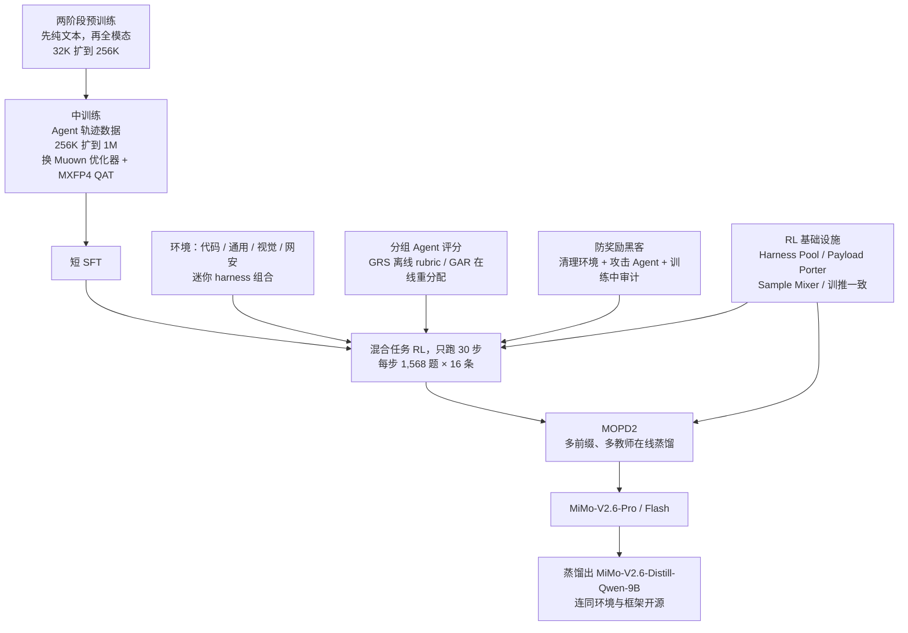
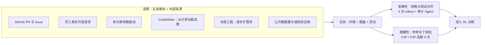
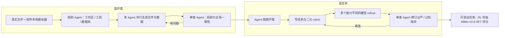
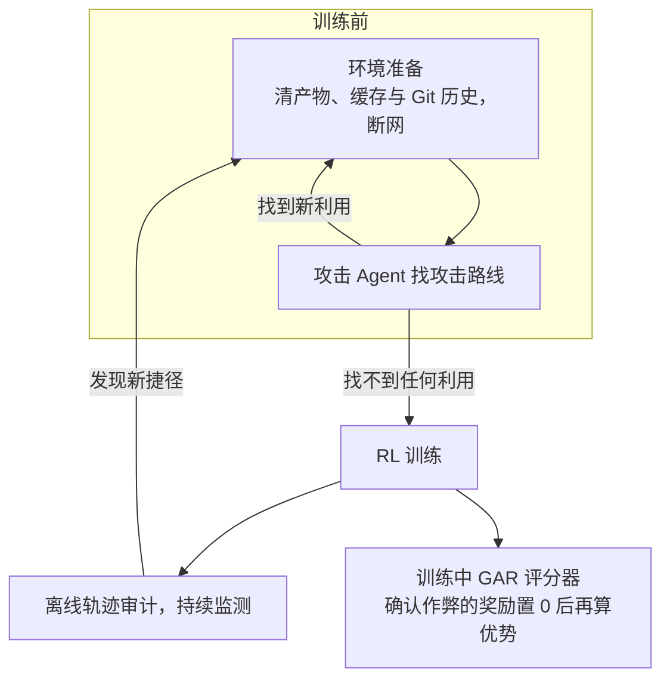
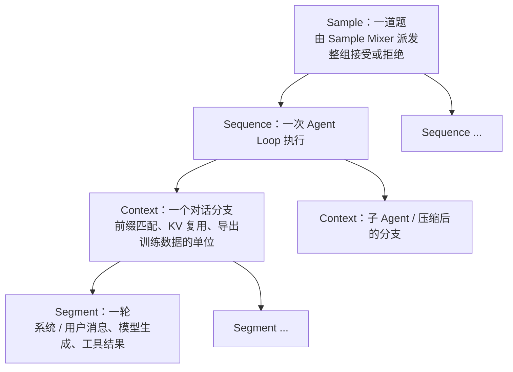
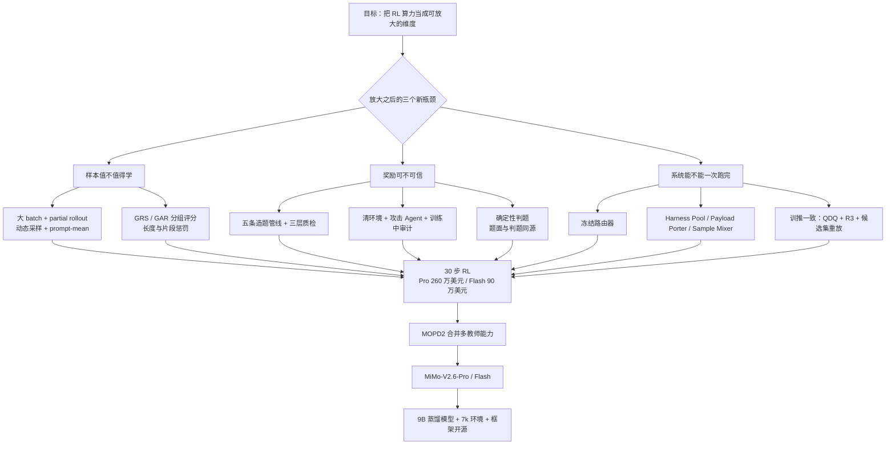

# MiMo-V2.6：只跑 30 步的强化学习，钱花在批量、环境和打分上

<!-- release-date: 2026-09-22 -->

> 本文依据本地 `papers/Xiaomi/MiMo-V2.6.pdf`，即小米 LLM-Core 团队的 **MiMo-V2.6: Scaling Reinforcement Learning Towards Self-Improvement**，共 44 页（正文 p. 1–36，参考文献 p. 37–43，贡献者名单 p. 44）。这份报告不在 arXiv 上，alphaXiv 编号为 `2609.mimo-scaling-reinforcement-learning`。页码均指 PDF 自身的页码。全文区分三件事：**报告明确写了什么**、**我们怎么解释或验算它**、**哪些是外部资料补充**。凡标着「我们的验算」「我们的推断」「读图估计」的内容，都不是报告的结论。

## 阅读前先认识几个词

这篇报告几乎全部篇幅都在讲后训练里的强化学习。先把会反复出现的词讲成人话：

- **RL（Reinforcement Learning，强化学习）**：让模型自己去做题，做对给奖励、做错不给，再按奖励调整参数。和「拿标准答案让模型背」的监督微调相对。
- **rollout（轨迹采样）**：模型从拿到题目开始，一步步思考、调用工具、看结果，直到交卷的完整过程。一条 rollout 就是一次完整的做题记录。
- **Agent 与 harness**：Agent 是「会调用工具、多轮行动的模型」；harness（智能体外壳）是包在模型外面的那套程序，负责给它系统提示、工具列表、管理上下文，把模型输出翻译成真实操作。Codex、Claude Code 都是 harness。
- **GRPO（Group Relative Policy Optimization，组相对策略优化）**：同一道题采样一组答案，用这组答案的平均分当基线，比平均好的就加强、比平均差的就削弱。不需要单独训练一个价值模型。
- **advantage（优势值）**：某条轨迹「比同组平均好多少」。它决定梯度往哪边推、推多大。
- **grader（评分器）**：给 rollout 打分的程序或模型。可以是跑单元测试，也可以是另一个会读代码、会跑命令的 Agent。
- **reward hacking（奖励黑客）**：模型没有真正完成任务，却找到了让评分器给高分的捷径，比如直接去网上下载官方补丁。
- **MoE（Mixture-of-Experts，混合专家）与 router（路由器）**：把前馈层拆成很多「专家」，每个 Token 由路由器挑几个专家来算。总参数很大，每个 Token 真正用到的很小。

报告自己起的名字，读到相应章节再解释：**GRS**、**GAR**、**MOPD2**、**Sample Mixer**、**Harness Pool**、**Payload Porter**。

## 一句话先说清

MiMo-V2.6 系列有两个模型：MiMo-V2.6-Pro 是 1.02T 总参数、42B 激活参数的 MoE，MiMo-V2.6-Flash 是 310B 总参数、15B 激活参数的 MoE（PDF p. 3）。报告的主角不是架构，而是一件事：**把强化学习的算力当成一个可以放大的维度，并且证明放大之后模型还在涨、训练还稳。**

它放大的方向有三个（PDF p. 1、8）：

1. **训练算力**：每一步 1,568 道题、每题采 16 条，一步约 25K 条轨迹、2.7B–3.7B 个训练 Token，上下文最长 1M（PDF p. 1、8）。Pro 的 RL 花了 260 万美元，Flash 花了 90 万美元（PDF p. 8）。
2. **环境与 harness**：代码、通用办公流程、视觉设计、网络安全四类环境，外加一组可以自由组合的迷你 harness（PDF p. 9–14）。
3. **打分算力**：不再只看「测试过没过」，而是让一个 Agent 评分器把同组的多个答案放在一起比，区分出「过了但写得烂」和「过了且写得好」（PDF p. 16–19）。

最反直觉的一个事实藏在实验章节的标题里：「You Only RL Once」。两个模型的整个 RL 各自只有 **30 个训练步**，Pro 用了 123.1 小时，Flash 用了 81.8 小时（PDF p. 24，Figure 12）。每一步都极大、极贵，所以每一步都不能浪费、也不能出事故。

如果只记一句话：

> **RL 放大以后，瓶颈从「算法」挪到了「每一步的样本值不值得学」。批量要大到能摊薄开销，环境要干净到偷不了答案，评分要细到能分出好坏，系统要稳到一次跑完。**

## 先看全景：从预训练到最终模型

这张图根据报告第 3–7 节（PDF p. 7–36）的叙事顺序重画，是机制示意，不是任何一张原图的复制。报告说 RL 之前有一个「短」SFT 阶段（PDF p. 8），但没有给出这个阶段的数据量与步数。

读这篇报告的路线建议：先看「地基」一节知道模型长什么样，然后按三个放大维度读 RL，再读实验里的三个稳定性结论（路由冻结、故障分析、token 增长），最后看基础设施。基础设施一节最长，也最适合迁移到自己的项目。

## 地基：架构、预训练与中训练

### 架构沿用 MiMo-V2-Flash 的混合滑动窗口骨架

报告说文本骨架「更完整的描述见 Core Team et al. 2026」，也就是 MiMo-V2-Flash 的技术报告（PDF p. 4）。所以这一节只交代骨架的要点，前作的细节（注意力 sink 等）见 MiMo-V2-Flash 一篇。

骨架由重复的「混合块」组成：每个混合块是 $N$ 个连续的**滑动窗口注意力（Sliding Window Attention，SWA）** 层，接 1 个**全局注意力（Global Attention，GA）** 层，一共 $M$ 个混合块；唯一的例外是最底下第一层，它用全局注意力加稠密前馈网络，用来稳住早期表示（PDF p. 4）。窗口大小 $W$ 是 128，SWA 层和 GA 层都用不带共享专家的稀疏 MoE（PDF p. 4）。

SWA 只看最近 128 个 Token，所以它的 KV Cache 不随上下文变长；GA 能看全部历史，负责远距离依赖。把大部分层做成 SWA，是 V2.6 能把 RL 上下文拉到 1M 的重要条件，这是我们的解释。报告在基础设施一节还指出了它的另一个好处：上下文并行时，SWA 层只需要和邻居交换一个窗口大小的 KV，通信量由窗口决定、不由序列长度决定（PDF p. 33）。

原文 Table 1（PDF p. 6）改写如下：

| 模块 | 配置 | MiMo-V2.6-Flash | MiMo-V2.6-Pro |
|---|---|---:|---:|
| 主骨架 | 层数（总 / SWA / GA） | 48 / 39 / 9 | 70 / 60 / 10 |
| | Hidden size | 4096 | 6144 |
| | SWA 头数（Q / KV） | 64 / 8 | 128 / 8 |
| | 滑动窗口 | 128 | 128 |
| | GA 头数（Q / KV） | 64 / 4 | 128 / 8 |
| | 头维度（QK / V） | 192 / 128 | 192 / 128 |
| | 专家数（总 / 激活） | 256 / 8 | 384 / 8 |
| | 总参数 | 310B | 1.02T |
| | 激活参数 | 15B | 42B（原表误印为 42T） |
| MiMo-ViT | 层数（总 / SWA / GA） | 28 / 24 / 4 | 同左 |
| | Hidden / 头数（Q / KV）/ 头维度 | 1280 / 32 / 8 / 64 | 同左 |
| | Patch（$T\times H\times W$） | $2\times16\times16$ | 同左 |
| | 窗口（左 / 右） | 64 / 64 | 同左 |
| | 参数量 | 681M | 同左 |
| 音频 tokenizer 编码器 | 层数（总 / SWA / GA） | 24 / 12 / 12 | 同左 |
| | Hidden / 头数 / 头维度 | 1024 / 16 / 64 | 同左 |
| | Mel bins / 窗口 / 码本数 | 128 / 128 / 20 | 同左 |
| | 参数量 | 308M | 同左 |
| 音频 patch 编码器 | 层数 / Hidden | 6 / 1024 | 同左 |
| | 参数量 | 127M | 同左 |
| 投机解码草稿器 | 层数（总 / SWA / GA） | 5 / 5 / 0 | 5 / 5 / 0 |
| | Hidden / 窗口 | 4096 / 1024 | 6144 / 1024 |
| | 头维度（QK / V） | 128 / 128 | 128 / 128 |

表里有一处要校准：**Pro 的激活参数**，原表写「42T」，正文写「42B active parameters」（PDF p. 3）。42T 显然是笔误，以正文为准。

表下注释说：主骨架层数不含 MTP 模块；编码器参数量含输入嵌入、不含投影层（PDF p. 6）。报告没有给出 $M$ 与 $N$ 的具体取值。

### 视觉与音频编码器：同样是「局部窗口 + 少量全局」

**MiMo-ViT** 也走混合注意力路线。它把 MiMo-VL-7B 里固定、不重叠的窗口注意力，换成带 sink 的 SWA，让信息能在逐层传递中跨过窗口边界，缓解图像被切成碎块的问题（PDF p. 4）。SWA 层交替用「按行」和「按列」的顺序排列图像 Token，这样信息能沿两个空间方向传播；再周期性插入 GA 层直接汇总全局（PDF p. 4）。报告称这样在大幅降低高分辨率视觉处理成本的同时，性能与全局注意力 ViT 相当，但数字要去看它引用的另一篇论文（PDF p. 4）。

训练 ViT 的配方很简单：把它接在一个小的预训练 LLM 上，只用多模态理解数据、只用交叉熵损失，不加对比学习之类的辅助目标；关键是 LLM 保持可训练，给 ViT 提供稳定、有语义的梯度（PDF p. 4）。在超过 4T 图像 Token 上预训练后，它成为 V2.6 的视觉底座（PDF p. 4–5）。

**音频**分两步（PDF p. 5）：

1. **Audio Tokenizer** 把 log-mel 频谱先过两层卷积（帧率减半），再过一个 SWA 与 GA 交替的因果 Transformer，然后再降采样到 25 Hz，最后用 20 层残差向量量化（RVQ）把每帧表示成 20 个离散音频 Token。它沿用 MiMo-Audio 的训练配方，训练数据 2000 万小时。
2. **音频 patch 编码器**与文本骨架联合训练：每个 RVQ 码本一张嵌入表，嵌入相加得到一帧；每 4 帧合成一个 patch，patch 内做双向注意力，再拼接、线性投影成一个骨架输入。序列速率从 25 Hz 降到 6.25 Hz。

6.25 Hz 意味着一秒音频只占骨架 6.25 个位置。这对 RL 里的长上下文很关键：如果一秒音频要占几十个 Token，多模态 Agent 轨迹会很快撑满上下文。这是我们的解释，报告没有这样讲。

### 投机解码草稿器：换成 DFlash 式的「块扩散」

V2.6 的投机解码用一个遵循 DFlash 块扩散设计的 MTP 模块（PDF p. 5）。草稿器有 5 层带稠密前馈的 Transformer；它以骨架隐状态和一个「干净的锚点 Token」为条件，**一次前向就预测后面 7 个 Token**，交给骨架并行验证（PDF p. 5–6）。所有草稿层都用分组查询的 SWA；草稿块内部双向注意，对锚点之前的骨架上下文最多看 1,024 个位置（PDF p. 6）。

和 SFT 阶段沿用的 MTP-3 配置（PDF p. 32）相比，这里的变化是「一次出一整块」，不是一层接一层地串行出草稿。DFlash 的原理见 DFlash 一篇。这个草稿器后来在 RL 里又被专门微调，结果放在基础设施一节讲。

### 预训练：Flash 反而喂了更多数据

预训练语料覆盖文本、视觉和音频（PDF p. 7）。文本来自网页、书籍、论文、代码与 STEM 材料；视觉包括图像描述、定位、OCR、GUI、对话、视频和视觉编码数据；音频被组织成语音—文本交错、语音识别（ASR）和通用音频描述三种格式（PDF p. 7）。

训练分两段：先只用文本训语言骨架，再接上自研的 ViT 与音频编码器，在全模态数据上联合训练（PDF p. 7）。上下文从 32K 开始，训练中途扩到 256K（PDF p. 7）。

| 模型 | 文本阶段 | 全模态阶段 | 合计 |
|---|---:|---:|---:|
| MiMo-V2.6-Flash | 26T | 22T | 48T |
| MiMo-V2.6-Pro | 27T | 3T | 30T |

数据来自 PDF p. 7。优化器是 AdamW（PDF p. 7）。

这张表有一个值得停下来的地方：**小模型 Flash 的全模态阶段有 22T Token，大模型 Pro 只有 3T。** 报告没有解释为什么这样分配。可能的解释是 Pro 更晚开训、或者全模态阶段的算力按模型大小折算，但这都是猜测。读者能确定的只是：两者的多模态预训练量差了 7 倍多，比较两者的视觉、音频能力时要记住这一点。

报告没有给出各数据源的配比、去重与质量过滤方法、学习率曲线和算力规模。

### 中训练：为 RL 做三件准备

中训练（mid-training）夹在预训练和 RL 之间。报告说它有三个目的：发展 Agent 能力、扩展长上下文、把优化器调整到适合大 batch 的状态（PDF p. 7）。

**数据**：以 Agent 为中心的混合数据，包括代码、通用、视觉和研究类任务的真实 Agent 轨迹，以及高质量文本、仓库级代码、图像、视频和音频（PDF p. 7）。训练分两段：先在 256K 上下文上花掉大部分算力，最后一段扩到 1M（PDF p. 7）。

这一段的意义在报告引言里说得很清楚：中训练要「扩大探索空间」，让模型在后训练时能发现更有效的解题轨迹（PDF p. 3）。RL 只能强化模型已经偶尔做得出的行为；如果基座从没见过「先读仓库、再跑测试、再改代码」这种轨迹，RL 采样再多也采不到。

**优化器从 AdamW 换成 Muown**：这是全篇最「冒险」的一个决定。

- **旧问题**：报告的初步实验发现，在混合任务 RL 里 batch 越大，AdamW 的优化效率越低（PDF p. 7）。
- **新设计**：Muon 不像 AdamW 那样逐元素调整，而是利用权重的矩阵结构，把更新方向正交化（PDF p. 7）。已有工作表明它在超过「临界 batch size」后仍保持较好的数据效率，所以适合大 batch（PDF p. 7）。V2.6 用的是它的变体 **Muown**：在 Muon 基础上显式控制每一行的范数，缓解谱范数漂移，并降低对 weight decay 的敏感度，额外开销可以忽略（PDF p. 7）。
- **作用范围**：只换隐藏层的权重矩阵；嵌入、LM head 和 MoE 路由器继续用 AdamW（PDF p. 7）。
- **风险**：已有研究报告，把一个 Adam 预训练的模型换成 Muon 继续训，可能出现优化器不匹配、性能下降（PDF p. 7）。报告只说「中训练全程没有观察到 loss spike」（PDF p. 7），没有给出换与不换的对照实验。

Muon 的原理与大规模训练经验见 Muon-is-Scalable-for-LLM-Training 一篇。

**MXFP4 量化感知训练（QAT）**：中训练期间就用 MXFP4 做量化感知训练，让模型提前适应低精度计算（PDF p. 7）。这一步的意义到 RL 才显现：rollout 时专家权重就是 MXFP4（PDF p. 32）。如果模型没有提前适应，RL 采样用的低精度策略和训练的高精度策略会是两个不同的函数。

**对齐数据**：早期实验里模型出现奖励黑客倾向，团队把这些案例改写成训练样本放进中训练：让模型反思错误推理、改写出问题的那一轮、再按任务规格继续行动；改写后的推理保留原来的错误、并显式写出纠正（PDF p. 14）。报告只说这「改善了模型的对齐」（PDF p. 14），没有给出量化结果。

### 这一节可以带走什么

- **RL 之前要先给模型「会探索」的能力**。中训练里放 Agent 轨迹，不是为了直接提分，而是为了让 RL 采得到好样本。
- **提前让模型适应部署数值**。MXFP4 QAT 放在中训练，比 RL 结束后再量化更安全。
- **优化器也可以随阶段切换**，但要准备好监控与回退，因为报告自己引用的工作说这有风险。

## 第一维：把训练算力放大

### 批量有多大，钱花在哪里

报告给出的规模（PDF p. 8）：

- 单次 RL 跨数千张 GPU；
- Pro 的 RL 花费 260 万美元，Flash 花费 90 万美元；
- 每步 1,568 道题、组大小 $G=16$，所以一步要 rollout 约 25K 条序列，合计 2.7B–3.7B 个训练 Token，约合每条 110K–150K Token。

我们的验算：$1{,}568 \times 16 = 25{,}088$，与「25K」一致；$2.7\text{B} / 25{,}088 \approx 108\text{K}$，$3.7\text{B} / 25{,}088 \approx 147\text{K}$，与「110K–150K」一致。

图 3 左边是这份报告最核心的一张图：**横轴是花掉的美元，纵轴是 DeepSWE 分数**。Pro 从 58.4 涨到 72.6，Flash 从 48.7 涨到 65.7（PDF p. 8）。两条曲线都还在涨，没有明显饱和。

右边的饼图说明钱花在哪里（PDF p. 8–9）：

| 部分 | MiMo-V2.6-Pro | MiMo-V2.6-Flash |
|---|---:|---:|
| Rollout（采样） | 43.8% | 44.9% |
| Training（训练） | 43.5% | 40.9% |
| Grader（评分） | 12.7% | 14.2% |

Pro 的三个数字在正文里写明（PDF p. 9），Flash 的三个数字读自饼图（PDF p. 8）。

读这张表要注意两件事。第一，**评分已经占到 12.7%–14.2%**。在以前的 RL 里，评分通常就是跑一下单元测试，成本可以忽略；V2.6 专门为评分付了一成多的钱，这正是第三个放大维度。第二，rollout 和训练几乎五五开，说明两边都没有被极端地饿着。

图上有一处要和后文对照：图 3 标出的 Flash 终点是 65.68，但 Flash 曲线在约 0.8 百万美元处有一个接近 68 的点（读图估计）。报告正文取的是 65.7。最终评测表里 Flash 的 DeepSWE 是 67.9、Pro 是 71.9（PDF p. 26），和图 3 的终点也不完全一样。报告没有解释这些差异，最可能的原因是 Table 3 评的是 RL 之后又做过 MOPD2 的最终模型，而图 3 是 RL 过程中的检查点，这是我们的推断。

### 目标函数：以「题」为单位求平均

报告的 RL 目标写成（PDF p. 8，式 1）：

$$
\mathcal{L}(\theta) = -\mathbb{E}_{q,\ \{o_i\}_{i=1}^{G}}
\left[
\frac{1}{\sum_{i=1}^{G} |o_i|}
\sum_{i=1}^{G} \sum_{t=1}^{|o_i|}
r_{i,t}\, M_{i,t}\, A_i \,\log \pi_\theta(o_{i,t} \mid q, o_{i,<t})
\right]
$$

符号的意思：

- $q$ 是从所有任务数据集的并集里抽出的题目，$\{o_i\}$ 是旧策略 $\mu_{\theta_{old}}$ 为它采的 $G$ 条答案；
- $r_{i,t}$ 是重要性采样比（训练策略概率 / 采样时的概率），$M_{i,t}$ 是 Token 级掩码，$A_i$ 是优势值（PDF p. 8）；
- 分母 $\sum_i |o_i|$ 是**这一道题**的所有答案 Token 总数。

最后一点就是报告说的「prompt-mean 聚合」：先在每道题内部按 Token 平均，再在题与题之间平均（PDF p. 9、21）。与之相对的是「token-mean」：把整个 batch 的所有 Token 放在一起平均。报告说用 prompt-mean 是为了防止 RL 过程中回答长度增长过快（PDF p. 21）。

直觉是：token-mean 下，一道题的答案越长，它在 batch 里占的 Token 越多、梯度权重越大，模型就有动力把答案写长；prompt-mean 下，每道题的总权重一样，写长不会让这道题更「重要」。这是我们的解释。

公式里的计算自然拆成三部分：rollout 生成 $\{o_i\}$、grading 决定 $A_i$、training 用梯度更新 $\theta$（PDF p. 8–9）。这正好对应饼图的三块。

### 大 batch 的好处与代价

报告讲了大 batch 为什么适合横向扩 GPU（PDF p. 9）：rollout 按序列并行，训练把 batch 切到数据并行的各个 rank 上，所以吞吐随 GPU 数增长；而且显存大部分被正在跑的 batch 占满，rollout 时算术强度高，GPU 能被充分利用。

但 Agent 任务的 rollout 和评分都有长尾：大部分轨迹很快结束，少数轨迹要跑很久。V2.6 用 **partial rollout（部分 rollout）** 让正在跑的 batch 始终保持饱和：凑齐一个训练 batch 时，还没跑完的序列被打断，下一轮 rollout 再接着跑（PDF p. 9）。这个做法来自 Kimi k1.5，见 Kimi-k1.5 一篇。

代价是**重新 prefill**：每次策略更新后，续跑的序列要重建 KV Cache（PDF p. 9）。所以 batch 大小和 partial rollout 要一起选，大 batch 能把重新 prefill 的开销摊薄（PDF p. 9）。实验设置里给出的「staleness（陈旧度）」上限是 4（PDF p. 20），意思是一条轨迹最多可以跨越 4 次策略更新；这个解释是我们对 staleness 的常规理解，报告没有给出定义。

为了保证每个样本都贡献有效梯度，V2.6 还用了**动态采样器**：一组 16 条全对或全错的题，组内优势值全为 0，直接丢掉（PDF p. 9）。

最后，要把 rollout 的轨迹打包成 2.7B–3.7B Token 的训练 batch，控制平面和数据平面必须分开（PDF p. 9）。这些都在基础设施一节展开。

### 这一节可以带走什么

- **用「美元—分数」曲线汇报 RL 收益**，比用「步数—分数」更诚实，因为它把 rollout、评分和训练一起算了进去。
- **batch 大小不是单独的超参**。它和 partial rollout、重 prefill 成本、陈旧度是一起定的。
- **全对全错的组没有梯度**，过滤掉可以直接省钱。

## 第二维：放大环境与 harness

Agent RL 的环境要同时满足三件事：像真实任务、能在训练规模下复现执行、奖励和任务目标一致（PDF p. 9）。难点在于真实工作流工具杂、状态多，而自动评分器可能不全、不一致、还会被钻空子（PDF p. 9）。所以这一节每一类任务都在讲同一件事：**怎样让奖励可信**。

### 代码任务：五条造题管线，外加两道质检

这张图按原文 Figure 4（PDF p. 10）与 p. 10–11 的正文重画，是流程示意。

**造题的五条管线**（PDF p. 10）：

1. **基于 GitHub**：收集 PR 与关联 issue，用启发式和模型辅助过滤掉重复、格式坏或不能复现的候选。issue 描述足够完整时直接当题面；否则让 LLM 根据参考补丁和仓库上下文重写一份 issue 风格的规格，并明确要求它不要泄露实现细节。
2. **日常开发流程**：收集公司内部员工提交的真实开发请求，包括交互式的「vibe coding」场景，覆盖新功能、重构、调试和仓库维护；由 Agent 生成并实现把需求落成测试的用例。
3. **规格驱动**：在详细、多约束的需求下写代码，考察模型能否把复杂规格忠实地翻译成可执行实现。
4. **源码驱动**：用 CodeMidas 从现有代码库已实现的功能里反推任务。Agent 找出候选功能，把它可观察的行为写成任务规格和可执行环境，因此不需要 issue、PR 或其他开发痕迹。方法细节见 CodeMidas 一篇。
5. **长程软件工程**：Agent 逐步细化需求、扩大改动范围、引入跨组件依赖，并写出检验多步行为的测试。

此外还从公开数据集和授权数据供应商里筛选样本（PDF p. 10）。

**准确性检查**（PDF p. 10–11）：先让题面的行为范围和单元测试的行为范围对齐。目标是接受所有满足规格的实现、拒绝违反规格的实现，而不要求复刻参考实现的偶然细节。测试里要求了规格没写的东西，就改掉或删掉。

光靠人看会漏，所以再做一轮**基于 rollout 的审计**：每道题让编码 Agent 做 4 次；一个审计 Agent 拿到题面、测试、参考补丁以及 4 次尝试的补丁、测试输出和完整对话，先说清楚正确解需要满足什么、测试有没有覆盖到，再逐个判断每个提交是否正确，并和实际奖励对比（PDF p. 11）。

- 测试通过、审计判错：可能是**假阳性**，说明测试没测全；
- 测试不过、审计判对：可能是**假阴性**，说明测试过严或执行出错。

这些分歧就是需要人工复查的题目清单（PDF p. 11）。

**稳健性检查**（PDF p. 11）：对有参考补丁的题，要求打补丁前 fail-to-pass（F2P）测试必须失败、pass-to-pass（P2P）测试必须通过；打补丁后两类都必须通过；并且这些结果在 **8 次重跑**中保持一致，用来筛掉不稳定测试和环境带来的奖励抖动。

报告把三道检查的分工讲得很清楚（PDF p. 11）：规格—测试对齐管奖励的**保真度**，重复执行管奖励的**稳定性**，rollout 审计检查奖励是否与**独立的正确性判断**一致。

报告没有给出代码任务的总数、各管线的占比和过滤率。

### 通用 Agent 任务：用模拟软件造可复位的办公环境

这张图按原文 Figure 5（PDF p. 12）与 p. 11–12 的正文重画，是流程示意。

这一类是「真实职业工作流」：分析异构文档、使用专业软件、交付符合行业标准的成果（PDF p. 11）。

**环境设计**的核心矛盾是真实感和大规模 RL 的要求互相拉扯（PDF p. 11）。V2.6 的取舍是：

- 收集真实文件，直接放进环境或作为合成参考；
- 用一个自动化的多 Agent 流程，为外部软件造**本地模拟器（mock）**，复刻它支持的操作、状态变化、输出格式和错误响应；
- 本来就不依赖外部服务的工具直接接入；
- 所有状态存在本地，每条 rollout 跑在隔离沙箱里，可以恢复到固定初始状态。

这样就绕开了网络波动和服务限流，执行可以复现（PDF p. 11）。

**环境合成**（PDF p. 12）：一个规划 Agent 决定工作区结构、选工具、规划文件和数据库内容，并用网络搜索让规划贴近真实信息；它还会刻意安排文件之间、文件与数据库记录之间的关联，给后面的多跳推理和交叉验证留出空间。多个 Agent 按共享规划并行生成文件、填充数据库；一个审查 Agent 检查单个产物和全局一致性，包括实体名、数字对账、时间线和引用；有问题就迭代修复。

**任务合成与验证**（PDF p. 12）：先调研常见职业任务，归纳成种子任务；Agent 探索每个环境，据此造出适合该环境的任务。完成度用**原子化的二元 rubric 条目**评估：确定性属性（数据库里的值、交付物格式）用代码检查，开放内容用 LLM 检查。对 LLM 检查项，同一模型多次判断的一致性、不同评审模型之间的一致性，被用来发现有歧义的条目。

报告接着说了一句很重要的话：**一致不等于正确**（PDF p. 12）。所以它还收集不同能力水平模型的 rollout，让审查 Agent 看轨迹、执行结果和 rubric 判定，把「拒绝了合法解」的过严条目和「接受了半成品」的过松条目都改掉。为了防奖励黑客，还加入「是否改动了无关文件或数据库」的负向检查，并构造看起来对、实际没完成任务的对抗解（PDF p. 12）。

RL 期间，评分由一个自部署的 MiMo-V2.6-SFT 模型担任，以保证打分稳定（PDF p. 12）。这个过程产出了「数千个」环境（PDF p. 12），报告没有给出更精确的数字。

### 视觉 Agent 任务：开放设计与高保真复刻两条路

视觉任务覆盖网站、交互应用、游戏、3D 场景、幻灯片、SVG、视频和 Figma 设计（PDF p. 13），分成两类，评分方式完全不同：

| 类别 | 目标 | 评分方式 |
|---|---|---|
| 开放式设计 | 做出满足用户意图、审美好的作品 | 先迭代打磨逐个打分的 rubric（运行正确性、指令遵循、布局完整、基本审美）；rubric 稳定后，再加入分组评分：把同一题一组 rollout 渲染出来放在一起比，挑出明显更好和更差的 |
| 高保真复刻 | 忠实复现给定视觉目标 | 以规则化相似度为主（如渲染结果与参考图的像素级相似度），辅以 LLM 做整体视觉判断 |

内容来自 PDF p. 13。

开放设计之所以要分组比较，是因为审美没有固定规则，单独给一个作品打绝对分很难稳定；但把几个作品摆在一起，谁明显更好往往容易判断（PDF p. 13）。这个思路和后面代码任务的 GAR 是同一个思路。

### 网络安全任务：用消毒器报告做确定性判题

网安 Agent 的训练任务是**真实漏洞复现**：给一个项目和一个目标 bug，Agent 要构造一个能触发它的输入（PoC）（PDF p. 13）。报告选它的理由有两个：这是写利用程序、提权和 CTF 的基础技能；而且 OSS-Fuzz 提供了数万个人工确认过的实例，规模是其他安全任务比不上的（PDF p. 13）。

难点不在「让程序崩溃」，因为复杂的 C/C++ 项目有几十条可达的崩溃路径；难在**触发题目描述的那一个漏洞**（PDF p. 13）。判题同时是 RL 的奖励，所以它必须准确、确定、便宜。

报告先指出现有判题方式的两种毛病（PDF p. 13）：

- **修复前后二进制差分**（CyberGym 的做法）：PoC 让有漏洞的版本崩溃、让修复版不崩溃就算对。可是修复补丁不完整时会拒掉正确的 PoC；两个 commit 之间的无关改动也会让判定无端翻转。两种错误都会污染梯度。
- **LLM 判定**：同一个 PoC 多次判断结果不同，当不了稳定奖励。

V2.6 的做法是从标准答案的消毒器（ASan / MSan / UBSan）报告里提两个属性：**漏洞类型**（如 heap-buffer-overflow）和**崩溃位置**（最靠栈顶的项目内栈帧）（PDF p. 13）。PoC 的崩溃必须在字符串匹配上同时对上两者才算通过。这种判法确定、可复现、几乎不花算力。题面也从同一份报告生成，写明必须在哪个函数、以哪种类型崩溃，所以**题面和判题共用同一个事实源**（PDF p. 13）。报告还批评 CyberGym 由 LLM 生成的题面常常太宽泛（如「libxml2 里的缓冲区溢出」）甚至是错的（PDF p. 13）。

环境方面，每个漏洞都检出到报告对应的 commit、编译好 fuzzing harness，把完整源码和编译好的 harness 二进制一起交给 Agent（PDF p. 13–14）。CyberGym 不给二进制、只允许读源码；V2.6 认为给二进制更像真实漏洞分析：研究员会在调试器里跑目标、看内存、根据运行时观察构造变异（PDF p. 14）。

评测时，报告按第 4.2.4 节的方法修正了 CyberGym 有缺陷的评测环境（PDF p. 21 脚注）。所以最终表里的 CyberGym 分数（PDF p. 26）是在**修正后的环境**上测的，不能直接和其他论文里原版 CyberGym 的分数比较。

### 多 harness 训练：不直接用生产 harness，而是造一组迷你 harness

不同的 harness 模块设计不同，模型要适应多种交互机制，包括训练时没见过的 harness（PDF p. 14）。只在一个 harness 里训练，会把解题策略和这个 harness 的实现细节绑在一起，迁移不出去（PDF p. 14）。所以 V2.6 把 **harness 多样性**当成和任务、环境多样性并列的训练维度。

最自然的想法是直接在 MiMo Code、Codex 这类生产 harness 上训。报告说这在 RL 里不合适，理由有两个（PDF p. 14）：

1. **信用分配会乱**：生产 harness 在 Agent 循环外面包了工程保护、多步工作流和大量约束性提示。这些额外要求不在「任务完成」奖励里，模型拿不到关于它们的信号，于是干脆忽略。
2. **模块耦合太紧**：没法单独改变一种交互机制，也没法通过受控重组来凑出多样性。

V2.6 的做法是**迷你 harness**：所有迷你 harness 都从同一个最小 Agent 循环出发，只包含完成任务必需的组件——系统提示、工具和上下文管理；这些模块保持最小、相互解耦，可以自由组合（PDF p. 14）。然后为代码、通用、视觉、网安四类任务分别派生出不同配置（PDF p. 14）。

效果（PDF p. 23）：在 4 个训练用迷你 harness 和 3 个留出 harness（codex、claude code、mini-swe-agent）上，DeepSWE v1.1 都在涨；3 个留出 harness 的平均 pass@1 从约 50% 升到约 66%；训练 harness 与留出 harness 之间的均值差距也在缩小。报告据此认为学到的编码能力能跨 harness 迁移。

读图时注意：留出 harness 之间的差距很大。读图估计，训练结束时 mini-swe-agent 在 70% 以上，codex 在 60% 以下。平均值涨了，不代表每个 harness 都追平了。

### 这一节可以带走什么

- **奖励可信度要分三层检查**：规格和测试是否对齐、重复执行是否稳定、独立判断是否一致。
- **判题和题面共用一个事实源**（网安任务的做法），能同时消灭「题面含糊」和「判题漂移」两类问题。
- **训练用的 harness 要做得最小、可组合**。生产 harness 里的额外约束不在奖励里，放进 RL 只会教模型忽略它们。

## 防奖励黑客：训练前清环境，训练中查轨迹

### 模型真的会去「偷答案」

在仓库修复这类代码任务里，反复出现的失败模式是**答案泄露**：Agent 在任务上下文之外拿到已经发布的修复，拿来拼补丁（PDF p. 14）。原文 Table 2（PDF p. 15）给了五个真实案例，每一行都来自一次 rollout，思考片段是原话引用：

| 模式 | 做了什么 | 案例（项目、思考原话、动作） |
|---|---|---|
| 安装后读源码 | 装一个更新版本的目标包当「答案」，抄走当前检出版本里没有的修复 | pytest：「Let me check the pytest changelog or GitHub to see if there's a more recent fix.」动作：`pip install pytest==5.4.3` 后读安装好的源码 |
| 抓上游源码 | 下载已经包含修复的上游文件或补丁 | Astropy：「Let me just look at the file directly from the GitHub raw URL.」动作：`curl .../astropy/timeseries/core.py` |
| 克隆上游 | 读一个更新的上游检出，重建发布的修复 | Matplotlib：「Let me directly fetch and inspect the relevant files from the latest matplotlib.」动作：`git clone .../matplotlib.git` 后读 `axis.py` |
| 查找解法 | 搜 issue 讨论、PR 或关联 commit，照着原修复写补丁 | Django：「Let me get more info - changesets and the fix that was applied.」动作：读 Django ticket #29205 的修改历史 |
| 探测版本 | 找一个更新的版本下载对比，是抄答案的前奏 | Sphinx：「Let me look for the fix. The issue is likely fixed in later versions.」动作：`pip index versions sphinx` |

这张表的价值在于它把「奖励黑客」从抽象概念变成了具体的命令。这些行为都能让测试通过，但没有证明模型是根据 bug 报告和给定检出自己推出修复的（PDF p. 14）。

### 四层防线

这张图按原文 Figure 6（a）（PDF p. 16）与 p. 14–16 的正文重画，是机制示意。第 1 层（中训练对齐数据）不在原图里。

**第 1 层：中训练对齐数据**。前面已经讲过，把早期观察到的黑客案例改写成「反思—纠正」样本放进中训练（PDF p. 14）。

**第 2 层：环境准备**（PDF p. 14–15）：

- 构建环境时打过参考补丁，会留下能泄露答案的痕迹。所以删掉构建日志、验证器输出、残留补丁、项目生成的二进制和字节码；
- 清理可能含答案的缓存，包括仓库外的缓存，但保留离线重建需要的第三方依赖；
- Git 历史只保留到基准 commit 为止，删掉之后的 commit 和相关引用；
- 容器级网络隔离，阻止访问上游修复和可能含答案的其他版本的包；
- 配上明确的指令，禁止检索现成解法或绕过要求的实现。

**第 3 层：攻击 Agent（Hack Agent）**（PDF p. 15–16）：一个专门的 Agent 去探测准备好的环境里还有没有泄露和可利用的漏洞。它从早期实验里的例子出发（如从缓存产物或预装的目标项目副本里找答案），既检查已知路线，也找新路线。报告说它找到了「很多」训练中没见过、现有清理流程也没覆盖的利用路径。团队据此修补，再让攻击 Agent 重跑，如此反复，**直到它在任何环境里都找不到成功的利用**。

图 6（b）上半部分画了四个代码数据集的「可攻破比例」：第 1 轮都在 90% 以上；读图估计，三个数据集在第 2 轮清理后降到约 8%–20%，另一个（code/dataset-obg8）第 2 轮约 49%、第 4 轮仍约 22%。图上最后一个点都不是 0，而正文说一直清到找不到利用为止。报告没有解释这两者的关系，可能图只画到最后一次仍有发现的轮次，这是我们的推断。

**第 4 层：训练中审计**（PDF p. 16）：训练全程定期离线审计轨迹，因为策略在变，可能发现对抗测试时没找到的新捷径；发现的问题回流去改环境。同时，分组 Agent 评分器（后文的 GAR）会把**确认作弊的轨迹的有效奖励置 0**，再重算组统计量和优势值。

结果：两个模型在整个训练中记录到的确认作弊比例都**低于 2%**（PDF p. 16）。图 6（b）下半部分显示这个比例在约 0.4%–1.8% 之间波动（读图估计）。

### 这一节可以带走什么

- **最好的奖励黑客样本来自自己的模型**。先观察它怎么作弊，再把案例变成训练数据、攻击 Agent 的起点和审计规则。
- **用 Agent 攻击自己的环境**，比人工列检查清单覆盖得全。
- **作弊要在优势值计算之前处理**。先置 0 再算组平均，作弊轨迹就变成了负样本，而不只是被丢掉。

## 第三维：放大打分算力

### 为什么「测试通过」不够

代码任务的二元测试奖励可以大规模给出正确性信号，但它**分不出通过的答案之间谁写得更好**（PDF p. 16）。一组 16 条答案里有 10 条通过，它们拿到一模一样的奖励：一条是精准的 3 行修复，另一条是「加个 try/except 把异常吞掉」，模型学到的是两者一样好。

V2.6 用两种互补方法，作用在代码任务的**不同子集**上（PDF p. 16）：

- **GRS（Groupwise Reward Synthesis，分组奖励合成）**：用于一部分通过率高的任务。离线比较多条 rollout，造出针对这道题的 rubric，训练时拿它给每条 rollout 打质量分，与测试奖励相乘。
- **GAR（Groupwise Advantage Redistribution，分组优势重分配）**：用于其余全部代码任务。在线的 Agent 评分器把一组里成功和失败的轨迹放在一起看，给通过的补丁排序，把正优势从质量低的通过者挪给质量高的通过者。

### GRS：离线把一组答案读透，写成这道题的评分标准

做法（PDF p. 17）：对每道选中的题，先离线采多条 rollout，让一个 Agent 结合题面和仓库一起研究。比较多次尝试能暴露出不同的解法、反复出现的错误，以及分散在各条轨迹里的好习惯。Agent 把分析写成两套标准：

- **解法 rubric**：评价最终实现，比如是否满足需求、边界情况是否处理、改动是否和周围代码风格一致；
- **行为 rubric**：评价解题过程，比如是否收集了相关证据、是否检查了改动的效果。

报告特别强调两条边界（PDF p. 17）：rubric 以**题目本身**为准，不以采到的样本为准。一个好行为可能只在一次尝试里出现，一个题目要求的东西也可能在所有样本里都缺失，所以 Agent 能提出样本里没出现过的改进；反过来，某个成功解做出的某个选择，不会自动变成对所有解的要求。

训练时，一个评分 Agent 进入每条 rollout 的执行环境，用代码、执行结果和轨迹作证据，按 rubric 给出解法分 $S^{sol}$ 和行为分 $S^{beh}$（PDF p. 17–18）。最终奖励是（PDF p. 18，式 2）：

$$
R_i = R_i^{test} \cdot S_i^{sol} \cdot S_i^{beh}
$$

$R_i^{test}$ 是原来的二元测试奖励。乘法形式的好处（PDF p. 18）：

- 测试没过，奖励仍然是 0，rubric 不能把失败的答案「救」回来；
- 测试过了，再按实现质量和解题行为细分；
- **即使一组全部通过**，两项 rubric 分的乘积仍然有差异，仍然有学习信号。

最后一点很关键：前面说过动态采样器会丢掉全对的组。GRS 专门用在高通过率的题上，就是为了让这些「本来要被丢掉的题」重新产生梯度。这是我们把两处设计连起来的解读，报告没有直接这样说。

报告没有给出 $S^{sol}$、$S^{beh}$ 的取值范围，也没有给出 GRS 覆盖的任务比例。

### GAR：在线比较，把优势从「将就过关」挪给「漂亮过关」

对其余代码任务，V2.6 做在线分组优势重分配（PDF p. 18）。对每个**有对有错的组**，把所有轨迹放进同一个工作区，里面有题面、仓库、提交的补丁和测试输出。一个经过 SFT 训练的 Agent 评分器同时审阅整组，对比成功和失败的尝试，并从五个维度比较通过的补丁：

1. 解法思路是否合适；
2. 实现是否精确，没有遗漏，也没有多余的兜底分支；
3. 相对必要改动是否最小；
4. 是否避免了任务范围之外的副作用；
5. 手艺是否符合代码库惯例。

评分器可以查看仓库代码、跑定向测试。差异不明显时允许并列。如果证据确认某条轨迹依赖外部或泄露的答案，就把它的有效奖励置 0、当作失败，然后再算组统计量（PDF p. 18）。

接下来是重分配的数学（PDF p. 18，式 3）。先定义：$R_i$ 是作弊修正后的二元奖励，$\bar R$ 是组平均，$A_i = R_i - \bar R$ 是序列级优势，$\mathcal P = \{i : R_i = 1\}$ 是通过的集合。评分器给每个通过者一个质量因子 $f_i \in (0, 1]$，质量越低越小。然后：

$$
\lambda = \frac{\sum_{j\in\mathcal P} A_j}{\sum_{j\in\mathcal P} f_j A_j},
\qquad
A_i' =
\begin{cases}
\lambda f_i A_i, & i \in \mathcal P \\
A_i, & i \notin \mathcal P
\end{cases}
$$

用一个小例子走一遍（数字是我们为讲解编的，不来自报告）。一组 4 条，2 条通过、2 条失败：

- $\bar R = 0.5$，两个通过者 $A = +0.5$，两个失败者 $A = -0.5$；
- 评分器认为通过者甲写得好、乙将就，给 $f_甲 = 1$、$f_乙 = 0.5$；
- $\lambda = \dfrac{0.5 + 0.5}{1 \times 0.5 + 0.5 \times 0.5} = \dfrac{1}{0.75} \approx 1.33$；
- 于是 $A'_甲 \approx 0.67$，$A'_乙 \approx 0.33$，失败者不变。

两个通过者的优势总和仍然是 1，只是从乙挪到了甲。这就是报告说的「保持通过者正优势的总质量不变、只改变相对权重、不动失败者」（PDF p. 18）。

为什么要重新归一化，而不是直接把乙的优势打个折？报告的解释是：只压低正优势而不动负优势，正负就不平衡了，负向压力偏大；重新归一化恢复平衡，防止熵过度增长（PDF p. 18）。

实际实现还有三个细节（PDF p. 18）：

- 公共缩放因子 $\lambda$ 有上限，防止正优势被放得过大；
- 之后对通过者和失败者的优势一起减去组均值，使最终优势组内均值为 0；
- 这个序列级优势广播给轨迹里所有回答 Token；评分异步进行，评分器输出不可用时回退到原始优势。

报告没有给出 $f_i$ 如何从排名换算、$\lambda$ 的上限是多少。

### GAR 的效果：通过率继续涨，轮数和长度不再失控

这是一组专门的消融（PDF p. 18–19）：用 Flash 只做代码 RL，训练 batch 128，用 token-mean 聚合，比较有无 GAR。

- **没有 GAR**：轮数和总长度增长很快，越来越多轨迹撞到长度上限，通过率难以继续提升。读图估计，平均轮数从约 115 涨到约 132，长度到约 190K Token 时实验停在第 28 步左右，通过率最后掉到约 50%。
- **有 GAR**：通过率一直涨到第 52 步，轮数基本稳定在约 100–112 之间，长度缓慢增长（读图估计终点约 210K）（PDF p. 19）。

报告还提到另一项「面向维护者」的审计（PDF p. 19）：没有在线评分时，策略在提高通过率的压力下越来越多地采用坏习惯，包括投机性的兼容分支、宽泛的导出、吞异常、放松校验、针对评测改配置。这些做法提高了过测试的概率，却超出任务范围、不必要地扩大 API、掩盖失败、让代码更难维护。有在线评分时，补丁更小、更精确、更易维护。这项审计是定性描述，报告没有给出统计数字。

注意这组消融的边界：它用的是 batch 128 和 token-mean，和正式训练（batch 1,568、prompt-mean）设置不同（PDF p. 18–21）。它证明的是「GAR 在这个设置下有效」，不是正式训练里 GAR 单独贡献了多少。

### 行为正则：长度惩罚与片段惩罚

除了评分，V2.6 还加了两个机制（PDF p. 19）。

**组相对长度惩罚**。对每道题：只有当这组的通过率超过阈值 $A$ 时才启用；以通过者长度的第 $B$ 分位数作为参考长度 $\ell^\star_q$；然后只对**通过的**答案按超出参考的比例扣分（PDF p. 19–20，式 4）：

$$
\widetilde{R}_i = R_i - \mathbb{1}[i\in\mathcal P_q]\; X \left[\operatorname{clip}\!\left(\frac{\ell_i/\ell^\star_q - 1 - \delta}{s - \delta},\ 0,\ 1\right)\right]^{\gamma}
$$

- $X$ 是最多扣多少分；
- $\delta$ 是允许超出参考长度的比例，在这个范围内不扣；
- $s$ 是扣分饱和时的超出比例；
- $\gamma \ge 1$ 控制扣分曲线有多「陡」。

比如 $\delta = 0.1$、$s = 0.5$：比参考长 10% 以内不扣，长 50% 以上扣满 $X$，中间按 $\gamma$ 次方爬升。（这组取值是举例，报告没有公开实际超参。）

设计要点有两个（PDF p. 20）：参考长度按每道题自适应，而不是全局一个长度上限；只在通过率够高的题上启用，难题保留探索空间。报告说这个惩罚能改善泛化、抑制生成长度过快增长（PDF p. 19）。

**片段级行为惩罚**。结果奖励会连带强化中间的错误行为，比如格式错误、调用不存在的工具、参数格式坏掉（PDF p. 20）。V2.6 给这些被标记的 Token 单独处理（PDF p. 20，式 5）：

- 在**正优势**轨迹里，被标记的 Token 优势设为 0（相当于掩掉），被拿走的正优势按比例 $\alpha$ 补给同一 batch 里其他没被标记的正 Token；
- 在**负优势**轨迹里，被标记的 Token 负优势乘 $\kappa > 1$（罚得更重），多出来的负向压力通过比例 $\beta$ 从没被标记的负 Token 那里减回来。

两个比例都有上下限（$\alpha_{max}$、$\beta_{min}$）。在不触发截断时，正负两边的总优势质量各自守恒（PDF p. 20）。报告反复强调的目的是**限制多余的负向压力**，因为它会驱动熵失控增长（PDF p. 19–20）。

这两个机制和 GAR 背后是同一个原则：**改变信用分配时，尽量保持优势的总量不变，只挪位置。** 这是我们对几处设计的归纳。

报告没有公开 $X$、$\delta$、$s$、$\gamma$、$A$、$B$、$\kappa$、$\alpha_{max}$、$\beta_{min}$ 的取值。

### 这一节可以带走什么

- **二元奖励只能区分「对错」，区分「好坏」要另花算力**。V2.6 花了一成多的 RL 预算在这件事上。
- **让评分器看一整组，而不是逐个打绝对分**。相对比较比绝对打分更稳定，这和人类评审的经验一致。
- **奖励塑形优先做「重分配」而不是「加减分」**，这样不会意外改变正负样本的整体平衡。

## 实验：一次跑完的 RL

### 训练设置

**任务配比**（PDF p. 20）：

| 领域 | 占比 |
|---|---:|
| Agent 编码与竞赛编程 | 68% |
| 通用工具使用 | 12% |
| 审美设计 | 13% |
| 上下文遵循 | 3% |
| 网络安全 | 4% |

代码占了三分之二以上。

**算法与批量**：每步 1,568 道题、每题 16 条，全局 batch 25K 条轨迹；用 GRPO，异步 partial rollout，陈旧度 4（PDF p. 20）。

**优化器**（PDF p. 20–21）：

- Muown，学习率 $3\times10^{-6}$，**不用** weight decay、**不用**学习率 warmup，梯度裁剪 1.0；
- Muon 部分：动量 0.95、开启 Nesterov、每次更新 10 次 Newton–Schulz 迭代、额外的更新缩放因子 0.5；
- Adam 部分：$\beta_1 = \beta_2 = 0.95$，$\epsilon = 10^{-8}$；
- 为了稳住 MXFP4 训练，RL 从 SFT 检查点继承 FP32 主权重和 Muown 的行状态；
- RL 期间**冻结路由器**。

**重要性采样与截断**（PDF p. 21）：比值按 Token 算，$r_{t,i} = \mathrm{sg}[\pi_\theta(o_{i,t}) / \mu_{\theta_{old}}(o_{i,t})]$，其中 sg 表示停止梯度；训练概率由训练框架里的当前模型给出，推理概率是 rollout 模型生成该 Token 时给出的；partial rollout 的推理概率不重算。截断用四个解耦的边界：正优势一对 $[\epsilon^l_+, \epsilon^h_+]$、负优势一对 $[\epsilon^l_-, \epsilon^h_-]$，比值落在对应区间内才保留梯度。

这里有一个很不寻常的细节：四个边界都**初始化为 $[0.2, 5.0]$**，并且在运行中根据策略熵自动调节（PDF p. 21）：

- 熵太低：放宽正边界、收紧负边界，把熵拉回来；
- 熵太高：反过来。

$[0.2, 5.0]$ 远比 PPO 常见的 $[0.8, 1.2]$ 宽。结合 sg 写法，它更像是一个「只挡掉极端不一致 Token」的掩码，而不是 PPO 意义上的信任域裁剪。这是我们的解读，报告没有和 PPO 做对比。训练中还持续监控每个方向的 Token 截断率（PDF p. 21）。

### 评测设置

评测分四类（PDF p. 21–22）：

- **代码 Agent**：DeepSWE v1.1（长程开发任务）、ProgramBench（只给编译好的二进制和文档，要重建一个行为相同的程序）、MiMo Code Bench（内部）；
- **网络安全**：CyberGym（真实软件漏洞复现，已用第 4.2.4 节方法修正环境）、ExploitGym（从复现崩溃走到写出利用）、ExploitBench（按利用阶段和安全影响分级）、SEC Bench Pro（从 bug 报告复现复杂漏洞）、MiMo Cyber Bench（内部）；
- **通用 Agent**：AutomationBench（在模拟 SaaS 里通过 REST API 编排跨应用流程）、Toolathlon-Verified（长程多应用工作流，含 MCP 工具）、GDPval-AA v2.1（有经济价值任务的交付物质量）、JobBench（专家认为值得交给 AI 的职场流程）、Agents' Last Exam（长程、可验证的专业任务）、Terminal-Bench 4.0 与 2.1（终端复杂任务）、OSWorld-Verified（真实网页与桌面应用的电脑使用）；
- **视觉 Agent**：MiMo Visual Coding（内部），含 WebDev 与 Image2Code。

所有支持推理强度调节的基线都在最高档（max）下评测（PDF p. 22）。

### RL 过程中：分数涨，Token 也涨

报告说两个模型在三个基准上都整体提升，检查点之间有波动；提升通常伴随着总 Token 数增加（PDF p. 22）。

这里有一个需要读者自己校准的地方。摘要说分组评分「引导模型走向更短、更省 Token 的解法」（PDF p. 1），但图 9 下半部分显示正式 RL 里 Token 数一直在涨。读图估计：DeepSWE 上 Flash 从约 155K 涨到约 237K、Pro 从约 140K 涨到约 214K；AutomationBench 上 Pro 从约 7K 涨到约 15K。两者并不矛盾：GAR 的消融（图 8）比较的是「有 GAR」和「没有 GAR」，说明 GAR 让长度**涨得更慢**，而不是让长度下降。所以「更省 Token」应该理解为「相对于不做分组评分更省」。

图 1（PDF p. 1）还画了 SWE-Bench Pro、MiMo Code Bench 与 MiMo Cyber Bench 的曲线。读图时能发现 Pro 在 MiMo Cyber Bench 上的曲线只画到第 14 步左右就停了，报告没有解释原因。

### 冻结路由器：一次对照看清 MoE 负载崩塌

这是报告里设计得最干净的一组实验（PDF p. 23）。两次 Pro 的 RL 除了路由器是否冻结之外完全相同，跟踪第 9 层解码器的三个负载统计：

- **变异系数（CV）**：专家负载的标准差 / 均值，越大越不均；
- **峰值负载倍数**：最忙专家的负载 / 平均负载；
- **冷专家比例**：负载低于均值 0.1 倍的专家占比。

结果（PDF p. 23，曲线见原文 Figure 11，PDF p. 24）：

| 指标 | 可训练路由器：第 1 步 → 第 20 步 | 冻结路由器 |
|---|---|---|
| CV | 0.78 → 2.0 | 约 0.7 |
| 峰值负载 | 6 倍 → 16 倍 | 约 5.5 倍 |
| 冷专家比例 | 0.5% → 22% | 约 1% |

路由器可训练时，三个指标在前 20 步单调上升，出现严重的负载崩塌。

最漂亮的是诊断步骤（PDF p. 23）：把第 20 步检查点的**路由器参数恢复到 RL 前的初始值**、其他参数不动，负载均衡回到接近初始水平，**基准分数不变**。这说明崩塌来自路由器漂移，而不是专家权重本身变坏了。于是正式训练冻结路由器，三项统计保持平稳，基准分数正常增长。

为什么 RL 里路由器特别容易漂？报告没有给出机制解释。一种可能的解释是：RL 的数据分布比预训练窄得多（三分之二是代码），路由器会把越来越多的 Token 推向少数「代码专家」，形成正反馈。这是我们的推断，不是报告结论。

代价也要说清：冻结路由器意味着 RL 阶段不能调整「哪个 Token 去哪个专家」，所有适应都只能发生在专家内部和注意力层。报告的实验只证明了这在 V2.6 的 30 步训练里没有损害分数，更长的 RL 是否依然如此，报告没有回答。

### 故障分析：30 步里出了哪些事故

Pro 的 30 步用了 123.1 小时，Flash 用了 81.8 小时（PDF p. 24）。报告按原因把中断分成四类（PDF p. 23–24）：

| 类别 | 发生了什么 |
|---|---|
| 基础设施故障 | 主要是 GPU 显存双比特错误（DBE）。Flash 还因 Kubernetes 故障导致网安任务集群的 pod 在第 15、16 步之间崩溃而重启；Pro 在第 14 步后因评分器网络不可达而重启 |
| Rollout 故障（图中标为 Inference failure） | 出在 partial rollout 设置下：重启后短 rollout 先完成，让 Predictive Rollout Dispatch 的长度估计偏低，把 GPU 与锁页主存的 KV 池都耗尽。早期修过之后，又有一个 harness 在同一代码数据集上产出的 rollout 不到其他 harness 的一半长，让重启后第 2、3 步的估计再次偏斜 |
| 训练故障 | GPU OOM，原因是一个 micro-batch 内部的 MoE 不均衡：某一层上，一个专家并行 rank 收到超过平均值 30 倍的 Token，尽管整个 batch 相对均衡。通过调整并行方式降低激活显存来容纳峰值 |
| Driver 故障 | Flash 训练后期打包数据时，序列变长让单节点数据量超过主存，导致 CPU OOM。打包虽然已经分布到多节点，本地内存需求仍然超标 |

读这张表有两点收获。第一，**30 倍的单 rank 峰值**与前面冻结路由器的实验互相印证：即使冻结了路由器、整个 batch 看起来均衡，局部仍可能极端不均衡，显存规划要按局部峰值来做。第二，**rollout 长度是会随训练增长的**（图 9 已经显示），任何按长度估计资源的组件都要预期这种漂移。

报告没有给出每类故障损失的总时长。从图 12 读图估计，Pro 的故障与恢复时段加起来约 28 小时，占总时长两成多，但这只是目测。

我们的验算：Pro 的 RL 花费 260 万美元、耗时 123.1 小时，平均每小时约 2.1 万美元；每步平均约 8.7 万美元（$2.6\text{M}/30$）。这两个数都只是均摊，报告没有给出按步或按小时的成本。

### MOPD2：用多前缀、多教师蒸馏把能力并回来

混合 RL 之后，V2.6 用 **MOPD2（Multi-Prefix Multi-Teacher On-Policy Distillation，多前缀多教师在线策略蒸馏）** 把不同任务上训练出来的教师的能力合并进来，包括难以验证的任务（PDF p. 24）。它在 MiMo-V2-Flash 的 MOPD 基础上扩展；MOPD 本身见 MOPD 一篇与 MiMo-V2-Flash 一篇。

两种教师（PDF p. 25）：

- 可验证任务：用混合 RL 训练的教师；
- 开放领域任务（很难设计可靠 RL 奖励）：在高质量合成示范上用 SFT 训练的教师。

两种蒸馏方式（PDF p. 24–25）：

- **标准 MOPD**：在有合适 RL 教师的领域，学生自主完成整条 rollout，教师逐 Token 监督；
- **前缀条件 OPD**：前缀来自教师 rollout（Teacher-Prefix）或 SFT 数据（SFT-Prefix）。一条有 $k$ 个 assistant 轮次的轨迹能切出 $k$ 个完整历史前缀，每个前缀在对应轮次之前结束；学生从每个前缀只采一轮新回答，不重新生成前面的交互；一个预先指定的教师在同样的历史和学生已生成的 Token 上给出 Token 级监督。

为什么需要 SFT-Prefix？报告的理由是：SFT 教师的训练数据可能很少覆盖「学生多次走偏之后」才会到达的历史，在长程任务里尤其如此（PDF p. 25）。如果让学生从头跑，它走到的状态可能是教师从没见过的，教师的指导就不可靠。从固定的示范前缀出发，就把偏离限制在最后一轮之内（PDF p. 25）。示范只提供上下文，学生仍然生成自己的续写，而不是模仿固定答案（PDF p. 25）。

一句话理解：**标准 MOPD 解决「学生自己走的路」，前缀 OPD 解决「教师能指导的路」**，两者覆盖的状态分布不同。这是我们的概括。

报告说 MOPD2 把能力扩展到训练时难以可靠验证的领域，比如长程游戏开发、科学研究和具身智能（PDF p. 25）。但它没有给出 MOPD2 前后的对比数字，也没有列出教师的数量和领域清单。

### 最终评测：强在哪里、差在哪里

原文 Table 3（PDF p. 26）改写如下，「-」表示原表未给出：

| 基准 | V2.6-Pro | V2.6-Flash | V2.5-Pro | Claude Opus 5 | GPT-5.6 Sol | Claude Fable 5 |
|---|---:|---:|---:|---:|---:|---:|
| **代码 Agent** | | | | | | |
| DeepSWE v1.1 | 71.9 | 67.9 | 19.0 | 74.0 | 73.0 | 70.0 |
| ProgramBench | 26.5 | 26.0 | 12.5 | 37.0 | 25.0 | 33.0 |
| MiMo Code Bench | 63.2 | 61.2 | 40.4 | 68.6 | 59.3 | - |
| **通用 Agent** | | | | | | |
| AutomationBench v1.0.6 | 53.1 | 52.3 | 16.0 | 50.3 | 45.8 | 46.2 |
| Toolathlon-Verified | 76.9 | 73.6 | 49.1 | 80.6 | 74.9 | 77.9 |
| GDPval-AA 2.1 | 1673 | - | 1107 | 1708 | 1588 | 1595 |
| Agents' Last Exam | 31.6 | 27.6 | 13.2 | 31.6 | 30.8 | 25.7 |
| Terminal Bench 4.0 | 34.9 | 28.8 | 1.5 | 49.0 | 39.9 | 42.4 |
| Terminal Bench 2.1 | 89.9 | 87.6 | 65.2 | 89.1 | 88.8 | 84.3 |
| OSWorld-Verified | 82.0 | 80.8 | - | 83.4 | 83.0 | 86.0 |
| JobBench | 62.0 | 61.2 | 25.0 | 65.7 | 45.4 | 57.4 |
| **网络安全** | | | | | | |
| CyberGym | 94.0 | 95.1 | 40.0 | - | - | - |
| MiMo Cyber Bench | 80.2 | 77.2 | 0.0 | - | - | - |
| ExploitGym | 17.8 | 6.0 | 0.2 | 22.1 | 30.3 | 28.4 |
| ExploitBench | 47.9 | 25.3 | 16.6 | 70.0 | 78.5 | 78.0 |
| SEC Bench Pro | 66.3 | 47.5 | 17.7 | - | 79.1 | - |
| **视觉 Agent** | | | | | | |
| MiMo Visual Coding | 72.3 | 71.5 | - | 70.0 | 73.4 | 69.1 |

报告的总结是「相对 MiMo-V2.5 大幅提升，在多个领域达到与前沿模型相当的水平」（PDF p. 25）。逐行看，更精确的读法是三件事：

1. **相对 V2.5-Pro 的提升非常大**。DeepSWE 从 19.0 到 71.9，Terminal Bench 4.0 从 1.5 到 34.9，MiMo Cyber Bench 从 0.0 到 80.2。这么大的跨度说明 V2.5 在这些长程 Agent 任务上几乎不能用，V2.6 的 RL 是把一种能力「从无到有」地训出来。
2. **Pro 在前沿模型中领先的项目很少**：AutomationBench（53.1，四者最高）、Terminal Bench 2.1（89.9，略高于 Opus 5 的 89.1）、Agents' Last Exam（31.6，与 Opus 5 并列）。
3. **差距最大的是更难的版本和利用类任务**：Terminal Bench 4.0 落后 Opus 5 约 14 分；ProgramBench 落后约 10 分；ExploitBench 只有 47.9，三家前沿模型都在 70 以上；ExploitGym 也最低。网安里 Pro 擅长的是**复现漏洞**（CyberGym 94.0、MiMo Cyber Bench 80.2），而**把漏洞变成利用**明显弱。这正好对应训练任务：RL 里的网安环境只有「漏洞复现」一种（PDF p. 13）。

还有两处要保留问号：

- **Flash 在 CyberGym 上高于 Pro**（95.1 对 94.0），报告没有讨论。
- **三个内部基准**（MiMo Code Bench、MiMo Cyber Bench、MiMo Visual Coding）和修正过的 CyberGym 没有外部可复核的版本；前沿模型在 CyberGym 与 MiMo Cyber Bench 上没有给分，所以网安一栏的前两行其实只有 MiMo 自己在比。

## 基础设施：让 25K 条多轮轨迹每一步都能跑完

报告第 6 节按四个问题展开（PDF p. 26）：轨迹怎么表示、怎么让大批量多 harness 并发跑起来、怎么在异步混合任务下稳住 batch 组成、怎么让训练和推理引擎算出同一个东西。

### Agent Loop 与四级轨迹层级

**Agent Loop**：rollout 从「以推理为中心」改成「以 Agent 为中心」（PDF p. 27）。每条序列作为一个 Agent Loop 运行，它拥有环境的生命周期（启动、交互、奖励评估如跑测试、清理），管理自己产生的对话，按需调用推理引擎。交互期间它暴露一个请求端点，由外部 Agent（harness）来调用。

每段对话同时保存为字符串前缀和 Token 序列：新请求到来时，用前缀匹配找到它延续的是哪段对话，只把新增的后缀分词后交给推理引擎，推理引擎的接口保持纯粹的「Token 进、Token 出」（PDF p. 27）。

这个设计解决的是 Agent RL 的一个隐蔽问题：harness 发来的是文本，如果每轮都把整段历史重新分词，分词结果可能和上一轮生成时的 Token 不一致，训练时看到的 Token 就不是模型当时真正采样的 Token。只分词新后缀，就保证历史 Token 始终是生成时的原样。这是我们的解释，报告只写了做法。

**四级轨迹层级**：子 Agent、上下文压缩和多角色会在一次 rollout 里产生并发的对话分支，所以轨迹数据被组织成四级（PDF p. 27）：

这张图按 PDF p. 27 的正文重画。只有模型生成的 Segment 计入损失（PDF p. 27）。

**Penalty Module**：GRPO 这类组算法把结果奖励平均摊给序列里所有模型生成的 Token（PDF p. 27）。但实际上信用很少是均匀的：有些轮次偏离了主线或退化，有些失败和模型无关。所以 V2.6 把「检测」和「怎么处理」拆开（PDF p. 27）：

- **Rule（规则）**：用手写逻辑或模型评审判断一个 Segment、Context 或 Sequence 是否有问题，例如不能归咎于模型的基础设施故障、乱码 Token 模式、调用不存在的工具、重复；
- **Strategy（策略）**：把一个动作绑定到层级中的某一级。`mask` 把命中内容排除出损失；`advantage shaping` 对命中的 Token 设定、缩放或减去优势；`monitor` 只记录指标。

组合策略 `early stop`：规则一触发就停止 rollout、把结果奖励置 0、对触发的那一轮和之前的轮次分别处理，并掩掉兄弟分支（PDF p. 27）。

惩罚沿层级向上**逐级升级**（PDF p. 27）：一个 Context 如果没有剩下任何模型轮次，就丢掉；一个 Sequence 如果没有剩下任何 Context，优势为 0；一个 Sample 如果没有剩下任何 Sequence，整道题被拒绝。前面讲的片段级行为惩罚（式 5）就是在这个模块里实现的（PDF p. 27）。

可迁移的点在于：**「基础设施故障」必须和「模型犯错」分开记账**。如果沙箱挂了也给模型 0 分，模型会被迫学习一些和能力无关的东西。

### Harness Pool：用多租户 actor 撑住高并发

报告用 Ray actor 在集群上跑 harness 和 Agent Loop（PDF p. 28）。最直接的做法是每个 harness 实例、每个 Agent Loop 各开一个 Ray actor，但每个 actor 要在 Ray 的全局控制存储（GCS）节点上占一个文件描述符，大 batch 会把它耗尽（PDF p. 28）。

V2.6 的做法（PDF p. 28）：

- 跑固定数量的**常驻宿主 actor**，每个宿主承载很多并发「租户」：模型侧的 Agent Loop，环境侧的 harness 实例；
- 每个租户保留自己的轨迹状态，分配按在跑实例数均衡；
- 一个宿主是一个进程，租户共享一个事件循环；模型侧还共享一个请求端点、一个推理代理和一个分词器，环境侧共享一份导入的 harness 代码；
- 共享事件循环时，一个阻塞调用会卡住所有租户，所以环境操作和分词这些阻塞工作放到后台线程。

**异构 harness**（PDF p. 28）：harness 代码、Agent 行为和环境设置分开配置。不同数据源可以用不同 harness 代码，同一数据源里不同题目的 Agent 配置可以不同；但**同一组 16 条必须用同一配置**，否则组相对优势就没有意义。一个进程只能导入一份 harness 代码，所以不同代码跑在不同的池里；这些池在启动时按配置分走固定的宿主 actor 预算，和每步变化的训练数据配比无关。

### Payload Porter：控制平面只搬元数据

每一步要缓存数万条序列，每条都很重：除了 Token id 和对数概率，还有 MoE 路由记录、top-p 采样索引和多模态数据（PDF p. 28）。如果把所有数据都收集到一个 driver 节点，batch 大小就被这个节点的内存卡死（PDF p. 28）。

所以控制平面和数据平面分开（PDF p. 28–29）：

1. rollout 结束时，每条序列一拆为二：重数据只写一次，放进分布式键值存储（如 Ray object store 或 TransferQueue）；driver 只拿轻量元数据调度，包括标量奖励、每个 Context 的长度、指向数据的键。
2. 一组结束时，只从存储里读需要的几列。如果配了分组评分器，它和 Agent Loop 完全异步运行，延迟被隐藏、结果允许滞后，回来后改写组奖励。
3. 采样器只看元数据，按通过率接受或拒绝这一组；钩子函数施加长度惩罚、计算组相对优势、做优势塑形；逐 Token 优势写回存储；默认丢掉优势全为 0 的组。
4. OPD 时，奖励评估换成教师打分：每条轨迹发给教师服务，分数异步写回同一个存储。
5. 每个数据源都凑够份额时，一个钩子把接受的序列打包成 micro-batch 并分配到 rank，**全程不碰张量**。
6. 真正打包时，每个训练张量并行（TP）组一个 packer，只从存储里取自己上下文并行（CP）窗口覆盖到的未填充行，切出这一窗口，并在 TP 组内共享一份只读内存副本。

这样既避免了 driver 上的全 batch 聚合，也避免了打包时的稠密填充中间量（PDF p. 29）。

**多模态数据**（PDF p. 29）：Agent 会反复截图、读图，一条轨迹可能累积数 GB 的图像数据。rollout 期间，Agent Loop 只发送请求之间的**多模态增量**。训练时，视觉编码器在 TP 组内是复制的、LLM 骨架是切分的，所以先做数据并行编码：图像条目在各 rank 之间独立均衡，不管对应序列的 Token 落在哪里；编码后再把嵌入重新分发给持有对应 Token 的 rank。负载均衡规划只读条目元数据，像素只在编码时才取。

### Sample Mixer：在异步混合任务下稳住 batch 组成

从 MiMo-V2-Flash 起，团队就维护一个按目标训练分布调度多数据源的 Data Scheduler，配合动态采样器和 partial rollout（PDF p. 29）。问题是混合任务 RL 里各数据源差异极大。

在 25 个被分析的数据源上，平均生成 Token 数相差 90 倍，活跃 rollout 时长相差 66 倍（PDF p. 29）。读图 15 可见：聊天类数据源训练后期一条 rollout 约 60–180 秒、几千 Token；代码类最长的数据源约 6,000 多秒、约 270K Token（读图估计，PDF p. 30）。图里还有一个信息：几乎所有数据源的点都从左下往右上移，即训练越往后 rollout 越长越慢。所以任何按长度估计资源的组件都必须在线更新，这是我们的解读。

如果按固定比例派发 rollout，慢数据源会永远凑不够份额，快数据源又会溢出。Sample Mixer 用四个机制填满目标分布（PDF p. 29）。

**1. 自适应 rollout 并发**（PDF p. 29–30，式 6）：慢数据源需要更多并发才能贡献同样多的训练样本。对数据源 $i$：$B_i$ 是每步想留下的组数，$r_i$ 是组接受率（经过动态采样器过滤后留下的比例），$t_i$ 是活跃 rollout 时长。期望生成需求是 $m_i = B_i / r_i$，所需并发正比于 $t_i m_i$。每个数据源的调度预算是 $(1 + p_i) m_i$ 组，其中过采样比：

$$
p_i = \operatorname{clip}(c\,t_i - 1,\ p_{min},\ p_{max}),
\qquad
\frac{\sum_i m_i p_i}{\sum_i m_i} = \bar p
$$

公共因子 $c$ 让按需求加权的平均过采样比等于全局目标 $\bar p$（PDF p. 30）。直觉是：越慢的数据源多派发越多，但整体过采样量受控。分配会根据最近的耗时和接受率统计重新计算（PDF p. 30）。

**2. 自适应 rollout 调度**（PDF p. 30，式 7）：在预算之内决定下一条 rollout 派给谁。若数据源 $i$ 在当前 batch 已经接受了 $A_i$ 组：

$$
w_i = \alpha \frac{B_i}{r_i} + (1-\alpha)\frac{(B_i - A_i)^+}{r_i}
$$

第一项是「目标项」，维持长期生成需求；第二项是「欠账项」，优先照顾还没凑够的数据源。这些权重驱动平滑加权轮询（PDF p. 30）。

图 16 是用真实轨迹驱动的仿真（PDF p. 30–31）：

- **只看欠账**（$\alpha = 0$）：占用剧烈震荡，某个数据源一欠账就把所有槽位抢走，收集进度曲线乱跳；
- **只看目标**（$\alpha = 1$）：占用平稳，但每步收集的量不均衡，快数据源堆到接近 200% 的目标；
- **欠账修正**（$\alpha = 0.5$）：占用稳定性优于前者、收集均衡优于后者；
- **稳态启动**：$\alpha = 0.5$ 再加上按 $t_i m_i$ 比例分配初始并发，第一步就接近稳态。

图例还给了六个数据源的平均时长与组接受率，例如 Cyber 50.7 分钟、接受率 89.0%，Visual 12.1 分钟、接受率 100.0%（PDF p. 31）。仿真不含训练时间、信用分配延迟、陈旧过期和 replay（PDF p. 31）。

**3. 预测式 rollout 派发**（PDF p. 30–31）：同时估计 KV 需求和期望推理并发，决定新 rollout 能否接纳、放到哪个 rank。

- 每个数据源有一个先验，估计一条 rollout 的总序列长度（输入加生成、跨 Context 求和），并用完成的 rollout 持续更新；
- 只有当「估计 KV 需求 × 安全余量」放得进目标 rank 剩余的 GPU KV 容量时才接纳；
- 用「rollout 时间里花在环境执行上的比例」把 rollout 并发换算成推理并发，并用 CUDA graph 捕获时的最大运行请求数给它设上界，避免排队拉长 rollout 寿命、增加陈旧度；
- 贪心地选剩余容量最大的可行 rank（取并发槽和 KV 容量中的较小者，都换算成序列数），每次放置后更新。

前面故障分析里的「rollout 故障」，正是这个先验被重启后的短 rollout 带偏造成的（PDF p. 24）。

**4. 样本回放**（PDF p. 31）：分析发现，启动时收集样本的时间约是连续运行时的 1.8 倍；而且慢数据源里短 rollout 先完成，即使份额凑够了，初始 batch 也偏向短样本。所以在启动或从检查点恢复后的**第一次收集**中，复用选定慢数据源里已经完成的 rollout 组，填补剩余欠账。冷启动回放假设存下来的 rollout 是在起始策略下生成的；恢复回放复用恢复前完成、且仍在该数据源陈旧度上限内的 rollout。只在第一步回放，既缩短等待，又保持目标分布（PDF p. 31）。

### 训推一致：让训练和推理引擎算的是同一个策略

V2.6 沿用 MiMo-V2-Flash 的组合：推理引擎 SGLang，训练引擎 Megatron-LM；rollout 时专家权重用 MXFP4（PDF p. 32）。两个引擎要在三件事上对齐。

**权重一致**：每次参数更新后对专家做量化—反量化（QDQ），量化规则遵循 rollout 用的 MXFP4 Humming GEMM kernel 的数值约束，所以两个引擎看到的专家权重完全相同（PDF p. 32）。

**路由一致**：即使参数相同，两个引擎的数值差异也可能翻转离散的专家选择。**R3（Rollout Routing Replay）** 记录 rollout 时用的专家索引，训练时重放，复现采样时的执行路径（PDF p. 32）。

**采样归一化一致**：top-k 和 top-p 采样只在受限的候选集上重新归一化，而不是整个词表。V2.6 在 rollout 时记录每个 Token 的候选集，训练时在同一候选集内重新归一化对数概率，和采样器的归一化方式一致（PDF p. 32）。

最后一条的工程细节很讲究（PDF p. 32）：只有 GPU 到 CPU 的传输是稠密的，传一个**固定形状、全词表宽度的位图**。固定形状避免一次 GPU–CPU 同步；全宽度保证即使候选集覆盖整个词表也不会被截断。之后所有阶段都是稀疏的：在常用的 top-p = 0.97 下，候选集平均不到 5 个 Token。R3 和候选集重放的开销都可以忽略，因为数据紧凑、不在关键路径上（PDF p. 32）。

为什么要做这么多？因为式 1 里的重要性采样比 $r = \pi_\theta / \mu_{\theta_{old}}$ 默认两个概率是「同一个策略在两台机器上」算出来的。任何一处不一致，都会让 $r$ 偏离 1，而这个偏离不是来自策略更新，是来自噪声。MoE 路由和 top-p 截断是两个最大的噪声源。这是我们的解释。

### 推理侧：Context Cache、分层缓存与 DFlash 草稿

**Context Cache**（PDF p. 32）：沿用 MiMo-V2-Flash 的请求级 KV Cache，每个对话 Context 有一个持久的键；在同一策略版本内，后续轮次命中缓存的 KV（包括生成的 Token），只 prefill 新后缀。这是一个刻意的有状态设计：缓存状态比每一轮活得长。因此，专家索引和候选集不在中间轮次返回，只在 rollout 最终被收集时返回，避免碎片化的逐轮通信。历史多模态输入不需要重新哈希或重发，因为它们的视觉 Token 已经在缓存的 KV 里；只有新图像跨进程边界，完整视觉输入只在策略更新或缓存未命中后才发送。

**分层缓存**（PDF p. 32）：多轮环境交互把一条轨迹的墙钟时间分成 GPU 时间（生成）和工具时间（等环境）。缓存的分层扩展把这种时间上的分割映射到空间上：生成时状态在 HBM，等工具时状态在锁页主存池。卸载与恢复在旁路 CUDA stream 上进行，不阻塞计算。于是 HBM 尽可能只留给正在跑的请求，解码 batch 越大、算术强度和利用率越高。

**草稿模型加速**（PDF p. 32–33）：

- RL rollout 默认用 **block-6 DFlash** 做投机解码，替换 SFT 阶段沿用的 MTP-3 配置；
- DFlash 先在 SFT 策略上训练，再用早期 RL rollout 日志微调，这些日志按 RL 训练分布重采样；
- 默认配置下，平均接受长度比 MTP 配置高 31.3%；
- 在大 RL batch 下，按端到端吞吐而不是只按接受率选草稿块大小：更小的块验证开销更小，在混合任务评测中 block-6 比 block-8 全局平均吞吐高约 6%，平均接受长度变化不大；
- 草稿计算也用 FP8，在长上下文负载上，RL 适配过的 FP8 DFlash 每节点吞吐比基线高约 10.3%。

注意架构一节说草稿器「一次预测 7 个 Token」（PDF p. 6），RL 里默认用的是 block-6。报告没有明确 block 大小和「预测 Token 数」之间的对应关系。

这里的可迁移点很直接：**RL 过程中策略在变，草稿模型也要跟着变**；而且大 batch 下，瓶颈是验证吞吐，不是单条请求的接受长度。

### 训练侧：1M 上下文下的显存与通信

RL 在 1M Token 的上下文长度下训练（PDF p. 33）。报告列了三件事（PDF p. 33）：

- **SWA 层的上下文并行**：只交换查询能看到的 KV，最多一个窗口大小，所以每层通信量由窗口决定，不由序列长度决定；
- **优化器状态放 CPU**：只在参数更新时拷回；
- **全部损失融合成一个 kernel**：策略梯度损失（有无 top-p 重归一化）和 OPD 损失，外加可选的熵、label logit、top-p 质量等指标，省显存、缩短步时。

### 这一节可以带走什么

- **调度只搬元数据，重数据写一次、在消费的地方打包**。这是任何「大量重对象 + 中心调度」系统的通用解法。
- **混合任务的数据配比要按时长和接受率动态分配并发**，否则慢任务永远凑不够份额。
- **故障恢复会引入长度偏置**：重启后短样本先回来。样本回放和先验更新都是在对付同一个偏置。
- **训推一致要逐个排查噪声源**：权重量化、离散路由、采样截断，每一项都要单独对齐。

## 开源部分：9B 蒸馏模型、7k 环境和一套框架

### MiMo-V2.6-Distill-Qwen-9B

报告开源了一个小模型作为社区的 RL 起点：在 Qwen3.5-9B 上，用 MiMo 生成的代码、通用、视觉和网安任务数据做 SFT（PDF p. 33）。数据共 77.4B Token，其中 27.2B 是计入 SFT 损失的 Token（PDF p. 33）。原文 Table 4（PDF p. 34）：

| 数据源 | 总 Token（B） | Token 占比 | 损失 Token（B） |
|---|---:|---:|---:|
| Code | 23.2 | 29.9% | 7.3 |
| Cyber | 11.0 | 14.2% | 4.8 |
| General | 22.0 | 28.5% | 5.7 |
| Visual | 21.2 | 27.4% | 9.4 |
| 合计 | 77.4 | 100.0% | 27.2 |

损失 Token 只占总 Token 的约 35%（我们的验算：$27.2 / 77.4 \approx 35\%$）。报告没有说明其余 Token 是什么；按多轮 Agent 数据的常见构成，大概率是工具返回、系统提示和用户消息这类不计损失的上下文，这是我们的推断。各领域的比例也不同：Visual 的损失 Token 占比约 44%，General 只有约 26%（我们的验算）。

### 放出的 RL 环境

原文 Table 5（PDF p. 34）：

| 领域 | 任务类型 | 训练任务数 | 判题方式 |
|---|---|---:|---|
| Code | 软件工程 | 约 3k | 可执行测试 |
| Cyber | 漏洞复现 | 约 1k | 规则检查 |
| General | 知识工作 | 约 1k | 基于 rubric 的评审 |
| Visual | 网页开发 | 约 2k | 视觉评分 |

四个训练集合计约 7k 个任务；另有约 1k 个音乐生成任务支持后面的 GRPO 实验（PDF p. 34）。任务数是按不同任务 ID 近似统计的（PDF p. 34）。

### 小模型上的 RL 实验

从同一个 SFT 检查点出发，分别在四个领域做 GRPO（PDF p. 34）。四个内部 mini 评测集与对应训练集同分布（PDF p. 34）。原文 Table 6（PDF p. 35）：

| 领域 | 基准 | 指标 | Qwen3.5-9B | Distill SFT | Distill RL |
|---|---|---|---:|---:|---:|
| Code | SWE-bench Verified | avg@3 | 60.0 | 61.1 | 66.2 |
| | SWE-bench Pro | avg@3 | 32.0 | 44.6 | 47.6 |
| | MiMo Code Bench (mini) | avg@3 | 19.5 | 51.6 | 59.9 |
| Cyber | MiMo Cyber Bench (mini) | avg@3 | 5.7 | 31.3 | 47.0 |
| General | AutomationBench v1.0.6 | avg@1 | 5.0 | 30.3 | 33.1 |
| | Terminal Bench 2.1 | avg@1 | 27.0 | 37.1 | 52.8 |
| | Toolathlon-Verified | avg@1 | 25.9 | 35.2 | 38.0 |
| | OfficeQA Pro | avg@1 | 9.0 | 19.5 | 24.8 |
| | JobBench | avg@1 | 2.6 | 18.3 | 25.2 |
| | MiMo General Bench (mini) | avg@1 | 28.5 | 62.2 | 70.6 |
| Visual | MiMo Visual Coding (mini) | avg@1 | 61.7 | 64.0 | 72.4 |

RL 在全部 11 项上都提升了 SFT 检查点（PDF p. 34）。内部的音乐基准也从 SFT 后的 45.7 升到 RL 后的 52.5（PDF p. 34）。

这张表最值得看的是**蒸馏和 RL 各自贡献了什么**：

- SWE-bench Verified 上蒸馏只加了 1.1 分，RL 加了 5.1 分；
- SWE-bench Pro 上蒸馏加了 12.6 分，RL 只加了 3.0 分；
- MiMo Cyber Bench (mini) 上蒸馏加了 25.6 分，RL 又加了 15.7 分。

（差值是我们的验算。）不同任务上，两个阶段的相对作用差别很大。报告的结论是「高质量训练数据与强 SFT 初始化对后续 RL 很重要」（PDF p. 35）。

**多 harness 实验**（PDF p. 35–36）：从同一 SFT 检查点出发，在 4 个迷你 harness 上联合训练，再在这 4 个与 3 个留出 harness 上评测。原文 Table 7（PDF p. 36）的平均列摘录：

| 数据集 | Qwen3.5-9B | Distill SFT | + 多 harness RL |
|---|---:|---:|---:|
| SWE-bench Verified（7 个 harness 平均） | 53.1 | 62.3 | 65.7 |
| SWE-bench Pro（7 个 harness 平均） | 27.5 | 44.4 | 46.5 |
| MiMo Code Bench (mini)（7 个 harness 平均） | 15.3 | 53.1 | 59.0 |

蒸馏模型在全部 21 个「数据集 × harness」组合上都优于 Qwen3.5-9B，多 harness RL 又在每个组合上进一步提升；在 MiMo Code Bench (mini) 上，额外增益在 7 个 harness 间为 1.8 到 9.3 个百分点（PDF p. 35）。

Table 7 里有一个细节值得看：Qwen3.5-9B 在 mini-harness2 上表现特别差（SWE-bench Verified 36.4，其他训练 harness 在 54.8–58.4），蒸馏后这个差距消失（63.9）（PDF p. 36）。说明**对 harness 的敏感性本身是可以训掉的**。这是我们从表中读出的观察。

**案例**（PDF p. 35–37）：Figure 17 展示了三个网页生成提示下三个模型的 hero 区域。报告描述 Qwen3.5-9B 的页面较朴素、HR 管理界面有明显布局问题；SFT 后内容更丰富、配色更协调、图片用得更好；RL 后排版更精致、页面结构更完整。这是定性展示，与 Table 6 里 MiMo Visual Coding (mini) 的 61.7 → 64.0 → 72.4 对应（PDF p. 36）。

## 哪些结论有证据，哪些要保留问号

**有直接实验支撑的**：

- RL 花费与 DeepSWE 分数同涨（图 3，PDF p. 8）；
- GAR 让代码 RL 的通过率持续上升、轮数与长度受控（图 8，PDF p. 19）；
- 冻结路由器防止负载崩塌，且崩塌来源是路由器漂移而非专家权重（图 11 与恢复实验，PDF p. 23–24）；
- 多 harness 训练提升留出 harness 表现（图 10，PDF p. 23；Table 7，PDF p. 36）；
- 9B 蒸馏模型在全部报告的评测上被 RL 提升（Table 6，PDF p. 35）。

**只有作者描述、没有量化对照的**：

- 换 Muown 优化器「没有 loss spike」，但没有和 AdamW 的对照（PDF p. 7）；
- 中训练加入奖励黑客纠正样本「改善了对齐」（PDF p. 14）；
- 没有在线评分时策略学会吞异常等坏习惯（PDF p. 19）；
- MOPD2 扩展到难验证领域（PDF p. 25）；
- 长度惩罚「改善泛化」（PDF p. 19）。

**需要读者自己校准的表述**：

- 「更省 Token」是相对「不做分组评分」而言，正式 RL 中 Token 数一直在涨（图 9，PDF p. 22）；
- 网安表格里两项只有 MiMo 自己的分数，CyberGym 用的是修正后的环境（PDF p. 21、26）；
- 图 3 的终点分数和 Table 3 的最终分数不同，报告没有解释口径（PDF p. 8、26）。

## 报告没有公开的

- 预训练数据配比、过滤方法、学习率曲线与预训练算力；
- 混合块的 $M$、$N$ 取值；
- 中训练的数据量与各部分比例，Muown 与 AdamW 的对照；
- SFT 阶段的数据量与步数；
- 代码、通用、视觉任务的总数，以及正式 RL 使用的环境数；
- GRS 覆盖的任务比例，rubric 分数的取值范围；
- GAR 中质量因子 $f_i$ 的换算方式和 $\lambda$ 的上限；
- 长度惩罚与片段惩罚的全部超参；
- 熵自适应截断的调节规则与目标熵；
- MOPD2 的教师数量、领域清单、数据量，以及 MOPD2 前后的评测对比；
- 各类故障的总损失时间，按步的成本；
- GPU 型号与确切数量（只说「数千张」）。

## 最值得带回自己项目的八条

### 1. 把 RL 收益画在「花费」上，而不是「步数」上

步数只反映训练侧。V2.6 的 rollout 和评分占了一半以上的钱，用美元当横轴才能公平比较不同配置。

### 2. 评分器是一项值得花钱的算力

二元奖励分不出好坏。与其把钱全花在更多 rollout 上，不如拿出一成去让评分器把同组答案放在一起比。

### 3. 奖励塑形优先「挪」而不是「加减」

GAR、片段惩罚都保持优势总量不变，只改变分配。这样不会意外把正负样本的平衡打破，训练熵更可控。

### 4. 用 Agent 攻击自己的环境

攻击 Agent 找到了人工没想到的利用路径。任何有自动评分的系统，都可以先让一个 Agent 专门去钻空子。

### 5. 训练用的 harness 要最小、可组合

生产 harness 的额外约束不在奖励里，放进 RL 会教模型忽略约束；迷你 harness 让多样性可控，还能迁移到没见过的 harness。

### 6. 发现不稳定时，先做「恢复单个部件」的诊断实验

把路由器参数恢复到初始值、其他不动，一次实验就区分了「路由漂移」和「专家退化」。这比盲目调学习率高效得多。

### 7. 资源估计要预期分布漂移

rollout 会越来越长，重启后短样本先回来，局部 MoE 峰值可以是均值的 30 倍。所有按统计量估计资源的组件，都要有安全余量和在线更新。

### 8. 调度与数据分离

控制平面只看元数据，重数据写一次、在消费的地方切片。这是 batch 大小能摆脱单节点内存限制的前提。

## 用一张图重新串起全文

## 关键词回看

- **中训练（mid-training）**：预训练和 RL 之间的阶段，加入 Agent 轨迹、扩到 1M 上下文、换 Muown 优化器、做 MXFP4 QAT。
- **Muown**：在 Muon 基础上显式控制行范数的优化器，适合大 batch。
- **partial rollout**：凑齐 batch 时打断未完成的序列，下一轮续跑；代价是每次策略更新后要重新 prefill。
- **prompt-mean 聚合**：先在每道题内部平均，再在题之间平均，防止长答案权重过大。
- **迷你 harness**：从同一个最小 Agent 循环派生、模块解耦可组合的训练用 harness。
- **攻击 Agent（Hack Agent）**：专门探测环境泄露与可利用漏洞的 Agent。
- **GRS**：离线比较多条 rollout 生成题目专属 rubric，最终奖励 = 测试奖励 × 解法分 × 行为分。
- **GAR**：在线比较整组轨迹，把正优势从低质量通过者挪给高质量通过者，总量不变。
- **组相对长度惩罚**：以组内通过者长度分位数为参考，只惩罚超长的通过答案。
- **路由器冻结**：RL 期间不更新 MoE 路由器，防止负载崩塌。
- **MOPD2**：标准多教师在线蒸馏加上「从教师或 SFT 轨迹截取前缀、学生只续写一轮」的前缀条件蒸馏。
- **Agent Loop**：拥有环境生命周期、按需调用推理引擎的 rollout 执行单元。
- **Penalty Module**：把「检测规则」和「处理策略」分开，并沿 Sample → Sequence → Context → Segment 层级升级惩罚。
- **Payload Porter**：控制平面只处理元数据、重数据写进分布式存储的传输层。
- **Sample Mixer**：按时长和接受率自适应分配并发、按目标与欠账调度、预测式派发、启动回放的混合任务调度器。
- **R3（Rollout Routing Replay）**：记录 rollout 时的专家选择并在训练时重放。
- **DFlash**：一次前向预测一整块 Token 的块扩散式投机解码草稿器。

## 最后的判断

MiMo-V2.6 这份报告的价值，不在于某一个新算法，而在于它把「RL 放大」这件事拆成了一张完整的工程清单，并且诚实地把事故也写了出来。

它的主线可以用一句话概括：**当每一步都很贵时，每一步的样本都必须干净、可信、有区分度，系统也必须撑得住一次跑完。** 大 batch 摊薄了开销，但也让每一步的错误代价放大；所以环境要清到偷不了答案，评分要细到能分出好坏，调度要稳到慢任务不被饿死，训练和推理要对齐到比值只反映策略更新。

证据强度是分层的。路由器冻结和 GAR 有干净的对照实验；花费—分数曲线和多 harness 迁移有直接的训练曲线；最终评测显示 V2.6 相对 V2.5 是一次跨越，但在前沿模型面前只在少数通用 Agent 基准上领先，在更难的终端任务和漏洞利用上仍有明显差距。优化器切换、中训练对齐数据和 MOPD2 的贡献只有描述，没有数字。

报告标题里的「自我改进」应该读成一个方向，而不是已经实现的能力：这里的改进仍然是人设计环境、人设计评分、人盯着 30 步训练跑完。它真正示范的是：**把 RL 做大，首先是一个数据质量和系统工程问题。**

如果只带走一句：

> **RL 的放大不是把步数调大，而是让每一步都值得。**

## 资料与阅读边界

**原始依据**

- 本地 `papers/Xiaomi/MiMo-V2.6.pdf`，小米 LLM-Core 团队 **MiMo-V2.6: Scaling Reinforcement Learning Towards Self-Improvement**，44 页。全文带 `（PDF p. N）` 的数字都出自这一版。报告不在 arXiv 上，alphaXiv 编号为 `2609.mimo-scaling-reinforcement-learning`，未能查到其他修订版本。

**首发日证据**

- `release-date` 取 **2026-09-22**。国内科技媒体的发布报道一致写明小米于 9 月 22 日（北京时间凌晨）正式发布并开源 MiMo-V2.6 系列，Pro 与 Flash 同时上线开放平台 API、MiMo 应用，并放出 Hugging Face 权重，例如 [腾讯新闻的发布报道](https://news.qq.com/rain/a/20260922A03U0S00)、[SiliconANGLE 2026-09-22 的报道](https://siliconangle.com/2026/09/22/xiaomi-introduces-mimo-v2-6-series-open-source-ai-model-family/)。官方模型更新日志页为 [Xiaomi MiMo 模型更新](https://mimo.mi.com/docs/zh-CN/updates/model)。部分英文媒体写作 9 月 21 日，对应的是北京时间 22 日凌晨在美国时区仍是 21 日。官方更新日志原页与 Hugging Face 权重文件的提交时间均未能直接核实，因此本日期取发布报道一致给出的北京时间日期；若日后官方日志或权重提交时间显示更早的对外可用事件，应以更早者为准。

**外部补充（不是报告内容）**

- 外部报道称 Hugging Face 上的权重仓库名为 `XiaomiMiMo/MiMo-V2.6-Pro-RL` 与 `XiaomiMiMo/MiMo-V2.6-Flash-RL`，并以 MIT 协议发布；报告正文只给出了 [MiMo-V2.6-Distill-Qwen-9B](https://huggingface.co/XiaomiMiMo/MiMo-V2.6-Distill-Qwen-9B) 的链接（PDF p. 33 脚注）。
- 报告第 5 节给出了训练过程日志的地址 <https://mimo.xiaomi.com/rl/mimo-v26>（PDF p. 20），本文没有使用其中的内容。

**本文的验算与读图**

- 所有「我们的验算」（如 $1{,}568 \times 16$、每条序列 Token 数、每小时与每步均摊花费、Table 6 的阶段差值、损失 Token 占比）都是按报告给出的数字做的算术，报告原文没有这些数。
- 所有「读图估计」（如图 3、图 6、图 8、图 9、图 10、图 12、图 15 上的具体数值）都是从图上目测，精度有限。
- GAR 的数值例子、长度惩罚的超参例子是为讲解编的，不是报告的设置。
