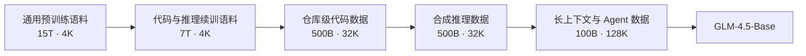
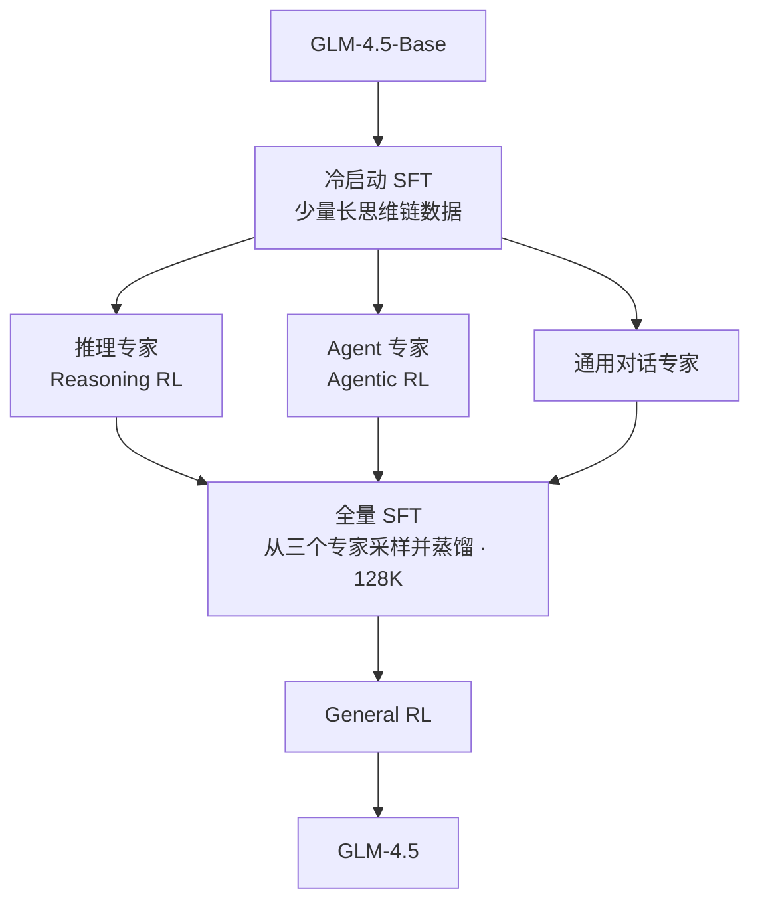
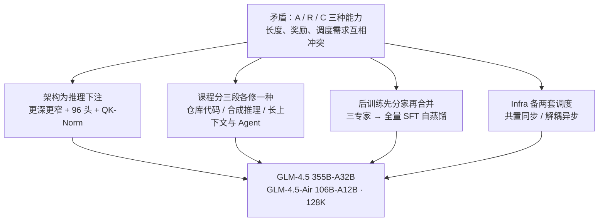

# GLM-4.5：三种能力先分开练，再蒸馏回一套权重

<!-- release-date: 2025-07-28 -->

> 本文依据 GLM-4.5 Team（Zhipu AI & Tsinghua University）发布的 **GLM-4.5: Agentic, Reasoning, and Coding (ARC) Foundation Models**，即 arXiv:2508.06471v1、2025-08-08 提交、共 26 页的版本。截至 2026-09-06 核验，arXiv 提交历史只有 v1 一个版本，本地原件即最新修订版。下文括号中的 `PDF p. N` 一律指这份 26 页原文的文件页码。文中会把「报告明确写了什么」「我们如何理解它」「外部资料补充」三层分开：外部补充都会给链接并单独标注，我们的推断都会写明是推断。

## 阅读前先搭一张最小地图

这篇报告的术语密度不算高，但下面十个名字会反复出现，先认一遍再往下读会轻松很多。

- **Token（词元）**：模型读写文本的最小单位。一个汉字、一个单词或一个符号都可能是一个 Token。
- **上下文（context）**：模型这一次能同时看见的全部内容，包括系统提示、用户消息、工具调用和工具返回。GLM-4.5 的上限是 128K。
- **MoE（Mixture-of-Experts，混合专家）**：模型里放很多组「专家」参数，每个 Token 只激活其中少数几组。总参数很大，单次计算却不大。
- **GQA（Grouped-Query Attention，分组查询注意力）**：多个 Query 头共享同一套 Key/Value，用来省 KV 缓存。
- **RoPE（Rotary Position Embedding，旋转位置编码）**：靠旋转向量来编码位置的做法。「partial RoPE」指只对每个头的一部分维度做旋转。
- **MTP（Multi-Token Prediction，多 Token 预测）**：训练时不只预测下一个 Token，还预测再往后几个。推理时这一层可以当**投机解码**的草稿模型用。
- **SFT（Supervised Fine-Tuning，监督微调）**：拿人写的或模型生成的「问题—答案」对直接训模型。
- **RL（Reinforcement Learning，强化学习）**：让模型自己产生答案或轨迹，再按结果好坏调整参数。
- **rollout（轨迹采样）**：RL 里模型实际生成的那一次完整过程。对 agent 来说，一条 rollout 可能包含几十次工具调用。
- **harness（评测脚手架）**：跑 agent 评测时套在模型外面的那层框架，负责给工具、管上下文、决定重试和步数上限。同一个模型换 harness，分数会明显变化。

还有一个词值得单独说：**蒸馏**（distillation）。它在这篇报告里出现了三次，指的都是同一件事——先用某种昂贵方式得到一个更强的模型，再让它生成数据，把这些数据喂回一个更方便的模型。区别只在「更强的模型」是谁：可能是三个专精模型，可能是 RL 训到一半的自己，也可能是某个能力上的临时专家。

## 一句话先说清

报告的标题是 "Agentic, Reasoning, and Coding (ARC) Foundation Models"。它不是一句宣传语，而是整篇报告的骨架：**Agentic（用工具与外部世界打交道）、Reasoning（多步逻辑推理）、Coding（真实软件工程）这三种能力，要住进同一套权重里。**

问题在于，这三件事的训练需求几乎处处相反。

**第一，输出长度相反。** 推理任务希望模型把思维链拉长，报告的 RL 直接把输出上限设在 64K（PDF p.8）。Agent 任务希望模型每一轮都短促、格式严格、赶快去调工具；日常闲聊更希望它一句话回完。同一套权重要同时学会「想很久」和「别想」。

**第二，奖励形状相反。** 数学题的对错可以程序化判定，一个样本一个标量奖励，干净利落。Agent 任务的奖励要等几十轮工具调用之后才知道，中间还可能因为沙箱崩了而给出与模型能力无关的失败信号。

**第三，训练系统的最优形态相反。** 推理 RL 的 rollout 长度相对整齐，把训练引擎和推理引擎放在同一批 GPU 上（共置）最省机器；agent RL 的 rollout 长尾极端，必须把两者拆开异步跑，否则大半 GPU 都在等最慢的那一条。

所以「一个模型同时做好三件事」不是把三份数据混在一起训就行。GLM-4.5 给出的答案是一条贯穿全文的方法论，报告自己给它起了名字——**Expert Model Iteration**（专家模型迭代）：

> **先让每种能力在最适合它的条件下单独练到最好，再把练出来的东西以数据的形式蒸馏回同一个模型。**

这条思路在报告里被用了三次，颗粒度一次比一次细：

1. **整体层面**：先训推理、Agent、通用对话三个专家，再用它们生成的数据做一次全量 SFT，合成一个混合推理模型（PDF p.5）。
2. **Agentic RL 内部**：RL 训到平台期，就用当前模型的输出替换掉原来的冷启动数据，得到一个更好的 SFT 起点，再接着 RL（PDF p.10）。
3. **单项能力层面**：端到端多轮函数调用先训专门的专家模型，再蒸馏进主模型（PDF p.12）。

如果只带走一句话，可以带走这句：

> **当几种能力的训练条件互相冲突时，不要在一次训练里调和它们；分开训到最好，再用蒸馏把它们接回同一套权重。**

这一代还有两个更小但很实用的判断，后面会展开：**架构上为推理下注（更深、更多头）**，以及**接口上把函数调用的 JSON 转义换成 XML 标签**。

## 先看全景

### 训练流水线



这张图按报告 Figure 3 重画（PDF p.4）。它是**阶段顺序示意**，箭头表示训练顺序与数据依赖，不表示各阶段的耗时或算力比例。节点里的 Token 数和序列长度都直接取自 Figure 3 的标注。

前两格是**预训练**，后三格是**中训练**（mid-training）。把五段加起来是 15T + 7T + 0.5T + 0.5T + 0.1T = 23.1T，正好对上摘要里的「23T tokens」（PDF p.1）。**这个拆解只有 Figure 3 里有，正文没有逐项写出来**，值得单独记一下。

序列长度的爬升是 4K → 32K → 128K。正文对应的说法是：预训练阶段最大序列长度保持 4,096，中训练里先扩到 32,768、再扩到 131,072（PDF p.5）。

### 模型配置

架构超参在 Table 1（PDF p.3）。报告特别注明了计数口径：**参数量包含 MTP 层，但不含词嵌入和输出层**（PDF p.3）。

| 配置 | GLM-4.5 | GLM-4.5-Air | DeepSeek-V3 | Kimi K2 |
|---|---:|---:|---:|---:|
| 总参数 | 355B | 106B | 671B | 1043B |
| 每 Token 激活参数 | 32B | 12B | 37B | 32B |
| 稠密层 / MoE 层 / MTP 层 | 3 / 89 / 1 | 1 / 45 / 1 | 3 / 58 / 1 | 1 / 60 / 0 |
| Hidden Dim | 5120 | 4096 | 7168 | 7168 |
| 稠密 Intermediate Dim | 12288 | 10944 | 18432 | 18432 |
| MoE Intermediate Dim | 1536 | 1408 | 2048 | 2048 |
| 注意力头维 | 128 | 128 | 192 | 192 |
| 注意力头数 | 96 | 96 | 128 | 64 |
| KV 头数 | 8 | 8 | 128 | 64 |
| 专家总数 / 每 Token 激活 / 共享 | 160 / 8 / 1 | 128 / 8 / 1 | 256 / 8 / 1 | 384 / 8 / 1 |
| QK-Norm | 是 | 否 | 否 | 否 |

这张表放在一起对照，形状差异一眼可见：**GLM-4.5 比同代的 DeepSeek-V3 和 Kimi K2 更窄、更深。** Hidden Dim 从 7168 降到 5120，专家总数从 256/384 降到 160，层数却从 58/60 涨到 89（不含 MTP）。这不是巧合，是报告明写的设计选择，下一节展开。

顺手做一次算术核对（**这是我们自己算的，报告没有给这一步**）：按表里的数字，一个 MoE 层的参数约等于 160 个专家 + 1 个共享专家 + 一套注意力，即 $160 \times 3 \times 5120 \times 1536 \approx 3.77\text{B}$ 加上共享专家 0.024B 再加注意力约 0.14B，合计约 3.94B；乘 89 层约 350B，加上 3 个稠密层和 1 个 MTP 层，总数落在 355B 附近。每 Token 只激活 8 + 1 个专家，同样口径算下来激活参数约 32B。表格自洽。

激活率是 $32/355 = 9.0\%$。作为对照，报告在引言里强调 GLM-4.5 只有 DeepSeek-R1 一半的参数、Kimi K2 三分之一的参数（PDF p.2）。

> 外部补充：报告没有给出词表大小、RoPE 的具体旋转比例和上下文窗口的配置值。官方权重的 [config.json](https://huggingface.co/zai-org/GLM-4.5/blob/main/config.json) 里可以查到 `vocab_size = 151552`、`partial_rotary_factor = 0.5`（即每个 128 维的头只有 64 维参与旋转）、`rope_theta = 1000000`、`max_position_embeddings = 131072`。这几项**只用于定位与交叉核验，不是报告的结论**。

### 两个模型，一条帕累托前沿

报告同时发布 GLM-4.5（355B 总参 / 32B 激活）和 GLM-4.5-Air（106B 总参 / 12B 激活）（PDF p.1、p.3）。Figure 2 把 SWE-bench Verified 分数和模型参数量画在一起，两个模型都落在帕累托前沿上（PDF p.2-3）——同样的分数用更少参数，或者同样的参数拿更高分数。

这是全篇最主要的自我定位：**不是最强，是同等分数下最省参数。**

## 第一部分：架构——为了推理，先把模型改深、改多头

### 更深更窄：一句话推翻了两个同代榜样的形状

**旧问题。** 2024—2025 年的大 MoE 基本都在往「宽」的方向走：Hidden Dim 7168、专家 256 到 384 个。宽的好处很实在——矩阵更大，GPU 的算力利用率更高；层数少，流水线并行的级数和跨层通信次数都少。

**新设计。** GLM-4.5 反过来：**降低宽度（隐藏维度与路由专家数），提高高度（层数）**（PDF p.2）。

**给出的理由只有一句：** 他们发现更深的模型表现出更好的推理能力（"we found that deeper models exhibited better reasoning capacity"，PDF p.2）。

**这条因果链在报告里是断的。** 没有给对照实验、没有给曲线、没有说在什么规模上试的。它是一条工程经验的陈述，不是一个被证明的结论。读的时候应该按「作者的观察」而不是「实验支持的结论」来收。

**代价是什么？** 报告没写，但可以推：层数从 58 涨到 89，流水线并行的级数变多，气泡更难压；每层的矩阵变小（Hidden Dim 5120 对 7168），单个算子的算力利用率会下降。这些都是**我们的推断**，报告完全没有讨论训练效率的代价。

**这个选择后来被自己推翻了。** 站内已经发布的 [GLM-5 解读](/reports/Z.ai/GLM-5) 记录了下一代的反转：GLM-5 的 Hidden Dim 涨到 6144、专家涨到 256，MoE 层反而从 89 降到 75，理由是**减少专家并行的通信开销**。也就是说，「深一点更会推理」的收益，在下一代被判定为不值得那份通信成本。两代放在一起看，这是同一个团队在两年内对同一个权衡给出的两个答案，很值得记住。

### 96 个头：一个「不降 loss 却涨分」的反直觉选择

**旧问题。** 注意力头数通常是「隐藏维度 ÷ 头维」。GLM-4.5 的隐藏维度 5120、头维 128，按惯例应该是 40 个头。

**新设计。** 报告用了 **2.5 倍于常规的头数**：5120 的隐藏维度配 96 个头（PDF p.3）。$96 / 40 = 2.4$，报告写作 2.5 倍。

**为什么值得单独写？** 因为报告说了一句非常反直觉的话：

> 增加头数**并不降低训练损失**，但它持续提升 MMLU、BBH 这类推理基准的表现（PDF p.3）。

这句话的分量比它的长度大得多。训练损失是预训练唯一的直接优化目标；一个改动不降 loss 却涨下游分数，等于说 **loss 和推理能力之间不是单调关系**。如果只按 loss 做架构搜索，这个设计会被直接淘汰。

**工作机制上我们能说什么？** 报告没有给解释。我们的理解是：更多的头意味着注意力可以同时维持更多组独立的「查询视角」，每一组视角管一类关系。语言建模的平均困惑度主要由高频的局部模式决定，多几个视角对它帮助不大；而多步推理需要同时追踪多条线索，视角数就变成瓶颈。**这是我们的解释，不是报告的论证。**

**代价是明确的。** 96 个头 × 128 维 = 12288，比隐藏维度 5120 大 2.4 倍。这意味着 Q 投影是 5120→12288、输出投影是 12288→5120，注意力部分的参数量和计算量都按这个倍数放大。按前面的算术，一个 MoE 层里注意力约占 0.14B 参数，其中绝大部分就来自这两个大投影。**这个代价报告没有量化。**

**可迁移的一条：** 当你在做架构消融时，如果某个改动 loss 不动，别急着丢掉它——先在几个真正关心的下游任务上量一次。反过来也成立：loss 降了不等于下游会涨。

### 三个稳定与提速的配件

报告在同一段里还列了三项，都是「拿来即用」的成熟件（PDF p.2-3）：

**GQA 加 partial RoPE。** 注意力用分组查询注意力，96 个 Query 头共享 8 组 Key/Value。按 Table 1 的数字，每层每 Token 的 KV 缓存是 $8 \times 128 \times 2 = 2048$ 维。partial RoPE 指只对头维的一部分施加旋转，报告没有给比例（外部权重配置里是一半，见前面的补充）。

**QK-Norm。** 在算注意力分数之前，对 Query 和 Key 各做一次归一化，**稳定注意力 logits 的取值范围**（PDF p.3）。注意 Table 1 里只有 GLM-4.5 开了 QK-Norm，GLM-4.5-Air 没开——同一家族的两个模型在这一项上不一致，报告没有解释原因。

这一项值得多说一句，因为它和优化器有关。Kimi K2 报告过 Muon 优化器比 AdamW 更容易把注意力打分推到极端，为此设计了 QK-Clip 直接改权重来压住（见站内 [Kimi K2 解读](/reports/Moonshot/Kimi-K2)）。GLM-4.5 同样用 Muon，选的是 QK-Norm 这条更常规的路。**报告没有把这两件事联系起来，这个关联是我们补的。**

**MTP 层。** GLM-4.5 和 Air 都加了一个 MoE 层作为 MTP 层，**用来在推理时支持投机解码**（PDF p.3）。

投机解码的做法是：让一个便宜的草稿模型先猜出接下来几个 Token，主模型一次性验证，猜中的直接采用。MTP 层就是这个草稿模型。

**这里有一个明显的缺口：** 报告只说了「加了 MTP 层来支持投机解码」，**没有给任何接受率、加速比或部署配置**。整篇报告也没有推理部署章节。想知道这一层实际值多少钱，从这份报告里查不到。

## 第二部分：数据与课程——ARC 三件事在中训练里各占一段

### 预训练：22T Token，两个阶段

预训练语料来自网页、社交媒体、书籍、论文和代码仓库（PDF p.3）。整个预训练分两阶段（PDF p.4）：

- **第一阶段**主要训通用文档，以网页为主；
- **第二阶段**上采样 GitHub 源码，以及与编程、数学、科学相关的网页。

对照 Figure 3，这两段分别是 15T 和 7T（PDF p.4）。

### 四类语料各自的处理办法

**网页（占大头）。** 借鉴 Nemotron-CC，把抓来的网页按质量分打进不同的桶，高分桶上采样、最低分桶直接丢弃。**最高质量的那个桶在预训练里贡献了超过 3.2 个 epoch**（PDF p.4）。

这个做法的意图报告写得很清楚：既让语料强调推理任务需要的高频知识，又保住长尾世界知识的覆盖。

真正有意思的是接下来那个坑：他们发现**大量由模板自动生成的相似网页会拿到高分**，而且 MinHash 去重删不掉它们（PDF p.4）。原因不难想——MinHash 比对的是字面重合，模板页面的骨架相同但填充内容不同，字面重合度可能不够高。于是他们额外跑了 SemDedup，按文档向量的语义相似度再去一遍重。

> **可迁移的一条：质量分类器和去重是两件事，而且会互相打架。** 一个只看「像不像高质量文本」的分类器，恰恰会喜欢结构工整的模板页。字面去重挡不住它们，必须上语义去重。

**多语言。** 语料来自自己抓的网页加上 Fineweb-2，用一个判断「教育价值」的质量分类器筛选并上采样高质量文档（PDF p.4）。

**代码。** 流程比其他几类都长（PDF p.4）：

1. 先做基于规则的初筛；
2. 用**分语言**的质量模型把样本分成高、中、低三档，上采样高质量、直接排除低质量；
3. 所有源码都用 **FIM（Fill-In-the-Middle，中间填空）** 训练目标——不只是从左往右续写，还要根据前后文补中间那段。这正是编辑器里「在函数中间补一行」的形态；
4. 代码相关的网页文档单独走一条两阶段检索：先按「含 HTML 代码标签」或「被 FastText 分类器判为代码相关」召回，再用专门的质量模型分三档；
5. 最后用一个细粒度解析器**重新解析**选中的网页，尽量保住代码的格式和内容。

第 5 步容易被跳过，但它是这条流水线里最实际的一环——网页转纯文本时最容易毁掉的就是缩进和换行，而缩进在 Python 里是语法。

**数学与科学。** 用一个大语言模型给候选文档打分（打的是「数学科学教育内容的占比」），再训一个小分类器去预测这个分数，最后把预训练语料里分数超过阈值的文档上采样（PDF p.4）。

这是一个标准的「用大模型标注、用小模型规模化」的模式：大模型贵但准，小模型便宜，先用大模型造几万条标注，再让小模型跑完几十亿篇文档。

### 中训练：1.1T Token，三段各修一种能力

报告自己给出了中训练的定义（PDF p.4）：不同于在大规模通用文档上的传统预训练，这些阶段使用**中等规模的领域数据集，包含指令数据**。

三段的分工，正好对着 ARC 的三个字母：

**第一段，仓库级代码训练（500B，32K）——对应 Coding。** 把同一个仓库里的代码文件拼接起来，让模型学**跨文件依赖**。除此之外还加了经模型筛选的 GitHub issue、PR 和 commit，把相关的 issue、PR、commit **拼进同一个上下文**，commit 用 diff 格式组织（PDF p.4-5）。序列长度从 4K 扩到 32K，就是为了塞得下大仓库。

这一段的针对性非常强。SWE-bench 这类任务的形态就是「给一个 issue，在一个真实仓库里改代码」，而这段数据几乎是它的训练态镜像。

**第二段，合成推理数据训练（500B，32K）——对应 Reasoning。** 从网页和书里收集数学、科学、编程竞赛的问答，**用一个推理模型把中间的推理过程合成出来**（PDF p.5）。

注意这里的信息结构：题目和答案是真的，中间的推理过程是生成的。所以这段数据教的不是「知识」，而是「把已知答案的题目怎么一步步推出来的形态」。

**第三段，长上下文与 Agent 训练（100B，128K）——对应 Agentic。** 序列长度从 32K 扩到 128K，上采样预训练语料里的长文档，同时加入**大规模合成 agent 轨迹**（PDF p.5）。

三段读下来，中训练的角色就很清楚了：**预训练负责通用能力，中训练负责把 ARC 三种能力的「形态」灌进基座**。它不是简单的领域续训，而是有明确目标结构的课程。

### packing 的一个反常识选择

报告专门解释了一个细节（PDF p.5）：

- **预训练阶段不用 best-fit packing**，因为随机截断对预训练文档来说是一种很好的数据增强；
- **中训练阶段用 best-fit packing**，为的是不把推理过程或仓库级代码从中间截断。

packing 是把多条短样本拼进一条定长序列以免浪费算力；best-fit packing 会尽量避免把一份文档切开。这两句话合起来是一条很干净的原则：

> **当样本的价值在于「完整性」时，才需要保护边界；当样本本身就是海量同质文本时，切断反而是免费的增强。**

一段推理链被从中间截掉，剩下的半截就是错的；一篇网页被截掉，剩下的半截仍然是合法的语言。

## 第三部分：超参——Muon，以及两个会中途换值的旋钮

§2.4 只有一页，但密度很高（PDF p.5）。

### Muon

**优化器用 Muon**，作用于除词嵌入、bias 和 RMSNorm 权重之外的全部参数。三个超参写得很具体：Newton-Schulz 迭代步数 $N = 5$、动量 $\mu = 0.95$、**Muon 的更新 RMS 缩放到 0.2**。

Muon 的做法是：先累积动量，再把二维权重矩阵的更新方向做近似正交化，让矩阵各个方向的更新尺度更均衡。报告给出的收益是两条：**加速收敛，并且能容忍更大的批量**（PDF p.5）。

「容忍更大批量」这一点值得留意——它直接解释了后面的批量预热策略为什么敢一路涨到 64M Token。站内已有 [Muon is Scalable for LLM Training 的解读](/reports/Moonshot/Muon-is-Scalable-for-LLM-Training)，那篇讲的正是把 Muon 规模化需要补的两个前提（权重衰减与更新尺度对齐），而「更新 RMS 缩放到 0.2」就是后者的具体取值。GLM-4.5 报告引用了这篇工作（PDF p.5，引 [24]）。

**报告没有写的是正交化的粒度**——是把 Q/K/V 投影各当成一整块矩阵做正交化，还是按注意力头拆开分别做。这一项在 GLM-4.5 报告里完全没有提，只有下一代的 GLM-5 报告回过头来描述过。后面「引用 GLM-4.5 的数字时要注意什么」一小节会专门说明。

### 为什么放弃 WSD

学习率用**余弦退火**，而不是当时流行的 WSD（warmup-stable-decay，预热—稳定—衰减）。

理由是一句实验观察：用 WSD 训出来的模型在通用基准（SimpleQA、MMLU）上更差，**说明稳定阶段欠拟合**（PDF p.5）。

这是一条有价值的负面结果。WSD 的卖点是「稳定段可以随时切出一个中间检查点继续训」，代价是稳定段的学习率不降，模型可能一直没收敛进去。GLM-4.5 用整个训练过程换了这份灵活性。

具体数值：学习率从 0 预热到 **2.5e-4**，再衰减到 **2.5e-5**，一直用到中训练结束（PDF p.5）。注意衰减是跨越预训练和中训练一路走完的，不是每个阶段各来一次。

### 批量预热与正则

**批量从 16M Token 逐步涨到 64M Token，在前 500B Token 里完成，之后保持不变**（PDF p.5）。

批量预热的逻辑是：训练早期梯度噪声本来就大，小批量既省算力又不损失什么；等模型稳定下来，大批量才能换到更好的并行效率。

正则化只有一条：**权重衰减 0.1，不用 dropout**（PDF p.5）。

序列长度扩到 32K 时，**RoPE 的基频从 10,000 调到 1,000,000**（PDF p.5）。这是长上下文的标准操作：基频越大，位置编码的旋转周期越长，模型才不会在长序列上把远处位置绕回到近处。

### 两个会中途换值的旋钮

这两条是本节最有信息量的部分，因为它们暴露了训练过程中的阶段划分（PDF p.5）：

**负载均衡的 bias 更新率**：**前 15T Token 设成 0.001，之后设成 0.0**。

这里的机制是 loss-free balance routing（无辅助损失负载均衡）：给每个专家维护一个可调的偏置项，哪个专家被选得太少就把它的偏置调高一点，从而不必往损失函数里加辅助项。把更新率设成 0 意味着**从第 15T Token 起，专家的负载分布被冻结了**。

我们的理解是：训练后期路由已经稳定，继续微调偏置只会引入额外扰动；而这时候模型正在学更难的代码与推理语料，路由的稳定性比均衡性更重要。**这是我们的解释，报告只给了数值。**

另外还叠了一个**序列级的辅助均衡损失，权重 0.0001**，目的是避免任何单条序列内部出现极端不均衡（PDF p.5）。注意这两者的分工：全局均衡靠无损失的偏置，单序列内的极端情况靠一个极小权重的辅助损失兜底。

**MTP 的损失权重 $\lambda$**：**前 15T Token 是 0.3，之后是 0.1**。

两个旋钮都在 15T 处换值，而 Figure 3 里通用预训练语料正好是 15T（PDF p.4）。所以 15T 就是「通用阶段结束、代码与推理阶段开始」的那条线。MTP 权重减小意味着后期把更多梯度让给主任务。**这个对应关系是我们从两处数字里读出来的，报告没有明说。**

## 第四部分：后训练——「专家模型迭代」是全文真正的方法论



这张图根据 §3 的文字重画（PDF p.5、p.10-12），是**流程机制示意**，不表示各阶段的数据量或耗时。报告没有给这个流程的原图。

### 两阶段：先分家，再合并

报告把后训练明确分成两段（PDF p.5）：

- **阶段一（Expert Training，专家训练）**：构造三个专精模型，分别负责 Reasoning、Agent、General chat。
- **阶段二（Unified Training，统一训练）**：用**自蒸馏**把多个专家整合起来，最终交付一个既能深思、也能直答的模型。

两个阶段的开头都做 SFT，但目的完全不同（PDF p.5）：

- 专家训练里的 SFT 是**冷启动**，给模型基本的对话、推理和工具使用能力，好让后面的专家 RL 有东西可以优化；
- 统一训练里的 SFT 是**蒸馏**，把不同专家的能力压进一个混合推理通才。

### 混合推理是怎么被「配」出来的

全量 SFT 阶段收集了数百万条样本，覆盖推理任务（数学、代码、科学）、通用对话（写作、翻译、摘要、闲聊）、agent 任务（基础工具使用，以及面向真实项目开发的编码能力）和长上下文理解，**最大上下文 128K**（PDF p.6）。

关键的一句在后面：

> 考虑到某些需要快速响应的领域（比如闲聊）不需要冗长的思考过程，我们**仔细平衡了「带完整推理」和「不带显式思考过程」两类训练数据**（PDF p.6）。

也就是说，**混合推理不是一个架构特性，是一个数据配比问题。** 模型学会「什么时候该想、什么时候该直接答」，靠的是这两类数据的比例，而不是某个开关模块。

这一点很值得记：**当你希望模型具备某种「按情况切换行为」的能力时，先问它能不能表达成训练数据的配比，而不是先去加结构。**

### 函数调用模板：把 JSON 转义换成 XML 标签

这是全篇最小、也最好抄的一个改动（PDF p.6）。

**旧问题。** 现在的函数调用参数基本都用 JSON 表示。但如果参数里装的是**代码**，麻烦就来了：代码里的引号、反斜杠、换行全都要转义，模型得生成一大堆 `\"`、`\\n`。报告的说法是这**增加了模型的学习负担**。对通用聊天模型来说这不算什么，但对一个把函数调用当核心能力的 agent 基座来说，这是个不小的问题。

**新设计。** 用一套 XML 风格的特殊 token 标签把函数调用的键和值包起来。Figure 4 给了完整例子（PDF p.6-7），核心形状是：

```
<tool_call>get_weather
<arg_key>city</arg_key>
<arg_value>Beijing</arg_value>
<arg_key>date</arg_key>
<arg_value>2024-06-27</arg_value>
</tool_call>
```

**工作机制。** 值被夹在 `<arg_value>` 和 `</arg_value>` 之间，边界由标签决定，不再由引号决定。所以值里面的引号、反斜杠、换行都可以原样写出来。报告的说法是「绝大多数代码可以用原生形式表示而无需转义」（PDF p.6）。

**收益。** 报告给的是一个否定式结论：实验表明这套模板**不损害函数调用的执行表现，同时减少了转义**（PDF p.6）。注意措辞——它没有声称提升了分数，只声称没有变差。

**代价与边界。** 这套模板需要模型在训练时就见过这些特殊 token，换模型就得换模板；而且它偏离了 OpenAI 风格的 JSON 约定，接入现成的 agent 框架时需要一层适配。报告没有讨论这两点，是我们补的。顺带一提，Figure 4 的例子里 `<think>` 块和 `<tool_call>` 块是并排出现的，这也就是混合推理在模板层面的样子。

**可迁移的一条：** 如果你的模型要频繁输出结构化内容而内容本身又是代码或富文本，先检查一下「表示格式的转义成本」这一项。它不改模型能力，但直接改模型每次要多生成多少 Token。

### 三个提数据质量的做法

**拒绝采样**（PDF p.7）。从专家模型采样时用一条多级过滤流水线：(1) 删掉重复、过短、被截断，以及不符合有效推理格式的样本；(2) 对有客观答案的样本做正确性校验；(3) 用奖励模型过滤主观题的回答；(4) 对工具调用场景，检查是否遵守了正确的调用协议，并**验证轨迹是否到达了预期的终止状态**。

第 4 条里的「终止状态」是 agent 数据特有的：一条轨迹可能每一步的格式都对，却根本没把事情做完。

**提示筛选与回答级扩展**（PDF p.7）。这是全报告少数几个给了量化收益的 SFT 技巧：

- 把**按回答长度排在后 50% 的提示删掉**，结果是数学和科学任务上 **2%–4% 的提升**，而且只用了一半数据；
- 在剩下的困难提示上**每题生成四个回答**，再带来 **1%–2% 的额外提升**。

第一条的逻辑很有意思：**回答长度被当成难度的代理指标。** 模型回答得短，多半是题目简单；简单题的 SFT 数据既不涨能力，还占预算。用一个几乎免费的信号（长度）替代昂贵的难度标注，这个技巧可以直接搬走。

**代价**：报告没有说这个 2%–4% 是在什么基线、什么规模的模型上测的，也没说「回答长度」是用哪个模型采样得到的。

**自动构造 agent SFT 数据**（PDF p.7）。四步：

1. **收集框架与工具**：收集 agent 框架、真实世界的工具 API 与 MCP server，同时用大模型自动构造和模拟一批工具；
2. **合成任务**：对成熟框架，让大模型理解其功能后自动生成相关查询；对零散工具，先选一个有代表性的子集再造任务。任务同时覆盖单步与多步调用；
3. **生成轨迹**：用已有大模型生成工具调用轨迹；再让大模型**扮演用户模拟器**，把多步任务转成多轮对话；
4. **质量过滤**：用**多个裁判 agent** 判断任务是否完成，只保留成功的轨迹。

值得注意的是第 1 步里「用大模型自动构造和模拟一批工具」——连工具本身都是造的。这解决了 agent 数据最现实的瓶颈：真实可调用的工具数量远远不够训练规模。

## 第五部分：Reasoning RL——四条能直接抄的经验

算法底子是 **GRPO**（Group Relative Policy Optimization，组相对策略优化），**去掉了 KL 损失项**（PDF p.7）。GRPO 的做法是对同一个问题采样一组回答，用组内奖励的相对高低算优势，不需要单独的价值网络；它的出处见站内 [DeepSeekMath 解读](/reports/DeepSeek/DeepSeekMath)。

**在往下读之前，先记住报告自己写的一句边界（PDF p.7）：**

> 本节展示的对比曲线基于我们**更小的实验模型**，不是 GLM-4.5。

这句话管着接下来的 Figure 5、6、7 全部四组实验。它们证明的是「这些技巧在小规模上有效」，不是「它们在 355B 上贡献了多少分」。**报告没有给出任何一项在 GLM-4.5 本体上的消融。**

### 难度课程：让奖励重新有方差

**旧问题**（PDF p.7-8）。RL 训练中模型能力在变，训练数据却是静态的。后期模型变强，简单题会让一整组 rollout 的奖励全是 1；早期模型太弱，难题会让一整组奖励全是 0。**两种情况都没有奖励方差，也就没有梯度信号。**

这一点是 GRPO 这类组相对方法的结构性弱点：优势是「本组内相对好坏」，全对和全错都会让优势归零。

**新设计。** 两阶段难度课程：第一阶段用中等难度数据（每题采样 16 条），第二阶段换成**极难数据**（每题采样 512 条）。第二阶段的「极难」有明确定义——**pass@8 = 0 但 pass@512 > 0**（PDF p.8，图 5）。

这个定义很讲究：pass@8 = 0 保证题目对当前模型足够难，pass@512 > 0 保证它不是无解的。**在 512 次采样里能中至少一次**，就意味着这道题仍能提供正的奖励方差。

**结果。** Figure 5 显示基线（一直用中等难度）在 AIME'24 Avg@32 上大约 81.8% 就走平了，而切换到极难数据的那条线继续爬到 **83.4%**（PDF p.8）。报告还补了一条数据卫生要求：第二阶段的题目**全部来自答案经过验证的题库**（PDF p.8）。

**代价报告没算。** 每题采 512 条，是第一阶段的 32 倍。这是一个非常昂贵的第二阶段，报告完全没有讨论它的算力成本。同样没写的还有：第二阶段的题目池有多大、pass@512 的筛选本身要花多少采样。

**可迁移的一条：** 组相对 RL 的数据难度必须跟着模型走。判断标准不是「题目难不难」，而是「**这一组采样里还有没有对错混合**」。用 pass@k 定义难度带，比用人标难度靠谱得多。

### 直接在 64K 上做单阶段 RL

**旧问题。** 已有研究（报告引 DeepScaleR）建议分多个阶段做 RL，逐步提高最大输出长度：16K → 32K → 48K → 64K（PDF p.8）。

**报告的实验结论是反的。** 因为 SFT 已经把模型调教成能生成 64K 长度的回答了，再引入更短上限的 RL 阶段会让模型**遗忘掉它已经学会的长上下文能力**：平均输出长度下降，性能出现「显著且不可逆」的下滑，到最后的 64K 阶段也补不回来（PDF p.8）。

**结果。** Figure 6 里，单阶段直接在 64K 上做 RL 得到 **83.4%**，多阶段渐进式只有 **80.6%**（PDF p.8）。而且看曲线，单阶段那条线**从一开始就在上面**，不是后期才反超。

**这里的因果链值得完整走一遍：** SFT 决定了模型的输出长度分布 → 短上限的 RL 会惩罚长输出 → 模型缩短输出 → 长思维链能力退化 → 后面放开上限也回不去。问题的根源不是「RL 分几个阶段」，而是「**课程的某一段与前一阶段的能力不兼容**」。

**边界。** 这个结论依赖「SFT 已经在 64K 上训过」这个前提。如果冷启动模型本来就不会生成长回答，渐进式课程可能仍然是对的。报告没有讨论这个条件。

### 动态采样温度

**旧问题**（PDF p.9）。采样温度控制 rollout 的多样性：太低则输出趋同、探索不足，太高则引入低质量噪声样本。用固定温度的问题在于，**随着策略分布变得越来越集中（熵下降），同一个温度带来的实际多样性在持续减少**，后期探索就不够了。

**新设计。** 动态调整：当 rollout 的平均奖励趋于稳定，就判定进入了收敛期，**提高采样温度**来鼓励多样性。

**配套的质量控制。** 光提温度会引入噪声，所以他们加了一道闸门：定期在留出验证集上跨一组温度评测模型，下一阶段的温度取「**相比当前最优不掉超过 1% 的最大温度**」（PDF p.9）。

这是一个很干净的「贪心地往探索方向走，但不允许越过一条明确的红线」的设计。红线用的是可测量的验证分数，不是拍脑袋。

### 代码 RL 与科学 RL 的两个消融

报告说数学之外的 RL 在文献里关注得少，于是各做了一组对照（PDF p.9）：

**代码 RL：损失怎么算比想象中重要。** 对比 **token 加权平均损失**和常规的**序列平均损失**。Figure 7 左显示，token 加权那条线在约 1500 步就到了 **46.5%**，序列平均那条线要到约 2500 步才到 **46.3%**（PDF p.9）。

**要诚实地读这张图：终点几乎一样（46.5 对 46.3），赢的是速度不是上限。** 报告自己的措辞也是「收敛更快，加速训练过程」，没有声称更高的天花板。

报告给的机制解释是：token 加权提供更细粒度、更稳定的梯度信号，并且能**缓解序列级奖励里固有的长度偏置**，抑制训练中生成过于简单或重复的「base case」样本（PDF p.9）。

序列平均的长度偏置很容易理解：一条 1000 token 的回答和一条 100 token 的回答，如果损失都按序列平均，那么长回答里每个 token 分到的权重只有短回答的十分之一。模型于是学会把回答写短——在代码任务里，「写短」的极端形态就是只处理边界情况的 `base case`。

**科学 RL：数据质量压倒一切。** 在 GPQA-Diamond 上对比两种 RL 数据源：只用**专家验证过的选择题**，对比**混合质量的科学数据**。Figure 7 右显示前者到 **65.8%**，后者只有 **62.9%**（PDF p.9）。

报告的结论写得很直接：即便是选择题这种格式简单的任务，**严格筛选 RL 数据池、只留高质量困难样本，也是有效提升的关键**（PDF p.9）。

**这两组消融合起来说明了一件事：** RL 阶段的瓶颈往往不在算法，而在「损失怎么聚合」和「数据怎么筛」这两个看起来很工程的地方。

## 第六部分：Agentic RL——可验证性决定了做什么

### 为什么只挑了两类任务

报告的选择逻辑写得非常清楚（PDF p.9）：RLHF 让模型更听话，把 RL 用在数学和编程竞赛上又挖出了强推理能力和好的规模化行为，**共同点是结果可以被客观验证**。于是他们把 agent RL 聚焦到两类场景——**网页搜索**和**代码生成**——因为这两类里**每一个动作或答案都能被自动检查**。这种内建的可验证性提供了密集、可靠的奖励，才能把 RL 规模化。

这是一条很硬的取舍：**不是挑最有商业价值的 agent 任务，是挑能自动判分的 agent 任务。** 其余的 agent 能力（比如复杂的多轮业务流程）只能靠泛化，或者靠后面 General RL 里的函数调用 RL 单独补。

### 数据从哪来

**网页搜索**（PDF p.10）。目标是造出「需要跨多个网页做多步推理」的难题。两条路线混合：

1. **自动化流水线**：在知识图谱上做多跳推理，把一条多跳路径转成一个问题；
2. **人在环中**：从若干网页里抽取内容并做**选择性混淆**，制造检索训练信号。

「选择性混淆」是这里的关键手法——把问题里的关键实体换成间接描述，逼模型必须真的去搜，而不能靠记忆直接答。

**软件工程**（PDF p.10）。收集大量 GitHub 的 PR 和 issue，做成一个由用户提示加**可执行单元测试**组成的真实软件开发基准。所有评测跑在一个**加固过的沙箱**里，底层是分布式系统，同时提供横向扩展能力和强隔离保证。

「强隔离」在这里不是安全话术：RL 会让模型尝试各种奇怪操作，没有隔离，一条 rollout 就能污染整个训练集群。

### 目标函数：一个被削到只剩骨架的组相对策略

报告用的是组式策略优化（PDF p.10）。对每个问题 $x$，从旧策略 $\pi_{\text{old}}$ 采样 $K$ 条 agent 轨迹 $\{y_1,\dots,y_K\}$，优化目标是：

$$L_{\text{RL}}(\theta) = \mathbb{E}_{x\sim\mathcal D}\left[\frac{1}{K}\sum_{i=1}^{K}\left(r(x,y_i)-\bar r(x)\right)\right]$$

其中 $\bar r(x)=\frac1K\sum_{i=1}^K r(x,y_i)$ 是这一组回答的平均奖励。

先说这个式子在算什么：**每条轨迹的奖励减去本组平均奖励，就是它的优势**。比同组平均好的被推高，比平均差的被压低。不需要价值网络，也不需要绝对的奖励尺度——只要组内能分出高低就行。

比起标准 GRPO，这里**没有除以组内标准差、没有 KL 正则、没有写出 PPO 的重要性比与裁剪项**。报告只给了这一个式子，没有说明这些项是被省略了还是被有意去掉了。**这是一处明确的信息缺口**，读的时候不要假设它等价于某个已知算法。

后面紧跟着一句很重要的实现细节（PDF p.10）：

> **只有模型生成的 token 参与优化，环境反馈在损失计算中被忽略。**

这句话必须理解到位。一条 agent 轨迹里既有模型写的内容（思考、工具调用），也有环境返回的内容（工具结果、报错、用户模拟器的话）。后者不是模型的动作，如果也算进损失，模型就会去「学着预测工具会返回什么」——那不是我们想优化的策略。

### 过程格式惩罚：一个非常严厉的闸门

**奖励设计**（PDF p.10）：网页搜索用**最终答案的正确性**作为整条轨迹的奖励；代码 agent 主要用**带可验证测试用例的 SWE 数据**。

在此之上加了一道**过程格式惩罚**：如果模型在生成轨迹的过程中没能产出正确的工具调用格式，**整个过程立即中止，这条轨迹拿零奖励**（PDF p.10）。

这是一个非常严厉的设计。不是扣分，是清零加中止。它的效果是把「输出格式正确」变成一切奖励的前置条件——模型不可能靠内容好来补偿格式错。

报告还给了一条泛化观察：**在网页搜索和 SWE 任务上做 RL，会带来其他任务与基准上的普遍提升**，比如通用工具使用和 Terminal-Bench 这类编码任务（PDF p.10）。这是这一节最重要的收益陈述，但它是一句观察，报告没有给对照实验来支撑「泛化」的幅度。

### 迭代自蒸馏：把 RL 的成果固化成新的起点

**旧问题。** agent 任务上的 RL 非常慢（PDF p.10）。一条 rollout 要跑几十轮工具调用和沙箱执行，同样的墙钟时间里能走的梯度步数远少于普通 RL。

**新设计**（PDF p.10）：

1. 先在初始的冷启动模型上做 RL，把 agent 性能提上去；
2. 训到一定步数或走平之后，**用 RL 模型生成的回答替换掉原来的冷启动数据**，做一次自蒸馏，得到一个更好的 SFT 模型；
3. 在这个增强后的模型上继续 RL，并**逐步提高训练难度**；
4. 循环。

**工作机制。** RL 的产出是一个更好的策略，但这个策略是「一步步爬上去的」，很难继续快速爬。把它的输出蒸馏成 SFT 数据再重训一遍，等于**用便宜的监督学习把 RL 辛苦挣来的行为一次性固化下来**，然后从一个更高的起点重新开始爬。

这就是「Expert Model Iteration」在单个专家内部的形态：**RL 负责探索，SFT 负责固化，两者交替。**

**代价。** 每一轮都要完整重训一次 SFT；而且自蒸馏会放大模型自己的偏好，多轮之后多样性可能持续下降。报告没有讨论后一点。

### 交互轮数是 agent 的 test-time scaling

推理模型的 test-time scaling 是「多生成 token」，agent 的对应物是什么？报告给出的答案是**多和环境交互几轮**（PDF p.10）：比如为了找一条难找的网页信息反复搜索，或者为编码任务写测试来自我验证和自我纠正。

Figure 8 是这个论点的证据（PDF p.11）：横轴是交互轮数（对数刻度，从 8 到 128），纵轴是 BrowseComp 准确率。曲线从 8 轮时的约 4% 一路平滑上升，到接近 100 轮时达到 26% 附近——正好对上 Table 3 里 GLM-4.5 的 BrowseComp 分数 26.4（PDF p.15）。

**这张图的价值在于它是平滑的。** 没有拐点，没有饱和，说明在这个区间里「多给轮数」始终有效。**但也要注意**：报告没有给出更高轮数（比如 256、512）的数据，所以饱和点在哪里不知道；也没有给出每一轮的时间与 Token 成本。

**可迁移的一条：** 评估一个 agent 时，只报「准确率」是不完整的，必须同时报「在多少轮预算下」。同一个模型，8 轮和 96 轮之间差了 6 倍分数。

## 第七部分：General RL——把剩下的坑一个个填

General RL 是后训练的最后一段，目标是整体提升、修补潜在问题、强化关键能力（PDF p.10）。核心是一个**多源反馈系统**，把三类反馈拧在一起（PDF p.10）：

| 反馈来源 | 优势 |
|---|---|
| 规则反馈 | 自动化规则的精确性 |
| 人类反馈（RLHF） | 人类标注者的细腻判断 |
| 模型反馈（RLAIF） | AI 评估的可扩展性 |

四个子任务各管一摊：

**Holistic RL（整体 RL）**（PDF p.11）。先构造一个**约 5,000 条提示**的均衡数据集，覆盖 **7 个一级、33 个二级、139 个三级**类目。奖励来自人类和 AI 两侧：人类侧训一个偏好奖励模型，标注者按指令跟随、安全性、事实正确性等多个维度比较回答；模型侧则**按提示有没有客观标准答案设计两套不同的评分细则**。

最后一点是这段里最实用的：**有标准答案的题和开放题不该用同一套评分标准**。前者可以直接判对错，后者只能按维度打分。

**指令跟随 RL**（PDF p.11）。建了一个细粒度的约束类型体系：**7 个大类、151 个小类**，覆盖内容要求、格式规则等。再按这个体系组装一套覆盖每种约束类型的困难指令训练集。反馈系统由三部分组成——**确定性验证规则 + 训练好的奖励模型 + 一个批评模型**。

Figure 9 是这一项的训练曲线（PDF p.11）：SysBench-ISR 从 **64.8** 一路涨到约 1000 步时的 **77.2**，奖励从 -0.5 涨到 2.0，两条曲线同步上升。报告的结论措辞很克制：

> 直到大约 1,000 个训练步为止，**我们没有观察到明显的奖励作弊迹象**（PDF p.11）。

注意这是一个「在这个窗口内没看到问题」的陈述，不是「不会发生」。报告把混合反馈系统的鲁棒性归为原因——规则、奖励模型和批评模型三者互相牵制，模型很难同时骗过三个。

**函数调用 RL**（PDF p.11-12）。拆成两半：

*分步规则 RL*：对工具调用流程明确的任务，给训练数据里每一步/每一轮标注真值函数调用。给定任务和之前各步的调用，模型要生成下一个助手回复。奖励是严格的 0/1：

$$\text{Reward}=\begin{cases}1, & \text{若 } \texttt{FormatCorrect}(a_t)\ \text{且}\ \texttt{Match}(a_t, a_t^{*})\\ 0, & \text{否则}\end{cases}$$

$a_t$ 是模型生成的第 $t$ 次函数调用，$a_t^{*}$ 是对应的真值。只有格式正确、**并且与真值完全一致**（包括名称、参数和每一个字段）才给 1 分（PDF p.12）。报告说这条严格规则不仅教模型调用正确，还**强力约束了输出格式**。

*端到端多轮 RL*：分步规则 RL 的问题是它把任务拆成了静态的、预先确定的决策流，模型没有和环境的动态交互，不能自主探索、规划或处理复杂情况（PDF p.12）。所以再加一层：模型先生成完整轨迹，再按任务是否完成给奖励。

$$\text{Reward}=\begin{cases}1, & \text{若格式全部正确 且 } \texttt{TaskCompleted}(I, o_0, a_1, o_1, \dots, a_T, o_T)\\ 0, & \text{否则}\end{cases}$$

其中 $I$ 是原始复杂任务，$a_t$ 是第 $t$ 次函数调用，$o_t$ 是工具反馈或用户信息。任务是否完成由环境按预定义规则判定，或者由一个 LLM 裁判 agent 判定（PDF p.12）。

覆盖两类任务：**单轮多步**（用基于 MCP server 自动合成的复杂任务，以及 AgentGym 这类带可运行环境的开源 agent 数据集）和**多轮多步**（除了和工具环境交互，还要和一个 LLM 模拟的用户 agent 交互来获取完整任务信息）。

这里还藏着「Expert Model Iteration」的第三次出现：报告说端到端多轮 RL 是**先训专门的专家模型，再把这些专家蒸馏进主模型**（PDF p.12）。而分步规则 RL 因为输出长度和收敛速度与其他任务相近，**直接并进了通用 RL 框架**。也就是说，是否需要「先分家再合并」，判据是**这个任务的 rollout 形态与其他任务差多远**。

**Pathology RL（病理 RL）**（PDF p.12）。作为后训练的最后一步，专门修一类问题：语言混杂、过度重复、格式错误。

**旧问题很有意思：这些毛病的发生率太低了。** 报告写「往往不到输出的 1%」，所以在通用 RL 任务里顺带惩罚它们是一种**样本效率极低**的优化——1000 条 rollout 里可能只有几条能提供有用的梯度。

**新设计**：单独收集一批**极易触发这些病理行为的提示**，构成专门数据集，在上面集中施加惩罚。

> **可迁移的一条：当一个问题的发生率很低时，不要在通用数据上等它出现，去构造一个专门放大它的数据集。** 这条原则在评测、测试、数据标注上都成立。

## 第八部分：RL 基础设施 slime——同步与异步都要

RL 基础设施建立在 **slime** 上，是他们自己开发的开源框架（PDF p.12，脚注给出仓库 [THUDM/slime](https://github.com/THUDM/slime)）。

Figure 10 给了三个核心模块（PDF p.13）：

- **Training（Megatron）**：负责主训练流程，从 Data Buffer 读数据，训完后与 rollout 模块同步参数；
- **Rollout（SGLang + Router）**：生成新数据，包括奖励和验证器输出，写进 Data Buffer；
- **Data Buffer**：桥接模块，管理提示初始化、自定义数据和 rollout 生成策略。

### 两种调度模式，对应两类任务

这是本节最重要的设计（PDF p.13）。同一套系统同时支持：

- **共置 + 同步模式**：训练引擎和推理引擎住在同一批 worker 上；
- **解耦 + 异步模式**：rollout 组件直接暴露给 agent 环境，训练和推理的 GPU 独立调度。

**为什么要两套？** 因为不同 RL 任务的最优调度不一样：

> 对通用 RL 任务或以提升推理能力为目标的任务（如数学和代码生成），**同步共置架构更有效**。训练和推理引擎在同一个 worker 上，配合动态采样，能显著降低 GPU 空闲时间。反过来，对 agent 任务（如软件工程），数据生成过程漫长且涉及复杂的系统交互，为了让 agent 环境能持续运转、最大化数据吞吐，**采用解耦的异步模式**（PDF p.13）。

这条判据可以直接抄走：**看 rollout 的长度分布。** rollout 长度整齐 → 共置省机器；rollout 长尾极端 → 解耦省等待。前者的瓶颈是 GPU 利用率，后者的瓶颈是最慢的那条轨迹。

底层靠 Ray 的资源调度与异步能力，把推理和训练引擎灵活放在同一张卡或不同卡上（PDF p.13）。

**这里值得和 [GLM-5](/reports/Z.ai/GLM-5) 对照读**：下一代把 agentic RL 整个推向了「全异步解耦」，并且为随之而来的 off-policy 问题补了 TITO 网关、双侧重要性采样、过期样本丢弃这一整套机制。而 GLM-4.5 这份报告**只说了「支持异步解耦」，完全没有讨论异步带来的策略滞后问题**。这是一个能看出代际差距的空白。

### BF16 训练 + FP8 推理

**旧问题。** rollout 效率是 RL 训练里持续存在的瓶颈（PDF p.13）。

**新设计。** 训练用 BF16，**推理用 FP8**。每次策略更新时，在参数被分发去做 rollout 之前，**在线做块级 FP8 量化**（PDF p.13）。

**收益。** 报告说这让 FP8 推理非常高效，显著提升了数据收集的整体吞吐。**没有给具体倍数。**

**代价。** 训练侧和推理侧用了不同的数值精度，同一个 token 在两边算出的概率会有微小差异。这个「训推不一致」问题在长轨迹上会被放大——但**这份报告完全没有提它**。（下一代的 GLM-5 报告用 IcePop 的 `pop` 掩码专门处理这件事。这个对照是我们补的。）

### 面向 agent 的三件事

（PDF p.13-14）

1. **高并发的 Docker 运行时**：为每个任务提供隔离环境，大幅降低 rollout 开销；
2. **完全异步的训练循环**：把 GPU 分成专用的 rollout 引擎和训练引擎——rollout 引擎持续产轨迹，训练引擎更新权重并周期性同步回去。理由写得很直接：agent 任务的类型和轨迹长度差异很大，同步 RL 会因为 worker 等最慢的 rollout 而严重欠利用 GPU；
3. **统一 HTTP 端点 + 中央数据池**：不同 agent 框架各有所长，直接用它们既能提升任务表现，也能保持训练与推理的一致。由于**大多数 agent 框架产出的 rollout 都是 message-list 格式**，所有轨迹统一存进这个数据池作为训练的共享来源。这样任务专属的 rollout 逻辑就和 RL 训练过程干净地解耦了，异构框架可以无缝接入。数据池还支持按任务定制的过滤和动态采样策略。

第 3 条是全节最有工程价值的一点：**找到一个所有 agent 框架都能落到的最小公共表示（message-list），再让所有任务在这个表示上汇合。** 否则每接一个新框架就要 fork 一份训练代码。

## 评测：先看条件，再看分数

### 评测条件清单

报告把评测条件写得比大多数同类报告清楚，先集中列出来（这些条件会实质性改变分数）：

| 评测 | 关键条件 |
|---|---|
| GLM-4.5-Base | **内部评测框架**；基座未训练指令数据（PDF p.14） |
| TAU-bench | 用**自己优化过的用户模拟器**，Retail 与 Airline 两个域；完整提示词见 Figure 11（PDF p.15-16） |
| AIME 24 / GPQA | 分别取 32 次和 8 次采样的平均（Avg@32、Avg@8）以降低方差；用一个 LLM 做答案自动校验（PDF p.16） |
| HLE | **只评纯文本题**，正确性由 GPT-4o 判定（PDF p.16） |
| LiveCodeBench | 动态基准，只取 2024-07-01 到 2025-01-01 之间的题目（PDF p.16，脚注 2） |
| AA-Index | 用 Artificial Analysis 的 intelligence index 对 7 项推理基准做加权（PDF p.16） |
| SWE-bench Verified | **harness 是 OpenHands v0.34.0**；上限 100 次迭代；**历史截断以免超过 128K 上下文**；temperature=0.6，top_p=1.0（PDF p.17） |
| Terminal-Bench | **harness 是 Terminus**；用标准函数调用而非直接提示（PDF p.17） |
| SafetyBench | 11,435 道选择题，7 个安全类目，中英双语（PDF p.17） |
| 通用对话人工评测 | 660 条提示（392 英文 / 108 中文 / 160 其他语言）；随机顺序呈现；**同一位评委**批量打 0–10 分；**不向评委展示思考内容**（PDF p.18） |
| CC-Bench | 基于 **Claude Code** 构建，52 个任务；隔离容器；**人类专家多轮交互式测试**（PDF p.19） |
| 翻译 | 100 个真实困难样例，盲测人工打 0–3 分（PDF p.21） |

这张表里有三件事直接影响分数怎么读：

1. **TAU-bench 用的是自己优化过的用户模拟器**，提示词整整占了两页（PDF p.15-16）。这个模拟器被明确要求「不要一次给出全部指令」「不要放松时间/预算/具体措辞上的约束」「所有任务确认完成前不要结束对话」。这些设定会实质影响分数，而且报告没有说对照模型是否用了同一个模拟器（从上下文看应该是同一套，但没有明说）。
2. **SWE-bench 的 128K 上下文限制要靠历史截断来维持**（PDF p.17）。这意味着长任务里模型会丢掉早期上下文，这既是模型限制也是 harness 行为。
3. **人工评测只用一位评委**（PDF p.18）。报告给的理由是「同一位评委在同一时间批量比较，能最小化不同个体偏好和主观标准带来的偏差」。这个理由成立，但代价是结果无法反映评委间的一致性。

### 基座模型：一张暴露了取舍的表

Table 2 把 GLM-4.5-Base 和四个同代开源基座放在一起（PDF p.14）。挑几行看形状：

| Benchmark | Qwen3-235B-A22B Base | Llama4-Maverick 400B Base | DeepSeek-V3 Base | Kimi-K2 Base | GLM-4.5 Base |
|---|---:|---:|---:|---:|---:|
| 激活 / 总参数 | 22B / 235B | 17B / 400B | 37B / 671B | 32B / 1043B | 32B / 355B |
| SimpleQA | – | – | 26.6 | **35.3** | 30.0 |
| BBH | **88.9** | 87.1 | 88.4 | 88.7 | 86.2 |
| MMLU | **87.8** | 85.2 | 87.2 | **87.8** | 86.1 |
| EvalPlus | 77.6 | 65.5 | 65.6 | **80.3** | 78.1 |
| LiveCodeBench-Base | – | 25.1 | 24.6 | 26.3 | **28.1** |
| GSM8K | **94.4** | 87.7 | 87.6 | 92.1 | 79.4 |
| MATH | **71.8** | 63.3 | 62.6 | 70.2 | 61.0 |
| C-Eval | – | 80.9 | 90.1 | **92.5** | 86.9 |

报告对这张表的结论是一句：GLM-4.5-Base 在英文、代码、数学、中文各类基准上都很**稳定**，验证了「把所有能力统一进一个模型」的想法（PDF p.14）。

**这个措辞比数据更保守，也更准确。** 逐列看：

- **代码是真的强**：LiveCodeBench-Base 28.1 是全表最高，EvalPlus 78.1 仅次于 Kimi-K2 的 80.3——而 Kimi-K2 的总参数是它的近三倍。这直接对应中训练的仓库级代码那一段。
- **数学是全表最弱**：GSM8K 79.4、MATH 61.0，两项都排最后，且与 Qwen3-235B 的 94.4 / 71.8 差距很大。
- **知识与通用推理居中偏后**：MMLU 86.1、BBH 86.2 都是全表最低。

**报告没有解释数学为什么弱。** 这个空白值得记住，因为它在下一代仍然存在——[GLM-5 解读](/reports/Z.ai/GLM-5) 里记录了 GLM-5 基座的 GSM8K 从 GLM-4.5 的 79.4 进一步掉到 68.8、MATH 从 61.0 掉到 56.4。也就是说，**GLM 系列基座在数学上偏弱不是一次波动，是一条延续了两代的特征**。而两代的最终模型数学都不弱（GLM-4.5 的 AIME 24 是 91.0），说明补回来的是后训练。

这个区分对读者有实际意义：**如果你要拿 GLM 的基座做继续预训练，数学是你需要自己补的那一块；如果你直接用最终模型，这件事对你不可见。**

### ARC 三张主表

**Agentic**（Table 3，PDF p.15）：

| Benchmark | GLM-4.5 | GLM-4.5-Air | o3 | o4 mini | GPT-4.1 | Claude Opus 4 | Claude Sonnet 4 | Gemini 2.5 Pro | Kimi K2 | Grok 4 |
|---|---:|---:|---:|---:|---:|---:|---:|---:|---:|---:|
| TAU-Retail | 79.7 | 77.9 | 70.4 | 65.6 | 75.1 | **81.4** | 80.5 | 77.0 | 73.9 | 76.5 |
| TAU-Airline | 60.4 | **60.8** | 52.0 | 49.2 | 48.8 | 59.6 | 60.0 | 48.0 | 51.2 | 58.4 |
| BFCL V3 | **77.8** | 76.4 | 72.4 | 67.2 | 68.9 | 74.4 | 75.2 | 61.2 | 71.1 | 66.2 |
| BrowseComp | 26.4 | 21.3 | **49.7** | 28.3 | 4.1 | 18.8 | 14.7 | 7.6 | 7.9 | 32.6 |
| 平均 | 58.1 | 55.7 | **61.1** | 50.1 | 45.0 | 54.6 | 53.4 | 43.8 | 47.2 | 55.4 |

能力形状很清楚：**工具调用（BFCL V3）是第一名，网页浏览（BrowseComp）离 o3 差得很远**（26.4 对 49.7）。报告自己也承认「在 BrowseComp 上 OpenAI o3 远好于其他模型」（PDF p.15）。所以「agentic 第二名」这个位置，主要靠 TAU-bench 和 BFCL 撑起来，不是靠深度搜索。

**Reasoning**（Table 4，PDF p.16）：

| Benchmark | GLM-4.5 | GLM-4.5-Air | o3 | Claude Opus 4 | Gemini 2.5 Pro | DeepSeek R1 0528 | Qwen3 235B 2507 | Grok 4 |
|---|---:|---:|---:|---:|---:|---:|---:|---:|
| MMLU Pro | 84.6 | 81.4 | 85.3 | **87.3** | 86.2 | 84.9 | 84.5 | 86.6 |
| AIME 24 | 91.0 | 89.4 | 90.3 | 75.7 | 88.7 | 89.3 | 94.1 | **94.3** |
| MATH 500 | 98.2 | 98.1 | **99.2** | 98.2 | 96.7 | 98.3 | 98.0 | 99.0 |
| SciCode | 41.7 | 37.3 | 41.0 | 39.8 | 42.8 | 40.3 | 42.9 | **45.7** |
| GPQA | 79.1 | 75.0 | 82.7 | 79.6 | 84.4 | 81.3 | 81.1 | **87.7** |
| HLE | 14.4 | 10.6 | 20.0 | 11.7 | 21.1 | 14.9 | 15.8 | **23.9** |
| LCB | 72.9 | 70.7 | 78.4 | 63.6 | 80.1 | 77.0 | 78.2 | **81.9** |
| AA-Index | 67.7 | 64.8 | 70.0 | 64.4 | 70.5 | 68.3 | 69.4 | **73.2** |

报告的说法是：GLM-4.5 在 AIME 24 和 SciCode 上超过 o3，平均超过 Claude Opus 4、接近 DeepSeek-R1-0528（PDF p.16）。这个描述是准确的。**同时要看到 HLE 只有 14.4、GPQA 79.1，都在表里偏后**——竞赛数学强、研究生级知识密集型推理弱，这个形状很典型。

**Coding**（Table 5，PDF p.16）：

| Benchmark | GLM-4.5 | GLM-4.5-Air | o3 | GPT-4.1 | Claude Opus 4 | Claude Sonnet 4 | Gemini 2.5 Pro | DeepSeek R1 0528 | Kimi K2 |
|---|---:|---:|---:|---:|---:|---:|---:|---:|---:|
| SWE-bench Verified | 64.2 | 57.6 | 69.1 | 48.6 | 67.8 | **70.4** | 49.0 | 41.4 | 65.4 |
| Terminal-Bench | 37.5 | 30.0 | 30.2 | 30.3 | **43.2** | 35.5 | 25.3 | 17.5 | 25.0 |
| 平均 | 50.9 | 43.8 | 49.7 | 39.5 | **55.5** | 53.0 | 37.2 | 29.5 | 45.2 |

Terminal-Bench 上超过 Claude Sonnet 4（37.5 对 35.5），SWE-bench Verified 上低于它（64.2 对 70.4）。报告的总结是「在编码任务上，GLM-4.5 是 Claude Sonnet 4 最好的竞争者」（PDF p.17）——这个措辞承认了自己不是第一。

**通用与安全**（Table 6、Table 7，PDF p.17-18）。通用对话上 SimpleQA 只有 26.4，明显低于 Gemini 2.5 Pro 的 54.0 和 Grok 4 的 51.9；报告的解读角度是**参数效率**——GLM-4.5（355B）的 SimpleQA 与 DeepSeek V3 和 R1（都是 671B）相当，参数几乎只有一半（PDF p.17）。

SafetyBench 上 GLM-4.5 总分 **89.87**，与 Kimi-K2 的 90.48、GPT-4.1 的 89.71 相当（PDF p.17）。分项里心理健康 94.67、身体健康 96.67、伦理道德 94.33 都很高，**最弱的一项是「不公平与偏见」77.4**，报告自己点名说这是仍需改进的方向（PDF p.17-18）。

值得注意的是：**这份报告有安全评测章节。** 下一代的 GLM-5 报告没有——这一点在站内 [GLM-5 解读](/reports/Z.ai/GLM-5) 的缺口清单里被明确列出来了。

### CC-Bench：报告自己承认输掉的那一栏

§4.3.2 是全篇最诚实的一节（PDF p.19-20）。

**为什么要造 CC-Bench？** 报告的理由写得很直接：训练好的模型可能对预定义基准过拟合，评测结果就不能精确反映真实体验（PDF p.17）。

**怎么造的**（PDF p.19）：基于 Claude Code 构建，**52 个精心设计的编程任务**，覆盖多个软件开发领域。每个任务在隔离容器里执行；**由人类专家多轮交互式测试**——每个任务从一个标准化提示开始，专家根据模型输出反复调整输入，直到任务完成或失败。为保证公平，同一位专家对所有模型采用一致的交互策略。评分主标是**任务完成度**；打平时才看效率与可靠性（工具调用成功率、Token 消耗效率）作为次要指标。

**结果**（PDF p.20，图 12）：

| 对手 | 胜 | 平 | 负 |
|---|---:|---:|---:|
| Claude Sonnet 4 | 40.4% | 9.6% | **50.0%** |
| Kimi K2 | **53.9%** | 17.3% | 28.8% |
| Qwen3-Coder | **80.8%** | 7.7% | 11.5% |

**第一行是负的。** 对 Claude Sonnet 4 是 40.4% 胜、50.0% 负。报告把它原样放在正文和图里，没有回避。这和前面 Table 5 的 SWE-bench 差距（64.2 对 70.4）是一致的——**在真实交互式编码上，这一代还不如 Claude Sonnet 4。**

**Figure 13 还给了两个次要指标**（PDF p.19）：

| 模型 | 工具调用成功率 | 每轮平均 Token 消耗 |
|---|---:|---:|
| GLM-4.5 | **90.6%** | 1,388,259 |
| Claude Sonnet 4 | 89.5% | **695,921** |
| Kimi K2 | 86.2% | 1,207,152 |
| Qwen3-Coder | 77.1% | 2,069,449 |

工具调用成功率第一（90.6%），**但每轮 Token 消耗几乎是 Claude Sonnet 4 的两倍**（1,388,259 对 695,921，图注说明是「多次工具调用的输入加输出 Token，不含缓存」）。

报告在正文里只强调了工具调用成功率，**没有对 Token 消耗做任何评论**（PDF p.20）。但这个数字很重要：它说明「工具调用不出错」和「高效完成任务」是两件事。一个模型可以每一步都调用成功，却因为多绕了几十步而消耗两倍的 Token。**这是我们的解读，报告没有做这个推断。**

**可迁移的一条：** 评估 agent 时至少要同时看三个量——**任务完成率、单步可靠性、总资源消耗**。只看任何一个都会得出偏差很大的结论。

### 逻辑推理与翻译

**新造的逻辑推理题**（Table 11，PDF p.20）。为了避开网上常见逻辑题的数据污染，他们构造了一套结构上与网络流传题目不同的新题，由人类专家按统一评分标准打分。结果：Gemini 2.5 Pro 65.8、DeepSeek-R1-0528 62.1、GLM-4.5 **62.0**、GLM-4.5-Air 53.4、Kimi K2 51.9。报告的措辞是「与领先模型持平」（on par），从数字看是准确的——和第二名差 0.1，和第一名差 3.8。

**翻译**（Table 12，PDF p.21）。这一节的前半段很有意思，它先论证「现代翻译是一项深植于知识与推理的任务」，举了四类例子（PDF p.20-21）：网络用语（"yyds" 要认出是「永远的神」）、领域黑话（「胖白」在摄影圈指某只佳能镜头）、符号（「鱼」的表情指向闲鱼平台）、深度语境推理（「三花公主驾到」里的「三花」是猫的花色而非人名）。

结果是在 100 个真实困难样例上做盲测人工打分（0–3 分）：GLM-4.5 **1.71**，Qwen-MT-plus 0.38、Qwen-MT-turbo 0.55、Seed-X 0.65（PDF p.21）。

**这个对比要小心读。** 对手全都是**专用翻译模型**，而这批样例是专门挑「现有工具常译错」的困难样例。所以这组数据支持的结论是「通用模型的世界知识在这类需要文化背景的翻译上有优势」，**不是「GLM-4.5 的翻译整体好于专用模型」**。报告的论证方向本身是对的，但样本是被选择过的。

### 图表里几处对不上的地方

按契约把交叉核对时发现的不一致集中列出。这些不影响主要结论，但影响引用时的准确性。

1. **Figure 1 的两个分面板与表格对不上。** Figure 1 的 Agentic 面板给 GLM-4.5-Air 的值是 **55.2**，而 Table 3 的 Average 行是 **55.7**（PDF p.1、p.15）；Coding 面板给 GLM-4.5-Air 的值是 **41.5**，而 Table 5 的 Average 行是 **43.8**（PDF p.1、p.16）。同一张图里 GLM-4.5 自己的三个分面板值（58.1 / 68.8 / 50.9）和总榜值（63.2）都与表格完全一致，Air 的总榜值 59.8 也与表格口径一致——**只有 Air 的这两个分面板柱子对不上**。
2. **两处小差异**：Figure 1 的 Agentic 面板给 Claude Sonnet 4 是 53.0，Table 3 是 53.4；给 "o4-mini (high)" 是 51.0，Table 3 的 "o4 mini" 列是 50.1。后者可能是不同配置，前者是同一模型名。
3. **QK-Norm 在家族内不一致**：Table 1 里 GLM-4.5 开了 QK-Norm，GLM-4.5-Air 没开（PDF p.3），报告没有解释原因。
4. **参考文献里有多条正文从未引用的条目**：LongBench [3]、LongBench v2 [4]、RULER [16]、Michelangelo [38]、QwenLong-L1 [39]、DAPO [49]、HumanEval [8]、高熵少数 token [41] 都只出现在文献表里（PDF p.23-26）。前五条全是长上下文相关的评测或方法——**而这份报告确实做了 128K 的长上下文训练，却一个长上下文评测数字都没给**。这两件事放在一起看，很像是有一节内容在定稿时被删掉了。**这是我们的推测，不是报告的说明。**

## 报告没有写的东西

比对完整篇之后，以下内容在这份 26 页报告里找不到。

**训练规模与成本：**
- GPU 型号、数量、集群规模、训练时长、总算力和成本，**一个数字都没有**；
- MFU、吞吐、训练精度（是否 FP8 训练）——完全没有提。

**预训练基础设施：**
- **整篇报告没有预训练 infra 章节**。并行策略、通信优化、算子实现、显存管理全部空白。RL infra（§3.5）是唯一的系统章节。这是与 DeepSeek-V3、Kimi K2 等同代报告最明显的结构差异（对照见站内 [DeepSeek-V3 解读](/reports/DeepSeek/DeepSeek-V3) 与 [Kimi K2 解读](/reports/Moonshot/Kimi-K2)）。

**推理与部署：**
- 加了 MTP 层「支持投机解码」，但**没有接受长度、加速比或任何部署配置**；
- 没有量化、服务化、并发或延迟相关的任何内容。

**架构与数据的细节：**
- 词表大小、分词器、上下文窗口的配置值都没写；
- partial RoPE 的具体比例没写；
- 「更深的模型推理更好」「96 个头涨下游分」两条核心架构判断**都没有对照实验**；
- 预训练语料的领域配比、去重阈值、质量分类器细节、多语言占比、污染检查；
- 中训练三段各自的数据组成细节。

**后训练细节：**
- 三个专家模型各自的规模、训练量、以及蒸馏时的混合比例；
- 全部 RL 超参：组大小 $K$、批大小、学习率、裁剪范围、是否有重要性比修正；
- Agentic RL 的目标函数只给了一个式子，**是否保留 PPO 裁剪与标准差归一化没有说明**；
- 奖励模型、批评模型的构造；
- Reasoning RL 的四项技巧**全部在小模型上验证，没有一项在 GLM-4.5 本体上做消融**；
- 难度课程第二阶段「每题 512 次采样」的算力成本。

**评测：**
- 长上下文评测（RULER、LongBench 等）完全缺席，尽管做了 128K 训练；
- CC-Bench 的 52 个任务清单不在报告里（在外部 HF 数据集）；
- 逻辑推理新题集和翻译样例集都没有公开；
- 对照模型是否用了同等程度的提示词或 harness 定制，没有说明。

**其他：**
- 报告本身**没有写模型许可证**。（外部补充：Hugging Face 上 [zai-org/GLM-4.5](https://huggingface.co/zai-org/GLM-4.5) 的仓库标签是 MIT；代码仓库 [zai-org/GLM-4.5](https://github.com/zai-org/GLM-4.5) 的 LICENSE 是 Apache-2.0。这两条由我们查证补充，不是报告的结论。）

## 接着往下读：这一代留下什么，下一代怎么答

把 GLM-4.5 和站内已发布的 [GLM-5 解读](/reports/Z.ai/GLM-5) 并排看，能看出一条清楚的演进线。下表左列是 GLM-4.5 的做法（本文页码），右列是 GLM-5 的答案（转述自站内 GLM-5 篇，页码指 GLM-5 原报告）。

| 维度 | GLM-4.5 | GLM-5 |
|---|---|---|
| 注意力 | GQA-8 + partial RoPE + QK-Norm（PDF p.2-3） | MLA + DSA 稀疏注意力，并为 MLA 补了 Muon Split |
| 优化器 | Muon，**正交化粒度未写**（PDF p.5） | Muon Split：按注意力头拆开分别正交化 |
| 形状 | 更深更窄：89 个 MoE 层 / Hidden 5120 / 160 专家（PDF p.3） | 反转为更宽更浅：75 个 MoE 层 / Hidden 6144 / 256 专家，理由是减少专家并行通信 |
| MTP | 1 层，无任何量化结果（PDF p.3） | 3 层共享参数，给出接受长度 2.55 → 2.76 |
| 上下文 | 128K（PDF p.5） | 200K |
| 后训练结构 | 三个专家横向合并（PDF p.5） | 顺序四阶段 + 跨阶段在线策略蒸馏，纵向回收 |
| Agentic RL | slime 支持异步解耦，但**未讨论 off-policy 问题**（PDF p.13） | 全异步解耦 + TITO + 双侧重要性采样 + 过期样本丢弃 |
| 训推不一致 | BF16 训 / FP8 推，**未讨论失配**（PDF p.13） | IcePop 的 `pop` 掩码专门处理失配 token |
| 真实编码评测 | CC-Bench，52 任务，**人类专家交互式**（PDF p.19） | CC-Bench-V2，完全自动化，Agent-as-a-Judge |
| BrowseComp | 26.4（PDF p.15） | 62.0，配上下文管理后 75.9 |
| 安全评测 | 有 SafetyBench 章节（PDF p.17-18） | 没有安全评测章节 |
| 预训练 infra | **完全没有** | §2.4 有五项显存优化 |

三条最值得记的连续性：

1. **「深一点更会推理」这条经验没有活过一代。** GLM-4.5 用它来解释自己与 DeepSeek-V3、Kimi K2 的形状差异；GLM-5 出于通信成本把它翻了回去。这提醒我们：架构上的「经验法则」往往绑定在当时的集群与并行方案上，不是模型科学的常数。
2. **「蒸馏合并」这条方法论活下来了，但方向变了。** GLM-4.5 用它做**横向合并**（三个专家 → 一个模型），GLM-5 用它做**纵向回收**（后面的阶段忘了前面的，用前面的检查点当老师补回来）。同一个工具，解决两个不同的问题。
3. **数学是延续两代的弱项。** GLM-4.5-Base 的 GSM8K / MATH 已经是同代最低（PDF p.14），GLM-5-Base 又进一步下降。两代的最终模型数学都不弱，说明这条差距一直是靠后训练补的。

### 引用 GLM-4.5 的数字时要注意什么

GLM-5 报告的附录里有一整列 GLM-4.5 的配置，很多人（包括站内 GLM-5 篇）会从那里引用。我们把两边逐项对过一遍，结论如下。

**能在 GLM-4.5 报告里直接查到、且完全一致的**：总参数 355B、每 Token 激活 32B、稠密层 / MoE 层 / MTP 层 = 3 / 89 / 1、Hidden Dim 5120、MoE Intermediate Dim 1536、注意力头数 96、KV 头数 8、专家总数 160 / 每 Token 激活 8 / 共享 1——全部来自 Table 1（PDF p.3），逐项对得上。头维那一项也一致，只是**口径略有差别**：GLM-4.5 的 Table 1 只有一行「Attention Head Dim = 128」，没有把 QK 头维和 V 头维分开列（PDF p.3）；GLM-5 的表把它拆成两列，值同样是 128 / 128。GQA-8 这个说法也成立——正文写的是「Grouped-Query Attention with partial RoPE」，Table 1 的 KV 头数是 8（PDF p.2-3）。

**GLM-4.5 报告没有写、只见于 GLM-5 报告的**，有两项：

1. **词表大小 151552。** GLM-4.5 的 Table 1 完全没有词表这一行，正文也没提（PDF p.3）。这个数字可以在官方权重的 config.json 里查到（见本文前面的外部补充），但它不是 GLM-4.5 报告的内容。
2. **Muon 的正交化粒度。** GLM-4.5 报告在 §2.4 只写了「对除词嵌入、bias 和 RMSNorm 权重之外的全部参数使用 Muon」，加上 $N = 5$、$\mu = 0.95$、更新 RMS 缩放到 0.2 这三个超参（PDF p.5）。**「把多头 Q/K/V 上投影矩阵各当成一整块矩阵做正交化」这句描述在 GLM-4.5 报告里找不到**，它出自 GLM-5 报告对前一代做法的追述。

第 2 项还有一个容易被忽略的细节：**GLM-4.5 用的是 GQA，不是 MLA**（PDF p.2-3）。MLA 语境下的「上投影矩阵」$W^{UQ}, W^{UK}, W^{UV}$ 指的是从低维潜向量还原回多头空间的那组矩阵，而 GLM-4.5 的 Q/K/V 是从隐藏状态直接线性投影出来的，架构上没有这一层。所以那句追述**更应该读作「Muon 的默认做法就是把整块二维权重矩阵一起正交化」，而不是 GLM-4.5 针对 MLA 做过什么特别设计**。**这是我们的判断，两份报告都没有把这层区别写出来。**

结论：引用「GLM-4.5 的配置」时，架构那一批数字用哪边都可以；但**词表和 Muon 正交化粒度这两项，必须标明来源是 GLM-5 报告，而不是 GLM-4.5 报告**。

## 最值得带回自己项目的七条

### 1. 训练条件冲突时，先分家再合并

三种能力的输出长度、奖励形状和调度需求都不一样，混在一起训只能取折中。GLM-4.5 的做法是各自练到最好，再用一次全量 SFT 把它们的输出蒸馏成一个模型（PDF p.5）。这个模式在报告里被用了三次，颗粒度可大可小——**判据是「这个任务的 rollout 形态与其他任务差多远」**（PDF p.12）。

### 2. 组相对 RL 的数据难度必须跟着模型走

奖励全 1 和全 0 都等于没有梯度。用 **pass@8 = 0 且 pass@512 > 0** 这样的可测量定义来划难度带，比用人标难度靠谱（PDF p.8）。代价是第二阶段的采样成本会翻几十倍。

### 3. 课程的每一段都必须与前一段的能力兼容

SFT 把模型训到能写 64K，再插一段 16K 上限的 RL，就会把长思维链能力压回去，而且不可逆（PDF p.8）。设计多阶段课程时，先检查每一段的约束会不会否定上一段的成果。

### 4. loss 不动不等于没用

96 个注意力头不降训练损失，却持续提升 MMLU 和 BBH（PDF p.3）。如果只按 loss 做架构搜索，这个设计会被淘汰。反过来也一样：loss 降了不等于下游会涨。

### 5. 低发生率的问题要单独造数据集

语言混杂、重复、格式错误的发生率不到 1%，在通用 RL 里顺带惩罚是极低效的。GLM-4.5 专门收集「极易触发这些行为的提示」建了一个 Pathology RL 数据集（PDF p.12）。这条原则在测试用例设计、数据标注、线上监控上同样成立。

### 6. 表示格式的转义成本是一个可以直接优化的量

函数调用参数里装代码时，JSON 转义会让模型多生成大量 `\"` 和 `\\n`。换成 XML 风格标签之后，绝大多数代码可以原样写出（PDF p.6）。这个改动不涉及模型能力，只涉及「每次要多生成多少 Token」。

### 7. 评估 agent 至少要看三个量

CC-Bench 上 GLM-4.5 的工具调用成功率最高（90.6%），Token 消耗却是 Claude Sonnet 4 的两倍，最终对 Sonnet 4 的胜负是 40.4% 对 50.0%（PDF p.19-20）。**任务完成率、单步可靠性、总资源消耗**，三个量指向的结论并不一致，缺一个都会得出偏差很大的判断。

## 关键词回看

- **ARC**：Agentic、Reasoning、Coding。报告用它组织全部叙事，也用它定义了 12 项基准的分组（PDF p.1）。
- **Expert Model Iteration（专家模型迭代）**：先训专精模型，再把它的输出蒸馏回主模型。全文用了三次，是这篇报告真正的方法论（PDF p.5、p.10、p.12）。
- **混合推理（hybrid reasoning）**：一套权重同时支持 thinking 和 non-thinking 两种模式。实现方式是 SFT 数据配比，不是架构模块（PDF p.6）。
- **loss-free balance routing（无辅助损失负载均衡）**：靠可调偏置而不是辅助损失来均衡专家负载。GLM-4.5 在第 15T Token 处把偏置更新率设成 0，冻结了路由分布（PDF p.5）。
- **QK-Norm**：算注意力分数前对 Query 和 Key 归一化，稳定 logits 范围。GLM-4.5 开了，GLM-4.5-Air 没开（PDF p.3）。
- **FIM（Fill-In-the-Middle，中间填空）**：根据前后文补中间那段的训练目标，用在全部源码数据上（PDF p.4）。
- **SemDedup**：按文档向量做语义去重，用来清掉 MinHash 删不掉、却被质量分类器打高分的模板生成网页（PDF p.4）。
- **best-fit packing**：尽量不把文档从中间截断的样本打包方式。预训练不用（截断是增强），中训练用（保护推理链与仓库代码）（PDF p.5）。
- **XML 风格函数调用模板**：用 `<arg_key>` / `<arg_value>` 标签替代 JSON，避免代码参数的大量转义（PDF p.6）。
- **难度课程**：第二阶段只用 pass@8 = 0、pass@512 > 0 的极难题，每题采 512 条（PDF p.8）。
- **token 加权平均损失**：代码 RL 里替代序列平均损失，缓解长度偏置、加快收敛，但终点分数几乎不变（PDF p.9）。
- **过程格式惩罚**：agent 轨迹里一旦工具格式出错就中止并给零奖励（PDF p.10）。
- **迭代自蒸馏**：RL 走平后用当前模型的输出替换冷启动数据重训 SFT，再接着 RL（PDF p.10）。
- **交互轮数扩展**：agent 版的 test-time scaling，BrowseComp 从 8 轮的约 4% 涨到近 100 轮的 26% 附近（PDF p.11）。
- **Pathology RL**：为发生率不到 1% 的语言混杂、重复、格式错误单独建数据集集中惩罚（PDF p.12）。
- **slime**：他们自研的开源 RL 框架，同时支持共置同步与解耦异步两种模式（PDF p.12-13）。
- **CC-Bench**：基于 Claude Code 的 52 个真实编程任务，人类专家多轮交互式评测（PDF p.19）。

## 用一张图重新串起全文



这是我们对全文逻辑的归纳图，**不对应报告里的任何一张原图**。节点之间是设计动机的关系，不是数据流，也不表示时间顺序。

## 最后的判断

**哪些结论被实验支持：**

- 难度课程带来的持续提升（Figure 5，PDF p.8）、单阶段 64K RL 优于渐进式（Figure 6，PDF p.8）、token 加权损失收敛更快（Figure 7 左，PDF p.9）、专家验证数据优于混合质量数据（Figure 7 右，PDF p.9）——四组都有对照曲线。**但它们全部跑在一个更小的实验模型上，不是 GLM-4.5**（PDF p.7）。
- 交互轮数与 BrowseComp 准确率的平滑正相关（Figure 8，PDF p.11），曲线干净。
- 指令跟随 RL 上奖励与 SysBench-ISR 同步上升，约 1000 步内未见奖励作弊（Figure 9，PDF p.11）。
- 12 项基准上的总体排名与各分项分数（Tables 3–6，PDF p.15-17），评测条件写得比较清楚。
- CC-Bench 上对 Claude Sonnet 4 的负胜率（Figure 12，PDF p.20）——这是一个对自己不利、却被如实呈现的结果。

**哪些只是作者的观察或论断，不是测量：**

- 「更深的模型推理能力更好」（PDF p.2）没有任何对照数据。
- 「2.5 倍头数不降 loss 却涨下游分」（PDF p.3）没有给曲线或表格。
- 「在网页搜索和 SWE 上做 RL 会泛化到其他任务」（PDF p.10）只有一句陈述。
- 「新的函数调用模板不损害执行表现」（PDF p.6）没有给对照数字。
- Table 2 里说基座「在所有基准上都稳定」（PDF p.14），但数学两项是全表最低。

**哪些实现细节没有公开：** 训练算力与成本、预训练 infra 全部、推理部署全部、全部 RL 超参、三个专家模型的规模与蒸馏配比、长上下文评测、模型许可证。

**这一代做完了什么？**

它证明了一件具体的事：**在 355B 总参、32B 激活的规模上，可以用一套权重同时把 agent、推理、编码三项做到接近前沿的水平，而不是三个专用模型。** 支撑这个结论的是两条独立的证据——12 项基准上的总榜第三（PDF p.1），以及 Figure 2 里落在帕累托前沿的参数效率（PDF p.3）。

**它留下了什么？**

留下的东西同样清楚，而且大多写在报告自己的数字里：

- **真实交互式编码仍不如 Claude Sonnet 4**（CC-Bench 40.4% 对 50.0%，PDF p.20），而且完成同样的任务要多花近一倍 Token；
- **深度搜索差得远**（BrowseComp 26.4 对 o3 的 49.7，PDF p.15）；
- **基座数学是同代最弱**（PDF p.14），靠后训练补回来；
- **做了 128K 长上下文训练，却没有给任何长上下文评测**；
- **所有 RL 技巧的证据都在小模型上**（PDF p.7）。

这五条里，前两条在 GLM-5 那一代得到了正面回应（BrowseComp 涨到 62.0，CC-Bench-V2 上的 CSR 已经追平 Claude Opus 4.5），第三条没有解决，第四条和第五条在下一代仍然部分存在。

所以这份报告最值得学的不是它的分数，而是它的**组织方式**：把一个「三种能力互相冲突」的问题，一路拆解到数据课程的三段、后训练的三个专家、RL 的两种调度模式，每一层都能看到同一条主线。

如果只记一句话：

> **不要指望一次训练同时满足几组互相矛盾的条件。让它们各自达到最好，再想办法把成果搬回同一套权重里。**

## 资料与阅读边界

- 原始依据：本地 `papers/Z.ai/GLM-4.5.pdf`，即 arXiv:2508.06471v1，2025-08-08 提交，26 页。截至 2026-09-06 核验，arXiv 提交历史只有 `[v1] Fri, 8 Aug 2025 17:21:06 UTC` 一条，本地原件即最新版：[arXiv:2508.06471](https://arxiv.org/abs/2508.06471)。
- 首发日证据（外部资料补充）：`release-date: 2025-07-28` 采信的是官方发布日志。Z.ai 官方开发者文档的 [Release Notes](https://docs.z.ai/release-notes/new-released) 把 GLM-4.5 的发布日期记为 **2025-07-28**；Hugging Face 官方仓库 [zai-org/GLM-4.5](https://huggingface.co/zai-org/GLM-4.5) 的首批权重文件提交时间是 2025-07-28T04:44:00Z，[zai-org/GLM-4.5-Air](https://huggingface.co/zai-org/GLM-4.5-Air) 是 2025-07-28T09:14:13Z；官方代码仓库 [zai-org/GLM-4.5](https://github.com/zai-org/GLM-4.5) 的 README 与 API 链接提交集中在 2025-07-28 11:44–13:21 UTC。报告自己的 Figure 1 图注也写「所列模型的评测截至 2025 年 7 月 28 日」（PDF p.1）。本文覆盖 GLM-4.5 与 GLM-4.5-Air 这一家族，两者同日发布。
- 已排除的更早候选：Hugging Face 与 GitHub 仓库的**创建时间**都是 2025-07-20（`zai-org/GLM-4.5` 的 HF initial commit 为 2025-07-20T03:25:36Z，GitHub `created_at` 为 2025-07-20T09:24:09Z）——权重仓库通常提前数日建好、发布当天才公开，按流程规定不采信仓库创建时间。同样排除的还有 `zai-org/GLM-4.5-Base` 在 2025-07-20 与 07-23 的文件上传（仓库公开前的预上传），以及 arXiv 论文上传日 2025-08-08。
- 报告给出的公开产物：模型与代码 [zai-org/GLM-4.5](https://github.com/zai-org/GLM-4.5)（PDF p.1）、权重 [zai-org/GLM-4.5](https://huggingface.co/zai-org/GLM-4.5)（PDF p.2）、评测工具 [zai-org/glm-simple-evals](https://github.com/zai-org/glm-simple-evals)（PDF p.2、p.16 脚注 3）、RL 框架 [THUDM/slime](https://github.com/THUDM/slime)（PDF p.12 脚注 1）、CC-Bench 轨迹 [zai-org/CC-Bench-trajectories](https://huggingface.co/datasets/zai-org/CC-Bench-trajectories)（PDF p.19 脚注 6）。
- 外部补充（只用于定位与交叉核验，不作为报告结论）：权重配置 [config.json](https://huggingface.co/zai-org/GLM-4.5/blob/main/config.json) 提供了报告未写的词表大小 151552、`partial_rotary_factor = 0.5`、`rope_theta = 1000000`、`max_position_embeddings = 131072`；许可证信息来自 Hugging Face 仓库标签（MIT）与 GitHub 仓库 LICENSE（Apache-2.0），报告本身没有写许可证。
- 本站相关解读：下一代的全栈重设计见 [GLM-5](/reports/Z.ai/GLM-5)；同代的宽 MoE 对照见 [DeepSeek-V3](/reports/DeepSeek/DeepSeek-V3) 与 [Kimi K2](/reports/Moonshot/Kimi-K2)；Muon 规模化的前提见 [Muon is Scalable for LLM Training](/reports/Moonshot/Muon-is-Scalable-for-LLM-Training)；GRPO 的出处见 [DeepSeekMath](/reports/DeepSeek/DeepSeekMath)；结果奖励训练推理能力的路线见 [DeepSeek-R1](/reports/DeepSeek/DeepSeek-R1)；同样做「一套权重兼顾深思与快答」的另一条路线见 [Qwen3](/reports/Alibaba/Qwen3)；报告引言里提到的 100B 级对手见 [MiniMax-M1](/reports/MiniMax/MiniMax-M1)。
- 阅读边界：本文所有带页码的数字都来自上述 PDF；标为「我们的理解」「我们的推断」「我们的推测」的段落是本文作者的解释，不是报告原话；外部链接只用于定位与交叉核验，不用来补写报告未公开的实现。
