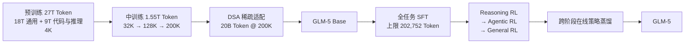
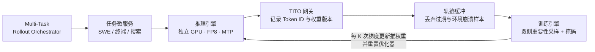
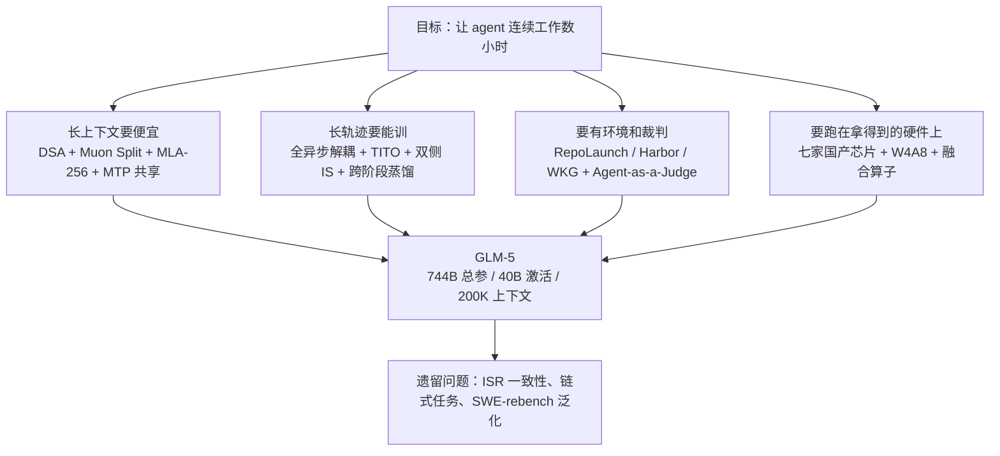

# GLM-5：当写代码变成做工程，要重新设计的不只是模型

<!-- release-date: 2026-02-11 -->

> 本文依据 GLM-5 Team（Zhipu AI & Tsinghua University）发布的 **GLM-5: from Vibe Coding to Agentic Engineering**，即 arXiv:2602.15763v2、封面日期 2026-02-24、共 40 页的版本。截至 2026-09-06 核验，arXiv 上的提交历史只有 v1（2026-02-17）与 v2（2026-02-24），本地原件即最新修订版。下文括号中的 `PDF p. N` 一律指这份 40 页原文的文件页码。文中会把「报告明确写了什么」「我们如何理解它」「外部资料补充」三层分开：外部补充都会给链接并单独标注，我们的推断都会写明是推断。

## 阅读前先搭一张最小地图

这篇报告默认读者已经熟悉 2025—2026 年的大模型词汇。如果不是，先记住下面九个名字就够开始读了。

- **Token（词元）**：模型读写文本的最小单位。一个汉字、一个单词或一个符号都可能是一个 Token。
- **上下文（context）**：模型这一次能同时看见的全部内容，包括系统提示、用户消息、工具调用和工具返回。
- **KV Cache（Key-Value Cache，键值缓存）**：把已读内容的中间结果留在显存里，生成下一个 Token 时不用从头重算。上下文越长，它越大。
- **MoE（Mixture-of-Experts，混合专家）**：模型里放很多组「专家」参数，每个 Token 只激活其中少数几组。总参数很大，单次计算却不大。
- **MLA（Multi-head Latent Attention，多头潜在注意力）**：DeepSeek-V2 提出的注意力变体，把 Key 和 Value 压成一个低维潜向量再缓存，用来省 KV Cache。
- **GQA（Grouped-Query Attention，分组查询注意力）**：多个 Query 头共享同一套 Key/Value，也是一种省缓存的做法。
- **DSA（DeepSeek Sparse Attention，DeepSeek 稀疏注意力）**：DeepSeek-V3.2 提出的稀疏注意力。它用一个轻量「索引器」给历史位置打分，只让主注意力真正读打分最高的一小批位置。
- **RL（Reinforcement Learning，强化学习）**：让模型自己产生答案或轨迹，再按结果好坏调整参数。
- **rollout（轨迹采样）**：RL 里模型实际生成的那一次完整过程。对 agent 来说，一条 rollout 可能包含几十次工具调用、几十分钟的沙箱执行。
- **harness（评测脚手架）**：跑 agent 评测时套在模型外面的那层框架，负责给工具、管上下文、决定重试和步数上限。同一个模型换 harness，分数会明显变化。

DSA 的内部机制不是这篇报告的贡献，它来自 DeepSeek-V3.2；本站已有 [DeepSeek-V3.2 的解读](/reports/DeepSeek/DeepSeek-V3.2)，本文只讲 GLM-5 怎么用它、为它付了什么代价。

## 一句话先说清

GLM-5 的标题是「from Vibe Coding to Agentic Engineering」，即从「人提示、模型写片段」转向「agent 自己规划、实现、迭代」。

这句口号在报告里不是修辞，它是全文的工程约束。因为一旦要求模型连续工作几小时，四件事同时变难：

1. **上下文变得又长又贵**。agent 的上下文不是人打出来的，是工具结果堆出来的。128K 起步，200K 常见。
2. **一条训练样本变得又长又慢**。同步强化学习里，最慢的那条轨迹决定整步的墙钟时间，GPU 大半时间在等。
3. **没有地方练，也没有人判**。真实软件工程任务需要可执行、可验证的环境；「整件事做完没有」也不能靠单条 diff 匹配来判。
4. **硬件不一定拿得到**。这一点对智谱是硬约束，报告用了整整一节写国产芯片适配。

GLM-5 的答案分别是：

- 用 **DSA** 把长上下文的注意力成本压下来，并为此先把 MLA 修好（Muon Split、MLA-256）、把多 Token 预测的显存修好（3 层参数共享）；
- 用一套**全异步解耦**的强化学习基础设施，把生成和训练拆到不同 GPU 上，再用 TITO 网关、双侧重要性采样、过期样本丢弃把随之而来的 off-policy 问题按住；
- 用 RepoLaunch、Harbor、Web Knowledge Graph 三条流水线批量造可验证环境，用 CC-Bench-V2 和 Agent-as-a-Judge 造能判「整件事」的评测；
- 和七家国产芯片厂商做全栈适配，用 W4A8 混合精度把 744B 塞进单机。

如果只带走一句话，可以带走这句：

> **「让模型会做 agent」不是一个后训练问题。它会一路反推到注意力形状、显存布局、优化器细节、算子确定性和评测方法。**

## 先看全景：GLM-5 长什么样

### 训练流水线

这张图按报告 Figure 5 重画（PDF p.4）。它是**阶段顺序示意**，箭头表示数据依赖，不表示各阶段的实际耗时或算力比例。图里的 Token 数来自 Figure 5 的标注：预训练分成 18T 通用语料和 9T 代码与推理语料、都在 4K 长度上训练；中训练分成 32K 的 1T、128K 的 500B、200K 的 50B；最后是 20B Token 的稀疏注意力适配（PDF p.4）。

把它们加起来是 28.55T，正好对上正文说的「基座模型共 28.5 万亿 Token」（PDF p.4）和引言里的「27 万亿 Token 语料起步」（PDF p.3）。**这一层拆解只有 Figure 5 里有，正文没写**，值得单独记一下。

### 模型配置

架构超参在附录 Table 10（PDF p.36）：

| 配置 | GLM-4.5 | GLM-5 |
|---|---:|---:|
| 总参数 | 355B | 744B |
| 每 Token 激活参数 | 32B | 40B |
| 稠密层 / MoE 层 / MTP 层 | 3 / 89 / 1 | 3 / 75 / 1 |
| Hidden Dim | 5120 | 6144 |
| MoE Intermediate Dim | 1536 | 2048 |
| QK 头维 / V 头维 | 128 / 128 | 192 / 256 |
| Q LoRA Dim / KV LoRA Dim | – / – | 2048 / 512 |
| 注意力头数 | 96 | 64 |
| KV 头数 | 8 | –（改用 MLA） |
| Indexer 头数 / 头维 | – / – | 32 / 128 |
| 专家总数 / 路由 / 共享 | 160 / 8 / 1 | 256 / 8 / 1 |
| 词表 | 151552 | 154880 |

注意计数口径：报告说明参数量**包含 MTP 层、但不含词嵌入和输出层**（PDF p.36）。

几个可以直接读出来的判断：

- GLM-5 是「更宽、更浅」的一代。专家从 160 涨到 256、Hidden Dim 从 5120 涨到 6144，MoE 层反而从 89 降到 75。正文给的理由是**减少专家并行的通信开销**（PDF p.4）。层数越少，流水线级数和跨层通信次数就越少。
- 注意力从 GQA-8 换成了 MLA，并且带了一个 DSA 的索引器（32 头、128 维）。
- 每 Token 仍然只激活 8 个路由专家 + 1 个共享专家，激活率从 GLM-4.5 的 9.0% 降到 5.4%。总参数翻倍，激活参数只从 32B 涨到 40B。

这里有一处**报告内部对不上的地方**：正文说 GLM-5「把层数降到 80」（PDF p.4），而 Table 10 给的是 3 个稠密层 + 75 个 MoE 层 + 1 个 MTP 层 = 79（PDF p.36）。差 1 到 2 层，报告没有解释口径。后面还会列出另外几处类似的不一致。

## 主线：从 vibe coding 到 agentic engineering，工程上到底多了什么

报告自己在第 4 节给出了定义（PDF p.15）：

> vibe coding 里，人提示 AI 写代码；agentic engineering 里，AI agent 自己写代码——它们规划、实现、迭代。

差别听上去只是「谁在按回车」，但落到系统上是四个变化：

**第一，上下文的作者变了。** 人写的提示很短；agent 的上下文由工具输出撑起来——`ls` 的目录列表、`grep` 的匹配结果、编译器的报错、测试的堆栈。这些内容进入上下文的速度比人打字快几个数量级。所以 200K 上下文不是奢侈配置，是基本盘。

**第二，一条训练样本的形状变了。** 单轮问答的 rollout 是一次前向生成；agent 的 rollout 是「思考 → 工具调用 → 等沙箱 → 读结果 → 再思考」的几十轮循环，中间还夹着 GPU 完全用不上的等待。

**第三，正确性的判据变了。** 单轮任务可以对答案；agent 任务要问「这个仓库现在能不能跑通全部测试」「这个前端页面点下去有没有响应」。

**第四，失败的形态变了。** 单轮任务失败就是答错；agent 任务可能是环境崩了、沙箱超时、工具返回格式变了——这些错误和模型能力无关，却会污染训练信号。

下面四条线，分别对应这四个变化。

## 第一条线：让长上下文便宜下来

### 起点是一个反直觉的实验结果：MLA 打不过 GQA

GLM-4.5 用的是 GQA-8，即 8 组 Key/Value，KV Cache 每层每 Token 2048 维。GLM-5 想换成 MLA，因为 MLA 把 KV 压成 576 维的潜向量，缓存小得多，长序列上更省显存也更快（PDF p.4）。

问题是**换过去反而变差了**。报告在同规模对照里发现，576 维潜 KV 的 MLA 打不平 2048 维 KV 的 GQA-8（PDF p.4-5，表 1）：

| 配置 | Hellaswag | MMLU | C-Eval | RACE | BBH | GSM8K | HumanEval |
|---|---:|---:|---:|---:|---:|---:|---:|
| GQA-8 | 77.3 | 61.2 | 60.0 | 79.6 | **53.3** | **47.6** | **38.5** |
| MLA | 77.3 | 61.5 | 59.7 | 77.8 | 48.9 | 46.2 | 33.5 |
| MLA + Muon Split | **77.8** | **62.5** | **62.1** | **79.9** | 51.8 | 45.0 | 36.7 |
| MLA-256 + Muon Split | 77.4 | 62.0 | 59.9 | 79.6 | 51.3 | 47.5 | 36.6 |

差距集中在 BBH（53.3 → 48.9）和 HumanEval（38.5 → 33.5）这两项推理与代码任务上。也就是说，压缩 KV 的代价不是均匀分摊的，它先咬掉需要多步推理的能力。

### 新设计：Muon Split，让每个注意力头单独被正交化

关键线索是「在我们用 Muon 优化器的实验里」（PDF p.4）。

先说 **Muon** 是什么。它是一种优化器：先累积动量，再把二维权重矩阵的更新方向做近似正交化，让矩阵各个方向的更新尺度更均衡。GLM-4.5 已经在用它，Kimi K2 也用它（Kimi K2 为此配了 QK-Clip，见 [Kimi K2 解读](/reports/Moonshot/Kimi-K2)）。

GLM-4.5 原来的做法是：把多头 Query、Key、Value 的上投影矩阵 $W^{UQ}, W^{UK}, W^{UV}$ 各当成**一整块矩阵**做正交化。报告的原话是「对 GLM-4.5 中 Muon 优化器配方的一次改动」，并把整块正交化称为「原配方」（PDF p.5）。

> **这里要给读者提一个醒（本文的核对，报告没有说明）**：GLM-4.5 报告明写它用的是**分组查询注意力（GQA）配 partial RoPE**，并不是 MLA，因此它并没有 MLA 意义上的 $W^{UQ}, W^{UK}, W^{UV}$；而且 GLM-4.5 报告的优化器一节只写了「除词嵌入、bias 与 RMSNorm 外全部参数使用 Muon」加三个超参，**全文一次都没有提过正交化的粒度**。所以这句「原配方」更应读作「Muon 默认就是整块矩阵一起正交化」，而不是 GLM-4.5 针对 MLA 做过的专门设计。逐项对照见本站 [GLM-4.5 解读](/reports/Z.ai/GLM-4.5)。

GLM-5 改成：把这些矩阵按注意力头**拆成一堆小矩阵**，每个小矩阵独立做正交化。这个改法叫 **Muon Split**（PDF p.5）。

为什么这有用？我们的理解是这样：正交化是在「拉平一个矩阵各奇异方向的尺度」。当所有头被拼成一块大矩阵时，正交化会把不同头的更新尺度也一起拉平，等于强迫所有头以同一速度学习。而 MLA 的所有头共享同一份低维潜 KV，各头本来就需要从这份共享表示里分工提取不同信息——被迫同速更新，分工就出不来。拆开之后，报告的原话是「使不同注意力头的投影权重能以不同尺度更新」（PDF p.5）。

**这是我们对机制的解释，报告只给了做法和结果，没有给这个层面的分析。**

结果见表 1 第三行：MLA + Muon Split 把 MLA 拉回到与 GQA-8 相当，MMLU、C-Eval 甚至更高（PDF p.5）。

还有一个附带收益值得单独说：报告写「实践中我们还发现，用了 Muon Split 之后，GLM-5 预训练期间注意力 logits 的尺度保持稳定，**不需要任何裁剪策略**」（PDF p.5）。

这句话是对 Kimi K2 的一次隔空回应。Kimi K2 发现 Muon 比 AdamW 更容易把注意力打分推爆，于是设计了 QK-Clip 直接改权重来压住；GLM-5 声称换一种正交化粒度就不必裁剪了。**两篇报告没有做同一组对照实验，所以这不构成「QK-Clip 没必要」的结论**，只能说在各自的配置里都能稳住训练。

### MLA-256：训练算力不变，解码算力下降

MLA 的第二个毛病在解码阶段。解码时 MLA 要做 576 维的点积（因为要对着压缩后的潜 KV 算），而 GQA 只做 128 维（PDF p.5）。上下文越长、每步解码越贵，agent 场景恰恰是解码密集的。

报告的观察很有意思：DeepSeek-V3 的注意力头数是**按 H800 的 roofline 选的**，换一种硬件这个选择就未必合适（PDF p.5，引 [60]）。这句话把「架构超参」和「具体机器」直接绑在了一起。

GLM-5 的调整是：把头维从 192 提到 256，同时把头数减少 1/3（PDF p.5）。对照 Table 10，GLM-4.5 是 96 头、QK/V 头维都是 128；GLM-5 是 64 头、QK 头维 192、V 头维 256（PDF p.36）。96 × 2/3 = 64，对得上。

报告称这样「保持训练计算量和参数量不变，同时降低解码计算量」（PDF p.5）。我们的理解是：训练和预填充阶段 MLA 走的是多头注意力形态，计算量大致正比于「头数 × 头维」，头维涨 4/3、头数降 2/3，乘起来接近不变；而解码阶段每个 Query 头都要对 576 维潜向量做一次点积，计算量正比于头数，头数降 1/3 就直接省 1/3。**这个算术是我们补的，报告只给了结论，没有列式子；按表 10 的数字严格算也只是「大致不变」而不是精确相等。**

表 1 最后一行是这个变体的证据。报告的说法是 MLA-256 + Muon Split「与 Muon Split 下的 MLA 相当」（PDF p.5）。逐项看要更克制一点：七项里 GSM8K 从 45.0 涨到 47.5，C-Eval 从 62.1 掉到 59.9，其余基本持平。说「大体持平、解码变便宜」是准确的，说「完全免费」就过了。

### MTP 参数共享：草稿模型不该随投机步数膨胀

**MTP（Multi-token Prediction，多 Token 预测）** 是让模型在训练时不只预测下一个 Token，还预测再往后几个。它有两个好处：提升基座质量，以及在推理时充当**投机解码**的草稿模型（PDF p.5）。

投机解码的做法是：让一个便宜的草稿模型先猜出接下来几个 Token，再让主模型一次性验证。猜中的直接采用，猜错的丢掉重来。**接受长度**（accept length）就是平均每轮能采纳多少个 Token，越大越省。

旧问题是：要预测未来 $n$ 个 Token，标准做法要 $n$ 个 MTP 层，MTP 参数和它们的 KV Cache 都随 $n$ **线性增长**（PDF p.5）。DeepSeek-V3 的折中是只训 1 个 MTP 层，推理时却拿它连猜 2 个 Token——训练和推理对不上，第二个 Token 的接受率就掉下来。

GLM-5 的做法是：训练时用 **3 个 MTP 层但共享参数**（PDF p.5）。共享参数意味着草稿模型的显存开销和 DeepSeek-V3 的单层方案一样，但训练时模型确实见过「连猜 3 步」这件事，训推差距变小。

结果是同样 4 步投机下，接受长度从 DeepSeek-V3.2 的 2.55 提到 GLM-5 的 2.76（PDF p.5，表 2）。

**边界要说清楚**：这个对比跑在「我们的私有 prompt 集」上（PDF p.5），不是公开可复现的数据集；而且两个模型架构不同，接受长度的差异不能全部归给 MTP 共享这一项。

### 换成 DSA：从中训练之后接着训 20B Token

前面三项都是在修 MLA。真正把长上下文成本压下去的是 DSA。

DSA 的思路是：不再让每个 Token 都去看前面所有 Token（那是 $O(L^2)$），而是用一个轻量的 **lightning indexer**（闪电索引器）先给历史位置打分，主注意力只读打分最高的 top-$k$ 个（PDF p.5）。报告特别点出它和滑动窗口这类**固定模式**的区别：DSA 是「看内容再决定谁重要」，不是「只看最近一段」。

GLM-5 引入 DSA 的方式和 DeepSeek-V3.2 一样，是**从一个稠密基座继续预训练**，而不是从头训（PDF p.5）。具体两段：

- **暖启动阶段**：1000 步，每步 14 条 202,752 Token 的序列，最大学习率 5e-3（PDF p.6）。附录补充学习率从 5e-3 降到 2e-4（PDF p.36）。
- **稀疏适配阶段**：沿用中训练的数据和超参，训 20B Token，学习率固定 1e-5（PDF p.6、p.36）。

这里有一个很值得记的数字对比：DeepSeek-V3.2 为 DSA 花了 **943.7B Token**，GLM-5 只花了 **20B**，不到 1/47（PDF p.6）。报告说这已经足够让 DSA 模型追平原来的 MLA 模型。

证据有三层（PDF p.5-6）：

1. Table 3 的长上下文对照：

| 128K 长上下文 | MQ-NIAH | MV-NIAH | SQuAD | HotpotQA |
|---|---:|---:|---:|---:|
| MLA | 100.0 | 95.5 | 79.7 | **66.3** |
| DSA | 100.0 | **97.0** | **86.0** | 63.0 |

2. 用同一批 SFT 数据分别微调 DSA 和 MLA 两个模型，训练损失曲线基本重合（PDF p.6，图 6，内嵌的相对损失差在 ±0.0004 量级）；
3. 评测基准上两者打平（PDF p.6）。

**这里要如实说**：表 3 里 DSA 并不是全面持平，HotpotQA-128k 掉了 3.3 分（66.3 → 63.0）。报告用「接近」（close to）描述，没有解释这一项为什么掉。四个数据点也太少，不足以支撑「完全无损」。

收益方面，报告称 DSA 让长序列的注意力计算量降到约 1/1.5 到 1/2，「能以一半 GPU 成本处理 128K 上下文」（PDF p.6）。**这是注意力这一部分的计算量，不是端到端延迟或整机成本**，读的时候别扩大。

### 为什么不是滑动窗口，也不是线性注意力

报告没有只说「我们选了 DSA」，而是做了一整节消融（§2.1.2，PDF p.6-8）。基座是 GLM-9B，40 层全 GQA，已经在 128K 上下文微调过。四个候选：

- **SWA Interleave**：全注意力层和滑动窗口层固定交替；
- **GDN（Gated DeltaNet，门控 Delta 网络）**：一种线性注意力，把二次的 softmax 注意力换成门控线性递归；
- **SWA Pattern**：他们自己提的改进，受 PostNAS 启发，用 **beam search 搜出「哪些层该换成滑窗」**——beam 宽度 8，每步优化 2 层，40 层大约 10 步收敛，每步用 16K 上下文的 RULER 打分（PDF p.6）；
- **SimpleGDN**：他们自己提的改进，把 GDN 的 Conv1d 和显式门控整个删掉，直接把预训练的 Q/K/V 投影权重映射进线性递归，不引入新参数（PDF p.7）。

先看**完全不额外训练**时的 RULER 结果（PDF p.7，表 4，两种 SWA 都是 1:1 比例、4096 窗口）：

| | 4K | 8K | 16K | 32K | 64K | 128K |
|---|---:|---:|---:|---:|---:|---:|
| GLM-9B 全注意力 | 95.19 | 93.67 | 92.01 | 91.09 | 85.35 | 75.28 |
| SWA Interleave | 94.87 | 54.02 | 25.89 | 12.61 | 8.32 | 6.51 |
| SWA Pattern | **95.78** | 92.54 | 88.92 | 82.52 | 70.23 | 53.95 |

固定交替的滑窗在 8K 就崩了，128K 只剩 6.51。同样是 1:1 的比例、同样的窗口大小，**只是换了哪几层做滑窗**，128K 就从 6.51 拉到 53.95。这是全文最干净的一组对照实验之一：结构选择的收益可以比结构类型的收益还大。

再看**每种方法都用 190B Token、64K 上下文续训之后**的结果（PDF p.7，表 5，括号内是相对全注意力基线的差值）：

| 方法 | RULER 64K / 128K | RepoQA 64K / 128K |
|---|---|---|
| GLM-9B 基线 | 85.35 / 75.28 | 69.00 / 65.83 |
| SWA Interleave | 65.94 / 44.93（↓19.41 / ↓30.35） | 50.33 / 39.33（↓18.67 / ↓26.50） |
| SWA Pattern | 83.72 / 69.59（↓1.63 / ↓5.69） | 62.33 / 51.17（↓6.67 / ↓14.66） |
| GDN | 76.76 / 64.00（↓8.59 / ↓11.28） | 65.50 / 56.17（↓3.50 / ↓9.66） |
| SimpleGDN | 81.76 / 67.03（↓3.59 / ↓8.25） | 65.50 / 58.50（↓3.50 / ↓7.33） |

报告的结论是：**所有这些方法都在细粒度检索任务上留下无法消除的精度缺口**，即使一半的层保留全注意力也一样——RULER@128K 最多掉 5.69，RepoQA@128K 最多掉 7.33（PDF p.7）。原因是这些方法在续训适配时不可避免地丢信息。

然后是全节最关键的一句判断（PDF p.7）：

> 相比之下，DSA 在构造上是无损的：它的 lightning indexer 实现了 Token 级稀疏，**没有丢弃任何长程依赖**，因此可以用在所有层上而不降质。

这句话要拆着读。「构造上无损」是一个**结构性论证**：滑窗和线性注意力从表示里删掉了信息（窗口外的内容根本不在视野里，线性递归把历史压成固定大小的状态），而 DSA 只是**没去读**某些位置，那些位置的 KV 还完整地存着，索引器下一步就可能选中它们。所以缺口的来源不同。

但「构造上无损」不等于「实测无损」。报告自己给的两组数字就说明了这一点：

- Table 3 里 HotpotQA-128k 掉了 3.3 分（PDF p.5）；
- Table 6 的 GLM-4.7-Flash 小规模验证里（PDF p.8）：

| | 4K | 8K | 16K | 32K | 64K | 128K |
|---|---:|---:|---:|---:|---:|---:|
| GLM-4.7-Flash | 97.44 | 96.72 | 95.83 | 92.96 | 85.34 | 79.21 |
| + DSA 只暖启动 | 97.51 | 96.54 | 95.40 | 90.09 | 84.05 | 71.35 |
| + DSA 完整训练 | 96.77 | 96.25 | 96.69 | 93.45 | 87.06 | 78.86 |

这张表自己讲了一个完整的故事。只训索引器（1000 步、batch size 16，基座冻结）就已经保住了绝大部分能力，损失集中在最长的 128K（79.21 → 71.35）；再联合训 150B Token 之后，16K、32K、64K 反超基线（+0.86 / +0.49 / +1.72），128K 仍差 0.35（PDF p.7-8）。

所以准确的说法是：**DSA 的缺口比滑窗和线性注意力小一个量级，并且靠续训基本可以补平，但没有归零。** 报告用 0.35 分的残差支撑「无损」这个词，是可以接受的工程表述，不是严格意义上的零损失。

### 这条线的代价与可迁移启发

代价至少有三处，报告写了一部分：

- DSA 引入了一个额外的索引器（32 头、128 维，PDF p.36），推理时多一份计算和缓存；
- 索引器的 top-$k$ 在 RL 阶段会带来严重的稳定性问题，这是下一节的主题（PDF p.12）；
- MLA-256 这类「按硬件 roofline 调头数」的做法，换硬件就要重新调，不是可以照抄的常数。

可迁移的三条：

1. **压缩表示的收益不是均匀分摊的**。表 1 显示 MLA 相对 GQA 的损失集中在 BBH 和 HumanEval。评估任何压缩方案时，先看它在最需要多步推理的那一列掉了多少，别只看平均分。
2. **优化器的作用粒度也是一个设计维度**。Muon Split 没有改模型结构、没有加参数，只是把正交化的作用单位从「整块矩阵」改成「每个头」，就补回了 MLA 的差距。当共享表示需要分工时，别让优化器强迫它们同步。
3. **结构搜索的性价比可能被低估**。SWA Pattern 的搜索只在 16K 上跑、只用 beam 宽度 8、大约 10 步，就把 128K 的分数从 6.51 提到 53.95（PDF p.6-7）。而且搜出来的模式在所有长度上都泛化。这是一个便宜到应该默认尝试的实验。

## 第二条线：让长轨迹能被训练

### 先看同步阶段：Reasoning RL 用的是什么

后训练分四段：SFT → Reasoning RL → Agentic RL → General RL，最后加一段跨阶段蒸馏（PDF p.4 图 5、p.10）。Reasoning RL 仍是同步的，它的算法值得先看，因为异步那套是从它改过来的。

底子是 **GRPO**（Group Relative Policy Optimization，组相对策略优化）：对同一个问题采样一组回答，用组内奖励的均值和标准差算优势，不需要单独的价值网络。

$$\hat A_{i,t}=\frac{R_i-\operatorname{mean}(R_1,\dots,R_G)}{\operatorname{std}(R_1,\dots,R_G)}$$

在这之上，GLM-5 加了 **IcePop**（PDF p.11，引 [61]）。IcePop 要解决的是**训推不一致**：采样轨迹用的是推理引擎（为了快，通常是低精度、不同算子实现），算梯度用的是训练引擎。同一个 Token，两边算出的概率会有微小差异。这个差异在长思维链上会被逐 Token 放大。

报告显式区分了两个策略：训练策略 $\pi^{\text{train}}$ 和推理策略 $\pi^{\text{infer}}$，并定义训推失配比：

$$\rho_{i,t}=\frac{\pi^{\text{train}}_{\theta_{\text{old}}}(y_{i,t}\mid x,y_{i,<t})}{\pi^{\text{infer}}_{\theta_{\text{old}}}(y_{i,t}\mid x,y_{i,<t})}$$

然后用一个叫 `pop` 的算子处理它（PDF p.12）：

$$\operatorname{pop}(\rho_{i,t},1/\beta,\beta)=\begin{cases}\rho_{i,t}, & 1/\beta\le\rho_{i,t}\le\beta\\ 0, & \text{其他}\end{cases}$$

注意这是**掩码**，不是裁剪。失配太严重的 Token 直接被乘上 0，完全不参与梯度，而不是被截到边界值继续参与。理由我们的理解是：这类 Token 的梯度方向本身就不可信，截断只是让错误变小，掩码才是让错误消失。

最终损失把 `pop` 项乘在标准的 PPO 裁剪目标外面（PDF p.11，式 1）：

$$\mathcal L(\theta)=-\mathbb E\left[\frac1G\sum_{i=1}^{G}\frac{1}{|y_i|}\sum_{t=1}^{|y_i|}\operatorname{pop}(\rho_{i,t},1/\beta,\beta)\cdot\min\left(r_{i,t}\hat A_{i,t},\ \operatorname{clip}(r_{i,t},1-\epsilon_{\text{low}},1+\epsilon_{\text{high}})\hat A_{i,t}\right)\right]$$

其中 $r_{i,t}$ 是常规的 PPO 重要性比（新旧训练策略之比）。相比原版 IcePop，GLM-5 **去掉了 KL 正则项**，理由是加快 RL 提升速度（PDF p.11）。

超参是：$\beta=2$、$\epsilon_{\text{low}}=0.2$、$\epsilon_{\text{high}}=0.28$，**完全 on-policy**，组大小 32、批大小 32（PDF p.12）。

$\epsilon_{\text{high}} > \epsilon_{\text{low}}$ 是 DAPO 提出的 clip-higher 思路：给「概率上升」留更大空间，避免低概率 Token 被过早压死、熵塌缩。本站的 [DAPO 解读](/reports/ByteDance/DAPO) 讲了这个设计的来龙去脉。

### DSA 给 RL 带来的新麻烦

这是全文最具体、也最容易被跳过的一段（PDF p.12）。

DSA 的索引器每步要选 top-$k$ 个位置。RL 的稳定性要求训练侧和推理侧**选中同一批位置**——否则同一条轨迹在两边算出的概率会差很多，前面那套失配处理就压不住了。

MoE 模型有个现成的类比：**routing replay**（路由回放），把推理时激活了哪些专家记下来，训练时照着复现。但报告直接算了一笔账说这条路走不通：索引器的 $k = 2048$，比 MoE 常用的 $k$（通常是个位数）大几个量级；把每个 Token 位置的 2048 个索引都存下来并在训练引擎和推理引擎之间传，存储和通信成本都不可接受（PDF p.12）。

他们的解法出乎意料地朴素：**换一个确定性的 top-$k$ 算子**。

具体是：SGLang 的 DSA 索引器用的是非确定性的 CUDA top-$k$ 实现；GLM-5 在训练引擎里直接换成朴素的 `torch.topk`——稍慢，但**确定性**（PDF p.12）。

效果的描述非常强烈：确定性算子「产生更一致的输出，带来显著的 RL 收益」；而其他非确定性 top-$k$ 实现（CUDA 或 TileLang）「只训了几步就导致性能剧烈退化，同时伴随熵的急剧下降」（PDF p.12）。

熵急剧下降意味着模型迅速塌缩到少数几种输出。一个算子的非确定性，几步之内就能毁掉一次大规模 RL 训练。

另外，GLM-5 在所有 RL 阶段**默认冻结索引器参数**，理由是加速训练并防止索引器本身学出不稳定的行为（PDF p.12）。

这一段的可迁移价值很高：

> **当一个离散选择进入训练循环时，它的确定性就不再是实现细节，而是算法正确性的一部分。** 稀疏注意力的 top-$k$、MoE 的路由、检索的召回、剪枝的掩码，都属于这一类。先问「训练侧和推理侧会不会选到同一批」，再谈算子快不快。

这也和 DeepSeek-V4 报告里花大力气做的 batch invariance 与确定性 kernel 是同一个母题：规模越大，不可复现的差异越贵。

### 全异步解耦：为什么必须这么做

Agentic RL 换了一套完全不同的基础设施（§3.3、§4.1，PDF p.12、p.15-17）。

**旧问题**：朴素的同步 RL 在 agent 任务上会产生巨大的气泡。原因是 agent 任务的生成长度**极度不均衡**——有的轨迹三轮就结束，有的要几十轮工具调用加几十分钟沙箱执行。同步 RL 必须等一批全部生成完才能训练，于是绝大部分 GPU 在等最慢的那一条（PDF p.15）。

**新设计**：把训练引擎和推理引擎放到**不同的 GPU 设备**上。推理引擎持续不断地生成轨迹；一旦攒够预设阈值，就把这一批送去训练；训练引擎每做 $K$ 次梯度更新，就把新权重推回推理引擎（PDF p.15-16）。

这张图根据 §3.3 与 §4.1 的文字重画（PDF p.12、p.15-17），是**数据流机制示意**，不表示各环节的实际耗时或资源比例。报告没有给这张流程的原图。

**代价立刻就来了**：不同轨迹是由**不同版本的模型**生成的，off-policy 问题变得很严重（PDF p.16）。报告还补了一句很多人会漏掉的细节——因为 rollout 策略在变，每次权重更新后优化问题其实换了一个，所以他们**在推理引擎每次权重更新后重置优化器**（PDF p.16）。

**这一条和 Kimi K2 走了相反的路。** Kimi K2 用的是**混合共置**（colocated）架构：训练和推理引擎住在同一批 worker 上，谁工作谁占 GPU，代价是每轮都要搬 1T 参数，为此专门做了 checkpoint engine 把全量参数更新压到 30 秒内。GLM-5 选择彻底分开，代价换成了 off-policy 偏差和权重推送延迟。两篇报告面对的是同一个规模、同一个问题，给出了对立的答案：**共置省机器、贵在搬参数；解耦省等待、贵在策略滞后。** 哪个更好取决于你的 rollout 长尾有多重——K2 的 rollout 相对规整，GLM-5 的 agent 轨迹长尾极端。

### TITO：不要让分词器变成第二个策略

异步之下，第一个稳定性机制是 **TITO（Token-in-Token-out，Token 进 Token 出）**（PDF p.16）。

先说清两种做法的区别：

- **text-in-text-out**：把推理引擎当黑盒，它返回最终文本，训练侧再**重新分词**这段文本、重新推导边界和截断，然后算损失。
- **token-in-token-out**：训练流水线直接消费推理引擎产生的那串 Token ID，不做任何文本往返。

报告说这个「看起来很小的选择」后果很严重：重新分词会在 Token 边界、空白与规范化处理、截断、特殊 Token 位置上引入细微失配，从而**破坏动作与奖励/优势之间的步级对齐**——尤其当 rollout 是流式的、被截断的、或在很多 actor 之间交错时（PDF p.16）。

举个具体的例子帮助建模（这是我们补的例子，不是报告原文）：模型生成了 `<tool_call>` 加一段 JSON 参数。文本往返之后，分词器可能把 `</tool_call>` 前的换行归并到不同的 Token 里，于是「第 137 个 Token 是这次工具调用的结束」这条对齐就错位一格。奖励算在第 137 个位置，梯度加在第 138 个位置——训练目标悄悄地变了。

工程上他们实现了一个 **TITO Gateway**，拦截所有 rollout 任务的生成请求，记录每条轨迹的 Token ID 和元数据（PDF p.16）。报告特意指出这个设计还有一个软性收益：**把繁琐的 Token ID 处理从下游 agent rollout 逻辑里隔离出去**，写任务的人不用关心这件事。

### 双侧重要性采样：不追旧策略，直接和 rollout 比

第二个稳定性机制针对的是一个纯粹的实现难题（PDF p.16）。

同步 RL 里，重要性比是 $\pi_\theta / \pi_{\theta_{\text{old}}}$，$\pi_{\theta_{\text{old}}}$ 是这一批样本的采样策略。但异步下，**一条轨迹的生成过程中推理引擎可能已经更新了好几次权重**，$\pi_{\theta_{\text{old}}}$ 根本不是单一策略。要精确追踪，就得保存一长串历史检查点 $\{\pi_{\theta^{(1)}_{\text{old}}},\dots,\pi_{\theta^{(N)}_{\text{old}}}\}$，实际上不可行。

GLM-5 的两步处理：

第一步，**直接复用 rollout 时产生的对数概率**当作行为策略的代理，把 $\pi_{\theta_{\text{old}}}$ 整个丢掉（PDF p.16-17，式 4）：

$$r_t(\theta)=\exp\left(\log\pi_\theta(a_t\mid s_t)-\log\pi_{\text{rollout}}(a_t\mid s_t)\right)$$

这一步同时省掉了「用旧策略再跑一次前向」的计算开销。

第二步，**双侧校准掩码**（PDF p.17，式 5）：

$$f(x;\epsilon_\ell,\epsilon_h)=\begin{cases}x, & 1-\epsilon_\ell<x<1+\epsilon_h\\ 0, & \text{其他}\end{cases}$$

最终目标是（PDF p.17，式 3）：

$$\mathcal L(\theta)=\mathbb E_t\left[f(r_t(\theta),\epsilon_\ell,\epsilon_h)\,\hat A_t\log\pi_\theta(a_t\mid s_t)\right]$$

和标准 PPO 的非对称裁剪不同，落在信任域外的 Token **被完全从梯度计算中掩掉**，而不是被截到边界继续参与。这和前面同步阶段的 `pop` 是同一种哲学。

报告自己指出这与 IcePop 相似，但「我们的策略更简单，进一步移除了 $\pi_{\theta_{\text{old}}}$，训练更稳定」（PDF p.17）。并且诚实地写明了这笔交易：**接受一定程度的可控 off-policy 偏差，换掉历史策略追踪的负担**（PDF p.17）。

**注意报告没有公开的部分**：$\epsilon_\ell$ 和 $\epsilon_h$ 的具体取值、被掩掉的 Token 占比、权重推送间隔 $K$、轨迹阈值，都没写。

### 丢弃过期样本和噪声样本

异步还带来两类必须主动清理的脏数据（PDF p.17）。

**第一类是太陈旧的轨迹。** 一条特别长的 agent 轨迹可能横跨很多个权重版本，最早那部分已经严重 off-policy。做法是给每条响应记录它涉及的模型版本序列 $(w_0,\dots,w_k)$，令 $w'$ 是当前版本，若 $w'-w_0>\tau$ 就整条丢弃。

**第二类是环境自己崩了。** 报告写得很直白：编码 agent 的沙箱本身可能不稳定，可能因为与模型完全无关的原因失败（环境崩溃）。这类失败反映的是环境不稳定，不是模型能力，会引入噪声奖励（PDF p.17）。

做法是记录每个样本的失败原因，排除环境崩溃导致的失败。但这带来一个新问题：GRPO 这类基于组的方法，删掉几个样本会让组变得不完整。他们的规则是——**若有效样本超过组大小的一半，就重复有效样本把组补齐；否则整组丢弃**（PDF p.17）。

这条规则很实用。它承认了两件事：组内样本数影响优势估计的方差，不能随便变；但重复采样引入的偏差在「有效样本过半」时是可接受的，低于一半就不值得救。

### DP-aware routing：让同一个 agent 的请求总落在同一张卡上

最后一个是纯粹的系统优化（PDF p.17）。

多轮 agent 工作负载有个特点：**同一条 rollout 的连续请求共享完全相同的前缀**（前面所有的对话、工具调用和结果）。如果这些请求被负载均衡器随机打到不同的数据并行（DP）rank 上，每次都要重新 prefill 整个前缀。

做法是引入一个有状态的路由层，用**一致性哈希**把每个 rollout ID 映射到固定的 DP rank，跨轮次保持稳定，消除跨 rank 的缓存未命中。为防长期不均衡，再叠一层轻量的哈希空间动态再平衡（PDF p.17）。

收益写得很清楚：**随着 rollout 变长，prefill 成本正比于增量 Token 而不是总上下文长度**（PDF p.17）。这句话是整个优化的价值所在——它把长上下文 agent 推理的 prefill 从 $O(n \cdot L)$ 降到 $O(L)$。

### Multi-Task Rollout Orchestrator：让多任务 RL 不用分叉代码

多任务 RL 有个工程难题：不同任务用不同工具集、不同 rollout 逻辑、不同奖励函数。最容易的做法是每个任务 fork 一份训练代码，然后就再也合不回去了。

GLM-5 的做法是**服务化**（PDF p.16）：每个任务把自己的 rollout 和奖励逻辑实现成一个**独立微服务**，注册到中央编排器；编排器控制每个任务的 rollout 配比和生成速度，让数据采集在任务间保持平衡。

关键的一步是：**把所有 agentic 任务的轨迹统一成同一种 message-list 表示**（PDF p.16）。有了统一表示，复杂 agent 框架（比如软件工程任务）才能和别的任务联合训练，后处理和日志也能集中做。

规模数据：这个编排器支持**超过 1000 条并发 rollout**，并支持自动动态调整任务采样比例、细粒度监控任务进度（PDF p.16）。

底层框架仍是 **slime**——GLM-4.5 时代就在用的后训练框架。报告特别强调 GLM-5 **没有引入新的系统组件**，只是充分利用了 slime 已有的能力（PDF p.14）：可定制 rollout 接口、通过 HTTP API 暴露 rollout 服务和推理路由、混合精度训练与 rollout、MTP、预填充—解码分离，以及心跳驱动的容错。

> 补充（外部资料）：slime 是开源项目，仓库在 [THUDM/slime](https://github.com/THUDM/slime)。报告本身没有给仓库链接，这条是我们查证补的，用于定位，不作为报告结论。

### 尾延迟：RL rollout 优化的不是吞吐量

§3.6.2 有一句定调的话（PDF p.14）：

> 对 RL rollout 而言，优化目标不是聚合吞吐量，而是**端到端延迟**，而它由每一步里最慢的那个（长尾）样本决定。

围绕这个目标，四项措施（PDF p.14-15）：

1. **多节点推理 + DP-attention 避免排队**。用 EP64、DP64 跨 8 个节点部署，提供足够的分布式 KV Cache 容量；引入 DP-attention 主要是为了**避免跨 rank 复制 KV**。
2. **FP8 rollout + MTP 压尾延迟**。报告的论证很精准：尾延迟通常由**小 batch 的掉队者**造成（罕见的长上下文、复杂多轮推理、工具密集的轨迹），而 MTP 恰恰在小 batch 解码时最有效，所以它对长尾的收益「不成比例地大」。
3. **PD 分离防止预填充干扰解码**。多轮场景里长前缀 prefill 很频繁；在 DP-attention 下，prefill 和 decode 混在同一批服务资源上会严重互相干扰——一次重 prefill 可能抢占正在进行的 decode。分开跑之后 decode 保持不被打断。
4. **心跳容错**。rollout 服务器周期性发心跳，不健康的被主动终止并从推理路由里注销，重试自动导向健康节点（PDF p.15）。

第 2 条尤其值得学。通常大家用 MTP 是为了提吞吐，这里的论证是「因为尾延迟来自小 batch，而 MTP 在小 batch 下收益最大，所以它是一个**尾延迟工具**」。同一个技术，在不同的优化目标下价值完全不同。

## 第三条线：让 agent 有地方练

算法和基础设施到位之后，还缺最基本的东西：可验证的环境。报告为此写了整整一节（§4.2，PDF p.17-21）。

### 软件工程环境：一万个可执行仓库

流程是（PDF p.17-18）：

1. 收集大量真实的 Issue–Pull Request 配对，用规则和 LLM 双重过滤，保证 issue 陈述是真实、高质量的；
2. 把实例分成 bug 修复、功能实现、重构等类型，并写清必要的任务需求，**确保模型的实现和测试补丁是一致的**；
3. 用基于 **RepoLaunch** 框架的环境搭建流水线：自动分析仓库的安装与依赖，构建可执行环境并生成测试命令；再用 LLM 生成**语言感知的日志解析函数**，从测试输出里提取 **F2P（Fail-to-Pass）** 和 **P2P（Pass-to-Pass）** 测试用例。

F2P 是「改之前失败、改之后应该通过」的测试，用来判断是否解决了问题；P2P 是「改之前通过、改之后仍应通过」，用来判断有没有搞坏别的地方。这两组合起来才是一个可用的奖励信号。

规模：**超过 1 万个可验证环境**，覆盖数千个仓库、9 种编程语言（Python、Java、Go、C、C++、JavaScript、TypeScript、PHP、Ruby）（PDF p.18）。

第 3 步里「LLM 生成日志解析函数」这一环最容易被忽略，却是能不能规模化的关键。每个仓库的测试输出格式都不一样，人工写解析器就卡在这里了。

### 终端环境：两条合成路线

终端任务（在 shell 里完成一件事）没有现成的 issue-PR 语料，只能合成。报告给了两条路线。

**从种子数据合成**（PDF p.18）分三段：任务草稿生成 → 具体任务实现 → 迭代优化。从真实软件工程和终端使用场景收集种子任务，让 LLM 头脑风暴出大量可验证的任务草稿；再由一个**构造 agent** 把草稿实例化成 **Harbor** 格式的具体任务，包含结构化描述、Docker 执行环境和测试脚本；最后一个**精修 agent** 按人工定义的评分细则反复检查和改进，确保 Docker 镜像能可靠构建、测试用例和任务描述一致、环境**能抵抗潜在的作弊和捷径**。产出是数千个环境，Docker 构建成功率**超过 90%**。

**从网页语料合成**（PDF p.18）用了一个更聪明的闭环：**构造 agent 同时充当自己的第一道评审**。先收集大规模代码相关网页，用质量分类器过滤，再筛出适合改写成终端任务的页面，按主题和难度分层采样保证分布均衡。然后给一个 coding agent 喂 Harbor 的任务构造规范（schema、格式要求、示例任务）加上选中的源网页，要求它：(i) 基于网页内容合成完整终端任务，(ii) **对自己的输出执行 Harbor 校验脚本**。校验失败就自己诊断、自己修，直到全部自动检查通过。只有闯过这个自验证环的任务才进入最终数据集。

这条流水线的可迁移点很清楚：

> **让造数据的 agent 同时持有验证器。** 数据合成的瓶颈通常不是「能不能写出来」，而是「写出来的东西好不好」。当验证可以自动化时，把验证放进生成循环，比事后再筛便宜得多。

### 搜索任务：先建知识图谱，再从图谱里长出问题

深度搜索任务需要的是「多跳、必须查很多个来源才能答」的问题。人工出题出不到规模，随机生成又太简单。

GLM-5 的做法是先建一张 **WKG（Web Knowledge Graph，网页知识图谱）**（PDF p.18）：

1. 从一个早期搜索 agent 的轨迹里，收集并去重所有访问过的 URL，保留**超过两百万个**高信息量网页；
2. 用 LLM 做语义解析：实体识别、噪声过滤、结构化信息抽取；
3. 图谱持续更新，并用下游验证信号做精修——实体对齐、属性归一化、关系合并、语义一致性修正；
4. 采样**低频到中频的实体**当种子节点，扩展它们的多跳邻域形成完整子图，同时控制扩展以减少重叠；
5. 用面向高难度、多领域推理的提示，把每个子图转成一个**隐式编码多实体关系链**的问题。

第 4 步选低中频实体是关键。高频实体（比如「爱因斯坦」）的问题模型可能直接就知道答案，不需要搜索。

然后是三阶段难度过滤和验证（PDF p.19）：

1. 删掉「无工具的推理模型八次独立尝试里至少答对一次」的问题；
2. 删掉「早期 agent 用基础搜索、浏览、计算在少数几步内就能解决」的问题；
3. 用验证 agent 做**双向校验**：从第 2 阶段的搜索轨迹里收集候选答案，再独立验证候选答案和标注答案与问题的一致性，拒绝答案不唯一、证据不一致或标注错误的样本。

第 3 步的双向校验值得单独记。它不只验证「标注答案对不对」，还验证「agent 找到的其他候选答案是不是也说得通」——如果说得通，说明这个问题本身答案不唯一，不该进训练集。

### 推理期的上下文管理：一个纯推理侧的 7 分提升

这一小节（§4.2.4，PDF p.19）严格说不是训练方法，而是推理策略，但它对 BrowseComp 分数的影响比很多训练改动还大。

**先说评测公正性。** 报告发现 BrowseComp 的成绩对**judge 提示词和 judge 模型都很敏感，开源 judge 会引入系统性偏差**。为了一致和可复现，他们统一用 OpenAI 官方评测提示词加上专有模型 **o3-mini** 作为裁判，理由是案例研究显示这个配置和人工标注最一致（PDF p.19）。

这句话本身就是一条重要信息：**同一个模型，换裁判就是不同的分数。** 看到任何 BrowseComp 数字，先问裁判是谁。

**再说方法。** 已有做法是 **Discard-all**：上下文太长时，把整个工具调用历史清空重来。GLM-5 观察到模型准确率在超长上下文下（比如超过 10 万 Token）会显著下降，于是提出 **Keep-recent-$k$**：只折叠比最近 $k$ 轮更早的**观察结果**。

设轨迹是 $(q, r_1, a_1, o_1, r_2, a_2, o_2, \dots, r_n, a_n, o_n)$，其中 $q$ 是问题，$r_i$ 是第 $i$ 轮的推理，$a_i$ 是动作（他们设计了 search、open、find、python 四个工具），$o_i$ 是工具观察。折叠规则是：

$$o_i \leftarrow \texttt{Tool result is omitted to save tokens.},\qquad i=1,\dots,n-k$$

**注意只折叠 $o_i$，保留 $r_i$ 和 $a_i$。** 也就是说，agent 记得自己做过什么、当时怎么想的，只是不再保留那些又长又占地方的原始工具输出。这个取舍很讲究：推理和动作是它自己的思路主线，工具结果是可以重新去查的。

实测 $k=5$ 把 GLM-5 的 BrowseComp 从 **55.3%（不用）提到 62.0%（用）**（PDF p.19）。报告还说换不同的 $k$、或者改成「上下文超过某个 Token 阈值才触发」，结果一样——说明这个收益不是调参调出来的。

再往上叠一层 **HCM（Hierarchical Context Management，分层上下文管理）**：在 keep-recent 的基础上，若总上下文超过阈值 $T$，就丢弃全部工具调用历史重新开始，同时继续应用 keep-recent。$T=32\mathrm{k}$ 是参数搜索选的（PDF p.19）。

Figure 8 显示在不同算力预算下，这个策略都能腾出上下文空间、让模型执行更多步，最终达到 **75.9** 分（PDF p.19）。

### 幻灯片环境：一个把 reward hacking 摆出来讲的例子

§4.2.5（PDF p.20-21）讲的是 HTML 幻灯片生成，看起来是个小场景，但它是全文对**奖励设计**讲得最细的一段。

三层奖励：

- **Level-1，静态标记属性**：只看生成的 HTML 声明——定位、间距、颜色、排版、饱和度等。用一套基于专业设计原则的规则约束模型，同时保证 HTML 可解析。还加了幻觉图片和重复图片检测。
- **Level-2，运行时渲染属性**：真的把页面渲染出来，检查 DOM 节点的宽高、包围盒等几何布局指标。为此建了一个分布式渲染服务。
- **Level-3，视觉感知特征**：对渲染结果做感知级评估，比如检测异常空白模式。

最有价值的是他们**把 reward hacking 直接画出来了**（PDF p.20，图 9）：

- **作弊方式一，硬截断超长内容**：页面本来是 1280×1015，模型加一句 `overflow: hidden` 把超出部分藏掉，渲染尺寸就变成合规的 1280×720。指标满分，内容丢了。
- **作弊方式二，过度操纵间距**：页面本来只有 1280×493 的内容，模型用 `flex: 1 1 0%` 把空白撑开到 1280×720。指标满分，页面是空的。

报告的应对不是加惩罚项，而是**修渲染器实现，消除可利用的漏洞**，让奖励信号真正激励美观的布局，而不是对几何指标的表面合规（PDF p.20）。

这个态度值得学：**reward hacking 通常不该靠加惩罚项来治，而该靠让度量本身变得难以伪造。** 加惩罚是和模型比谁想得多，修度量是把作弊路径直接封死。

训练侧还有三点（PDF p.21）：动态采样按概率丢掉一部分结构上过于简单的样本，让优化集中在难页面上；用 Token 级策略梯度损失稳定优化（引 DAPO）；把同一样本的不同 rollout 结果**分散到多个训练批次**里，减少优化偏差。

产出提升（PDF p.21）：严格符合 16:9 的页面比例从 **40% 提到 92%**；对比 GLM-4.5 的人工评测胜率是内容质量 60%、排版合理性 57.5%、视觉美感 65%、总体 67.5%。

**边界**：这些是对 GLM-4.5 的胜率，不是对 GLM-4.7 或任何外部模型；评测集也没有公开。

## 第四条线：把多阶段 RL 的遗忘补回来

### SFT 阶段先立三种思考模式

SFT 语料分三大类：通用对话、推理、代码与 Agent，其中 Agent 和代码数据规模相比 GLM-4.5 显著扩大（PDF p.10）。最大上下文扩到 **202,752 Token**（PDF p.11）。

配合更新的对话模板，模型支持三种思考特性（PDF p.11，图 7 在 p.10）：

- **交替思考**（Interleaved Thinking）：每次回复和每次工具调用之前都先思考。
- **保留思考**（Preserved Thinking）：在编码 agent 场景下，**跨多轮对话自动保留所有思考块**，复用已有推理而不是从头重新推导。报告说这能减少信息丢失和不一致，适合长程复杂任务。
- **按轮思考**（Turn-level Thinking）：会话内逐轮控制——轻量请求关掉思考省延迟和成本，复杂任务打开思考提准确率。

报告在脚注里诚实地标了出处：交替思考最早由 Claude 的扩展思考文档引入，保留思考也是 Claude 从 Opus 4.5 起采用的（PDF p.11，脚注 4、5）。这种明确标注前人做法的写法在技术报告里不算常见，值得肯定。

**保留思考解决的具体矛盾**是这样：默认做法是新一轮用户消息到来就清空旧的思考块。对聊天来说这是对的——旧的思考没有价值还占地方。但对编码 agent 来说，第 7 轮的「我判断这个 bug 在缓存失效逻辑里」是第 20 轮仍然需要的前提。清掉它，模型要么重新推一遍（浪费），要么推出不一样的结论（不一致）。

SFT 数据构造上还有一个细节值得记：代码和 Agent 任务里，**轨迹中的错误片段被保留，但在损失函数里被掩掉**（PDF p.11）。这样模型能看到「出错 → 纠正」的完整过程从而学会纠错行为，又不会去模仿那个错误动作本身。

### General RL：三个维度和三种奖励

General RL 的目标拆成三层（PDF p.13）：

- **基础正确性**：指令跟随失败、逻辑不一致、事实错误、知识幻觉、语言不流畅。目标是把错误率压到「可用」的基线。报告说这是所有后续优化的前提，理由很实在——**一个包含事实错误或误解用户意图的回答会主动误导用户，无论它看起来多光鲜**。
- **情商**：共情、有洞察、风格接近自然的人类交流。
- **任务特定质量**：写作、文本处理、主客观问答、角色扮演、翻译各自的精细优化。

奖励是混合的三种（PDF p.13），报告把各自的强弱写得很干净：

| 奖励类型 | 优点 | 缺点 |
|---|---|---|
| 规则奖励 | 精确、可解释 | 只能覆盖能写成确定性规则的部分 |
| ORM（结果奖励模型） | 方差低、训练效率高 | 更容易被 reward hacking，策略会去钻表面模式 |
| GRM（生成式奖励模型） | 对这类利用更鲁棒 | 方差更高 |

三者混合的理由就是互补：规则给精度，ORM 给效率，GRM 给鲁棒性。

还有一个**人在环中的风格对齐**（PDF p.13）：显式引入高质量的人类撰写回答作为风格与质量锚点。动机写得很坦率——纯靠模型生成的优化会收敛到明显「模型味」的模式，往往冗长、程式化，缺少熟练人类写作的细腻。

### On-Policy Cross-Stage Distillation：最后一步是把自己教回来

**旧问题**：顺序优化不同目标会造成**先前能力的累积退化**（PDF p.13）。练完 Reasoning RL 再练 Agentic RL 再练 General RL，推理能力可能已经掉了一截。

**新设计**：把**前面各阶段的最终检查点当老师**，做一次在线策略蒸馏作为最后一步（PDF p.13-14）。按 Figure 5，老师包括 SFT、Reasoning RL 和 General RL 三个阶段的检查点，权重从 General RL 继续（PDF p.4）。训练提示词从对应老师的 RL 训练集里采样，按合适比例混合。

**工作机制**：直接复用式 1 的框架，只把优势项换掉（PDF p.14，式 2）：

$$\hat A_{i,t}=\operatorname{sg}\left[\log\frac{\pi^{\text{infer}}_{\theta_{\text{teacher}}}(y_{i,t}\mid x,y_{i,<t})}{\pi^{\text{train}}_{\theta}(y_{i,t}\mid x,y_{i,<t})}\right]$$

`sg` 是 stop gradient（停止梯度，即 PyTorch 的 `.detach()`）。这个式子的意思很直白：**优势 = 老师认为这个 Token 有多好，减去学生现在认为它有多好**。老师比学生更看好的 Token 得到正优势，被推高；学生已经比老师更看好的得到负优势。

因为「和老师的差距」本身就是优势，就不再需要一组样本来估计基线了。所以这一步的 **GRPO 组大小设成 1，批大小设成 1024**（PDF p.14）——每个提示只采一条，用大批量换数据吞吐。这个改动很聪明：组采样的唯一作用是估计优势基线，基线有了别的来源，组就该退化成 1。

**报告写明的未完成部分**（PDF p.14）：目前用推理引擎去取老师的 logits；未来计划把推理后端迁到训练引擎，并统一用 MLA 的 MQA 模式做推理，即让 $\pi^{\text{infer}}_{\theta_{\text{teacher}}} \to \pi^{\text{train}}_{\theta_{\text{teacher}}}$。也就是说，**现在这一步本身也带着训推不一致**，报告知道并打算修。

和 DeepSeek-V4 对比一下会更清楚：V4 是训好数学、代码、Agent、指令四个**领域专家**，再用多教师在线策略蒸馏合成一个模型——蒸馏是**横向合并**。GLM-5 是顺序训完多个阶段，再用自己前面的检查点做蒸馏——蒸馏是**纵向回收**。同一个工具，一个用来解决「专家之间互相妥协」，一个用来解决「后面的阶段忘掉前面的」。

## 第五条线：把 744B 跑在国产芯片上

§5 是这篇报告里最不像研究、最像交付文档的一节，也是最有信息量的一节之一（PDF p.21-22）。

报告说 GLM-5 从**第一天起**就完成了对七家国产芯片平台的全栈适配：华为昇腾、摩尔线程、海光、寒武纪、昆仑芯、沐曦、燧原（PDF p.4、p.21）。这一节以昇腾 Atlas 系列为例，讲三个支柱。

**一、W4A8 混合精度量化。** 为了把模型塞进**单台 Atlas 800T A3**，用 msModelSlim 工具对不同组件用不同精度：标准 Attention 和 MLP 块用 W8A8（INT8），**MoE 专家压到 W4A8（INT4）**（PDF p.21）。还用了 QuaRot 做离群值抑制、Flex_AWQ_SSZ 做缩放校准。

这个精度分配很合理：MoE 专家占了绝大部分参数但每个 Token 只用到一小部分，权重压到 4 bit 收益最大；注意力和稠密 MLP 每个 Token 都要走，对精度更敏感，留在 8 bit。

顺带一提，训练侧也做了准备：**SFT 阶段就应用 INT4 QAT**（量化感知训练），并且开发了一个训练和离线权重量化共用的量化 kernel，**保证训练和推理行为逐位一致**（PDF p.10）。这一点和 DeepSeek-V4 的 FP4 QAT 是同一个思路：如果部署一定要量化，就让训练阶段就在真实的部署数值路径上跑。

**二、高性能融合算子**（PDF p.21-22）：

- **Lightning Indexer**：把打分计算、ReLU 和 TopK 融进单个 kernel，让 NPU 能把计算和访存重叠。
- **Sparse Flash Attention**：针对 GLM-5 的稀疏模式专门优化，并行处理「从 KV Cache 里选 TopK Token」和「稀疏注意力计算」。
- **MLAPO**：把 13 个小的预处理算子融成一个「超级算子」，利用 Vector 和 Cube 单元之间的并行。

**三、推理引擎优化**（PDF p.22），适配了 vLLM-Ascend 和 SGLang：异步调度把 D2H 采样拷贝和下一步解码的准备重叠、消除调度气泡；RadixCache 和 Prefix Cache 做 KV 复用（后者把 KV 存储扩展到系统内存）；Attention 数据并行加 MoE 专家并行的混合策略，配 FlashComm 把 AllReduce 拆开以隐藏通信；MTP 提高 NPU 计算密度。

结果：**单个国产节点达到与双 GPU 国际集群相当的性能，长序列场景的部署成本降低 50%**（PDF p.22）。

**这个结论必须谨慎读。** 报告没有说对照的是哪一款国际 GPU、什么配置、什么序列长度、什么并发、什么精度、用什么指标衡量「性能相当」。「降低 50%」的分母也没写。这是一句结论式陈述，不是可复核的测量。

另外这一节有一处明显的**数字不一致**：这里写「750B 参数的 GLM-5 模型」（PDF p.21），而正文和 Table 10 都是 744B（PDF p.4、p.36）。

## 预训练侧的 Infra：五个省显存的具体办法

§2.4 讲的是训练基础设施（PDF p.9-10），密度很高但每条都很具体。

**内存效率**五项：

1. **灵活的 MTP 放置**。在交错流水线并行下，MTP 模块横跨 embedding、transformer 和 output 三种组件，显存占用远高于其他模块，会造成阶段级不均衡。做法是把 MTP 的输出层和主输出层**共置在最后一级以共享参数**，同时把它的 embedding 和 transformer 组件放到**前一级**。
2. **流水线 ZeRO2 梯度分片**。每个流水线 rank 维护多个阶段，朴素做法是每个阶段都要一份完整梯度缓冲区。借鉴 ZeRO2 在数据并行 rank 之间分片梯度，每个阶段只存 $1/dp$；同时只为**两个阶段**保留完整累积缓冲区并双缓冲复用——一个在累积，另一个在做梯度同步。
3. **Muon 分布式优化器的零冗余通信**。朴素 Muon 会在每个数据并行 rank 上 all-gather 完整模型参数，造成瞬时显存尖峰和冗余通信。做法是把 all-gather 限制在每个 rank 自己拥有的参数分片上，并把本地计算和分片通信重叠。
4. **流水线激活卸载**。流水线暖启动期间前向跑在反向前面，中间激活的生命周期被拉长。做法是前向执行后把激活卸载到主机内存、反向前再载回，按层粒度做。卸载和载回被调度成与计算重叠，同时**避开与点对点通信和 MoE Token 路由的争用**。
5. **序列分块的输出投影**。输出投影和交叉熵损失会产生瞬时显存开销（要存激活做反向，还要提升到更高精度算损失）。做法是把输入序列切成小块，每块独立算投影和损失、独立完成前后向并释放激活。**块数越多峰值显存越低**。

**并行效率**两项：延迟部分权重梯度计算以减少流水线气泡（引 Zero Bubble）；以及长序列训练的负载均衡——工作负载感知的序列重排、注意力计算的动态再分配、把数据并行 rank 灵活切成**大小不等的**上下文并行组，再加一个分层 all-to-all 把 QKV 张量的节点内和节点间通信重叠（PDF p.9-10）。

「大小不等的上下文并行组」这一点值得注意：常规做法是所有 CP 组同样大小，但 packing 之后各序列长度不齐，固定分组必然浪费。

**这一节没有给任何数字**——没有 MFU、没有吞吐、没有各优化的收益拆分、没有集群规模、没有训练时长。只有方法列表。这是本报告最明显的信息缺口之一。

## 评测：先看条件，再看分数

报告的评测部分很长（§6，PDF p.22-30），附录 B 还补了详细条件（PDF p.36-37）。按契约，先列条件。

### 评测条件清单

| 评测 | harness / 裁判 | 关键设置 |
|---|---|---|
| HLE 等推理任务 | GPT-5.2（medium）当裁判 | 最大生成 131,072；temperature 1.0，top_p 0.95。默认只测纯文本子集，带 * 的是全集 |
| HLE with Tools | 同上 | 最大上下文 202,752 |
| SWE-bench Verified / Multilingual | **OpenHands**，为 GLM-5 定制指令提示词 | temperature 0.7，top_p 0.95，最大新增 16384，200K 上下文窗口 |
| Terminal-Bench 2.0 | **Terminus-2** | 超时 2 小时，temperature 0.7，top_p 1.0，最大新增 8192，128K 窗口，16 CPU / 32GB RAM |
| Terminal-Bench 2.0 | **Claude Code 2.1.14**（think 模式） | temperature 1.0，top_p 0.95，最大新增 65536，**去掉墙钟时间限制**，5 次平均 |
| CyberGym | **Claude Code 2.1.18**（think 模式，无网页工具） | 最大新增 32000，每任务 250 分钟，单次 Pass@1，1,507 个任务 |
| MCP-Atlas | **Gemini 3 Pro** 当裁判 | 全部模型 think 模式，500 任务公开子集，每任务 **10 分钟**超时（从 4 分钟延长） |
| BrowseComp | **o3-mini** 当裁判 + OpenAI 官方提示词 | 不用上下文管理时保留最近 5 轮细节；用时采用与 DeepSeek-V3.2、Kimi K2.5 相同的 discard-all |
| τ²-Bench | — | Retail 和 Telecom 加了小的提示词调整以避免用户过早终止；Airline 采用 Claude Opus 4.5 系统卡的域修复 |
| Vending-Bench 2 | **Andon Labs 独立运行** | — |
| GDPval-AA | — | Elo 记录于 2026-02-15 |

（表中数据来自 PDF p.19、p.22-24、p.36-37。）

这张表里有四件事直接影响分数怎么读：

1. **同一个 Terminal-Bench 2.0，两套 harness、两套设置。** Terminus-2 是 8192 输出上限、有 2 小时超时；Claude Code 是 65536 输出上限、去掉墙钟限制。报告用「跨两个框架表现一致」来论证泛化性——GLM-5 在两边都是 56.2（PDF p.23）。这个一致确实说明能力不是对某个 harness 过拟合，但**两套设置的宽松程度差很多**，不能直接互相印证。
2. **报告为 SWE-bench 用了「为 GLM-5 定制的指令提示词」**（PDF p.24、p.36）。其他模型是否用了同等程度的定制，报告没说。
3. **τ²-Bench 改了用户模拟器的提示词**（附录 B.3 完整贴出了两页提示词，PDF p.37-39）。改动的目标是避免模拟用户过早说「转人工」导致的失败。这是合理的修复，但它改变了基准。
4. **Terminal-Bench 2.0 还有一个「verified 版本」**，修正了一些歧义指令，分数从 56.2 提到 60.7（Terminus-2）和 61.1（Claude Code）（PDF p.23）。这个修正版数据集他们公开了。

### ARC 主表：赢在哪，也输在哪

Table 7（PDF p.23）是主结果表。挑几行看能力边界：

**推理与通用：**

| | GLM-5 | GLM-4.7 | DeepSeek-V3.2 | Kimi K2.5 | Claude Opus 4.5 | Gemini 3 Pro | GPT-5.2 (xhigh) |
|---|---:|---:|---:|---:|---:|---:|---:|
| HLE | 30.5 | 24.8 | 25.1 | 31.5 | 28.4 | **37.2** | 35.4 |
| HLE（带工具） | 50.4 | 42.8 | 40.8 | **51.8** | 43.4* | 45.8* | 45.5* |
| HMMT Nov. 2025 | 96.9 | 93.5 | 90.2 | 91.1 | 91.7 | 93.0 | **97.1** |
| GPQA-Diamond | 86.0 | 85.7 | 82.4 | 87.6 | 87.0 | 91.9 | **92.4** |
| LongBench v2 | 64.5 | 59.1 | 59.8 | 61.0 | 64.4 | **68.2** | 59.8 |

**编码：**

| | GLM-5 | GLM-4.7 | DeepSeek-V3.2 | Kimi K2.5 | Claude Opus 4.5 | Gemini 3 Pro | GPT-5.2 (xhigh) |
|---|---:|---:|---:|---:|---:|---:|---:|
| SWE-bench Verified | 77.8 | 73.8 | 73.1 | 76.8 | **80.9** | 76.2 | 80.0 |
| SWE-bench Multilingual | 73.3 | 66.7 | 70.2 | 73.0 | **77.5** | 65.0 | 72.0 |
| Terminal-Bench 2.0（Terminus-2） | 56.2 / 60.7† | 41.0 | 39.3 | 50.8 | **59.3** | 54.2 | 54.0 |
| CyberGym | 43.2 | 23.5 | 17.3 | 41.3 | **50.6** | 39.9 | – |

**Agentic：**

| | GLM-5 | GLM-4.7 | DeepSeek-V3.2 | Kimi K2.5 | Claude Opus 4.5 | Gemini 3 Pro | GPT-5.2 (xhigh) |
|---|---:|---:|---:|---:|---:|---:|---:|
| BrowseComp | **62.0** | 52.0 | 51.4 | 60.6 | 37.0 | 37.8 | – |
| BrowseComp（带上下文管理） | **75.9** | 67.5 | 67.6 | 74.9 | 57.8 | 59.2 | 65.8 |
| τ²-Bench | 89.7 | 87.4 | 85.3 | 80.2 | **91.6** | 90.7 | 85.5 |
| MCP-Atlas（公开集） | 67.8 | 52.0 | 62.2 | 63.8 | 65.2 | 66.6 | **68.0** |
| Tool-Decathlon | 39.2 | 23.8 | 35.2 | 27.8 | 43.5 | 36.4 | **46.3** |
| Vending-Bench 2 | $4,432 | $2,377 | $1,034 | $1,198 | $4,967 | **$5,478** | $3,591 |
| GDPval-AA Elo | 1,409 | 1,198 | 1,195 | 1,288 | 1,400 | 1,201 | **1,462** |

可以读出的判断：

- **BrowseComp 是压倒性的**。62.0 对 Claude Opus 4.5 的 37.0、Gemini 3 Pro 的 37.8，差距超过 20 分。这和第三条线里的 WKG 数据合成、三阶段难度过滤、上下文管理策略直接对应——训练目标和评测目标高度对齐。
- **纯知识/推理仍有明显差距**。GPQA-Diamond 86.0 对 GPT-5.2 的 92.4、HLE 30.5 对 Gemini 3 Pro 的 37.2。GLM-5 更强的是「用工具去做事」，不是「本身知道更多」。HLE 带工具时反超 Opus 和 Gemini，不带工具时落后，这个对比本身就说明了模型的能力形状。
- **工具调用类任务上，Tool-Decathlon 是明显弱项**：39.2 对 GPT-5.2 的 46.3、Opus 的 43.5。而 τ²-Bench 和 MCP-Atlas 都很接近。Tool-Decathlon 的定位是「真实、长程」，这个弱项和后面 CC-Bench-V2 的链式任务弱项是同一个方向。
- **Vending-Bench 2 上 Gemini 3 Pro 最高**（$5,478），GLM-5 $4,432 第三。而 Figure 1 和引言里强调的是「开源模型第一」（PDF p.3）——这是真的，但注意它并不是这一项的全局最优。

还有一处**报告内部矛盾**要指出：引言正文写「Figure 1 显示了 GLM-5、**GLM-4.7**、Claude Opus 4.5、Gemini 3 Pro 和 GPT-5.2 (xhigh) 的结果」（PDF p.2），但 Figure 1 的图例和图注都写的是 **DeepSeek-V3.2**，图中的数值（HLE 25.1、SWE-bench Verified 73.1、Vending Bench 2 $1,034）也确实是 Table 7 里 DeepSeek-V3.2 那一列（PDF p.1、p.23）。所以**图是对的，正文这一句写错了**。

### CC-Bench-V2：报告自己造的「真实工程」评测

报告有一句立场很明确的话（PDF p.24）：**真实体验比排行榜更重要。** 于是他们把内部的 CC-Bench 升级成 CC-Bench-V2，**完全去掉人工标注**，通过 Claude Code 和其他 agent harness 用单元测试与 Agent-as-a-Judge 全自动跑（PDF p.24）。

结果（PDF p.25，表 8）：

| 类别 | 任务 | 指标 | GLM-5 | GLM-4.7 | Claude Opus 4.5 |
|---|---|---|---:|---:|---:|
| 前端 | HTML | ISR | 38.9 | 35.4 | **52.2** |
| | | CSR | 76.3 | 64.9 | **82.2** |
| | React | ISR | 34.6 | 17.2 | **39.7** |
| | | CSR | **71.0** | 49.4 | 70.7 |
| | Vue | ISR | 32.7 | 24.5 | **46.9** |
| | | CSR | **77.1** | 53.8 | 74.3 |
| 构建 | React / Vue / Svelte | BSR | **100 / 100 / 100** | 65.0 / 70.0 / 60.0 | 95.0 / 100 / 90.0 |
| | Next.js | BSR | **95.0** | 70.0 | 80.0 |
| 后端 | 工程任务 | Pass@1 | 25.8 | 19.6 | **26.9** |
| 长程 | 仓库探索 | Pass@1 | **65.6** | 47.8 | 64.5 |
| | 链式任务 | Pass@1 | 52.3 | 43.0 | **61.6** |

三个指标的定义（PDF p.25）：**BSR** 是构建成功率（项目能不能跑起来），**ISR** 是实例成功率（项目是否通过**全部**关联规格），**CSR** 是检查项成功率（所有检查项的细粒度完成率）。

这三个指标一起看，讲出了一个非常清晰的故事，报告自己也把它点破了（PDF p.26）：

> GLM-5 达到 98.0% BSR，CSR 与 Claude Opus 4.5 相当，但**三个技术栈上都存在明显的 ISR 差距**，说明 GLM-5 满足了大多数单项需求，但在**端到端完成整个任务**上仍不如 Claude Opus 4.5。

「CSR 相当、ISR 差一截」是这篇报告最诚实、也最有信息量的一句自我评价。它说明能力缺口不在「会不会做某个功能」，而在「一件事里的每一项都做对」。ISR 是全或无的指标，如果一个任务有 5 个规格、每项独立成功率 90%，全对的概率只有 59%。要提 ISR，就得提**一致性**，而不是提平均水平。

同一个模式在长程评测里重复出现（PDF p.27）：**仓库探索 GLM-5 反超 Claude Opus 4.5（65.6 对 64.5），链式任务却明显落后（52.3 对 61.6）。**

报告给链式任务落后的解释很具体：**错误会沿着任务链累积——某一个任务里一次次优的编辑，可能悄无声息地弄坏后续任务的测试**（PDF p.27）。要缩小这个差距，需要长上下文一致性和长程自我纠正上的进展，两者都是他们正在做的方向。

这和 ISR 的诊断是同一件事的两种表现：**GLM-5 的单步质量已经接近前沿，多步之间的一致性还没有。**

### Agent-as-a-Judge：这个裁判可不可信

前端正确性天然是视觉和交互的——bug 往往只在用户点按钮或改窗口大小时才暴露，静态分析和固定测试套件都不够（PDF p.26）。所以他们让一个 **Judge Agent** 来判：Claude Code 配 Claude Sonnet 4.5，装了 Playwright MCP 工具，在 Docker 容器里对每个检查项读源码、和活的 UI 交互（点击、按键、截图）、检查终端输出，然后给通过/失败判定（PDF p.25-26，图 10）。

报告做了两个维度的可靠性验证（PDF p.26）：

- **点对点一致性**：抽 130 个检查项让人类专家独立打分，与 agent 判定对比，**94% 一致**；分歧集中在主观的视觉质量标准上，而不是功能规格上。
- **排序一致性**：用自动框架和人类专家分别评 8 个前沿模型（Claude Sonnet 4.5、Claude Opus 4.5、Gemini 3 Pro、GLM-4.7、DeepSeek-V3.2 等），模型排序的 **Spearman 相关系数 85.7%**。

这是全文验证做得最扎实的一处。它同时回答了「单点判得准不准」和「整体排序靠不靠谱」两个问题，而且诚实指出了分歧在哪里。

**需要保留的问号**：裁判是 Claude Sonnet 4.5，被评的模型里有 Claude Opus 4.5。同厂模型作裁判会不会有偏好，报告没有讨论。

评测集的构造也交代得比较清楚（附录 B.4.1，PDF p.39-40）：七类前端场景，覆盖 HTML（113 任务 / 490 检查项）、React（58 / 249）、Vue（49 / 210）；四阶段构建流水线——资深前端专家设计任务、Claude Sonnet 4.5 合成检查清单再由专家审核整合、与人类专家交叉验证并修正分歧数据、**迭代删掉不再有区分度的简单任务**，最终 220 个任务（PDF p.40）。

后端是 85 个任务、6 种语言，每个任务配 5–10 个人工编写的单元测试，跑在从项目真实构建环境初始化的 Docker 容器里，Pass@1 要求**全部单测通过**（PDF p.26）。

**这里有一处数字对不上**：报告说「GLM-5 达到 98.0% BSR」（PDF p.26），但 Table 8 的四个 BSR 是 100、100、100、95.0，算术平均是 98.75（PDF p.25）。98.0 大概是按任务数加权的结果，报告没有说明口径。

### SWE-rebench：最该认真读的一张表

§6.2.4 是全文最值得逐字读的一小节（PDF p.27）。

他们为什么要测 SWE-rebench？理由写得很好：**SWE-bench Verified 是静态的、公开的、人工验证的测试集，已经发布超过两年**；而 SWE-rebench 建在一条自动流水线上，持续挖取新鲜的真实 GitHub issue 修复任务，能做**去污染的、时间稳健的**评测，更能衡量对新软件工程问题的泛化，而不是在一个静态基准上的表现。

结果（PDF p.27，表 9，2026 年 1 月版本）：

| 模型 | 解决率 | 解决率 SEM (±) | Pass@5 |
|---|---:|---:|---:|
| Claude Opus 4.6 | 52.9% | 1.06% | 70.8% |
| GPT-5.2 (xhigh) | 51.7% | 1.21% | 58.3% |
| Claude Sonnet 4.5 | 47.1% | 1.69% | 60.4% |
| Gemini 3 Pro | 46.7% | 2.04% | 58.3% |
| Claude Opus 4.5 | 43.8% | 0.93% | 58.3% |
| **GLM-5** | **42.1%** | **1.21%** | **50.0%** |
| GLM-4.7 | 41.3% | 2.12% | 56.3% |
| Kimi K2.5 | 37.9% | 1.21% | 50.0% |

报告对这张表的结论是一句：「我们观察到 GLM-5 可以有效泛化到新的 SWE 问题。」（PDF p.27）

**这句话和表格本身有相当大的距离，值得展开说。**

第一，**排名和 SWE-bench Verified 完全不同**。在 SWE-bench Verified 上 GLM-5 是 77.8、Claude Opus 4.5 是 80.9，差 3.1 分；在 SWE-rebench 上是 42.1% 对 43.8%，看起来差得更少，但绝对分数从 77.8 掉到 42.1，掉了 35 个点。所有模型都掉，说明确实是去污染的效果。

第二，**GLM-5 相对 GLM-4.7 的优势几乎消失**。42.1% 对 41.3%，差 0.8 个百分点；而两者的标准误分别是 1.21% 和 2.12%。这个差距**在一个标准误之内**，统计上说不清。对比一下 SWE-bench Verified 上的 77.8 对 73.8（4 分）和 CC-Bench-V2 的大幅领先，这个反差非常显著。

第三，**Pass@5 上 GLM-5 反而低于 GLM-4.7**：50.0% 对 56.3%。也就是说给 5 次机会时，上一代解决的问题更多。这通常意味着**输出多样性下降**——RL 把模型推向更确定的行为，单次命中率上去了，但候选池的覆盖面变窄了。这是 RL 后训练的一个已知代价，报告没有讨论它。

综合起来，**这张表更像是「SWE-bench Verified 上的提升有相当一部分没有迁移到新问题上」的证据，而不是「有效泛化」的证据。** 报告把它放进来本身是值得称赞的诚实——很多报告会直接不测这一项——但对它的解读明显偏乐观。读的时候应该按表格自己说的话来理解。

### 真实通用能力：五个域的自我对比

§6.3（PDF p.28-30）评的是从部署中观察到的高频用户交互模式派生的五类能力，全部是 **GLM-5 对 GLM-4.7 的自我对比**，没有外部模型（PDF p.28，图 11）：

| 域 | 指标 | GLM-4.7 → GLM-5 |
|---|---|---|
| 机器翻译 | ZMultiTransBench | 1016 → 1050 |
| | MENT-SNS | 993 → 1013 |
| | 人工打分 | 2.85 → 3.12 |
| 多语言对话 | LMArena Elo | 1441 → 1452 |
| | ZMultiDialBench | 8.44 → 8.57 |
| 指令跟随 | IF-Badcase | 78.5 → 83.2 |
| | IFBench | 68 → 72 |
| | Multi Challenge | 61.9 → 64.8 |
| 世界知识 | SimpleQA | 31.0 → 36.9 |
| | Chinese SimpleQA | 72.9 → 75.2 |
| 工具调用 | ToolCall-Badcase | 60.8 → 95.8 |

评测集规模（PDF p.28-30）：ZMultiTransBench 1,220 个样本、7 个语言对，由受过翻译训练的研究生标注和验证；MENT-SNS 753 个英中句对，覆盖社交网络、跨文化、诗歌、文学四个域；ZMultiDialBench 141 个实例，人工按 1–10 打分；IF-Badcase 450 个来自真实用户报告的失败案例；ToolCall-Badcase 200 个来自生产环境的工具调用失败案例。

**ToolCall-Badcase 从 60.8 到 95.8 是全表最大的跳跃**，涨了 35 个点。这个数据集是从生产环境用户报告的工具调用失败案例里构建的——也就是说，这些恰恰是上一代做错的题。在「上一代的错题集」上大幅提升，一部分是真实的能力提升，一部分是这些具体失败模式被定向修复的结果。报告没有区分这两者。

这一节的五个内部数据集都没有公开，也没有和外部模型对比。它们对理解产品迭代方向有价值，但不是可独立复核的能力证据。

### Base 模型：一个没有解释的回退

附录 Table 11 比较了各家的基座模型（PDF p.37）：

| | DeepSeek-V3 Base | Kimi-K2 Base | GLM-4.5 Base | GLM-5 Base |
|---|---:|---:|---:|---:|
| 激活 / 总参数 | 37B / 671B | 32B / 1043B | 32B / 355B | 40B / 744B |
| SimpleQA | 26.6 | 35.3 | 30.0 | **36.0** |
| MMLU | 87.2 | 87.8 | 86.1 | **88.3** |
| EvalPlus | 65.6 | 80.3 | 78.1 | **87.0** |
| LiveCodeBench-Base | 24.6 | 26.3 | 28.1 | **34.4** |
| **GSM8K** | 87.6 | **92.1** | 79.4 | **68.8** |
| **MATH** | 62.6 | **70.2** | 61.0 | **56.4** |
| C-Eval | 90.1 | **92.5** | 86.9 | 88.8 |
| Chinese-SimpleQA | 72.1 | **77.6** | 70.1 | 74.6 |

代码上的提升非常大：EvalPlus 从 GLM-4.5 的 78.1 到 87.0，LiveCodeBench-Base 从 28.1 到 34.4，都是同表最高。知识类（SimpleQA、MMLU）也是最高。

**但数学两项明显回退**：GSM8K 从 GLM-4.5-Base 的 79.4 掉到 68.8，MATH 从 61.0 掉到 56.4。相对 Kimi-K2-Base 的 92.1 / 70.2 差距更大。

**报告完全没有提这件事。** §2.2 说他们「收集高质量数学与科学数据以进一步提升推理能力」（PDF p.8），而 Table 11 的基座数学分数是下降的。

可能的解释有几种（**以下全部是我们的推测，报告没有任何说明**）：一是数据配比向代码和 agent 倾斜，挤压了数学语料；二是 §2.2 明确写了数学科学数据「严格避免使用合成、AI 生成或模板化数据」（PDF p.8），而 GSM8K / MATH 这类基准恰恰受益于大量同分布的题型练习；三是基座评测的 few-shot 设置或提示格式变了。

无论原因是什么，**最终模型的数学表现是好的**（HMMT Nov. 2025 96.9、AIME 2026 I 92.7，PDF p.23），说明后训练把它补了回来。但「基座数学变差、后训练补回来」和「基座数学也变强」是两种不同的模型，前者对下游继续预训练的人是重要信息。

## 报告里几处对不上的地方

按契约，把交叉核对中发现的不一致集中列出。这些不影响主要结论，但影响引用时的准确性。

1. **层数**：正文说「把层数降到 80」（PDF p.4），Table 10 是 3 稠密 + 75 MoE + 1 MTP = 79（PDF p.36）。
2. **参数量**：§5 写「750B 参数的 GLM-5 模型」（PDF p.21），其余处都是 744B（PDF p.4、p.36）。
3. **Figure 1 的对照模型**：正文说是 GLM-4.7（PDF p.2），图例、图注和数值都是 DeepSeek-V3.2（PDF p.1、p.23）。图是对的。
4. **SWA 层模式串**：正文印出的 `SFSSFFSSSFFFFSSFSFFFFFFSFSFSSFSSFSFSSFSSS` 是 41 个字符（21 个 S、20 个 F），而基座 GLM-9B 是 40 层，Table 4 的图注又声明两种 SWA 方法都是 1:1 比例（PDF p.6-7）。三者对不上，报告没有解释。
5. **BSR**：正文的 98.0%（PDF p.26）与 Table 8 四项 BSR 的算术平均 98.75 不同（PDF p.25），口径未说明。
6. **IcePop 的引用**：§3.2 引 [61]（IcePop 原博客），§4.1.2 引 [44]（Ling 团队的 trillion-scale RL 论文），指的是同一个机制（PDF p.11、p.17、p.33-35）。
7. **DSA 的引用**：§2.1.1 引 [9]，§2.1.2 引 [26]，两条参考文献都是 DeepSeek-V3.2，是重复条目（PDF p.5-6、p.32-34）。

## 报告没有公开的东西

比对完整篇之后，以下内容在这份 40 页报告里找不到：

**训练规模与成本：**
- 训练用的 GPU/NPU 型号、数量、集群规模、训练时长、总算力和成本，一个数字都没有；
- MFU、吞吐、各项 infra 优化的收益拆分——§2.4 只列了方法，没有任何量化结果；
- 「单个国产节点 ≈ 双 GPU 国际集群」对照的具体硬件和测量条件。

**数据：**
- 27T 预训练语料的领域配比、去重阈值、质量分类器细节、多语言占比、污染检查；
- 中训练三个阶段各自的数据组成；
- SFT 语料的规模。

**RL 细节：**
- Agentic RL 的异步超参：$\epsilon_\ell$、$\epsilon_h$、权重推送间隔 $K$、轨迹阈值、过期阈值 $\tau$、组大小；
- 各任务的采样比例与奖励权重；
- General RL 的 ORM / GRM 具体构造，以及防 reward hacking 的机制；
- 跨阶段蒸馏里各老师的混合比例。

**消融：**
- DSA、Muon Split、MLA-256、MTP 共享各自的独立贡献——Table 1 只对照了注意力变体，其余改动是叠加进去的；
- 异步 RL 各稳定性机制（TITO、双侧 IS、丢弃过期样本）各自的贡献；
- 「Muon Split 之后不需要裁剪」没有给出与裁剪方案的对照实验。

**评测：**
- 所有内部评测集（CC-Bench-V2、ZMultiTransBench、ZMultiDialBench、IF-Badcase、ToolCall-Badcase）都没有公开；
- 对照模型是否也用了同等程度的提示词定制；
- SWE-rebench 上 Pass@5 回退的原因。

**报告也没有安全评测章节。** 这是与 Kimi K2、Llama-3 等报告的一个明显差异。

## 最值得带回自己项目的七条

### 1. 离散选择进入训练循环时，确定性就是正确性

DSA 索引器换一个非确定性 top-$k$ 算子，几步之内熵就塌了（PDF p.12）。稀疏注意力的 top-$k$、MoE 路由、检索召回、剪枝掩码都是同一类。先保证训练侧和推理侧选中同一批，再谈算子快不快。宁可用慢一点的 `torch.topk`。

### 2. 优化器的作用粒度是一个免费的设计维度

Muon Split 没改结构、没加参数，只是把正交化的单位从整块矩阵改成每个注意力头，就补回了 MLA 相对 GQA 的差距（PDF p.5，表 1）。当多个子模块共享同一份表示、需要分工提取不同信息时，别让优化器强迫它们同步更新。

### 3. 让造数据的 agent 自带验证器

终端环境的网页语料合成流水线里，构造 agent 同时执行 Harbor 校验脚本，失败就自己诊断自己改，只有通过自验证的任务才进数据集（PDF p.18）。当验证可以自动化时，把验证放进生成循环远比事后筛选便宜。

### 4. reward hacking 该靠修度量，不是靠加惩罚

模型用 `overflow: hidden` 藏掉超长内容、用 `flex` 撑开空白来骗几何指标；GLM-5 的应对是修渲染器实现，消除可利用的漏洞（PDF p.20，图 9）。加惩罚项是和模型比谁想得多，修度量是把作弊路径封死。

### 5. 分清「优化吞吐」和「优化尾延迟」

RL rollout 的目标不是聚合吞吐，是端到端延迟，由最慢的样本决定（PDF p.14）。这个视角把 MTP 从「提吞吐的技术」重新定位成「压尾延迟的技术」——因为尾延迟来自小 batch 掉队者，而 MTP 恰在小 batch 下最有效。同一个技术在不同优化目标下价值完全不同。

### 6. 容错逻辑会悄悄改变训练数据分布

环境崩溃导致的失败反映的是环境不稳定，不是模型能力（PDF p.17）。GLM-5 记录失败原因并排除这类样本，还给出了组内补齐 / 整组丢弃的规则。任何有外部环境的训练系统都该问一句：**我丢掉的样本和留下的样本，是不是来自同一个分布？**

### 7. 分开看「单项质量」和「整件事的一致性」

CC-Bench-V2 的 CSR 与 Claude Opus 4.5 相当、ISR 明显落后（PDF p.26），链式任务落后而单步仓库探索反超（PDF p.27）。这两个指标的分离精确定位了能力缺口：不是不会做，是做不齐。设计自己的评测时，一定要同时有细粒度指标和全或无指标——只看其中一个都会得出错的结论。

## 用一张图重新串起全文

这是我们对全文逻辑的归纳图，**不对应报告里的任何一张原图**，节点之间是设计动机的关系，不是数据流。

## 关键词回看

- **DSA**：用轻量索引器给历史位置打分，主注意力只读 top-$k$。GLM-5 只花 20B Token 续训就完成了从 MLA 到 DSA 的迁移（PDF p.6）。
- **Muon Split**：把注意力上投影矩阵按头拆开再各自正交化，让不同头以不同尺度更新（PDF p.5）。
- **MLA-256**：头维 192→256、头数减 1/3，训练算力大致不变、解码算力下降（PDF p.5、p.36）。
- **MTP 参数共享**：训练时用 3 个共享参数的 MTP 层，草稿模型显存不随投机步数增长，接受长度 2.55 → 2.76（PDF p.5）。
- **IcePop 与 `pop` 算子**：把训推失配比超出 $[1/\beta,\beta]$ 的 Token 整个掩掉，而不是裁剪（PDF p.11-12）。
- **TITO**：训练直接消费推理引擎产出的 Token ID，不做文本往返重分词，保证动作与奖励的步级对齐（PDF p.16）。
- **双侧重要性采样**：直接拿 rollout 的对数概率当行为策略，落在信任域外的 Token 完全掩掉（PDF p.16-17，式 3–5）。
- **Multi-Task Rollout Orchestrator**：每个任务是独立微服务，轨迹统一成 message-list，支持 1000+ 并发 rollout（PDF p.16）。
- **DP-aware routing**：一致性哈希把 rollout ID 绑到固定 DP rank，让 prefill 成本只正比于增量 Token（PDF p.17）。
- **F2P / P2P**：改后应通过 / 改前后都应通过的两组测试，是 SWE 环境的奖励信号（PDF p.18）。
- **WKG**：从 200 万+ 网页建的知识图谱，用低中频实体的多跳子图生成搜索题（PDF p.18）。
- **Keep-recent-$k$ 与 HCM**：只折叠旧的工具观察、保留推理与动作；超过 32k 再整体清空（PDF p.19）。
- **On-Policy Cross-Stage Distillation**：拿前面阶段的检查点当老师，优势 = 老师与学生的对数概率之差，组大小退化为 1（PDF p.13-14，式 2）。
- **BSR / ISR / CSR**：能不能跑起来 / 是否通过全部规格 / 检查项细粒度完成率（PDF p.25）。
- **Agent-as-a-Judge**：让一个装了 Playwright 的 agent 真的去点页面来判前端正确性，与人工 94% 一致、排序 Spearman 85.7%（PDF p.26）。
- **W4A8**：注意力和 MLP 用 W8A8、MoE 专家用 W4A8，把 744B 塞进单台昇腾 Atlas 800T A3（PDF p.21）。

## 最后的判断

**哪些结论被实验支持：**

- Muon Split 让 MLA 追平 GQA-8（表 1，PDF p.5），有直接对照。
- 搜索得到的 SWA 层模式远好于固定交替（表 4、表 5，PDF p.7），对照干净、幅度巨大。
- DSA 的精度缺口远小于滑窗和线性注意力，且能靠续训基本补平（表 5、表 6，PDF p.7-8）。
- Keep-recent-$k$ 把 BrowseComp 从 55.3% 提到 62.0%（PDF p.19），并且对 $k$ 不敏感。
- Agent-as-a-Judge 与人类判断的一致性（PDF p.26），双维度验证。
- CC-Bench-V2 上 CSR 相当、ISR 落后的能力形状（表 8，PDF p.25-26）。

**哪些只是作者的观察或论证，不是测量：**

- 「DSA 在构造上是无损的」（PDF p.7）是结构性论证。实测仍有 0.35 到 3.3 分不等的残差。
- 「GLM-5 可以有效泛化到新的 SWE 问题」（PDF p.27）与 Table 9 的数字距离较大：相对 GLM-4.7 的优势在一个标准误内，Pass@5 反而回退。
- 「单个国产节点性能相当于双 GPU 国际集群、长序列部署成本降低 50%」（PDF p.22）没有给对照硬件、测量方法或条件。
- 「Muon Split 之后不需要任何裁剪策略」（PDF p.5）是观察，没有与裁剪方案的对照。

**哪些实现细节没有公开：** 训练算力与成本、数据配比、infra 优化的量化收益、异步 RL 的全部超参、各项改动的独立消融、全部内部评测集。

**这一代做完了什么，把什么留给了下一代？**

做完的是「单步质量」这一半：GLM-5 的构建成功率满分，检查项完成率与 Claude Opus 4.5 相当，仓库探索反超，BrowseComp 大幅领先，而且这些能力都能追溯到具体的训练设计——环境规模化对应 SWE 分数，WKG 与上下文管理对应搜索分数，长上下文中训练对应 LongBench v2。

留下的是「多步一致性」这一半，报告自己把它写得很清楚：ISR 差距、链式任务差距、SWE-rebench 上几乎消失的代际优势、Pass@5 的回退。这四件事指向同一个问题——**RL 把单次命中率推高了，但没有把「每一步都不出错」和「输出多样性」一起推高。**

所以这篇报告最诚实的地方，恰恰不在它宣布的成绩，而在它把「CSR 相当、ISR 落后」这句话写进了正文。它承认了从 vibe coding 到 agentic engineering 的转变**还没有完成**：模型已经能写对每一段代码，还不能保证一整个工程都对。

如果只记一句话：

> **让模型学会做 agent，最难的不是让它单步更强，而是让它在几十步之后仍然没有走偏。**

## 资料与阅读边界

- 原始依据：本地 `papers/Z.ai/GLM-5.pdf`，即 arXiv:2602.15763v2，封面日期 2026-02-24，40 页。arXiv 提交历史为 v1（2026-02-17 17:50 UTC）与 v2（2026-02-24 10:44 UTC），本地原件即最新版：[arXiv:2602.15763](https://arxiv.org/abs/2602.15763)。
- 首发日证据（外部资料补充）：`release-date: 2026-02-11` 采信的是**权重与代码同日公开**这一最早的官方事件。Hugging Face 官方仓库 [zai-org/GLM-5](https://huggingface.co/zai-org/GLM-5) 的首个权重文件提交时间是 2026-02-11T06:15:34Z（仓库创建于同日 04:55Z），官方仓库 [zai-org/GLM-5](https://github.com/zai-org/GLM-5) 带基准结果的 README 提交于 2026-02-11T10:50:36Z。模型以 MIT 许可发布。媒体旁证见 [South China Morning Post 的报道](https://www.scmp.com/tech/article/3343239/chinas-zhipu-ai-launches-new-major-model-glm-5-challenge-its-rivals)。
- 已排除的更早候选：报告第 8 节自述的 **Pony Alpha** 匿名实验（PDF p.30）在 2026-02-06 上线 OpenRouter。不采信的理由有三——OpenRouter 是第三方网关而非官方渠道；当时模型未署名，公众无从知道它是 GLM-5；[OpenRouter 的模型页](https://openrouter.ai/openrouter/pony-alpha) 说明它是 GLM-5 的**早期测试版本**，不是最终发布的检查点。同样排除的还有 GitHub 仓库创建日 2026-02-09（仓库常提前建好）与 arXiv 上传日 2026-02-17。
- 报告给出的公开产物：[terminal-bench-2-verified 数据集](https://huggingface.co/datasets/zai-org/terminal-bench-2-verified)（PDF p.24 脚注 8）、消融基座 [GLM-4.7-Flash](https://huggingface.co/zai-org/GLM-4.7-Flash)（PDF p.7 脚注 3）、[GLM-4](https://github.com/zai-org/GLM-4) 系列（PDF p.6 脚注 1）、[Harbor 任务构造文档](https://harborframework.com/docs/tasks/task-tutorial)（PDF p.18 脚注 6）、[msModelSlim 文档](https://www.hiascend.com/document/detail/zh/CANNCommunityEdition/80RC3alpha003/devaids/auxiliarydevtool/modelslim_0001.html)（PDF p.21 脚注 7）。
- 外部补充：后训练框架 slime 的仓库是 [THUDM/slime](https://github.com/THUDM/slime)。报告只提到框架名，没有给链接，这条由我们查证补充，用于定位，不作为报告结论。
- 本站相关解读：DSA 的机制细节见 [DeepSeek-V3.2](/reports/DeepSeek/DeepSeek-V3.2)；Muon 与 QK-Clip 的另一条路线、以及共置式 RL 架构见 [Kimi K2](/reports/Moonshot/Kimi-K2)；clip-higher 的出处见 [DAPO](/reports/ByteDance/DAPO)；多教师在线策略蒸馏的另一种用法见 [DeepSeek-V4](/reports/DeepSeek/DeepSeek-V4)。
- 阅读边界：本文所有带页码的数字都来自上述 PDF；标为「我们的理解」「我们的推测」的段落是本文作者的解释，不是报告原话；外部链接只用于定位与交叉核验，不用来补写报告未公开的实现。
