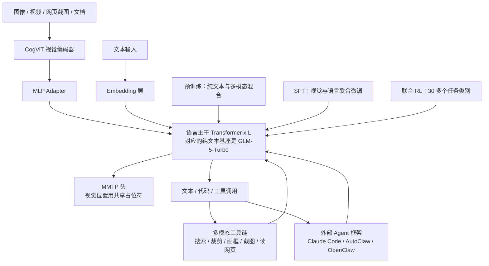
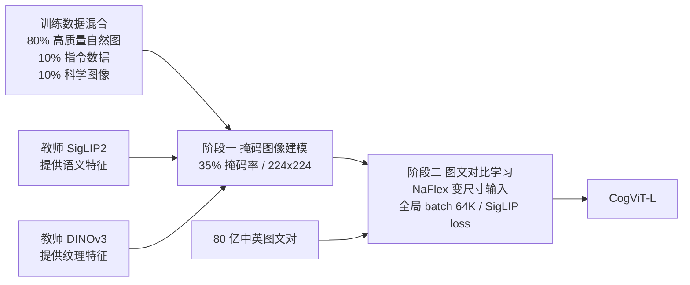
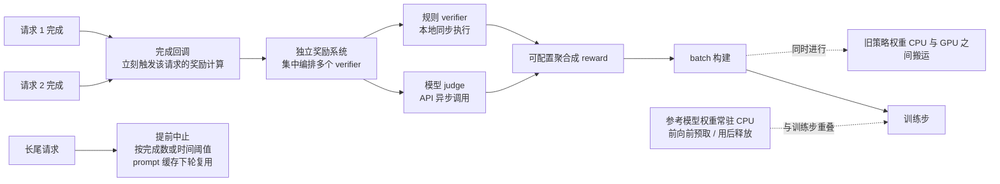
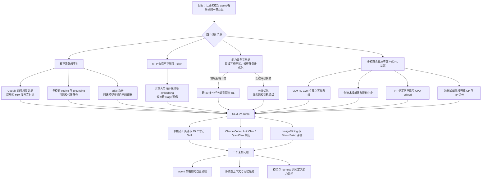

# GLM-5V-Turbo：把感知从输入接口变回决策回路的一部分

<!-- release-date: 2026-04-01 -->

> 本文依据 Z.ai 与清华大学联合发布的 **GLM-5V-Turbo: Toward a Native Foundation Model for Multimodal Agents**，即 arXiv:2604.26752v3、2026-05-12 修订版，共 30 页。页码均指 PDF 本身的页码。
>
> **版本说明**：本文初稿按 v2（2026-05-06）写成，后已换用 v3 原件并逐页复核。v3 相对 v2 只改了两处：第 2 节多出一句「在 UI-to-code 任务上采用了相对视觉策略优化」并新增对应文献 [45]（后续文献编号顺延一位），以及作者名单中一个姓氏更正。分页只有参考文献页 p.17 多出三行，其余 29 页逐页字词一致，本文引用的页码不受影响。
>
> 文中会严格区分三层：报告明确写了什么、我们如何理解它、哪些是外部资料补充。外部内容都会标出来并给链接。以引用块形式出现的报告观点都是中译，不是逐字原文；需要原句时请回查对应页码。

## 阅读前先认识几个词

这篇报告默认读者已经在做多模态和 agent。如果不是，先把下面几个词换成人话，后面会轻松很多。

- **视觉编码器（vision encoder）**：把一张图变成一串向量的模型。它不产出文字，只负责把像素翻译成语言模型能吃的东西。常见实现是 ViT（Vision Transformer），先把图切成小方块（patch），每块变一个向量。
- **视觉 Token**：视觉编码器输出的那串向量，会和文本 Token 拼在同一条序列里送进语言主干。一张高分辨率图可能占掉几百到几千个 Token，这是后面很多问题的根源。
- **对比学习（contrastive learning）**：给模型大量图文配对，让配对的图和文在同一个向量空间里靠近，不配对的推远。CLIP 和 SigLIP 都属于这一类。它学到的是语义，未必是细节。
- **掩码图像建模（Masked Image Modeling，MIM）**：把图的一部分遮住，让模型把遮住的地方补回来。它学到的是纹理和结构，但不天然和文字对齐。
- **蒸馏（distillation）**：让一个学生模型去模仿一个或多个已经训练好的教师模型的输出或中间特征。
- **多 Token 预测（Multi-Token Prediction，MTP）**：训练时除了预测下一个 Token，再挂几个小模块预测更远的 Token。推理时这些小模块可以当草稿模型，一次猜好几个 Token 再由主模型验证，也就是投机解码。
- **Grounding（定位）**：让模型指出某个东西在图里的具体位置，通常输出一个框（bounding box）或一个点。GUI agent 的每一次点击本质上都是一次 grounding。
- **Harness（脚手架）**：包在模型外面那一层工程代码——怎么拆任务、给哪些工具、怎么管上下文、怎么判定成功。同一个模型换个 harness，成绩可以差很多。
- **Rollout**：强化学习里模型实际把任务做一遍产生的完整过程。**Verifier** 是判定这一遍做得对不对的程序或模型。

报告里最关键的三个自造名字是：

- **CogViT**：这一代自研的视觉编码器。
- **MMTP（Multimodal Multi-Token Prediction，多模态多 Token 预测）**：把 MTP 扩展到图像输入的做法。
- **ImageMining**：他们自己收集的一个以图为起点的深度搜索评测集。

## 一句话先说清

先说这份报告最容易被误读的地方：**它不是一份可复现的训练配方，而是一份关于方法的经验报告。**

30 页里，正文只有 12 页，参考文献和作者名单占 5 页，剩下 13 页全是 demo 截图。报告没有公布参数量、层数、上下文长度、预训练 Token 数、RL 算法名称、超参数，也没有给出任何一个组件的端到端消融。

它公布的是另一类东西：

- 一个视觉编码器的两阶段训练思路和它在通用/细粒度基准上的位置（PDF p.2–3）；
- 一个把 MTP 接到图像输入上的具体取舍，以及为什么选它（PDF p.3）；
- 跨 30 多个任务类别联合强化学习之后，各类能力分别涨了多少（PDF p.4）；
- 为多模态 RL 改造训练栈的四个方向，包括一个具体到 GB 的收益（PDF p.4–5）；
- 三条被反复验证有用的设计判断，以及三个他们自己也没解决的问题（PDF p.9–12）。

所以读它的正确姿势是：**不要指望抄配方，要抄判断。**

这篇报告贯穿全文的那个主张是：

> 对 agent 来说，感知不是接在语言模型前面的一个输入适配器，而是推理、规划、工具调用和执行这个循环里的一等公民。（PDF p.1）

这句话听起来像口号。它值不值钱，取决于后面能不能落到具体设计上。本文接下来就一条一条验这件事。

## 先看全景：这个系统由哪几块组成

这张图是我们根据报告第 2、3 节重画的结构示意，不是报告原图。图里混了两类东西：一类是推理时真实的数据通路，另一类是 PRE / SFT / RLX 三个节点，它们表示训练阶段对主干的作用，不参与在线推理。要注意两点。

第一，**它有一个纯文本的对照基座**。报告明确写 GLM-5-Turbo 是它的 language-only base model，多模态版本要做到的是加上视觉能力而不把原来的编程能力弄坏（PDF p.1–2）。至于两者的权重是初始化关系、继续训练关系还是并行训练，报告没有说，只给了 base model 这个身份。这决定了后面评测里那一整块纯文本对比的意义。

第二，**工具链和外部框架不是附录，是设计目标的一部分**。图里那两条从 TOOL 和 FW 回到主干的箭头，就是报告说的 perception–planning–execution loop：模型看一眼环境，决定做什么，做完再看一眼变化了的环境（PDF p.5、p.7）。

### 外部补充：报告没写的规格

以下三项报告里一个字都没有，是外部资料，不能当作论文结论：

- 官方 API 文档给出的上下文长度是 200K、最大输出 128K（[docs.z.ai](https://docs.z.ai/guides/vlm/glm-5v-turbo)）。
- 第三方汇总（[LLM Stats](https://llm-stats.com/models/glm-5v-turbo)、[Vercel AI Gateway](https://vercel.com/ai-gateway/models/glm-5v-turbo)）报出 744B 总参数、40B 激活的 MoE 结构，以及闭源、不开放权重。这些数字没有被论文或官方文档证实，本文不在正文中使用。
- 官方中文博客提到使用 INT8 量化加速推理（[智谱 research/156](https://www.zhipuai.cn/zh/research/156)）。报告里没有这条。

## 第一个矛盾：agent 看不清，后面全是白算

### 旧问题：高层能力的失败，很多其实是低层看错了

这几年多模态的注意力都在往上走：规划、反思、长程推理。报告的观察正好相反——

> 即使在当前最强的一批 VLM 里，细粒度感知和空间理解的错误依然常见，而且这些错误会一路传导到下游的推理、决策和执行。很多看起来是高层的失败，其实起点是模型没把环境看清楚。（PDF p.9，Lens 1）

这个判断对 agent 特别致命。文本 agent 读错一个字，通常下一步就能自我纠正；GUI agent 把按钮位置认偏 20 像素，点下去的是另一个东西，整条轨迹从此走进一个模型自己都不知道的状态。

所以他们的第一件事是重做视觉编码器。

### 新设计：CogViT 的两阶段预训练

CogViT 被描述为 parameter-efficient 的视觉编码器，同时要具备三种能力：通用物体识别、细粒度理解、几何与空间感知（PDF p.2）。

这三件事有内在冲突。纯对比学习擅长语义（这是什么），但对细节和位置不敏感；纯掩码建模擅长纹理和结构，却不和语言对齐。CogViT 的答案是分两段，先补细节，再补对齐。

图为我们按 PDF p.2–3 的文字重画的流程示意，报告本身没有给这张图。

**阶段一：双教师蒸馏式掩码图像建模。** 遮掉 35% 的区域，224×224 分辨率，让学生 ViT 在两个教师的特征空间里把遮住的部分重建出来：SigLIP2 负责语义，DINOv3 负责纹理（PDF p.2）。

这一步的巧思是重建目标不是像素，而是两个教师的特征。重建像素会逼模型去记住噪声和光照；重建特征等于告诉学生“把这块补成语义上和纹理上都对的东西”，两个教师各管一个维度。数据配比是 80% 高质量自然图、10% 指令跟随数据、10% 科学图像——最后那 10% 直接指向后面 STEM 题目里的图表和示意图（PDF p.2）。

优化器用 Muon，配 cosine 衰减；同时引入 QK-Norm，在注意力计算前把 query 和 key 归一化，防止 logit 爆炸（PDF p.2）。QK-Norm 这一条值得单独记：点积注意力的 logit 会随向量模长放大，规模一上去，少量异常大的向量就能把 softmax 推到饱和。先归一化再点积，等于只比较方向、不比较音量。

**阶段二：图文对比学习。** 相对第一阶段有三个升级（PDF p.3）：

1. 用 NaFlex 方案替换固定 224×224，可以处理变尺寸输入并保留原始宽高比；
2. 全局 batch 提到 64K，损失用基于 sigmoid 的 SigLIP loss，配一个双向的分布式实现；
3. 使用 80 亿规模的中英双语图文语料。

第一条对 agent 是刚需。截图、设计稿、网页长图的宽高比千奇百怪，硬缩放到正方形会把版式比例毁掉——而版式比例恰恰是 UI-to-code 任务的答案本身。第二条里 sigmoid loss 而非 softmax 的意义是：softmax 对比损失需要在整个 batch 内做归一化，batch 越大通信越贵；sigmoid 把每个图文对当独立的二分类，才让 64K 这种 batch 在工程上可行。

这一阶段仍用 Muon，但给视觉、文本、投影三个部分分别配学习率和衰减曲线（PDF p.3）。这个细节也可迁移：一个模型里不同模块的梯度尺度本来就不一样，全局一个学习率是默认值，不是最优值。

### 收益：Figure 1 说了什么

报告 Figure 1（PDF p.2）把 CogViT-L 和三个主流编码器放在一起：

| 基准 | CogViT-L (403M) | SigLIP2-SO (427M) | DFN-H (632M) | MetaCLIP2-H (632M) |
|---|---:|---:|---:|---:|
| ImageNet-1K（零样本） | **83.5** | 83.3 | 83.4 | 79.8 |
| 38 CLIP Bench（均值） | **70.4** | 69.1 | 69.6 | 67.7 |
| 14 General Obj Bench（均值） | **45.1** | 41.5 | 43.9 | 45.0 |

（数字读自 PDF p.2 的柱状图标注，加粗为该行最高。）

参数量对比是这张图的重点：403M 打 632M。但要老实读这三行。

- ImageNet-1K 零样本上，83.5 / 83.3 / 83.4 三家基本咬死，领先幅度是 0.1–0.2。
- 38 CLIP Bench 均值上领先 0.8–1.3，是三行里最扎实的一行。
- 14 General Obj Bench 上 45.1 对 MetaCLIP2-H 的 45.0，差距 0.1，实质上是平手，只是参数量少了 35%。

所以准确的说法是：**CogViT 在同等或更好的表现下把编码器做小了**，而不是它在感知上全面领先。报告自己用的词是 competitive，没有说 state-of-the-art。

### 代价与边界

- 报告没有公开 CogViT 的架构细节：层数、隐藏维度、patch 大小、序列长度策略一律没有。图上只出现了 CogViT-L (403M) 这一个规格。
- 没有消融证明 CogViT 对最终 GLM-5V-Turbo 的贡献。换句话说，我们知道这个编码器单独测起来不错，不知道换成 SigLIP2 整个模型会掉多少。
- 两阶段配方本身也没有消融：不做第一阶段直接对比学习会怎样，报告没说。

### 可迁移启发

1. **重建目标可以是别人的特征，不必是原始信号。** 当你有多个各有所长的现成模型时，让学生同时对齐它们的表示空间，比自己重新定义一个损失更省事，也更容易分工。
2. **不要为了工程方便牺牲输入的几何真相。** 变尺寸、保宽高比这件事在做通用 VQA 时可能无所谓，在做版式还原时就是任务本身。先想清楚下游任务对哪一类信息零容忍。
3. **损失函数的形状会决定 batch 能开多大。** 从 softmax 换到 sigmoid 不是精度取舍，是把一个全局同步约束拆成局部计算。遇到分布式瓶颈时，先看目标函数是不是逼你做全局归约。

## 第二个矛盾：多 Token 预测碰上图像 Token

### 旧问题：MTP 头吃的是 Token ID，图像给不出 Token ID

纯文本的 MTP 很直接：前缀 Token 有 ID，查一下词嵌入表就能送进 MTP 头（PDF p.3）。

图像没有 ID。视觉编码器吐出来的是一串连续向量。于是问题变成：**MTP 头到底该拿什么当图像位置的输入？**

这不是学术洁癖。MTP 头在推理时承担投机解码的草稿工作，直接决定吞吐；在训练时它挂在流水线并行的末端，直接决定要跨多少个 stage 搬多少数据。

（报告原文写的目标是 preserve acceptable length，在 MTP 语境下通常指投机解码的接受长度。报告没有展开定义，这里按 MTP 的常规含义理解。）

### 新设计：三个选项，选了第三个

报告系统比较了三种做法（PDF p.3）：

| 选项 | 做法 | 问题 |
|---|---|---|
| 1 | 把语言主干输入端的视觉 embedding 直接送进 MTP 头 | 视觉 embedding 要跨流水线 stage 传播 |
| 2 | 在 MTP 头输入端把所有视觉 Token 掩掉 | 退化成纯文本 MTP，位置信息也丢了 |
| 3 | 保留视觉位置，但把所有视觉 Token 换成一个共享可学习的特殊 Token | 视觉内容本身不进入 MTP 头 |

GLM-5V-Turbo 选了第三个。这个特殊 Token 在报告里写作 `<|image|>`。

选项 3 长这样：原始序列是 `v11 v12 t1 t2 v21 v22 t3 t4 t5`，进 MTP 头时变成 `<|image|> t1 t2 <|image|> t3 t4 t5`——每一段连续的视觉 Token 折成一个占位符，位置结构保留，内容不带（PDF p.3，Figure 2）。

### 工作机制：为什么它同时赢了两边

**对比选项 1（直接送 embedding），赢在系统。** 用占位符之后，视觉 embedding 不再需要跨流水线并行的各个 stage 传播，通信复杂度显著下降，系统可扩展性和工程可维护性都变好（PDF p.3）。

这条要说清楚为什么。流水线并行会把模型按层切到不同设备上，MTP 头挂在最后。如果 MTP 头要吃最前面那一层的视觉 embedding，那这份数据就得从第一个 stage 一路搬到最后一个 stage，或者在每个 stage 都留一份。而 `<|image|>` 是一个词嵌入表里的普通条目，最后一个 stage 自己查表就有了。**一个共享的可学习占位符，把一条跨设备的数据依赖变成了一次本地查表。**

**对比选项 1，也赢在优化。** 在一个 0.5B 模型上的消融里，占位符方案训练 loss 更低、收敛更稳（PDF p.3）。报告 Figure 2 左下角的曲线显示，两条曲线在大约 300 步之后分开，占位符方案（红）稳定压在直接送 embedding（蓝）下面，一直到 2500 步收敛处仍有可见间距。

报告给的是一个假说，不是证明：MTP 头通常很轻，可能没有足够容量去吸收分布和文本嵌入差异很大的视觉表示；换成占位符之后输入形式更统一，优化难度就下降了（PDF p.3）。

**对比选项 2（全掩掉），赢在兼容性。** 保留位置意味着序列长度不变，序列并行和上下文并行的既有切分策略可以直接用，不需要为视觉 embedding 单独处理切分、对齐和偏移映射（PDF p.3）。

### 代价与边界

- **视觉内容确实没进 MTP 头。** 草稿模块在图像位置附近只知道“这里有一张图”，不知道图里是什么。报告没有报告多模态输入下的接受长度或投机解码加速比，所以这个取舍的实际代价是多少，从报告里读不出来。
- **消融只在 0.5B 上做。** 报告没有说这个结论在最终规模上重新验证过。轻量 MTP 头容量不足的假说，恰恰是那种可能随规模变化的假说。
- **MTP 深度没写。** Figure 2 画了 MTP Module 1/2/3 三个模块共享参数，但正文没有说最终用了几个模块，也没说推理时实际展开几步。

### 可迁移启发

1. **当一个模块吃不下另一种模态时，先问它需不需要吃。** MTP 头的任务是猜下几个 Token，它更需要知道位置结构，未必需要图像内容。把“必须传什么”和“习惯上传了什么”分开，往往能砍掉一整条数据通路。
2. **共享可学习占位符是一种便宜的接口收敛手段。** 它把异质输入压成同质形式，代价是丢内容，收益是所有下游切分策略都不用改。
3. **评估一个设计时，把优化收益和系统收益分开算。** 这里两者恰好同向，所以选择很轻松；如果它们反向，你需要知道自己在拿多少 loss 换多少通信。

## 第三个矛盾：能力越多，越互相打架

### 旧问题：SFT 里加一个领域，常常掉另一个

任何做过多任务微调的人都熟悉这件事：加了 OCR 数据，数学掉了；补了 GUI 数据，写作变差了。报告把这个现象叫 cross-domain trade-offs（PDF p.4）。

GLM-5V-Turbo 的路线是把重心压到强化学习上，做跨 30 多个任务类别的联合 RL（PDF p.1、p.4）。

这里有一条只出现在 v3 里的补充：除了把任务面铺开，他们还用了若干算法上的改进，报告举的例子是在 UI-to-code 任务上采用 **relative visual policy optimization（相对视觉策略优化）**，出处指向 UI2Code^N 那篇工作（PDF p.4，文献 [45]）。报告只给了这一句——没说方法的具体形式、用在哪一个训练阶段、单独带来多少增益。所以它只能记成「这条线上还有专门的算法改动存在」，不能当成可复现的做法；v2 里连这句都没有。

### 工作机制：预训练就开始混，不是最后才接

值得注意的是起点。报告说他们从预训练阶段就深度融合视觉和语言，用纯文本加多模态的混合数据，多模态部分覆盖：世界知识、图文交错、OCR、代码、GUI、视频、多模态工具使用、空间感知、grounding、学术题目（PDF p.4）。

其中特别加重了多模态 coding 数据，理由是要把视觉理解和代码生成对齐（PDF p.4）。这一条会在 Lens 1 里再次出现，逻辑闭环。

### 收益：联合 RL 相对 SFT 的分项提升

报告给了一组按能力层次组织的数字（PDF p.4）：

| 层次 | 基准 | 相对 SFT 的提升 |
|---|---|---:|
| 感知 | RefCOCO-avg（2D grounding） | +4.8% |
| 感知 | PointBench（pointing） | +3.2% |
| 感知 | MVBench（视频理解） | +5.6% |
| 感知 | SUNRGBD（3D grounding） | +7.7% |
| 感知 | OCRBench（OCR） | +4.2% |
| 感知 | CharXiv（图表理解） | +7.7% |
| 推理 | MMMU / MathVista / LogicVista 等 STEM | +1.8% |
| Agent | OSWorld（GUI agent） | +4.9% |
| Agent | MMSearch（通用工具使用） | +3.5% |
| Agent | CC-Backend（代码 agent） | +0.2% |

两个读法上的注意事项。第一，报告用的是百分号，但没有说明这是绝对分数差还是相对提升，两种读法差别很大，这里保留问号。第二，CC-Backend 的 +0.2% 基本等于噪声——报告把它和 +7.7% 并列写在同一句里，但它显然不是同一量级的证据。

### 报告观察到的三个现象

这一段是全文最有意思的经验之一，都是作者观察，不是受控实验（PDF p.4）：

1. **RL 的跨领域干扰比 SFT 弱**，多个领域可以一起涨。
2. **分布较窄的领域里，单任务 RL 容易震荡，联合训练反而更稳。** 报告的解释是，联合训练让模型见到更丰富的策略分布，从而被推向更鲁棒的解法。
3. **思维模式会跨任务迁移**：在一个领域学到的推理行为，有时会带到另一个领域并产生可测的收益。

第二条如果成立，是很反直觉的工程结论：**当某个任务的 RL 一直不稳定时，加更多同类数据可能不如加一些不同类的任务。**

### 代价与边界：覆盖范围就是泛化边界

报告没有把这套说法讲成免费午餐（PDF p.4）：

> 我们确实观察到，RL 没有覆盖到的能力有时会在后训练之后下降，尤其是那些和训练任务分布更正交的能力。

给的解释是：RL 推进过程中，模型容量和学到的思维模式会越来越集中到被采样的任务分布上，于是欠代表的领域退化。结论被写成一句很值钱的话——**RL 阶段的任务覆盖范围本身，就是塑造模型最终泛化边界的一个因素。**

出路是代理任务：即使目标能力不能直接写成 RL 任务，语义或结构上相关的代理任务也可能提供有用的优化信号。报告给的例子是，单轮 UI-to-code 生成上的 RL 可以支撑更复杂的多轮编码能力（PDF p.4）。

顺带一提，报告在这一段末尾提到 on-policy distillation 是多任务协同优化的一部分，但**全文没有描述它的任何实现细节**——没有教师配置、没有损失形式、没有采样策略。这里不能当作已公开的方法来读。

### 可迁移启发

1. **把“加了新能力会掉老能力”当成一个可以被训练方式影响的量，而不是宿命。** 报告的经验是 RL 阶段的干扰弱于 SFT 阶段，那么能力合并的位置就应该往后挪。
2. **不稳定的单任务 RL，先试着把它放进更大的任务池，再试着调超参。**
3. **提前列出你不打算放进 RL 的能力清单，并给它们准备回归测试。** 它们大概率会掉，问题只是掉多少、你什么时候发现。

## 第四个矛盾：多模态负载压垮了为文本设计的 RL 基建

这是全篇对基础设施工程师最有价值的一节（PDF p.4–5）。

### 旧问题：文本 RL 的假设在多模态下全部失效

报告把差异说得很具体：多模态多任务 RL 必须处理提示和回复长度的巨大波动，要同时支持单步和多步任务，还要为每个任务协调一个或多个规则型或模型型 verifier（PDF p.4）。

他们沿四个方向重做了训练栈。

### 方向一：统一的任务与奖励抽象

- **VLM RL Gym**：给单步任务和多步任务提供一致的环境接口，让异构任务类型在同一个训练框架里处理（PDF p.5）。
- **独立的奖励系统**：集中编排多个 verifier。规则型 verifier 本地同步执行；模型型 judge 通过 API 异步调用；输出再按可配置的聚合策略合成 reward。关键是 verifier 逻辑不和主训练代码路径纠缠在一起。
- **数据源标签**：每个样本带一个 data-source tag，于是 reward、pass@k 这类指标可以按来源在各并行组之间聚合并分开上报（PDF p.5）。

第三条容易被当成日志功能忽略掉，其实它是前两条的前提。30 多个任务类别混在一个 batch 里训练时，总 reward 曲线是一条毫无诊断价值的线：某个任务崩了，可能被另一个任务的上涨完全掩盖。**混合任务训练的可观测性，必须做在数据结构里，不能靠事后 grep 日志。**

### 方向二：全流水线解耦、异步与阶段重叠

图为我们按 PDF p.5 的文字重画的机制示意，虚线表示并行关系，不表示实测时长；报告没有给出这张流水线图，也没有给出各阶段的实际耗时。

四个具体动作（PDF p.5）：

1. **每个推理请求注册一个完成回调**，请求一结束就触发它自己的奖励计算，不等整个 rollout batch 完成。这直接砍掉长尾请求造成的流水线空转。
2. **batch 构建与旧策略权重的 CPU–GPU 搬运并行执行。**
3. **参考模型的参数常驻 CPU 内存**，在参考前向之前异步预取到 GPU，用完立刻释放，让参考计算和主训练步有效重叠。
4. **两种提前中止模式**：按完成数量或按时间阈值。被中止的 prompt 可以缓存下来复用，从而在不实质降低数据利用率的前提下控制长尾延迟。

第 1 条和第 4 条是一对。第 1 条降低了等待长尾的成本，第 4 条直接砍掉最长的那条尾巴，而缓存复用保证被砍掉的样本不是被扔掉，只是被推迟。**如果你的异步 RL 里必须丢弃某些 rollout，先想清楚丢弃规则会不会顺手引入采样偏置。** 报告用缓存复用把这件事绕开了，这个细节比“支持提前中止”这句话本身重要得多。

第 3 条也值得单独看。参考模型（reference model）在 RL 里只做前向、用来算 KL 之类的约束，是纯粹的显存占用大户。让它平时住在 CPU、用之前才预取，这是拿 PCIe 带宽换 HBM 容量的经典交易——前提是预取能被别的计算盖住，这正是报告强调 overlap 的原因。

### 方向三：视觉侧的细粒度显存管理

标准的重计算方案基本是围绕纯文本训练设计的，没有处理多模态输入带来的显存瓶颈（PDF p.5）。

他们的做法是为视觉侧的 ViT 和 projector 模块单独设计显存策略，把定向重计算和 CPU offload 结合起来。目标写得很明确：**防止激活显存随图像数量线性增长。**

为什么会线性增长？因为一条样本里图片数量是可变的，每张图都要过一遍 ViT，每一遍都留一份激活。文本训练里序列长度可以 packing 到接近定值，图片数量做不到。于是同样一个 micro-batch，显存峰值可能差好几倍。

### 方向四：面向视觉输入的拓扑感知切分与动态负载均衡

这是四条里最精细的一条（PDF p.5）：

- **把 CP 和 TP 的切分从前向阶段前移到数据加载阶段。** 传统做法在前向里切分，意味着每个 rank 必须先持有完整的 patch 张量才能重分发，白白付出显存和通信开销。前移之后，每个 rank 从一开始就只拿自己那份。
- **让切分边界对齐 downsample group。** 视觉编码里通常有下采样步骤，如果切在下采样组中间，就必须跨 rank 聚合 patch。对齐之后这一步直接消失。
- **DP 组之间做完负载均衡后，用异步 all-to-all 精确分发**，每个 rank 只收到它真正需要的那一份。
- **把大的 Python 对象从 GPU 通信路径挪到 CPU 路径**，实测减少约 **7 GB** GPU 通信缓冲区开销。
- **对 rollout 产生的变长序列，同时按序列长度和 ViT Token 数做联合装箱**，让 micro-batch 在算力和显存两个维度上都更均衡。

最后一条是这一节的点睛之笔。文本训练里 packing 只看一个维度：序列长度。多模态训练有两个成本维度——语言主干的成本跟序列长度走，视觉编码器的成本跟 ViT Token 数走。**只按一个维度装箱，另一个维度必然长尾。**

那个 7 GB 也很有教育意义。它不是算法优化，是把不该走 GPU 通信路径的东西挪走。规模上去以后，这种“东西放错了地方”的浪费经常比算法本身的浪费更大。

### 可迁移启发

1. **异步化的收益来自最小完成单元。** 把回调挂在单个请求上而不是整个 batch 上，是这一整套设计的支点。
2. **容错和限流会改变数据分布，除非你显式保留被丢弃的样本。**
3. **多成本维度的负载均衡必须联合做。** 任何一个系统里只要存在两种独立增长的成本，单维度调度就一定会留下长尾。
4. **优化到后期，先审计数据放在哪条路径上，再审计算法。**

## 工具链：会调工具，和会用眼睛调工具，不是一回事

### 旧问题：文本 agent 的工具循环缺了一环

传统 agent 的循环是：读文本 → 调函数 → 读返回文本。整个循环里没有一个环节需要看。

报告的观察是，很多真实任务不是这样：模型必须先解读视觉环境，决定下一步做什么，然后根据动作的结果继续调整行为（PDF p.6）。

### 新设计：把图像变成可交互的环境

报告 Table 1（PDF p.6）列出了自研工具（前缀 `zai_`），同时保持对用户自定义工具的兼容：

| 场景 | 工具组 | 具体工具 |
|---|---|---|
| 通用 | 识别 | 植物识别、地点识别、人物识别 |
| 通用 | 多模态搜索 | 文本搜网页、以图搜网页、搜相似图、搜网页图片、搜学术 |
| 通用 | 浏览器 | 从 URL 载入图片、读网页 |
| 通用 | 图像处理 | 裁剪、画 2D 框、画点标记、画几何图形、画 3D 框、画视频目标跟踪 |
| 创作 | 网页创作 | 提交计划、应用编辑、生成网页 HTML、生成网页大纲 |
| 创作 | 幻灯片创作 | 生成幻灯片 HTML、生成 PPT 大纲 |
| 深度研究 | 多模态 DR | Python、打开多模态 URL、访问图片、搜索、图片搜索、图片 lens |

图像处理那一组是这套工具链和普通 agent 工具箱的真正区别。裁剪、画框、画点、画 3D 框——这些工具的输出还是图，还要再送回模型自己看。**它们把图像从一次性的输入，变成了一个可以反复操作、反复观察的环境。**（PDF p.7 用的说法是 transforming images from static inputs into interactive environments。）

报告举的例子很具体：要复刻一个真实网站时，模型可以先用多模态 GUI agent 通过截图、与页面元素交互、跨页面导航来探索这个站点，建立对布局、功能和交互流程的理解，然后再用原生的 UI-to-code 能力把它复刻出来（PDF p.6）。

这条路径值得停一下：**先探索再生成，而不是看一眼截图直接写代码。** 一张截图只包含一个状态；一个网站的交互逻辑分布在若干个状态之间。

### 收益

相对上一代 GLM-4.6V（PDF p.6）：

- MMSearch-Plus 拿到 30.0，报告称接近前一代的八倍；
- BrowseComp-VL 51.9；
- ImageMining 30.7。

八倍这个说法要小心：报告没有给出前一代的具体分数，只说 nearly an eightfold improvement。按 30.0 反推大约是 3.75 左右——从一个非常低的基数涨起来，倍数会显得很惊人。

另外这里有一处编辑瑕疵：正文写的是 GLM-4.6V，但引用编号 [37] 指向的是 GLM-4.5V 与 GLM-4.1V-Thinking 那篇论文（PDF p.6、p.16）。

### 与外部框架的分工

报告把角色分得很清楚（PDF p.7）：

- **Claude Code 管逻辑和环境**：终端、本地文件系统。
- **AutoClaw 提供动手的那一半**：浏览器和 GUI 自动化。GLM-5V-Turbo 在这里扮演视觉语言控制器。
- **模型自己专注高维推理**，把具体的执行逻辑卸载给框架。

这一段是全篇写得最像宣传稿的地方：没有接口细节、没有性能数据、没有失败模式分析。真正的证据在后面的 Claw 系评测里，而那组数字并不都好看。

### 官方 Skills

报告 Table 2（PDF p.9）列了 15 个官方 skill，按 Type 分三类，每类正好 5 个。正文的说法略有不同：它先说 skill 分成两类，再说另外基于 GLM-OCR 与 GLM-Image 做了 5 个（PDF p.8）。两种说法指的是同一批东西。

- **Native（基于模型原生能力）**：PDF-to-Web、PDF-to-PPT、Web Replication、PRD-to-App、Stock Analyst；
- **External Tool（把模型包成 MaaS API 供 OpenClaw / AutoClaw / Claude Code 调用）**：Image Captioning、Visual Grounding、Doc-based Writing、Resume Screening、Prompt Generation；
- **Specialized（基于此前发布的 GLM-OCR 与 GLM-Image）**：通用 OCR、表格识别、手写识别、公式识别、图像生成。

这个划分本身有工程价值：同一个模型，一部分能力靠内化（模型自己会），一部分能力靠外挂（被别的 agent 当工具调）。**做基座的团队要同时回答“我的模型能干什么”和“别人怎么把我的模型当工具用”，这是两套完全不同的接口设计。**

## ImageMining：为什么要自己造一个评测集

### 旧问题：传统 VQA 允许抄近路

传统 VQA 是一次性的：给图，给问题，出答案。模型完全可以靠参数里记住的知识蒙对，也可以只读图里的文字然后走纯文本推理，图本身只当了个引子。

报告要评的是另一件事，他们叫它 think with image, deep search with image——推理过程要**锚定在视觉上下文里**（PDF p.7）。

### 新设计：用 Visual Jump 把近路堵死

ImageMining 的构造（PDF p.7）：

- **217 条精选测试用例**，来自人工收集的轨迹样本；
- **7 个领域**：社交、娱乐、产品、地点、富文本、自然、科学；
- **5 个推理类别**：通用识别、时空推理、事件推理、基于文本的推理、视觉检索；
- 数据流水线覆盖知识发现、QA 重构、质量过滤三段。

真正的关键约束叫 **Visual Jump**（内部标记为 `WEB_VISUAL`）：在知识发现阶段，中间的推理跳转必须包含视觉转移，逼模型去解析图像，而不是依赖文字捷径或参数化知识（PDF p.7）。

再加一层：专门为图表、地图和海报构造了 OCR Search 数据，逼模型在发起搜索链之前先做实体隔离和局部裁剪（PDF p.7）。

翻译成人话：**一道题如果能不看图就答对，它就不该进这个集合。**

报告还给了一条经验：任务表现和模型在图上使用工具的精度强相关（PDF p.7）。也就是说，裁得准不准，直接决定后面搜得对不对。

### 边界

- 自收集、自评测。报告没有公开评分方式、是否有人工核对、是否有多次采样。
- 只有 217 条。这个规模下，几条题目的差异就能改变名次。
- 在 Figure 4 里，Claude Opus 4.6 在 ImageMining 上是一个横杠，没有分数（PDF p.11）。所以那一行的 30.7 只和 Kimi K2.5 的 24.4 构成对比。
- 数据集本身在 [github.com/zai-org/ImageMining](https://github.com/zai-org/ImageMining)（PDF p.7 脚注），报告没写有多少是公开的。

### 可迁移启发

**造评测集的时候，先定义什么样的题不该进来。** ImageMining 的价值不在 217 这个数字，而在 Visual Jump 这条排除规则——它把“评测多模态能力”这个模糊目标，变成了一条可以逐条判定的构造约束。任何自建评测都可以问同一个问题：如果把我要考的那个模态删掉，还有多少题能做对？

## 三条设计透镜：报告真正想留下的东西

第 4 节标题叫 Design Lenses from Development，作者明确说这不是普适规则，而是在开发过程中反复证明有用的设计视角（PDF p.9）。这三条是全文最可迁移的部分。

### Lens 1：感知始终是上层多模态能力的地基

前面第一个矛盾已经引过这条的核心判断。这里补两个具体做法（PDF p.9）。

**用多模态 coding 和 grounding 当感知的代理任务。** 前端或 SVG 编码这类任务，要求模型抓住布局、结构、相对位置和局部细节，而不能只靠粗粒度语义。报告说：

- 预训练里加入学科图像与其 SVG 表示的配对数据，对下游 STEM 解题有正面贡献；
- RL 阶段加强 grounding 相关训练，改善了 GUI agent 表现。

这个方向很反常识：SVG 代码看起来是个下游生成任务，报告却把它当作提升感知的手段。理由是 SVG 是一种**把视觉结构显式写出来的表示**——你不可能在不理解元素相对位置的情况下写对一段 SVG。**当你想提升某种难以直接监督的理解能力时，找一个必须依赖这种理解才能完成的结构化生成任务，往往比堆判别式标注更有效。**

**训练模型质疑自己的观察。** GUI agent 的指令微调里加了一部分 critic 数据，专门针对推理过程中的错误：看错界面细节、认错目标元素、对下一步动作做出错误判断。报告称这提升了模型对 GUI 细节的观察质量，并减少了几种反复出现的感知失败模式（PDF p.9）。

注意这里 critic 数据针对的是**过程中的错误**，不是最终答案的对错。这和常见的偏好数据不一样：它教的是“你刚才那一眼看错了”，而不是“你最后那个答案不好”。

Lens 1 的结论写得很硬：感知不是一个可以早早解决然后就丢在一边的低层模块，它持续决定上层多模态能力的上限（PDF p.9）。

### Lens 2：agent 能力用分层优化建起来更划算

**旧问题。** agent 训练本身就贵：环境搭建和任务构造成本高，高质量数据稀缺，可靠验证困难。而 agent 任务又难优化：组合复杂、交互轨迹长、解法路径不唯一、强依赖不断演化的环境状态（PDF p.9）。

在资源有限的前提下，核心问题变成：**怎样最大化数据构造的回报率？**

**新设计。** 把优化分布到能力层级的多个层次上，而不是集中在高层长程任务上。GUI agent 的层级是（PDF p.10）：

这张图按 PDF p.10 的文字重画。报告明确说这四级在 **SFT 和 RL 里都用**，不是只在预训练阶段做一次热身。

**为什么划算，报告给了两个理由**（PDF p.10）：

1. 同样的资源约束下，低层任务比长程任务更容易构造、标注和验证；
2. 低层能力还不够时，只在高层任务上使劲往往拿不到可靠收益，反而让训练更不稳定。

第二条比第一条更重要。它说的不是效率问题，是**可优化性**问题：如果模型连按钮在哪都指不准，那么在整条轨迹的成败上给它一个稀疏 reward，梯度里携带的信息几乎为零。

**可迁移启发。** 任何长程、稀疏奖励的任务都可以问一次：这条任务能不能拆成一串各自可验证的子能力？哪一级最便宜？先把便宜那几级做扎实，再往上推。这和课程学习（curriculum learning）不完全一样——课程学习通常调的是同一类任务的难度，这里调的是任务的**抽象层级**，而且各层级同时训练，不是训完一层再进下一层。

### Lens 3：端到端任务的关键不是更长，而是可规定、可验证、可控评估

**旧问题。** 报告说得很直接：对多模态 agent 来说，真正的挑战往往不是把任务拉得更长，而是让端到端任务稳定到足以成为有意义的评估和优化目标（PDF p.10）。

现实的 agent 场景天然开放：目标欠规定、执行边界模糊、结果高度依赖中间决策。结果是这些任务难以一致比较，更难变成可复用的优化信号。

**新观点。** 一个端到端任务的价值，不只取决于它有多真实，还取决于它能否被**规定得足够清楚、验证得足够可靠、在足够的流程控制下被评估**，从而产出稳定且可复用的反馈（PDF p.10）。

**具体落地：Vision2Web。** 这是他们做端到端视觉网站开发的评测（PDF p.10，论文见 arXiv:2603.26648）：

- **任务侧**：每个任务不只是一句文字指令，而是一份更丰富的规格，可能包含 PRD、设计稿、参考页面和素材资源。任务定义因此更明确。
- **评估侧**：不把网站开发当成松散的开放问题，而是用 workflow-based verification——执行过程要经过一串有依赖关系的受控步骤来评估，而不是只看最终状态。
- **收益**：更容易横向比较、更容易归因失败，也可以把不同形式的信号分开建模。报告举的例子是把交互执行中的功能正确性，和更隔离的对比场景里的视觉一致性分开评。

报告自己的总结是：Vision2Web 不只是一个 benchmark，也是一次把任务构造、验证设计和反馈结构对齐起来的尝试（PDF p.10）。

**可迁移启发。** 这条对做 agent 评测的人几乎是可以直接抄的：

1. **把任务规格从一句 prompt 扩成一组约束物**（文档、参考、素材）。开放性不是靠模糊指令制造的，是靠真实约束制造的。
2. **把单点终态判定换成过程判定。** 一个只看最终状态的评测，既不能告诉你哪一步崩的，也很容易被走捷径的解法钻空子。
3. **把不同性质的信号拆开评。** 功能对不对和长得像不像是两回事，混成一个总分就同时失去了两者的诊断价值。

## 评测：哪些结论有证据，哪些要打折

报告在第 5 节把评测分成四类（PDF p.10），结果全在两张图里。

### 多模态与 GUI（Figure 4，PDF p.11）

| 类别 | 基准 | GLM-5V-Turbo | Kimi K2.5 | Claude Opus 4.6 |
|---|---|---:|---:|---:|
| 多模态编码 | Design2Code | **94.8** | 91.3 | 77.3 |
| 多模态编码 | Flame-VLM-Code | 93.8 | 88.8 | **98.8** |
| 多模态编码 | Vision2Web | 31.0 | 33.2 | **43.5** |
| 多模态工具使用 | ImageMining | **30.7** | 24.4 | — |
| 多模态工具使用 | BrowseComp-VL | **51.9** | 42.9 | 35.9 |
| 多模态工具使用 | MMSearch | **72.9** | 58.7 | 63.8 |
| 多模态工具使用 | MMSearch-Plus | **30.0** | 25.6 | 25.6 |
| 多模态工具使用 | SimpleVQA | **78.2** | 71.5 | 63.2 |
| 多模态工具使用 | Facts | **58.6** | 57.8 | — |
| 多模态工具使用 | V* | **89.0** | 84.3 | 66.5 |
| GUI Agent | OSWorld | 62.3 | 63.3 | **72.2** |
| GUI Agent | AndroidWorld | **75.7** | 43.1 | 62.0 |
| GUI Agent | WebVoyager | **88.5** | 84.3 | 88.0 |

怎么读这张表：

- **多模态工具使用是真正的强项**，七行全赢。但领先幅度差别很大：相对表中次名，BrowseComp-VL 领先 9.0、MMSearch 领先 9.1，而 SimpleVQA 领先 6.7、V* 领先 4.7、MMSearch-Plus 领先 4.4、Facts 只领先 0.8。所以全赢里既有明显优势，也有基本持平的行。
- **多模态编码是三行里赢一输二。** Design2Code 94.8 对 Opus 的 77.3 是压倒性的；但 Flame-VLM-Code 输给 Opus 5.0 分，Vision2Web 同时输给 Kimi 和 Opus，31.0 对 43.5 差了 12.5 分。
- **Vision2Web 这一行尤其值得注意：这是他们自己提出的评测集，他们在自己的评测集上是第三名。** 报告把它照实放进表里，没有回避。这一点显著提高了整张表的可信度。
- **GUI 三行也是赢二输一。** AndroidWorld 75.7 领先次名 Opus 的 62.0 有 13.7 分，对 Kimi 的 43.1 更是差出 32.6；WebVoyager 88.5 对 Opus 88.0 只是微弱领先；OSWorld 62.3 同时输给 Kimi 和 Opus，是三行里最弱的一项。
- ImageMining 和 Facts 两行，Opus 是横杠，没有分数。这两行的对比不完整。

一句话概括：**它在“用眼睛去查东西”这件事上明显领先，在“把看到的东西完整变成一个可用系统”这件事上还没有。**

### 纯文本编码与 Claw（Figure 5，PDF p.11）

| 类别 | 基准 | GLM-5V-Turbo | GLM-5-Turbo | Kimi K2.5 | Claude Opus 4.6 |
|---|---|---:|---:|---:|---:|
| 编码 | CC-Backend | 22.8 | 20.5 | 25.3 | **26.9** |
| 编码 | CC-Frontend | 68.4 | 69.4 | 62.3 | **75.9** |
| 编码 | CC-Repo-Exploration | 72.2 | 68.9 | 66.7 | **74.4** |
| Claw | PinchBench（Best/Avg） | 87.0 / 80.7 | 86.5 / 81.1 | 84.8 / 79.2 | **93.3 / 82.9** |
| Claw | ClawEval（Pass^3/Pass@3） | 57.7 / 75.0 | 51.0 / 72.1 | 52.9 / 73.1 | **66.3 / 77.9** |
| Claw | ZClawBench | 57.6 | 60.6 | 49.1 | **62.3** |

这张表要慢慢读，因为它回答的是本报告最核心的一个风险问题：**加了视觉，纯文本编码掉不掉？**

对照的是它自己的语言基座 GLM-5-Turbo：

- CC-Backend：22.8 vs 20.5，**涨**
- CC-Frontend：68.4 vs 69.4，**跌 1.0**
- CC-Repo-Exploration：72.2 vs 68.9，**涨**
- PinchBench：87.0 / 80.7 vs 86.5 / 81.1，best 涨、avg 跌
- ClawEval：57.7 / 75.0 vs 51.0 / 72.1，**两项都涨**
- ZClawBench：57.6 vs 60.6，**跌 3.0**

所以准确的结论是：**加视觉之后纯文本能力没有系统性坍塌，但也不是全面不掉，有两三项确实退了。** 报告正文的说法是 does not materially erode（PDF p.11），这个措辞是准确的。

这里必须指出 v2 的一处不一致。第 1 节的 Overview 写道，模型在 CC-Backend (22.8)、CC-Frontend (68.4)、CC-RepoExploration (72.2) 三项上超过了 GLM-5-Turbo（PDF p.2）。但 Figure 5 里 GLM-5-Turbo 的 CC-Frontend 是 69.4，高于 68.4。**Overview 的这句话和自己的 Figure 5 对不上。** 以图为准的话，三项里只有两项超过基座。这处不一致在 v3 里没有修正：Overview 那句一字未改，Figure 5 里的 69.4 也照旧。

另外，Claude Opus 4.6 在这张表的**每一行**都是第一。报告没有回避这一点，正文只说自己 remains solid。

### 评测本身的边界

- **没有公布任何 harness 细节**：工具集、最大步数、上下文长度、重试规则、采样温度、跑几次取什么统计量，一律没有。而报告自己在第 6 节承认 harness 会显著改变结果（PDF p.12）。两件事放在一起看，这些数字的可比性需要打折。
- **对比模型的分数来源没写**：是自测还是引用官方数字，报告没有说明。
- **ClawEval 的 Pass^3 和 Pass@3**：报告没有定义这两个指标，按通行含义理解，前者是三次都过、后者是三次里至少一次过。若这个理解成立，GLM-5V-Turbo 的 57.7 / 75.0 之间那 17.3 的差距说明稳定性仍有明显空间。
- Design2Code 94.8 这种接近上限的分数，需要知道评分方式才能判断区分度还剩多少，报告没有给。

## 报告自己列出的三个未解问题

第 6 节写得很坦率，而且这三条不是套话，每一条都指向具体机制（PDF p.11–12）。

### 一、更好的 agent 策略怎么涌现出来

现状是：agent 训练严重依赖手工构造或强过滤的冷启动轨迹。这对初始化有效，但它同时**收窄了模型后续可能探索的推理与动作模式空间**，于是后期的改进往往只是局部的——模型变得更擅长执行熟悉的路径，却没有发现真正更好的路径。

他们的实验发现：在冷启动阶段增加轨迹多样性，可以部分松开这个约束，让 RL 更容易找到附近但更优的变体。报告由此提出一个假说：**轨迹多样性可能不只是数据覆盖的问题，而是策略涌现本身的条件之一。**

更远的目标是让模型自己发现更好的推理和 agent 策略，而不是永远在人类给的起始模式上做变奏；再往后还有更难的一层——让模型发现更丰富的组织形式，比如子 agent 分解、多 agent 协作、更灵活的分层决策结构。

这一条对任何做 agentic RL 的人都直接有用：**如果你的 RL 一直只能小幅改进，先检查冷启动数据的多样性，而不是先调 RL 超参。**

### 二、多模态上下文管理是长程 agent 的核心瓶颈

图像、尤其是视频，消耗上下文预算比文本激进得多，在长轨迹里保留它们非常昂贵。实践中的常见应对是：上下文一涨，就把早先的视觉观察丢掉。报告说这是可以理解的工程妥协，但它同时丢掉了那些可能对后续推理、规划或验证仍然重要的信息。

轨迹越长，这个问题越尖锐。纯文本场景里，像 Claude Code 这样的系统可以在上下文快满时压缩或摘要早先的交互历史；多模态场景里，**忠实压缩要难得多，因为需要保留的不只是语义内容，还有可能在后面重新变重要的视觉细节**——布局、空间关系、视频里的时间变化。

报告有一句话概括得很好：现有的记忆机制基本上是以文本为中心的，它们**更擅长压缩说过什么，而不擅长压缩看到过什么、以及视觉状态是怎样随时间演化的**。

结论：对长程多模态 agent 来说，简单地把文本记忆机制搬过来是不够的，需要一种原生多模态的上下文与记忆方案。

### 三、模型和 harness 共同决定能力边界

对 agentic 系统来说，有效能力边界已经不由模型单独决定，而是由模型和它外面那层 harness 共同塑造。任务分解、工具使用、记忆机制、验证回路，都会影响系统实际能做什么。

这带来两个麻烦（PDF p.12）：

- **同一个模型在不同的分解策略、工具策略、记忆设计或验证流程下，表现可能差别很大**；反过来，看起来是模型的局限，有时其实是 harness 选得不好。
- **这种依赖是双向的**：一个 harness 有没有用，取决于模型当前的能力区间。在某个阶段无效的设计，可能在模型跨过某个推理、规划或反馈利用的阈值之后突然变得关键。

所以 harness 不是一层可以独立于模型去优化的稳定外壳，它的角色、价值和最优形态会随模型演化而变化。

这条判断也解释了前面评测那一节为什么要打折：**在 harness 会改变结论的前提下，不公布 harness 的 benchmark 数字，可比性天然受限。** 报告自己写出了这个道理，却没有公布自己的 harness 配置，这是它最明显的一处内部张力。

## 报告没有公开的、以及我们无法核实的

这一节是本文的免责边界，也是读这份报告时最应该记住的部分。

**模型本身**

- 参数量、激活参数、层数、隐藏维度、上下文长度——全部没有。
- CogViT 的架构细节：只在 Figure 1 里出现过 CogViT-L (403M) 这一个规格，没有层数、patch 大小、输入 Token 上限。
- MMTP 的深度：Figure 2 画了三个共享参数的 MTP 模块，正文没有说最终用几个，也没有说推理时展开几步。
- 视觉 Token 的压缩策略、视频抽帧策略：一个字都没有。

**训练**

- 预训练 Token 数、各类数据占比、去重与污染检查。
- SFT 的数据规模和构成。
- RL 用的是哪个算法（GRPO、GSPO 还是别的）、reward 设计、超参数。
- 那 30 多个任务类别具体是哪些，报告只给了少量例子。
- on-policy distillation 只被点名一次，没有任何实现描述（PDF p.4）。
- 训练算力、GPU 数量、训练时长、成本。

**消融**

- 没有任何一个组件在最终模型上的端到端消融。CogViT、MMTP、分层优化、critic 数据的独立贡献都无法从报告中分离。
- MMTP 的消融只在 0.5B 上做，没有说在最终规模验证过。
- 「联合 RL 相对 SFT」那组数字是唯一接近消融的证据，但它比较的是两个训练阶段，不是两个设计选择。

**评测**

- 全部 harness 细节缺失（工具、步数、上下文、重试、采样、统计量）。
- 对比模型分数的来源未说明。
- ImageMining 的评分方式未公开。

**报告的几处编辑瑕疵**（以下逐条在 v3 原件上复核过，均仍然存在）

- Overview 关于 CC-Frontend 超过 GLM-5-Turbo 的说法与 Figure 5 矛盾（PDF p.2 vs p.11）。
- 正文写 GLM-4.6V，引用指向 GLM-4.5V / GLM-4.1V-Thinking 的论文（PDF p.6、p.16）。
- 参考文献里 OSWorld 出现两次（[43][44]）、MMSearch 出现两次（[18][19]）；正文在 p.4 引 [43]、p.10 引 [44]（PDF p.14–17）。
- 第 5 节把 Design2Code 拼成 Desing2Code（PDF p.10）。
- 作者列表里混进一条明显的占位字符串（PDF p.13）。

这些不影响技术内容，但它们共同说明一件事：**这是一份跟着产品发布节奏赶出来的报告，不是一份精修过的论文。** 读的时候对细节交叉核对是必要的。

**我无法核实的**

- 外部资料给出的 744B / 40B MoE 规格，没有官方文档或论文佐证。
- 官方博客提到的 INT8 推理量化，报告里没有，本文不展开。

## 附录里的 13 页 demo 说明了什么

报告 p.18–30 全是定性案例，没有一个数字。它们不是证据，但它们说明了团队认为哪些场景是这个模型的主场（PDF p.18–30）：

- **与 agent 框架和 skill 配合**：用 OpenClaw 加股票分析 skill 产出含技术面、基本面、分析师情绪和行动计划的报告；用 Claude Code 加网页复刻 skill，从一个 URL 出发做 GUI 探索、素材收集、HTML 重建；用 PRD 驱动整站生成（Figure 6–8）。
- **多模态编码**：全栈电商站（含视差滚动、暗色模式配色、单页结账与动态运费计算）、手机 App 界面复刻并补画后续页面、从截图复刻网页并自动抓取图片素材、把论文变成介绍网站、把《Attention Is All You Need》变成幻灯片（Figure 9–13）。
- **多模态深度研究**：图片素材收集并标注每张图的原始出处（Figure 14）。
- **文档写作**：读一份 103 页的中文北京旅游指南，总结十个必去景点并写导览词（Figure 15）。
- **OCR 与文档解析**：多语种逐词识别并标语种；把物理教材页面转成含文字、表格和图的 Markdown（Figure 16–17）。
- **视觉搜索与推理**：一道需要跨图像识别、书名推断、影视改编、豆瓣页面海报计数的多跳题；从一张图定位城镇并查指定日期的酒店价格排序（Figure 18–19）。
- **识别与 grounding**：视频逐秒目标跟踪并输出 JSON、人物框选与命名、GPU 电路板元件框选并与 H100 做参数对比、学生手写答案逐空框选、错别字定位、3D grounding 输出九个值（中心点 x/y/z、尺寸 x/y/z，单位米，加三个弧度制旋转角）（Figure 20–24）。
- **空间推理**：数图里有几根手指并用 `[[x,y]]` 标出位置（Figure 25）。

把这些串起来看，产品意图很清楚：**从视觉输入开始，以代码或结构化动作结束。** 这也解释了为什么它在 Design2Code 和多模态搜索上那么强，而在 Vision2Web 这种要求完整交付一个可用系统的任务上还排第三。

## 最值得带走的七条

### 1. 感知不是可以做完就放下的低层模块

报告用一整条 Lens 说这件事，并给了两个可操作的推论：用结构化生成任务（SVG、前端代码）当感知的代理训练目标；用 critic 数据训练模型质疑自己刚才那一眼看到了什么。

### 2. 想提升难以监督的理解能力，就找一个必须依赖它的生成任务

写对一段 SVG，必须理解元素的相对位置；写对一个前端页面，必须理解布局层次。**生成任务天然携带密集监督信号，而理解任务往往只有稀疏标签。**

### 3. 长程稀疏奖励的任务，先建能力层级再往上推

元素感知 → grounding → 单步动作 → 轨迹。低层任务更容易构造和验证；低层没打好时，只在高层使劲不但拿不到收益，还会让训练更不稳。

### 4. 端到端任务的价值 = 真实性 × 可规定性 × 可验证性 × 可控评估

只有真实性的任务是一个漂亮的 demo，不是一个可优化的目标。Vision2Web 的三个动作可以直接抄：任务规格换成一组约束物、终态判定换成流程判定、不同性质的信号分开评。

### 5. 异步化的收益来自最小完成单元

把奖励回调挂在单个请求上，而不是等整个 rollout batch。而任何丢弃机制都要配一个复用机制，否则容错策略会悄悄变成采样策略。

### 6. 多成本维度必须联合调度

多模态训练里语言主干成本跟序列长度走，视觉编码器成本跟 ViT Token 数走。只按一个维度装箱，另一个维度一定长尾。这条可以推广到任何存在两种独立增长成本的系统。

### 7. 接口收敛可以用一个共享占位符换掉一整条数据通路

MMTP 的 `<|image|>` 是个很小的技巧，但它的形状很通用：当下游模块并不真的需要上游的完整内容，只需要它的结构位置时，用占位符替代可以同时省掉通信、省掉切分适配、还可能让优化更容易。

## 用一张图把全文串回去

图为我们按全文重画的结构总览，节点全部对应报告中实际写到的设计或结论；箭头表示“为了解决”和“共同构成”的关系，不表示时间顺序或数据流。

## 关键词回看

- **CogViT**：自研视觉编码器。阶段一用 SigLIP2 与 DINOv3 双教师做蒸馏式掩码图像建模，阶段二做变尺寸图文对比学习。
- **NaFlex**：处理变尺寸输入并保留原始宽高比的方案，替换固定 224×224。
- **QK-Norm**：注意力计算前归一化 query 与 key，抑制 logit 爆炸。
- **MMTP**：多模态多 Token 预测。保留视觉位置，把视觉 Token 换成共享可学习占位符送进 MTP 头。
- **VLM RL Gym**：给单步与多步任务提供统一环境接口的 RL 框架。
- **拓扑感知切分**：把 CP 与 TP 的切分从前向阶段前移到数据加载阶段，并对齐下采样组边界。
- **联合装箱**：同时按序列长度与 ViT Token 数装箱，让 micro-batch 在算力与显存两个维度上都均衡。
- **Visual Jump**：ImageMining 的构造约束，要求中间推理跳转必须包含视觉转移。
- **分层优化**：把 agent 能力拆成元素感知、grounding、单步动作、轨迹级四层，在 SFT 与 RL 里同时训练。
- **Workflow-based verification**：用一串有依赖关系的受控步骤评估执行过程，而不是只看最终状态。
- **Harness**：包在模型外的脚手架。报告认为它和模型共同决定系统的能力边界。

## 最后的判断

如果只能记住一件事：**这份报告的价值在判断，不在配方。**

它没有给出可复现的训练细节，甚至没有给出参数量。但它给出了三条经过实际开发验证的判断——感知决定上层上限、agent 能力靠分层建、端到端任务的价值取决于能否被规定和验证——以及一整套为多模态 RL 重做训练栈的具体方向。这些东西不依赖某个特定的参数规模，也不依赖某个特定集群，可以直接用在小得多的项目上。

它也留下了清楚的边界。评测里，多模态工具使用七行全赢，多模态编码三行输两行，GUI 三行输一行，纯文本编码在 Claude Opus 4.6 面前每一行都落后，连自己提出的 Vision2Web 都只排第三，加视觉之后相对自家语言基座也有两三项退步。而所有这些数字都是在未公布的 harness 上跑出来的——报告自己在第 6 节说过 harness 会显著改变结论。

所以更准确的定位是：**GLM-5V-Turbo 在“用眼睛去查、去找、去点”这条线上确实走到了前面，在“把看到的东西完整交付成一个可用系统”这条线上还没有。**

最后一句留给报告自己最有分量的那个观察（PDF p.12，中译）：

> agentic 模型的开发已经不能再被框定成改进模型这一件事：有效能力边界越来越由模型和它外面的 harness 共同塑造，用来优化和评估进展的目标也一样。

## 资料与阅读边界

- **原始依据**：本地 `papers/Z.ai/GLM-5V-Turbo.pdf`，即 [arXiv:2604.26752](https://arxiv.org/abs/2604.26752) 的 **v3（2026-05-12）**，共 30 页，是撰稿时的官方最新版。初稿曾按 v2（2026-05-06）写成，换件后已逐页复核；两版差异见文首的版本说明。
- **首发日证据**：`release-date` 取 2026-04-01。依据是官方发布博客 [智谱 research/156](https://www.zhipuai.cn/zh/research/156)、Z.ai 官方 X 账号同日公告，以及官方 API 文档 [docs.z.ai/guides/vlm/glm-5v-turbo](https://docs.z.ai/guides/vlm/glm-5v-turbo) 页面素材的上传时间戳（2026-04-01T12:01Z）。中文媒体多在 4 月 2 日跟进报道，属于次日转载，不改变首发事件本身。
- **官方接入渠道**：[chat.z.ai](https://chat.z.ai/)（报告 p.5 脚注与 p.20 脚注均指向此处）、[BigModel 开放平台文档](https://docs.bigmodel.cn/cn/guide/models/vlm/glm-5v-turbo)。
- **报告给出的开源资源**：[ImageMining 数据集](https://github.com/zai-org/ImageMining)（PDF p.7）、[GLM-skills 仓库](https://github.com/zai-org/GLM-skills)（PDF p.8）。本文没有把仓库里未写进报告的内容当作论文结论。
- **相关论文**：GLM-5（arXiv:2602.15763）、Vision2Web（arXiv:2603.26648）、GLM-4.5V 与 GLM-4.1V-Thinking、GLM-OCR、GLM-Image。这些在报告里被引用，本文只在说明关系时提及，没有代替它们的内容。
- **外部补充（非报告内容）**：200K 上下文与 128K 最大输出来自官方 API 文档；744B / 40B MoE 规格来自 [LLM Stats](https://llm-stats.com/models/glm-5v-turbo) 等第三方汇总，未经官方文档或论文证实；INT8 推理量化来自官方中文博客。以上三项都不是报告写的内容。
