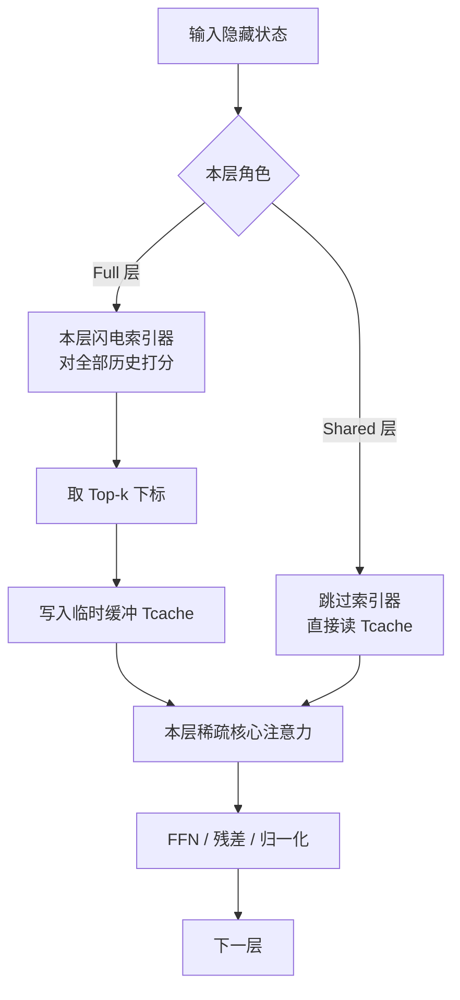

# IndexCache：核心注意力已经稀疏了，索引器却还在每一层付平方账

<!-- release-date: 2026-03-12 -->

> 本文依据清华大学与 Z.ai 发布的 **IndexCache: Accelerating Sparse Attention via Cross-Layer Index Reuse**，即 arXiv:2603.12201v1，封面日期 2026-03-12，共 18 页（正文与参考文献 15 页，附录 3 页）。封面署名两家机构：清华大学、Z.ai；第一作者 Yushi Bai、共同一作 Qian Dong 的贡献产生于在 Z.ai 实习期间（PDF p.1 脚注）。动笔前已核对 [arXiv 官方页](https://arxiv.org/abs/2603.12201) 与 [官方 API](http://export.arxiv.org/api/query?id_list=2603.12201)：该论文目前只有 v1（2026-03-12 17:27:21 UTC），**本地 PDF 就是最新的 v1**，不存在更新修订。页码均指这份 18 页 PDF 本身的页码。本文会把三件事分开写：**报告明确写了什么**、**我们如何理解它**（凡属推算、换算或图上读数都会写明）、**外部资料补充**（会给出链接并标注）。
>
> 这是一篇讲 **IndexCache** 这项技术的论文，不是第二份 GLM-5 基模综述。GLM-5 报告没有覆盖后来产品里称作 IndexShare 的跨层索引复用；本篇才是它的出处。文中出现的 GLM-5 数字，一律来自这篇论文自己的初步实验（尤其是 Figure 1），不要当成 [GLM-5 报告](/reports/Z.ai/GLM-5) 原文。

## 阅读前先搭一张最小地图

这篇论文默认读者已经见过 DeepSeek 稀疏注意力。如果还没有，先记住下面几个名字就够开始读；DSA 的完整机制见本站 [DeepSeek-V3.2](/reports/DeepSeek/DeepSeek-V3.2)，本文不重写那一段历史。

- **Token（词元）**：模型读写文本时的基本小块。
- **注意力（Attention）**：当前 Token 决定「该重点参考前文哪些位置」的机制。
- **Prefill 与 Decode（预填充与解码）**：一次性读完输入叫 prefill；之后逐个吐字叫 decode。两段的瓶颈不一样，加速比必须分开报。
- **DSA（DeepSeek Sparse Attention，DeepSeek 稀疏注意力）**：先用一个很便宜的打分器扫一遍历史，再让昂贵的主注意力只精读得分最高的一小批位置。
- **闪电索引器（lightning indexer）**：DSA 里那个便宜打分器。它仍按序列长度的平方扫一遍，但头少、低秩、用 FP8，单价远低于主注意力。
- **Top-k 下标**：打分之后留下来的那 $k$ 个位置编号。主注意力真正去读的，就是这些编号对应的 KV。
- **MLA（Multi-head Latent Attention，多头潜在注意力）**：DSA 挂上去的那种主注意力；细节见 DeepSeek-V2 / V3.2，本文不展开。

这篇论文自己造的名字只有一套：

- **IndexCache（索引缓存 / 跨层索引复用）**：大多数层不再自己跑索引器，而是复用最近一层「完整层」算出来的 top-k 下标。
- **Full 层（F，完整层）**：保留自己的索引器，当场打分、取 top-k，并把下标写入一个临时缓存。
- **Shared 层（S，共享层）**：没有索引器，直接抄最近 Full 层留下的下标，只做稀疏核心注意力。
- **Training-free IndexCache（无训练版）**：不改权重。在校准集上用语言建模损失贪心搜索，决定哪些层该留索引器。
- **Training-aware IndexCache（训练感知版）**：改权重。用多层蒸馏，让留下来的索引器对齐它服务的所有层的平均注意力分布。

后文会把 IndexShare 当作外部命名补一句。论文正文用的名字始终是 IndexCache。

## 先说矛盾：DSA 把最贵的平方项挪走了，便宜的平方项却乘上了每一层

长上下文的老账单是：每个 Token 都要和前面所有 Token 比一次，比较次数随长度 $L$ 按平方涨。DSA 的答案不是把平方消掉，而是把账拆成两笔：

1. 用闪电索引器给全部历史打分，选出 $k$ 个位置（论文全程 $k=2048$）；
2. 主注意力只在这 $k$ 个位置上计算。

于是**核心注意力**从 $O(L^2)$ 降到 $O(Lk)$，其中 $k\ll L$。（PDF p.1、3）

这已经是生产级方案。问题是第一笔账并没有消失。索引器自己仍是 $O(L^2)$，而且**每一层都要独立跑一遍**。把层数记作 $N$，索引器的总复杂度是 $O(NL^2)$。（PDF p.2）

可以把它想成：以前开会要每个人跟所有人讲话；DSA 改成「先派一个便宜的图书管理员把可能有用的书挑出来，昂贵的主讲只精读这几本」。现在的麻烦是：**每一层都雇了自己的图书管理员，而相邻几层挑出来的书几乎是同一批。**

论文在 30B DSA 模型上做了 profiling，把索引器占端到端延迟的比例画在引言右侧那张未编号图里。数字如下（PDF p.2 读图）：

| 上下文长度 | Prefill 索引器占比 | Decode 索引器占比 |
|---|---:|---:|
| 10K | 27% | 27% |
| 60K | 50% | 31% |
| 120K | 68% | 38% |
| 200K | 81% | 41% |

prefill 侧涨得尤其快：200K 时索引器已经吃掉 81% 的预填充时间。（PDF p.2）论文的判断是：其余计算随长度只温和增长，**再加速长上下文 DSA，关键就是砍索引器**。（PDF p.2）

这就是全文的主矛盾。后面所有设计都对着它：不是再发明一种稀疏注意力，而是承认「选谁看」这件事在相邻层高度重复，然后把重复的选择计算删掉。

## 一句话先说清

IndexCache 做的事情很窄：

> **共享的是稀疏选择的下标，不是注意力本身。** Full 层自己跑索引器，Shared 层复用最近 Full 层的 top-k；核心注意力、KV、FFN 都还是各算各的。

它提供两条互补的路，用来决定「留哪些层的索引器」，以及「留下来的索引器该学成什么样」：

- **无训练版**：校准集上贪心最小化 LM loss，不更新权重，就能在 30B 上丢掉 75% 的索引计算、下游几乎不掉；
- **训练感知版**：多层蒸馏让一个索引器同时服务后面几层，于是连简单的均匀交错图案也能追上全索引器。

30B 上相对标准 DSA，最多 1.82× prefill、1.48× decode；这些数字都绑定 200K 上下文、H100、SGLang。（PDF p.1、3、8）GLM-5 上的数字是另一组初步实验，口径不同，后面单独读。

## 全景：一次前向里谁还在跑索引器



这张图根据论文 Figure 2 重画（PDF p.3），画的是**机制顺序**，不代表耗时比例。原图是并排伪代码：左边标准 DSA 每层都跑索引器；右边只多了一个条件分支——F 层计算并缓存下标，S 层复用缓存。

论文特别写明：`Tcache` 只是一份当前下标张量的临时缓冲，每个 F 层都会覆盖它，**不需要比标准 DSA 多占 GPU 显存**。（PDF p.3）

第一层永远是 F，用来种下最初的下标。（PDF p.4）

## 前提：DSA 已经做完了什么

这一节只交代 IndexCache 站在哪块地上。机制细节以 [DeepSeek-V3.2](/reports/DeepSeek/DeepSeek-V3.2) 为准。

论文把 DSA 拆成两段：选择，再计算。闪电索引器用多头、ReLU 门控的点积给所有前序 Token 打分，取出 top-k，主注意力只在这个稀疏子集上运行。索引器的设计目标是便宜：少头、低秩投影、FP8，论文说它每 FLOP 比主 MLA 便宜一个数量级。（PDF p.3）

DSA 不是从头预训练出来的，而是两段继续预训练：先短时密集预热，只训索引器，用 KL 去对齐该层聚合后的全注意力分布，其余参数冻结；再打开 top-k，联合优化整网，索引器的蒸馏梯度走一条切断的计算图。（PDF p.3）

这些都是 DeepSeek-V3.2 已经验证过的路。IndexCache 接手的，是这条路走完之后剩下的那笔账：索引器仍是每层 $O(L^2)$。论文问的是：这 $N$ 次独立打分，是否真的都必要？（PDF p.3）

## 证据：相邻层挑中的位置高度重叠

答案来自一个更老的观察：全注意力模型里，重要 Token 集合在相邻层相当稳定。Kascade（Deshmukh et al., 2025）和 HySparse（Gao et al., 2026）都利用过这件事——指定少数锚点层算全注意力，中间层复用锚点的 top-k。（PDF p.3–4）

关键限制是：**那些方法的神谕是全注意力。** DSA 已经把全注意力拿掉了，神谕只剩下轻量索引器。于是论文问了一个它认为此前没人问过的问题：索引器的输出，是否也有跨层稳定性？（PDF p.4）

附录 A 给了直接测量。在 47 层的 30B DSA 模型上，对每一对层 $(i,j)$ 计算

$$
\frac{\lvert \mathcal T^{(i)}\cap \mathcal T^{(j)}\rvert}{k}
$$

其中 $k=2048$，在校准集 768 条、每条 200K 的样本上取平均。（PDF p.16）

Figure 4 是这张成对重叠热图。论文读出四件事（PDF p.16）：

1. **对角线附近很高。** 相邻层重叠 0.7–1.0，也就是引言里写的相邻层共享 70–100% 选中 Token。（PDF p.2、16）
2. **有块状结构。** 例如第 3–5、6–8、17–30、31–36 层内部互相重叠很高，像功能块。
3. **块边界衰减更快。** 少数「过渡层」会明显改写注意力焦点。
4. **早期层和晚期层根本不是同一批位置。** 热图左下、右上明显发暗，重叠 $\le 0.4$。

我们的理解（不是论文原话）：这张图解释了为什么「每隔几层留一个索引器」听起来合理，也解释了为什么均匀交错会翻车——块与块之间的过渡层一旦被跳过，后面整段都会拿到错的书单。早期层尤其危险，因为扰动要穿过整座网络。

论文自己还写了一句更有用的话：贪心搜出来的共享块，和热图上肉眼可见的重叠簇**并不完全重合**。原因是重叠只统计「共享了多少个 Token」，不统计「差的是哪几个」。权重冻结时，少数关键位置没选中，就会把隐状态扰动一路传下去。（PDF p.16）

这已经预告了附录 C 的负面结果：用局部相似度选图案，会失败。

## 核心设计：Full 层算索引，Shared 层只抄下标

### 旧问题

如果每层索引器都留着，长上下文的平方项会重新变成瓶颈。如果随便删，选错的那一层会把错误的 top-k 传给后面所有 Shared 层。

### 新设计

把 $N$ 层编码成一条二进制图案 $c=c_1c_2\cdots c_N$，每位是 F 或 S。（PDF p.4）

- **F 层**：保留索引器，对全部前序 Token 算出新的 top-k 集合 $\mathcal T_t^{(\ell)}$，再在这个子集上做稀疏核心注意力，和标准 DSA 一样。
- **S 层**：没有索引器。它继承最近的前驱 F 层的下标：

$$
\mathcal T_t^{(\ell)}\leftarrow \mathcal T_t^{(f(\ell))},\qquad f(\ell)=\max\{j<\ell:c_j=\mathrm{F}\}
$$

然后直接用这份继承来的下标做稀疏核心注意力。（PDF p.4）

注意公式在算什么：它不混合注意力分数，不共享 KV，不共享权重。它只复制**被选中的位置编号**。

### 工作机制

推理循环相对标准 DSA 只多一个条件分支，论文把它画成 Figure 2 的红字行（PDF p.3）：

1. 若本层是 F：跑索引器，取 top-k，写入 `Tcache`；
2. 若本层是 S：`Tcache` 里已有最近 F 层的下标，直接拿来用；
3. 无论 F 还是 S，都用这份下标做本层的稀疏注意力和 FFN。

核心注意力的复杂度仍是 $O(NLk)$，被砍掉的是索引器那笔 $O(NL^2)$ 里的大部分。（PDF p.4）

### 收益

实现成本极低：一个分支、一份会被覆盖的临时缓冲、不额外占显存。（PDF p.3）加速来自少跑索引器，不是来自少存 KV。

### 代价与边界

图案 $c$ 选错，质量会掉。均匀交错 `FSSSFSSS…` 是最容易想到的，论文先证明它不够好，再给出两条补救：无训练版用数据告诉你哪些层不能删；训练感知版让模型适应既定图案。（PDF p.4–6）

第一层必须是 F。S 层不能「向前看」去抄更后面的 F 层，只能抄最近的前驱。这是一个因果约束，不是实现偷懒。

### 可迁移启发

当你系统里有一个「每层都跑一遍」的选择器（索引、路由、检索、剪枝），先量相邻层的选择重叠。如果重叠已经到 70% 以上，真正该优化的往往不是选择器内部，而是**别让同一份选择算 $N$ 遍**。

## 无训练版：不改权重，用 LM loss 决定留谁

### 旧问题：均匀交错为什么差

最简单的策略是每隔 $r$ 层留一个索引器，例如 $r=4$ 就是 `FSSSFSSS…`。这忽略了一件事：索引器的重要性随层剧烈变化。论文观察到，早期层和过渡层对删索引器特别敏感。均匀交错可能删掉关键层、留下可有可无的层。（PDF p.4）

后面 Table 2 会把这句话变成数字。这里先记住设计动机：让模型自己用损失告诉你哪些索引器可以扔。

### 新设计：贪心把 F 改成 S

算法 1 从全 F 出发，目标是把 $K$ 层改成 S（例如要只留 1/4 索引器，就取 $K=3N/4$）。每一步：

1. 在当前仍为 F 的层里（第一层除外），逐个试探「把这一层改成 S」；
2. 在同一批校准数据上算语言建模损失；
3. 提交让损失最低的那一次翻转，并从候选里删掉它。

重复 $K$ 步。（PDF p.5，算法 1）

校准集是从训练数据缓存的 $B$ 个 mini-batch。所有候选图案走完全相同的 batch，损失差只反映图案，不反映数据噪声。（PDF p.5）30B 实验里，这个损失是 SFT 数据上的 per-token validation loss，batch size 768，上下文 200K。（PDF p.7）

### 工作机制：全局代理，不是局部相似度

这一步的关键选择是**用端到端 LM loss 当代理**，而不是用层间注意力输出的余弦相似度。附录 C 证明后者会失败，后面单独写。

完整从全 F 搜到全 S 需要 $N(N-1)/2$ 次前向。本文换算：30B 的 $N=47$，大约 1081 次前向。论文说若流水线并行把模型切成 $P$ 段，就把层按段切块（每块第一层固定为 F），每一步在各块内顺序搜索，一步最多落下 $P$ 层，前向次数大约降为 $1/P$。（PDF p.5）

### 收益：三条作者观察到的性质

论文承认贪心不保证全局最优，但写了三条稳定现象（PDF p.5）：

1. 同样保留比例下，搜出来的图案优于均匀交错（Table 2）。
2. 逐步损失曲线能分开「好删的层」和「关键层」：前 20 步是容易层，35 步之后是关键层。图上标出了保留 1/2、1/4、1/8 的位置；纵轴大约从 0.569 升到 0.571（PDF p.5 右图，读图）。
3. 换不同校准集，重要性排序仍稳定，作者据此说这是模型内在性质，不是数据伪影。并且更低的 LM loss 与更好的下游成绩正相关。

第 2、3 条是作者观察。第 1 条有 Table 2 支撑。

### 代价与边界

- 要有一份校准数据和多次前向。对 200K、batch 768 的 30B 模型，这不是零成本，只是不更新权重。
- 搜到的图案绑定这颗 checkpoint。换模型要重搜。
- 保留到 1/8 时，即使搜过，长上下文仍明显掉点（见实验）。

### 可迁移启发

离散结构（留哪些层、开哪些专家、用哪条分支）不要只优化局部相似度。把「改这一处之后，最终输出分布怎么变」当成目标，哪怕代理只是 LM loss，也往往比层内余弦更接近下游。

另一个更具体的技巧：比较不同结构时，锁死同一批校准样本。否则你比较的是数据噪声，不是结构。

## 训练感知版：让一个索引器同时服务后面几层

### 旧问题

无训练版受限于一个事实：每个索引器当初只为自己那一层训练。权重冻结时，后面的层不得不消化一份「别人的书单」。所以无训练版必须小心避开敏感层。

如果允许继续训练，就可以反过来做：让留下来的索引器**一开始就按「我要服务好几层」来学**。（PDF p.6）

### 新设计：多层蒸馏

标准 DSA 里，第 $\ell$ 层索引器只对自己层的聚合注意力分布做 KL：

$$
\mathcal L_I=\sum_t D_{\mathrm{KL}}\big(p_t^{(\ell)}\,\big\|\,q_t^{(\ell)}\big)
$$

其中 $p_t^{(\ell)}$ 是该层各头 softmax 注意力权重的平均，$q_t^{(\ell)}=\operatorname{Softmax}(I_t^{(\ell)})$ 是索引器输出分布。（PDF p.4、6）

现在第 $\ell$ 层是 F，后面 $\ell+1,\ldots,\ell+m$ 是将要复用它下标的 S 层。多层损失改成：

$$
\mathcal L_I^{\mathrm{multi}}=\sum_{j=0}^{m}\frac{1}{m+1}\sum_t D_{\mathrm{KL}}\big(p_t^{(\ell+j)}\,\big\|\,q_t^{(\ell)}\big)
$$

（PDF p.6，式 1）

直观含义：索引器要预测一份对它服务的所有层都有用的 top-k，而不是过拟合本层。

### 工作机制：加和 KL 等于蒸馏到质心

有人会担心「对多个分布分别做 KL」会不会搞出奇怪的交互。论文证明，它对参数的梯度，和「先把目标分布平均再做一次 KL」完全一样。（PDF p.6，命题 1）

先定义平均目标

$$
\bar p_t=\sum_{j=0}^{m}\frac{1}{m+1}p_t^{(\ell+j)}
$$

以及单目标损失 $\mathcal L_I^{\mathrm{avg}}=\sum_t D_{\mathrm{KL}}(\bar p_t\|q_t^{(\ell)})$。因为 KL 对 $q$ 求导时，$p$ 的熵项消失，多层加和正好把各层的 $p$ 收成 $\bar p$。所以：

$$
\nabla_\theta\mathcal L_I^{\mathrm{multi}}=\nabla_\theta\mathcal L_I^{\mathrm{avg}}
$$

（PDF p.6，式 2–3）

我们的理解：这不是启发式正则，它就是在让索引器瞄准若干层注意力分布的质心，学一份共识 top-k。

实现上他们仍用 $\mathcal L_I^{\mathrm{multi}}$ 而不是 $\mathcal L_I^{\mathrm{avg}}$。理由是工程：S 层只需要接收当前层的 $q^{(\ell)}$；若走平均损失，还要把 $p^{(\ell)}$ 一并传来，多占显存、多费时间。（PDF p.6）

训练仍分两段，对齐标准 DSA：预热阶段只训 F 层索引器，用 $\mathcal L_I^{\mathrm{multi}}$，其余参数冻结；稀疏阶段继续用只在选中 top-k 上计算的 $\mathcal L_I^{\mathrm{multi}}$，并加上 LM loss 训其余参数。（PDF p.6）

### 收益

训练之后，图案敏感性消失：均匀交错就能追上全索引器，不必再依赖贪心搜出来的「避开敏感层」图案。（PDF p.9）这是无训练版做不到的。

### 代价与边界

- 要训练。论文的 30B 训练感知实验并没有走完整 DSA 继续预训练，而是从 GLM-4.7-Flash 基座出发，在 200K SFT 上做 1000 步密集预热 + 4000 步稀疏训练的短管线，作者说它「closely matches」完整 DSA 训练、够用来评估 IndexCache。（PDF p.7）
- GLM-5 上的训练感知版，论文明确写的是「计划不久后做」，本文没有结果。（PDF p.10）
- 多层蒸馏的监督信号仍是各层注意力分布。如果某些层的注意力本身就不该被平均掉（例如过渡层），质心可能是折中而不是正确。论文没有按层类型拆开消融这件事。

### 可迁移启发

当一个选择器要被多个下游模块复用，不要让它继续只模仿「自己原来那一层」。把被服务对象的目标分布平均（或证明与平均等价），再蒸馏。选择器和执行器之间，监督信号从哪来、梯度通不通，比选择器内部多几个头更重要。

## 实验怎么测：30B 从哪来、测什么、在哪台机器上

### 模型

实验用的 DSA 模型，从 **GLM-4.7-Flash** 的基座继续训出来。这是 30B-A3B 的 MoE，MLA，47 层。论文说它的评测表现与原始 GLM-4.7-Flash 相当，指向 GLM-5 报告 Table 6。（PDF p.7）

这句话只用来定位骨架。不要把它扩写成又一篇 GLM 综述。

### 两条管线不要混

- **无训练版**：已经是 DSA 的模型，图案搜索看 SFT 上 768 batch、200K 的 per-token validation loss。（PDF p.7）
- **训练感知版**：直接从 GLM-4.7-Flash 基座训成带共享图案的 DSA，1000 + 4000 步，200K SFT。所以 Table 3 的 DSA 基线，和 Table 2 的「Original DSA」不是同一个 checkpoint；论文自己写了这一点，并说成绩有小差异。（PDF p.7、9）

### 评测集

五个长上下文：MRCR v2、GraphWalks、LongBench v2、RULER、AA-LCR。四个通用与推理：AIME 2025、GPQA-Diamond、LiveCodeBench v6、IFBench。细节在附录 D。（PDF p.7、18）

附录 D 的口径（PDF p.18）：

- 采样：temperature 1.0，top-p = 0.95，top-k = 40；
- 长上下文：总窗口 200K，其中 32K 留给输出，有效输入预算 168K；
- 通用与推理：最大输出 64K；
- MRCR v2 报 2 / 4 / 8 needle 平均；GraphWalks 报 Parent 型与 BFS 型平均；RULER 报 4K 到 128K 全部实例；
- MRCR 与 GraphWalks：输入放不进 168K 的样本直接丢；
- LongBench v2、RULER、AA-LCR：超长样本做中间截断（middle truncation）。

### 测速环境

30B，SGLang，`dp attention` 打开，`dp size=8`，一块 NVIDIA H100 节点。对照是原始 DSA，以及保留 1/2、1/4 索引器的 IndexCache。上下文取 10K、60K、120K、200K。三项指标（PDF p.7）：

1. prefill 延迟，即 time-to-first-token；
2. 单并发 per-request decode 吞吐（每张 GPU 一个请求）；
3. KV Cache 打满时的总 decode 吞吐（每张 GPU 约 800K Token），按 GPU 计。

## 30B 上的速度：索引器越占主导，加速比越大

Table 1 是实测墙钟，不是 FLOPs 估算。（PDF p.7）

| 指标 | 10K | 60K | 120K | 200K |
|---|---:|---:|---:|---:|
| Prefill 秒，DSA | 0.57 | 3.38 | 8.57 | 19.5 |
| Prefill 秒，IndexCache 1/2 | 0.47 | 2.86 | 6.57 | 13.7 |
| Prefill 秒，IndexCache 1/4 | 0.45 | 2.59 | 5.66 | 10.7 |
| Decode tok/s（单请求），DSA | 73.5 | 67.0 | 63.0 | 58.0 |
| Decode tok/s（单请求），1/2 | 84.5 | 80.0 | 77.0 | 73.0 |
| Decode tok/s（单请求），1/4 | 91.0 | 89.5 | 88.0 | 86.0 |
| Decode tok/s（满 KV），DSA | 2700 | 613 | 341 | 197 |
| Decode tok/s（满 KV），1/2 | 3070 | 750 | 431 | 253 |
| Decode tok/s（满 KV），1/4 | 3310 | 840 | 498 | 297 |

正文把 200K、1/4 保留写成摘要里那两个头条数字（PDF p.8）：

- prefill：19.5 s → 10.7 s，**1.82×**，来自删掉 75% 的索引计算；
- 单请求 decode：58 tok/s → 86 tok/s，**1.48×**，因为 decode 每个新 Token 都要对全上下文跑一遍索引器，长序列时这就是瓶颈；
- 满 KV decode：197 → 297 tok/s，**1.51×**。论文还写满 KV 总吞吐在各长度上提升 22–51%，最长处最大。（PDF p.8）

10K 时索引器占比更小，1/4 仍有 1.27× 的 prefill 加速。（PDF p.8）Figure 3 把 Table 1 画成相对 DSA=100% 的柱（PDF p.8）。本文不再贴原图，表已覆盖那些柱子的含义。

论文对外推写了一句：超过 200K 时加速「expected to」更大。这是预期，不是实测。（PDF p.8）

读这些速度时有三条边界：

1. 对照是**标准 DSA**，不是全注意力。1.82× 不是相对稠密 Transformer。
2. 测的是 30B、H100、SGLang、`dp size=8`。换模型宽度、换 kernel、换并发，比值会动。
3. 满 KV 那一行的「约 800K tokens / GPU」是论文给的配置，不是 200K 请求长度本身。

## 30B 上的质量：无训练版看「留哪几层」，有训练版看「会不会适应」

### 无训练版：均匀交错会掉，搜过的 1/4 几乎不掉

Table 2 在同一颗 30B DSA 上比三个保留比例，每个比例都有均匀交错 vs 贪心图案。（PDF p.8）

| 配置 | Long 均分 | G&R 均分 | MRCR | GW | LB2 | RULER | LCR | AIME | GPQA | LCB | IFB |
|---|---:|---:|---:|---:|---:|---:|---:|---:|---:|---:|---:|
| Original DSA | 50.2 | 74.6 | 24.5 | 49.6 | 45.5 | 87.9 | 43.6 | 91.0 | 77.6 | 71.4 | 58.4 |
| 1/2 均匀 | 47.4 | 74.3 | 22.0 | 46.6 | 46.0 | 83.6 | 38.6 | 92.2 | 76.4 | 69.7 | 59.0 |
| 1/2 + 搜索 | 50.3 | 74.4 | 24.7 | 49.5 | 46.3 | 87.8 | 43.2 | 91.9 | 76.3 | 71.3 | 58.2 |
| 1/4 均匀 | 43.0 | 73.8 | 17.7 | 37.2 | 43.1 | 79.2 | 37.8 | 91.3 | 75.7 | 69.4 | 58.9 |
| 1/4 + 搜索 | 49.9 | 74.9 | 25.1 | 47.4 | 45.7 | 87.6 | 43.8 | 92.6 | 78.6 | 70.0 | 58.3 |
| 1/8 均匀 | 35.3 | 70.0 | 12.9 | 33.1 | 37.7 | 68.8 | 24.0 | 89.1 | 74.1 | 58.7 | 58.0 |
| 1/8 + 搜索 | 46.1 | 73.7 | 21.7 | 43.8 | 42.3 | 82.0 | 40.8 | 90.7 | 76.5 | 69.6 | 58.1 |

论文自己的读法（PDF p.8–9）：

- 均匀交错在长上下文上掉得很快：1/2 的 Long 均分 50.2→47.4（−2.8），1/4 则 50.2→43.0（−7.2）。
- 贪心图案基本把缺口补回来：1/4 回到 49.9，1/2 到 50.3，都和原始 DSA 相当。结论是：**留哪些层，比留多少层更重要。**
- 1/8 是质量悬崖。均匀交错掉到 35.3，搜索也只能救到 46.1。搜索仍明显好于均匀，但长上下文损失「non-negligible」。
- 推理能力几乎不动。除了 1/8 均匀交错，G&R 均分都在基线 74.6 的 1 分以内（73.7–74.9）。1/4 搜索图案在 AIME 2025（92.6 vs 91.0）和 GPQA-Diamond（78.6 vs 77.6）上甚至略高。作者猜测删掉冗余索引器在推理期可能像一层轻正则。这是观察，不是对照实验。

### 训练感知版：均匀交错就够了，但跨层蒸馏不能省

Table 3 的基线是短管线训出来的 DSA，所以 Original 的 Long 均分是 51.0 而不是 Table 2 的 50.2。（PDF p.9）

| 配置 | Long | G&R | MRCR | GW | LB2 | RULER | LCR | AIME | GPQA | LCB | IFB |
|---|---:|---:|---:|---:|---:|---:|---:|---:|---:|---:|---:|
| Original DSA（短管线） | 51.0 | 74.2 | 24.7 | 49.1 | 46.9 | 87.3 | 47.0 | 88.8 | 79.4 | 70.5 | 57.9 |
| 1/2 均匀 | 51.6 | 74.5 | 23.8 | 50.2 | 47.2 | 87.0 | 49.8 | 89.3 | 76.7 | 72.2 | 59.9 |
| 1/2 + 搜索图案 | 50.6 | 73.6 | 23.9 | 48.1 | 47.1 | 87.5 | 46.6 | 89.6 | 78.6 | 68.5 | 57.7 |
| 1/2 去掉跨层损失 | 49.8 | 74.5 | 24.6 | 48.3 | 45.0 | 87.1 | 44.0 | 88.8 | 79.4 | 71.7 | 58.0 |
| 1/4 均匀 | 50.6 | 74.1 | 23.7 | 48.1 | 46.9 | 86.1 | 48.4 | 89.3 | 78.0 | 70.5 | 58.7 |

三条结论（PDF p.9–10）：

1. **能追上基线。** 1/2 均匀的 Long 均分 51.6，略高于 51.0；G&R 74.5 vs 74.2。1/4 均匀的两项均分都在基线 0.4% 以内。论文据此说 DSA 能被训成适应共享图案。
2. **图案敏感性消失。** 无训练时搜索图案是救命的；有训练时，1/2 均匀甚至略好于搜索图案（51.6 vs 50.6，74.5 vs 73.6）。解释是：S 层学会了消化继承来的下标，F 层的索引器也学会了产出跨层通用的选择。两者一起，把「某层非用自己的索引器不可」消掉了。
3. **跨层蒸馏有用。** 去掉它，Long 均分 51.6→49.8，AA-LCR 49.8→44.0。说明质心目标不是摆设：索引器若仍只模仿自己那一层，共享之后会在长上下文推理上露馅。

训练感知实验只做了 1/2 和 1/4，没有 1/8。1/4 也没有再跑「搜索图案」和「去掉跨层损失」两组消融。这些是报告没做的，不是我们漏读。

## GLM-5 上的初步实验：读论文 Figure 1，不要读成 GLM-5 报告

这一节的全部数字都来自 IndexCache 论文，不是 GLM-5 技术报告。GLM-5 报告未覆盖 IndexShare / IndexCache。

论文把无训练版套到默认就用 DSA 的 GLM-5 上：744B 总参、40B 激活。（PDF p.10）Table 4 只报五个长上下文基准：

| 配置 | Long 均分 | MRCR v2 | GraphWalks | LongBench v2 | RULER | AA-LCR |
|---|---:|---:|---:|---:|---:|---:|
| Original DSA | 78.4 | 71.1 | 92.7 | 64.5 | 97.7 | 66.2 |
| 1/2 均匀 | 78.1 | 72.8 | 90.2 | 65.1 | 97.6 | 64.6 |
| 1/2 + 搜索 | 78.7 | 72.3 | 90.8 | 66.0 | 97.3 | 67.2 |
| 1/4 均匀 | 72.7 | 65.8 | 74.9 | 62.2 | 96.2 | 64.6 |
| 1/4 + 搜索 | 78.0 | 70.8 | 90.3 | 63.7 | 97.6 | 67.6 |

趋势与 30B 同构：均匀交错在 1/4 时明显掉（78.4→72.7，GraphWalks 92.7→74.9），搜索图案把 1/4 拉回 78.0（相对基线 −0.4）。1/2 搜索略超基线（78.7 vs 78.4）。论文认为 1/2 均匀几乎不掉（78.1 vs 78.4）「likely coincidental」——固定交替碰巧没跳过最关键的索引器。（PDF p.10）

Figure 1 是另一组口径，不要和 Table 4 的 1/4 速度数字混在一起。图例写的是 **GLM-5 + IndexCache (1/2): 1.2× E2E Speedup**；图注写删掉 50% 索引计算、长上下文与推理任务都可比、约 1.2× 端到端加速。（PDF p.1）正文对应句是：对 1/2 保留的 IndexCache 在 Artificial Analysis Index 上做了全项评测，表现与原始 GLM-5 几乎相同，见图 1。（PDF p.10）

下面这些柱子高度是本文从 Figure 1 读出的，报告没有另给数值表：

| 基准 | GLM-5 | GLM-5 + IndexCache 1/2 |
|---|---:|---:|
| MRCR v2 | 71.1 | 72.3 |
| GraphWalks | 92.7 | 90.8 |
| LongBench v2 | 64.5 | 66.0 |
| RULER | 97.7 | 97.3 |
| AA-LCR | 66.2 | 67.2 |
| HLE | 30.4 | 30.4 |
| HLE（带工具） | 50.4 | 50.3 |
| SciCode | 45.0 | 47.0 |
| AIME25 | 95.9 | 95.9 |
| IFBench | 71.0 | 70.0 |

前五行与 Table 4 的「1/2 + 搜索」完全一致，所以 Figure 1 画的就是那条搜索图案，不是均匀交错。后五行只出现在 Figure 1 里。

速度数字在 GLM-5 上有两套，必须分开引：

| 说法 | 保留比例 | 指标 | 出处 |
|---|---|---|---|
| 约 1.2× 端到端 | 1/2 | E2E speedup，与 Figure 1 质量柱配在一起 | PDF p.1 图注 / 图例 |
| 至少 1.3× | 正文未在该句写比例 | 长上下文质量几乎不掉的同时「at least 1.3× speedup」 | PDF p.3 |
| 至少 1.3× prefill **和** decode | **1/4** | 上下文超过 100K | PDF p.8 |

p.3 那句没有写 1/2 还是 1/4。p.8 写明是 1/4、超过 100K、prefill 与 decode 都至少 1.3×。Figure 1 的 1.2× 是 1/2 的端到端。三者不要合成一个「GLM-5 加速 1.3 倍」。

论文还说：计划把训练感知版做到这个生产级模型上；鉴于无训练版已经对齐基线，他们对训练感知能进一步稳住收益表示乐观。（PDF p.10）这是展望，不是结果。

边界很清楚：

- 没有 GLM-5 的完整推理表，对标 30B 的 Table 1；
- 没有 GLM-5 的通用与推理表，对标 30B 的 Table 2 右半；Figure 1 那五根柱是目前仅有的补充；
- 没有 GLM-5 训练感知结果；
- 没有并发、量化、集群规模。744B、40B 激活是论文写明的模型规格，不是测速条件。

## 和「跨层共享注意力」旧工作差在哪

第 5 节分两块：高效注意力，以及跨层共享。（PDF p.10–11）

第一块是背景地图：推理期稀疏（H2O、StreamingLLM、Quest、MInference 等）会有训推不一致；可训练稀疏包括 NSA、MoBA、InfLLM-v2、DSA 自己；混合架构则用滑窗、线性注意力或状态空间层去减平方层的数量。IndexCache 的地基明确写成 DSA。（PDF p.10）

第二块才是它要划清的界限。TidalDecode、LessIsMore、OmniKV、DELTA 从周期性锚点层复用 top-k 做稀疏解码；Kascade 用动态规划在跨层相似度矩阵上选锚点，并强调 head-aware remapping。这些方法都依赖锚点层的**全注意力**来得到精确 top-k。另一条独立的线是跨层 KV 共享，让多层复用同一份键值张量。HySparse 把两条线并起来：全注意力层与稀疏层交错，稀疏层同时继承 top-k 块下标和 KV。（PDF p.11）

IndexCache 的差别，论文写了两点（PDF p.11）：

1. **神谕更便宜。** 共享的是 DSA 轻量索引器的输出，不是 $O(L^2)$ 的全注意力分数。
2. **给共享配置本身做了系统优化。** 无训练贪心搜结构，训练感知用多层蒸馏做参数适应。

用人话讲：旧工作共享的往往是注意力本身，或至少需要一层真的全注意力当老师；这里共享的只是「该看哪些下标」，每一层仍用自己的 KV 做自己的稀疏注意力。DSA 已经取消全注意力，所以旧方法不能直接搬过来。

论文认为这个原则不绑死在 DSA 上。任何不是固定稀疏图案、而是动态选 Token 的方法，例如 MoBA 和 NSA 的块级选择，原则上也可以跨层复用。（PDF p.11）这是类推，不是实验。

## 附录：重叠热图、搜到的图案、失败的相似度搜索

### 附录 A：热图与贪心块对不上是有信息的

上文已经用过重叠定义和四条读图结论。还要记住那句：贪心块与自然重叠簇不完全重合，因为重叠是聚合指标，冻权重时少数关键 Token 的错选会沿网络级联，早期层路径最长、最脆弱。（PDF p.16）这为附录 C 做铺垫。

### 附录 B：搜出来的 F/S 串

论文把图案原样打印出来（PDF p.17）。下面的 F 计数是本文对字符串的清点，用来核对「1/2、1/4、1/8」是名义比例。

**GLM-4.7-Flash 30B DSA，长度都是 47，与层数一致：**

| 名义比例 | 图案 | 本文清点 |
|---|---|---|
| Keep 1/2 | `FSFSFSSSSFSFFFFSFFSSFFSFFFSSFFSSFSSSSFSFFFSFSSF` | 24 个 F / 23 个 S |
| Keep 1/4 | `FSFSFSSSSFSSSFSSFFSSFSSFSSSSFSSSFSSSSFSSSSSSSSS` | 12 个 F / 35 个 S |
| Keep 1/8 | `FSSSFSSSSSSSSFSSSFSSSSSFSSSSFSSSSSSSSFSSSSSSSSS` | 7 个 F / 40 个 S |

30B 的 1/4 图案里，F 的 1-based 位置是 1、3、5、10、14、17、18、21、24、29、33、38。前几层更密，尾部可以连续 9 个 S。这和「早期 / 过渡层更敏感、不能均匀删」一致。

**GLM-5 的两串长度都是 78：**

| 名义比例 | 本文清点 |
|---|---|
| Keep 1/2 | 40 个 F / 38 个 S |
| Keep 1/4 | 22 个 F / 56 个 S |

1/4 名义下实际约 28% 的 F，不是严格 1/4。论文仍写作 Keep 1/4。78 与 GLM-5 报告里 80 / 79 的层数口径也不完全对齐；本文不把它改写成 GLM-5 结构考据，只记录：IndexCache 论文附录打印的就是 78 个字符。

### 附录 C：作者主动写下来的失败路径

在改用 LM loss 贪心之前，他们试过一个更「像那么回事」的替代：用注意力输出相似度来选图案。计算更便宜，理论动机也清楚，但对下游质量不够格。作者专门写出来，作为负面结果。（PDF p.17）

做法：做 $N$ 次单前向。对每一对 $i>j$，算两份第 $i$ 层核心注意力输出的余弦——一份用第 $i$ 层自己的索引器，一份让第 $i$ 层复用第 $j$ 层的索引器。得到下三角矩阵 $S$，$S_{i,j}$ 越接近 1，越说明 $j$ 可以当 $i$ 的索引代理。（PDF p.17）

给定要留 $M$ 个 F 层，目标是让所有 S 层的相似度之和最大：

$$
c^*=\arg\max_{c:\,|\{i:c_i=\mathrm{F}\}|=M}\sum_{\ell:\,c_\ell=\mathrm{S}} S_{\ell,\mathrm{src}(\ell)}
$$

$\mathrm{src}(\ell)$ 仍是最近的前驱 F 层。这可以用动态规划精确求：`dp[i][k]` 表示前 $i$ 层恰好用 $k$ 个 F、且第 $i$ 层自己是 F 时的最大累计相似度，转移是枚举上一个 F 层 $j$，把中间那些 S 层的 $S_{m,j}$ 加进去。（PDF p.17–18，式 4–5）

Table 5 只报了三项长上下文的均分（PDF p.18）：

| 配置 | 三项均分 | MRCR v2 | GraphWalks | RULER |
|---|---:|---:|---:|---:|
| Original DSA | 54.0 | 24.5 | 49.6 | 87.9 |
| 1/2 均匀 | 50.7 | 22.0 | 46.6 | 83.6 |
| 1/2 + 相似度搜索 | 49.8 | 22.9 | 43.5 | 82.9 |

三项均分 54.0 正好是 (24.5+49.6+87.9)/3，与 Table 2 的五项 Long 均分不是同一口径。结果本身更重要：相似度最优图案**没有好过均匀交错**，GraphWalks 和 RULER 甚至更差。对比之下，LM loss 贪心在激进保留比例上明显优于两者。（PDF p.18）

失败原因写得很清楚：层内输出相似度是局部指标，看不到扰动如何向后传播。两层注意力输出可以几乎一样（$S_{i,j}\approx 1$），却在少数关键 Token 上有差别；这些差别要到更后面的推理步骤才爆发。贪心直接优化全局 LM loss，才能认出那些「看起来和邻居差不多、其实不能删」的关键层。（PDF p.18）

这是全文最值得记住的方法论结论之一，重要性不亚于 1.82×。

## 报告没有公开的部分

18 页论文把主线和附录里的负面结果都写了。仍有一批实现与实验细节不在原文里：

- 30B 从 GLM-4.7-Flash 基座训成 DSA 的完整超参、数据配比、与「完整 DSA 训练」之间究竟差多少；「closely matches」没有对照表；
- 训练感知短管线的学习率、batch、KL 系数、是否切断索引器梯度；
- 校准集 $B$ 的具体值、SFT 数据来源、不同校准集稳定性实验的原始数字——正文只给定性；
- 贪心搜索是否真的用了流水线分块加速、$P$ 是多少、实际前向次数；
- 30B 测速的 kernel、精度、是否含索引器 KV、H100 节点的 GPU 数；满 KV 约 800K 如何切分；
- GLM-5 1.2× / 1.3× 的硬件、并发、是否量化、prefill/decode 是否同一条曲线；p.3 的 1.3× 与 p.8 的 1/4、>100K 如何对齐；
- GLM-5 训练感知结果（明确是未来工作）；
- 1/8 训练感知、以及训练感知在 1/4 上的图案 / 蒸馏消融；
- 索引器头数、维度、FP8 配置——本文沿用 DSA，自身没有重写；
- Shared 层是否仍保存索引器参数、推理期如何从 checkpoint 里跳过；
- 官方训练代码。公开仓库是推理补丁，不是训练配方。

论文结论也把 IndexCache 定位成「随着稀疏注意力成为前沿默认配置，跨层索引复用应成为高效推理管线的标准组件」，而不是一个可独立下载使用的模型。（PDF p.11）

## 最值得带回自己项目的七条

### 1. 先量选择重叠，再决定要不要每层都算

相邻层 top-k 重叠 70–100% 时，重复计算的是同一份选择。日志系统的过滤器、检索的召回、MoE 的路由，都可以先画一张层间或级间的选择重叠热图，再谈压缩算法。

### 2. 共享选择结果，不要急着共享表示

IndexCache 只抄下标，注意力和 KV 仍各算各的。跨层共享 KV、共享注意力权重、共享路由，是三件不同的事，收益和破坏模式都不一样。能只共享离散选择时，先不要动连续表示。

### 3. 局部相似度不是下游质量的代理

注意力输出余弦、top-k 重叠，都可以很高，下游仍掉点。附录 C 里动态规划给出的「相似度最优」甚至略差于均匀交错。结构搜索的目标函数要能看见级联效应。

### 4. 冻权重时用损失搜结构，能训时把结构写进目标

无训练：贪心最小化 LM loss，避开敏感层。能训：多层蒸馏让选择器服务一个层集合，简单交错就够用。同一问题，两条成本不同的解，不要合成一套流程。

### 5. 选择器的监督信号应该来自它服务的全部对象

命题 1 把「对每层做 KL 再平均」收成「对平均分布做 KL」。多教师、多分支、多下游头共用一个路由器时，可以直接蒸馏到质心，而不必发明更花的聚合。

### 6. 报加速比时写清四件事：阶段、长度、对照、硬件

1.82× 是 30B、H100、SGLang、200K、相对 DSA 的 prefill。1.48× 是同一设置的单请求 decode。GLM-5 的 1.2× 是 1/2 保留的端到端，1.3× 是 1/4、>100K。混用其中任意两个，引用都会错。

### 7. 推理期改动可以小到一个分支，真正的工作量在图案

Figure 2 看起来像「加一个 if」。质量取决于 $c$，而 $c$ 要么来自全局损失搜索，要么来自共享感知训练。系统优化里，代码改动的行数和设计工作量经常不成比例。

## 用一张图重新串起全文

```mermaid
flowchart TB
    A[矛盾：DSA 核心注意力已是 O(Lk)<br/>索引器仍是每层 O(L^2)] --> B[观察：相邻层 top-k 重叠 70–100%]
    B --> C[IndexCache：F 层算下标 / S 层只抄下标]
    C --> D[无训练：校准集上贪心最小化 LM loss]
    C --> E[训练感知：多层蒸馏对准平均注意力]
    D --> F[30B 留 1/4 索引器<br/>质量接近全索引器]
    E --> G[均匀交错即可追上<br/>去掉跨层损失则 AA-LCR 明显掉]
    F --> H[200K：1.82× prefill / 1.48× decode<br/>对照标准 DSA / H100]
    G --> H
    F --> I[GLM-5 初步：1/2 约 1.2× E2E<br/>1/4 在大于 100K 时至少 1.3×]
    J[失败对照：相似度 DP 选图案<br/>不优于均匀交错] --> D
```

这是本文对全文逻辑的归纳，不对应论文中的任何一张原图。

## 关键词回看

- **DSA**：闪电索引器打分 + top-k 选择 + 主注意力只读选中条目。核心注意力 $O(Lk)$，索引器仍 $O(L^2)$。
- **闪电索引器**：少头、低秩、FP8、ReLU 门控点积的便宜打分器；本文 $k=2048$。
- **IndexCache**：跨层复用 top-k 下标，不复用注意力本身。
- **Full / Shared 层**：F 跑索引器并写入 `Tcache`；S 跳过索引器、抄最近 F 的下标。
- **无训练版**：不更新权重，用校准集 LM loss 贪心把 F 改成 S。
- **训练感知版**：$\mathcal L_I^{\mathrm{multi}}$ 让一个索引器对齐它服务的所有层；梯度上等价于蒸馏到平均分布。
- **均匀交错**：`FSSS…` 这种固定周期图案。无训练时不够好，训练感知后可以用。
- **相似度 DP**：用注意力输出余弦填矩阵，再动态规划选图案。附录 C 证明它不能当下游代理。
- **IndexShare**：GLM-5.2 产品叙述里的名字，指向同一类跨层索引复用。GLM-5 报告未覆盖；机制出处是本篇。

## 最后的判断

被实验支持的结论：

- 30B DSA 上，索引器占延迟的比例随长度急升，200K prefill 达 81%（PDF p.2）；
- 相邻层 top-k 重叠 70–100%，热图呈块状（PDF p.2、16）；
- 无训练贪心在 1/2、1/4 上把长上下文均分拉回与原始 DSA 相当（50.3 / 49.9 vs 50.2），均匀交错做不到（PDF p.8）；
- 1/8 即使搜过，Long 均分仍掉到 46.1，是明确的质量边界（PDF p.8–9）；
- 训练感知 + 均匀交错在短管线上可追平或略超短管线 DSA 基线；去掉跨层损失后 AA-LCR 49.8→44.0（PDF p.9–10）；
- 30B、H100、200K、相对 DSA：prefill 1.82×、单请求 decode 1.48×、满 KV decode 1.51×（PDF p.7–8）；
- GLM-5 无训练 1/4 搜索图案的长上下文均分 78.0 vs 78.4；1/2 搜索 78.7；Figure 1 的 1/2 在十项上整体持平（PDF p.1、10）；
- 用注意力输出相似度做最优图案，不优于均匀交错（PDF p.18）。

只是作者观察或展望的部分：

- 删索引器在 AIME / GPQA 上略涨「可能是轻正则」（PDF p.9）；
- 超过 200K 加速会更大（PDF p.8）；
- GLM-5 上 1/2 均匀几乎不掉是碰巧（PDF p.10）；
- 训练感知做到 GLM-5 会进一步稳住收益（PDF p.10）；
- 原则可迁移到 MoBA / NSA 的块选择（PDF p.11）。

完全没有公开的部分见上一节。尤其不要把后来 GLM-5.2 产品页上的「每四层共享、1M 上每 Token FLOPs 降 2.9×」写进这篇论文的结论——那不是 v1 原文的数字。

如果只记一句话，可以记：

> **稀疏注意力把最贵的平方项变成了最便宜的平方项之后，下一刀不该再砍注意力，而该停掉相邻层重复的那次选择。共享下标，而不是共享注意力。选哪些层留下选择器，要用能看见级联效应的全局损失，而不是层内相似度。**

## 资料与阅读边界

- 原始依据：本地 `papers/Z.ai/IndexCache.pdf`，**IndexCache: Accelerating Sparse Attention via Cross-Layer Index Reuse**，arXiv:2603.12201v1，18 页。
- 论文页：[arXiv:2603.12201](https://arxiv.org/abs/2603.12201)。官方页提交历史只有 **[v1] Thu, 12 Mar 2026 17:27:21 UTC (268 KB)**；[arXiv API](http://export.arxiv.org/api/query?id_list=2603.12201) 返回同一条 `2603.12201v1`，`<published>` 与 `<updated>` 均为 2026-03-12T17:27:21Z。**v1 即最新版，与本地原件一致**。
- `release-date` 取 **2026-03-12**。理由：IndexCache 是一项技术方案，从未作为可独立使用的产品开放，因此按流程取该技术首次官方公开日。已核查渠道中，最早的官方公开事件是 arXiv v1 提交（2026-03-12 17:27:21 UTC）。官方代码仓 [THUDM/IndexCache](https://github.com/THUDM/IndexCache) 的 `created_at` 为 2026-03-13T09:10:10Z，首次提交 `95dfbb9` 作者时间为 2026-03-13T09:12:21Z，均晚于 arXiv v1。未检索到 Z.ai 或清华官方博客早于该日的 IndexCache 发布页。作者 Yushi Bai 在 2026-03-13 的公开讨论也晚于 v1。Hugging Face `createdAt` 一律不采信；本技术也没有对应的权重仓首发日。GLM-5 权重首发 2026-02-11 是 GLM-5 模型的日期，不是 IndexCache 技术公开日，不回写。
- 论文给出的 30B 骨架出处：[zai-org/GLM-4.7-Flash](https://huggingface.co/zai-org/GLM-4.7-Flash)（PDF p.7 脚注）。
- 官方推理补丁（外部补充，**本文未把源码细节冒充论文结论**）：[THUDM/IndexCache](https://github.com/THUDM/IndexCache)，提供 SGLang / vLLM 补丁，声明支持 DeepSeek-V3.2 与 GLM-5。
- 本仓库内部交叉引用：DSA 机制见 [DeepSeek-V3.2](/reports/DeepSeek/DeepSeek-V3.2)；NSA 见 [NSA](/reports/DeepSeek/NSA)；GLM-5 怎么用 DSA、以及该报告**未覆盖 IndexShare**，见 [GLM-5](/reports/Z.ai/GLM-5)。这些是已发布文章的记述，不是 IndexCache 原文结论。
- 后续产品命名（外部补充，不是本 PDF 内容）：GLM-5.2 的公开说明把同类做法称作 IndexShare，并给出「每四个稀疏注意力层复用同一个 indexer、1M 上下文每 Token FLOPs 降 2.9×」等产品数字。那些数字不属于 arXiv:2603.12201v1，引用时必须标明来源。
- 文中所有标为「本文换算」「本文清点」「本文从图上读到」「我们的理解」「我们的解释」的内容，都是对论文数据的二次处理，不是论文原文结论；论文原文结论一律带 PDF 页码。
