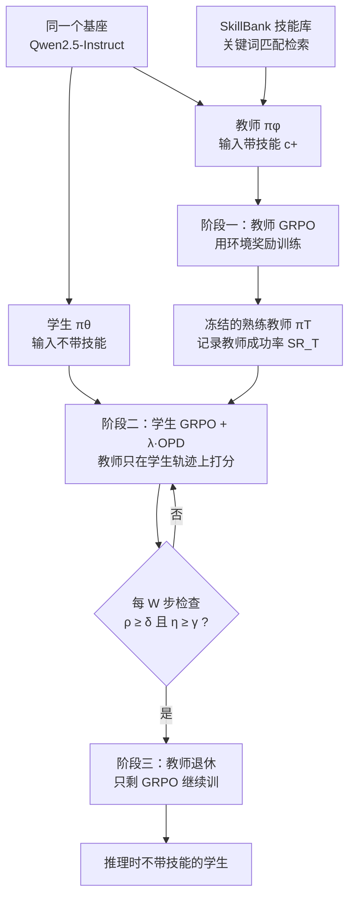

# RetireOPD：教师先练会用技能，学生学够了就让它退休

<!-- release-date: 2026-09-17 -->

> 本文依据浙江大学与阿里巴巴联合署名的 **RetireOPD: Self-Retiring On-Policy Distillation for Agentic Reinforcement Learning**，即 arXiv:2609.20784v1（2026-09-17 提交），共 21 页。页码均指这份 PDF 的物理页码。第一作者 Yan Yu 与 Zhengxi Lu 并列，通讯作者 Yongliang Shen，11 位作者中 9 位来自浙江大学、2 位来自阿里巴巴（PDF p. 1）。全文把三件事分开标注：**论文写了什么**、**我们如何解释或验算它**、**哪些是外部资料补充**。
>
> 这是一篇 agent 后训练方法论文，不是基模报告。实验只在 Qwen2.5 1.5B / 3B / 7B 与 ALFWorld、WebShop 两个文本交互环境上做（PDF p. 6）。

## 读前先把几个词说成人话

这篇论文的所有设计，都围绕一个很朴素的问题：训练时给了模型一份「小抄」，怎么让它把小抄背进参数里，考试时不带小抄也能答对。

先把反复出现的词说清楚：

- **多轮 agent（multi-turn agent）**：模型不是一次答完，而是看环境反馈、做一个动作、再看反馈，来回几十步才完成任务。比如在虚拟厨房里「找到生菜、洗干净、放到台面上」。
- **RLVR（Reinforcement Learning with Verifiable Rewards，可验证奖励的强化学习）**：用任务成败这种能自动判定的信号当奖励。多轮 agent 的问题是整条轨迹只有一个分数，中间几十步哪步做对、哪步做错，没人告诉它（PDF p. 2）。
- **GRPO（Group Relative Policy Optimization，组相对策略优化）**：同一个任务采样一组轨迹，用组内平均分当基线，比平均好的轨迹加分、差的减分。不需要额外的价值网络。
- **OPD（On-Policy Distillation，在线策略蒸馏）**：学生自己生成轨迹，教师在学生走过的每个位置上给出「我会怎么说」的概率分布，学生向它靠拢。好处是监督落到每个 Token 上，而且是学生自己会遇到的状态（PDF p. 2–3）。
- **特权信息（privileged information）**：只在训练时可见、推理时拿不到的上下文。本文里是从技能库检索出来的「任务技能」，比如「放置之前先清洗」（PDF p. 2、p. 15）。
- **自蒸馏 / OPSD（On-Policy Self-Distillation，在线策略自蒸馏）**：没有更强的外部教师时，让同一个模型带上特权信息当教师，不带的当学生（PDF p. 3）。
- **教师–学生差距（teacher-student discrepancy）**：同一个 Token 在教师和学生下的对数概率之差，平均起来衡量两者还差多远（PDF p. 5）。

本文对照时会点到两篇仓库内已有的在线策略蒸馏解读：MOPD 讲多个领域教师怎么合进一个学生，Counteraction-Aware-OPD 讲恢复和保持两个目标的梯度对抗。RetireOPD 的切面不同：它只有一个同尺寸教师，问的是这个教师靠不靠得住、该陪学生多久。

## 一句话先说清

用特权技能做自蒸馏训练多轮 agent，默认建立在两个没被检查过的假设上：带着技能的教师一定比学生强；学生跟着教师学，越久越好。论文在 ALFWorld 和 WebShop 上发现两条都不成立（PDF p. 2）。

于是 RetireOPD 做了两件事（PDF p. 3–6）：

1. **先把教师练会用技能**。教师和学生拆成两份独立参数，教师带着技能上下文先用环境奖励跑一遍 GRPO，训完冻结。
2. **学生学够了就让教师退休**。学生用 GRPO 加 OPD 联合训练，每隔一个窗口看两个信号：教师–学生差距是否不再缩小，学生成功率是否达到教师的一定比例。两个条件同时满足，就把 OPD 整项拿掉，只剩 GRPO 继续训。

摘要里的结论（PDF p. 1）：在 Qwen2.5 1.5B 到 7B 上，ALFWorld 成功率比 GRPO 高 14.1 到 18.8 个点，WebShop 准确率高 11.8 到 19.0 个点，而且在每一组设定里都超过了它自己的教师。

Figure 1 是概念图，不是实测数据。左幅画的是一条几何直觉：学生从 $s_0$ 出发，教师方向和环境奖励方向一开始大致同向，跟着教师走得更快；走到 $s_n$ 之后两个方向分岔，再跟教师就偏离了环境真正奖励的方向。中幅对比两种监督：GRPO 每个 Token 拿到同一个轨迹级优势，稀疏但「对着任务」；OPD 每个 Token 拿到不同的教师信号，稠密但「对着教师」。右幅是 RetireOPD：前期把两者叠加，后期剪掉教师那一部分（PDF p. 1）。

### 一条阅读路线

如果只有半小时读原文，建议按这个顺序：

1. **p. 2 的 Figure 2**：两个失败模式的实测曲线，全文动机都在这张图上。
2. **p. 5–6 的式 (6)–(9)**：退休判据只有两个量，$\rho$ 和 $\eta$。
3. **p. 7 的 Table 1**：主结果，注意 Skill-GRPO 那一行就是 RetireOPD 的教师。
4. **p. 8 的 Figure 4、Figure 5**：退休之后三条路分别走向哪里，以及教师训不训的差别。
5. **p. 9 的 Table 2、Table 3、Figure 7**：两个判据缺一不可吗，阈值敏感吗。
6. **p. 13 附录 A**：为什么「差距不再缩小」可以读成「梯度开始打架」。

附录 C 的两个 Token 级案例（p. 15）和附录 E 的全部训练曲线（p. 17–20），第一次可以只看图。

## 主要矛盾：特权教师既不一定可靠，也不该一直在场

论文开场把现有范式拆成两个隐含问题：学生该向哪个教师学，学多久（PDF p. 2）。现有方法对前者靠假设，对后者靠事先定好的时间表。

### 失败一：只给特权信息，教师并不会自动变强

在 SDAR 那套做法里，教师和学生是同一份参数的两个分支，一个带技能上下文、一个不带（PDF p. 2）。Figure 2 左幅显示，带技能的教师分支并不稳定地强过它监督的学生：前 50 步左右两条曲线交错，此后学生分支反而一直略高于教师分支（读自 PDF p. 2 Figure 2 左幅）。

论文给的原因是：共享参数主要被「不带技能的学生目标」优化，这个策略从来没被训练去 **利用** 技能上下文（PDF p. 2）。换大模型也不管用：7B 模型只在推理时拿到同样的技能提示，ALFWorld 成功率只有 23.4%（PDF p. 2、p. 7）。

**我们如何解释它。** 技能文本是一段自然语言说明，模型读到了不等于会照着做。尤其在小模型上，多塞一段上下文还可能干扰原本的动作格式。Table 1 里 3B 的 Skill-Prompt 在 WebShop 上只有 0.8%，和不给技能的 Vanilla 一样（PDF p. 7）。「有信息」和「会用信息」之间隔着一次训练。

### 失败二：教师监督的收益有阶段性

Figure 2 中幅是三条成功率曲线（PDF p. 2）：

- 纯 GRPO 起步慢（图上标注 Slow start）；
- 纯 OPD 起步快，但很早就停在较低的天花板（Low ceiling）；
- GRPO+OPD 起步快、天花板也更高。

右幅才是关键。纯 OPD 下，差距一路快速收敛到接近 0；GRPO+OPD 下，差距先缩小、大约在第 50 步附近到最近，然后重新拉大（图上标注 Gap rebounds，读自 PDF p. 2 Figure 2）。

论文的解读是：学生把技能带来的行为学进去之后，奖励优化开始偏好教师不会采取的动作，两个梯度开始冲突；此后继续贴着教师，就会把学生按在教师的性能天花板附近（PDF p. 2）。所以教师监督是 **临时脚手架**，问题变成什么时候拆。

### 为什么不能事先定好拆的时间

现有做法都在训练前把过渡定死：退火方法逐步衰减蒸馏权重，两阶段方法在预定步数从蒸馏切到 RL（PDF p. 2–3）。在线决策也有，但只到单个 prompt 或单个 Token 的粒度，没有一篇把教师整体拿掉（PDF p. 3）。

论文给的反例是：差距停止下降的时间点，在不同模型和任务之间从第 50 步到第 90 步不等（PDF p. 2）。任何单一时间表，都会在有的设定里撤得太早，在有的设定里撤得太晚。

**我们如何解释它。** 附录 E 实际报出的退休步是 60、75、80、85、90（PDF p. 17），最早是 60，而正文说的下界是 50。两者并不矛盾：正文说的是「差距停止下降」本身，附录报的是再加上能力门槛之后的实际退休点。Figure 11 里 7B ALFWorld 的 $\rho$ 在第 50 步就已转正，退休却在第 60 步（读自 PDF p. 18），正好对应这种错位。原文没有把这层区别写明。

于是矛盾变成：

> 特权自蒸馏要同时回答两个问题：教师得先证明自己会用那份技能，否则它给的稠密信号是噪声；教师的信号对学生有用的时间有限，而这个时间长短因模型和任务而异，只能从训练过程本身读出来。

## 先看全景：三个阶段，一个开关

这张图按 PDF p. 4 的 Figure 3 与 p. 16 的 Algorithm 1 重画，是流程示意，不是论文原图。原文 Figure 3 画的是同一件事，另把退休判据的两个量画成了右侧子框。

三个阶段各自对着一个问题（PDF p. 4）：

| 阶段 | 对着哪个问题 | 做法 | 原文位置 |
|---|---|---|---|
| 教师构建 | 教师靠不靠得住 | 带技能的独立教师先用环境奖励做 GRPO，训完冻结 | 3.1 节，PDF p. 4 |
| 联合内化 | 稀疏奖励学得慢 | 学生 GRPO 加 OPD，教师只在学生的轨迹上逐 Token 打分 | 3.2 节，PDF p. 4–5 |
| 自适应退休 | 教师该陪多久 | 差距停止缩小且学生能力够了，就整项移除 OPD | 3.3 节，PDF p. 5–6 |

教师和学生从同一个基座初始化、结构相同（PDF p. 4、p. 6）。这一点决定了后面「超过自己的教师」有意义：不是大模型教小模型，而是同尺寸、只差一份技能上下文的两个策略。

## 核心设计一：教师要先用环境奖励「练会用技能」

### 旧问题：共享参数的教师分支没被训练过去用技能

SDAR 类方法里，教师和学生共用一份参数，只是输入不同（PDF p. 3）。论文认为这种设定下教师分支从来没被直接优化过「带着技能该怎么做」，于是它的信号不可靠（PDF p. 2）。

### 新设计：解耦出一个独立教师，先单独做 RL

教师 $\pi_\phi$ 带着技能上下文 $c^+$ 与环境交互，用 GRPO 最大化期望回报（PDF p. 4，式 1）：

$$
\phi^{*} = \arg\max_{\phi}\;
\mathbb{E}_{x\sim\mathcal{D},\;\tau\sim\pi_\phi(\cdot\mid x,\,c^{+})}
\bigl[R(\tau)\bigr]
$$

$x$ 是任务输入，$\tau$ 是整条交互轨迹，$R(\tau)$ 是环境给出的标量回报。训完把 $\phi^{*}$ 冻结，记作熟练教师 $\pi_T$，此后它只做一件事：给学生提供稠密监督（PDF p. 4）。

实验里这个教师就是 Table 1 中的 Skill-GRPO 一行：带特权技能做 GRPO，验证时也带技能（PDF p. 6–7）。技能来源是 SkillRL 的 SkillBank，检索沿用 SDAR 默认的关键词匹配（PDF p. 6）。教师的输入模板就是把「[Privileged Skill Information]」加技能文本放在学生 prompt 前面（PDF p. 21，Figure 16）。

### 证据：训过和没训过的教师，差了三四倍

Figure 5 是一张分组柱状图：横轴是 4 种教师，每组 3 根柱分别是教师自己、不退休的学生、带退休的学生，虚线是 GRPO 基线（PDF p. 8）。柱顶数字整理成表：

| 教师 | 教师成功率 | 学生（不退休） | 学生（带退休） |
|---|---:|---:|---:|
| 3B，未训练、只带技能提示 | 28.9 | 73.4 | 78.1 |
| 7B，未训练、只带技能提示 | 23.4 | 75.8 | 86.7 |
| Skill-3B，用环境奖励训练过 | 79.7 | 82.8 | 93.8 |
| Skill-7B，用环境奖励训练过 | 90.6 | 89.8 | 91.4 |

数字读自 Figure 5 的柱顶标注（PDF p. 8）。原文没有逐柱写明学生尺寸；图中 GRPO 虚线约在 75，与 3B 的 GRPO 成功率 75.0 一致（PDF p. 7），我们据此判断学生都是 3B。

论文从这张图读出三件事（PDF p. 9）：

1. 没训过的 3B、7B 教师只有 28.9% 和 23.4%，模型变大并不提升技能利用；训过之后升到 79.7% 和 90.6%。
2. 不退休时，学生明显依赖教师质量：Skill-7B 教出 89.8%，Skill-3B 只有 82.8%。
3. 带退休时，这个差距几乎消失。

**需要标出的一处原文不一致。** 第 3 条的正文写成「91.4% 对 92.2%」（PDF p. 9），但 Figure 5 的 Skill-3B 红柱标的是 93.8（PDF p. 8）。92.2 与 Table 2、Table 3 里「RetireOPD（Ours）」的数字相同，93.8 与 Table 1 的主结果相同（PDF p. 7、p. 9）。论文没有解释同一设定为什么有两个数，可能来自不同的运行。无论取哪个，「退休后教师质量差距基本消失」的结论都成立。

**我们如何解释它。** 第一行值得多看一眼：用一个 28.9% 的教师做联合训练、且全程不退休，学生只到 73.4%，比纯 GRPO 的 75.0% 还低（PDF p. 7–8）。坏教师的稠密信号不是「聊胜于无」，而是真的会把学生往错处拉。退休把它救回到 78.1%，但也只比 GRPO 高一点。

### Token 级案例：同一个动作，两个教师给出的概率差了近七个数量级

附录 C 把两种教师放在同一条学生轨迹上逐 Token 打分（PDF p. 14–15）。

任务是找到生菜、洗干净、放到台面上。大多数导航和拿取动作，两个教师的分数差不多。差别集中在需要任务知识的决策点：第 8 步学生已经拿着生菜站在水槽前，检索到的技能写着「放置之前先清洗」。熟练教师给关键 Token clean 的对数概率是 −0.826，OPSD 的教师分支是 −16.625（PDF p. 15）。

**我们验算过。** 两个对数概率换成概率，约是 0.44 对 $6\times 10^{-8}$（按 PDF p. 15 的两个分数计算）。OPSD 教师几乎认定「这里不该清洗」，正好和技能说明相反。它读到了技能，却不会照着做，这就是失败一在单个 Token 上的样子。

### 可迁移启发

用「同一个模型加特权上下文」当教师之前，先量一下这个教师在验证集上带着上下文到底能做到多少。量出来不如学生，就先对教师本身做一轮 RL 或 SFT。这一步花的是一次额外训练，换来的是后面所有稠密信号的可信度。

## 核心设计二：学生在自己的轨迹上同时吃两份监督

### 目标函数

学生不看技能，同时从环境奖励和教师监督学（PDF p. 4，式 2）：

$$
\mathcal{L}_{\text{student}}(\theta) = \mathcal{L}_{\text{GRPO}}(\theta) + \lambda\,\mathcal{L}_{\text{OPD}}(\theta)
$$

$\lambda$ 控制教师监督的分量，实验里沿用 SDAR 取 0.01（PDF p. 6、p. 14）。

GRPO 部分是标准写法。每个任务采样 $G$ 条轨迹，组内标准化得到优势（PDF p. 5，式 3）：

$$
\hat{A}^{(i)} = \frac{R(\tau^{(i)}) - \operatorname{mean}\bigl(\{R(\tau^{(j)})\}_{j=1}^{G}\bigr)}{\operatorname{std}\bigl(\{R(\tau^{(j)})\}_{j=1}^{G}\bigr)}
$$

再用 PPO 式的截断重要性比做策略梯度（PDF p. 5，式 4）。这一项给同一条轨迹里的每个 Token 同一个优势，就是 Figure 1 里「统一的环境优势」。

### OPD：用反向 KL，并用一个采样 Token 近似

OPD 部分在学生生成的每个位置，比较学生分布和带技能教师的分布（PDF p. 5，式 5）：

$$
\mathcal{L}_{\text{OPD}}(\theta) = \mathbb{E}_{x,\;y\sim\pi_\theta}\Bigl[\frac{1}{|y|}\sum_{t=1}^{|y|} D_{\mathrm{KL}}\bigl(\pi_\theta(\cdot\mid x, y_{<t})\,\big\|\,\pi_T(\cdot\mid x, c^{+}, y_{<t})\bigr)\Bigr]
$$

两点值得注意。第一，教师不自己生成轨迹，只在学生走过的状态上打分（PDF p. 5）。第二，这是 **反向 KL**：期望在学生分布下取，学生会被推向教师认为高概率的区域，但不必覆盖教师的全部可能性。

精确 KL 要对整个词表求和，太贵。论文改成只看学生实际采样的那个 Token（PDF p. 5，式 6）：

$$
\Delta_t = \log \pi_T(y_t\mid x, c^{+}, y_{<t}) - \log \pi_\theta(y_t\mid x, y_{<t})
$$

因为 $y_t$ 是从学生采样的，$-\Delta_t$ 就是该位置反向 KL 的单样本蒙特卡洛估计（PDF p. 5）。Algorithm 1 里 OPD 损失直接写成这些 $\Delta$ 的平均取负（PDF p. 16，第 19 行）。

**我们如何解释它。** $\Delta_t$ 身兼两职：它既是训练信号，又是后面退休判据的原料。同一个量在每一步都算一次，监控不需要额外的前向。

### 可迁移启发

在线蒸馏想省显存和算力，采样 Token 的对数概率差是现成的做法，而且顺手就是一个「学生离教师多远」的监控量。只要训练里已经在算它，就没理由不把它画出来。

## 核心设计三：自适应退休——从训练信号里读出教师何时该走

### 两个信号

训练被切成每 $W$ 步一个监控窗口，实验里 $W = 5$（PDF p. 6、p. 14）。

**信号一：对齐进展。** 先把每一步所有轨迹、所有 Token 的 $\Delta$ 平均成 $K_n$，再把一个窗口内的 $K_n$ 平均成 $\bar{K}_m$（PDF p. 5，式 7）：

$$
K_n = \frac{1}{G}\sum_{i=1}^{G}\frac{1}{|y_n^{(i)}|}\sum_{t=1}^{|y_n^{(i)}|}\Delta_t^{(i)},
\qquad
\bar{K}_m = \frac{1}{W}\sum_{n=mW}^{mW+W-1} K_n
$$

然后看相邻两个窗口的相对变化（PDF p. 5，式 8 左）：

$$
\rho_m = \frac{\bar{K}_m - \bar{K}_{m-1}}{\bar{K}_m}
$$

**信号二：相对能力。** 学生在最近两个窗口的平均成功率，除以教师的成功率（PDF p. 5，式 8 右）：

$$
\eta_m = \frac{SR_m + SR_{m-1}}{2\,SR_T}
$$

两个窗口取平均，是为了压短期抖动（PDF p. 6）。

**退休时刻** 是第一个同时满足两个条件的窗口（PDF p. 6，式 9）：

$$
m^{*} = \inf\bigl\{\, m \ge 2 \;:\; \rho_m \ge \delta \;\wedge\; \eta_m \ge \gamma \,\bigr\}
$$

默认 $\gamma = 0.9$、$\delta = 0$（PDF p. 6）。满足之后移除 OPD，只用 GRPO 训到结束；此后也不再需要教师前向（PDF p. 3、p. 6）。

### 读 $\rho$ 的符号，要先想清楚 $K$ 是负的

论文说：$\rho_m$ 为负表示差距仍在缩小，非负表示缩小停滞或反弹（PDF p. 6）。这句话初看和直觉相反，值得验算一遍。

**我们验算过。** $\Delta_t$ 是教师减学生的对数概率，平均下来近似反向 KL 的相反数，所以 $\bar{K}$ 一般是负的，越接近 0 表示离得越近。Figure 2 右幅和 Figure 4 右幅的纵轴正是负值区间（PDF p. 2、p. 8）。设差距在缩小，$\bar{K}$ 从 −0.2 变到 −0.1：分子是 +0.1，分母是 −0.1，$\rho = -1$，为负。反过来差距拉大，$\rho$ 为正。所以 $\rho \ge 0$ 就是「差距不再缩小」，与原文一致。分母用当前窗口的 $\bar{K}_m$，把变化量换成相对比例，不同模型、不同任务的差距量级不同也能用同一个阈值。

### 为什么差距停滞可以读成「梯度在打架」

附录 A 给了一个一阶分析（PDF p. 13）。把回报目标记为 $J(\theta)$，蒸馏差距记为 $D(\theta)$，梯度分别是 $g = \nabla_\theta J$、$h = \nabla_\theta D$。忽略采样噪声和截断，联合更新是 $\theta^{+} = \theta + \eta(g - \lambda h)$。这里的 $\eta$ 是学习率，和上面的相对能力 $\eta_m$ 是原文里撞名的两个符号。

一阶展开后，回报的变化是（PDF p. 13）：

$$
J(\theta^{+}) - J(\theta) = \eta\bigl(\|g\|^{2} - \lambda\langle g, h\rangle\bigr) + O(\eta^{2})
$$

$\langle g, h\rangle < 0$ 时 OPD 在帮忙，$\langle g, h\rangle > 0$ 时在拖后腿；若 $\lambda\langle g, h\rangle > \|g\|^2$，联合更新甚至让回报一阶下降（PDF p. 13）。

同一个更新下差距的变化率是（PDF p. 13）：

$$
\frac{d}{dt}D(\theta) = \langle g, h\rangle - \lambda\|h\|^{2}
$$

第二项恒为非正。所以差距如果不降反升，一定是 $\langle g, h\rangle$ 为正、而且大到压过了蒸馏项：奖励方向和蒸馏方向在局部相反。若 $h \approx 0$，则说明 OPD 本身已经给不出多少一阶信号（PDF p. 13）。两种情况都说明该撤了。在冲突时退出，回报的一阶增益比继续联合多出 $\eta\lambda\langle g, h\rangle$（PDF p. 13）。

**我们如何解释它。** 这个推导是局部、一阶、忽略噪声的，只说明「差距停滞」和「梯度冲突」在方向上一致，不证明在真实训练里每次停滞都是冲突。论文自己也把它定位为动机，并且因此额外加了能力门槛，防止训练早期的噪声触发退休（PDF p. 13）。

### 为什么两个条件缺一不可

只看 $\rho$ 会怎样，附录 E 的曲线给了直观答案。

以 1.5B 的 ALFWorld 为例，$\rho$ 在第 25 步前后和第 40 步前后就已经短暂越过 0，但真正的退休步是 75（读自 PDF p. 18 Figure 11）。

**我们如何解释它。** 早期的差距停顿多半是训练噪声，学生这时还远不如教师，撤掉教师就等于撤掉最有用的阶段。$\eta \ge 0.9$ 这道门槛挡住的正是这种情况。反过来，只看 $\eta$ 会在学生刚追上教师时就撤，而此时教师可能还在教东西。

### 可迁移启发

任何「前期靠辅助信号、后期靠主目标」的训练，都可以借这个两信号开关：一个信号看辅助项还在不在起作用（本文是差距还降不降），一个信号看主模型是否已经够用（本文是相对成功率）。两个都满足再撤，比任何固定步数都更省心。计算上它几乎免费：差距本来就在算，成功率本来就要验证。

## 实验怎么证明

### 设定

两个环境（PDF p. 6）：

- **ALFWorld**：文本版的具身家务环境，按自然语言指令完成多步任务。Table 1 列出的 6 类任务（PDF p. 7）是拿取（Pick）、查看（Look）、清洗（Clean）、加热（Heat）、冷却（Cool）、拿两件（Pick2），考长程规划和状态跟踪。
- **WebShop**：模拟网购，搜索、翻页、挑出满足约束的商品，考目标导向的决策和多步信息收集。Table 1 报 Score 和 Acc 两个指标（PDF p. 7）。

模型是 Qwen2.5-1.5B / 3B / 7B-Instruct（PDF p. 6）。基线分四组（PDF p. 6）：

| 组 | 方法 | 说明 |
|---|---|---|
| 免训练 | Vanilla、Skill-Prompt | 后者只在推理时给技能 |
| 强化学习 | GRPO、GiGPO、PPO、RLOO、Skill-GRPO | Skill-GRPO 带特权技能做 GRPO，即 RetireOPD 的教师 |
| 蒸馏 | OPD、OPSD | 只有教师监督，没有奖励 |
| 混合 | GRPO+OPD、GRPO+OPSD | 奖励加教师监督，全程不撤 |

超参统一（PDF p. 14，Table 4）：

| 超参 | RetireOPD | GRPO / GiGPO / RLOO | PPO | OPD / OPSD | GRPO+OPD / GRPO+OPSD |
|---|---:|---:|---:|---:|---:|
| 学习率 | $1\times10^{-6}$ | $1\times10^{-6}$ | $1\times10^{-6}$ | $1\times10^{-6}$ | $1\times10^{-6}$ |
| Critic 学习率 | – | – | $1\times10^{-5}$ | – | – |
| 组大小 $G$ | 8 | 8 | – | 8 | 8 |
| 蒸馏系数 $\lambda$ | 0.01 | – | – | 0.01 | 0.01 |
| KL 惩罚 $\alpha_{\mathrm{KL}}$ | 0.01 | 0.01 | 0.01 | 0.01 | 0.01 |
| 训练 batch | 16 | 16 | 16 | 16 | 16 |
| 验证集大小 | 128 | 128 | 128 | 128 | 128 |
| 能力阈值 | 0.9 | – | – | – | – |
| 窗口大小 | 5 | – | – | – | – |
| 训练步数 | 150 | 150 | 150 | 150 | 150 |

### 主结果

下表摘自 Table 1（PDF p. 7），只保留 ALFWorld 平均成功率和 WebShop 准确率；Table 1 还有 ALFWorld 6 个子任务和 WebShop Score，完整数字见原文。

| 方法 | 1.5B ALFWorld | 1.5B WebShop | 3B ALFWorld | 3B WebShop | 7B ALFWorld | 7B WebShop |
|---|---:|---:|---:|---:|---:|---:|
| Vanilla | 5.5 | 5.5 | 21.9 | 0.8 | 12.5 | 1.6 |
| Skill-Prompt（带技能验证） | 6.2 | 1.6 | 28.9 | 0.8 | 23.4 | 0.8 |
| GRPO | 72.8 | 56.8 | 75.0 | 63.3 | 81.2 | 72.6 |
| GiGPO | 86.7 | 65.0 | 92.2 | 69.5 | 90.8 | 72.8 |
| PPO | 54.4 | 51.5 | 81.2 | 59.4 | 80.4 | 68.7 |
| RLOO | 69.7 | 52.1 | 72.7 | 68.0 | 75.5 | 65.7 |
| Skill-GRPO（教师，带技能验证） | 81.2 | 67.9 | 79.7 | 64.8 | 90.6 | 78.9 |
| OPD，教师为同尺寸 Skill 模型 | 71.1 | 69.1 | 74.2 | 66.4 | 86.7 | 78.1 |
| OPD，教师为更大一档的模型 | 5.6 | 3.9 | 38.3 | 2.3 | 64.8 | 4.7 |
| OPSD | 14.1 | 10.2 | 28.1 | 3.1 | 32.8 | 2.3 |
| GRPO+OPD | 87.5 | 69.9 | 82.8 | 74.2 | 92.2 | 81.2 |
| GRPO+OPSD | 72.7 | 66.8 | 78.1 | 66.4 | 79.7 | 76.5 |
| RetireOPD | **89.8** | **75.8** | **93.8** | **77.3** | **95.3** | **84.4** |

「更大一档的模型」在 1.5B、3B、7B 三组里分别是 3B、7B、14B（PDF p. 7，表中方法名的后缀表示教师）。原文没有说明这些更大教师是否带技能输入。

论文从表里读出三条（PDF p. 6–8）：

1. **整体最好。** ALFWorld 上比 GRPO 高 17.0 / 18.8 / 14.1 个点，WebShop 上高 19.0 / 14.0 / 11.8 个点（1.5B / 3B / 7B），并且在所有设定里都超过 GiGPO（PDF p. 6）。我们用 Table 1 逐格验算过，这六个差值都对得上。
2. **可靠的教师构建有效。** RetireOPD 大幅超过教师没被显式优化的 GRPO+OPSD。论文的结论是：教师质量更取决于能否把特权信息用好，而不是模型容量或多给的上下文（PDF p. 6–7）。
3. **自适应退休有效。** RetireOPD 稳定超过全程保留教师的 GRPO+OPD，并在三个尺度上都超过自己的教师。例如 3B 上 ALFWorld 93.8% 对教师 79.7%，WebShop 77.3% 对 64.8%（PDF p. 7–8）。

**我们如何读这张表。** 有四点原文没有强调：

- **对 GRPO+OPD 的增益才是退休本身的贡献**，而且幅度不均匀。ALFWorld 上是 +2.3 / +11.0 / +3.1，WebShop 上是 +5.9 / +3.1 / +3.2（1.5B / 3B / 7B，我们按 PDF p. 7 Table 1 相减）。3B ALFWorld 的 11 个点是个特例，其余多在 2 到 6 个点之间。摘要里 14 到 19 个点的提升，是教师构建、稠密监督和退休三者合起来对纯 GRPO 的账。
- **GiGPO 是很强的对手。** 它不用任何特权信息，ALFWorld 上 3B 只比 RetireOPD 低 1.6 个点（92.2 对 93.8），1.5B 低 3.1 个点（PDF p. 7）。RetireOPD 在 WebShop 上领先 GiGPO 更明显。
- **纯 OPD 的天花板贴着教师。** 同尺寸 Skill 教师的纯 OPD，1.5B / 3B / 7B 分别到 71.1 / 74.2 / 86.7，都低于教师的 81.2 / 79.7 / 90.6（PDF p. 7）。只模仿，学生最多追到教师附近。
- **更大但不会用技能的教师几乎是灾难。** 3B 教 1.5B 只有 5.6%，14B 教 7B 在 WebShop 上只有 4.7%（PDF p. 7）。这和失败一是同一句话：尺寸不能替代「会用特权信息」。

### 退休之后，三条路分别走向哪里

为了确认冲突存在、以及该保留哪个目标，论文从 3B ALFWorld 的退休点 checkpoint 出发，分成三条路继续训（PDF p. 8）。

| 续训方式 | 成功率走向 | 差距走向 |
|---|---|---|
| 继续 GRPO+OPD | 停在约 0.75 附近 | 继续拉大，末端约 −0.25 |
| 切到纯 OPD | 不升反降，末端约 0.66 | 继续缩小，末端约 −0.05 |
| 退休（只剩 GRPO） | 从退休点的 76.6% 稳步升到 93.8% | 退休后不再计算 |

76.6% 和 93.8% 是原文数字（PDF p. 8），其余为读自 Figure 4 的约值。

**我们如何解释它。** 这是全文最干净的一组对照：同一个起点，三种选择。纯 OPD 那条线把差距压得更小，成功率反而下滑，说明到这个阶段「更像教师」和「更会做任务」已经是两件事。

附录 C 的 Figure 9 在单条轨迹上给了这种冲突的样子（PDF p. 15）。这是一条只有 4 步的成功轨迹：拿番茄、去冰箱冷却、拿着冷却好的番茄去微波炉、放进微波炉，每步环境回报都是 1。唯一被着色的是第 3 步的 microwave：这一步最终带来了任务成功，教师却给它打了偏低的分（PDF p. 15）。原文图注说这是「强烈的负向教师监督」；图上的着色其实很浅，而且原文没有给出这一例的具体分数。

### 退休判据的消融

Table 2 和 Table 3 都在 3B ALFWorld 上做（PDF p. 9）：

| 设定（Table 2） | 退休步 | 成功率 |
|---|---:|---:|
| RetireOPD（完整） | 60 | 92.2 |
| 去掉对齐停滞条件 | 50 | 89.0 |
| 去掉相对能力条件 | 100 | 89.0 |
| 不退休 | – | 82.8 |
| 不用 OPD（纯 GRPO） | 0 | 75.0 |

| 设定（Table 3） | 退休步 | 成功率 |
|---|---:|---:|
| $\gamma = 0.9,\ \delta = 0$（默认） | 60 | 92.2 |
| $\gamma = 0.8,\ \delta = 0$ | 55 | 90.6 |
| $\gamma = 1.0,\ \delta = 0$ | 95 | 91.4 |
| $\gamma = 0.9,\ \delta = 0.03$ | 65 | 89.1 |
| $\gamma = 0.9,\ \delta = 0.05$ | 95 | 91.4 |

论文的读法（PDF p. 9）：两个条件单独用都只有 89.0%，合起来最好，说明互补；阈值在一个较宽的范围内变化，退休步从 55 移到 95，成功率保持在 89.1% 到 92.2% 之间，而且成功率不随退休步单调变化，说明方法不依赖精调的阈值。

**我们如何解释它。** 两处原文没有讨论：

- 去掉能力条件、只看差距停滞，按直觉应该退得 **更早**，表里却是第 100 步。Figure 11 里 3B ALFWorld 的 $\rho$ 大约在第 50 到 55 步就越过 0（读自 PDF p. 18），与 100 对不上，原文没有解释。
- 表中退休步都是 5 的倍数，是窗口 $W = 5$ 的自然结果。成功率 89.0 到 92.2 之间的差距只有 3 个点左右（PDF p. 9），而验证集只有 128 条（PDF p. 14），论文也没有报告多次运行的方差。这些差别有多少超出了噪声，原文给不出答案。

### 阈值稳健性

$\gamma$ 在 0.80 到 0.96、$\delta$ 在 −0.10 到 0.04 之间时，退休步都落在默认值的 ±5 步之内；只有比较极端的阈值才会明显推迟退休（PDF p. 9–10）。图上 $\gamma$ 超过约 0.96 后退休步跳到 75，超过约 0.98 再跳到 95；$\delta$ 超过约 0.03 后依次跳到 65、75，约 0.13 以上才到 95（读自 PDF p. 9 Figure 7）。

**需要标出的另一处原文不一致。** 按 Figure 7 右幅，$\delta = 0.05$ 对应的退休步约为 75，但 Table 3 里 $\gamma = 0.9,\ \delta = 0.05$ 一行写的是 95（PDF p. 9）。其余几行（$\gamma = 0.8$ 对 55、$\gamma = 1.0$ 对 95、$\delta = 0.03$ 对 65）与图一致，原文没有解释这一处差异。

**我们如何解释它。** $\delta$ 允许取负，意味着「差距还在缓慢缩小」也可以触发退休。$\delta$ 从 −0.10 到 0 都不改变退休步，说明在 3B ALFWorld 上，退休时刻主要是被 $\gamma$ 那道能力门槛卡住的。

### 自适应退休对比线性退火

论文把退休判据换成 ATOD 的线性退火，其余设置都不变（PDF p. 9、p. 14）。退火的写法是（PDF p. 14）：

$$
p(s) = \min\Bigl(\frac{s}{80},\,1\Bigr),\qquad
\lambda_{\mathrm{KL}}(s) = 1 - 0.9\,p(s),\qquad
\lambda_{\mathrm{RL}}(s) = 0.1 + p(s)
$$

训练开始时 GRPO 与 OPD 的权重是 0.1 和 1.0，以蒸馏为主；到第 80 步以后固定在 1.1 和 0.1，仍保留少量蒸馏（PDF p. 14）。

LA（Skill-3B）前期上升很快，约 25 步就到 0.67 附近，之后停在 0.72 左右；自适应退休一直涨到约 0.9（读自 PDF p. 8 Figure 6）。论文的结论是：教师的效用不一定按预设时间表衰减（PDF p. 9）。

**我们如何解释它。** 这组对比不是只差「何时撤」。LA 前期让 OPD 权重是 1.0，而 RetireOPD 的 $\lambda$ 只有 0.01（PDF p. 14），前期的监督强度差了两个数量级，LA 前期更快也就不奇怪了。另外，图里还有一条 LA（7B），停在约 0.38，原文正文没有交代它用的是哪个教师；它的水平和 Table 1 里「7B 教师教 3B 的纯 OPD」的 38.3 接近（PDF p. 7），但这只是我们的对照猜测。

### 附录里的训练曲线

附录 E 给出了六组设定的完整训练曲线（PDF p. 17–20）。各组退休步如下（PDF p. 17）：

| 模型 | ALFWorld 退休步 | WebShop 退休步 |
|---|---:|---:|
| 1.5B | 75 | 90 |
| 3B | 60 | 80 |
| 7B | 60 | 85 |

WebShop 普遍比 ALFWorld 退得晚。

**我们从图上读出、原文没有评论的一点。** 策略熵曲线（PDF p. 19，Figure 12）并不统一：3B 和 7B 的 ALFWorld 退休之后明显回升，7B 从约 0.4 一度升到 0.9 以上；1.5B 的 WebShop 退休后也从约 0.5 回升到 0.7 左右；另外三组（1.5B ALFWorld、3B 与 7B WebShop）退休后熵继续下降。**我们如何解释它**：去掉反向 KL 这根「往教师分布拉」的绳子之后，学生的探索空间重新打开，这和「退休后超过教师」的叙事方向一致。但六组里只有一半出现回升，原文也没有讨论熵，这只是读图的观察。

## 限制与没公开的信息

原文没有单独写限制一节，下面是从正文读出、或原文明显没有给出的部分：

- **只有两个文本环境、三个不超过 7B 的模型、150 步训练**（PDF p. 6、p. 14）。没有代码、数学、GUI 或真实网页环境，也没有更大模型。
- **没有算力账单。** 论文说退休之后不再需要教师前向（PDF p. 3），但没有报训练时长、GPU 小时或每步开销。教师构建阶段训练了多少步，原文也没有单独给出，Table 4 的 150 步是所有方法共用的一行（PDF p. 14）。
- **对照不是算力对齐的。** RetireOPD 的总成本是「训练一个 Skill-GRPO 教师」加「150 步学生训练」，GRPO 基线只有后者。这不影响方法有效性，但比较「提升多少」时要记得这一点（这是我们的判断）。
- **没有多次运行和置信区间。** 验证集 128 条（PDF p. 14），ALFWorld 子任务里频繁出现 100.0 与 0.0（PDF p. 7），单格数字的波动可能很大。
- **原文内部有数字不一致。** 3B ALFWorld 的完整方法在 Table 1 与 Figure 5 是 93.8，在 Table 2、Table 3 与 p. 9 正文是 92.2（PDF p. 7–9）；Table 3 中 $\delta = 0.05$ 的退休步是 95，Figure 7 右幅读出来约是 75（PDF p. 9）。
- **依赖一个现成的技能库。** 技能来自 SkillRL 的 SkillBank，检索用关键词匹配（PDF p. 6）。技能库的质量和覆盖率如何影响结果，没有做消融。
- **理论只是一阶局部分析**，不构成收敛或最优性保证（PDF p. 13）。

## 可迁移启发

1. **特权信息要先被「训会用」，才能当教师。** 同一个模型读到技能不等于会照做；OPSD 教师给正确的 clean 只有 $6\times10^{-8}$ 的概率（按 PDF p. 15 验算）。做自蒸馏之前，先测一下带特权上下文的教师本身有多强。
2. **稠密监督是脚手架，不是终点。** 纯 OPD 天花板贴着教师，全程保留教师会把学生按在教师附近。想让学生超过教师，就必须在某个时候把教师撤掉，让奖励单独说话。
3. **撤的时机从训练信号里读，不从日历上定。** 退休步在 60 到 90 之间变化（PDF p. 17），任何固定步数都会在某些设定里错过。「辅助项还在起作用吗」加上「主模型够用了吗」这两个信号，几乎零额外开销。
4. **读监控量之前，先把符号推一遍。** $\rho$ 的分母是负数，「负表示在变好」这类细节搞反了，整套开关就会在最坏的时刻触发。
5. **坏教师比没教师更糟。** 28.9% 的教师加全程不退休，学生比纯 GRPO 还低（PDF p. 8）。在线蒸馏项默认是正收益，这个假设值得每次都验证。
6. **退休还能削弱对教师质量的依赖。** 带退休时，Skill-3B 和 Skill-7B 两个教师教出的学生几乎一样（PDF p. 8–9）。这意味着教师不必做到最强，够把学生带过起步阶段就行。

## 关键词回看

- **特权信息 / 技能上下文 $c^+$**：训练时可见、推理时没有的检索技能。RetireOPD 的目标是把它内化进学生参数。
- **熟练教师 $\pi_T$**：带技能、先用环境奖励做 GRPO、然后冻结的独立教师，就是 Table 1 的 Skill-GRPO。
- **GRPO + λ·OPD**：学生的联合目标，$\lambda = 0.01$。
- **反向 KL 与采样近似**：$-\Delta_t$ 是反向 KL 的单样本估计，同时也是退休判据的原料。
- **对齐进展 $\rho_m$**：相邻窗口差距的相对变化；因为 $\bar K$ 为负，$\rho \ge 0$ 表示差距不再缩小。
- **相对能力 $\eta_m$**：学生最近两个窗口的平均成功率除以教师成功率，默认门槛 0.9。
- **自适应退休**：第一个同时满足 $\rho_m \ge \delta$ 与 $\eta_m \ge \gamma$ 的窗口移除 OPD，只剩 GRPO。
- **梯度冲突**：附录 A 的一阶分析，差距不降反升意味着 $\langle g, h\rangle > 0$。
- **线性退火（ATOD）**：固定时间表的对照组，前期快、后期停在较低水平。

## 资料与阅读边界

### 本文依据的版本

- 本地原件：`papers/ZJU/RetireOPD.pdf`，21 页，页边标注 `arXiv:2609.20784v1 [cs.CL] 17 Sep 2026`（PDF p. 1）。
- 官方页：[arXiv:2609.20784](https://arxiv.org/abs/2609.20784)。截至 2026-09-23 核验只有 v1，提交日 2026-09-17，与本地原件一致。
- `release-date` 取 2026-09-17。这是一篇方法论文，没有面向公众的模型产品，按 arXiv v1 首次公开日记。
- 原文给出的代码地址是 [ZJU-REAL/SDAR](https://github.com/ZJU-REAL/SDAR)（PDF p. 1），即前作 SDAR 的仓库。仓库里是否已经包含 RetireOPD 的退休逻辑，未能核实。

### 报告明确写了、本文覆盖了的部分

摘要与 Figure 1；第 1 节两个失败模式与 Figure 2；第 2 节相关工作的定位；第 3 节教师构建、联合优化、自适应退休与式 (1)–(9)、Figure 3；第 4 节实验设定、Table 1、Figure 4–7、Table 2–3；第 5 节结论；附录 A 一阶分析；附录 B 的 Table 4 与 ATOD 退火公式；附录 C 的 Figure 8–9；附录 D 的 Algorithm 1；附录 E 的 Figure 10–13；附录 F 的 prompt 模板。

### 外部资料补充（不是 PDF 原文）

- SDAR（Self-Distilled Agentic Reinforcement Learning，arXiv:2605.15155）是同一课题组的前作，RetireOPD 的联合 GRPO-OPD 目标、$\lambda$ 取值与技能检索都沿用它（PDF p. 4、p. 6、p. 11）。本文只引用 PDF 里对它的描述，没有展开它的细节。
- 仓库内相关解读：MOPD、Counteraction-Aware-OPD。三篇都用在线策略蒸馏，但设定不同，数字不要混用。

### 原文没有公开、本文也不补的缺口

- 教师构建阶段的训练步数与算力；
- 整个流程的墙钟时间与 GPU 开销；
- 多次运行的方差或置信区间；
- 技能库质量、检索方式对结果的影响；
- 3B ALFWorld 完整方法 93.8 与 92.2 两个数字的来源差异；
- 去掉能力条件后为何在第 100 步才退休；
- Table 3 与 Figure 7 在 $\delta = 0.05$ 处退休步不一致的原因；
- Figure 6 中 LA（7B）所用的教师配置；
- Figure 9 中教师对 microwave 的具体打分。
