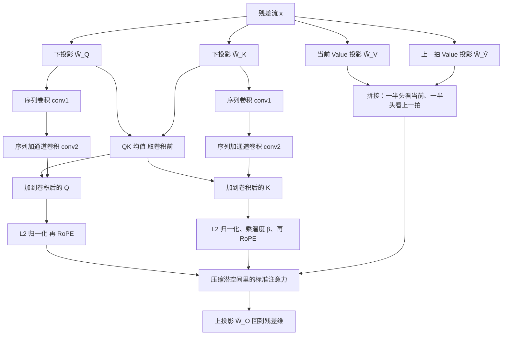
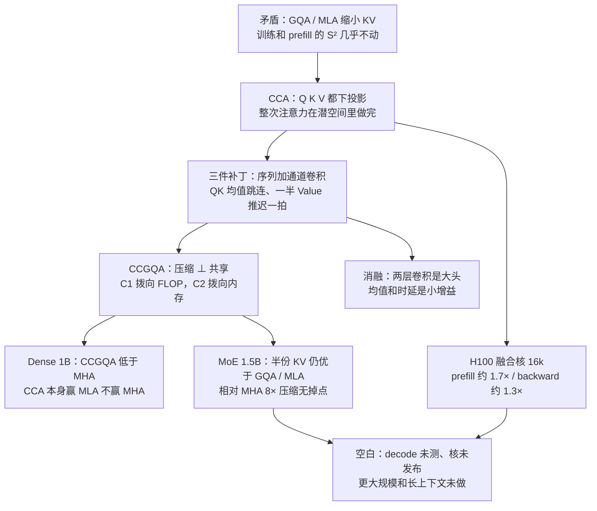

# CCA：GQA 和 MLA 缩小了 KV，真正决定训练速度的二次项还在全维度里

<!-- release-date: 2025-10-06 -->

> 本文依据 Zyphra 发布的 **Compressed Convolutional Attention: Efficient Attention in a Compressed Latent Space**，即 arXiv:2510.04476v2（提交 2025-10-06，修订 2026-03-16），共 21 页。动笔前已核对 [arXiv 官方页](https://arxiv.org/abs/2510.04476) 与 [arXiv API](http://export.arxiv.org/api/query?id_list=2510.04476)：该论文只有 v1（2025-10-06 04:24:23 UTC）与 v2（2026-03-16 23:36:13 UTC）两个版本，**本地 PDF 封面已是 v2（16 Mar 2026），即最新版**，不存在需要替换的更新修订。v2 比 v1 晚五个月，全文以 v2 正文为准。页码均指这份 PDF 本身的页码。
>
> 这是一篇方法论文，不是 ZAYA1 基模报告。它没有对外发布的模型权重，也没有完整训练 recipe。它只回答一件事：**怎样让注意力的参数、KV Cache 和 FLOPs 按同一个压缩倍数一起降，而不是只把解码时的缓存做小**。ZAYA1-8B 后来怎么用 CCGQA、怎么改温度参数化，见本站 [ZAYA1-8B](/reports/Zyphra/ZAYA1-8B)；那些内容标成外部补充，不写入「论文写了什么」。
>
> 全文把三件事分开：**论文明确写了什么**（一律带 PDF 页码）、**我们如何解释或验算它**（凡属推导、换算或从图上读数都会写明）、**外部资料补充**（给链接并标注）。

## 阅读前先搭一张最小地图

这篇论文只改注意力这一块，但会反复用到几组系统词。先把它们翻成人话。

- **Token（词元）**：模型读写文本的基本小块。
- **Query / Key / Value（查询 / 键 / 值）**：注意力的三个角色。Query 是当前 Token 的提问，Key 是每个历史位置的索引标签，Value 是它真正携带的内容。
- **KV Cache（Key-Value Cache，键值缓存）**：生成时把已经算过的 Key 和 Value 留下来，避免每吐一个新 Token 就重算整段历史。
- **Prefill 与 Decode（预填充与解码）**：处理一个请求分两段。Prefill 一次性读完输入提示，Decode 随后逐个吐字。两段的硬件瓶颈完全不同：prefill 和训练被算力卡住，decode 被带宽卡住。
- **MHA / GQA / MQA**：Multi-Head Attention（多头注意力）里每个头有自己的一套 KV；Grouped-Query Attention（分组查询注意力）让一组内的多个 Query 头共用一套 KV；Multi-Query Attention（多查询注意力）是极端情形，所有头共用一套。GQA 和 MQA 的目的都是减少 decode 时要从显存搬运的 KV 数量。
- **MLA（Multi-head Latent Attention，多头潜在注意力）**：DeepSeek-V3 用的注意力。它把 K、V 压进低维潜空间存进缓存，真正做注意力之前再升回全维度。
- **RoPE（Rotary Position Embedding，旋转位置编码）**：把位置信息旋进 Query 和 Key 的一种位置编码。MLA 不能把它直接打在压缩缓存上，必须另开 RoPE 头。
- **潜空间（latent space）**：把原来宽度为 $E$ 的残差流，用线性层压到宽度 $\tilde{e}=E/C$ 的窄空间。$C$ 就是压缩倍数。

这篇论文自己造的名字只有两个：

- **压缩卷积注意力（Compressed Convolutional Attention，CCA）**：Q、K、V 都下投影，**整次注意力都在共享潜空间里完成**，再用卷积、QK 均值和 Value 时延把被压掉的局部结构补回来。
- **压缩卷积分组查询注意力（Compressed Convolutional Grouped Query Attention，CCGQA）**：在已经压缩的潜空间里再做 GQA 式的头共享。压缩和共享是两件正交的事，可以分别拧。

## 一句话先说清

GQA 和 MLA 主要缩小 KV Cache、加快 decode。决定 prefill 和训练速度的，是注意力里那个随序列长度平方增长的计算量；这两条路对它几乎没动手。（PDF p.1–2）

CCA 的选择不是「把缓存压小、算的时候再升回去」，而是：

> **Q、K、V 都压进同一个窄空间，点积、softmax、加权求和全部在那里做完，参数、KV Cache、FLOPs 按压缩倍数一起降**。

朴素地把注意力搬进窄空间会掉点。论文用三件小部件把它补回来：序列加通道的卷积、Query 与 Key 的均值跳连、一半 Value 头推迟一拍。然后再和 GQA 组合成 CCGQA，把压缩拨向 FLOP 或拨向内存。（PDF p.1、4–6）

## 全文主矛盾：省 KV 不等于省训练

### 注意力贵在两处，不是一处

标准多头注意力里，每个 Token 都要和前面所有 Token 比一次。论文把代价拆成两项（PDF p.3，式 1–2）：

$$
o_h=\operatorname{softmax}\!\left(\frac{q_h k_h^{\top}}{\sqrt{d}}\right)v_h,
\qquad
\text{out}=W_O[o_1,\ldots,o_{n_h}]
$$

$q_h$、$k_h$、$v_h$ 是第 $h$ 个头的查询、键、值，$d$ 是头维度，$W_O$ 是输出投影。$q_h k_h^{\top}$ 这一项让计算量随序列长度 $S$ 平方增长；四张 $E\times E$ 的投影矩阵 $W_Q,W_K,W_V,W_O$ 又让参数和通道方向的计算随隐藏维度 $E$ 平方增长。生成时还要把每个位置的 $k_h$、$v_h$ 存进 KV Cache，大小是 $2\times S\times E$。（PDF p.3）

可以把它想成开会：

- 平方项是「每个人都要和所有人说话」——序列越长，会越开不完；
- 线性增长的 KV Cache 是「每个人的名牌都得一直挂在墙上」——上下文越长，墙越不够用。

GQA 和 MLA 主要拆的是第二件事。第一件事几乎原封不动。这是全文的主矛盾。

### 两条旧路各自拆了哪一半

**GQA：共享头，不减少乘法。** 一组里的多个 Query 头共用同一套 K、V。缓存按组数 $G$ 缩小到 $1/G$，MQA 是 $G=1$ 的极端。论文写得很干脆：GQA **不减少**训练或 prefill 相对 MHA 的 FLOPs；它省的是 decode 时每个 Token 要加载的参数，因为 decode 通常是带宽瓶颈。（PDF p.2–3）

**MLA：压缩缓存，算的时候升回去。** K、V 先投影到共享潜空间 $C_{KV}\in\mathbb{R}^{S\times \tilde{e}}$ 再存进缓存，真正做注意力前再用上投影还原成全维度的头。Query 通常压得比 KV 轻。decode 时 MLA 有一种「MQA 模式」：把共享 KV 的上投影合并进 Query 上投影和输出投影，带宽需求明显下降。但训练和 prefill 里，Q、K、V 都是升回全维度再做注意力，所以 MLA **不提供**相对 MHA 或 GQA 的计算节省，由于上投影，算力和参数还略贵一点。RoPE 也不能直接打在压缩缓存上，必须另留一套共享的 Key RoPE 缓存。（PDF p.2–4）

两条路的共同空白，论文用一句话钉死（PDF p.2）：

> Both GQA and MLA focus primarily on reducing the KV-cache, which is important for decoding speed, but do not meaningfully reduce the fundamental compute cost of attention which is the performance bottleneck in both training and inference prefill.

长上下文工作负载里，绝大多数 Token 是输入而不是生成。prefill 才是大头。只优化 decode 的缓存，训练账单不会动。

### 其他路论文怎么看

引言还扫过三类更激进的方案，作为「为什么还要改注意力本身」的铺垫（PDF p.1）：

- **状态空间模型（SSM）**：用恒定大小的状态替换线性增长的 KV Cache，但表达力往往不如注意力，复杂推理和上下文学习上容易落后；
- **混合架构**：SSM 加注意力取长补短，可注意力还在，平方瓶颈没有消失；
- **离线压缩 KV**：压缩率可以很高，生成质量代价也很大。

这些都不是 CCA 的对手盘。真正拿来对照的，始终是 MHA、GQA、MLA。

## 新设计：整次注意力都在共享潜空间里完成

### 旧问题：压缩之后立刻升回去，二次项的宽度没变

MLA 已经证明「K、V 可以压」。它的默认动作却是：压完存起来，算的时候再升回 $E$ 维。于是 $q_h k_h^{\top}$ 仍然发生在全头维度上，$S^2$ 项的宽度几乎没变。

论文的判断是：这条路拿掉了上投影，压缩倍数才能同时作用在参数、缓存和 FLOPs 上；RoPE 也可以直接打在潜空间里，不必另开一套头。（PDF p.2、4）

### 新设计：Q、K、V 一起下投影，注意力不再回到全维度

CCA 的第一步和 MLA 看起来像，差别在第二步。下投影是（PDF p.4，式 7）：

$$
\tilde q = [\tilde q_1,\ldots,\tilde q_{n_h}] = x\tilde W_Q,
\qquad
\tilde k = [\tilde k_1,\ldots,\tilde k_{n_h}] = x\tilde W_K
$$

$x\in\mathbb{R}^{S\times E}$ 是残差流， $\tilde W_Q,\tilde W_K\in\mathbb{R}^{E\times \tilde{e}}$，$\tilde{e}=E/C$。和 MLA 不同：因为注意力就在压缩空间里做，Query 和 Key、Value **按同一个倍数压**。只有 CCGQA 这种还要重复 KV 头的情形，才允许 Query 压得轻一些，最多轻到组数那么多倍。（PDF p.5）

然后——这是和 MLA 分叉的那一步——**不再升回全维度**。卷积、QK 均值、Value 时延都在 $\tilde{e}$ 维里做完，标准注意力也在 $\tilde{e}$ 维里做完，最后才用 $\tilde W_O\in\mathbb{R}^{\tilde{e}\times E}$ 一次上投影回到残差流。（PDF p.4–6）

这张图根据 Figure 1（PDF p.4）重画，是**机制示意**，不含任何实测时间。Value 支路没有卷积，只有时延，这是原图就画清楚的。

### 工作机制：压缩倍数 $C$ 同时打在三处

把 $\tilde{e}=E/C$ 代进去，二次项 $QK^{\top}$ 和 $\mathrm{Attn}\cdot V$ 的宽度从 $E$ 变成 $E/C$，所以这两项按 $1/C$ 缩小。投影项同样按 $C$ 缩。KV Cache 从 $2BSE$ 变成 $2BSE/C$。（PDF p.4，Table II）

论文举了一个帮助建立数量级的例子：CCA 取 $16\times$ 压缩时，同样的 FLOP 预算能处理 $\sqrt{16}=4\times$ 更长的序列。它**没有**取消平方复杂度，只是把常数除以 $C$。（PDF p.4）

相对 MLA，少掉 Q、K、V 三张上投影，同一压缩率下训练参数能少一半以上。（PDF p.4）

### 收益与代价，先记在这里

收益是结构上的，后面实验再证明：

- 参数、KV Cache、训练 / prefill FLOPs 按 $C$ 一起降；
- RoPE 或任何位置编码可以直接打在潜空间，不必另开 RoPE 头和 RoPE 缓存；
- 和 GQA 正交，还能再组合。

代价也是结构上的：

- 朴素地在压缩 QKV 上做注意力「会有显著性能损失」（PDF p.2）。后面三件补丁就是为这件事来的；
- 平方没有消失，只是变窄。要再往下压，得和 NSA、MoBA、DSA 这类**序列**压缩方法叠，论文把它列为未来工作（PDF p.8）；
- 卷积、均值、时延在理论上 FLOPs 可忽略，朴素 PyTorch 实现里却经常变成开销，必须写融合核才能拿到纸面加速（PDF p.8–9）。

### 可迁移启发

如果训练或 prefill 已经被注意力算力卡住，只把 KV Cache 做小是不够的。真正改变训练成本的，是让 $S^2$ 那一项发生在更窄的空间里。GQA 解决解码内存，不一定解决训练时间。

## 为什么叫 Convolutional：三件补丁，不是装饰

论文自己说，朴素潜空间注意力掉点之后，他们发现对压缩后的 Q、K 做卷积混合，就能超过 MLA，甚至碰到 MHA。（PDF p.2）名字里的 Convolutional，指的就是这件事。另外两件——QK 均值和 Value 时延——参数和算力都很少，但让「在全压缩空间里做注意力」变得可行。（PDF p.6）

### 补丁一：两层卷积，沿序列也沿通道

压缩之后立刻做点积，等于让模型在「被压糊的向量」上找相关位置。论文的直觉是：这些卷积给潜空间里学到的变换额外的表达力，平滑之后信息更容易穿过注意力，类比 Mamba 在 SSM 前加因果卷积。（PDF p.5）

具体是两层，只作用在 Q 和 K 上，V 不做卷积（PDF p.4–5，式 8）：

$$
\tilde q=\operatorname{conv2}_{\mathrm{seq+ch}}\!\big(\operatorname{conv1}_{\mathrm{seq}}(\tilde q)\big),
\qquad
\tilde k=\operatorname{conv2}_{\mathrm{seq+ch}}\!\big(\operatorname{conv1}_{\mathrm{seq}}(\tilde k)\big)
$$

- $\operatorname{conv1}_{\mathrm{seq}}$：沿序列的深度可分离因果卷积，核宽记作 $k_{\mathrm{seq}}$；
- $\operatorname{conv2}_{\mathrm{seq+ch}}$：沿序列再沿头内通道的分组卷积，核宽记作 $k_{\mathrm{ch}}$。

论文发现两种混合都有用：头内通道（ch）和序列（seq）。（PDF p.5）Table II 脚注给出卷积的参数和 FLOPs 公式，但**正文和附录都没有写出 $k_{\mathrm{seq}}$、$k_{\mathrm{ch}}$ 的具体取值**。（PDF p.4）

它和最近的 canon layers 不是一回事。canon layers 把卷积铺到 MLP 和注意力外面；CCA 只在压缩后的 Q、K 上做，而且是注意力内部的预处理器。（PDF p.5）

### 补丁二：QK 均值，既是跳连，也是 Q 和 K 的耦合

卷积前的 Q、K 先取平均，再加回卷积后的向量（PDF p.5，式 9）：

$$
\widetilde{qk}_{\mu}=\frac12\big(\tilde q_{\mathrm{pre}}+B_{\mathrm{group}}(\tilde k_{\mathrm{pre}})\big),
\qquad
\tilde q\leftarrow\tilde q+\widetilde{qk}_{\mu},
\qquad
\tilde k\leftarrow\tilde k+E_{\mathrm{group}}(\widetilde{qk}_{\mu})
$$

$\tilde q_{\mathrm{pre}}$、$\tilde k_{\mathrm{pre}}$ 是卷积前的潜向量。$B_{\mathrm{group}}$ 在 CCGQA 里把共享的 Key 广播到对应的 Query 头；$E_{\mathrm{group}}$ 把同一组 Query 头的均值收回到共享 Key 上。普通 CCA 没有分组，这两步就是恒等。

论文给的直觉有三条（PDF p.5、8）：

1. 让 Q 和 K 共享信息；
2. 提供一条跳连，模型可以自己插值「卷积要多强」；
3. 和 QK 归一化一起用时，注意力对角会更稀疏一点，相当于给对角线加偏置。

**我们的解释**：这不是把 Q 和 K 做成同一个向量，而是强迫它们不要在压缩之后各走各的。压缩会让本来该对齐的方向错开；均值跳连把「压缩前还相似」的那部分重新灌回去。论文没有单独可视化过注意力矩阵，第三条几何解释是作者观察，不是实验证明。

### 补丁三：Value 时延，一半头看不见当前 Token

每个位置的 Value 来自两路独立投影，再拼在一起，各供应一半头（PDF p.6，式 10）：

$$
\tilde v_t=\tilde W_V x_t,
\qquad
\bar v_{t-1}=\tilde W_{\bar V}\,x_{t-1},
\qquad
\tilde v=[\tilde v_t,\ \bar v_{t-1}]
$$

一半头看当前 Token，一半头被迫看上一拍。论文把这叫 value-shift。讨论里说，这是一个强归纳偏置：「一半头看不见现在」；RWKV 的 token-shift 是同类做法，算旁证，不是证明。（PDF p.8）

**我们的解释**：语言里「当前词的意思」经常要等下一个词才清楚，推迟一拍等于给 Value 一条最低成本的局部上下文。它几乎不花钱：多一张 $E\times \tilde{e}/2$ 量级的投影，再在序列维上移一格。论文没有单独解释「为什么有效」，只在消融里证明「加上会再降一点 loss」。

### 做完三件补丁，才进入标准注意力

压缩后的 $\tilde q,\tilde k,\tilde v$ 先做 Q、K 的 L2 归一化，乘上头维度的平方根，Key 再乘一个可学习温度 $\beta$，打上 RoPE，然后走普通 softmax 注意力（PDF p.6，式 11）：

$$
\begin{aligned}
\tilde q&=\operatorname{RoPE}\big(\operatorname{norm}(\tilde q)\,\sqrt{d_h}\big),\\
\tilde k&=\operatorname{RoPE}\big(\operatorname{norm}(\tilde k)\,\sqrt{d_h}\cdot\beta\big),\\
\tilde o_h&=\operatorname{softmax}\!\left(\frac1{\sqrt d}\,\tilde q_h\tilde k_h^{\top}\right)\tilde v_h,\\
\mathrm{out}&=\tilde W_O[\tilde o_1,\ldots,\tilde o_{n_h}]
\end{aligned}
$$

$d_h=\tilde{e}/n_h$ 是潜空间里的头维度。附录 A 的示例代码把温度写成 $\exp(T)$，即 $\beta=\exp(\texttt{self.temp})$（PDF p.12，Listing 1）。正文式 (11) 只写 $\beta$，没有写指数。

**外部补充，不是这篇论文的改动。** ZAYA1-8B 后来把温度改成直接乘学到的 $T$，不再走 $\exp(T)$，因为指数很容易涨到过大、Query-Key 内积失控；QK 归一化也从这篇论文的 L2 改成了 RMSNorm。详见 [ZAYA1-8B](/reports/Zyphra/ZAYA1-8B) 附录 C。本篇按 CCA 论文和它自己的示例代码来写。

### 可迁移启发

压缩不是免费的。把表示变窄之后，要用**便宜的局部运算**把分辨率补回去，而不是把向量再升回全维度。卷积、跳连、一拍延迟，FLOPs 都可以忽略；它们买到的是「让窄空间里的点积仍然有意义」。哪一件贡献最大，后面消融会给出数字。

## CCGQA：压缩和共享是正交的，可以分别拧

### 旧问题：同一份压缩率，只能走一条路

GQA 是参数共享：同一组头用同一套 KV。MLA 和 CCA 是参数压缩：用低维潜空间存 KV。论文认为自己是**第一个把这两件事说清楚、并且真正组合起来的**（PDF p.8）：

> parameter-sharing methods such as GQA and parameter-compression methods such as MLA and CCA are orthogonal to one another and can be effectively combined.

正交的意思是：共享不改变每个头的宽度，压缩不改变头与头之间是否绑在一起。同一份 KV 预算，可以多共享少压缩，也可以少共享多压缩。

### 新设计：在已经压过的头上再做 GQA

CCGQA 直接在潜空间里的压缩头上做分组。组大小为 4 时，就是 $\tilde k_{g1}=\tilde k_1=\tilde k_2=\tilde k_3=\tilde k_4$。（PDF p.6）

它还允许 Query 和 KV 用不同压缩率。记 $C_1$ 为 Query 压缩、$C_2$ 为 KV 压缩，要求 $C_2\ge C_1$。投影形状是 $\tilde W_Q\in\mathbb{R}^{E\times E/C_1}$、$\tilde W_K\in\mathbb{R}^{E\times E/C_2}$。Query 压得轻时，可以把压缩后的 Key 复制几份去对齐。（PDF p.2、5）

于是出现一条 Pareto 前沿：偏向 FLOP 就加大 $C_1$（Query 也压窄，二次项更便宜）；偏向内存就加大 $C_2$ 或分组（KV Cache 更小）。论文说，用户可以按自己是算力受限还是带宽受限来拧，不必牺牲质量。（PDF p.1–2）

人话版：CCA 是「把会议室变小，所有对话在小房间里进行」；CCGQA 是「小房间里还让几个人共用一本笔记」。房间大小和笔记本共享份数是两个旋钮。

### 工作机制上多出来的东西

QK 均值里的 $B_{\mathrm{group}}$ / $E_{\mathrm{group}}$ 就是为 CCGQA 准备的：Query 头比 KV 头多时，先把共享 Key 广播开再取平均，再把均值收回到 KV 头上。（PDF p.6）

论文给的一个具体额外收益：相对已经压缩过的 CCA，CCGQA 再砍一倍 KV Cache，且声称没有性能惩罚。（PDF p.2）后面 MoE 实验把这句话落成 8× 相对 MHA、相对 GQA/MLA 再半倍。

### 代价与边界

- 分组之后，组内头不能再有各自的 KV，这是 GQA 一贯的精度让步。论文没有做「同样压缩率下，共享 vs 不共享」的独立消融，精度代价只能从 CCGQA 对 CCA 的对照里间接看；
- Query 和 KV 压缩率解耦后，二次项宽度跟的是 Query 侧 $C_1$，不是 KV 侧 $C_2$。想靠 CCGQA 再降 FLOPs，必须把 $C_1$ 也拧上去，不能只拧 KV。

### 可迁移启发

省内存和省算力不必绑在同一个旋钮上。共享头主要省 decode 带宽，压宽度主要省 $S^2$ 算力。先问系统被哪一边卡住，再决定拧哪一个。

## 复杂度：哪些按 $C$ 降，哪些没降

Table II 把五种注意力的参数、KV Cache、前向 FLOPs、decode FLOPs 写在一起（PDF p.4）。下面只保留主项，卷积项记作 $+\mathrm{Conv}$。$B$ 是 batch，$S$ 是序列长度，$E$ 是残差维度，$G$ 是 GQA 组数，$C$ 是 CCA 压缩倍数，$C_1,C_2$ 是 CCGQA 的 Query / KV 压缩，$c_q,c_{kv}$ 是 MLA 的 Query / KV 压缩。

| 方法 | 参数 | KV Cache | 前向主项（投影 + $S^2$） |
|---|---|---|---|
| MHA | $4E^2$ | $2BSE$ | $8BSE^2+4BES^2$ |
| GQA | $2E^2+2E^2/G$ | $2BSE/G$ | $(1+1/G)\,4BSE^2+4BES^2$ |
| MLA | $E^2+3E^2/c_{kv}+2E^2/c_q$ | $BSE/c_{kv}+BSE_r$ | 投影略贵于 MHA，$S^2$ 仍是 $4BES^2$ |
| CCA | $4E^2/C+\mathrm{Conv}$ | $2BSE/C$ | $(2/C)\,4BSE^2+4BES^2/C+\mathrm{Conv}$ |
| CCGQA | $2E^2/C_1+2E^2/C_2+\mathrm{Conv}$ | $2BSE/C_2$ | $(1/C_1+1/C_2)\,4BSE^2+4BES^2/C_1+\mathrm{Conv}$ |

读这张表时有三条不能滑过去：

1. **GQA 的 $S^2$ 项仍是 $4BES^2$**，和 MHA 一样。它只让投影少了一点。这就是「GQA 不减少训练 / prefill FLOPs」的公式版。（PDF p.2、4）
2. **MLA 的 $S^2$ 项同样是 $4BES^2$**。上投影让投影项甚至更贵。脚注写明：表里还省略了共享 Key-RoPE 和 Query-RoPE 的推理投影，所以 MLA 的真实 FLOPs 比表上还略高。（PDF p.4）
3. **只有 CCA / CCGQA 把 $S^2$ 项除以压缩倍数。** CCA 除以 $C$，CCGQA 的二次项跟 Query 侧 $C_1$。

Figure 2 用 $E=2048$ 把这张表画成四张柱 / 线图，标注为**理论** FLOPs 和内存，不是实测延迟（PDF p.5）。**我们从图上读到的数字**（论文未另给数值表）：

| 方法 | 参数（百万） | $S=16384$ 的 KV 元素（百万） |
|---|---:|---:|
| MHA | 16.8 | 67.1 |
| GQA-4 | 10.5 | 16.8 |
| MLA（2×/4×） | 14.3 | 16.8 |
| CCA-4× | 4.4 | 16.8 |
| CCGQA-2×/8× | 5.75 | 8.39 |

**我们的验算**：$4E^2=4\times 2048^2=16\,777\,216$，即 16.8M，与 MHA 柱一致。$2SE=2\times 16384\times 2048=67\,108\,864$，即 67.1M 个 KV 元素，与 MHA 柱一致。CCA-4× 的 KV 正好是 1/4，CCGQA-2×/8× 正好是 1/8。参数上 CCA-4× 约 16.8/4=4.2，加上卷积后读到 4.4，也对得上。

图注还说内核还会靠更好的算子融合和访存模式继续改进，并指向「Appendix V」讨论 MLA 推理。正文附录实际标号是 B，这是论文自己的编号残留。（PDF p.5、12–13）

## 实验怎么比：故意把便宜让给对手

### 对照口径

论文**不做** FLOPs / 字节匹配的消融。它做参数匹配（总参数和激活参数）和 KV Cache 大小匹配。理由是给 MLA、GQA 这类偏 decode 的方法一个公平机会。匹配不上时，便宜让给非 CCA 的一方：对 MHA 只匹配参数、忽略 CCA 更小的 KV；对 MLA / GQA 匹配参数和压缩率，**不**匹配 FLOPs，因为后两者算得更多。（PDF p.6）

数据是 Zyda2 的随机子集。两条骨干（PDF p.6、13）：

| 骨干 | 规模 | 层数 | 训练量 | 注意力配置 |
|---|---|---|---|---|
| Llama3 风格 dense | 1B | 24 | 300B Token | CCA：4 个 Query 头 / 4 个 KV 头；CCGQA：16 个 Query 头 / 4 个 KV 头，重复 4 次 |
| 自研 MoE | 350M 激活 / 1.5B 总参 | 28 | 50B Token | CCA：4 个 Q/KV 头（4×）；CCGQA：8 个 Query 头（2×）/ 2 个 KV 头（8×） |

正文 §III.B 有一处写成「300M-active / 1.5B-total」（PDF p.7 双栏），与同页 Figure 4、Table V 和附录「350M active / 1.5B total」不一致。本文以图表和附录的 350M 为准。

MoE 上他们只做了一次 8× 的 CCGQA，用来展示「提高算术强度」这条 Pareto 前沿。（PDF p.6）

这里有一处正文和附录图注不完全一致，需要并排写出来：

- §III.A 写：dense 上 MLA、GQA、CCA、CCGQA 的 KV 压缩都匹配为 MHA 的 1/4（PDF p.6）；
- Figure 9 图注写：除 MHA 外各方法先限制到 4× 压缩，但 **CCGQA 是 8×，MLA / CCA / GQA 是 4×**（PDF p.15）。

**我们的读法**：4× 匹配说的是 MLA / GQA / CCA；CCGQA 在 dense 上用 16 个 Query 头、4 个 KV 头，再叠加 Query 2× / KV 8× 的解耦压缩，缓存是别人的一半。后面引用 8× 时以 Figure 9 图注和摘要为准。

论文还强调：在 MoE 里把注意力参数省下来，可以加给专家、让每个专家变宽，固定总参下专家数可以更少；前向里的固定参数也变少。他们说在自己的 MoE 里这种再分配是有益的，但没有单独拆「省下的参数去了专家」和「注意力本身更好」两笔账。（PDF p.7）

### Dense：CCGQA 赢，CCA 本身没有赢过 MHA

Table III 是 1B dense、300B Token 的 loss 和下游分（PDF p.6）：

| 模型 | Loss | HellaSwag | ARC Easy | ARC Hard | PIQA | Winogrande | 平均 |
|---|---:|---:|---:|---:|---:|---:|---:|
| MHA | 2.297 | 58.9 | 63.4 | 37.2 | 74.5 | 56.8 | 58.2 |
| MLA | 2.321 | 57.8 | 63.3 | 35.4 | 74.6 | 57.6 | 58.2 |
| GQA | 2.297 | 58.6 | 62.3 | 34.7 | 73.5 | 56.9 | 57.2 |
| CCA | 2.307 | 57.4 | 62.4 | 34.7 | 74.0 | 56.7 | 57.0 |
| CCGQA | 2.286 | 59.6 | 62.6 | 36.0 | 75.0 | 59.7 | 58.6 |

Figure 3 把同一组实验画成最终困惑度柱（PDF p.7）。**我们验算** $\mathrm{PPL}=\exp(\mathrm{loss})$：MHA / GQA 9.944、CCA 10.044、MLA 10.186、CCGQA 9.836，与图上标注 9.944、10.044、10.186、9.836 一致。

论文的读法：参数匹配下 CCA 以更少 FLOPs 超过 MLA；用 CCGQA 把 FLOPs 对齐到 GQA / MHA 时，困惑度有明显改善。（PDF p.7）讨论里更硬的一句是：匹配训练参数时，CCGQA（16/4 头）显著超过所有主流注意力；CCA（4/4 头）以 16× 更少的 decode FLOPs 超过 MLA，CCGQA 则是 8× 更少。（PDF p.8）

**我们的读法要更保守。** Table III 里 CCA 的 loss 2.307 高于 MHA / GQA 的 2.297，平均分 57.0 也低于 MHA 的 58.2。CCA 赢的是 MLA，不是 MHA。真正在 dense 上既压 KV 又压分的是 CCGQA。那句「16× 更少 decode FLOPs」来自 Table II 的理论对照，正文没有逐步验算这一倍数。

### MoE：半份 KV 仍然优于对照，相对 MHA 的 8× 没有掉点

Figure 4 是 350M / 1.5B MoE、50B Token 的最终困惑度（PDF p.7）。**我们从图上读到**：

| 方法 | 最终困惑度 | 相对 MHA 的 KV |
|---|---:|---|
| MHA | 9.796 | 1× |
| GQA | 9.757 | 4× 压缩 |
| MLA | 9.689 | 4× 压缩 |
| CCMLA | 9.516 | 与 CCGQA 相同的 Q / KV 压缩，但不共享头 |
| CCGQA | 9.450 | 8× 压缩（GQA / MLA 的一半） |
| CCA | 9.403 | 4× 压缩 |

**我们的换算**：$\ln 9.403\approx 2.241$，与 Table V 里完整 CCA 的 2.241 一致（PDF p.8）。

这张图对应摘要里最硬的那句：MoE 上 CCGQA 用 GQA / MLA 一半的 KV，超过所有其他注意力，相对标准 MHA 做到 8× KV 压缩且没有掉点。（PDF p.1）按图上的数，不只是「没有掉点」，CCA 和 CCGQA 的困惑度都低于 MHA。

这些比较都是参数匹配、KV 匹配（MHA 除外，它的 KV 是别人的 4 倍）。（PDF p.7）

CCMLA 是附录里的对照：在 CCGQA 的压缩率上加上上投影和 50% RoPE，**不**共享 K/V 头。论文说对 Value 做序列卷积在注意力前「empirically poor」，所以这条路没有走通。CCMLA 用来说明：MLA 式的上投影加共享 Key RoPE，并不自动比 CCGQA 更强。（PDF p.7、13）

### 损失曲线：差距出现之后不再交叉

Figure 9 给出 MoE 和 dense 的完整 loss 曲线，各有一张全貌和一张放大（PDF p.15）。论文的观察是：所有情况训练都稳定；loss 差距一旦出现，后续不再收敛或交叉，意味着某些方法对另一些方法有跨 step 的、对样本平均的长期优势。单条样本上各方法的 loss 彼此咬得很紧，只是有一个大致固定的偏移。（PDF p.14）

**我们从放大图读到的终点顺序**与 Table III / Figure 4 一致：MoE 上 CCA（4/4）最低，CCGQA（8/2）次之，然后 CCMLA、MLA、GQA、MHA；dense 上 CCGQA（16/4）最低，MHA 与 GQA 接近，CCA（4/4）略高，MLA 最高。论文没有给每条曲线的数值表。

## 消融：卷积才是大头，均值和时延是小增益

两组消融都固定在 CCA 的 4 Query / 4 Key / 4 Value 变体上，逐项打开卷积层数、QK 均值、Value 时延。（PDF p.7–8）

Table IV，1B dense，约 300B Token（PDF p.7）：

| 卷积层 | QK 均值 | V-Shift | HellaSwag | ARC Easy | ARC Hard | PIQA | Winogrande | 平均 | Loss |
|---|---|---|---:|---:|---:|---:|---:|---:|---:|
| 0 | 否 | 否 | 56.8 | 59.7 | 34.0 | 73.9 | 56.0 | 56.1 | 2.330 |
| 1 | 否 | 否 | 57.1 | 58.8 | 33.5 | 72.9 | 54.8 | 55.4 | 2.327 |
| 2 | 否 | 否 | 58.2 | 60.4 | 33.9 | 74.3 | 56.3 | 56.6 | 2.319 |
| 2 | 否 | 是 | 58.0 | 59.3 | 33.4 | 73.7 | 56.1 | 56.1 | 2.317 |
| 2 | 是 | 是 | 57.4 | 62.4 | 34.7 | 74.0 | 56.7 | 57.0 | 2.315 |

Table V，350M / 1.5B MoE，50B Token，只报验证交叉熵（PDF p.8）：

| 卷积层 | QK 均值 | V-Shift | Loss |
|---|---|---|---:|
| 0 | 否 | 否 | 2.280 |
| 1 | 否 | 否 | 2.264 |
| 2 | 否 | 否 | 2.252 |
| 2 | 否 | 是 | 2.248 |
| 2 | 是 | 是 | 2.241 |

论文的读法：dense 上性能提升的大部分来自两层卷积；QK 均值和 Value 时延一起再提供「小但可察觉」的困惑度下降和评测提升。MoE 上辅助改动的跳跃更明显。（PDF p.7–8）

**我们的读法。** 从 0 层卷积到 2 层，dense loss 从 2.330 降到 2.319（−0.011），再加两件辅助只再降 0.004；MoE 从 2.280 到 2.252（−0.028），辅助再降 0.011。卷积是主杠杆，另外两件是稳定器。注意 Table IV 完整配置的 2.315 和 Table III 里 CCA 的 2.307 差 0.008，论文没有解释是两次独立训练还是统计波动。

还有一件消融没做：核宽 $k_{\mathrm{seq}}$、$k_{\mathrm{ch}}$ 扫过哪些值、头数和 $C$ 怎么选，全部没有表。

## H100 融合核：16k 上 prefill 约 1.7×，backward 约 1.3×

### 旧问题：理论 FLOPs 降了，朴素实现拿不到

卷积、均值、时延在 Table II 里是可忽略的小项，但「在朴素 PyTorch 实现里这些操作经常造成开销」。要拿到与 $1/C$ 相称的速度，必须把卷积和在线 softmax 融进 FlashAttention 风格的核。（PDF p.8–9）

### 新设计：整次注意力在 $\tilde{e}=E/C$ 里融合执行

论文写了 H100 上的前向和反向融合核：卷积与在线 softmax 融在一起，RoPE、QK 的 L2 归一化、Key 温度、qk-mean、value-shift 作为融合的 prologue / epilogue。（PDF p.8、16）

测量口径（PDF p.16）：

- 单卡 H100，BF16，$E=2048$；
- 头维度 $d_h\in\{64,128,256\}$；
- 序列长度 512 到 16 384；
- 前向报非因果和因果两种；反向只报非因果。

他们故意报延迟、不报 TFLOPs。理由：TFLOPs 适合比较「同一运算用满加速器的程度」；不同注意力方法的真实 FLOP 成本不同，拿 TFLOPs 比会误导。CCA 在大加速器上的吞吐预计略低于 MHA，因为它算得更少；但更少的计算本身会变成端到端加速，以及更好的 loss。高效地打满 FLOPs 只有在这些 FLOPs 买到东西时才有用。（PDF p.16）

### 数字：分母必须写清楚

摘要给出的是两个约数：相对 MHA，16k 上 fused CCA / CCGQA 核把 prefill 延迟降约 1.7×，反向加速约 1.3×。（PDF p.1）

正文 §I 把同一组测量拆得更细（PDF p.2）：

| 配置 | 对照 | 16k 上的延迟比 | 范围 |
|---|---|---|---|
| CCA-4× prefill | MHA | 约 1.6–1.7× | 头维度 64 / 128 / 256 |
| CCA-4× prefill | GQA-8 | 约 1.3–1.4× | 同上 |
| CCA-4× prefill | MLA | 约 1.3–1.5× | 同上 |
| CCA-4× 因果前向 | MHA | 约 1.6–1.9× | 同上 |
| CCA-4× 训练反向 | MHA | 约 1.2–1.3× | 同上 |
| 解耦 $C_1=2,C_2=8$ prefill | MHA | 约 1.3–1.4× | 同上 |
| 解耦 $C_1=2,C_2=8$ prefill | GQA-8 | 约 1.1–1.3× | 同上 |

解耦配置仍保留 KV Cache 收益和理论上的 $1/C$ 缩放。（PDF p.2）

Figure 5 是 16 384 长度、隐藏 2048、BF16、H100 上九组柱的总览；Figure 6 与附录 Figure 10–18 是按头维度拆开的曲线（PDF p.9、17–21）。柱和线上有具体毫秒数，论文没有另给数值表。**本文不把图上读数当作论文结论**，只采用正文写明的倍数。

附录 D 还补了两条实现观察（PDF p.16）：

- 理论 FLOPs 和延迟在大 $S$ 上对齐得最清楚，因为 $S^2/C$ 占主导；短序列上内核启动、reduction、prologue / epilogue 的固定部分让实际加速低于理想倍数 $C$，但方法之间的排序稳定；
- MLA 的 decode 摊销和 GQA 的 KV 共享主要改带宽用法，都不减少 prefill / 训练里的核心 $S^2$ 算术，所以它们的前向曲线更靠近 MHA 而不是 CCA。

### 明确没测的

「KV Cache 变小带来的 decode 加速」**没有出现在这些结果里**。论文说这会显著改进解码速度，但「KV cache results will be included in a follow-up work, since the focus of this initial work is on pretraining。」（PDF p.8、16）

所以 1.7× / 1.3× 是注意力核的 prefill / 反向延迟，不是端到端训练吞吐，也不是线上 decode 延迟。

### 可迁移启发

报加速比时把「测的是什么、哪个阶段、对照谁、在什么硬件上」写全。这篇论文在这一点上比很多同行老实：它不用 TFLOPs 跨方法比，也承认短序列拿不到理想 $C$ 倍。缺的是 decode 实测和端到端吞吐——读的人自己要把这两块补进「尚未兑现」的清单。

## 并行：CCA 按 GQA 的方式切，不必走 MLA 的模式切换

附录 B 用了相当篇幅讲 MLA 在推理期的两种模式，以及为什么 CCGQA 更适合张量并行。这是论文自己的系统设计讨论，不是 ZAYA1 的训练栈。

### MLA 的两种模式，以及它在 TP 上的别扭

MLA 的逻辑是：decode 带宽受限，最优是 MQA；训练 / prefill 要表达力，最优是 MHA。两种模式可以切换。MQA 模式靠大量头去打满算术强度——H100 BF16 的屋顶线脊大约是每字节 295 FLOPs，DeepSeek-V3 的头数被论文解读成几乎正好顶上这条脊，以便 batch=1 时接近算力受限。（PDF p.12–13，Figure 8）

一旦上张量并行，这份好处会翻面。TP=8、1 个 KV 头、16 个 Query 头时，共享 KV 必须按 TP 份数复制到每张卡。论文的判断：带 TP 的最优推理注意力，是潜空间里的 GQA，KV 头数等于 TP 切分数，组数尽量多以拉高算术强度。MLA 算术强度是 $2n_{\mathrm{heads}}$，GQA / CCGQA 是 $n_{\mathrm{groups}}$。这也是论文观察到「用 MLA 的模型倾向重专家并行和流水线并行、而不是张量并行」的原因。（PDF p.13）

投机解码会把算术强度推过屋顶线，这时 MLA 多出来的 FLOPs 不一定换来延迟收益。论文强调终点是模型质量和延迟，不是 SM 利用率。（PDF p.13）

Figure 8 是 H100 SXM、dense BF16 屋顶线，点了 MLA 128 头和 GQA 16 组在 batch=1 时的理论算术强度；图注写 CCGQA 与 GQA 相同。（PDF p.14）

### CCA / CCGQA 怎么切

正文给出三条（PDF p.9）：

- **张量并行**：切分潜表示的成本和 GQA 相同，只要 TP 切分数等于组数，就相对便宜；
- **上下文并行**：在 ring 或 tree 里通信宽度 $E/C$ 而不是 $E$；
- **边界**：因果卷积和一拍 Value 时延只需要恒定大小的潜空间 halo，不必额外集合通信，也不必把上投影再物化一遍——这是相对 MLA 的结构优势。

论文把 CCA 设计成「对未来的模型并行和投机解码策略保持不可知」，算术强度就是 $n_{\mathrm{groups}}$；因为能在同等质量下把 KV 压得更狠，需要时可以把算术强度做到比 GQA 更大。（PDF p.13）

**外部补充，不是这篇论文写的。** 官方博客多写了一句：QK 均值的 TP 通信可以和卷积计算重叠。见 [Zyphra CCA 博客](https://www.zyphra.com/post/cca)。ZAYA1-8B 后来在 32K / 131K 上用 all-gather KV 的上下文并行，卷积和 Value 移位的边界用短异步点对点处理，那是基模报告的实现，不是本篇的实验。

## 和序列稀疏方法的关系：通道压缩对序列压缩

CCA 压的是**通道 / 缓存**，不碰注意力的全对全拓扑。因此它和 NSA、MoBA、DeepSeek Sparse Attention（DSA）这类**序列**压缩 / 选择方法正交。论文把「通道压缩加序列压缩还能叠到什么程度」列为未来工作，也提到压缩后的 KV 如何与离线 KV 压缩互动，尚未研究。（PDF p.8）

这不是一句客套。GQA / MLA 省 decode 内存，CCA 再把 $S^2$ 的宽度除以 $C$，NSA 一类再把参与 $S^2$ 的 Token 数降下来。三条轴可以同时拧。本仓库已发布的 [NSA](/reports/DeepSeek/NSA)、[MoBA](/reports/Moonshot/MoBA) 可以对照阅读；它们不是本篇的实验基线。

## 论文没有公开的部分

### 明确留下的边界

- **没有更大规模。** dense 1B、MoE 1.5B 总参。作者自己担心：相对 MLA / GQA，CCA 在压缩潜变量上做了更复杂的运算，引入了更多归纳偏置，可能小规模占优、大规模优势变小。验证或证伪这件事需要更大尺度，本文没有做。（PDF p.9）
- **没有长上下文质量实验。** 内核测到 16k，训练序列长度没有写。没有 NIAH、LongBench 或任何长程检索数字。
- **decode 速度没有实测。** 明确留给后续工作（PDF p.8、16）。
- **端到端训练吞吐没有报。** 只有注意力核延迟。
- **核宽、头维度、学习率、batch、优化器全部没有。** 卷积公式里的 $k_{\mathrm{seq}}$、$k_{\mathrm{ch}}$ 是符号。

### 论文没有写、本文也不替它补的空白

- 官方融合核没有发布。附录 A 只给了一份「为简洁拆开、许多操作可以融合」的 PyTorch 示意（PDF p.12）。检索 Zyphra 官方 GitHub 组织未见独立的 CCA 仓库（外部核对：[组织仓库列表](https://api.github.com/orgs/Zyphra/repos?per_page=100)）；
- 自研 MoE 的专家数、路由、共享专家、是否有残差专家，全部没有；
- 训练上下文长度、位置编码是否 partial RoPE、是否 QK 预热，没有；
- CCGQA vs CCA 在「同一 KV 预算、只改共享」上的独立消融没有；CCMLA 只有一根 MoE 困惑度柱，没有评测表；
- Value 时延为什么有效，没有机制分析；注意力矩阵是否真的更稀疏，没有图；
- Figure 2 承诺的内核继续融合，没有后续数字。

### 和 ZAYA1 必须分开的实现细节

下面这些出现在 [ZAYA1-8B](/reports/Zyphra/ZAYA1-8B) 里，**不是** CCA 论文的内容：

- 8 个 Query 头 / 2 个 KV 头、2× Query 压缩、相对 MHA 的 8× KV，以及 40 层 / 隐藏 2048 的 ZAYA1-8B 规格；
- 温度从 $\exp(T)$ 改为线性 $T$；
- QK 归一化从 L2 改为 RMSNorm；
- 32K / 131K 中训、上下文并行的具体 rank 数；
- 路由器、残差缩放、AP-trimming、RL 和 Markovian RSA。

本篇可以确认的只有：ZAYA1 用的 CCGQA 骨架来自这里；温度参数化后来改过。

## 可迁移的六条

### 1. 先问卡住的是算力还是带宽，再决定压哪一维

GQA / MLA 把 decode 的 KV 做小，训练和 prefill 的 $S^2$ 原封不动（PDF p.2）。CCA 把二次项的宽度除以 $C$，三笔账单一起动。

**迁移方式**：任何「我们把注意力优化了」的说法，都要拆成三列——参数、缓存、FLOPs——并分别问：这一列在当前阶段是不是瓶颈。只动其中一列，另外两列的账单不会自动消失。

### 2. 压缩和共享是两只旋钮，不要拧成一只

CCGQA 的核心不是又一个缩写，而是「参数共享 ⊥ 参数压缩」（PDF p.8）。同一份 KV 预算，可以多共享、少压宽度，也可以反过来。

**迁移方式**：设计缓存格式时先分开写两行：头之间是否绑定、每条记录有多宽。然后再看硬件是 TP 切分、batch=1 解码，还是长 prefill。

### 3. 变窄之后，用便宜的局部运算补分辨率，而不是升回全维度

两层卷积加跳连加一拍延迟，参数几乎可以忽略，却让全压缩注意力从「显著掉点」变成能打过 MLA（PDF p.2、7–8）。升回全维度等于把 $S^2$ 的宽度买回来。

**迁移方式**：低秩注意力、低秩 KV、低秩适配器都适用同一条。压缩后立刻做昂贵的全局运算，通常要先插入一层便宜的局部混合。

### 4. 匹配实验时，把便宜让给对手，比把 FLOPs 对齐更诚实

论文刻意不匹配 FLOPs，让 MLA / GQA 用它们习惯的那份算力（PDF p.6）。CCA 仍然在同等 KV 下打过它们，结论更硬。

**迁移方式**：新方法如果「算得更少又更好」，不要再做 FLOPs 匹配来美化；把多出来的算力留给旧方法，反而更有说服力。反过来，如果新方法算得更多，就必须匹配算力，否则那是用钱买分。

### 5. 理论 $1/C$ 只在 $S$ 足够大、核足够融合时兑现

短序列上启动开销吃掉加速；朴素 PyTorch 会把理论上可忽略的卷积变成热路径（PDF p.9、16）。融合核是这套方法从公式走到墙钟时间的必要一步。

**迁移方式**：复杂度表只能当资格审查。资格通过之后，还要有一篇「短序列亏多少、融合前亏多少、融合后还剩多少」的测量。

### 6. 并行切分要跟共享单位对齐

MLA 在 TP 上必须把共享 KV 复制到每张卡；CCGQA 把 KV 头数做成和 TP 切分数一样，复制发生在卡内而不是卡间（PDF p.13）。这和 NSA 要求「GQA 组内选择一致」是同一条结构原则：共享单位决定切分单位。

**迁移方式**：先画出「一份 KV 被谁复用」，再决定 TP / PP / EP。复用发生在卡内，切分就按这份 KV 的条数来；复用发生在卡间，就会把共享收益吐回去。

## 用一张图重新串起全文

这张图是本文对全文逻辑的归纳，不对应论文中的任何一张图。

## 关键词回看

- **CCA（Compressed Convolutional Attention，压缩卷积注意力）**：Q、K、V 下投影到共享潜空间，注意力不再升回全维度；卷积、QK 均值、Value 时延是让这件事不掉点的三件补丁。
- **CCGQA（Compressed Convolutional Grouped Query Attention，压缩卷积分组查询注意力）**：在压缩头上再做 GQA。$C_1$ 管 Query 宽度（从而管 FLOPs），$C_2$ 管 KV 宽度（从而管缓存）。
- **主矛盾**：GQA / MLA 主要加快 decode，对决定 prefill / 训练速度的计算量改动不大。
- **潜空间宽度 $\tilde{e}=E/C$**：二次项 $QK^{\top}$ 和 $\mathrm{Attn}\cdot V$ 按 $1/C$ 缩小的那个宽度。
- **conv1 / conv2**：只作用于 Q、K 的两层卷积。一层沿序列深度可分离，一层沿序列加头内通道。核宽未公开。
- **QK 均值**：卷积前 Q、K 的平均，加回卷积后的向量；CCGQA 里带组广播和组均值。
- **Value 时延（value-shift）**：一半头的 Value 来自上一拍，独立投影。
- **温度 $\beta$**：正文写可学习温度；附录代码是 $\exp(T)$。ZAYA1 后来改成线性 $T$，那是另一篇文章。
- **CCMLA**：给 CCGQA 加上上投影和共享 Key RoPE、不共享 KV 头的对照，用来说明 MLA 式结构并不自动更强。
- **1.7× / 1.3×**：H100、BF16、$E=2048$、序列 16k，注意力核相对 MHA 的 prefill / 反向延迟，不是端到端，也不是 decode。

## 最后的判断

CCA 最值得记住的不是又一个注意力缩写，而是它把一件常被混在一起的事拆开了：**缩小 KV Cache，和缩小注意力的计算宽度，不是同一件事**。GQA 和 MLA 做了前一件，训练账单基本不动。CCA 坚持后一件，所以参数、缓存、FLOPs 会按同一个 $C$ 一起降。

被实验支持的结论：

- dense 1B、300B Token、参数匹配：CCGQA loss 2.286、平均 58.6，优于 MHA 的 2.297 / 58.2；CCA 本身 2.307 / 57.0，赢 MLA 不赢 MHA（PDF p.6）；
- MoE 350M / 1.5B、50B Token、参数匹配：CCA 和 CCGQA 的困惑度都低于 GQA、MLA、MHA；CCGQA 用 8× KV 压缩（GQA / MLA 的一半）没有掉点（PDF p.1、7）；
- 消融里两层卷积贡献最大，QK 均值和 Value 时延是小增益（PDF p.7–8）；
- H100 融合核在 16k 上相对 MHA，prefill 约 1.7×、反向约 1.3×（PDF p.1–2）。

只是作者观察或理论对照、尚未被这篇文章的实验闭合的部分：

- 「16× 更少 decode FLOPs」来自 Table II，不是墙上的秒表（PDF p.8）；
- QK 均值让注意力对角更稀疏，没有可视化（PDF p.5、8）；
- Value 时延的归纳偏置「一般有用」，旁证是 RWKV，不是消融机制分析（PDF p.8）；
- 小规模的归纳偏置优势可能在更大规模上变弱，作者自己提出，没有验证（PDF p.9）；
- decode 因 KV 变小而变快，论文认为会，但明确没测（PDF p.16）。

完全没有公开的部分：卷积核宽、融合核代码、decode 实测、端到端训练吞吐、MoE 内部结构、训练序列长度、更大规模和长上下文质量。

如果只记一句话，可以记：

> **省 KV 只加快解码；要把训练和 prefill 变便宜，必须让 $QK^{\top}$ 发生在更窄的空间里。压缩之后不要升回去，用卷积把局部结构补上——这就是 CCA。共享头是另一只旋钮，两只一起拧才是 CCGQA**。

## 资料与阅读边界

- 原始依据：本地 `papers/Zyphra/CCA.pdf`，**Compressed Convolutional Attention: Efficient Attention in a Compressed Latent Space**，Tomas Figliolia、Nicholas Alonso、Rishi Iyer、Quentin Anthony、Beren Millidge，Zyphra，arXiv:2510.04476v2，21 页。
- 论文页：[arXiv:2510.04476](https://arxiv.org/abs/2510.04476)。官方页与 [arXiv API](http://export.arxiv.org/api/query?id_list=2510.04476) 显示提交历史为 v1（2025-10-06 04:24:23 UTC，2 840 KB）与 v2（2026-03-16 23:36:13 UTC，2 836 KB），**v2 即最新版，与本地原件一致**。v2 比 v1 晚五个月，本文以 v2 正文为准，不沿用 v1 的页码或表述。
- `release-date` 取 **2025-10-06**。理由：CCA 是一项技术方案，从未作为独立产品对外开放，因此按流程取「该技术首次官方公开日」。已核查的官方渠道中，最早的官方公开事件是同一天的两处：arXiv v1 提交（2025-10-06 04:24:23 UTC）与 Zyphra 官方博客标注的 Oct 6, 2025（[zyphra.com/post/cca](https://www.zyphra.com/post/cca)、[zyphra.com/our-work/cca](https://www.zyphra.com/our-work/cca)）。官方 GitHub 组织没有独立的 CCA 仓库，因此不存在更早的仓库提交证据。Zyphra 官方账号在 X 上的介绍帖为 2025-10-07，晚于 arXiv v1。ZAYA1-8B 首发日 2026-05-06 晚于论文 v1，不能作为本篇日期。后续 v2 修订与博客更新都不回写这个日期。
- **外部补充**，官方博客（与 v2 同期改过，访问日期 2026-09-10）：[CCA 博客](https://www.zyphra.com/post/cca)。博客多写了「QK 均值的 TP 通信可与卷积重叠」以及指向 ZAYA 套件；这些不冒充论文正文。
- **外部补充**，后续基模怎么用 CCGQA、以及温度从 $\exp(T)$ 改为线性 $T$：本站 [ZAYA1-8B](/reports/Zyphra/ZAYA1-8B)。不要和本篇混读。
- **外部补充**，正交的序列稀疏方法：本站 [NSA](/reports/DeepSeek/NSA)、[MoBA](/reports/Moonshot/MoBA)。它们不是本篇的实验基线。
- 文中所有标为「我们的解释」「我们的验算」「我们从图上读到」「我们的读法」的内容，都是对论文数据的二次处理，不是论文原文结论；论文原文结论一律带 PDF 页码。
