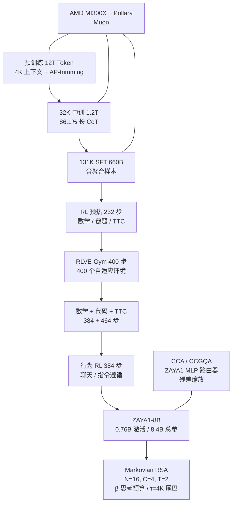
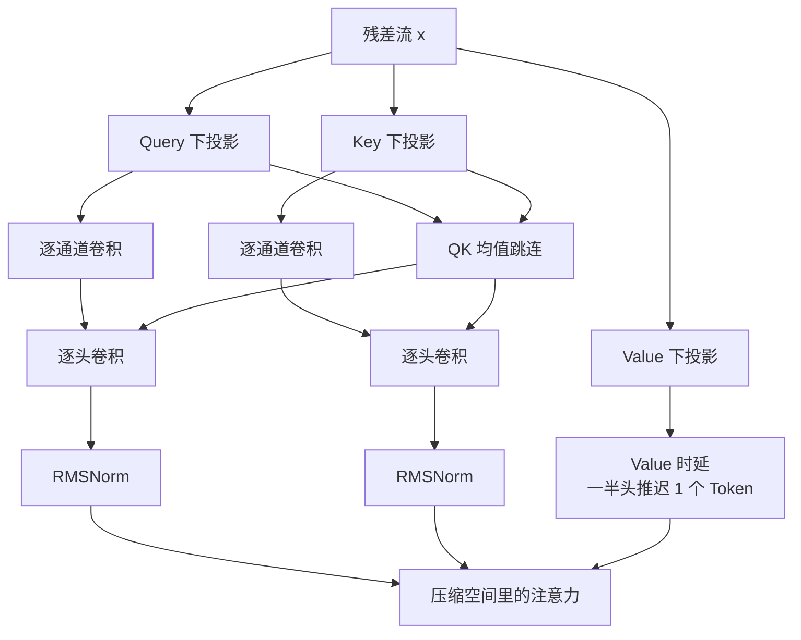
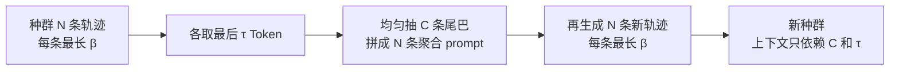
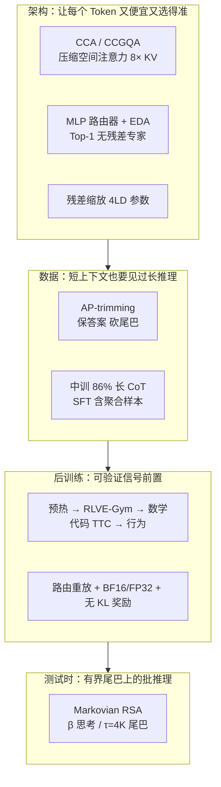

# 激活参数不到 1B，怎样把数学推理做上去

<!-- release-date: 2026-05-06 -->

> 本文依据 Zyphra 发布的 **ZAYA1-8B Technical Report**，即 arXiv:2605.05365v1（2026-05-06），共 33 页。截至核验日期，arXiv 只有 v1，本地原件无需更换。页码均指 PDF 本身的页码。全文把三件事分开标注：**报告明确写了什么**、**我们如何解释或验算它**、**哪些是外部资料补充**。凡标着「我们的解释」「我们的验算」「读图估计」的内容，都不是报告的结论。

## 阅读前先搭一张最小地图

这篇报告要讲的不是「又一个 8B 模型」，而是：**每个 Token 真正跑过的参数不到 1B 时，怎样把数学和代码推理做到能跟大很多的推理模型比。** 先认识六个会反复出现的名字。

- **Token（词元）**：模型读写文本的最小单位。一个汉字、一个英文词、一个标点都可能是一个或几个 Token。
- **激活参数（active parameters）**：每个 Token 真正参与计算的那一部分参数。总参数可以很大，激活参数决定单次前向有多贵。
- **MoE（Mixture-of-Experts，混合专家）**：把前馈网络拆成很多「专家」，每个 Token 只走其中几个。ZAYA1-8B 更极端：每层 16 个专家，每个 Token 只走 1 个。
- **KV Cache（Key-Value Cache，键值缓存）**：生成下一个 Token 时，前面每个 Token 留下的中间结果。上下文越长，这块显存越大。
- **CoT（Chain-of-Thought，思维链）**：模型在给出最终答案之前先写出的推理过程。这篇报告里的长 CoT 经常超过 1 万 Token，尾巴可以到 3 万以上。
- **测试时计算（Test-Time Compute，TTC）**：不改模型权重，只在推理时多花算力——多想几条、互相对照、再合成更好的答案。

报告另外几个自造的名字，读到相应章节再展开：**压缩卷积注意力（Compressed Convolutional Attention，CCA）**、**ZAYA1 路由器**、**学到的残差缩放（learned residual scaling）**、**保答案裁剪（answer-preserving trimming，AP-trimming）**、**马尔可夫递归自聚合（Markovian Recursive Self-Aggregation，Markovian RSA）**。

## 一句话先说清

ZAYA1-8B 是一个面向推理的 MoE 模型。精确参数是 0.76B 激活、8.4B 总参；对外宣传时取整成 0.7B / 8B。（PDF p.1、4，Table I）

它想证明的事情很具体：只要架构、从预训练开始的推理数据、可验证强化学习，以及测试时的聚合方法一起设计，**激活参数不到 1B 也可以在若干高难度数学和代码基准上追上甚至超过 DeepSeek-R1-0528**，并在测试时计算下把 AIME'25 推到 91.9%、HMMT'25 推到 89.6%，缩小与 Gemini-2.5 Pro、DeepSeek-V3.2、GPT-5-High 的差距。（PDF p.1–2）

五件设计各自解决一个具体矛盾，不要把它们记成名词清单：

1. **注意力**：不要在全维度里做序列混合。把 Q、K、V 压进潜空间，注意力直接在压缩空间里算，这就是 CCA；再和分组查询注意力组合成 CCGQA。
2. **路由**：不要把多出来的参数优先加给专家。一个小的多层 MLP 路由器控制数量大得多的专家参数，路由决策更准，负载更稳，残差专家也可以不要。
3. **残差**：用每维一个标量的仿射变换管住残差范数随深度膨胀，参数开销和 LayerNorm 一个量级。
4. **数据**：从预训练第一阶段就混进长 CoT。上下文装不下时，不砍答案、不从中间切断，只裁推理尾巴，这就是 AP-trimming。
5. **后训练与推理**：先用四阶段可验证 RL 把能力抬上去，再用 Markovian RSA 把「一条越写越长的思维链」改成「多条有界长度的尾巴并行聚合」。

贯穿全文的 insight 是：

> **小激活参数模型的推理，不必靠把每个 Token 跑得更重。把边际参数花在「选对专家」上，把注意力留在压缩空间里，把超过上下文的思维链改成「开头 + 答案」，再在测试时只向前携带有界的推理尾巴——能力可以从深度、路由质量和测试时计算里来，而不必从激活规模里来。**

## 先看全景：这个模型是怎么连起来的

这张图是根据报告 Figure 5（PDF p.8）、Table I–IV（PDF p.4、7、9）合并重画的机制示意，不是任何一张原图的复制。预训练、中训和 SFT 跑在全栈 AMD 上；报告没有写后训练 RL 是否也全部在 AMD 上。

先把配置放在一起，后面每一节都会回来引用。Table I 自己把两套口径写清楚了：表内是精确计数，对外发布取整。（PDF p.4）

| 配置 | 数值 | 页码 |
|---|---|---|
| 精确激活 / 总参数 | 0.76B / 8.4B | PDF p.4，Table I |
| 对外取整口径 | 0.7B / 8B（摘要写 700M / 8B） | PDF p.1、4 |
| Transformer 层数 | 40 | PDF p.4 |
| 隐藏维度 | 2048 | PDF p.4 |
| 注意力 | CCGQA，带 CCA 预处理器 | PDF p.4、31 |
| Query 头 / KV 头 / 头维度 | 8 / 2 / 128 | PDF p.4 |
| Query 压缩 / KV Cache 压缩 | 2× / 相对完整多头注意力 8× | PDF p.4、31 |
| 每层专家 / 路由 | 16 个，Top-1，无残差专家 | PDF p.4–6 |
| 专家 FFN 宽度 | 激活前 4096 / 激活后 2048 | PDF p.4 |
| 路由器潜空间 | 256 维，三层 MLP | PDF p.4–5 |
| 位置编码 | 每个头 50% 通道用 RoPE | PDF p.4、6 |
| 词表 | Gemma3 tokenizer，262,272 | PDF p.4 |
| 预训练硬件 | AMD MI300X + Pollara 网络 | PDF p.2、4、6 |

**外部补充**：Hugging Face 模型卡和 Zyphra 产品页常见 760M / 8.4B，与 Table I 的精确计数一致，并不是另一套模型。不要把摘要里的 700M / 8B 和 Table I 的 0.76B / 8.4B 当成互相打架的数字——报告自己说后者是精确值、前者是发布取整。知识库或架构手册里如果写「8.4B MoE」，用的是精确口径，不是本报告摘要的对外口径。

有两个数字值得一开始就看清楚。

第一，每个 Token 只走 1 个专家。当代 MoE 常见 Top-2 或 Top-8，还往往留一个始终激活的共享专家。ZAYA1-8B 两边都不要。报告把这件事归因于路由器够强：路由熵更低、专家更专，并行再开几个专家的边际收益变小。（PDF p.5–6）

第二，评测表其实有两套 checkpoint。单样本主表（Table VII、VIII、IX）用的是最终发布模型，数学题是 AIME'26 / HMMT'26；测试时计算的头条数字（Table XI、XII，Figure 1）用的是「数学 + 代码 + TTC RL 之后、行为 RL 之前」的 checkpoint，数学题是 AIME'25 / HMMT'25。两套数字不能混着比。（PDF p.2、15、20）

## 第一层问题：激活参数太小，推理通常贵在哪里

普通看法是：难数学和竞赛代码需要很大的模型，因为推理链很长，每一步都要「想对」。把这件事拆开，贵的其实是三笔账。

### 花销一：每个 Token 的前向计算

稠密模型里，激活参数约等于总参数。8B 稠密模型每个 Token 都要把 8B 参数跑一遍。MoE 把这件事拆开：总参数可以到 8.4B，但每个 Token 只激活 0.76B。单次前向大约相当于一个不到 1B 的稠密模型。（PDF p.1、4）

代价是路由必须选对。选错专家，等于这个 Token 走了一条完全错误的计算路径。Top-1 比 Top-2 更苛刻，因为没有第二个专家来兜底。

### 花销二：长推理把注意力和 KV Cache 一起拉长

教师模型的推理轨迹经常超过 10K Token，长尾可以超过 30K。（PDF p.6）预训练却从 4K 上下文开始。后面还要做 32K 中训和 131K SFT。普通多头注意力的计算按序列长度平方涨，KV Cache 按长度线性涨。对小激活模型来说，这两笔账会把「敢不敢用长 CoT」卡死。

### 花销三：测试时如果只会「把一条思维链写得更长」，服务形态很差

单条长 CoT 的 batch size 是 1，解码位置随思维链一直增长，KV Cache 也一直增长。想靠测试时计算追大模型，却把服务做成一条越来越长的单请求，吞吐会先垮。

这三笔账对应报告的三条技术线：CCA 降注意力和 KV 成本，MLP 路由器把 Top-1 做稳，Markovian RSA 把长推理改成有界的分阶段批推理。数据和 RL 则负责把「小模型本来不会的推理」装进去。

## 核心设计一：在压缩潜空间里做注意力

### 旧问题：省 KV Cache 的注意力，往往不省训练和 prefill

分组查询注意力（Grouped Query Attention，GQA）让多个 Query 头共用一套 Key/Value 头，主要省的是解码时的 KV Cache。多头潜在注意力（Multi-head Latent Attention，MLA）把 KV 压到低维，解码同样变便宜。

本报告对这两类方法的判断很克制。它没有在正文里写 MLA 的内部公式，只说：CCA 在压缩潜空间里做序列混合；相对 GQA 和 MLA，训练更快、prefill 的浮点运算更少，同时保持相当的 KV Cache 压缩率。（PDF p.3）附录 C 补了一句：先前工作里，CCA 在困惑度和训练/推理 FLOPs 上优于 GQA 和 MLA，并能做到高 KV 压缩，这对快速解码很重要。（PDF p.30）

**外部补充**，帮助理解「相当的 KV 压缩」背后差在哪。CCA 独立论文（[arXiv:2510.04476](https://arxiv.org/abs/2510.04476)，Figliolia 等，本报告参考文献）把矛盾说得更锋利：GQA 和 MLA 主要缩小缓存、加快解码，对决定 prefill 和训练速度的计算量改动不大；MLA 的典型做法是把压缩后的表示再升回全维度，然后才做注意力。CCA 的选择是 Q、K、V 都下投影，**整次注意力都在共享潜空间里完成**，参数、KV Cache 和 FLOPs 按压缩倍数一起降。下面正文只用本报告的数字和部件；独立论文里的 1.7× prefill 加速等数字不写入本篇的「报告写了什么」。

### 新设计：先压、再卷积预处理、再在潜空间里做注意力

报告把注意力块叫 CCA，正式配置是 **CCGQA（Compressed Convolutional Grouped Query Attention，压缩卷积分组查询注意力）**，带 CCA 预处理器。（PDF p.4，Table I）

人话版：先把每个 Token 的 Query、Key、Value 投影到更窄的空间；在这个窄空间里用短卷积做一点局部混合；然后就在窄空间里做注意力，不再升回全维度。分组查询是额外旋钮：8 个 Query 头只配 2 个 KV 头。

### 工作机制：图里的四个部件

Figure 3 和附录 Figure 12 画出了同一块结构。（PDF p.4、30）按信息流读，是四步。

根据 Figure 3（PDF p.4）与 Figure 12（PDF p.30）重画，是机制示意。

**低秩下投影。** Q、K、V 先降维。Table I 的 Query 压缩是 2×，意思是 Query 侧的宽度大约是完整多头注意力的一半。（PDF p.4、30）

**序列混合卷积。** 下投影之后不是立刻做注意力。一条短卷积和一条分组的逐头卷积当作注意力前的轻量预处理器。（PDF p.30） **我们的解释**：压缩会丢掉分辨率。卷积用邻近 Token 把一部分局部结构补回来，让后续注意力不是在「被压糊的向量」上做点积。报告自己的说法是：这些预处理，尤其是卷积，提供了表达力和非线性，使 CCA 能在更少计算和内存下匹配甚至超过完整注意力。（PDF p.31）

**QK 均值跳连与 Key 温度。** 架构用 Query/Key 的均值跳连去强制两边表示相似；RMSNorm 给 Key 加上逐头温度。（PDF p.30）标准 CCA 用 $\exp(T)$ 当温度。本报告改成直接乘学到的 $T$，因为指数很容易涨到过大，Query-Key 内积会失控。线性参数化压住了最大注意力 logit 的不稳定，报告把它类比成 MLA 文献里类似的稳定化做法。（PDF p.30–31）

假设已经做了 QK 归一化，缩放后的内积上界是：

$$
\frac{T \cdot d_h}{\sqrt{d_h}} = T \sqrt{d_h}
$$

$d_h$ 是头维度，本模型为 128。（PDF p.31，式 29）

**Value 时延。** 一半 Value 头会推迟 1 个 Token。（PDF p.30）报告没有在本篇里解释这一拍延迟为什么有用，只把它列为 CCA 的核心部件之一。

然后注意力在这个压缩空间里完成。CCGQA 再让多个 Query 头共享 KV 头。ZAYA1-8B 是 8 个 Query 头配 2 个 KV 头，叠在 2× Query 压缩之上，相对完整多头注意力得到 8× 的 KV Cache 压缩。（PDF p.31）

**我们的验算**：完整多头注意力若按 8 个 KV 头计，GQA 的 8:2 先把 KV 头数减到 1/4；再把每条 KV 的宽度按 Query 压缩 2× 理解成减半，缓存量大约是原来的 $1/4 \times 1/2 = 1/8$。这与「8× 压缩」一致。报告没有单独给出 KV 头维度是否也按 2× 压缩，所以这只是与 Table I 对得上的一种读法，不是报告自己的分解。

RoPE 只加在每个头一半的通道上，另一半没有位置编码。（PDF p.6）

### 收益：这份报告真正证明的是「在这个规模上能撑住推理」

本报告不是 CCA 的方法论文。它提供的新证据是：在 8B 总参、长上下文中训和推理任务上，CCA 仍然有效，能支持推理、上下文学习和长程回忆；压缩后的 KV 也让 32K / 131K 的上下文并行更便宜。（PDF p.3、6）

中训和 SFT 能把大量 Token 跑在 32K 和 131K 上，报告把「prefill FLOPs 大幅下降」记在 CCA 头上，并说这是在他们的算力规模上能做这件事的关键。（PDF p.6）上下文扩展时用 all-gather KV 的上下文并行：32K 用 2 个 rank，131K 用 8 个 rank。压缩 KV 把激活和缓存开销压住；卷积和 Value 移位的边界条件用短的异步点对点交换处理。（PDF p.6）

### 代价与边界

- 本报告几乎不做注意力消融。它说「在我们的消融里，这些架构改动相对经典 MoE + MLA/GQA + 线性路由器提升了每参数困惑度」，但没有给出对照表。（PDF p.3）
- 讨论里承认：一开始并不确定 CCA 能否支撑长上下文和推理，因为先前没在长上下文上测过；8B 总参相对前沿模型仍然不大，更大尺度上的行为还没验证。（PDF p.25）
- Value 时延、逐头卷积核宽度、下投影的具体秩，本报告都没写。实现细节在 CCA 独立论文和「先前工作」里，不在这篇技术报告的可复现范围内。

### 可迁移启发

如果训练或 prefill 已经被注意力算力卡住，只把 KV Cache 做小是不够的。真正改变训练成本的，是让注意力的二次项发生在更窄的空间里。GQA 解决解码内存，不一定解决训练时间。CCA 这条路的代价是：压缩之后要用卷积、跳连和温度把表达力补回来，并且要单独处理数值稳定。

## 核心设计二：把边际参数给路由器，而不是给专家

### 旧问题：线性路由器太瘦，Top-1 更危险

常见大 MoE 用一个线性层给每个专家打分，再 Top-k。线性路由器参数少、计算便宜，但决策面很简单。负载不均时要靠偏置、辅助损失或共享专家来补。

ZAYA1-8B 选了更苛刻的设定：16 个专家、Top-1、没有残差专家。（PDF p.4–6）线性路由器在这种设定下更容易把 Token 挤到少数专家上，或者为了平衡而选得含糊。含糊的 Top-1 特别伤：这个 Token 的整条前馈路径都错了。

### 新设计：先降维，再跨层平均，再跑一个三层 MLP

ZAYA1 路由器把「选专家」当成一个值得加容量的小网络，而不是一个附带的线性头。（PDF p.3–5）

给定第 $l$ 层残差流输入 $x_l \in \mathbb{R}^{B \times S \times D}$，$D=2048$ 是残差维度。先用 $W_{\text{down}} \in \mathbb{R}^{R \times D}$ 投到路由器维度 $R=256$：

$$
r_l = W_{\text{down}} x_l
$$

（PDF p.4，式 1）

然后做指数深度平均（Exponential Depth Averaging，EDA）。它是深度加权平均的一个变体，用学到的系数 $\gamma$ 把上一层的路由表示混进来：

$$
r_l = r_l + \gamma r_{l-1}
$$

（PDF p.5，式 2）

**我们的解释**：专家选择不该每层从零开始。上一层已经决定过「这类 Token 该走哪一类专家」，这一层用 $\gamma$ 决定要不要继承。这让路由在深度上有记忆，而不是 40 层各自抖动。

接着对 $r_l$ 做 RMSNorm，过一个带 GeLU 的三层 MLP，再 softmax，得到每个专家的分数 $s_l \in \mathbb{R}^{B \times S \times E}$：

$$
s_l = \operatorname{softmax}(\operatorname{MLP}(\operatorname{RMSnorm}(r_l)))
$$

（PDF p.5，式 3）

选专家时加上学到的负载均衡偏置 $b_l$，再 Top-k。本模型 $k=1$，所以就是对每个 Token 取 $\arg\max_e (s_{l,e} + b_{l,e})$。（PDF p.5，式 4）

### 负载均衡：把「离均匀有多远」交给 AdamW

偏置更新借用经典控制里的 PID 思路，但实现不是手写三项 PID，而是把误差送进 AdamW。误差就是当前 batch 里专家 $e$ 分到的 Token 比例 $p_{l,e}$ 减去均匀值 $1/E$：

$$
\nabla b_{l,e} = p_{l,e} - \frac{1}{E}
$$

（PDF p.5，式 5）

用得过多的专家会被惩罚，用得过少的会被抬起来。均衡是在全局 batch 的专家选择上做的。报告说这比 DeepSeek 那套经典实现收敛更快、更稳。（PDF p.5）

Figure 4 画的是一个 1.8B 实验模型从初始化开始、对 MoE 层平均的归一化路由负载熵 $H(p)/\ln E$。熵越接近 1，16 个专家分到的 Token 越均匀。（PDF p.5）报告没有在图注里给出最终熵的数值，只把这张图当作「MLP + EDA 让均衡更容易」的证据。

### 为什么「把参数给路由器」比给专家更值

MLP 确实增加了一点 FLOPs 和参数。报告的关键实验声明是：**参数匹配的消融里，边际参数投给路由器，比投给专家或注意力更值。** 路由器参数仍然不多，因为 MLP 跑在 256 维而不是 2048 维上。（PDF p.5）

人话版：路由器是总闸门。多给专家 1% 的参数，只让某一个专家稍微更强；多给路由器 1% 的参数，可能让所有专家都被用对。一个小网络控制一个大网络，杠杆在闸门上。

经验上还有两个连带效果。一是扰动之后恢复更快，比如数据分布在训练阶段之间切换时，均衡更不容易垮。二是每个 Token 的路由概率熵比线性路由器更低，选择更「自信」，于是 Top-1 变得合理，残差专家也不再必要。FLOP 匹配实验里，搭配 ZAYA1 路由器时 Top-1 优于更高的 Top-k；更高 $k$ 时，额外专家还要乘上路由概率，贡献更小。（PDF p.5–6）

附录 D 用专家子空间重叠做了一张「有没有塌缩」的体检表，不是能力评测。取每个专家第一层 FFN 投影的前 128 个奇异方向，算层内专家两两重叠。随机子空间基线是 $128/2048=0.0625$。ZAYA1-8B 输入侧重叠是 0.0904，相当于随机基线的 1.45×，和 Qwen3-30B-A3B 的 1.48× 接近，低于 LFM2 和 OLMoE；输出侧 1.58×，处于中间。输入侧重叠随深度从第一四分位的 0.075 升到最后四分位的 0.105。报告的结论只是：没有明显的专家塌缩，不要据此声称它比所有基线更专。（PDF p.6、31–32，Table XV）

### 代价与边界

- 1.8B 实验模型和正式 8.4B 模型不是同一规模，Figure 4 不能直接当成正式模型的负载曲线。
- 三层 MLP 的隐藏宽度、EDA 的 $\gamma$ 如何初始化、PID/AdamW 的超参，报告都没写。
- 「边际参数投给路由器更值」是作者实验观察，正文没有把对照表印出来。
- Top-1 在 RL 里会放大引擎和训练器之间的路由不一致，这是后面 router replay 必须存在的原因。

### 可迁移启发

MoE 的第一反应常常是「专家再多一点、k 再大一点」。ZAYA1 的相反建议是：先问路由器有没有足够的非线性去做出自信的选择。闸门比仓库更值钱。若路由器已经很自信，再开并行专家可能只是把同一个决策软化掉。这个启发不依赖 AMD，也不依赖 8B 这个规模；它依赖的是「路由决策控制的参数远多于路由自己」。

## 核心设计三：用几乎免费的仿射变换管住残差

### 旧问题：残差范数会随深度涨

40 层的残差流是一条高速公路。每一层都往上加东西，范数容易越来越大。有人用显式的注意力门控（报告引用 Qwen 的方案）来调节，但那要一门控矩阵，参数和 FLOPs 都不为零。（PDF p.5）

### 新设计：对残差和层输出各做一次按维缩放

学到的残差缩放（learned residual scaling）对向量 $x$ 做逐维仿射：

$$
\mathrm{Res\text{-}scale}(x) = \alpha x + \beta
$$

残差流和层输出用两套不同的 $\alpha,\beta$：

$$
x_{l+1} = \mathrm{Res\text{-}scale}_{\mathrm{res}}(x_l) + \mathrm{Res\text{-}scale}_{\mathrm{out}}(\operatorname{Layer}(\operatorname{RMSnorm}(x_l)))
$$

（PDF p.5，式 6）注意这里的 $\beta$ 是残差偏置，后面 Markovian RSA 的思考预算也叫 $\beta$，不是同一个量。

初始化把 $\alpha$ 设为 1、$\beta$ 设为 0，训练从普通残差连接出发。（PDF p.5）参数量是 $4 \times L \times D$：两套缩放，每套一个 $\alpha$ 和一个 $\beta$，每层每维一个标量。报告说开销和 LayerNorm 相当，可以忽略。（PDF p.5）

**我们的验算**：$4 \times 40 \times 2048 = 327{,}680$，大约 0.33M 参数，相对 8.4B 是 0.004%。这个验算只说明「可忽略」站得住，不是报告给出的数字。

### 收益、代价、启发

报告的实验观察是：残差缩放能提供与 Qwen 注意力门控类似的好处，却没有门控矩阵的参数和 FLOP 开销；它帮助控制残差范数随深度增长，且没有观察到梯度消失。（PDF p.5）讨论里把「较深的 40 层」和残差缩放放在一起当假说：深度可能有助于在一次前向里做更多串行计算，残差缩放则避免后面的层被范数膨胀淹没。这是训练经验支持的假说，不是隔离的因果结论。（PDF p.25）

本报告没有残差缩放的单独消融表。可迁移的部分很窄、也很便宜：在深网络里先加 $4LD$ 个参数管残差，再决定要不要上更重的门控。不要把「类似 Qwen 门控」理解成已经在 ZAYA1-8B 上做过对等替换实验——报告只说实验中看到类似收益。

## 核心设计四：从预训练就喂长思维链，装不下就保答案

### 旧问题：推理数据来得太晚，短上下文又装不下长轨迹

报告引用的证据是：预训练和中训阶段就引入长 CoT，能带来后训练补不回来的收益。（PDF p.6，Akter 等 2025）ZAYA1-8B 按这个思路走：每个预训练和中训阶段都含长 CoT，中训阶段里它还是数据的主体。（PDF p.6）

矛盾立刻出现。教师轨迹经常超过 10K，长尾超过 30K；预训练却从 4K 上下文开始。（PDF p.6）三条笨办法都不好：

1. 整条丢掉，推理信号没了。
2. 从后面截断，常常留下推理开头、丢掉答案，模型在学一段永远到不了结论的推理。
3. 从中间切开，计划和答案的因果关系断了。

### 新设计：保答案裁剪，只砍推理尾巴

保答案裁剪（answer-preserving trimming，AP-trimming）选择第三条路的改进版：答案必须留下，被牺牲的是推理块的尾部。（PDF p.6–7）

样本里有一段或多段助手回复，格式是 `<think>...</think>` 推理块后接最终答案。要对齐到上下文预算 $C$ 时，按下面四步走：

1. **能放下就原样保留。**
2. **裁最后一轮推理的尾巴。** 从答案正前方开始往前砍 `think` 块的尾部，保留推理开头和完整答案，让整段刚好落入 $C$。
3. **多轮对话仍放不下，就丢掉更早轮次的 `think` 块，只留那些轮次的答案，然后回到第 2 步。**
4. **若只靠答案就已经超过 $C$，整条样本丢掉。**

（PDF p.6–7）

核心判断是：推理开头往往是问题拆解、计划和多条路的探索；尾巴更局部，是把选定路线收成答案。砍尾巴比砍中间更能保住规划信号，并且开头、被截断的结尾和答案在因果顺序上仍然对齐。截断处到答案之间的衔接在分布上是人造的，但报告说实践中没看到明显伪影：预训练和中训之后的推理基准通过率仍然强，也没有定位到一种「截断专属」的失败模式。（PDF p.6–7）

### 阶段感知：上下文变长，就重新裁一次

AP-trimming 是离线、按阶段做的。4K 预训练、32K 中训、131K SFT 会把同一批数据重新裁到对应长度，逐步保留更长的推理。（PDF p.7）大多数推理数据在 131K 已经能完整放下，所以后期中训/SFT 几乎在完整轨迹上训练；早期预训练裁得最狠。

这和推理期或 RL rollout 里的长度控制不是一类东西。报告对比的先前方法（Khatri 等、Yang 等）是在生成时强行插入「结束思考、开始回答」；Akter 等最接近的训练数据做法只是按答案长度做筛选，不是截断。AP-trimming 解决的是互补问题：在比自然轨迹更短的训练上下文里，仍然要使用长 CoT。（PDF p.7）

### 可迁移启发

想在短上下文预训练里使用长推理数据，不要从序列末尾一刀切。先保证监督信号的终点（答案）还在，再决定牺牲推理过程的哪一段。报告赌的是「计划比收尾更值得留」。若你的轨迹结构相反——关键推导在尾巴——这套裁法会伤到真正有用的部分。它依赖「think 块 + 答案」这种可解析结构，不是对任意长文本都成立。

## 预训练、中训和 AMD 训练栈

架构要先被训练出来。报告把基座预训练的系统细节指向另一篇 AMD 全栈论文（Anthony 等，2025，arXiv:2511.17127），本篇只给阶段表和数据粗分类。（PDF p.6–7）

### 四段课程

| 阶段 | 上下文 | RoPE 基频 | Token 预算 | 主要强调 |
|---|---:|---:|---:|---|
| 基座预训练 phase 1 | 4K | 10K | 8T | 广泛网页、代码、数学、多语 |
| 基座预训练 phase 2 | 4K | 10K | 4T | 更多代码、数学、推理、指令数据 |
| 32K 中训 | 32K | 1M | 1.2T | 长 CoT、代码、数学、长上下文 |
| SFT | 131K | 5M | 660B | 聊天模板、推理、代码、指令遵循、TTC 轨迹 |

（PDF p.7，Table II）

中训和 SFT 的粗分类如下。百分比是数据卡里非零权重归一化后的混合比例，不是独立数据集名单。（PDF p.7，Table III）

| 类别 | 32K 中训 | 131K SFT |
|---|---:|---:|
| 长 CoT 推理轨迹 | 86.1% | 75.0% |
| 网页 / 合成网页 / 多语 | 5.7% | 9.8% |
| 原生长上下文数据 | 0.8% | 6.4% |
| 代码语料 / 代码 SFT | 3.0% | 5.0% |
| 数学 / STEM 语料 | 3.0% | 2.6% |
| 短指令 / few-shot | 1.4% | 1.2% |

读这张表时不要漏掉含义：中训几乎是一个推理模型在做长上下文续训，不是普通的「再喂一点网页」。报告相信，在更长上下文上训练大量 Token 会显著改善原生长上下文能力，从而给后训练和 RL 一个更强的底座。（PDF p.6）

这些阶段使用 Muon 优化器，并做 AdamW RMS matching。（PDF p.6）SFT 的 131K 窗口用优化过的 best-fit decreasing 装箱，尽量塞完整样本；超长样本在装箱前按数据集预处理，而不是训练时在固定边界上切出任意后缀。报告说，后一种做法会让模型在机械截断的结尾上产生幻觉。（PDF p.7）SFT 还第一次加入 Markovian RSA 用的聚合样本：题目 + 若干候选推理尾巴，监督目标是写出一条更好的综合解答。（PDF p.7–8、18）

### 全栈 AMD 是训练事实，不是架构主张

报告把 AMD 栈列为五件系统选择之一。ZAYA1-8B 的预训练、中训和 SFT 跑在 AMD Instinct MI300X 与 AMD Pensando Pollara 400 网络上，作为「这块栈撑得住 8B 总参推理模型的持续预训练、长上下文中训和 SFT」的证据。更大模型和更广的并行方案仍是未来工作。（PDF p.2）

附录 A 给出的是节点规格，不是集群规模。（PDF p.30–31，Table XIV）

| 节点 | 关键规格 |
|---|---|
| 计算节点 | 8× MI300X，Infinity Fabric 机内互连；2 TB DDR5；双路 Xeon Platinum 8570；8× Pollara 400（每卡 400 Gb/s）+ 1× Pensando DSC 200 GbE；25.6 TB NVMe |
| 存储节点 | 双路 Xeon Gold 6426Y，256 GB DDR5，120 TB RAID0（16× 约 7.6 TB NVMe），1× Pensando DSC 100 GbE |
| 登录节点 | 虚拟化双路 Xeon，约 1 TB 虚拟盘 |

附录 B 用一次具体的 I/O 估算说明存储预算够用：全局 batch $G=4096$，序列 $s=4096$，每 Token 4 字节，页大小 4096 字节，迭代时间 2.5 秒，存储可持续 70,000 IOPS。每次迭代读 64 MiB、16,384 页，需要大约 $6554\cdot\sigma$ IOPS；即使碎片系数 $\sigma=8$，也仍高于盈亏平衡时间。（PDF p.30）

报告没有写计算节点数量、总 GPU 数、墙钟时间和总成本。讨论里说：这次训练只用了数据并行，加上上下文扩展阶段的上下文并行；其它并行（包括跨节点并行）做过压力测试，但还不足以验证这块栈能训更大的模型。（PDF p.25）

**我们的判断**：AMD 栈在这篇报告里是「跑通了」的工程事实，不是「AMD 比 NVIDIA 更适合这套架构」的比较结论。可迁移的是那组存储 I/O 估算公式，以及「先在 8B 上验证全栈再谈更大」的谨慎边界。

## 核心设计五：先把可验证能力抬满，再抛光聊天

后训练从 SFT 开始，然后是四阶段 RL 级联。前三阶段几乎全是可验证推理；聊天风格、指令遵循和偏好放到最后。（PDF p.7–9）报告说这和常见配方有两处不同：推理 RL 前置，把大部分 RL 算力花在数学、谜题、合成环境和代码上；代码阶段还用竞赛题构造了输入输出预测、从测试用例还原代码、证伪三类辅助环境。（PDF p.7）

Figure 5 把 SFT 和四阶段 RL 画成一条流水线，数学 + 代码 + TTC 又拆成两个子阶段。（PDF p.8）

### 所有 RL 阶段共用的算法脊柱

阶段之间变的是数据、奖励和少量超参。骨架不变。（PDF p.8–9）

**异步 PipelineRL。** 生成 rollout 和梯度更新在不相交的 GPU 池上完全异步。rollout worker 比 trainer worker 多 2–5 倍，按平均回复长度和 actor 更新时间匹配，避免一边空转。权重每 2 次 trainer 迭代原地同步；稳态下 rollout 策略最多落后 trainer 2 次更新。（PDF p.8）

**信任域：DPPO Binary-TV。** 不用 PPO 的逐 Token 比率裁剪，改用二元全变差掩码。策略散度估计超过阈值 $\delta$ 的 Token 不进梯度，其余按普通策略梯度更新。生产中 $\delta=0.1$，选的是「还不让无约束奖励增长跑飞」的最大阈值。奖励里没有 KL 项，信任域完全靠这层掩码。（PDF p.8–9）

**损失聚合：Dr-GRPO SMTSN。** 先在一条 rollout 内对 Token 损失求和，再对 batch 内 rollout 做序列均值，而不是按 Token 平均。这样不会像标准 GRPO 那样隐式按长度归一化、把梯度偏向更长的回复。（PDF p.8）

**优势：MaxRL。** 每个题目采样 $G$ 条 rollout，任务奖励 $r_i \in \{0,1\}$。优势用组内平均奖励 $\bar r$ 归一化，而不是用标准差：

$$
\hat A_i = \frac{r_i - \bar r}{\bar r}
$$

（PDF p.8，式 7）报告说这对应截断最大似然目标的方差缩减估计，对更难的题目梯度更强。行为 RL 是例外，改回标准 GRPO 的标准差归一化。（PDF p.8）

**长度奖励。** 除行为 RL 外，所有阶段都加一项按难度缩放的长度奖励，只加在优势的分子上，分母仍用未修改的任务奖励，避免尺度爆炸。系数 $c$ 从预热阶段的小值升到数学 + 代码阶段的 $c=1.0$。（PDF p.8–9）公式上，先按组内最短正确回复做线性插值，再加三道门：当前解题率不能离历史最高太远、组内至少两条正确、本条必须正确。解题率 $p$ 再乘上去，容易的题多罚长答案，难的题少罚。（PDF p.9，式 8–10）

**优化器。** 矩阵参数用动量为 0 的 Muon；词嵌入和 LM head 用 AdamW。每个 actor 更新只依赖当前 rollout batch，不把一阶矩带到下一批。报告把它写成 GLM-5「在权重同步边界重置优化器」的彻底版：不是定期清，而是永远没有动量。（PDF p.9、12）这是经验配方，不是优化器消融后的一般结论。

共用超参：128 个 prompt 的 minibatch，每题 $G=16$ 条回复；单条最长 81,920 Token（预热前半段 65K）；聚合 prompt 最长 20,480，为了放下 $C=4$ 条尾巴；学习率 $2\times 10^{-6}$ 到 $1\times 10^{-5}$，行为 RL 最小。（PDF p.9）

### 阶段一：推理预热，232 步

目的是让 SFT 模型先适应又长又可验证的 rollout，再进更广的环境。（PDF p.9）84,604 行，有意偏向难题：先验通过率不超过 0.75，多数更低。中位回复大约 17.6K Token，p90 接近 30K。混合是 Reasoning Gym / reasoning-core 谜题 54.4%、竞赛数学 31.2%、Enigmata 谜题 14.4%（Table V 写 54.4%，Figure 5 写 54.5%，差 0.1 个百分点，按表为准）。（PDF p.9–10）TTC 题目已经按 Markovian RSA 的格式来，模型在 RL 一开始就见到聚合 prompt。

### 阶段二：RLVE-Gym，400 个环境、400 步

这是桥。400 个自适应、可验证的谜题生成器来自 RLVE-Gym，作为数据集接到 VeRL 里。（PDF p.9–10）步数比后面的数学 + 代码阶段少，但平均每步大约长一倍，因为回复长度约 50K Token。

在线调度器把每个环境的难度钉在模型当前能力边界附近。目标通过率 $p_{\mathrm{target}}=0.5$，也就是 logistic 模型 Fisher 信息最大的点，再用 $\varepsilon$-greedy 探索 $0.5\pm 0.25$。（PDF p.10）太容易则一组全对、没有对比；太难则一组全错、同样没有梯度。初始化用 Thompson Sampling 找到每个环境的 0.5 通过率交叉点，因为有的环境难度可以超过 100，有的在 0 也很难解。（PDF p.10）

### 阶段三：数学、代码和测试时计算，两段共 848 步

这是能力建设的主阶段。两段数据混合如下。（PDF p.10–11，Table VI）

| 类别 | Phase 1 通用（18,656 行，384 步） | Phase 2 偏代码（12,092 行，464 步） |
|---|---:|---:|
| 标准代码 | 20.3% | 31.4% |
| 代码辅助 / 代码 TTC | 33.4% | 26.8% |
| 标准数学 | 33.8% | 22.5% |
| 数学 TTC / RSA / PaCoRe | 12.5% | 19.4% |

三类合成代码环境都从同一道竞赛题种子长出来，种子含题面、输入输出规范、通过的参考实现、能找到的错误实现，以及测试用例。（PDF p.11）

1. **代码 I/O 预测。** 给定代码和输入，预测输出；反过来，给定代码和输出，提出能产生该输出的输入。输出侧用规范化后的精确匹配；输入侧用参考程序执行检查。
2. **CodeARC 重建。** 给定题面、规范和示例测试，合成代码，用留出测试编译或执行。
3. **证伪。** 给定规范和一份实现，找出让实现相对规范或可信实现失败的输入。

报告的意图是训练算法推理原语，而不只是端到端刷题。三种任务都是二元可验证的，因此和数学、谜题共用同一套 RL 目标。（PDF p.11）

同一数据流里还有 Markovian RSA 和 PaCoRe 风格的聚合 prompt。策略只生成一条综合解答，按最终答案或代码拿标准可验证奖励。这样既练普通单次解题，也练推理时要用的聚合工作流。（PDF p.11）

本发布没有专门的多轮 Agent RL。SFT 里有一些工具和 SWE 轨迹，但 RL 级联主要优化可验证推理。报告预期 BFCL-v4 和 $\tau^2$ 这类 Agent 基准会落后于明确做了多轮工具 RL 的模型。（PDF p.11、25–26）

### 阶段四：行为 RL，384 步，放在最后

可验证阶段已经把数学和代码立住之后，才调聊天、风格和指令遵循。这里改用标准 GRPO 的标准差归一化，也不再使用长度奖励。（PDF p.11）

先在 80K 行为 prompt 上跑 1 个 epoch。再跑两段指令遵循，各 1 个 epoch：先简单指令，再更难的 IFBench 风格。IF 阶段的奖励被二元指令检查器门控——没过门，奖励为零；过了门，才用奖励模型打分。这样流畅但违规的回复拿不到正奖励。（PDF p.11）

### 后训练整体抬了多少

Table IX 用同一套 harness 比较 131K SFT 和最终模型，测的是整条 RL 级联的总和，不是逐步消融。（PDF p.16）

| 基准 | SFT | 最终 ZAYA1-8B | 差值 |
|---|---:|---:|---:|
| AIME'26 | 68.30 | 89.10 | +20.80 |
| HMMT'26 Feb. | 39.20 | 71.60 | +32.40 |
| LiveCodeBench-v6 | 54.80 | 64.84 | +10.04 |
| GPQA-Diamond | 59.30 | 71.00 | +11.70 |
| MMLU-Pro | 70.10 | 74.20 | +4.10 |
| IFEval | 66.60 | 85.58 | +18.98 |
| IFBench | 30.20 | 52.56 | +22.36 |
| EQBench | 57.80 | 72.95 | +15.15 |
| Creative Writing v3 | 46.72 | 62.97 | +16.25 |
| BFCL-v4 | 33.41 | 40.50 | +7.09 |
| $\tau^2$ | 32.88 | 36.30 | +3.42 |

讨论把推理 RL 的更新步数加起来：232 + 400 + 384 + 464 = 1,480 步，相对预训练和中训非常短，却在 AIME 类题目上抬了大约 20–30 分，LiveCodeBench-v6 大约 10 分。（PDF p.23）作者倾向的解释是：预训练和中训已经把推理的潜在能力装进权重；RL 走的是相对 KL 更短的路径，主要改变采样分布，让这些能力在长生成预算下更稳定地表现出来。他们观察到 pass@k 在没碰到能力天花板时保持稳定甚至上升，因此不同意「RL 只是花掉中训 checkpoint 的熵」那种说法。（PDF p.23）他们明确没有做「同等数据上只做 SFT」的对照，所以不声称 SFT 一定补不回这些收益。

## RL 要能训起来：路由重放、精度和监控

长 rollout 的异步 RL 对 MoE、尤其是 Top-1 MoE，有一套自己的失败模式。报告把这部分写得很细，因为「算法脊柱」离开它们会不稳定。

### 路由重放：训练时必须走生成时选中的那个专家

报告称这是 MoE 在 RL 里最重要的改动。trainer 不重新计算路由，而是复用 vLLM 在 rollout 时写下的逐 Token、逐层专家编号。（PDF p.11）

原因是不连续。稠密模型里，引擎和训练器之间一点点数值差，通常只造成一点点 logit 差。Top-1 MoE 里，同样的差可以把专家打分的两边翻过来，整个前馈路径换一条。生成时走专家 $e_{\mathrm{inference}}$、反向时走 $e_{\mathrm{train}}$，梯度就在错误的局部模型上算。长序列上这种错误会累积。（PDF p.11、24）

实现上，vLLM 在解码时把专家编号写进共享内存，写操作和计算重叠；编号随 token ID、mask 一起打包给 trainer，不另开传输步骤。（PDF p.11–12）讨论里说：没有重放时不稳定的高学习率，有重放之后能用。（PDF p.24）

### 精度：BF16 主干，少量算子升 FP32，不走全 FP16

默认是 BF16 权重和激活。升 FP32 的算子在 trainer 和 vLLM 两侧必须相同，否则 PipelineRL 需要的 log-prob 一致性达不到。（PDF p.12）

升 FP32 的集合包括：融合交叉熵和 LM head 矩阵乘；CCA 的 cache 状态、QK-norm、QK-mean、RMSNorm；路由器 softmax 和残差加法。（PDF p.12）他们试过文献里「一律改 FP16 来减小训练-推理不一致」的方案，比较后认为：硬化过的 BF16 加上两侧对齐的少量 FP32，已经能达到稳定 PipelineRL 所需的一致性，同时保住 BF16 的动态范围。（PDF p.12）

Figure 6 是一张诊断散点图：横轴 vLLM 的 Token 概率，纵轴 trainer prefill 的概率。三列分别是纯 BF16、BF16+FP32、再加路由重放。最终配置在 128 个 prompt、$G=16$、4K 补全的诊断 batch 上，KL 散度为 $1.3\times 10^{-4}$，Pearson $r>0.9996$。（PDF p.12–13）

长 rollout 的显存压力主要来自激活。做法是主机侧激活卸载加梯度检查点；FSDP shard size 4（FSDP2），关掉序列并行——在这个模型大小和每卡长度下，序列并行和 ring attention 多出来的跨 rank 通信不值回显存。（PDF p.12）trainer 按每 GPU 每 microbatch 131,072 Token 的预算做动态装箱，而不是固定 rollout 条数，避免被组里那条最长的回复主导。（PDF p.12）

### 退化监控：压缩率当金丝雀

奖励和 KL 只描述优化动态，不描述生成内容。生产中用滑动窗口 LZ77 压缩率当主金丝雀：把 rollout 切成块，用 1024 字节窗口的 zlib，算每块压缩比。任何一块 $r_c < 0.05$，就把整条任务奖励置零，即使最终答案碰巧对。（PDF p.13）这是为了切断「先胡言乱语再在结尾蒙对答案」的学习信号。

他们还跟踪词表 ID 落在最大 10% 区间的 Token 比例，作为罕见 Token / 乱码的廉价代理。（PDF p.13–14）附录 E 把「短暂、可恢复的乱码插入」和缓存损坏、死循环重复区分开：乱码往往与前后文无关，后缀常常忽略它，但它会因为含乱码的轨迹仍然得奖而被强化。最差测试 checkpoint 上有 19.9% 的回复被标出；min-p 采样在阈值 $10^{-5}$ 时把这个比例降到 0.1%。他们建议训练时做 min-p replay，把保留/丢弃的 Token ID 暴露给 trainer，避免引擎和训练器在重归一化上再不一致。（PDF p.32–33）

### 一个他们选择绕开的坑：把带符号的 KL 塞进奖励

早期压力测试里，PipelineRL 加上序列级带符号 log-ratio 惩罚，会让回复越来越长而奖励不涨。工作解释是：长补全会跨越多个生成器快照，过期前缀的 $l_t=\log\pi_\theta-\log\pi_{\mathrm{gen}}$ 在期望上是负的 KL；序列求和再从奖励里减掉，负的和变成正的长度偏置，而且会广播回后面的新 Token。（PDF p.14）他们讨论过按 chunk 隔离和按陈旧度缩放两种缓解，生产中都没采用，而是彻底去掉奖励里的 KL，只靠 DPPO Binary-TV。（PDF p.14）这是一份失败记录，不是一项上线技术。

### 可迁移启发

Top-1 MoE 的 RL 里，路由决策是一等公民，不是可以重算的实现细节。引擎和训练器必须在专家选择上对齐，再谈 logit 对齐。压缩率这种内容金丝雀，比只看 KL 更能抓住「奖励对了、文本已经崩了」。异步 RL 不要把带符号的过期 log-ratio 当成 KL 正则。

## 核心设计六：Markovian RSA，只向前带一段有界的推理尾巴

### 旧问题：测试时计算要么上下文爆炸，要么不会综合

两条近期工作构成设计空间。（PDF p.15）

**递归自聚合（Recursive Self-Aggregation，RSA）** 维护一群候选推理链，每一轮抽一个子集给模型看，让它写出更好的新候选，再放回种群。它能让较小的开源模型在足够推理算力下接近更大的推理模型，但若在轮次之间传递完整思维链，聚合 prompt 会按「候选数 × 思维长度」膨胀。

**马尔可夫思考者（Markovian Thinker）** 把思考改成固定大小的块，块与块之间只携带有界状态，从而把思考长度和上下文大小解耦。长推理可以被马尔可夫地因子分解：模型有时只需把下一步真正需要的信息写进一段有界文本。

单独用前者，上下文会被完整历史撑爆；单独用后者，每条轨迹只看见自己的尾巴，不能从别人的错误和正确里综合。

### 新设计：并行出候选，轮次之间只传尾巴

Markovian RSA 把 RSA 的递归综合和马尔可夫思考者的有界工作区合在一起，并且写进训练，而不是只在推理时临场发挥。（PDF p.15–17）

记号先定死，后面所有数字都靠它们：

| 符号 | 含义 | 头条配置 |
|---|---|---|
| $N$ | 每轮种群大小 | 16 |
| $C$ | 每条聚合 prompt 抽几条尾巴 | 4 |
| $T$ | 聚合轮数 | 2 |
| $\beta$ | 每条候选自己的思考预算 | 按工作负载；头条 40K |
| $\tau$ | 向前携带的尾巴长度 | 头条 4K |

算法按轮进行。第 0 轮：从原题 $q$ 独立生成 $N$ 条 rollout，每条最多想 $\beta$ 个 Token，然后只保留最后 $\tau$ 个 Token 当尾巴。第 $t\ge 1$ 轮：要生成每一条新候选时，从上一轮种群里均匀抽 $C$ 条尾巴，拼进聚合 prompt，让模型综合出一条新解答，再截成新尾巴。最后一轮用标准方法抽最终答案。聚合 prompt 只是请模型考虑这些候选并给出最好解答，不需要特殊解析，也不需要验证器反馈。（PDF p.17）

根据 Figure 8（PDF p.19）重画，是机制示意。

关键解耦：**$\beta$ 决定每条候选能想多深，$\tau$ 决定下一轮能看见多少。** 两者独立。$\tau\ll\beta$ 时，可以把单条思考预算开得很大，聚合 prompt 仍然短。解码注意力、prefill 注意力和 KV Cache 由配置常数界定，不随「已经想过的总长度」增长。（PDF p.17）

聚合 prefill 长度满足：

$$
L_{\mathrm{prefill}} \le |q| + C\tau + O(1)
$$

每条候选的解码长度以 $\beta$ 为上限，与所有轮次生成过的总推理量无关。（PDF p.18，式 23）

默认 $(N,C,T)=(16,4,2)$，$\tau$ 通常不超过 $\beta/2$。（PDF p.17）

### 它把常见 TTC 都收成特例

Table X 把服务形态说清楚了。（PDF p.19）

| 方法 | 解码形态 | 轮次之间带什么 | 对应极限 |
|---|---|---|---|
| 单条长 CoT | batch=1，位置随总推理增长 | 完整历史 | — |
| 并行采样 / N 条回复 | batch=$N$，一轮 | 无聚合 | $T=0$；只有另加选择器才是 Best-of-N |
| Delethink 式续写 | batch=$N$，分块多轮 | 一条有界尾巴 | $C=1$ |
| 全链 RSA | batch=$N$，多轮聚合 | $C$ 条完整链，最长 $C\beta$ | $\tau=\beta$ |
| Markovian RSA | batch=$N$，多轮聚合 | $C$ 条尾巴，最长 $C\tau$ | 一般情形 |

和 PaCoRe 的差别在压缩方式。PaCoRe 抽每条轨迹的最终答案或结论往下传；Markovian RSA 不管有没有写到结论，都传推理轨迹的最后 $\tau$ 个 Token。他们还评了一种混合：若候选已经写出 think 之后的答案段，就传这段紧凑答案；否则退回传部分推理链，而不是把这条候选丢掉。（PDF p.18、20）

### 训练时就要见过这种 prompt

标准推理训练几乎都是「一题一解」。聚合 prompt 很少见。所以他们从已有教师 rollout 里离线构造 SFT 样本：不少开源推理数据集每题有 $n=8$ 条教师轨迹（报告点名 OpenMathReasoning、rStar-Coder，以及内部 Reasoning Gym 和 Enigmata）。抽 $C$ 条、截尾巴、拼成聚合 prompt，再让教师在这个 prompt 下写一条新的综合轨迹，作为 SFT 目标。这样做不需要为第 0 轮重新推理，也不需要验证器，因此对谜题、代码、以及「think 之后的正文本身就是答案」的任务都适用。（PDF p.18）

RL 的数学 + 代码阶段把两类聚合 prompt 混进普通题：教师聚合，以及用当前 SFT 或上一阶段 RL checkpoint 的自 rollout 做自聚合。策略仍然只生成一条 rollout，按最终答案拿二元奖励。目前只训到第 1 轮自聚合；第 2 轮及以后用在线 buffer 聚合「上一阶段的自己」，留作未来工作。（PDF p.18–19）

### 头条数字：4K 尾巴，AIME'25 91.9%，HMMT'25 89.6%

这些数字来自行为 RL 之前的 checkpoint，采样温度 1.0、top-p 1.0，最终回复预算 40K。评测协议是最后一轮候选输出的平均正确率，不是 Best-of-N。Token 计数只含新生成的解码 Token，不含原题、聚合 prefill 和拷贝过去的尾巴。（PDF p.15、19–20）

Table XI 把单次 rollout 和 40K/4K 的 Markovian RSA 放在更大的模型旁边。标 $\dagger$ 的对比分来自外部材料，不是同一套 harness。（PDF p.20）

| 模型 | 激活 / 总参 | AIME'25 | HMMT'25 Feb. | LCB-v6 |
|---|---|---:|---:|---:|
| ZAYA1-8B 单次 rollout | 0.7B / 8.0B | 88.3 | 82.7 | 65.0 |
| ZAYA1-8B + Markovian RSA 40K/4K | 0.7B / 8.0B | 91.9 | 89.6 | 69.2 |
| DeepSeek-R1-0528 $\dagger$ | 37B / 671B | 87.5 | 79.4 | 68.7 |
| Qwen3-235B-A22B-Thinking-2507 $\dagger$ | 22B / 235B | 92.3 | 83.9 | 74.1 |
| Gemini-2.5 Pro $\dagger$ | — | 88.0 | 82.5 | 72.5 |
| DeepSeek-V3.2 $\dagger$ | 37B / 671B | 93.1 | 92.5 | — |
| GPT-5-High $\dagger$ | — | 94.6 | 88.3 | — |

LCB-v6 是 2025-02 至 2025-05 分段。同一 checkpoint 上，PaCoRe 混合压缩把 LCB-v6 做到 71.1%，高于 Markovian RSA 的 69.2%。报告不把这个差距单独归因于训练曝光，因为模型两种聚合都见过。（PDF p.20）

Figure 1 的阴影柱就是相对单次 rollout 的 TTC 增益：AIME'25 +3.6，HMMT'25 +6.9，LCB-v6 +4.2。读自 Figure 1（PDF p.2）。HMMT'25 上 89.6 超过表中的 GPT-5-High 88.3；AIME'25 上 91.9 仍低于 DeepSeek-V3.2 的 93.1 和 GPT-5-High 的 94.6。对比分来源不同，不宜读成严格排名。

配置扫描在 Table XII。（PDF p.21）

| 配置 | $T$ | $N$ | $C$ | $\beta$ | $\tau$ | AIME'25 | HMMT'25 |
|---|---:|---:|---:|---:|---:|---:|---:|
| 马尔可夫基线（无跨候选聚合） | 4 | 16 | 1 | 8K | 4K | 82.1 | 75.0 |
| Markovian RSA | 2 | 16 | 4 | 8K | 4K | 86.5 | 80.8 |
| Markovian RSA | 2 | 16 | 4 | 16K | 4K | 88.8 | 87.1 |
| Markovian RSA | 2 | 16 | 4 | 40K | 4K | 91.9 | 89.6 |
| Markovian RSA | 2 | 16 | 4 | 40K | 8K | 90.8 | 89.2 |

三件事实从这张表读出来。

第一，加长单条思考预算 $\beta$ 比加长尾巴 $\tau$ 更值。$\tau=4K$ 不动，$\beta$ 从 8K 到 16K 到 40K，AIME'25 走 86.5 → 88.8 → 91.9，HMMT'25 走 80.8 → 87.1 → 89.6。HMMT 对更长单条推理特别敏感，8K 到 16K 就加了 6.3 分。（PDF p.20）把 $\tau$ 从 4K 加到 8K，两个基准都略降。报告把这当成经验证据：在这些配置和基准上，聚合并不受限于「必须留下超过 4K 的尾巴」。他们不把它推广成「尾巴永远无所谓」。（PDF p.20–21）

第二，跨候选聚合本身有独立贡献。$C=1$ 的基线已经有 82.1 / 75.0，说明有界携带能保住大部分长 CoT 能力；同一 $\beta=8K,\tau=4K$ 下改成 $C=4$，再加 4.4 和 5.8 分。（PDF p.21）两个效应是叠加的：有界携带让服务形态可封顶，递归聚合再从别人的候选里提炼。

第三，总生成 Token 仍然很多。16K/4K 大约每题 440K 新解码 Token，40K/4K 大约 740K，都是评测 run 的实现平均值，不是最坏上限。（PDF p.20）服务侧的上下文却是封顶的：$\beta=40K,C=4,\tau=4K$ 时，全链 RSA 每条聚合项最多带 160K 候选状态，Markovian RSA 只带 16K，候选状态减少 90%（还没算共享题面）。（PDF p.22）他们建议部署默认用 16K/4K；40K/4K 留给能力天花板评测。一套更轻的配置（$T=2,N=8,C=4,\beta=8K,\tau=4K$，最终预算 40K）在他们当前服务设置里，墙钟大约是标准 $N=1$ 长推理基线的 0.4 倍。这是实现相关观察，不是硬件无关的吞吐基准。（PDF p.22）

更难的 APEX-shortlist 用来探天花板。无 TTC 是 32.2；轻/高/极高三档 Markovian RSA 分别到 33.3 / 46.1 / 51.8。极高档 $T=8,N=32,C=4,\beta=32K,\tau=4K$，大约每题 5.5M 新解码 Token，不当作推荐部署点。Figure 10 上 DeepSeek-V3.2 为 48.6、GPT-OSS-120B high 为 45.8，来自 MathArena 榜，协议可能不同。（PDF p.21，Table XIII）

Figure 11 用同一套 TTC（$T=2,\beta=16K,\tau=4K$，最终预算 40K）比较 ZAYA1-8B 和 Qwen3-4B-Thinking-2507。**读图估计**（Figure 11，PDF p.22）：AIME'25 上两者无 TTC 都约 81%，TTC 后 ZAYA1 到约 89%、Qwen 只到约 82%；HMMT'25 上 ZAYA1 从约 69% 到约 87%，Qwen 从约 56% 到约 57%。报告把差距解释为训练设计：ZAYA1 从中训起就见长 CoT，SFT 和 RL 见过聚合样本；Qwen3-4B-Thinking-2507 没有为这套工作流训练。这不是方法评测，因为两边跑的是同一算法。（PDF p.22）无 TTC 的 81% 与 Table XI 单次 88.3% 不是同一列数字，不要强行对齐——图表用的采样、预算或 checkpoint 口径与 Table XI 的单次 rollout 行并不自动相同。

### 代价与边界

- 全链 RSA 的严格对照留作未来工作。（PDF p.22）
- 第 2 轮及以后的在线自聚合没有训。（PDF p.19）
- 头条 TTC 数字不是最终带聊天抛光的 checkpoint。
- 对比大模型的分数大量来自外部材料，采样和报告协议可能不同。（PDF p.15、20）
- 小激活 × 多 Token 在数学上划算，不自动等于端到端延迟更低；墙钟 0.4× 只是他们自己的服务观察。

### 可迁移启发

测试时计算有两个可以分开拧的旋钮：每条轨迹想多深，以及下一轮需要看见多少历史。很多系统把它们绑在「上下文长度」这一个数字上。Markovian RSA 的做法是：深度用 $\beta$ 买，记忆用 $\tau$ 买，综合用 $C$ 和 $N$ 买。若你的模型从来没在训练里见过「同时读几条不完整推理再写出更好的一条」，推理时硬上聚合，增益可能接近零——Figure 11 就是这个警告。

## 不靠 TTC 时，它在同类和更大开源模型里处在哪

Table VII 是同量级比较，ZAYA1-8B 用最终模型。数学、知识和指令遵循：温度 1.0、top-p 0.95、关闭 top-k；代码、Agent 和风格：温度 0.6、top-p 0.95、top-k 20。EQBench 和 Creative Writing v3 的裁判是 `anthropic/claude-3.7-sonnet`。（PDF p.16）

数学基准是 avg@64，代码、GPQA-Diamond、$\tau^2$ 是 avg@16，其余多为 mean@1。avg@k 是 $k$ 次独立采样的平均正确率，用来估计单次通过率，不是 pass@k / Best-of-k。（PDF p.15）

| 类别 | 基准 | ZAYA1-8B 0.7/8B | Qwen3-4B-Thinking-2507 | Qwen3.5-4B | Gemma-4-E4B-it |
|---|---|---:|---:|---:|---:|
| 数学 | AIME'26 | 89.1 | 79.0 | 84.5 | 50.3 |
|  | HMMT'26 Feb. | 71.6 | 53.6 | 63.6 | 32.1 |
|  | IMO-AnswerBench | 59.3 | 51.6 | 48.7 | 27.3 |
|  | APEX-shortlist | 32.2 | 17.1 | 21.35 | 6.1 |
| 代码 | LiveCodeBench-v6 | 64.8 | 54.9 | 55.8 $\dagger$ | 54.2 |
| 知识 | GPQA-Diamond | 71.0 | 66.1 | 76.2 | 57.4 |
|  | MMLU-Pro | 74.2 | 74.3 | 79.7 | 70.2 |
| 指令 | IFEval | 85.6 | 86.8 | 89.8 | 88.5 |
|  | IFBench | 52.6 | 52.9 | 59.2 | 42.7 |
| 风格 | EQBench | 73.0 | 79.6 | 79.5 | 80.2 |
|  | Creative Writing v3 | 63.0 | 58.6 | 72.9 | 83.8 |
| Agent | BFCL-v4 | 40.5 | 49.7 | 45.2 | 31.7 |
|  | $\tau^2$ | 36.3 | 52.9 | 82.1 | 37.7 |

Gemma-4 的总参含额外 4B embedding。Qwen3.5-4B 的 LiveCodeBench-v6 来自发布材料。（PDF p.16）

读表的形状比读「全面领先」重要。数学和竞赛代码是真正的强项，四个数学基准和 LiveCodeBench 都高于两个 4B 稠密推理模型。知识和指令遵循是同档或略弱，MMLU-Pro 与 Qwen3-4B 持平、低于 Qwen3.5-4B。Agent 和写作明显落后，尤其 $\tau^2$ 相对 Qwen3.5-4B 差一大截。这与「RL 预算几乎全给了可验证数学和代码」一致。

Table VIII 把尺度拉到 26B–119B 总参，全部跑 Zyphra harness。（PDF p.17）

| 模型 | 激活 / 总参 | AIME'26 | HMMT'26 | LCB-v6 | IFEval | GPQA-D | MMLU-Pro |
|---|---|---:|---:|---:|---:|---:|---:|
| ZAYA1-8B | 0.7B / 8B | 89.1 | 71.6 | 64.8 | 85.6 | 71.0 | 74.2 |
| Arcee-Trinity-Mini | 3B / 26B | 59.6 | 36.9 | 33.3 | 62.0 | 46.8 | 70.6 |
| Nemotron-3-Nano-30B-A3B | 3B / 30B | 90.1 | 75.5 | 64.6 | 92.8 | 75.1 | 78.9 |
| OLMo-3.1-32B-Think | 32B / 32B | 78.9 | 50.6 | 58.3 | 93.2 | 59.6 | 75.8 |
| Qwen3-Next-80B-A3B-Think | 3B / 80B | 90.2 | 79.3 | 67.8 | 88.5 | 76.7 | 82.6 |
| Intellect-3 | 12B / 106B | 86.3 | 72.3 | 66.8 | 81.2 | 74.6 | 82.3 |
| Mistral-Small-4-119B | 6B / 119B | 86.4 | 70.6 | 57.9 | 84.0 | 77.2 | 81.6 |

Figure 2 用气泡面积表示总参、横轴用对数激活参数，画的是同一组 AIME'26 / HMMT'26 / LCB-v6。（PDF p.3）ZAYA1-8B 落在图的最左侧，纵轴却和激活高一个数量级的模型在同一带。Nemotron-3-Nano 和 Qwen3-Next-80B-A3B 在这些题上仍略高，但它们的激活是 3B，大约是 ZAYA1 的四倍。OLMo-3.1-32B 虽然总参和激活都是 32B，数学明显更低。

讨论对这张能力剖面的总结是：推理密集的数学和代码是强项；MMLU-Pro 和 GPQA-D 对这个激活规模已经算强，但没有追上大很多的模型。作者的直觉是，算法推理和事实存储的缩放方式不同——小激活模型可以表现很强的推演，仍然没有那么多容量去记世界知识。这引出他们设想的后续方向：小激活推理核 + 测试时计算 + 外部检索。（PDF p.25）

## 讨论里还有三条值得单独记住的观察

### 短 RL 为什么够用：信号稀疏，数据难度是算法的一部分

1,480 步推理 RL 能抬 20–30 个数学点，一个原因是可验证 RL 的有效信号本身就稀疏。SFT 每个目标 Token 都有监督梯度；RL 里有用的对比集中在轨迹级对错、组内相对比较、验证器接受和信任域过滤。许多题目和 rollout 对一次更新几乎没有信息。（PDF p.23）

因此他们把难度策展当成算法本身。预热和数学 + 代码阶段用通过率过滤，留下难但不是完全饱和的题；RLVE-Gym 在线把环境钉在高信息区；大阶段之间还会用当前策略再过滤一遍：先指令模式、更激进采样，再思维模式、更接近 RL 但更短。验证器质量在接近天花板时变得更关键——低能力时粗糙验证器也有用，接近饱和时，错误标签、不完整代码测试或偏斜的答案分布会主导剩余梯度。实践中他们能把平台期追溯到三种原因之一：题太易、在当前预算下实质不可解、或者验证器/数据伪影让捷径比真推理更容易。（PDF p.24）

### 动量为零的 Muon：给非平稳、按 batch 绑定的 RL 信号

异步可验证 RL 的相邻 batch 在题目、轨迹、奖励和生成策略快照上都可以不同。把一阶矩跨 batch 平均，可能是在混合不同滞后、不同题目集合上的梯度。动量为 0 的 Muon 让每次更新只看当前 batch，同时保留 Muon 的正交化矩阵更新，而不是裸 SGD。（PDF p.23）一份非正式、步数匹配的诊断里，SGD 让 99.51% 的参数完全不变、99.94% 的更新小于 $10^{-5}$；AdamW 则是 92.82% 和 96.40%。他们不用这份诊断主张 SGD 或稀疏更新普遍更好，只说明有效更新可以非常集中，优化器状态设计因此是实际问题。（PDF p.23–24）没有对照实验比较动量 Muon、AdamW 和 SGD。

### 深度假说

ZAYA1-8B 有 40 层，对比相似总参的 Qwen3-4B 的 36 层和 OLMoE 的 16 层。作者猜测深度有助于在一次前向里表示更多串行计算，对推理有用；残差缩放和更稳的路由可能是配套。这是假说，隔离因果留给更大尺度的消融。（PDF p.25）

## 报告没有告诉我们的事

**架构**

- CCA 相对 MLA/GQA 的对照表、卷积核大小、下投影秩、Value 时延为什么有效；
- 路由器三层 MLP 的宽度、EDA 的 $\gamma$、PID/AdamW 超参；
- 「边际参数投给路由器更值」的参数匹配消融原始数字；
- 残差缩放的单独消融；
- 激活参数 0.76B 如何在注意力、单个专家、路由器、embedding 之间分账。

**预训练**

- 网页、代码、数学的具体来源、过滤、去重和污染检查；
- 长 CoT 教师是谁、每条轨迹如何采样；
- 计算节点数量、GPU 总数、墙钟、能耗和美元成本；
- RL 是否也在 AMD 上训，报告只明确写了预训练、中训和 SFT。

**后训练**

- 逐步 RL 消融（只有 SFT vs 最终的总和）；
- 「同等数据只做 SFT」是否补得回 RL 收益；
- 奖励模型是什么、IF 检查器怎么实现；
- 第 2 轮及以后自聚合、全链 RSA 的严格对照、Agent RL。

**测试时计算**

- 聚合 prompt 的原文模板；
- 440K / 740K Token 在不同题目上的分布和方差；
- 0.4× 墙钟的硬件、并发和实现细节。

这些缺口里，有的是「写在另一篇里」（基座预训练系统指向 Anthony 等 2025），有的是报告自己标明的未来工作。不要为了完整而补写实现。

## 最值得带回自己项目的八条原则

### 1. 注意力的二次项发生在哪一层宽度，决定的是训练成本，不只是解码内存

GQA 和只压 KV 的方法主要改解码。若 prefill 和训练已经是瓶颈，需要让点积发生在压缩空间里，再用轻量卷积把局部结构补回。

### 2. 边际参数优先给控制点，不优先给被控制的仓库

路由器是闸门，专家是仓库。闸门变聪明，仓库才被用对。Top-1 能成立，前提是闸门足够自信；否则先加路由器容量，而不是先加 $k$。

### 3. 深残差先加几乎免费的按维缩放，再考虑重门控

$4LD$ 个参数就能给残差和层输出各一条音量滑条。先确认范数是否在涨，再决定要不要上完整门控矩阵。

### 4. 短上下文要消费长推理数据时，先保住监督信号的终点

AP-trimming 的可迁移部分不是「一定砍尾巴」，而是「截断必须保持因果对齐的终点」。答案没了，开头写得再好也是在学未完成的推理。

### 5. 可验证 RL 的难度策展就是算法

通过率太高或太低，梯度都接近零。把环境钉在 0.5、阶段之间重新过滤、验证器接近天花板时当一等公民，比「再加 RL 步数」更有效。

### 6. Top-1 MoE 的 RL 必须记录路由

生成时选的专家是轨迹的一部分。数值差在稠密模型里是噪声，在 Top-1 里是路径切换。路由重放和少量 FP32 对齐，解决的是信噪比，不是理论上的对错。

### 7. 测试时计算把「想多深」和「记住多少」拆开

$\beta$ 买深度，$\tau$ 买跨轮记忆，$C$ 和 $N$ 买综合。不要用「上下文长度」一个数字同时表示这三件事。部署时先用中等 $\beta$ 的配置，把极大 $\beta$ 留给探天花板。

### 8. 推理期用的工作流，训练期就要见过

聚合不是免费的测试时魔法。ZAYA1 从 SFT 就构造「题目 + 若干尾巴 → 更好的一条」，RL 再对这条综合给可验证奖励。没见过这种 prompt 的模型，同一套 RSA 增益可以接近于无。

## 用一张图重新串起全文

根据 Figure 3、5、8 与第 I、VII 节叙述重画，是机制示意。

左边三块把「每个 Token 的成本」压下去：注意力在窄空间，专家只走一个，残差有音量开关。中间两块把「推理这种长序列行为」从预训练就喂进去，并解决装不下的问题。右边先用短而稠的可验证 RL 改变采样分布，再用有界尾巴的并行聚合把剩余差距换成 Token 而不是激活参数。

## 关键词回看

- **激活参数 / 总参数**：0.76B / 8.4B 是精确值；0.7B / 8B 和摘要里的 700M / 8B 是发布取整。
- **CCA / CCGQA**：在压缩潜空间做注意力，再叠加 GQA。本模型 8 个 Query 头、2 个 KV 头、2× Query 压缩、8× KV Cache。
- **ZAYA1 路由器**：256 维下投影 + EDA + 三层 MLP + PID 风格偏置；Top-1，无残差专家。
- **学到的残差缩放**：$\alpha x+\beta$ 分别作用于残差和层输出，参数 $4LD$。
- **AP-trimming**：训练数据构造时截断推理尾巴、保留答案；按 4K / 32K / 131K 重裁。
- **四阶段 RL**：预热 → RLVE-Gym → 数学 + 代码 + TTC（两段）→ 行为 RL；前三段可验证，奖励无 KL。
- **路由重放**：trainer 锁定 vLLM 在 rollout 时的专家选择。
- **Markovian RSA**：$(N,C,T)=(16,4,2)$，头条 $\beta=40K,\tau=4K$，AIME'25 91.9%、HMMT'25 89.6%；建议部署 16K/4K。
- **avg@k**：k 次采样的平均正确率，不是 pass@k。

## 最后的判断

被实验直接支持的结论，主要在评测表和配置扫描里：最终模型在 AIME'26 / HMMT'26 / LiveCodeBench 上对同量级开源模型有明显优势，并与高一个数量级总参的开源推理模型同带；行为 RL 前的 checkpoint 加 40K/4K Markovian RSA 后，AIME'25 / HMMT'25 进入 90% 附近；加长 $\beta$ 比加长 $\tau$ 更值；$C=1$ 与 $C=4$ 的分差说明聚合有独立贡献；SFT 到最终模型的数学抬升是 20–30 分量级。

属于作者观察、尚未隔离因果的，包括：边际参数投给路由器更值、残差缩放等价于更重的门控、CCA 在更大尺度上仍优于 MLA/GQA、40 层深度有助于串行推理、RL 走 KL 最短路径所以步数可以很短、动量为零的 Muon 适合异步 RL。

实现未公开因而无法复核的，包括完整数据配方、路由器内部宽度、CCA kernel、聚合 prompt 原文、集群规模，以及 RL 是否跑在同一套 AMD 栈上。

把边界说清楚之后，这篇报告仍然值得认真对待。它不是「小模型全面超越前沿」的宣言——知识和 Agent 明明落后，TTC 的大分也不是最终聊天模型、也不是同一 harness 上的闭源对比。它真正做实的是一条更窄的命题：**在可验证的数学和代码上，激活参数、训练期的推理数据、以及测试时那截 4K 尾巴，可以按同一套工作流一起设计；小的是每个 Token 的体重，不是模型能想多深。**

## 资料与阅读边界

- 本篇原件：Zyphra，*ZAYA1-8B Technical Report*，arXiv:2605.05365v1，2026-05-06，[https://arxiv.org/abs/2605.05365](https://arxiv.org/abs/2605.05365)
- 官方发布页（首发日证据，May 6, 2026）：[https://www.zyphra.com/our-work/zaya1-8b](https://www.zyphra.com/our-work/zaya1-8b)
- **外部补充**，CCA 方法论文（库存里的独立条目 `Zyphra/CCA`，不要与本篇混读）：Figliolia 等，*Compressed Convolutional Attention*，arXiv:2510.04476，[https://arxiv.org/abs/2510.04476](https://arxiv.org/abs/2510.04476)
- **外部补充**，基座预训练与 AMD 栈细节（本报告引用、不在本 PDF）：Anthony 等，*Training foundation models on a full-stack AMD platform*，arXiv:2511.17127
- **外部补充**，产品页与 Hugging Face 上的 760M / 8.4B 与 Table I 精确计数一致，不等于摘要取整口径
